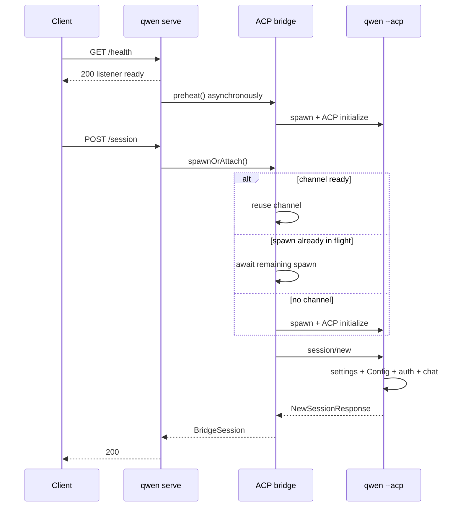

# Cold first-session profiling design

## Entscheidung

Der nächste Implementierungsabschnitt für #4748 ist Observability, nicht ein weiterer Startup-Cache oder ein neues Session-Protokoll. Er muss einen einzelnen kalten Request über den Daemon, den geteilten ACP-Channel und das ACP-Child hinweg erklären und dabei das aktuelle schnelle `/health`-Verhalten bewahren.

Die Implementierung verwendet die bestehenden OpenTelemetry-Request-/Bridge-Spans des Daemons und den ACP-`_meta`-Erweiterungspunkt wieder. Sie fügt hinzu:

- Timing für Bootstrap-Requests, damit das Warten auf eine Deferred-Runtime im späteren HTTP-Span enthalten ist, statt für Proxy-/Netzwerkzeit gehalten zu werden;
- einen Channel-Wait-Span pro Request, der aussagt, ob die Session einen bereiten Channel wiederverwendet hat, einem in-flight Spawn beigetreten ist oder on demand gespawnt hat;
- eine opaque Id für jeden ACP-Channel, damit ein Automatic-Preheat-Trace mit dem späteren Session-Trace korreliert werden kann, ohne eine falsche Parent/Child-Beziehung zu erfinden;
- Trace-Context-Injection bei ACP `session/new`;
- einen ACP-Child-`session/new`-Span mit begrenzten Stufendauern für Settings, Config-Initialisierung, Authentifizierung, Dateisystem-Setup, Session-Registrierung und Antwortkonstruktion;
- die ACP-Session-ID im bestehenden opt-in `QWEN_CODE_PROFILE_SESSION_START`-JSONL-Datensatz, damit dessen detaillierte `startChat`-Stufen mit dem Trace zusammengeführt werden können.

Dieser Abschnitt fügt keine Response-Header, öffentlichen JSON-Felder, Capability-Flags oder ein zweites Profiler-Format hinzu. Die ACP-Readiness bleibt eine separate P1-Client/API-Änderung, nachdem die P0-Aufschlüsselung verfügbar ist.

## Belege

Das nachgelagerte `0.19.3-preview.2`-Sample zeigte 2.534 ms P50 von Health-Erfolg bis Session-Erfolg und 1.713 ms P50 für `POST /session`. Die negative Korrelation zwischen Health-to-Request-Verzögerung und POST-Dauer passt zu einem ersten Request, der auf den Rest des automatischen Preheats wartet, aber Browser-Timing kann Proxy-, Daemon-, Channel- und Child-Arbeit nicht trennen.

Ein lokaler Dry-Run mit dem global installierten `qwen 0.19.10` bestätigte dieselbe Form:

| Szenario                                            |                    Beobachtung |
| --------------------------------------------------- | -----------------------------: |
| Prozessstart → Listener                            |                          203ms |
| Health, unmittelbar gefolgt von kaltem `POST /session` | 1.033ms Browser / 962ms Daemon |
| Bereits vorgeheiztes `POST /session` in einem separaten Lauf |   222ms Browser / 221ms Daemon |

Dies sind illustrative Einzelläufe, kein Akzeptanz-Benchmark. Sie zeigen, dass die aktuelle grobe Routen-Dauer ungefähr 700–800 ms verbirgt, die Channel-Wait, ACP-Child-Bootstrap oder beides sein können.

## Aktuelle Architektur

Die bestehende Observability liefert bereits:

- einen HTTP-Request-Span für `POST /session`, nachdem die Runtime-App den Request empfangen hat;
- Bridge-Spans für `channel.spawn`, `channel.initialize` und `session.new`;
- W3C-Trace-Context-Injection und -Extraction über reservierte ACP-`_meta`-Schlüssel, aktuell verwendet für Prompt-Dispatch;
- einen Opt-in-JSONL-Profiler für detaillierte `GeminiClient.startChat()`-Stufen.

Die fehlenden Teile sind jegliches Deferred-Runtime-Warten auf Bootstrap-Ebene vor diesem Request-Span, das Channel-Wait des aktuellen Requests, die Korrelation zu einem unabhängig gestarteten Preheat-Trace, die Propagation bei `session/new` und Timing vor `startChat` innerhalb des Childs.

## Design

### Parent-Daemon und Bridge

Wenn ein Nicht-Bootstrap-Request eintrifft, bevor die Deferred-Runtime gemountet ist, zeichnet die delegierende Bootstrap-App deren Wall-Clock-Ankunftszeit, das verbleibende Runtime-Warten und ob dieser Request das Laden der Runtime gestartet hat oder bereits von Health-/Fallback-Scheduling gestarteter Arbeit beigetreten ist, auf. Die Runtime-Telemetrie-Middleware erhält nach dem Mounten dasselbe Request-Objekt und datiert den HTTP-Span auf diese Ankunftszeit zurück. Routen-Dauer-Metriken verwenden dieselbe Grenze. Damit wird Browser-Dauer minus Daemon-Request-Dauer selbst auf dem kalten Deferred-Runtime-Pfad zu einer aussagekräftigen Proxy-/Netzwerk-Restgröße.

Bevor `doSpawn()` auf `ensureChannel()` wartet, klassifiziert es den synchronen Channel-Zustand:

- `reused`: ein nicht sterbender Channel ist bereits verfügbar;
- `joined`: `inFlightChannelSpawn` existiert bereits;
- `spawned_on_request`: weder ein aktiver Channel noch ein in-flight Spawn existiert.

Dann wrapt es das Warten in einen `channel.wait`-Bridge-Span. Die Produktions-Telemetrie-Implementierungen rufen ihren Callback synchron auf, sodass die Klassifikation gelesen und `ensureChannel()` aufgerufen wird, ohne die JavaScript-Event-Loop abzugeben.

Jedes neue `ChannelInfo` erhält eine zufällige UUID, bevor `channelFactory()` aufgerufen wird. Dieselbe Id wird nur an Spans für Folgendes angehängt:

- `channel.spawn`;
- `channel.initialize`;
- `session.new`, sobald der Channel bekannt ist.

Die Id ist diagnostische Trace-Daten, weder Metrik-Label noch öffentlicher Identifier. Automatisches Preheat und die erste Session können zu separaten Traces gehören; die Channel-Id verknüpft sie, ohne zu behaupten, dass der spätere HTTP-Request die frühere Arbeit verursacht hat.

`preheat()` erhält seinen eigenen `channel.preheat`-Bridge-Span. Eine Session, die ihm beitritt, hat einen `channel.wait`-Span, der nur das verbleibende Warten misst. `channel.initialize` und `channel.wait` überlappen in diesem Fall und dürfen nicht aufsummiert werden.

Innerhalb des bestehenden `session.new`-Spans injiziert die Bridge den aktiven Trace-Context in `NewSessionRequest._meta`. Der bestehende Injection-Helper entfernt bereits vom Client gelieferte reservierte Schlüssel, bevor Daemon-eigene Werte hinzugefügt werden. Nachdem das Child antwortet, zeichnet ein Span-Event die ACP-Session-ID für die Korrelation mit dem JSONL-Profiler auf.

### ACP-Child

`QwenAgent.newSession()` extrahiert den Daemon-Kontext aus dem Request und startet einen Child-`qwen-code.daemon.session_start`-Span unter dem Parent-Bridge-`session.new`-Span. Wenn der Kontext fehlt oder ungültig ist, greift das normale OTel-Root-Span-Verhalten.

Das Child zeichnet feste, nicht überlappende Dauern mit `performance.now()` auf:

| Stufe               | Grenze                                                                                                                                                                           |
| ------------------- | ---------------------------------------------------------------------------------------------------------------------------------------------------------------------------------- |
| `settings_load`     | `loadSettingsCached(cwd)`                                                                                                                                                          |
| `config_setup`      | `newSessionConfig()`, einschließlich `loadCliConfig()`, `config.initialize()` und dem normalen ersten `startChat()`                                                                       |
| `auth`              | `ensureAuthenticated()`                                                                                                                                                            |
| `file_system_setup` | `setupFileSystem()`                                                                                                                                                                |
| `session_register`  | `createAndStoreSession()`, normalerweise Konstruktion und Registrierung der ACP-`Session`; deren defensive Gemini-Initialisierung wird hier nur gemessen, wenn Config sie nicht bereits initialisiert hat |
| `response_build`    | Konstruktion von Modellen, Modi, Config-Optionen und Antwortobjekt                                                                                                                    |

Die Implementierungs-E2E zeigte `config_setup` bei etwa 200ms, wobei etwa 140ms vom bestehenden verschachtelten `startChat`-Profiler aufgezeichnet wurden. Das bestätigt, dass das normale `startChat()` während `config.initialize()` stattfindet, nicht während der späteren Session-Registrierung. Die JSONL-Session-ID macht diese verschachtelten Kosten zusammenführbar, ohne über Datei-Zeitstempel raten zu müssen. Eine spätere Optimierung kann die Config-Konstruktion von `config.initialize()` trennen, wenn repräsentative nachgelagerte Traces zeigen, dass die verbleibenden nicht zugeordneten Config-Kosten wesentlich sind; dies in diesem Abschnitt zu tun würde erfordern, einen Profiler durch eine Methode zu fädeln, die von new/load/resume/transcript-Pfaden geteilt wird.

### Attribut-Vertrag

Es werden nur feste Attributnamen und begrenzte Werte emittiert:

- `qwen-code.daemon.channel.path` = `reused | joined | spawned_on_request`;
- `qwen-code.daemon.runtime.path` = `started_on_request | joined`, wenn der Request das Deferred-Runtime-Gate überquert hat;
- `qwen-code.daemon.runtime.wait_ms` = endliches nicht-negatives verbleibendes Runtime-Warten;
- HTTP-Request-Dauer-Histogramm `runtime_path` = `started_on_request | joined` für Requests, die das Deferred-Runtime-Gate überquert haben, andernfalls `none`;
- `qwen-code.daemon.acp_channel.id` = vom Daemon erzeugte UUID;
- `qwen-code.daemon.session_start.<stage>_ms` = endliche nicht-negative Dauer;
- `qwen-code.daemon.session_start.failed_stage` = ein fester Stufenname;
- `session.id` = ACP-erzeugte Session-ID.

Es werden kein Workspace-Pfad, Prompt, Settings-Wert, Credential, Modellantwort oder Dateiinhalt hinzugefügt.

## Fehler, Parallelität und Kompatibilität

- OTel deaktiviert: bestehendes Verhalten ist unverändert; die Bridge läuft weiterhin durch ihren No-op-Telemetrie-Seam, und der Child-Profiler vermeidet Datei-Output, sofern das bestehende Umgebungs-Flag nicht aktiviert ist.
- Deferred-Runtime-Fehler: die Bootstrap-App liefert weiterhin den bestehenden Startup-Fehler; Timing-Metadaten sind prozesslokal und werden niemals in der Antwort offengelegt.
- Ungültige oder fehlende Trace-Metadaten: das Child erzeugt einen parentlosen Span oder keinen Span, und die Session-Erstellung läuft weiter.
- Telemetrie-Attribut-Fehler: Stufen-Attribute werden best-effort aufgezeichnet und können das Session-Ergebnis nicht ändern.
- Preheat-Fehler: `channel.wait` spiegelt den Retry-Pfad des Requests wider; bestehende Child-Cleanup- und Lazy-Retry-Semantik bleibt unverändert.
- Gleichzeitige erste Sessions: jeder Request erhält seinen eigenen `channel.wait`- und Child-Session-Span, während alle auf dieselbe Channel-Id verweisen können.
- Alte oder Nicht-Daemon-ACP-Clients: `_meta` ist optional, daher akzeptiert das Child weiterhin gewöhnliche `NewSessionRequest`-Nachrichten.
- Bestehende JSONL-Consumer: `sessionId` ist additiv und optional; bestehende Felder und Dateilayout ändern sich nicht.
- Channel-Teardown: die diagnostische UUID lebt nur auf `ChannelInfo` und verschwindet mit dem Channel; sie ändert weder Wiederverwendung noch Idle-Timeout noch Kill-Logik.

## Für diesen Abschnitt verworfene Alternativen

### Eine eigene Profil-Id und ACP-Response-Envelope

Ein zweites Timing-Schema in `NewSessionResponse._meta` zurückzugeben würde OTel duplizieren, Validierung/Versionierung erfordern und zwei Quellen der Wahrheit schaffen. Der W3C-Kontext trägt bereits Kausalität, und die Channel-UUID behandelt den einen bewusst separaten Preheat-Trace.

### `Server-Timing` und `X-Qwen-Profile-Id`

Diese würden die reine Browser-Diagnose unterstützen, erfordern aber Proxy-Header-Durchreiche und CORS-Offenlegungsentscheidungen außerhalb dieses Repositories. Der Daemon-Request-Span und die bestehende Routen-Dauer liefern bereits die Serverzeit. Header-Arbeit kann folgen, wenn nachgelagtes Tracing weiterhin nicht verfügbar bleibt.

### `/health` auf ACP warten lassen

Das verschiebt Latenz in die Readiness und riskiert Health-Probe-Regressionen. `/health` bleibt Listener-/Liveness-Readiness; ACP-Readiness ist ein separater zukünftiger Capability-gated-Vertrag.

### Config teilen oder eine Session vorab erstellen

Beides ändert Isolations- und Lifecycle-Semantik, bevor das Profiling eine dominante Stufe identifiziert. Sie sind ausdrücklich out of scope.

## Verifikation

Fokussierte Unit-Tests müssen beweisen:

- `session/new` erhält Daemon-eigene Trace-Metadaten;
- ein Session-Request, der das Deferred-Runtime-Gate überquert, startet seinen HTTP-Span bei der Bootstrap-Ankunft und zeichnet auf, ob er das Laden der Runtime gestartet hat oder ihm beigetreten ist;
- `channel.wait` berichtet die Pfade spawned, joined und reused;
- eine Channel-UUID verknüpft Spawn-, Initialize- und Session-Spans;
- das Child extrahiert den Parent-Kontext und zeichnet alle festen Stufen auf;
- eine fehlgeschlagene Stufe wird aufgezeichnet und der ursprüngliche Fehler bleibt erhalten;
- das Session-Start-JSONL enthält die Session-ID, wenn angegeben, und bleibt abwärtskompatibel, wenn sie fehlt;
- deaktivierte Telemetrie oder fehlerhafte Metadaten ändern das Session-Verhalten nicht.

Der E2E-Dry-Run vergleicht zwei Fälle mit demselben Workspace und derselben Auth:

1. Health unmittelbar gefolgt von `POST /session`;
2. Health gefolgt von explizitem Preheat, dann `POST /session`.

Für beide wird der Session-Erfolg verifiziert und der Trace-Baum inspiziert. Der kalte Fall muss den Request-`channel.wait`-Pfad und die Child-Stufen-Attribute enthalten; der vorgeheizte Fall muss `reused` berichten. Performance-Schlussfolgerungen erfordern mindestens 30 serialisierte Kaltstarts in der repräsentativen nachgelagerten Umgebung und werden nicht aus lokalen Einzellauf-Timings abgeleitet.

## Implementierungsgrenze und Review-Gate

Die Produktionsänderungen beschränken sich auf den Deferred-Runtime-Request-Handoff und die Telemetrie-Middleware in `run-qwen-serve`, den bestehenden Telemetrie-Seam in `packages/acp-bridge`, ACP-`newSession` und den bestehenden Core-Session-Start-Profiler. Keine Änderungen am Session-/Config-/Auth-Verhalten.

Die paketübergreifenden nachgelagerten Consumer, die für dieses Design geprüft wurden, sind:

- Daemon-Bridge-Konstruktion in `run-qwen-serve.ts` und Test-/Embed-Bridge-Telemetrie-Implementierungen;
- Deferred-Runtime-Routen-Zulassung und Request-Telemetrie-/Metrik-Consumer;
- alle Aufrufer von `AcpSessionBridge.spawnOrAttach()`, die dieselbe `BridgeSession`-Form erhalten;
- ACP-Clients außer dem Daemon, die `_meta` weglassen dürfen;
- Session-Start-Profiler-Tests und JSONL-Reader, für die `sessionId` optional ist.

Da dies die Grenzen core/bridge/CLI überschreitet, erfordert es Maintainer-Review, auch wenn die Produktionslogik-Änderung bewusst klein ist.
