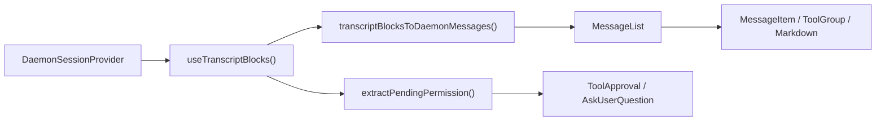
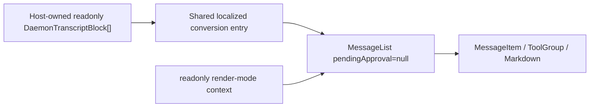

# Design for Read-only Daemon Transcript Rendering in WebShell

## Dokumentstatus

- Status: Implementiert
- Datum: 2026-07-14
- Geltungsbereich: `packages/web-shell`
- Eingabe: `readonly DaemonTranscriptBlock[]`
- Ausgabe: eine Read-only-Transkript-Ansicht, die die Präsentationsfähigkeiten der WebShell-`MessageList` erbt

## 1. Hintergrund

Die WebShell hat bereits einen vollständigen Daemon-Transkript-Rendering-Pfad, der aktuell aber nur indirekt über `App` oder `ChatPane` in der Split-Ansicht verwendet werden kann. Die Komponente liest zuerst Transkript-Blöcke aus dem `DaemonSessionProvider`, wandelt diese Blöcke in die internen Nachrichten der WebShell um und übergibt sie schließlich an die `MessageList` zum Rendern.

Der neue Anwendungsfall hält bereits ein `DaemonTranscriptBlock[]` direkt und benötigt nur die Nachrichten-Styling- und Rendering-Fähigkeiten der WebShell, um historischen Content anzuzeigen. Er muss keine Daemon-Session-Verbindung aufbauen und darf keine Session-Mutationen ausführen. Interaktionen, die ausdrücklich nicht zum Ziel gehören, sind Tool-Freigabe, `AskUserQuestion`, Retry, Branch, Prompt-Übermittlung und das Öffnen von Panels, die den Session-Zustand ändern.

Wenn der Host das Ergebnis von `transcriptBlocksToDaemonMessages` direkt konsumiert und interne Komponenten zusammensetzt, legt er das private `DaemonMessage`-Modell, die Kontexte und die CSS-Randbedingungen der WebShell offen. Er würde auch vom unterstützten Rendering abweichen, wenn die `MessageList` Funktionen hinzugewinnt. `@qwen-code/web-shell` muss daher einen stabilen öffentlichen Einstiegspunkt bereitstellen.

## 2. Ziele

1. Eine öffentliche React-Komponente hinzufügen, die `readonly DaemonTranscriptBlock[]` direkt entgegennimmt und rendert.
2. Das bestehende `transcriptBlocksToDaemonMessages()` und dieselbe `MessageList` wiederverwenden, damit User-, Assistant-, Thinking-, Tool-, Subagent-, Plan-, Status-, Markdown-, Timeline- und Virtual-Scrolling-Fähigkeiten für lange Sessions automatisch mit der `MessageList` weiterentwickeln.
3. Der Komponente erlauben, unabhängig ohne `DaemonWorkspaceProvider`, `DaemonSessionProvider` oder Netzwerkverbindung zu rendern.
4. Innerhalb der Read-only-Grenze keine Daemon-/Session-Mutation aufrufen und keine Antwort-UI für ausstehende Berechtigungen oder `AskUserQuestion` anzeigen.
5. Hauptsächlich Exporte hinzufügen, ohne die Runtime-Pfade, Standards oder das DOM-Verhalten des bestehenden `WebShell`, `WebShellWithProviders`, `App` oder `ChatPane` zu ändern.
6. Vollständige Komponenten-Unit-Tests hinzufügen und die bestehende WebShell-Test-Suite, Build, Lint und Typecheck bestehen.

## 3. Nicht-Ziele

- Transkript-Abruf, Paginierung, Caching oder SSE-Subscriptions hinzufügen; der Host liefert die Blöcke.
- Einen Read-only-Modus in die bestehenden `WebShellProps` einfügen oder konditionale `readOnly`/`blocks`-Dual-Datenquellen in `App` hinzufügen.
- Die internen Typen `MessageList`, `Message` oder `DaemonMessage` exportieren.
- Ungelöste Tool-Freigaben oder `AskUserQuestion` anzeigen oder behandeln.
- Den Composer der App-Shell, Queued-Prompts, Streaming-Status, Sidebar, Split-Ansicht, Dialoge, Artefakt-Right-Panel oder ähnliche Fähigkeiten bereitstellen. Die in `MessageList` eingebaute Session-Timeline bleibt erhalten.
- Separate Session-Artefakte aus Blöcken ableiten oder laden. App-Level-Turn-Output-Cards für Dateiänderungen, Artefakte und geplante Aufgaben sind out of scope.
- Interaktionen verhindern, die nur den lokalen Präsentationszustand ändern, wie Kopieren, Tool ein-/ausklappen, abgeschlossenen Turn ausklappen, Tabellenfilterung oder Timeline-Navigation.

## 4. Terminologie und die Read-only-Grenze

In diesem Design bedeutet „Read-only" **kein Lesen oder Ändern des Daemon-/Session-Runtime-Zustands**. Es bedeutet nicht, `pointer-events: none` auf das gesamte DOM zu setzen.

| Kategorie                     | Verhalten                                                                 | Beibehalten                            |
| ---------------------------- | ------------------------------------------------------------------------ | ----------------------------------- |
| Passive Präsentation         | Text, Markdown, Bilder, Diff, Shell-Ausgabe, Tool-/Subagent-Status        | Ja                                 |
| Lokales Betrachten                | Kopieren, Einklappen, Ausklappen, virtuelles Scrollen, Timeline, Tabellensortierung/-filter      | Ja                                 |
| Host-angepasste Präsentation | Markdown-/Code-Block-Renderer, Nachrichten-Content-Renderer                   | Ja; der Host besitzt sämtliche Seiteneffekte |
| Gewöhnliche externe Links      | Neues-Fenster-Navigation nach Browser-sicherer URL-Transformation              | Ja                                 |
| WebShell semantische Navigation | `qwen-session://` dispatcht das globale `qwen:open-session`-Event        | Nein; als nicht-interaktiver Text rendern  |
| Session-Mutation             | Prompt senden, Abbrechen, Retry, Branch, Rewind, Modell/Modus wechseln            | Nein                                  |
| Berechtigungs-Mutation          | Tool freigeben/ablehnen, `AskUserQuestion` übermitteln/ignorieren                     | Nein                                  |
| Externes Datenladen        | Von der Komponente initiierter Session-Attach oder Transkript-/Artefakt-/Task-/MCP-Abruf | Nein                                  |

Diese Grenze bewahrt das `MessageList`-Leseerlebnis und stellt gleichzeitig sicher, dass die Komponente selbst keine Fähigkeit hat, in den Daemon zu schreiben.

## 5. Ist-Zustand und Aufrufer-Map

| Modul                                                       | Aktuelle Verantwortung                                                                       | Beziehung zu diesem Design                                         |
| ------------------------------------------------------------ | -------------------------------------------------------------------------------------------- | ------------------------------------------------------------------- |
| `packages/sdk-typescript/src/daemon/ui/types.ts`             | Definiert die `DaemonTranscriptBlock`-Union                                                    | Öffentliches Eingabemodell für die neue Komponente                            |
| `packages/web-shell/client/adapters/transcriptToMessages.ts` | Kombiniert Blöcke zu WebShell-`DaemonMessage[]`                                              | Direkt wiederverwenden; keinen neuen Konverter erzeugen                       |
| `packages/web-shell/client/hooks/useMessages.ts`             | Liest Blöcke aus einem Session-Hook und liefert lokalisierte Konvertierungsoptionen                   | Einen geteilten reinen Konvertierungseinstieg extrahieren, der externe Blöcke akzeptiert |
| `packages/web-shell/client/components/MessageList.tsx`       | Turn-Einklappen, Tool-/Subagent-Gruppen, Timeline, virtuelles Scrollen und Rendering pro Nachricht | Die einzige Listen-Implementierung, geteilt vom neuen und bestehenden Pfad   |
| `packages/web-shell/client/components/MessageItem.tsx`       | Dispatcht konkrete Renderer nach Nachrichtenrolle                                                | Keine Änderungen nötig                                                   |
| `packages/web-shell/client/App.tsx`                          | Vollständige Single-Session-WebShell, Freigaben, Composer, Side-Panels                               | Bestehender Pfad bleibt unverändert                                     |
| `packages/web-shell/client/components/ChatPane.tsx`          | Vollständige interaktive Session in der Split-Ansicht                                                       | Bestehender Pfad bleibt unverändert                                     |
| `packages/web-shell/client/index.tsx` / `index.ts`           | Paket-Runtime-/Quell-Exporte                                                               | Die neue Komponente und den Typ exportieren                                   |

Der aktuelle primäre Pfad ist:



Der neue Read-only-Pfad umgeht den Session-Provider und den Berechtigungs-Branch:



Im Haupt-WebShell-Editor werden `/tasks` und `/mcp` innerhalb von `App` abgefangen. Sie aktualisieren nur den Dialog-React-Zustand, rufen nicht `sendPrompt()` auf und schreiben nicht in die Session-JSONL. Persistierte Transkripte enthalten daher keinen Sentinel für diese zwei lokalen Panels, und der neue Einstieg fügt keine entsprechende Erkennungs- oder Filterverzweigung hinzu.

## 6. Öffentliche API

Eine Komponente namens `WebShellTranscript` hinzufügen, exportiert aus dem `@qwen-code/web-shell`-Paket-Root.

```ts
export interface WebShellTranscriptProps {
  /** Ordered transcript blocks from one logical session. */
  blocks: readonly DaemonTranscriptBlock[];

  theme?: WebShellTheme;
  language?: 'en' | 'zh-CN' | 'zh' | 'zh-cn';
  className?: string;
  style?: React.CSSProperties;
  chatMaxWidth?: number;
  workspaceCwd?: string;

  compactThinking?: boolean;
  collapseCompletedTurns?: boolean;
  markdownTableMode?: MarkdownTableMode;
  virtualScrollThreshold?: number;
  markdown?: WebShellMarkdownCustomization;

  composerTagIcons?: WebShellComposerTagIconMap;
  renderToolHeaderExtra?: ToolHeaderExtraRenderer;
  parseUserMessageContent?: UserMessageContentParser;
  renderUserMessageContent?: UserMessageContentRenderer;
  renderComposerTag?: ComposerTagRenderer;
  renderComposerTagTooltip?: ComposerTagRenderer;
  renderAssistantTurnFooter?: AssistantTurnFooterRenderer;
}

export function WebShellTranscript(
  props: WebShellTranscriptProps,
): React.ReactElement;
```

Anmerkungen:

- `blocks` ist erforderlich und wird weder kopiert noch verändert. Aufrufer sollten Block-Sessions und Reihenfolge innerhalb des Arrays konsistent halten.
- Visuelle Props verwenden die Namen und Typen aus `WebShellProps` wieder und vermeiden so einen zweiten Satz Konfigurationssemantik für dieselben Fähigkeiten.
- `onComposerTagClick`, `onRetryClick`, `onBranchSession`, `onTurnOutputOpen`, Berechtigungs-Callbacks oder Composer-Callbacks nicht offenlegen.
- `theme` hat den Standard `dark`. Wenn `language` weggelassen wird, die URL-/Browser-Sprach-Auflösungsregeln der WebShell verwenden. `chatMaxWidth` hat den Standard 1000px.
- `compactThinking` hat den Standard `false` und `collapseCompletedTurns` den Standard `true`, analog zum bestehenden `WebShell`.
- Die Komponente behandelt das Transkript als statisch/bereits abgespielt und übergibt `isResponding={false}` an die `MessageList`. Live-Streaming liegt außerhalb des aktuellen API-Umfangs.

Beispiel:

```tsx
import { WebShellTranscript } from '@qwen-code/web-shell';
import type { DaemonTranscriptBlock } from '@qwen-code/sdk/daemon';

export function HistoryView({
  blocks,
}: {
  blocks: readonly DaemonTranscriptBlock[];
}) {
  return (
    <WebShellTranscript
      blocks={blocks}
      theme="dark"
      language="zh-CN"
      workspaceCwd="/workspace/project"
      style={{ height: 640 }}
    />
  );
}
```

Der Host muss der Komponente eine nutzbare Höhe geben. Die Komponente selbst bewahrt das `height: 100%`, das interne Scrollen und das Content-Breiten-Verhalten der WebShell.

## 7. Detaildesign

### 7.1 Geteilte lokalisierte Konvertierung

`transcriptBlocksToDaemonMessages()` als den einzigen Block-zu-Nachricht-Adapter beibehalten. Eine interne reine Funktion in `useMessages.ts` extrahieren, zum Beispiel:

```ts
export function transcriptBlocksToLocalizedMessages(
  blocks: readonly DaemonTranscriptBlock[],
  t: Translator,
): Message[];
```

Diese Funktion nur aus ihrem internen Paketmodul exportieren, damit die neue Komponente sie wiederverwendet; sie nicht aus dem Paket-Root offenlegen.

Die Funktion assembliert nur die lokalisierten Labels, die aktuell von `useMessages()` verwendet werden, und ruft dann den bestehenden Adapter auf. Sowohl das bestehende `useMessages()` als auch die neue Komponente rufen sie auf, und verhindern so Drift im Wortlaut für Prompt-Abbruch, Branch, Mid-Turn-Einfügung und unterbrochene Streams.

Dies ist die einzige interne Umstrukturierung, die im bestehenden Rendering-Pfad erforderlich ist. Funktionseingabe, -ausgabe und bestehende Konvertierungsergebnisse bleiben unverändert, und die Block-Kombinationsregeln des Adapters werden nicht geändert.

### 7.2 `WebShellTranscript`-Komponentenstruktur

`packages/web-shell/client/components/WebShellTranscript.tsx` mit folgender interner Sequenz hinzufügen:

1. Theme und Sprache auflösen und einen Translator erzeugen.
2. `blocks` mit `useMemo` in `Message[]` konvertieren.
3. Denselben Nachrichten-Ebene-Customization-Wert wie das bestehende App erzeugen.
4. Die Theme-, i18n-, Customization-, Compact-Mode-, Read-only-Render-Mode- und Portal-Kontexte der WebShell mounten.
5. Eine unabhängige Wurzel mit `data-web-shell-root` und `data-web-shell-shadcn` erzeugen, wobei Theme-Klassen, Basis-Variablen, Fonts, Hintergrund und CSS-Isolationsregeln des Apps wiederverwendet werden.
6. Dieselbe `MessageList` rendern.

Die wichtigen festen `MessageList`-Eingaben sind:

```tsx
<MessageList
  messages={messages}
  pendingApproval={null}
  isResponding={false}
  workspaceCwd={workspaceCwd ?? ''}
  virtualScrollThreshold={virtualScrollThreshold}
/>
```

Diese Aktions-Props niemals übergeben:

- `onShowContextDetail`
- `onRetryClick`
- `onBranchSession`
- `onReviewChanges`
- `onOpenArtifact`
- `onOpenScheduledTask`
- `onTurnOutputOpen`

Keine Loading-, Catch-up-, Tail- oder Turn-Output-Daten übergeben und so jegliche Abhängigkeit vom Verbindungszustand des Apps und von externen Ressourcenmodellen vermeiden.

### 7.3 Isolierung interaktiver Renderer

Nur `pendingApproval=null` an die `MessageList` zu übergeben garantiert das Read-only-Verhalten nicht vollständig. Session-Links in Goal-Status, Markdown und Tool-Ergebnissen verwenden keine `MessageList`-Callbacks; sie dispatchen globale semantische Events an `window` und könnten potenziell den Footer oder die aktive Session einer anderen WebShell auf derselben Seite ändern.

Einen paketinternen Transkript-Render-Mode-Kontext in `client/transcriptRenderMode.ts` mit dem Standardwert `interactive` hinzufügen. Bestehendes `App` und `ChatPane` benötigen keinen neuen Provider, daher bleibt ihr Verhalten unverändert. `WebShellTranscript` setzt den Wert auf `readonly`. Der Read-only-Modus wendet nur diese Einschränkungen an:

- Text und Stil von `qwen-session://`-Links beibehalten, aber `qwen:open-session` nicht dispatchen.
- `GoalStatusMessage` dispatcht `GOAL_STATUS_ACTIVE_EVENT` nicht.
- Gewöhnliche HTTPS-Links oder lokale Betrachten-Interaktionen wie Kopieren, Einklappen und Sortieren nicht abfangen.

Dieser Kontext ändert nur semantische Event-Ausgänge in `Markdown`, `ToolGroup` und `GoalStatusMessage`, und sein Standard ist auf `interactive` festgelegt. Dies vermeidet das Hinzufügen eines `readOnly`-Props, das durch jeden Renderer ab der `MessageList` durchgefädelt werden müsste. Neue Unit-Tests müssen sowohl beweisen, dass das Standard-Interaktivverhalten unverändert ist, als auch, dass das Read-only-Verhalten unterdrückt wird.

### 7.4 Theme, CSS und Portals

Der WebShell-Bibliothek-Build injiziert Komponentens CSS unter `[data-web-shell-root]` oder `[data-web-shell-portal-root]` und scopen es dort. Die neue Komponente muss ihre eigene WebShell-Wurzel erzeugen; andernfalls kann die `MessageList` DOM erzeugen, auf das die CSS-Modul-Regeln nicht matchen.

Timeline-Tooltips und fortgeschrittene Markdown-Tabellen verwenden Portals. Um diese Fähigkeiten vollständig zu erben, verwendet die neue Komponente einen Portal-Host-Lebenszyklus, der dem des Apps entspricht:

- Beim Mount einen Knoten mit `data-web-shell-portal-root` und `data-web-shell-shadcn` an `document.body` anhängen.
- Theme-Klasse und CSS-Variablen der Wurzel synchronisieren.
- Den Knoten über `WebShellPortalRootContext` bereitstellen.
- Beim Unmount den Knoten und seinen Observer/Listener entfernen.

Diesen Lebenszyklus in der neuen Komponente halten, statt den bestehenden Portal-Code des Apps zu refaktorieren, und die Regressionsfläche des bestehenden Verhaltens auf den neuen Einstieg begrenzen. Während SSR nicht auf `document` zugreifen; das Portal erst nach dem Client-Mount aktivieren.

### 7.5 Fehlerisolierung

Der neue Einstieg hat eine äußere öffentliche Grenze und eine innere Content-Komponente. Block-Konvertierung, Provider-/Portal-Initialisierung und `MessageList` finden alle in einem Kind der Grenze statt, sodass sichergestellt ist, dass Fehler in jeder dieser Stufen denselben `RootErrorFallback` erreichen wie der öffentliche WebShell-Einstieg. Jede Nachricht bleibt durch die eigene Grenze von `MessageItem` isoliert, sodass ein Fehler in einem einzelnen Markdown-, KaTeX-, Mermaid- oder Tool-Renderer nicht das gesamte Transkript leert.

### 7.6 Block-Rendering-Strategie

Alle Strategien verwenden weiterhin den bestehenden Adapter; in der neuen Komponente keinen zweiten Switch hinzufügen.

| `DaemonTranscriptBlock.kind` | Read-only-Ergebnis                                                                        |
| ---------------------------- | --------------------------------------------------------------------------------------- |
| `user`                       | User-Nachrichten, Bilder und Eingabe-Annotationen                                            |
| `assistant`                  | Assistant-Markdown; aufeinanderfolgende Blöcke zusammengeführt; Subagent-Content nach Parent zugeordnet     |
| `thought`                    | Thinking-Nachrichten; aufeinanderfolgende Blöcke zusammengeführt                                            |
| `tool`                       | Bestehende Cards für Tool-Gruppen, diff/read/shell/fetch/todo/sub-agent                    |
| `shell`                      | Dem nächstgelegenen Ausführungs-Tool zuordnen; bestehender Raw-Shell-Fallback, wenn nicht verfügbar |
| `user_shell`                 | User-Shell-Befehl/-Ausgabe                                                               |
| `status` / `debug`           | Plan- oder System-/Statusnachricht                                                           |
| `error`                      | Fehler-Systemnachricht ohne Retry-Aktion                                               |
| `prompt_cancelled`           | Lokalisierter Abbruchstatus                                                           |
| ungelöstes `permission`      | Nicht konvertieren, anzeigen oder einen Aktionseinstieg bereitstellen                                     |
| gelöstes `permission`        | Bestehende historische Tool-Platzhalter-/Ergebnisregeln des Adapters                      |
| `AskUserQuestion`-Berechtigung | Das Formular nicht anzeigen; historische Ergebnisse nur zeigen, wenn ein späterer echter Tool-Block existiert  |

### 7.7 Updates und Performance

- Die O(n)-Konvertierung nur erneut ausführen, wenn sich die `blocks`-Identität oder die Sprache ändert.
- `MessageList` behält ihre bestehende Memoization, Turn-Gruppierung und Virtual-Scrolling-Schwelle.
- Blöcke nicht tiefenkopieren oder für jeden Block einen neuen React-Provider erzeugen.
- Ein Aufrufer, der häufig identitätsneue Arrays mit identischem Inhalt liefert, löst die Konvertierung erneut aus. Das ist akzeptabel und entspricht dem aktuellen `useTranscriptBlocks()`-Update-Modell.
- In diesem Release keinen inkrementellen Adapter hinzufügen. Eine inkrementelle Konvertierung nur dann separat entwerfen, wenn Messungen zeigen, dass Updates großer externer Transkripte ein Flaschenhals sind.

## 8. Kompatibilität und Regressionskontrolle

### 8.1 Bestehende Pfade bleiben unverändert

- `WebShellProps` erhält keine erforderlichen Felder und ändert keine Standards.
- `WebShell` und `WebShellWithProviders` rendern weiterhin `App`.
- `App` und `ChatPane` lesen den Session-Zustand weiterhin aus ihren jeweiligen Providern/Hooks.
- Freigabe-Overlay, Composer, Sidebar, Split-Ansicht und Artefakt-Panel laufen nicht durch die neue Komponente.
- `MessageList` erhält keinen `readOnly`-Prop-Branch. Der neue Aufrufer etabliert das Read-only-Verhalten, indem er `pendingApproval=null` übergibt, Aktions-Callbacks weglässt und einen internen Render-Mode-Kontext verwendet, dessen Standard interaktiv bleibt, um die wenigen globalen semantischen Events zu isolieren.

### 8.2 Paket-Exporte

Sowohl `client/index.tsx` als auch `client/index.ts` aktualisieren, um zu exportieren:

```ts
export { WebShellTranscript } from './components/WebShellTranscript';
export type { WebShellTranscriptProps } from './components/WebShellTranscript';
```

Beide Barrels müssen sich ändern, damit die aktuellen dualen Runtime-Einstiegs- und Deklarations-/Quell-Einstiegspfade nicht „zur Laufzeit exportiert, aber in den Typdeklarationen fehlend" erzeugen. Keinen Paket-Subpfad-Export hinzufügen.

### 8.3 Sicherheit

- Der neue Einstieg importiert weder `useActions()`, `useTranscriptStore()`, `useConnection()` noch `fetch`.
- Ausstehender Berechtigungs-Content gelangt nicht in einen interaktiven Renderer.
- Status-Nachrichten-Content weder inspizieren noch umschreiben. Der Dialog-Zustand für `/tasks` und `/mcp` fehlt in persistierten Transkripten naturgemäß.
- Der Read-only-Render-Mode dispatcht keine Session-/Goal-Global-Events, die eine andere WebShell auf derselben Seite beeinflussen könnten.
- Markdown-URL- und HTML-Behandlung verwenden weiterhin den bestehenden WebShell-Sanitizer/-Transform; kein `dangerouslySetInnerHTML` oder einen anderen Bypass hinzufügen.
- Custom-Renderer sind Host-Code. Seiteneffekte, die ein Host-Renderer ausführt, liegen außerhalb der garantierten Read-only-Grenze der Komponente, und das README muss dies explizit angeben.

## 9. Testdesign

### 9.1 Unit-Tests für den Vertrag der neuen Komponente

`WebShellTranscript.test.tsx` hinzufügen und dabei `MessageList` mocken, um die Grenze und Verdrahtung zu verifizieren:

1. Der geteilte lokalisierte Adapter konvertiert Blöcke in Nachrichten mit der korrekten Reihenfolge und dem korrekten Inhalt.
2. `pendingApproval` ist immer `null`.
3. Session-Mutations-, Berechtigungs-, Retry-, Branch- und Turn-Output-Callbacks sind alle weggelassen.
4. `isResponding` hat den Standard `false`, und Workspace- und Virtual-Scroll-Konfiguration werden korrekt weitergereicht.
5. Theme, Sprache, Compact-/Collapse-Verhalten und Nachrichten-Customization gelangen in die korrekten Kontexte.
6. Änderungen an Blöcken oder Sprache regenerieren Nachrichten, ohne alten Content zu duplizieren.
7. Leere Blöcke rendern eine leere Liste, ohne zu werfen.

### 9.2 DOM-Integrations-Unit-Tests hinzufügen

`WebShellTranscript.dom.test.tsx` mit der echten `MessageList` hinzufügen:

1. Erfolgreich in einem React-Baum ohne Daemon-Provider rendern.
2. Repräsentative User-, Assistant-Markdown-, Thought-, Tool-, Subagent-, Plan-, Status-, Error- und Prompt-Cancelled-Blöcke gelangen in das entsprechende WebShell-DOM.
3. Lokales Ein-/Ausklappen, Kopieren oder Timeline-Navigation funktionieren weiterhin und beweisen, dass `MessageList`-Fähigkeiten wiederverwendet werden.
4. Eine ungelöste gewöhnliche Berechtigung erzeugt kein Freigabe-Panel.
5. Ein ungelöstes `AskUserQuestion` erzeugt keine Options-, Eingabe-, Submit- oder Ignore-UI.
6. Gelöste historische Tool-/AskUser-Ergebnisse folgen den bestehenden Präsentationsregeln des Adapters.
7. Read-only-Session-Links und Goal-Status dispatchen keine globalen semantischen Events; entsprechende bestehende Komponenten-Tests beweisen weiterhin, dass das Standard-Interaktivverhalten unverändert ist.
8. Dark-/Light-Klassen, Sprache, lokalisierter Text, Chat-Maximalbreite und CSS-Wurzel-Marker sind korrekt.
9. Die Portal-Wurzel wird korrekt gemountet und unmountet, und Portal-Content liegt unter der gescopen Wurzel.
10. Wenn ein einzelner Custom-Renderer wirft, wird der eingebaute Renderer-Fallback verwendet und der Rest der Nachricht bleibt erhalten.

### 9.3 Tests für geteilte Konvertierung und Export

- `useMessages`-/Adapter-Tests erweitern, um zu beweisen, dass der bestehende Hook und externe Blöcke exakt dieselben lokalisierten Optionen verwenden.
- `index.test.tsx` oder Build-Artefakt-Tests erweitern, um zu verifizieren, dass der benannte Runtime-Export existiert.
- Nach dem Build verifizieren, dass `dist/types/index.d.ts` Exporte für `WebShellTranscript` und seine Props enthält, und so Drift zwischen den zwei Einstiegsdeklarationen verhindern.

### 9.4 Bestehende Regressions-Suite

Die minimal erforderliche Verifikationssequenz nach der Implementierung ist:

```bash
cd packages/web-shell
npm run build
npx vitest run --config vitest.config.ts \
  client/components/WebShellTranscript.test.tsx \
  client/components/WebShellTranscript.dom.test.tsx \
  client/hooks/useMessages.test.ts \
  client/adapters/transcriptToMessages.test.ts \
  client/components/MessageList.test.ts \
  client/components/MessageList.dom.test.tsx \
  client/components/messages/Markdown.test.ts \
  client/components/messages/ToolGroup.test.tsx \
  client/components/messages/SystemMessage.test.tsx \
  client/index.test.tsx
npm test
npm run format:check
npm run lint
npm run typecheck

cd ../..
npm run build
npm run typecheck
```

`npm test` ist die bestehende vollständige WebShell-Suite und muss für diese Änderung bestehen. Die Änderung fügt keine eigenständige Seite hinzu und ändert nicht das App-/Daemon-Protokoll des bestehenden Playwright-Smoke-Tests, daher wird kein Browser-E2E-Test hinzugefügt. `WebShellTranscript.dom.test.tsx` deckt das echte DOM-Verhalten ab.

## 10. Implementierungsschritte

1. Die geteilte lokalisierte Block-Konvertierung in `useMessages.ts` extrahieren und dabei die aktuelle Hook-Ausgabe bewahren.
2. Einen internen Transkript-Render-Mode-Kontext hinzufügen und ihn an den Session-Link-/Goal-Event-Ausgängen konsumieren; `interactive` als Standard bewahren.
3. `WebShellTranscript` und seine Props hinzufügen und dabei die Wurzel-/Provider-/Portal-/`MessageList`-Verdrahtung implementieren.
4. Runtime- und Typ-Exporte zu beiden öffentlichen Barrels hinzufügen.
5. `packages/web-shell/README.md` mit einem Read-only-Integrationsbeispiel, der Host-Höhen-Anforderung und der Read-only-Grenze aktualisieren.
6. Vertrags-, DOM-, Interaktions-Isolations- und Export-/Typdeklarations-Tests hinzufügen.
7. Gezielte Tests, die vollständige WebShell-Test-Suite, Build, Lint und Typecheck ausführen.
8. Das vollständige Diff gemäß der Repository-Anleitung reviewen; Schritt 7 nach jedem Fix erneut ausführen.

## 11. Alternativen

### 11.1 `blocks` und `readOnly` zum bestehenden `WebShell` hinzufügen

Abgelehnt. `App` konsumiert aktuell mehrere Daemon-Hooks bedingungslos und verwaltet Freigaben, Composer, Session, Sidebar und Panels. Duale Datenquellen würden bedingte Verzweigungen in ganz `App` hinzufügen, Provider erfordern und gleichzeitig gegen Mutationen absichern. Seine Regressionsfläche ist viel größer als diese Anforderung.

### 11.2 `MessageList` öffentlich exportieren

Abgelehnt. Aufrufer würden weiterhin vom privaten `Message[]`, mehreren Kontexten, CSS-Wurzel-Konventionen und Portal-Konventionen abhängen, und das interne Modell würde zu einer langfristigen öffentlichen API.

### 11.3 Den Renderer für die Read-only-Nutzung duplizieren

Abgelehnt. Duplizierung würde Markdown-, Tool-/Subagent-, Turn-Einklapp-, Timeline- und Virtual-Scrolling-Verhalten sofort forken und die Anforderung verfehlen, die Rendering-Fähigkeiten der `MessageList` zu erben.

### 11.4 Deaktiviertes Permission/AskUserQuestion in der neuen Komponente anzeigen

Abgelehnt. Deaktivierte Formulare erzeugen weiterhin interaktive Semantik und zusätzliche Zustands-Branches und verleiten Benutzer zu der Annahme, sie könnten in einer historischen Ansicht antworten. Ausstehende Berechtigungen werden in diesem Release verborgen; nachfolgende Tool-Blöcke tragen die historischen Ergebnisse.

## 12. Risiken und Gegenmaßnahmen

| Risiko                                                       | Gegenmaßnahmen                                                                                                |
| ---------------------------------------------------------- | --------------------------------------------------------------------------------------------------------- |
| Lokalisierte Konvertierung driftet zwischen dem neuen Einstieg und App  | Beide rufen denselben lokalisierten Konvertierungs-Helper auf                                                            |
| Portal verfehlt den CSS-Scope                                | Separate `data-web-shell-portal-root` erzeugen, Variablen synchronisieren und mit DOM-Tests abdecken           |
| Versehentliche Daemon-Mutation                                 | Die neue Komponente importiert keine Aktions-Hooks und legt keine Mutations-Callbacks offen; Vertragstests zurren dies fest     |
| App-lokaler Dialog-Zustand wird für Transkript-Daten gehalten     | Explizit dokumentieren, dass `/tasks` und `/mcp` keine JSONL schreiben; der neue Einstieg kopiert keinen App-Dialog-Zustand |
| Globale semantische Events beeinflussen eine andere WebShell auf der Seite | Der Read-only-Render-Mode unterdrückt Session-/Goal-Events; Regressions-Tests decken das Standardverhalten ab             |
| Ein neuer Block-Kind hat keine Präsentation                       | Ihn weiterhin über den geteilten Adapter unterstützen; keinen Switch in der Komponente duplizieren             |
| Paket-Runtime- und Typ-Exporte driften auseinander                   | Beide Barrels aktualisieren und die gebauten Deklarationen inspizieren                                                    |
| Neuberechnungskosten großer Transkripte                        | `useMemo` plus bestehendes virtuelles Scrollen; inkrementelle Konvertierung verschieben, bis sie durch Messungen gestützt wird   |
| Custom-Renderer führt Seiteneffekte ein                    | Host-Verantwortung dokumentieren; Standard-Renderer bleiben read-only                                          |

## 13. Akzeptanzkriterien

- Ein Host kann ein WebShell-Transkript in einer Umgebung ohne Daemon-Provider rendern, indem er nur Blöcke liefert.
- Repräsentative Blöcke werden identisch zu denselben Daten in der bestehenden WebShell-`MessageList` gerendert.
- Ausstehende Tool-Berechtigungen und `AskUserQuestion` erzeugen keine interaktive UI und keinen Übermittlungspfad.
- Die Read-only-Ansicht dispatcht keine globalen Session-/Goal-semantischen Events.
- Die neue Komponente behält die lokalen Lese-Interaktionen und Langlisten-Fähigkeiten der `MessageList`.
- Bestehende APIs, Standards, Tests und Runtime-Verhalten von `WebShell`/`WebShellWithProviders` bleiben unverändert.
- Sowohl die Runtime als auch die `.d.ts` von `@qwen-code/web-shell` exportieren die neue Komponente und Props.
- Neue Unit-Tests, die bestehende vollständige WebShell-Suite und der Root-Build/Typecheck bestehen alle.
