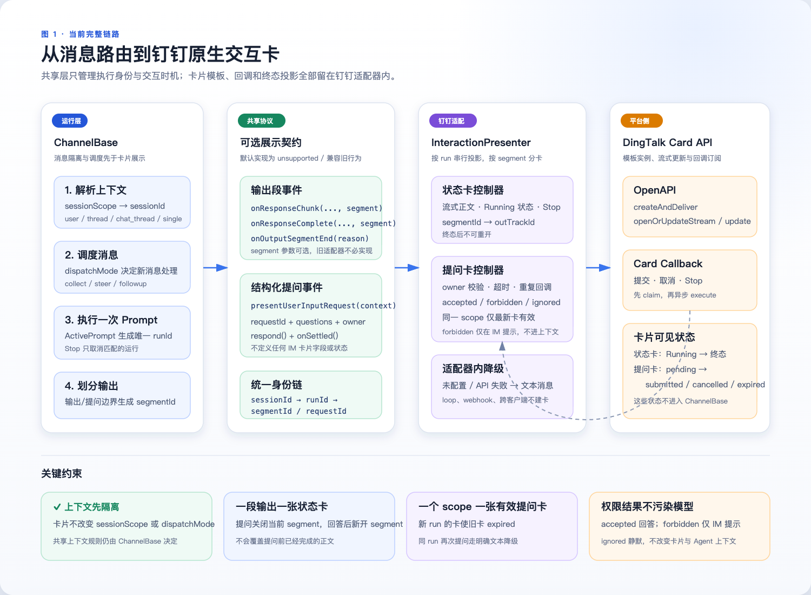
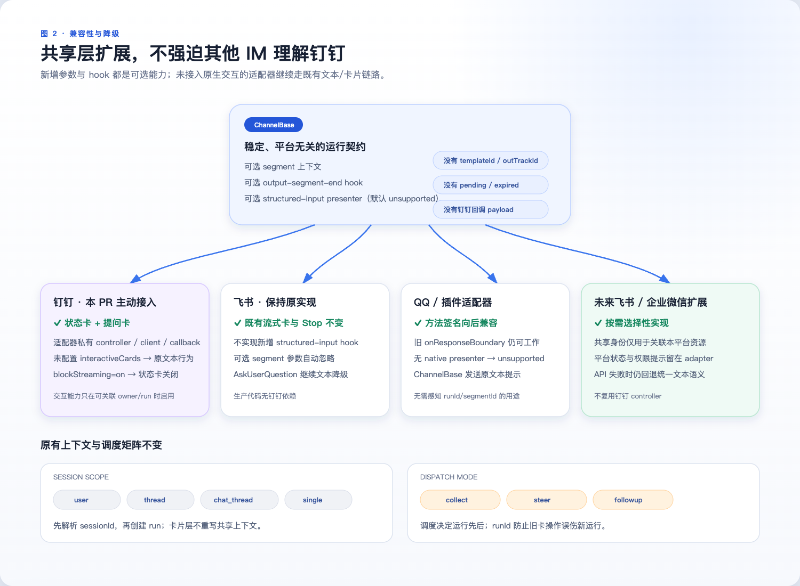

# DingTalk Interactive Cards

## Status

Finaler Implementierungsvertrag für [#6443](https://github.com/QwenLM/qwen-code/issues/6443). Dieses Dokument fixiert die Implementierungsgrenze, den Payload-Vertrag, die Zustandsverantwortung, das Degradationsverhalten und die Akzeptanzkriterien, denen die begleitende Runtime-Implementierung folgt.

## Motivation

Der DingTalk-Channel kann bereits Markdown zustellen, Task-Lifecycle-Events empfangen, Berechtigungsanfragen weiterleiten und einen aktiven Prompt abbrechen. Er bietet keine In-Place-Laufstatus-Karte, keine Exakter-Run-Stop-Aktion und keine Formular-Karte, die strukturierte `ask_user_question`-Antworten an die ursprüngliche Anfrage zurückgeben kann.

Das Design fügt diese DingTalk-Interaktionen hinzu, ohne dem Modell, den Tools, dem ACP-Schema oder anderen Channel-Adaptern etwas über DingTalk-Templates und Callback-Payloads beizubringen.

## Kapitel 1: Zielarchitektur






Die Architektur hat vier Verantwortungsebenen:

1. Core und ACP besitzen weiterhin die semantischen Fragen und die Berechtigungsauflösung.
2. `ChannelBase` besitzt die Registrierung, das Settlement und den Abbruch des exakten Runs für ausstehende Anfragen.
3. Der DingTalk-Adapter besitzt die Kartenpräsentation, das Callback-Routing, die Registries, Idempotenz und Degradation.
4. DingTalk Card OpenAPI besitzt die Zustellung, Streaming-Updates, Instanz-Updates und den Callback-Transport.

Es gibt zwei Kartentypen, nicht einen generischen Kartenlebenszyklus:

| Karte                  | Geschäftsobjekt                         | DingTalk-Protokoll                                        | Lokaler Lebenszyklus                                                              |
| --------------------- | --------------------------------------- | -------------------------------------------------------- | ---------------------------------------------------------------------------- |
| Streaming-Statuskarte | Ein sichtbares Ausgabesegment              | `createAndDeliver`, `/card/streaming`, `/card/instances` | `running`, `completed`, `failed`, `stopped`, `cancelled`                     |
| Formular-Callback-Karte    | Eine Channel-eigene Benutzer-Frage-Anfrage | `createAndDeliver`, Karten-Callback, `/card/instances`     | `pending`, `submitted`, `cancelled`, `expired`, `resolved_outside_presenter` |

Sie teilen sich Authentifizierung und Callback-Ingress, behalten aber unabhängige Registries und Zustandsmaschinen.

## Wiederverwendete bestehende Fähigkeiten — keine Änderung

- `ask_user_question` definiert bereits Fragen, Optionen und Multi-Select-Verhalten.
- ACP-Berechtigungsmetadaten identifizieren eine Benutzer-Frage-Interaktion und bewahren die Fragen.
- Ausstehende Berechtigungen haben bereits Request-Ids und einen Einmal-Antwortpfad.
- `ChannelBase` unterstützt bereits mehrere ausstehende Berechtigungsanfragen für denselben Chat.
- Task-Lifecycle-Events legen bereits `started`, Text-Chunks, Tool-Calls, `completed`, `failed` und `cancelled` offen.
- Der Abbruch aktiver Prompts treibt bereits `/cancel` an.
- DingTalk hat bereits Stream-Konnektivität und einen generischen Downstream-Callback-Ingress.
- CLI/TUI-, Web- und IDE-Oberflächen rendern Benutzer-Fragen bereits nativ.

## Quell-Randbedingungen verifiziert

Die folgenden Verhaltens-Randbedingungen wurden während der Implementierung erneut gegen `origin/main` geprüft:

- `packages/channels/base/src/ChannelBase.ts` registriert jede ausstehende Berechtigung einschließlich ihres Request- und Chat-Index, bevor der bestehende Markdown-Prompt formatiert oder gesendet wird. Dieselbe Registry unterstützt mehrere Anfragen in einem Chat und treibt das Lookup für `/approve`, `/approve-always` und `/deny`.
- `packages/channels/base/src/ChannelAgentBridge.ts` enthält das Berechtigungsergebnis auf `PermissionResolvedEvent`. `packages/channels/base/src/AcpBridge.ts` emittiert dieses Event synchron, bevor ein erfolgreicher Responder zurückkehrt, während `packages/channels/base/src/DaemonChannelBridge.ts` eine Beantwortete-Anfragen-Zuordnung beibehält und das Event später emittieren kann.
- `packages/core/src/tools/askUserQuestion.ts` erlaubt eine bis vier Fragen. Der Live-`permission_request` trägt die geordneten Fragen, garantiert aber kein renderfertiges `answerKey` auf jeder einzelnen. `packages/acp-bridge/src/bridgeClient.ts` fügt indexbasierte Antwortschlüssel nur seinem Status-Snapshot ausstehender Interaktionen hinzu. Der Channel-Seam muss daher beim Normalisieren der Live-Anfrage dieselben `String(index)`-Schlüssel ableiten.
- Die ACP-Session konsumiert zusätzlich zum Berechtigungsergebnis ein Top-Level-`answers: Record<string, string>`. Multi-Select-Antworten bleiben durch Komma und Leerzeichen verbundene Strings, um die Kompatibilität mit den bestehenden TUI- und Web-Clients zu wahren.
- Die generischen Berechtigungsbefehle übermitteln ein Options- oder Abbruch-Ergebnis, keine strukturierten Antworten. Eine Genehmigung von `ask_user_question` über den aktuellen Channel-Pfad setzt sie daher mit einer leeren Antwort-Map fort und erzeugt `No valid answers were provided.` Der Karten-präsentierte Pfad darf `/approve` nicht wiederverwenden.
- Wenn mehr als eine Anfrage aussteht, listet die bestehende Mehrdeutigkeitsantwort bereits Request-Ids und Titel, sodass das Design kein weiteres Kartenfeld nur für die Befehls-Disambiguierung hinzufügt.

## Änderungsauswirkung und Implementierungsgrenze

Die Labels in diesem Dokument sind normativ:

- **Änderung erforderlich — geteilte Channel-Schicht** bedeutet, dass die Implementierung `ChannelBase` oder Channel-eigene öffentliche Typen ändert.
- **Nur-DingTalk-Änderung** bedeutet, dass kein anderer Adapter die Konfiguration liest oder an der Zustandsmaschine teilnimmt.
- **Keine Änderung** bedeutet, dass der bestehende Vertrag und das Runtime-Verhalten maßgeblich bleiben.

| Ebene oder Oberfläche                                                                                | Auswirkung                               | Erforderliche Arbeit                                                                                                                                                                            |
| ----------------------------------------------------------------------------------------------- | ------------------------------------ | ---------------------------------------------------------------------------------------------------------------------------------------------------------------------------------------- |
| `packages/channels/base/src/ChannelBase.ts`                                                     | Änderung erforderlich — geteilter Channel     | Run-Identität, Exakter-Run-Abbruch, semantische Fragen-Normalisierung, Präsentations-Settlement und Befehlsbehandlung strukturierter Fragen hinzufügen.                                            |
| `packages/channels/base/src/types.ts` und Exporte                                               | Änderung erforderlich — geteilter Channel     | Semantische Eingabetypen plus optionale öffentliche Lebenszyklus-`runId` und `owner` hinzufügen; Attended-Events, die von `ChannelBase` emittiert werden, füllen immer beide aus.                                              |
| `packages/channels/dingtalk`                                                                    | Nur-DingTalk-Änderung                 | Karten-Konfiguration, Card-OpenAPI-Zugriff, Callback-Parsing, Owner-Checks, zwei Registries, begrenzte zusammengefasste Projektionen, Degradation und Tests hinzufügen.                                      |
| Dieses Designdokument                                                                            | Änderung erforderlich — nur Dokumentation | Die finalen Payload-, Verantwortungs-, Änderungsauswirkungs-, Lebenszyklus-, Degradations- und Akzeptanzverträge dokumentieren.                                                                                    |
| Architektur-Assets                                                                             | Nur Dokumentation                   | Die Runtime-Kette, die Kompatibilitäts- und Degradationsmatrix und die zukünftige Adapter-Erweiterungsgrenze zeigen, ohne Plattformfelder in den geteilten Vertrag einzuführen.                        |
| `packages/core`, `ask_user_question` und `ToolConfirmationPayload`                             | Keine Änderung                            | Weiterhin semantische Fragen erzeugen und `answers` konsumieren.                                                                                                                           |
| ACP-Agent-Session, ACP-Schema, `acp-bridge`, Permission-Mediator, Daemon-Routen und Daemon-SDK | Keine Änderung                            | Weiterhin `toolCall`, Berechtigungsoptionen, Ergebnisse und Top-Level-`answers` transportieren.                                                                                                     |
| `ChannelAgentBridge`, `AcpBridge`, `DaemonChannelBridge`, Daemon-Worker und `SessionRouter`    | Keine Änderung                            | Weiterhin vollständige Berechtigungsanfragen weiterleiten, nach besitzender `sessionId` routen und Berechtigungsantworten zurückgeben. Kein separates `userQuestionRequest`-Bridge-Event wird eingeführt.         |
| CLI/TUI, Web/Desktop, IDE, SDK-Clients                                                          | Keine Änderung                            | Weiterhin ihre bestehenden nativen Fragen-UIs und Berechtigungs-Transports verwenden.                                                                                                             |
| Feishu, WeCom, QQ, Telegram, Weixin und Plugin-Adapter                                        | Keine direkte Änderung                     | Das Standard-`unsupported`-Präsentationsergebnis erben und bestehende Berechtigungs-Markdown und -Befehle beibehalten. Ihre bekannte Unfähigkeit, strukturierte Channel-Antworten zurückzugeben, bleibt explizit. |

Die optionalen öffentlichen Lebenszyklus-`runId` und `owner` vermeiden, dass Drittanbieter-Adapter oder Test-Fixtures, die Lebenszyklus-Events synthetisieren, sofort geändert werden müssen. `runId` ist innerhalb von `ChannelBase` nicht optional: Jeder Channel-eigene Prompt hat eine, und jedes für diesen Prompt emittierte Lebenszyklus-Event enthält sie. Ein Attended-Inbound-Prompt trägt ebenfalls den normalisierten Channel-Owner; Loop- und Webhook-Prompts lassen ihn bewusst weg. DingTalk erzeugt keine interaktive Karte, wenn die erforderliche Identität fehlt.

## Channel-neutraler Benutzereingabe-Seam — geteilte Channel-Änderung

`ChannelBase` erhält einen semantischen Präsentations-Hook mit drei expliziten Ergebnissen:

```ts
type UserInputPresentationResult =
  | { kind: 'presented' }
  | { kind: 'handled' }
  | { kind: 'unsupported' };

type UserInputSettlementReason =
  | 'resolved_outside_presenter'
  | 'cancelled'
  | 'run_cancelled';

type ChannelUserInputResponse = RequestPermissionResponse & {
  answers?: Record<string, string>;
};

interface ChannelUserQuestion {
  answerKey: string;
  header: string;
  question: string;
  options: Array<{
    label: string;
    description: string;
  }>;
  multiSelect: boolean;
}

interface ChannelPromptOwner {
  kind: 'channel_user';
  id: string;
}

interface ChannelUserInputRequestContext {
  requestId: string;
  sessionId: string;
  runId: string;
  owner: ChannelPromptOwner;
  target: SessionTarget;
  questions: ChannelUserQuestion[];
  submitOptionId: string;
  onSettled(listener: (reason: UserInputSettlementReason) => void): () => void;
  respond(response: ChannelUserInputResponse): Promise<boolean>;
}

protected presentUserInputRequest(
  context: ChannelUserInputRequestContext,
): Promise<UserInputPresentationResult>;
```

`onSettled` ist eine typisierte Einmal-Subscription statt eines `AbortSignal`, dessen öffentliches `reason` `any` ist. `ChannelBase` ist der einzige Settlement-Schreiber; es ruft jeden Listener mit einem `UserInputSettlementReason` auf, und die zurückgegebene Funktion registriert nur diesen Listener ab. Der geteilte `ChannelPromptOwner` ist bewusst adapterneutral: Er identifiziert den menschlichen Channel-Benutzer, der den Run gestartet hat, ohne DingTalk-Callback-Payloads oder Identitätsfeldnamen offenzulegen. Der Kontext enthält keine Template-Id, Aktions-Id, `outTrackId` oder ein mutables Bridge-Objekt. `submitOptionId` ist die ursprüngliche Berechtigungsoption, die als `allow_once` beworben wird; aus Kompatibilitätsgründen mit aktuellen Producern wird eine Option, deren Id `proceed_once` ist und deren `kind` fehlt, gleich behandelt. Der Adapter erfindet niemals eine Options-Id.

### Semantische Anfrageerkennung

`ChannelBase` besitzt einen Normalizer, damit Adapter das ACP-Payload nicht unabhängig neu interpretieren:

1. Der kanonische Discriminator ist `toolCall._meta.qwenInteractionKind === 'user_question'`.
2. Die kanonischen Fragen kommen aus `toolCall._meta.qwenQuestions`.
3. Für ältere Producer wird `toolCall.rawInput.questions` nur akzeptiert, wenn der kanonische Tool-Name oder Tool-Kind ebenfalls `AskUserQuestion` identifiziert. Ein anderes Tool, das zufällig ein `questions`-Argument akzeptiert, ist keine semantische Benutzereingabe.
4. Der Normalizer validiert eine bis vier geordnete Fragen, normalisiert ein weggelassenes `multiSelect` auf `false` und weist `answerKey: String(index)` zu.
5. Eine fehlerhafte kanonische Anfrage wird nicht teilweise gerendert. Sie folgt dem bestehenden Unsupported-Berechtigungspfad und zeichnet eine strukturierte Diagnose auf, ohne Frageantworten zu loggen.

Der Hook wird eingefügt, nachdem die ausstehende Berechtigung und ihr Settlement-Controller gespeichert sind, aber vor dem bestehenden Berechtigungs-Formatter und -Sender:

```text
store PendingPermission + settlement controller
active = current attended Channel-owned ActivePrompt for event.sessionId
normalize semantic question + compatible allow_once option
if valid question and active has runId + submitOptionId:
  construct context from active and normalized questions
  result = presentUserInputRequest(context)
  presented   -> mark structured input as presented, keep pending, and return
  handled     -> only valid if the adapter synchronously invoked context.respond
  unsupported -> continue
format and send the existing permission message
```

Die `respond`-Closure ist die einzige adapter-sichtbare Settlement-Operation. Sie bindet die Request-Id, leitet die vollständige Antwort über die bestehende Bridge weiter und führt dasselbe Pending-Cleanup auf `true`-, `false`- und Throw-Pfaden aus. `ChannelBase` zeichnet auf, ob sie aufgerufen wurde, bevor der Präsentations-Hook aufgelöst wird. `handled` ohne diesen Aufruf ist eine Vertragsverletzung und fällt auf die bestehende Berechtigungsnachricht durch; es ist kein zweiter Weg, eine Anfrage ausstehend zu lassen.

Jeder Pfad, der eine ausstehende Berechtigung entfernt, settlet den Controller genau einmal. Dies umfasst Berechtigungsbefehle, den Kontext-Responder, Daemon-`permissionResolved`, Session-Cleanup, Task-Abbruch und Bridge-Ersetzung. Ein lokal bekannter Run-Abbruch settlet mit `run_cancelled`, bevor ein späteres zusammengeklapptes Bridge-Ergebnis ihn überschreiben kann. Ein unabhängiges `permissionResolved` mit einem Abbruch-Ergebnis oder mit der ursprünglichen Reject-Option wird zum neutralen `cancelled`; ein anderes oder fehlendes Ergebnis wird zu `resolved_outside_presenter`. Die Bridge bewahrt nicht genügend Ursacheninformationen, um Timeout versus Ablehnung versus Cleanup abzuleiten, daher markiert diese Klassifikation einen unbekannten Abbruch niemals als `expired` und rät niemals, welcher Client geantwortet hat. Der DingTalk-lokale Fragen-Timer besitzt die eigenständige `expired`-Projektion, bevor er den Responder aufruft.

Der Hook kommt nur für den aktuellen Attended-Channel-eigenen `ActivePrompt` in Frage. `loopPrompt === true` ist nicht zulässig; das schließt sowohl geplante Loop-Aufgaben als auch Webhook-Producer aus, deren Nachrichten-Ids und Sender synthetisch statt menschliche DingTalk-Eingabe sind. Wenn kein zulässiger aktiver Prompt, keine `runId` und kein Owner existiert, konstruiert `ChannelBase` den Kontext nicht und ruft den Hook nicht auf; sie behandelt die Präsentation als `unsupported` und setzt den bestehenden Berechtigungspfad fort. Der Adapter verlangt unabhängig denselben echten DingTalk-Inbound-Nachrichten-Verantwortungsnachweis für den Run. Ein Run, der von CLI, Web, IDE, SDK, einem anderen Client, einem Loop oder einem Webhook gestartet wurde, erzeugt daher keine Karten-gebundene Interaktion. Das initiale Design fügt keine Client-übergreifende Identitätsföderation hinzu.

Der Standard-Hook liefert `unsupported` zurück. Andere IM-Adapter behalten daher ihre aktuelle Berechtigungsformatierung und -befehle.

## Exakter-Run-Identität und Abbruch — geteilte Channel-Änderung

Jeder Prompt-Aufruf erzeugt eine opaque eindeutige `runId` und speichert sie auf dem entsprechenden `ActivePrompt`. Sie ist nicht die Daemon-Lebenszyklus-Generation, die sich für Session-Lebenszyklus-Operationen statt für jeden Prompt ändert.

`ChannelTaskLifecycleBase` legt `runId?: string` und `owner?: ChannelPromptOwner` für Quellkompatibilität offen. `ChannelBase` enthält die konkrete Run-Id auf jedem `started`, `text_chunk`, `tool_call` und terminalen Event, das sie emittiert. Attended-Prompts enthalten denselben Owner auf jedem Event; Loop- und Webhook-Prompts lassen ihn weg. Ein Consumer, der ein Event ohne die erforderliche Identität empfängt, darf sein bestehendes Verhalten fortsetzen, kann aber keine Karten-Aktion erzeugen.

Ein Statuskarten-Stop-Callback trägt diese `runId` in einen neuen geschützten Exakter-Run-Abbruch-Einstiegspunkt von `ChannelBase`. Die Methode liest den aktuellen aktiven Prompt einmal und prüft die erwartete Id atomar, bevor sie den bestehenden Abbruchpfad betritt. Ein fehlender aktiver Prompt oder eine fehlende, veraltete oder abweichende Id liefert `false` zurück; der Karten-gebundene Pfad fällt niemals auf einen reinen Session-Abbruch zurück. Das bestehende `/cancel`-Verhalten bleibt Session-scoped und unverändert.

Die akzeptierte Stop-Sequenz ist:

1. Den Callback-Owner und die Karten-Identität validieren.
2. Den aktuellen Live-Callback synchron beanspruchen, vor der ersten asynchronen Operation.
3. `ChannelBase` bitten, den exakt erwarteten Run abzubrechen.
4. Wenn der Abbruch `true` zurückgibt, neue Statuskarten-Chunks blockieren, das Streaming schließen und die Stopped-Präsentation committen.
5. Wenn der Abbruch `false` zurückgibt und derselbe Record noch aktuell und nicht-terminal ist, den Claim freigeben, die Karte aktiv halten und einen Retry erlauben.

Der Claim ist ein adapter-lokaler In-Flight-Lock, kein Lebenszyklus-Zustand. Ein asynchrones Ergebnis kann nur denselben noch aktuellen, nicht-terminalen Record aktualisieren oder freigeben; ein Timeout, Settlement oder terminales Lebenszyklus-Event, das während des Await gewinnt, kann nicht überschrieben werden. Dies verhindert, dass eine alte Karte einen neueren Prompt abbricht, verhindert, dass doppelte Callbacks um die Wette laufen, und vermeidet, Erfolg zu behaupten, bevor der Abbruch gelingt, ohne einen öffentlichen `processing`-Zustand hinzuzufügen.

## Nur-Owner-Karten-Aktionen — Nur-DingTalk-Änderung

Die Karten-Aktions-Autorisierung ist strikter als die Shared-Session-Nachrichten-Autorisierung. Stop, Submit und Cancel sind unabhängig von `sessionScope` immer Nur-Owner.

Zum Inbound-Nachrichten-Zeitpunkt bevorzugt DingTalk bereits `senderStaffId` und fällt auf `senderId` für den Envelope-Sender zurück. Bevor ein echter Inbound-Turn an `ChannelBase` übergeben wird, zeichnet der Adapter `messageId -> DingTalkOwnerKey` auf. Die Map folgt der bestehenden Inbound-Nachrichten-Obergrenze von 1.000 Einträgen. Ein passendes `started`-Lebenszyklus-Event konsumiert und entfernt diese Zuordnung, erzeugt einen DingTalk-lokalen Run-/Status-Record und bindet dieselbe Channel-erzeugte `runId` an den typisierten Owner. Loop- und Webhook-Nachrichten-Ids gelangen niemals in die Map. Das terminale Run-Cleanup entfernt den Run-/Status-Record nach dem Abschließen seiner Fragen. Der Callback-Router normalisiert `userId`, `senderStaffId` oder `senderId` des Callbacks in dieselbe typisierte Domäne und verlangt einen exakten Match. Wenn keine vergleichbare Identität verfügbar ist, schlägt die Aktion fail-closed fehl.

Ein Fremd-Benutzer-Callback wird bestätigt, kann aber weder einen Run noch eine Berechtigungsanfrage noch eine Karte mutieren. Wenn die Live-Karte zu einer Gruppe gehört, liefert der Controller das ursprüngliche Gruppenziel mit dem `forbidden`-Ergebnis zurück, und der Adapter sendet einen generischen „nur der Task-Owner kann diese Karte bedienen"-Hinweis an diese Gruppe nach dem Callback-ACK. Dieser Hinweis verwendet den Outbound-Gruppennachrichten-Pfad direkt: Er wird nicht in eine Inbound-Nachricht umgewandelt und gelangt niemals in den Agent-Kontext. Ein fehlgeschlagener Hinweis wird geloggt und fällt nicht auf Berechtigungs-Settlement, Karten-Mutation oder Agent-Zustellung zurück. Das Forbidden-Feedback für Direktkarten behält den bestehenden Direktnachrichten-Pfad.

`ignored` bleibt eigenständig gegenüber `forbidden`. Doppelte, veraltete, fehlerhafte und nicht erkannte Callbacks werden bestätigt und sicher verworfen, ohne Gruppen-Feedback, und verhindern, dass wiederholte oder gefälschte Callbacks eine Gruppe fluten. Die Unterscheidung ist eine adapter-interne Callback-Disposition, kein sichtbarer DingTalk-Karten-Zustand.

## DingTalk-lokale Implementierung — Nur-DingTalk-Änderung

Nur der DingTalk-Adapter liest `interactiveCards` und registriert das Karten-Callback-Topic. Er besitzt:

- Einen geteilten authentifizierten Card-OpenAPI-Client, der das feste 10-Sekunden-Request-Timeout auf beide Kartentypen anwendet.
- Eine begrenzte echte Inbound-Owner-Map.
- Ein Run-/Status-Registry, keyed nach `runId`, mit optionaler Statuskarten-`outTrackId`.
- Ein Fragen-Karten-Registry, keyed nach `requestId` und `outTrackId`.
- Einen Owner-validierenden Callback-Router.
- Pro-Karte zusammengefasste Writer, transiente In-Flight-Claims und begrenzte terminale Tombstones.
- DingTalk-lokaler Fallback und strukturierte Fehlerberichterstattung.

Die Fragen-Präsentation ist nach `sessionId + owner.id` gescoped. Verschiedene Benutzer und Sessions dürfen Live-Karten unabhängig besitzen. Wenn derselbe Run bereits eine ausstehende native Frage in diesem Scope hat, liefert eine weitere Anfrage `unsupported` zurück: `ChannelBase` hält die erste Karte beantwortbar und sendet die zweite Anfrage über den bestehenden Text-Berechtigungs-Fallback. Sie lässt die erste Karte weder ablaufen noch synthetisiert sie eine Berechtigungsantwort. Die Run-Beendigung lässt weiterhin jede von diesem Run besessene Karte ablaufen oder bricht sie ab.

## Streaming-Statuskarten-Lebenszyklus — Nur-DingTalk-Änderung

Die Statuskarte repräsentiert ein sichtbares Ausgabesegment innerhalb eines Channel-eigenen Runs. Runs, die von CLI, Web, IDE, SDK oder einem anderen Client initiiert wurden, können weiterhin den geteilten Session-Zustand beeinflussen, erzeugen aber keine DingTalk-Statuskarte.

Erzeugung und Streaming folgen dem Streaming-Karten-Protokoll von DingTalk:

1. `createAndDeliver` mit einer eindeutigen `outTrackId` und initialem `flowStatus=2` aufrufen.
2. Das Streaming mit einem leeren Full-Update unter Verwendung von `isFull=true`, `isFinalize=false` und `isError=false` öffnen.
3. Die Modellausgabe lokal akkumulieren und zusammengefasste Full-Snapshots über `/card/streaming` senden.
4. Niederfrequente Template-Variablen wie den Statustext über `/card/instances` mit `updateCardDataByKey=true` senden.

Rohe Chunks werden niemals jeweils zu einem Netzwerkrequest. Jeder Status-Record erlaubt höchstens einen Card-OpenAPI-Schreibvorgang in-flight und einen ersetzbaren ausstehenden Full-Snapshot. Ein festes 500-ms-Mindest-Flush-Intervall fasst neuere Chunks in diesem ausstehenden Snapshot zusammen. Sichtbarer Content ist auf 20.000 Zeichen begrenzt; Overflow verwirft den ältesten Content und fügt einen Trunkierungs-Marker ein, statt den Speicher wachsen zu lassen. Jeder Card-OpenAPI-Aufruf hat ein 10-Sekunden-Timeout. Ein zwischenzeitliches Timeout oder Fehlschlagen zeichnet einen strukturierten Fehler auf, stoppt weitere Streaming-Schreibvorgänge für diese Karte und behält den neuesten begrenzten Text für den erwarteten finalen Zustellpfad.

Statuskarten sind lazy und segment-scoped. Eine direkte Frage erzeugt keine Statuskarte. Text vor einer Frage schließt sein Segment, bevor die Fragen-Karte präsentiert wird, und späterer Fortsetzungstext öffnet ein neues Segment:

```text
first visible text -> running
running -> completed
running -> failed
running -> stopped | cancelled
question settlement + later text -> a new running segment
```

Der Kern-Lebenszyklus bleibt `cancelled`; es wird kein `stopped`-Event eingeführt. Ein Abbruch mit dem Grund `cancel_command` darf in DingTalk als „Stopped" präsentiert werden, während andere Abbruchgründe als „Cancelled" präsentiert werden dürfen.

Für `blockStreaming !== 'on'` überschreibt DingTalk den bestehenden erwarteten `onResponseComplete()`-Seam. Diese Methode konsumiert den neuesten akkumulierten Text, bricht einen ausstehenden Flush-Timer ab, wartet auf den einzelnen In-Flight-Schreibvorgang innerhalb seines Timeouts, führt das abgeschlossene finale Instanz-Update aus und fällt auf den bestehenden Markdown-Sender zurück, wenn die Kartenerzeugung oder -finalisierung nicht erfolgreich war. `ChannelBase` emittiert daher `completed` erst, nachdem ein erwarteter Zustellpfad abgeschlossen ist. Es wird kein neuer geteilter Terminal-Zustell-Hook hinzugefügt.

Wenn `blockStreaming === 'on'`, erzeugt DingTalk keine Statuskarte und konsumiert keine rohen Lebenszyklus-Chunks für die Karten-Zustellung; der bestehende `BlockStreamer` bleibt der einzige Antwort-Zustellpfad. Fragen-Karten bleiben unabhängig zulässig. `onTaskLifecycle` zeichnet terminale Ursachen auf und darf Best-Effort-Failed-/Cancelled-Projektionen vornehmen, wird aber nicht als erwartete Zustellgarantie behandelt.

Terminale Statuskarten-Updates folgen einer begrenzten Reihenfolge:

1. Keine neuen Streaming-Chunks mehr akzeptieren, den Flush-Timer abbrechen und den einzelnen ausstehenden Snapshot in den finalen begrenzten Content falten, statt jeden ursprünglichen Chunk erneut abzuspielen.
2. Wenn das Streaming geöffnet wurde, es mit `isFinalize=true` schließen.
3. Ungelöste lokale Bild-Marker bereinigen, damit ein terminaler Abbruch keinen Dateisystempfad offenlegen kann.
4. Den finalen Content, kopierbaren Content, Statustext und `flowStatus=3` mit einem einzigen `/card/instances`-Update committen.

Completed, failed und cancelled projizieren alle auf DingTalk-`flowStatus=3`; der finale Content und der Statustext unterscheiden sie. Sobald terminal, lehnt der Pro-`outTrackId`-Writer verspätete Streaming-Updates ab.

## Formular-Callback-Karten-Lebenszyklus — Nur-DingTalk-Änderung

Die Fragen-Karte repräsentiert eine Berechtigungsanfrage, die das vollständige normalisierte Fragen-Array enthält. Das Tool-Schema erlaubt eine bis vier Fragen. Der Adapter rendert niemals eine Karte für einen anderen Tool-Typ und konstruiert niemals synthetische Fragen.

Jeder ausstehende Record enthält:

- `requestId`, `outTrackId` und `runId`.
- Das vollständige geordnete Fragen-Set und seine Antwortschlüssel.
- Die ursprünglich beworbene `submitOptionId`.
- Die typisierte Owner-Identität.
- Den ursprünglichen Einmal-Responder.
- Timeout- und Settlement-Subscriptions.
- Den lokalen `reserved`-, `pending`- oder `claimed`-Zustand; die Terminalisierung
  ersetzt den Record durch einen kompakten Tombstone.

Der Lebenszyklus folgt der neuesten OpenClaw-Zustell-Race-Disziplin, ohne ihre Persistenz oder die Fortsetzung synthetischer Nachrichten zu kopieren:

```text
reserved   inserted and subscribed before createAndDeliver
pending    activated only after successful delivery while still reserved
claimed    atomically claimed by one valid callback
terminal   first settlement wins; live payload is compacted
```

Wenn ein Settlement oder ein Run-Abbruch einen `reserved`-Record terminal macht, während `createAndDeliver` in-flight ist, kann eine spätere erfolgreiche Zustellung ihn nicht reaktivieren. Der Adapter deaktiviert diese zugestellte Karte best-effort und kehrt zurück, ohne den Responder erneut aufzurufen.

Die Callback-Reihenfolge ist maßgeblich:

1. Den Record nach `outTrackId` lokalisieren und Anfrage und Run korrelieren.
2. Das Submit- oder Cancel-Payload parsen, ohne den Record zu ändern.
3. Den Aktions-Owner validieren.
4. Beim Submit jeden Formular-Antwortschlüssel ablehnen, der nicht im gespeicherten normalisierten Fragen-Set vorhanden ist.
5. Den aktuellen `pending`-Record vor der ersten asynchronen Operation atomar als `claimed` beanspruchen.
6. Den Callback sofort bestätigen. Ungültige, doppelte, veraltete und Fremd-Owner-Callbacks werden nach ihren synchronen Prüfungen ebenfalls genau einmal bestätigt.
7. Den ursprünglichen Responder aufrufen.
8. Wenn derselbe Record noch aktuell und nicht-terminal ist, die Karte aus dem Responder-Ergebnis finalisieren und projizieren.

Der Submit kodiert das Formular unter Verwendung des bestehenden Client-übergreifenden Vertrags:

```json
{
  "outcome": {
    "outcome": "selected",
    "optionId": "<advertised allow_once option>"
  },
  "answers": {
    "0": "Beijing staging",
    "1": "Logs, Metrics"
  }
}
```

Single-Select-Werte und benutzerdefinierte Eingaben sind Strings. Multi-Select-Werte werden mit `", "` verbunden, um dem aktuellen TUI- und Web-Verhalten zu entsprechen. Cancel sendet nur ein abgebrochenes oder beworbenes Reject-Ergebnis und keine Antworten. Der Adapter sendet niemals einen synthetischen Prompt oder eine Inbound-Nachricht.

Die Karte zeigt niemals einen Submit-Erfolg an, bevor der Responder die Antwort akzeptiert:

| Event                              | Lokaler Zustand                  | Karten-Projektion                                                       |
| ---------------------------------- | ---------------------------- | --------------------------------------------------------------------- |
| Submit-Responder liefert `true`    | `submitted`                  | Eingereicht und deaktiviert                                                |
| Cancel-Responder liefert `true`    | `cancelled`                  | Abgebrochen und deaktiviert                                                |
| `respond(...) === false`           | `expired`                    | Nicht-interaktives `card_status=expired`, „Frage nicht mehr verfügbar" |
| `respond(...)` wirft              | `expired`                    | Nicht-interaktive Fehler-Projektion, deaktiviert und nicht erneut versuchbar       |
| Unabhängiges Nicht-Abbruch-Settlement  | `resolved_outside_presenter` | Nicht-interaktives `card_status=expired`, „Außerhalb dieser Karte gelöst"   |
| Unabhängiger zusammengeklappter Abbruch | `cancelled`                  | Nicht-interaktives `card_status=cancelled`, neutrales „Abgebrochen"          |
| Timeout                            | `expired`                    | Abgelaufen und deaktiviert                                                  |
| Anfrage oder Run zerstört           | `cancelled`                  | Abgebrochen oder Gestoppt und deaktiviert                                     |
| Doppelter oder verspäteter Callback         | Bestehender terminaler Zustand      | Bestätigen und ignorieren                                                |
| Settlement auf einem terminalen Record    | Bestehender terminaler Zustand      | Über den terminalen Tombstone ignorieren                                 |

Der lokale Zustand `resolved_outside_presenter` wird nur von einem unabhängigen Nicht-Abbruch-Settlement-Event betreten, nicht aus einem `false`-Responder-Ergebnis abgeleitet. `false` bedeutet nur, dass die Berechtigungsantwort nicht akzeptiert wurde: Die Anfrage-Zuordnung kann fehlen, ihre Session kann verschwunden sein, oder eine andere Oberfläche kann bereits gewonnen haben. Beide Fälle verwenden daher die nicht-interaktive `expired`-Projektion, ohne einen Benutzerabbruch zu behaupten.

Die bestehende Daemon-Bridge konsumiert die Anfrage-zu-Session-Zuordnung, wenn `respondToPermission()` wirft, und `ChannelBase` entfernt die ausstehende Anfrage auf demselben Pfad. Ein späteres Daemon-`permissionResolved` ist kein zuverlässiges Cleanup-Signal mehr, weil die Bridge es als unbekannte Anfrage ablehnen kann. DingTalk loggt daher den Fehler, entfernt seinen ausstehenden Record, behält den terminalen Tombstone und nimmt sofort eine Best-Effort-Nicht-Erfolgs-Projektion vor. Es gibt weder den Claim frei noch verspricht es einen Callback-Retry.

`AcpBridge` emittiert `permissionResolved` synchron, bevor ein erfolgreiches `respondToPermission()` zurückkehrt. Während der DingTalk-Responder-Claim in-flight ist, schiebt der Adapter daher die passende Settlement-Projektion auf, bis das Responder-Ergebnis und die Callback-Aktion bekannt sind. Ein akzeptierter Submit wird zu `submitted`; ein akzeptierter Cancel wird zu `cancelled`; `false` und Throw verwenden die terminalen Zeilen oben. Ein ohne lokalen Responder-Claim empfangenes Settlement folgt den ergebnisbewussten Zeilen oben. Die Daemon-Bridge emittiert ihr erfolgreiches Settlement später, nachdem sie eine Beantwortete-Anfragen-Zuordnung beibehalten hat; wenn die Karte bereits terminal ist, ignoriert der Tombstone dieses Event. Der DingTalk-lokale Timer finalisiert zuerst die Live-Karte als `expired` und ruft dann den Responder auf, damit der zusammengeklappte Abbruch der Bridge sie nicht neu markieren kann. Ein lokal bekannter Run-Abbruch finalisiert ebenfalls als `run_cancelled` vor dem Bridge-Cleanup. Unbekannte zusammengeklappte Abbrüche bleiben das neutrale `cancelled`. Diese Arbitrage verwendet den transienten Claim wieder und fügt keinen öffentlichen Processing-Zustand, keine Retry-Warteschlange und keine Fehler-Taxonomie hinzu.

Ein Instanz-Update ist eine UI-Projektion, nicht die Berechtigungstransaktion. Wenn der Responder erfolgreich ist, aber das nachfolgende Karten-Update fehlschlägt, bleibt die Berechtigung aufgelöst, bleibt der lokale Record terminal, bleiben doppelte Callbacks abgelehnt, und der Adapter loggt die fehlgeschlagene UI-Projektion.

Anders als die OpenClaw-Referenzimplementierung injiziert Qwen Code keine synthetische Inbound-Nachricht. Es antwortet direkt auf die ursprüngliche Berechtigungsanfrage. Eine zweite Anfrage im selben Live-Run verwendet den Text-Fallback und lässt die erste native Karte beantwortbar.

## Konfiguration und eingebaute Templates — Nur-DingTalk-Änderung

Die Capability-Konfiguration ist DingTalk-lokal. Sie wird vom DingTalk-Adapter geparst und fügt kein Channel-übergreifendes Kartenkonzept zu `ChannelConfig` hinzu:

```json
{
  "interactiveCards": {
    "enabled": true,
    "statusCard": {
      "enabled": true
    },
    "questionCard": {
      "enabled": true,
      "timeoutMs": 270000
    }
  }
}
```

Die effektive Fragen-Lebensdauer ist das kleinere aus konfiguriertem Timeout und der Host-Berechtigungs-Lebensdauer.

Template-Ids sind eingebaute DingTalk-Channel-Assets, keine Benutzerkonfiguration. Das Referenz-Plugin verwendet diese Ids mit den eigenen DingTalk-Credentials des installierenden Bots; sie werden nicht als Ressourcen behandelt, die der AppKey des Referenz-Repositorys besitzt:

- Statuskarte: `675cde2f-f526-40cb-b828-f5b2b57b8b77.schema`
- Fragen-Karte: `c2a6355b-9724-4f7e-9653-d33fcb3311bb.schema`

Das Design fügt keine vom Benutzer gelieferte Template-Konfiguration und keinen Startup-Health-Check hinzu. Eine OpenAPI-Ablehnung bei Erstverwendung ist ein lauter strukturierter Fehler, der die Template-Id und den DingTalk-Fehlercode enthält, und tritt dann in den dokumentierten Degradationspfad ein.

Belege für den Built-in-Asset-Vertrag und den Callback-Fluss:

- [soimy/openclaw-channel-dingtalk#583](https://github.com/soimy/openclaw-channel-dingtalk/pull/583) ist gemerged und dokumentiert die Real-Device-Karten-Zustellung, Submit-Callback, Cancel-Callback und die Task-Fortsetzungs-Verifikation.
- [soimy/openclaw-channel-dingtalk#585](https://github.com/soimy/openclaw-channel-dingtalk/pull/585) ist gemerged, liefert das finale Fragen-Karten-Template-Asset und wurde vom Maintainer genehmigt.
- [OpenClaw main bei `a8fb6f80e7`](https://github.com/soimy/openclaw-channel-dingtalk/commit/a8fb6f80e7360ce0ffee2d4a8007951bd85b23a4) liefert die aktuelle Reserve/Activate/Claim/Terminal-Zustell-Race-Referenz.

Diese Quellen liefern Card-OpenAPI-, Template- und Parallelitäts-Belege. Qwen Code kopiert weder ihr separates Tool, `AsyncLocalStorage`, den persistenten Lebenszyklus-Store, die Re-Injektion synthetischer Nachrichten, die Fragen-Ersetzung, den Fail-open-Owner-Check noch das Callback-nach-Await-ACK-Timing.

## Degradationsverhalten — Nur-DingTalk-Änderung

Das initiale Design fügt keine Hintergrund-Retry-Warteschlange hinzu und behält keinen persistenten `presentation_failed`-Zustand.

| Situation                                           | Verhalten                                                                                                                                                                                          |
| --------------------------------------------------- | ------------------------------------------------------------------------------------------------------------------------------------------------------------------------------------------------- |
| Statuskarte deaktiviert oder Erzeugung/finales Update schlägt fehl | Die bestehende erwartete Markdown-Antwort-Zustellung verwenden und einen strukturierten Kartenfehler aufzeichnen. Ein zwischenzeitliches Update-Fehlschlagen stoppt weitere Streaming-Schreibvorgänge und bewahrt den begrenzten Text für die finale Zustellung. |
| Statuskarte zugestellt, aber Streaming-Öffnen schlägt fehl      | Die leere Karte best-effort deaktivieren, Karten-Schreibvorgänge für den Run stoppen und die bestehende erwartete Markdown-Antwort-Zustellung verwenden.                                                                        |
| `blockStreaming === 'on'`                           | Die Statuskarte überspringen; den bestehenden `BlockStreamer`-Zustellpfad beibehalten. Fragen-Karten bleiben unabhängig zulässig.                                                                            |
| Fragen-Karte erzeugt                               | `presented` zurückliefern; die ursprüngliche Berechtigung ausstehend halten.                                                                                                                                         |
| Derselbe Run hat bereits eine ausstehende native Frage      | `unsupported` für die neuere Anfrage zurückliefern; die erste Karte aktiv halten und den bestehenden Text-Berechtigungs-Fallback für die neuere Anfrage verwenden.                                                       |
| Fragen-Karte deaktiviert oder Erzeugung schlägt fehl            | Lesbares semantisches Markdown senden, angeben, dass die Frage abgebrochen wurde und erneut versucht werden kann, die ursprüngliche Anfrage abbrechen, `handled` zurückliefern und den Template-bewussten Fehler loggen.                     |
| Kein aktueller Channel-eigener aktiver Run                 | Die Präsentation als `unsupported` behandeln; beide DingTalk-Karten überspringen und den bestehenden Berechtigungspfad bewahren.                                                                                          |
| Exakter-Run-Abbruch liefert `false` zurück              | Den transienten Claim nur freigeben, wenn derselbe Record aktuell und nicht-terminal bleibt; die Statuskarte aktiv halten, damit Stop erneut versucht werden kann.                                                         |
| Fragen-Responder liefert `false` zurück                  | Mit der bestehenden Cancelled-Projektion und einer neutralen „Berechtigung nicht mehr ausstehend"-Nachricht abschließen.                                                                                               |
| Fragen-Responder wirft                           | Den ausstehenden Record entfernen, den geclaimten Record als abgebrochen abschließen, einen Tombstone beibehalten, sofort eine Nicht-Erfolgs-Projektion vornehmen und keinen Callback-Retry bewerben.                                      |
| Ein anderer Pfad löst zuerst auf                         | Wenn kein lokaler Responder-Claim in-flight ist, einen zusammengeklappten Abbruch als neutrales `cancelled` klassifizieren; `resolved_outside_presenter` nur für ein Nicht-Abbruch-Ergebnis verwenden.                             |
| Anfrage/Run wird zerstört                            | Als Anfrage-/Run-Abbruch settlen; die Karte als abgebrochen oder Gestoppt projizieren.                                                                                                                     |
| Ein anderer IM-Adapter besitzt die Session                 | `unsupported` zurückliefern und seine bestehende Berechtigungsnachricht und -befehle bewahren.                                                                                                                   |
| Gewöhnliche Berechtigung                                 | `/approve`, `/approve-always` und `/deny` unverändert lassen.                                                                                                                                        |

Für eine Karten-präsentierte Frage bleiben `/approve` und `/approve-always` erkannt, rufen aber den Responder nicht auf; sie weisen den Benutzer an, über die Karte einzureichen, weil eine Genehmigung das erforderliche `answers`-Objekt nicht liefern kann. `/deny [requestId]` bleibt ein Notausstieg, weil eine Ablehnung ohne Antworten bereits vollständig ist. `ChannelBase` verlangt, dass der Befehlssender mit dem ursprünglichen Prompt-Sender übereinstimmt, und routet dann die Ablehnung durch denselben Einmal-Kontext-Responder, damit Karten-Settlement, Registry-Cleanup und die First-Responder-Wins-Semantik intakt bleiben. Mehrdeutige Anfragen behalten den bestehenden Explizite-Request-Id-Prompt. Andere Berechtigungen und Adapter behalten ihr aktuelles Befehlsverhalten. Das initiale Design verspricht keinen automatischen Callback-Retry.

## Client-Auswirkung — bestehende Clients bleiben unverändert

| Client oder Oberfläche                                          | Auswirkung               | Verhalten nach diesem Vorschlag                                                          |
| ---------------------------------------------------------- | -------------------- | ------------------------------------------------------------------------------------- |
| DingTalk-Channel-eigener Run                                 | Nur-DingTalk-Änderung | Die Streaming-Statuskarte erzeugen und aktualisieren.                                          |
| DingTalk-Channel-eigene Fragen-Anfrage                    | Nur-DingTalk-Änderung | Die Formular-Callback-Karte oder den DingTalk-lokalen semantischen Fallback präsentieren.                   |
| DingTalk-geroutete Anfrage ohne Channel-eigenen aktiven Run | Keine Verhaltensänderung   | Keine DingTalk-Karte; den bestehenden Berechtigungspfad bewahren.                              |
| CLI/TUI                                                    | Keine Änderung            | Weiterhin den nativen Fragen-Dialog verwenden.                                            |
| Web/Desktop                                                | Keine Änderung            | Weiterhin die native Fragen-Komponente und den bestehenden Aktions-Transport verwenden.           |
| IDE/ACP                                                    | Keine Änderung            | Weiterhin das native ACP-Fragen-UI verwenden; keine Schema-Änderung.                          |
| SDK und Custom-ACP-Clients                                 | Keine Änderung            | Weiterhin das bestehende Berechtigungsanfrage- und -antwort-Protokoll verwenden.                 |
| Andere IM-Adapter                                          | Keine direkte Änderung     | `unsupported` erben; ihr aktuelles Berechtigungsverhalten und ihre bekannte Einschränkung beibehalten. |
| Gewöhnliche Berechtigungen                                       | Keine Änderung            | Die bestehende Genehmigungs-UI und -befehle auf jedem Client beibehalten.                           |

Die Berechtigungsauflösung bleibt First-Responder-Wins. Der transiente DingTalk-Claim serialisiert nur Callbacks für eine Karte und arbitriert ein passendes Settlement, das während seines Responder-Aufrufs eintrifft; er ersetzt nicht das geteilte Settlement. Wenn ein unabhängiges Settlement ohne lokalen Claim eintrifft, klassifiziert DingTalk dessen Ergebnis, ohne zu behaupten, welcher Client geantwortet hat. Wenn der Karten-Responder `true` zurückgibt, wählt die Callback-Aktion `submitted` oder `cancelled`, und ein passendes `permissionResolved` ist Cleanup statt ein Beleg dafür, dass eine andere Oberfläche gewonnen hat.

## Akzeptanzkriterien für die Implementierung

Die Implementierung ist erst vollständig, wenn das folgende Verhalten abgedeckt ist. Diese Tests prüfen die geänderten Schichten; unveränderte Core-, ACP-, Daemon-, Web-, IDE- und andere Adapter-Suites sind keine Feature-Arbeit für diesen Vorschlag.

### Geteilte Channel-Tests — Änderung erforderlich

- Jeder Channel-eigene Prompt erhält eine eindeutige `runId`; alle Lebenszyklus-Events für diesen Prompt tragen dieselbe Id, und ein späterer Prompt in derselben Session erhält eine andere Id.
- Der Exakter-Run-Abbruch gelingt nur für die aktuelle Id. Fehlende, veraltete und abweichende Ids liefern `false` zurück und fallen niemals auf einen reinen Session-Abbruch zurück.
- Der semantische Normalizer akzeptiert das kanonische `_meta.qwenInteractionKind` plus `_meta.qwenQuestions`, weist geordnete String-Antwortschlüssel zu und normalisiert ein fehlendes `multiSelect` auf `false`.
- Der Kompatibilitätspfad akzeptiert `rawInput.questions` nur für ein identifiziertes AskUserQuestion-Tool und klassifiziert ein anderes Tool mit einem `questions`-Argument nicht falsch.
- Die Submit-Options-Normalisierung akzeptiert `kind: allow_once` und die aktuelle Legacy-`proceed_once`-Option ohne `kind` und erfindet niemals eine Options-Id.
- `presented`, `handled` und `unsupported` folgen jeweils ihrem deklarierten Pending-Verantwortungs-Verhalten.
- Loop- und Webhook-Prompts sind für die semantische Karten-Präsentation nicht zulässig, auch wenn sie gewöhnliche Lebenszyklus-Events emittieren.
- Eine Karten-präsentierte Frage kann nicht mit `/approve` oder `/approve-always` genehmigt werden; das Nur-Owner-`/deny [requestId]` verwendet denselben Einmal-Responder, während gewöhnliche Berechtigungen alle Befehle beibehalten.
- Settlement-Listener empfangen nur typisierte `UserInputSettlementReason`-Werte; ein lokal bekannter Run-Abbruch gewinnt gegenüber einem späteren zusammengeklappten Bridge-Abbruch.
- Direkte Antwort, externes `permissionResolved`, Timeout, Abbruch, Session-Tod, Bridge-Ersetzung und Sende-Fehlschlagen settlen und entfernen den ausstehenden Record genau einmal.

### DingTalk-Adapter-Tests — Nur-DingTalk-Änderung

- Ein echtes menschliches DingTalk-`started`-Event bindet einen zulässigen Run aus seiner Inbound-Nachricht und seinem Owner; synthetische, unbekannte, Loop- und Webhook-Nachrichten-Ids erzeugen keinen zulässigen Run und keine Karte.
- Bei ausgeschaltetem Block-Streaming fasst eine Statuskarte Chunks mit höchstens einem Schreibvorgang in-flight und einem begrenzten ausstehenden Snapshot zusammen; die abgeschlossene Zustellung wartet auf die Finalisierung und fällt auf Markdown zurück. Bei eingeschaltetem Block-Streaming wird keine Statuskarte erzeugt, und die bestehende Block-Zustellung bleibt maßgeblich.
- Stop validiert Owner und Karten-Identität, claimt einmal, bricht nur die passende `runId` ab, lehnt Duplikate ab und bleibt nur nach einem nicht-terminalen `false`-Ergebnis erneut versuchbar.
- Eine Berechtigungsanfrage erzeugt eine Fragen-Karte, die alle Fragen und ihre geordneten Antwortschlüssel enthält; eine zweite Anfrage im selben Run fällt auf Text zurück, während die erste Karte interaktiv bleibt, und verschiedene Benutzer und Sessions bleiben unabhängig.
- Eine Frage wird vor der Zustellung reserviert, aktiviert nur, wenn sie nach der Zustellung noch live ist, und wird nach einem In-Flight-Settlement oder Run-Abbruch niemals wiederbelebt.
- Submit wählt die ursprünglich beworbene `allow_once`-Option aus, kodiert Single-, Multi-Select- und benutzerdefinierte Antworten als `Record<string, string>` und löst die ursprüngliche Anfrage direkt auf.
- Ein Submit, der einen Antwortschlüssel außerhalb des gespeicherten normalisierten Fragen-Sets enthält, wird abgelehnt, bevor der Responder aufgerufen wird.
- Der Callback-Transport wird genau einmal nach synchronem Parsen, Korrelieren, Autorisieren und Claimen bestätigt und vor jedem Responder- oder Card-OpenAPI-Await.
- Submit, Cancel, Timeout, Run-Abbruch, Anfrage-Zerstörung, externe Auflösung, doppelter Callback, Responder-`false`, Responder-Throw und Karten-Projektions-Fehler verwenden alle `finalizeQuestion`, leeren das Run-Level-Ausstehenden-Set und öffnen einen terminalen Record niemals wieder.
- Ein fremder oder nicht identifizierbarer Callback-Benutzer schlägt fail-closed fehl und kann keine der beiden Registries mutieren.
- Streaming-Content, Card-OpenAPI-Dauer und terminale Tombstones halten ihre festen Größen-/Zeitgrenzen ein; terminale Records enthalten keinen Responder, keine Antworten, Fragen, Timer, Subscriptions oder gequeueten Content.
- Das Deaktivieren von Karten oder das Ablehnen eines Templates folgt dem dokumentierten Status- oder Fragen-Degradationspfad, ohne rohes Anfrage-JSON offenzulegen.

### End-to-End-Reviewer-Verifikation — geändertes DingTalk-Verhalten

- Auf einem echten DingTalk-Client die Statuskarten-Erzeugung, das geordnete Streaming sowie Completion-, Failure- und Cancellation-Projektionen verifizieren.
- Verifizieren, dass eine Stop-Aktion ihren exakten aktiven Run abbricht und eine alte Karte keinen neueren Run in derselben Session abbrechen kann.
- Ein- und Mehr-Fragen-Karten, Single-Select, Multi-Select, benutzerdefinierte Eingabe, Cancel, Timeout und Task-Fortsetzung mit den eingereichten Antworten verifizieren.
- Web oder IDE an dieselbe Daemon-Session anhängen, die Frage dort zuerst auflösen und verifizieren, dass die DingTalk-Karte nicht-interaktiv wird, ohne zu behaupten, dass DingTalk sie eingereicht hat.
- Jeden Kartentyp unabhängig deaktivieren und das dokumentierte Markdown-Verhalten sowie die fortgesetzte Task-Ausführung oder den Fragen-Abbruch verifizieren.
- Bei `blockStreaming=on` verifizieren, dass die bestehende Block-Antwort maßgeblich bleibt, während Fragen-Karten weiterhin erfolgreich eingereicht werden können.

## Kapitel 2: Aktuelle Auswirkung auf andere IM-Adapter — keine direkte Änderung

Der geteilte Hook ist ein Opt-in-Seam, kein Rollout von DingTalk-Verhalten. Feishu, QQ, Telegram, WeCom, Weixin und Plugin-Adapter lesen keine DingTalk-Konfiguration, Template-Ids, Callback-Aktionen oder Karten-Zustände. Ihre bestehende Berechtigungsformatierung und -befehle bleiben unverändert.

Die bestehende Einschränkung bleibt explizit: `/approve` kann keine `ask_user_question`-Antworten transportieren. Dieser Vorschlag bricht Fragen weder stillschweigend ab noch legt er auf anderen IM-Adaptern rohes Anfrage-JSON offen.

## Kapitel 3: Zukünftiger Erweiterungs-Blueprint — keine Änderung in diesem Vorschlag

Ein zukünftiger IM-Adapter darf den semantischen Hook explizit für eine Anfrage überschreiben, die an seinen eigenen aktuellen `ActivePrompt` gebunden ist. Ein Adapter, der `presented` zurückgibt, muss seine Plattform-Präsentation, seinen Callback- oder Strukturierte-Antwort-Parser, sein Pending-Registry, seine Owner- und Run-Checks, sein Timeout, sein ursachenbewusstes Settlement, seine Idempotenz und seine direkte Antwort auf die ursprüngliche Anfrage besitzen. Er darf keine synthetische Benutzernachricht injizieren, nur um den Run fortzusetzen.

Jeder Adapter sollte über eine separate Änderung opt-in machen, damit seine plattformspezifische Fähigkeit und Zustandsverantwortung unabhängig geprüft werden kann.

## Risiken und Umfangsgrenzen

Die erste Implementierung ist bewusst daemon-lokal. Live-Registeries ausstehender Karten sind an die Prozesslebensdauer gebunden; restart-sichere Wiederherstellung und nicht-sticky Multi-Instanz-Callback-Routing erfordern ein separates Persistenz-Design. Ein terminaler Record wird auf nur Callback-Korrelation, terminalen Zustand und Ablauf-Metadaten komprimiert, 10 Minuten für die Callback-Neuzustellung beibehalten und in einfügungsgeordneten Maps gespeichert, die auf 1.000 Einträge pro Kartentyp begrenzt sind. Ablauf und Oldest-Entry-Eviction fordern ihn zurück; kein Responder, kein Fragen-Payload, kein Antwort-Payload, kein Timer, keine Subscription und kein gequeueter Content überlebt die Terminalisierung.

Diese Implementierung fügt weder Client-übergreifende Run-Verantwortung oder Identitäts-Mapping, ein Channel-übergreifendes Text-Antwort-Protokoll, Freiform-Antwort-Parsing, Injektion synthetischer Nachrichten, ein generisches Channel-übergreifendes Karten-Framework, ein Callback-Retry-System noch eine neue Processing-/Fehler-Zustandsmaschine hinzu.
