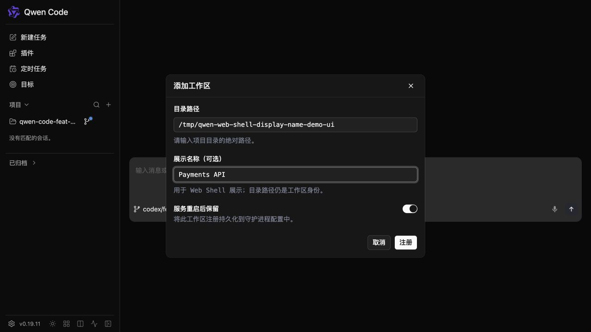

# Daemon workspace display names

## Ziel

Daemon- und TypeScript-SDK-Clients ermöglichen, einen optionalen
menschenlesbaren Anzeigenamen an einen registrierten Workspace zu hängen, ohne
die Workspace-Identität oder das Routing zu ändern. Web-Shell-Usern
ermöglichen, diesen Namen beim Hinzufügen eines Workspaces zu setzen und ihn
in der Workspace-Liste zu sehen. API-Clients ermöglichen, die
Präsentationsmetadaten eines aktiven Workspaces zu aktualisieren oder zu
löschen.

## Vertrag

- `workspaces[]`-Entries erhalten optionale `displayName`-Metadaten.
- `POST /workspaces` akzeptiert ein optionales `displayName` beim
  Registrieren oder persistenten Promoten eines sekundären Workspaces.
- `PATCH /workspaces/:workspace` ist der Workspace-Update-Endpoint. Seine
  aktuelle Anfrageform ist `{ displayName: string | null }`; `null` löscht den
  Namen.
- `POST /workspaces`, `PATCH /workspaces/:workspace` und
  Persistent-Registration-Listings liefern den effektiven Anzeigenamen zurück,
  wenn einer existiert.
- `workspace_display_name` bewirbt den Vertrag. Das TypeScript-SDK stellt
  die Registrierungsoption und `updateWorkspace()` bereit.
- Wenn die Capability beworben wird, akzeptiert der
  Web-Shell-Workspace-hinzufügen-Dialog einen optionalen Anzeigenamen und
  verwendet ihn für Workspace-Labels.

`id` und `cwd` bleiben die einzigen Workspace-Selektoren. Ein Anzeigename wird
niemals für Lookups verwendet und muss nicht eindeutig sein.

## Runtime und Persistenz

Die Runtime besitzt den effektiven Anzeigenamen. Die Aktualisierung eines
beliebigen aktiven Workspaces ändert diese Runtime-Metadaten. Wenn die Runtime
passende persistente Registrierungsidentitäten hat, wird dasselbe Update atomar
in alle geschrieben; andernfalls bleibt das Update prozesslokal. Prozesslokale
Workspaces verlieren beim Daemon-Stopp sowohl die Runtime als auch ihren Namen
und hängen für Anzeigenamen-Updates niemals vom Registrierungs-Store ab.

Die bestehende Schema-v1-Registrierungsdatei behält ihre
`workspaces: string[]`-Form und erhält ein optionales `displayNames`-Objekt,
das mit der bestehenden stabilen Registrierungs-Id als Schlüssel versehen ist.
Updates verwenden den bestehenden Lock, das erneute Lesen unter Lock und das
atomare Schreiben des Stores. Ältere Daemons ignorieren das additive Feld, und
neuere Daemons lesen weiterhin Dateien, die es nicht enthalten. Das Entfernen
einer Registrierung entfernt auch ihren Anzeigenamen-Eintrag.

## Validierung und Fehler

Workspace-Anzeigenamen sind auf 256 Zeichen begrenzt, nachdem umgebender
Whitespace getrimmt wurde. Interne C0- und DEL-Steuerzeichen werden abgelehnt;
ein leeres Ergebnis wird als kein Name behandelt. Ungültige Eingaben liefern
`400 invalid_display_name` zurück, bevor Dateisystem- oder Runtime-Arbeit
beginnt. Doppelte Anzeigenamen sind erlaubt.

Wenn ein prozesslokaler Workspace erstmals persistiert wird, schließt der
Registrierungs-Store-Schreibvorgang ab, bevor der persistierte Anzeigename auf
der Runtime verfügbar gemacht wird. Ebenso aktualisiert ein PATCH passende
persistente Datensätze, bevor der neue Runtime-Wert verfügbar gemacht wird,
sodass ein gewöhnlicher Store-Fehler die Runtime unverändert lässt.

## Kompatibilität

Jede Wire-Änderung ist additiv zu Protokoll v1. Ältere SDKs ignorieren
`displayName`; neuere SDKs typisieren es als optional und funktionieren
weiterhin mit älteren Daemons, die sowohl das Feld als auch den Capability-Tag
weglassen. Die Web Shell verbirgt Anzeigenamen-Steuerelemente, wenn der
Capability-Tag fehlt.

## Verifikation

- Registrierungs-Store-Tests decken Legacy-Dateien, initiale Namen,
  Validierung, atomare Alias-Updates, Neustart-Wiederherstellung und Cleanup
  beim Entfernen ab.
- Workspace-Management-Tests decken prozesslokales und persistentes Erstellen,
  Aktualisieren/Löschen, Persistenzfehler und idempotente Promotion ab.
- Capability-/Status- und SDK-Tests decken das additive Feld, Anfrageformen,
  `updateWorkspace()` und die `workspace_display_name`-Ankündigung ab.
- Web-Shell-Tests decken die optionale Eingabe, SDK-Options-Weiterleitung und
  den Label-Fallback ab. Browser-Screenshots verifizieren das echte
  Workspace-hinzufügen-Formular und sein resultierendes Sidebar-Label.
- Manuelle Ende-zu-Ende-Verifikation deckt prozesslokale Registrierung und
  persistente Neustart-Wiederherstellung ab.

Ausgefülltes Workspace-hinzufügen-Formular:

Erstellter Workspace, angezeigt per Anzeigename:

