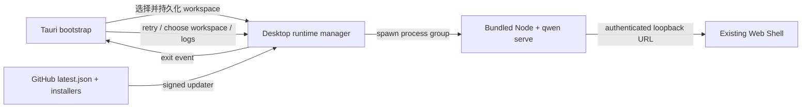

# Desktop-WebShell-Release-Design

## Problem

Der aktuelle Desktop-PoC hat bewiesen, dass Tauri die vom Daemon
bereitgestellte WebShell wiederverwenden kann, ohne eine zweite UI pflegen zu
müssen. Dem PoC fehlen aber noch die Nutzer-Flows, die Fehlerbehebung, die
signierten Updates, die Sicherheitsgrenzen und die
Drei-Plattform-Installationsartefakte, die für einen öffentlichen Release
nötig sind.

Dieses Design vervollständigt `packages/desktop-shell` zu einer dünnen
Desktop-Shell: Die Desktop-Shell ist nur für Lebenszyklus und
Plattform-Integration zuständig; die Produktfunktionen werden weiterhin von
`qwen serve` und `@qwen-code/web-shell` bereitgestellt.

## Ziele

- macOS, Windows und Linux nutzen dieselbe WebShell-UI.
- Beim ersten Start darf der Nutzer einen Workspace auswählen; bei späteren
  Starts wird der zuletzt verwendete Workspace wiederhergestellt.
- Wenn der Daemon-Start fehlschlägt oder er während des Betriebs beendet wird,
  gibt es eine handhabbare Recovery-Oberfläche statt eines stillen Endes.
- Die Desktop-Shell lädt nur die lokale Bootstrap-Seite und den Daemon auf
  einem lokalen Zufallsport; externe URLs gehen immer an den Systembrowser.
- Die Release-Artefakte tragen Version, Herkunft, Lizenz, Checksummen und
  signierte Update-Metadaten.
- Öffentliche Releases werden auf macOS signiert und notariert und auf Windows
  mit Authenticode signiert; Linux erzeugt AppImage und deb.

## Non-Goals

- Keine desktop-exklusive Chat-UI, kein eigenes Session-Modell und keine
  eigenen Daemon-APIs.
- Die WebShell wird nicht in das Desktop-Paket kopiert und dort gepflegt.
- Keine Multi-Window-Unterstützung, kein gleichzeitiger Betrieb mehrerer
  Workspaces und kein Hintergrund-Dauerbetrieb.
- Keine Store-Distribution als Versprechen; die erste öffentliche Version
  nutzt GitHub Releases.
- Kein Bundling von Git, Shell oder anderen System-Tools. Fehlende Tools
  werden weiterhin über die bestehenden WebShell-Fähigkeiten zurückgemeldet.

## Architektur



### Komponentenverantwortlichkeiten

| Komponente       | Verantwortung                                                                    |
| ---------------- | -------------------------------------------------------------------------------- |
| Bootstrap-Seite  | Startzustand, Workspace-Auswahl, Fehler-Recovery, Versions- und Log-Zugang       |
| Rust-Desktop-State | Settings-Persistenz, Fensterzustand, Runtime-Lebenszyklus, Single-Instance, Update-Zustand |
| bundled runtime  | Node.js der aktuellen Plattform, Qwen-Code-Bundle, WebShell-Static-Assets        |
| Release-CI       | Drei-Plattform-Build, Signierung, Notarisierung, Smoke, Checksummen, latest.json, GitHub Release |

## Start-Zustandsmaschine

| Zustand           | Was der Nutzer sieht                      | Verfügbare Aktionen                       |
| ----------------- | ----------------------------------------- | ----------------------------------------- |
| `starting`        | Qwen-Code-Marken-Startseite und aktueller Workspace | Warten                          |
| `needs_workspace` | Workspace-Auswahl beim ersten Start       | Verzeichnis auswählen                     |
| `ready`           | daemon-served WebShell                    | Normale Nutzung                           |
| `failed`          | Kompakte Fehlerzusammenfassung            | Retry, anderes Verzeichnis wählen, Logs öffnen |
| `stopped`         | Hinweis auf unerwartetes Daemon-Ende      | Daemon neu starten, Verzeichnis wählen, Logs öffnen |

Die App erstellt zuerst das Bootstrap-Fenster und startet dann den Daemon
asynchron. Nachdem der tiefe Health-Check des Daemons (`/health?deep=true`)
bestanden ist, navigiert dasselbe Fenster zu
`http://127.0.0.1:<port>/#token=<token>`. Das Token existiert nur im
URL-Fragment und wird nie mit Requests an den Server gesendet; daher ist kein
Cookie-Handshake nötig und es gelangt weder in Access-Logs noch in den
Referer. So haben sowohl der langsame Start als auch Fehlerpfade eine
sichtbare UI.

Der tiefe Health-Check muss verwendet werden: Der Serve-Fast-Path beantwortet
das flache `/health` bereits mit der Bootstrap-App, bevor die echte Runtime
(inklusive WebShell) gemountet ist. Zu diesem Zeitpunkt liefert
`/health?deep=true` weiterhin `503 {"reason": "bootstrap"}`; erst wenn es 200
zurückgibt, ist die WebShell verfügbar. Würde die Bereitschaft über den
flachen Health-Check bestimmt, würde die Navigation in das Fenster der
deferred Runtime krachen.

## Workspace-Auswahl und -Persistenz

Die Einstellungsdatei liegt unter `desktop-state.json` im Tauri
`app_config_dir`:

```json
{
  "workspace": "/absolute/path",
  "window": {
    "width": 1280,
    "height": 820,
    "x": 120,
    "y": 80,
    "maximized": false
  }
}
```

Start-Priorität:

1. `QWEN_DESKTOP_WORKSPACE`, für Entwicklung und automatisierte Tests.
2. Der letzte Workspace aus der Einstellungsdatei.
3. Beim ersten Start wird ein Verzeichnis-Auswahldialog angezeigt.

Nur ein bereits existierender, kanonischer absoluter Pfad, der ein Verzeichnis
ist, wird an den Daemon übergeben. Bei der Auswahl eines neuen Workspace wird
zuerst die aktuelle Prozessgruppe gestoppt und dann mit dem neuen Verzeichnis
neu gestartet.

## Runtime-Lebenszyklus und -Recovery

- Bei jedem Start wird ein 256-Bit-Bearer-Token erzeugt und über die
  Kindprozess-Umgebung (`QWEN_SERVER_TOKEN`) an den Daemon übergeben sowie dem
  WebShell-Frontend über das URL-Fragment (`/#token=<token>`) mitgeteilt; das
  Frontend liest ihn aus, entfernt ihn aus der URL und ruft die API mit einem
  `Authorization: Bearer`-Header auf. Das Fragment wird nicht an den Server
  gesendet, daher sind keine Cookies nötig.
- Der Daemon bindet an einen Zufallsport auf `127.0.0.1` und aktiviert
  `--require-auth`.
- stdout und stderr werden gleichzeitig in ein rotierendes Log geschrieben,
  zudem wird eine begrenzte Start-Zusammenfassung für die UI-Anzeige behalten.
- Rust überwacht das Beenden des Daemon-Prozesses; ein Stopp, der nicht von
  einem App-Beenden herrührt, löst das `runtime-stopped`-Event aus und kehrt
  zur Bootstrap-Fehlerseite zurück.
- Ein Retry erzeugt immer ein neues Token und einen neuen Daemon; ein
  beendeter Prozess wird nicht wiederverwendet.
- Beim Beenden der App wird die gesamte Kindprozessgruppe beendet, um
  verwaiste Daemons zu vermeiden.

## Fenster und Single-Instance

- Die minimale Größe des Hauptfensters ist 900 × 600, default 1280 × 820.
- Schließen, Verschieben, Skalieren und Maximieren werden persistiert; bei der
  Wiederherstellung werden unsichtbare Offscreen-Positionen auf zentriert
  zurückgesetzt.
- Das Single-Instance-Plugin muss zuerst registriert werden. Ein zweiter Start
  fokussiert und stellt nur das Hauptfenster wieder her, ohne den Daemon neu
  zu starten.

## Sicherheitsgrenzen

- Bootstrap-CSP: `default-src 'self'; script-src 'self'; style-src 'self' 'unsafe-inline'; img-src 'self' data:; connect-src ipc: http://ipc.localhost; object-src 'none'; base-uri 'none'; form-action 'none'; frame-ancestors 'none'`.
- Die WebShell erzeugt weiterhin ihre eigene CSP über den Daemon; die
  Desktop-Shell lockert die Daemon-Seiten-Policy nicht.
- Das Hauptfenster erlaubt nur das benutzerdefinierte Bootstrap-Protokoll und
  Same-Origin-Navigation zum ausgewählten Daemon.
- Externe `http`-, `https`-, `mailto`-Links gehen an den Systembrowser;
  `file`, `javascript` und benutzerdefinierte Protokolle werden abgelehnt.
- Blob-Downloads dürfen nur von der Haupt-WebShell initiiert werden, und der
  native Download-Callback wählt einen sicheren Zielpfad.
- Tauri stellt keine JavaScript-APIs für Dateisystem, Shell oder Prozesse zur
  Verfügung; das Bootstrap nutzt nur explizite `invoke`-Commands.
- Das Windows-Manifest verwendet `asInvoker`, Common Controls v6 und
  Long-Path-Awareness.
- Auf macOS ist die Hardened Runtime aktiviert; die Entitlements enthalten nur
  die Fähigkeiten, die für das Ausführen von JIT-WebView und
  Netzwerk-Client/Server nötig sind.

## Build-Metadaten und Compliance

`prepare-runtime.js` erzeugt:

- `manifest.json`: Desktop-Version, Qwen-Code-Version, Qwen-Code-Commit,
  Node-Version, Target, Build-Zeit.
- `checksums.json`: SHA-256 über alle Bundled-Runtime-Dateien.
- Root-`LICENSE` und Desktop-`NOTICE`.
- Node.js-`LICENSE`.

Der Pre-Packaging-Smoke validiert Manifest, kritische Dateien und Checksummen.
Der GitHub Release publiziert zusätzlich für jedes Installationsartefakt eine
`SHA256SUMS.txt`.

## Update-Modell

Der Tauri-Updater verwendet signierte Update-Artefakte und einen festen
öffentlichen Schlüssel. Nach dem App-Start wird einmal im Hintergrund auf
Updates geprüft:

- Kein Update: Der Nutzer wird nicht behelligt.
- Prüfung fehlgeschlagen: Wird geloggt, blockiert den Start nicht.
- Update vorhanden: Ein nativer Bestätigungsdialog wird über
  Bootstrap/WebShell angezeigt; nach Bestätigung des Nutzers wird
  heruntergeladen und installiert, dann neu gestartet.

Die Release-CI erzeugt die Updater-Signaturen mit
`TAURI_SIGNING_PRIVATE_KEY` und `TAURI_SIGNING_PRIVATE_KEY_PASSWORD`.
`latest.json` zeigt auf die Plattform-Update-Pakete desselben GitHub Release.
Nur Nicht-Draft-, Nicht-Prerelease-Releases aktualisieren den festen
`desktop-latest`-Feed-Release.

## Plattform-Release-Matrix

| Plattform | Architekturen | Installationspakete                         | Signaturanforderungen                     |
| --------- | ------------- | ------------------------------------------- | ----------------------------------------- |
| macOS     | arm64, x64    | `.dmg`, `.app.tar.gz`-Updater               | Developer ID Application + Notarisierung  |
| Windows   | x64           | NSIS-`.exe`-Updater/Installer               | Authenticode SHA-256 + Timestamp          |
| Linux     | x64           | `.AppImage`-Updater/Installer, `.deb`       | Updater-Minisign; kein OS-Code-Signing    |

Windows WebView2 nutzt einen Download-Bootstrapper; wenn das System offline
ist und WebView2 fehlt, weist die Installation explizit auf die fehlende
Abhängigkeit hin. Die Linux-CI installiert die Tauri-WebKit/GTK-, AppImage- und
deb-Build-Abhängigkeiten.

## Release-Flow

1. Eingabe der Desktop-Version und des zu vendorenden Qwen-Code-Refs.
2. Validieren, dass der Ref auf einen Release-berechtigten Commit
   zurückverfolgbar ist.
3. Synchronisieren der Desktop-Shell-Paket-, Cargo- und Tauri-Versionen. Die
   Versionen werden nur bei jedem Build von der CI transient gesetzt und nicht
   in das Repository zurückcommittet; der `main`-Branch behält bewusst die
   Entwicklungs-Platzhalterversion (`0.0.1`), veröffentlichte Versionen
   richten sich nach den Git-Tags.
4. Pro Plattform die Runtime vorbereiten, Checksum-/Runtime-Smoke und
   Rust-Tests ausführen.
5. Installationspakete und Updater-Artefakte bauen.
6. Der Plattform-Runner installiert und startet die gepackte App und wartet
   auf den Nachweis, dass Daemon/WebShell bereit sind.
7. Artefakte hochladen; der Release-Job erzeugt `latest.json` und
   `SHA256SUMS.txt`.
8. Ein Nicht-Draft-Stable-Release aktualisiert den `desktop-latest`-Feed.

Wenn Signaturschlüssel fehlen, ist nur `dry_run=true` erlaubt; ein
öffentlicher Release muss fail-closed sein.

## Verifizierungskriterien

- Beim ersten Start kann ein Verzeichnis ausgewählt werden und die WebShell
  wird erreicht.
- Ein Neustart stellt Workspace und Fensterposition wieder her.
- Ungültiger Workspace, fehlende Runtime und vorzeitiges Daemon-Ende zeigen
  alle die Recovery-Seite.
- Wenn der Daemon während des Betriebs beendet wird, kann der Nutzer ihn im
  selben Fenster neu starten.
- Externe Links öffnen sich im Systembrowser, das Hauptfenster verlässt den
  Daemon-Origin nicht.
- Im Drei-Plattform-Packaged-App-Smoke werden `/health`, die nicht
  authentifizierte WebShell-Root-Navigation mit 200 beantwortet (und es wird
  kein Cookie gesetzt) und `/capabilities` ohne Token mit 401 beantwortet.
- Updater-Manifest-Signaturen können vom Client verifiziert werden; ein
  Versions-Downgrade wird abgelehnt.
