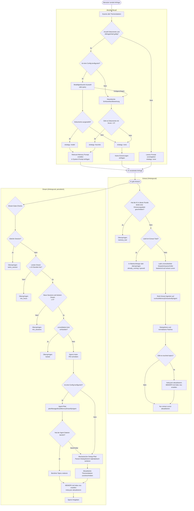
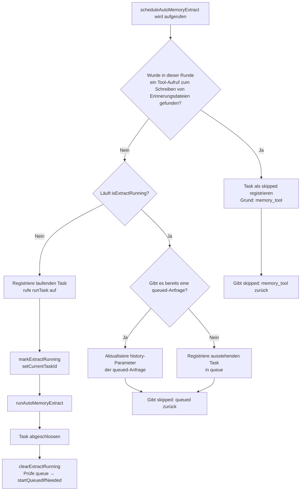
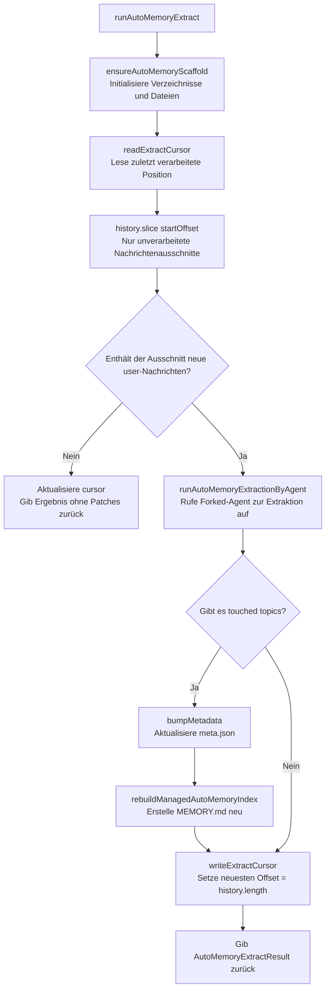
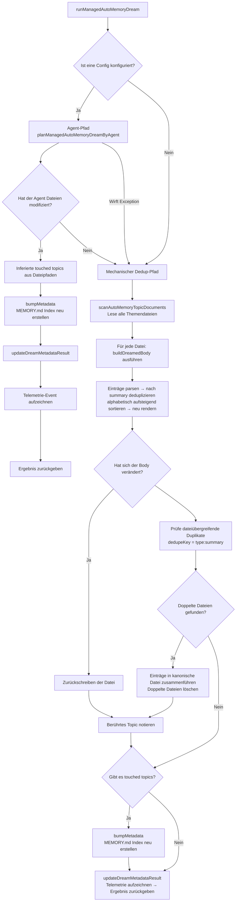
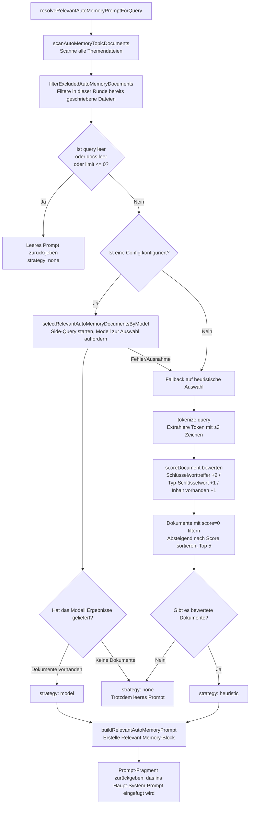
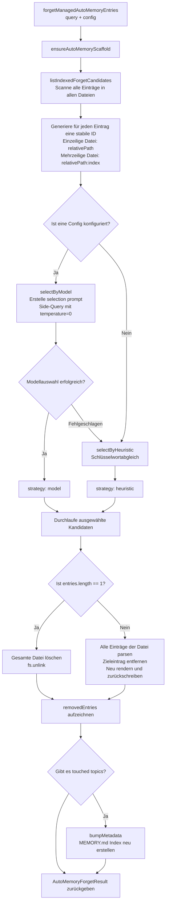

# Memory – Verwaltungssystem für automatische Erinnerungen

> Dieser Artikel beschreibt den **Managed Auto-Memory** (verwaltete automatische Erinnerungen) Mechanismus in Qwen Code, seine Auslöser und Implementierungsdetails.

---

## Inhaltsverzeichnis

1. [Überblick](#überblick)
2. [Speicherstruktur](#speicherstruktur)
3. [Erinnerungstypen](#erinnerungstypen)
4. [Format eines Erinnerungseintrags](#format-eines-erinnerungseintrags)
5. [Kernlebenszyklus](#kernlebenszyklus)
6. [Extract – Extrahieren](#extract--extrahieren)
7. [Dream – Konsolidieren](#dream--konsolidieren)
8. [Recall – Abrufen](#recall--abrufen)
9. [Forget – Vergessen](#forget--vergessen)
10. [Index-Neuerstellung](#index-neuerstellung)
11. [Telemetrie-Events](#telemetrie-events)

---

## Überblick

Managed Auto-Memory ist ein persistentes Erinnerungssystem, das während KI-Gesprächen **automatisch** benutzerrelevantes Wissen sammelt, integriert und abruft. Es pflegt den Erinnerungslebenszyklus über vier Kernoperationen:

| Operation | Englisch | Auslöser                        | Wirkung                                                           |
| --------- | -------- | ------------------------------- | ----------------------------------------------------------------- |
| Extrahieren | Extract  | Automatisch (nach jeder Runde)  | Neues Wissen aus Gesprächsverlauf extrahieren und in Dateien schreiben |
| Konsolidieren | Dream    | Automatisch (periodischer Hintergrundtask) | Erinnerungsdateien deduplizieren, zusammenführen, sauber halten         |
| Abrufen   | Recall   | Automatisch (vor jeder Runde)   | Relevante Erinnerungen suchen und in das System-Prompt einfügen    |
| Vergessen | Forget   | Manuell (Benutzerbefehl `/forget`) | Gezielten Erinnerungseintrag löschen                                  |

---

## Speicherstruktur

### Verzeichnisaufbau

```
~/.qwen/                                      ← Globales Basisverzeichnis (Standard)
└── projects/
    └── <sanitized-git-root>/                 ← Projektkennung (basierend auf Git-Root-Pfad)
        ├── meta.json                         ← Metadaten (Extract-/Dream-Zeitstempel, Status)
        ├── extract-cursor.json               ← Extract-Cursor (verarbeiteter Gesprächsoffset)
        ├── consolidation.lock                ← Dream-Prozess-Mutex
        └── memory/                           ← Hauptverzeichnis für Erinnerungen
            ├── MEMORY.md                     ← Indexdatei (automatisch generiert, fasst alle Einträge zusammen)
            ├── user.md                       ← Benutzerpräferenzen (Beispiel)
            ├── feedback.md                   ← Feedback/Regeln (Beispiel)
            ├── project/
            │   └── milestone.md              ← Projekterinnerungen (mit Unterverzeichnissen möglich)
            └── reference/
                └── grafana.md                ← Externe Ressourcen-Erinnerungen
```

> **Umgebungsvariablen-Überschreibung**:
>
> - `QWEN_CODE_MEMORY_BASE_DIR`: Ersetzt das globale Basisverzeichnis
> - `QWEN_CODE_MEMORY_LOCAL=1`: Nutzt stattdessen den projektinternen Pfad `.qwen/memory/`

### Wichtige Dateien

| Datei                  | Beschreibung                                                                   |
| ---------------------- | ------------------------------------------------------------------------------ |
| `meta.json`            | Zeichnet Zeitstempel des letzten Extract/Dream, Session-ID, betroffene Erinnerungstypen, Ausführungsstatus |
| `extract-cursor.json`  | Zeichnet, bis zu welchem Offset der Gesprächsverlauf bereits verarbeitet wurde, um Doppelextraktion zu vermeiden |
| `consolidation.lock`   | Dateisperre während Dream; Inhalt ist die PID des Halters; verfällt nach 1 Stunde automatisch |
| `MEMORY.md`            | Index aller Themendateien; wird nach jedem Extract/Dream neu erstellt; Format: Markdown-Liste |

---

## Erinnerungstypen

Das System unterstützt vier integrierte Erinnerungstypen, jeder für eine andere Informationsdimension:

| Typ        | Gespeicherter Inhalt                                              | Wann geschrieben                        | Wann gelesen                         |
| ---------- | ----------------------------------------------------------------- | --------------------------------------- | ------------------------------------ |
| `user`     | Rolle des Benutzers, Skills, Arbeitsgewohnheiten                  | Wenn Rolle/Präferenzen/Hintergrund bekannt werden | Wenn Antwort an Benutzerhintergrund angepasst werden muss |
| `feedback` | Anweisungen des Benutzers: was vermeiden, was beibehalten        | Wenn Benutzer KI korrigiert oder eine nicht offensichtliche Vorgehensweise bestätigt | Wenn Verhalten der KI beeinflusst werden soll |
| `project`  | Projektfortschritt, Ziele, Entscheidungen, Deadlines, Bug-Tracking | Wenn bekannt wird, wer was warum und bis wann macht | Wenn KI Arbeitskontext und Motivation verstehen soll |
| `reference`| Zeiger auf externe Systeme/Ressourcen (Dashboard, Ticketsystem, Slack-Channel etc.) | Wenn externe Ressource und ihr Zweck bekannt werden | Wenn Benutzer externes System oder verwandte Information erwähnt |

**Nicht in Erinnerungen speichern**: Codemuster/-konventionen, Git-Verlauf, Debug-Ansätze, temporäre Aufgaben, bereits in QWEN.md/AGENTS.md festgehaltene Inhalte.

---

## Format eines Erinnerungseintrags

Jede Themendatei verwendet **YAML Frontmatter + Markdown Body**:

```markdown
---
name: Name der Erinnerung
description: Ein-Satz-Beschreibung (für Relevanzbestimmung beim Abruf; möglichst konkret)
type: user|feedback|project|reference
---

Hauptinhalt der Erinnerung (summary-Zeile)

Why: Grund (damit KI Randfälle versteht, statt Regeln blind zu befolgen)
How to apply: Einsatzkontext und Verwendungshinweise
```

Für die Typen `feedback` und `project` wird dringend empfohlen, `Why` und `How to apply` auszufüllen, damit die Erinnerung auch in Grenzfällen korrekt angewendet wird.

---

## Kernlebenszyklus



---

## Extract – Extrahieren

### Auslöser

Wird nach jeder abgeschlossenen KI-Antwort automatisch von `scheduleAutoMemoryExtract` ausgelöst (Hintergrund, nicht blockierend).

### Scheduling-Logik (`extractScheduler.ts`)



**Übersprungsgründe**:

| Grund              | Bedeutung                                                     |
| ------------------ | ------------------------------------------------------------- |
| `memory_tool`      | Der Haupt-Agent hat in dieser Runde bereits direkt eine Erinnerungsdatei geschrieben – Überspringen, um Konflikte zu vermeiden |
| `already_running`  | Extract läuft bereits und konnte nicht in die Warteschlange aufgenommen werden |
| `queued`           | Extract läuft bereits; diese Anfrage wurde in die Warteschlange gestellt       |

### Kern-Extract-Ablauf (`extract.ts`)



> **Hinweis**: Die `isUnderMemoryPressure`-Gate befindet sich in `MemoryManager.runExtract()`, nicht in diesem Ablauf. Wenn der Monitor Hard- oder Critical-Druck meldet, überspringt `MemoryManager` den Extract-Aufruf und aktualisiert den Cursor nicht.

**Extract-Cursor**:

- Felder: `{ sessionId, processedOffset, updatedAt }`
- Vor dem Extract wird über `readExtractCursor` der aktuelle Fortschritt gelesen; dann wird nur der unverarbeitete Teil mit `history.slice(processedOffset)` bearbeitet
- Nach jedem Extract wird `processedOffset` auf die aktuelle Länge des Verlaufs gesetzt (`params.history.length`)
- Bei Sessionswechsel (`sessionId` ändert sich) wird bei Offset 0 neu begonnen
- Hinweis: Es wird kein `buildTranscriptMessages` / `loadUnprocessedTranscriptSlice` mehr zum Aufbauen von Transkripttext verwendet – `hasNewUserMessages` wird über `history.slice(startOffset).some(m => m.role === 'user' && partToString(m.parts).trim().length > 0)` ermittelt; nur der unverarbeitete Ausschnitt wird leichtgewichtig in Strings umgewandelt, der gesamte Verlauf wird nicht mehr verarbeitet

**Patch-Filterregeln**:

- Zusammenfassung < 12 Zeichen → verwerfen
- Zusammenfassung endet mit `?` → verwerfen (Fragesatz)
- Enthält temporäre Schlüsselwörter (today/now/currently/temporary usw.) → verwerfen
- Gleiche `topic:summary`-Kombination → deduplizieren

---

## Dream – Konsolidieren

### Auslöser

Wird nach jeder abgeschlossenen KI-Antwort automatisch von `scheduleManagedAutoMemoryDream` ausgelöst (Hintergrund, nicht blockierend). Wird aber durch mehrere Gate-Bedingungen meistens übersprungen.

### Scheduling-Gates (`dreamScheduler.ts`)

```mermaid
flowchart TD
    A[scheduleManagedAutoMemoryDream wird aufgerufen] --> B{Ist Dream aktiviert?}
    B -- Nein --> C[Überspringen: disabled]
    B -- Ja --> D[ensureAutoMemoryScaffold\nLese lastDreamSessionId]
    D --> E{Ist aktuelle sessionId\n== lastDreamSessionId?}
    E -- Ja --> F[Überspringen: same_session]
    E -- Nein --> G{Sind elapsedHours ≥ 24h\noder noch nie gedreamt?}
    G -- Nein --> H[Überspringen: min_hours]
    G -- Ja --> I{Ist letzter Session-Scan\n< 10 Minuten her?}
    I -- Ja --> J[Überspringen: min_sessions\nWarte auf nächstes Scan-Fenster]
    I -- Nein --> K[Scanne chats/*.jsonl mtime\nZähle neue Sessions seit letztem Dream]
    K --> L{Neue Sessions ≥ 5?}
    L -- Nein --> M[Überspringen: min_sessions]
    L -- Ja --> N{lockExists?\nPID-Prüfung + Verfallsprüfung}
    N -- Ja --> O[Überspringen: locked]
    N -- Nein --> P{Gibt es bereits einen\nDream-Task für dasselbe Projekt (dedupeKey)?}
    P -- Ja --> Q[Überspringen: running\nGib vorhandene taskId zurück]
    P -- Nein --> R[Hintergrundtask planen\nBgTaskScheduler]
    R --> S[acquireDreamLock\nSchreibe PID in consolidation.lock]
    S --> T[runManagedAutoMemoryDream]
    T --> U[meta.json aktualisieren\nSperre freigeben]
```

**Gate-Parameter**:

| Parameter                    | Standard    | Beschreibung                                           |
| ---------------------------- | ----------- | ------------------------------------------------------ |
| `minHoursBetweenDreams`      | 24 Stunden  | Mindestzeit zwischen zwei Dream-Durchläufen            |
| `minSessionsBetweenDreams`   | 5 Sessions  | Mindestanzahl neuer Sessions seit letztem Dream        |
| `SESSION_SCAN_INTERVAL_MS`   | 10 Minuten  | Drosselungsintervall für Session-Datei-Scans           |
| `DREAM_LOCK_STALE_MS`        | 1 Stunde    | Zeit, nach der die Lock-Datei als veraltet gilt        |

**Lock-Mechanismus**:

- Lock-Datei unter `<project-state-dir>/consolidation.lock`
- Inhalt: PID des haltenden Prozesses
- Bei Prüfung: Wenn der PID-Prozess nicht mehr existiert (`kill(pid, 0)` fehlschlägt) oder die Lock älter als 1 Stunde ist → als veraltet betrachten und automatisch löschen

### Dream-Ausführungsablauf (`dream.ts`)



**Mechanische Deduplizierungslogik**:

1. Innerhalb jeder Themendatei: nach `summary.toLowerCase()` deduplizieren, `why`/`howToApply`-Felder zusammenführen
2. Alphabetisch nach summary sortieren
3. Dateiübergreifend: Einträge mit gleichem `type:summary` in die zuerst gefundene Datei verschieben, doppelte Dateien löschen

---

## Recall – Abrufen

### Auslöser

Wird vor jeder KI-Verarbeitung einer Benutzeranfrage automatisch von `resolveRelevantAutoMemoryPromptForQuery` ausgelöst; fügt relevante Erinnerungen in das System-Prompt ein.

### Recall-Ablauf (`recall.ts`)



**Bewertungsregeln (heuristisch)**:

| Bedingung                                  | Punkte           |
| ------------------------------------------ | ---------------- |
| query-Token erscheint im Dokumentinhalt    | +2 (pro Token)   |
| query-Token ist ein charakteristisches Schlüsselwort des Typs | +1 (pro Token)   |
| Dokument-Body ist nicht leer               | +1               |

**Charakteristische Schlüsselwörter pro Typ**:

- `user`: user, preference, background, role, terse
- `feedback`: feedback, rule, avoid, style, summary
- `project`: project, goal, incident, deadline, release
- `reference`: reference, dashboard, ticket, docs, link

**Prompt-Erstellungsregeln**:

- Maximal 5 Dokumente einfügen (`MAX_RELEVANT_DOCS`)
- Jeder Dokument-Body wird auf 1200 Zeichen gekürzt (`MAX_DOC_BODY_CHARS`)
- Bei Kürzung wird ein Hinweis angehängt: "NOTE: Relevant memory truncated for prompt budget."
- Enthält Frische-Information (basierend auf Datei-mtime)

---

## Forget – Vergessen

### Auslöser

Wird durch den manuellen Benutzerbefehl `/forget <query>` ausgelöst.

### Forget-Ablauf (`forget.ts`)



**Entry-ID-Design**:

- Einzeilige Datei (häufig): `relativePath` (z. B. `feedback/no-summary.md`)
- Mehrzeilige Datei: `relativePath:index` (z. B. `feedback/style.md:2`)
- Stabile IDs ermöglichen dem Modell, exakt einen Eintrag zu adressieren, ohne andere Einträge derselben Datei zu beeinträchtigen.

---

## Index-Neuerstellung

`MEMORY.md` ist der Navigationsindex aller Themendateien; wird nach jedem Extract oder Dream durch Aufruf von `rebuildManagedAutoMemoryIndex` neu erstellt:

```
- [Benutzerpräferenzen](user/preferences.md) — Benutzer ist Senior Go-Entwickler, zum ersten Mal mit React
- [Feedbackregeln](feedback/style.md) — Antworten kurz halten, keine Zusammenfassung am Ende
- [Projektmeilenstein](project/milestone.md) — Merge-Freeze-Fenster vor dem Branch für den Mobile-Release
```

**Index-Beschränkungen**:

- Maximal 150 Zeichen pro Zeile (bei Überschreitung wird mit `…` abgeschnitten)
- Maximal 200 Zeilen
- Gesamtgröße maximal 25.000 Byte

---

## Telemetrie-Events

Das System enthält drei Arten von Telemetrie-Events zur Überwachung der Leistung und Effektivität der Erinnerungsoperationen.

### Extract-Telemetrie

| Feld             | Typ                        | Beschreibung                      |
| ---------------- | --------------------------- | --------------------------------- |
| `trigger`        | `'auto'`                    | Auslöser (derzeit nur automatisch) |
| `status`         | `'completed'` \| `'failed'` | Ausführungsergebnis                |
| `patches_count`  | number                      | Anzahl gültiger extrahierter Patches |
| `touched_topics` | string[]                    | Liste der geschriebenen Erinnerungstypen |
| `duration_ms`    | number                      | Gesamtdauer in Millisekunden       |

### Dream-Telemetrie

| Feld              | Typ                                  | Beschreibung                    |
| ----------------- | ------------------------------------- | ------------------------------- |
| `trigger`         | `'auto'`                              | Auslöser                        |
| `status`          | `'updated'` \| `'noop'` \| `'failed'` | Ausführungsergebnis              |
| `deduped_entries` | number                                | Anzahl der durch mechanischen Dedup entfernten Einträge |
| `touched_topics`  | string[]                              | Liste der geänderten Erinnerungstypen |
| `duration_ms`     | number                                | Gesamtdauer in Millisekunden       |

### Recall-Telemetrie

| Feld            | Typ                                   | Beschreibung          |
| --------------- | -------------------------------------- | --------------------- |
| `query_length`  | number                                 | Länge der Abfragezeichenkette |
| `docs_scanned`  | number                                 | Anzahl gescannter Dokumente |
| `docs_selected` | number                                 | Anzahl letztlich eingefügter Dokumente |
| `strategy`      | `'none'` \| `'heuristic'` \| `'model'` | Auswahlstrategie        |
| `duration_ms`   | number                                 | Gesamtdauer in Millisekunden |

---

## Verzeichnis der zugehörigen Quelldateien

| Datei                                                  | Zuständigkeit                                                                     |
| ------------------------------------------------------ | --------------------------------------------------------------------------------- |
| `packages/core/src/memory/types.ts`                    | Typdefinitionen: `AutoMemoryType`, `AutoMemoryMetadata`, `AutoMemoryExtractCursor` |
| `packages/core/src/memory/paths.ts`                    | Pfadberechnung: `getAutoMemoryRoot`, `isAutoMemPath`, diverse Dateipfad-Helfer     |
| `packages/core/src/memory/store.ts`                    | Gerüstinitialisierung: `ensureAutoMemoryScaffold`, Index-/Metadaten-Lese-/Schreibzugriffe |
| `packages/core/src/memory/scan.ts`                     | Scannen von Themendateien: `scanAutoMemoryTopicDocuments`, Frontmatter parsen       |
| `packages/core/src/memory/entries.ts`                  | Eintrag parsen und rendern: `parseAutoMemoryEntries`, `renderAutoMemoryBody`        |
| `packages/core/src/memory/extract.ts`                  | Extract-Kernlogik: `runAutoMemoryExtract`, Cursor-Verwaltung, Patch-Dedup            |
| `packages/core/src/memory/extractScheduler.ts`         | Extract-Scheduler: `ManagedAutoMemoryExtractRuntime`, Queue-/Run-Zustandsmaschine    |
| `packages/core/src/memory/extractionAgentPlanner.ts`   | Extract-Agent: `runAutoMemoryExtractionByAgent`                                     |
| `packages/core/src/memory/dream.ts`                    | Dream-Kernlogik: `runManagedAutoMemoryDream`, Agent-Pfad + mechanischer Dedup       |
| `packages/core/src/memory/dreamScheduler.ts`           | Dream-Scheduler: `ManagedAutoMemoryDreamRuntime`, Gate-Prüfung, Lock-Verwaltung     |
| `packages/core/src/memory/dreamAgentPlanner.ts`        | Dream-Agent: `planManagedAutoMemoryDreamByAgent`                                    |
| `packages/core/src/memory/recall.ts`                   | Recall-Logik: `resolveRelevantAutoMemoryPromptForQuery`, heuristischer + Modell-Pfad |
| `packages/core/src/memory/forget.ts`                   | Forget-Logik: `forgetManagedAutoMemoryEntries`, Kandidatengenerierung + präzises Löschen |
| `packages/core/src/memory/indexer.ts`                  | Index-Neuerstellung: `rebuildManagedAutoMemoryIndex`, `buildManagedAutoMemoryIndex`  |
| `packages/core/src/memory/prompt.ts`                   | System-Prompt-Templates: Beschreibung der Erinnerungstypen, Formatbeispiele, Nutzungsregeln |
| `packages/core/src/memory/governance.ts`               | Governance-Vorschlagstyp: `AutoMemoryGovernanceSuggestionType`                       |
| `packages/core/src/memory/state.ts`                    | Extract-Laufstatus: `isExtractRunning`, `markExtractRunning`, `clearExtractRunning`  |
| `packages/core/src/memory/memoryAge.ts`                | Frischebeschreibung: `memoryAge`, `memoryFreshnessText`                              |