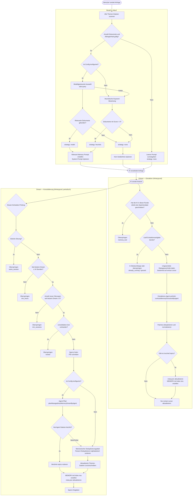
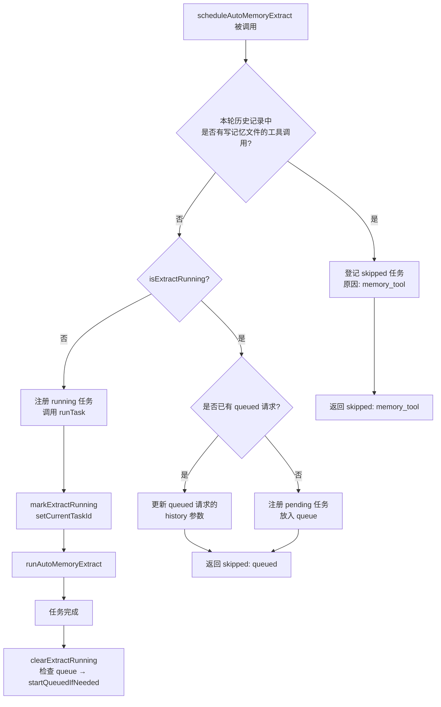
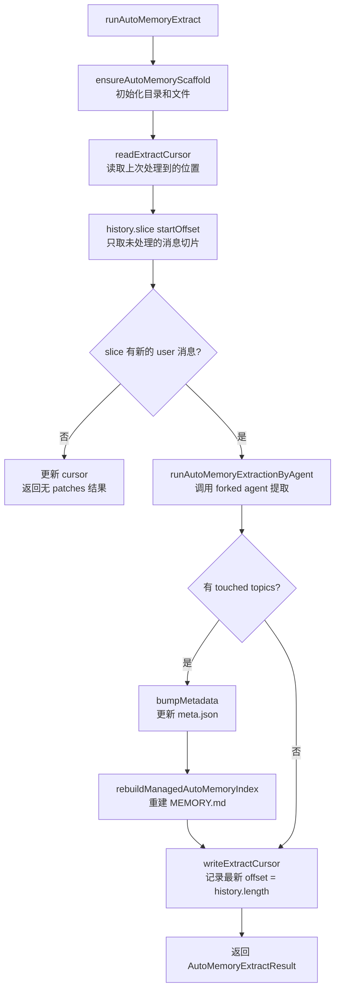
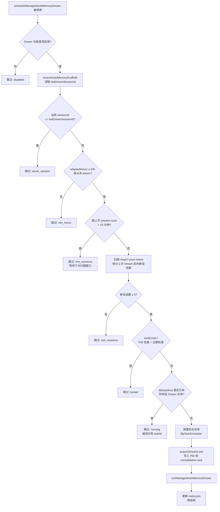
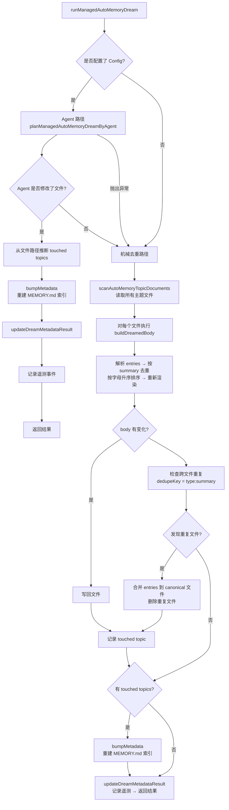
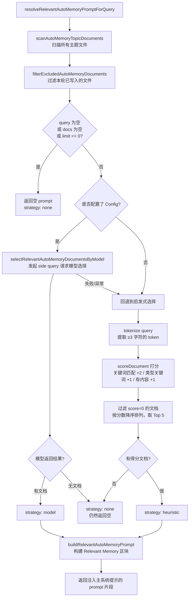
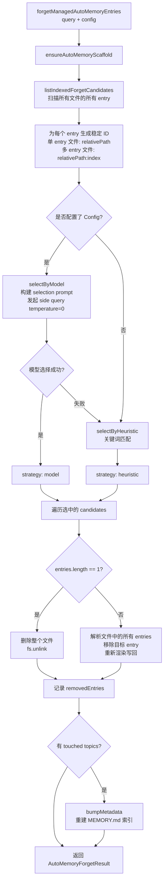

# Memory 记忆管理系统

> Dieser Artikel beschreibt den Mechanismus des **Managed Auto-Memory** (verwaltetes automatisches Gedächtnis) in Qwen Code, seine Auslöser und Implementierungsdetails.

---

## Inhaltsverzeichnis

1. [Übersicht](#übersicht)
2. [Speicherstruktur](#speicherstruktur)
3. [Speichertypen](#speichertypen)
4. [Format der Speichereinträge](#format-der-speichereinträge)
5. [Lebenszyklus](#lebenszyklus)
6. [Extract — Extraktion](#extract--extraktion)
7. [Dream — Konsolidierung](#dream--konsolidierung)
8. [Recall — Abruf](#recall--abruf)
9. [Forget — Vergessen](#forget--vergessen)
10. [Index-Neuerstellung](#index-neuerstellung)
11. [Telemetrie-Ereignisse](#telemetrie-ereignisse)

---

## Übersicht

Managed Auto-Memory ist ein System zur persistenten Speicherung von Benutzerwissen, das während KI-Konversationen **automatisch** gesammelt, konsolidiert und abgerufen wird. Es erhält den Lebenszyklus des Gedächtnisses durch vier Kernoperationen:

| Operation | Englisch | Auslöser                        | Wirkung                                                     |
| --------- | -------- | ------------------------------- | ----------------------------------------------------------- |
| Extrahieren | Extract  | Automatisch (nach jeder Runde)  | Extrahiert neues Wissen aus dem Dialog und schreibt es in Speicherdateien |
| Konsolidieren | Dream    | Automatisch (periodischer Hintergrundtask) | Dedupliziert und konsolidiert Speicherdateien, hält sie sauber |
| Abrufen   | Recall   | Automatisch (vor jeder Runde)   | Ruft relevantes Gedächtnis zur aktuellen Anfrage ab und injiziert es in den System-Prompt |
| Vergessen | Forget   | Manuell (Benutzerbefehl `/forget`) | Löscht gezielt bestimmte Speichereinträge                    |

---

## Speicherstruktur

### Verzeichnisstruktur

```
~/.qwen/                                      ← Globales Basisverzeichnis (Standard)
└── projects/
    └── <sanitized-git-root>/                 ← Projekt-ID (basierend auf Git-Root-Pfad)
        ├── meta.json                         ← Metadaten (Zeitstempel für Extract/Dream, Status)
        ├── extract-cursor.json               ← Extract-Cursor (bereits verarbeiteter Dialog-Offset)
        ├── consolidation.lock                ← Mutex für Dream-Prozess
        └── memory/                           ← Hauptverzeichnis für Speicher
            ├── MEMORY.md                     ← Indexdatei (automatisch generiert, fasst alle Einträge zusammen)
            ├── user.md                       ← Benutzerpräferenz-Gedächtnis (Beispiel)
            ├── feedback.md                   ← Feedback-Regel-Gedächtnis (Beispiel)
            ├── project/
            │   └── milestone.md              ← Projekt-Gedächtnis (unterstützt Unterverzeichnisse)
            └── reference/
                └── grafana.md                ← Externes Ressourcen-Gedächtnis
```

> **Umgebungsvariablen-Override**:
>
> - `QWEN_CODE_MEMORY_BASE_DIR`: Ersetzt das globale Basisverzeichnis
> - `QWEN_CODE_MEMORY_LOCAL=1`: Nutzt projektspezifischen Pfad `.qwen/memory/`

### Wichtige Dateien

| Datei                 | Beschreibung                                                                 |
| --------------------- | ---------------------------------------------------------------------------- |
| `meta.json`           | Zeichnet Zeitstempel, Sitzungs-ID, beteiligte Speichertypen und Ausführungsstatus des letzten Extract / Dream auf |
| `extract-cursor.json` | Zeichnet den aktuellen Offset im Dialogverlauf auf, um Doppelextraktion zu vermeiden |
| `consolidation.lock`  | Dateisperre während Dream, Inhalt ist PID des Halters, verfällt nach 1 Stunde automatisch |
| `MEMORY.md`           | Index aller Themen-Dateien, wird nach jedem Extract/Dream neu erstellt, Format: Markdown-Liste |

---

## Speichertypen

Das System unterstützt vier integrierte Speichertypen, die jeweils eine andere Informationsdimension abdecken:

| Typ         | Speicherinhalt                                           | Wann geschrieben                         | Wann gelesen                          |
| ----------- | -------------------------------------------------------- | ---------------------------------------- | ------------------------------------- |
| `user`      | Rolle des Benutzers, Fähigkeiten, Arbeitsgewohnheiten    | Wenn Benutzerrolle/-präferenz/-hintergrund bekannt wird | Wenn Antwort an Benutzerkontext angepasst werden muss |
| `feedback`  | Leitlinien des Benutzers für KI-Verhalten: was vermeiden/was fortsetzen | Wenn Benutzer KI korrigiert oder nicht offensichtliche Handlung bestätigt | Wenn KI-Verhalten beeinflusst wird     |
| `project`   | Projektfortschritt, Ziele, Entscheidungen, Fristen, Bug-Tracking | Wenn bekannt wird: wer macht was, warum, bis wann | Wenn KI Arbeitskontext und Motivation verstehen muss |
| `reference` | Zeiger auf externe Systemressourcen (Dashboard, Ticketsystem, Slack-Channel etc.) | Wenn eine externe Ressource und ihr Zweck bekannt wird | Wenn Benutzer externes System oder relevante Info erwähnt |

**Nicht in das Gedächtnis aufnehmen**: Codestile/-konventionen, Git-Historie, Debugging-Lösungen, temporäre Aufgabenstatus, bereits in QWEN.md/AGENTS.md dokumentierte Inhalte.

---

## Format der Speichereinträge

Jede Themen-Datei verwendet das Format **YAML-Frontmatter + Markdown-Body**:

```markdown
---
name: Name des Gedächtnisses
description: Ein-Satz-Beschreibung (für Relevanzabruf, möglichst konkret)
type: user|feedback|project|reference
---

Hauptinhalt des Gedächtnisses (Zusammenfassungszeile)

Why: Grund (damit KI Randfälle versteht und nicht blind Regel befolgt)
How to apply: Anwendungsszenarien und Nutzungsweise
```

Bei den Typen `feedback` und `project` wird dringend empfohlen, `Why` und `How to apply` auszufüllen, damit das Gedächtnis auch in Grenzfällen korrekt angewendet wird.

---

## Lebenszyklus


## Extract – Extraktion

### Auslösezeitpunkt

Wird jedes Mal automatisch durch `scheduleAutoMemoryExtract` ausgelöst (im Hintergrund, nicht blockierend), nachdem die KI eine Antwortrunde abgeschlossen hat.

### Planungslogik (`extractScheduler.ts`)



**Grund für Überspringen**:

| Grund             | Bedeutung                                        |
| ----------------- | ------------------------------------------------ |
| `memory_tool`     | Haupt‑Agent hat in dieser Runde direkt Gedächtnisdatei geschrieben, Überspringen zur Vermeidung von Konflikten |
| `already_running` | Extraktion läuft bereits und kann nicht eingereiht werden |
| `queued`          | Extraktion läuft bereits, diese Anfrage wurde in die Warteschlange gestellt |

### Kern‑Extraktionsablauf (`extract.ts`)



> **Hinweis:** Das `isUnderMemoryPressure`‑Gate befindet sich in `MemoryManager.runExtract()`, nicht in diesem Ablauf. Wenn der Monitor einen harten/kritischen Druck meldet, überspringt `MemoryManager` den Extract‑Aufruf und verschiebt den Cursor nicht.

**Extraktions‑Cursor**:

- Felder: `{ sessionId, processedOffset, updatedAt }`
- Vor der Extraktion wird der aktuelle Fortschritt via `readExtractCursor` gelesen, dann wird mit `history.slice(processedOffset)` nur der ungelesene Teil verarbeitet
- Nach jeder Extraktion wird `processedOffset` auf die aktuelle Historienlänge (`params.history.length`) aktualisiert
- Bei Sessionswechsel (`sessionId` ändert sich) wird wieder bei Offset 0 begonnen
- Hinweis: Es wird nicht mehr `buildTranscriptMessages` / `loadUnprocessedTranscriptSlice` verwendet – `hasNewUserMessages` wird durch `history.slice(startOffset).some(m => m.role === 'user' && partToString(m.parts).trim().length > 0)` ermittelt, nur auf dem un‑gelesenen Slice wird eine leichte Stringifikation durchgeführt, die gesamte Historie wird nicht mehr verarbeitet

**Patch‑Filterregeln**:

- Zusammenfassung kürzer als 12 Zeichen → verwerfen
- Zusammenfassung endet mit `?` → verwerfen (Fragesatz)
- Enthält temporäre Schlüsselwörter (today/now/currently/temporary etc.) → verwerfen
- Gleiche `topic:summary`‑Kombination → deduplizieren

---

## Dream – Integration

### Auslösezeitpunkt

Wird automatisch durch `scheduleManagedAutoMemoryDream` ausgelöst (im Hintergrund, nicht blockierend), nachdem die KI eine Antwortrunde abgeschlossen hat. Wird aber von mehreren Gates geschützt und in den meisten Fällen übersprungen.

### Planungs‑Gates (`dreamScheduler.ts`)



**Gate‑Parameter**:

| Parameter                  | Standardwert | Beschreibung                                           |
| -------------------------- | ------------ | ------------------------------------------------------ |
| `minHoursBetweenDreams`    | 24 Stunden   | Mindestzeitabstand zwischen zwei Dreams                |
| `minSessionsBetweenDreams` | 5 Sessions   | Mindestanzahl neuer Sessions, um einen Dream auszulösen |
| `SESSION_SCAN_INTERVAL_MS` | 10 Minuten   | Drosselintervall für Session‑Datei‑Scans               |
| `DREAM_LOCK_STALE_MS`      | 1 Stunde     | Zeitgrenze, nach der eine Lock‑Datei als veraltet gilt |

**Lock‑Mechanismus**:

- Lock‑Datei liegt unter `<project-state-dir>/consolidation.lock`
- Inhalt ist die PID des haltenden Prozesses
- Bei Prüfung: Wenn der PID‑Prozess nicht mehr existiert (`kill(pid, 0)` schlägt fehl) oder das Lock älter als 1 Stunde ist → als veraltet betrachten, automatisch löschen

### Integrations‑Ausführungsablauf (`dream.ts`)



**Mechanische Deduplizierungslogik**:

1. Innerhalb jeder Themendatei: nach `summary.toLowerCase()` deduplizieren, Felder `why`/`howToApply` zusammenführen
2. Nach Summary‑alphabetischer Reihenfolge neu sortieren
3. Dateiübergreifend: Einträge mit gleichem `type:summary` in die zuerst gefundene Datei zusammenführen, doppelte Dateien löschen
## Recall — Abruf

### Auslösezeitpunkt

Vor jeder AI-Verarbeitung einer Benutzeranfrage wird automatisch `resolveRelevantAutoMemoryPromptForQuery` ausgelöst, um relevante Erinnerungen in den System-Prompt einzufügen.

### Abrufablauf (`recall.ts`)



**Bewertungsregeln (heuristisch)**:

| Bedingung                                       | Punkte          |
| ----------------------------------------------- | --------------- |
| query token kommt im Dokumentinhalt vor         | +2 (pro Token)  |
| query token ist ein charakteristisches Schlüsselwort dieses Typs | +1 (pro Token)  |
| Dokument-body ist nicht leer                    | +1              |

**Charakteristische Schlüsselwörter pro Typ**:

- `user`: user, preference, background, role, terse
- `feedback`: feedback, rule, avoid, style, summary
- `project`: project, goal, incident, deadline, release
- `reference`: reference, dashboard, ticket, docs, link

**Prompt-Aufbauregeln**:

- Maximal 5 Dokumente einfügen (`MAX_RELEVANT_DOCS`)
- Jeder Dokument-body wird auf 1200 Zeichen gekürzt (`MAX_DOC_BODY_CHARS`)
- Bei Überschreitung wird der Hinweis angehängt: „NOTE: Relevant memory truncated for prompt budget."
- Enthält Informationen zur Frische des Dokuments (basierend auf Datei-Mtime)

---

## Forget — Vergessen

### Auslösezeitpunkt

Wird durch manuelle Ausführung des Befehls `/forget <query>` durch den Benutzer ausgelöst.

### Vergessensablauf (`forget.ts`)



**Entry-ID-Design**:

- Datei mit einem Eintrag (häufig): `relativePath` (z. B. `feedback/no-summary.md`)
- Datei mit mehreren Einträgen: `relativePath:index` (z. B. `feedback/style.md:2`)
- Verwendung stabiler IDs, damit das Modell Einträge genau lokalisieren kann, ohne andere Einträge in derselben Datei zu beeinflussen.

---

## Index-Neuerstellung

`MEMORY.md` ist der Navigationsindex aller Themendateien. Nach jedem Extract oder Dream wird `rebuildManagedAutoMemoryIndex` aufgerufen, um ihn neu zu erstellen:

```
- [用户偏好](user/preferences.md) — 用户是资深 Go 工程师，第一次接触 React
- [反馈规范](feedback/style.md) — 保持回复简洁，不要尾部总结
- [项目里程碑](project/milestone.md) — 移动端发布切分支前的合并冻结窗口
```

**Index-Beschränkungen**:

- Maximal 150 Zeichen pro Zeile (bei Überschreitung mit `…` abgeschnitten)
- Maximal 200 Zeilen
- Gesamtgröße nicht mehr als 25.000 Bytes

---

## Telemetrie-Ereignisse

Das System enthält drei Arten von Telemetrie-Ereignissen zur Überwachung der Leistung und Effektivität von Speichervorgängen:

### Extract-Telemetrie

| Feld             | Typ                        | Beschreibung                                    |
| ---------------- | -------------------------- | ----------------------------------------------- |
| `trigger`        | `'auto'`                   | Auslöseart (derzeit nur automatisch)            |
| `status`         | `'completed'` \| `'failed'`| Ausführungsergebnis                             |
| `patches_count`  | number                     | Anzahl der extrahierten gültigen Patches        |
| `touched_topics` | string[]                   | Liste der beschriebenen Speichertypen           |
| `duration_ms`    | number                     | Gesamtdauer (Millisekunden)                     |

### Dream-Telemetrie

| Feld              | Typ                                     | Beschreibung                                  |
| ----------------- | --------------------------------------- | --------------------------------------------- |
| `trigger`         | `'auto'`                                | Auslöseart                                    |
| `status`          | `'updated'` \| `'noop'` \| `'failed'`   | Ausführungsergebnis                           |
| `deduped_entries` | number                                  | Anzahl der mechanisch deduplizierten Einträge |
| `touched_topics`  | string[]                                | Liste der geänderten Speichertypen            |
| `duration_ms`     | number                                  | Gesamtdauer (Millisekunden)                   |

### Recall-Telemetrie

| Feld            | Typ                                    | Beschreibung                                  |
| --------------- | -------------------------------------- | --------------------------------------------- |
| `query_length`  | number                                 | Länge der Abfragezeichenfolge                 |
| `docs_scanned`  | number                                 | Anzahl der gescannten Dokumente               |
| `docs_selected` | number                                 | Anzahl der endgültig eingefügten Dokumente    |
| `strategy`      | `'none'` \| `'heuristic'` \| `'model'` | Auswahlstrategie                              |
| `duration_ms`   | number                                 | Gesamtdauer (Millisekunden)                   |

---

## Index der zugehörigen Quelldateien

| Datei                                                | Aufgabe                                                                             |
| ---------------------------------------------------- | ----------------------------------------------------------------------------------- |
| `packages/core/src/memory/types.ts`                  | Typdefinitionen: `AutoMemoryType`, `AutoMemoryMetadata`, `AutoMemoryExtractCursor` |
| `packages/core/src/memory/paths.ts`                  | Pfadberechnung: `getAutoMemoryRoot`, `isAutoMemPath`, verschiedene Dateipfad-Helfer |
| `packages/core/src/memory/store.ts`                  | Gerüstinitialisierung: `ensureAutoMemoryScaffold`, Index/Metadaten-Lesen/Schreiben |
| `packages/core/src/memory/scan.ts`                   | Scannen von Themendateien: `scanAutoMemoryTopicDocuments`, Frontmatter parsen       |
| `packages/core/src/memory/entries.ts`                | Eintrag-Parsen und Rendern: `parseAutoMemoryEntries`, `renderAutoMemoryBody`        |
| `packages/core/src/memory/extract.ts`                | Extraktionskernlogik: `runAutoMemoryExtract`, Cursor-Verwaltung, Patch-Deduplizierung |
| `packages/core/src/memory/extractScheduler.ts`       | Extraktionsplaner: `ManagedAutoMemoryExtractRuntime`, Warteschlange/Laufzustandsautomat |
| `packages/core/src/memory/extractionAgentPlanner.ts` | Extraktions-Agent: `runAutoMemoryExtractionByAgent`                                  |
| `packages/core/src/memory/dream.ts`                  | Integrationskernlogik: `runManagedAutoMemoryDream`, Agent-Pfad + mechanische Deduplizierung |
| `packages/core/src/memory/dreamScheduler.ts`         | Integrationsplaner: `ManagedAutoMemoryDreamRuntime`, Gate-Prüfung, Lock-Verwaltung   |
| `packages/core/src/memory/dreamAgentPlanner.ts`      | Integrations-Agent: `planManagedAutoMemoryDreamByAgent`                              |
| `packages/core/src/memory/recall.ts`                 | Abruflogik: `resolveRelevantAutoMemoryPromptForQuery`, heuristischer + Modell-Pfad  |
| `packages/core/src/memory/forget.ts`                 | Vergessenslogik: `forgetManagedAutoMemoryEntries`, Kandidatenerzeugung + genaues Löschen |
| `packages/core/src/memory/indexer.ts`                | Index-Neuerstellung: `rebuildManagedAutoMemoryIndex`, `buildManagedAutoMemoryIndex` |
| `packages/core/src/memory/prompt.ts`                 | System-Prompt-Vorlagen: Speichertyperklärungen, Formatbeispiele, Verwendungsrichtlinien |
| `packages/core/src/memory/governance.ts`             | Governance-Vorschlagstyp: `AutoMemoryGovernanceSuggestionType`                      |
| `packages/core/src/memory/state.ts`                  | Extraktionslaufstatus: `isExtractRunning`, `markExtractRunning`, `clearExtractRunning` |
| `packages/core/src/memory/memoryAge.ts`              | Frischebeschreibung: `memoryAge`, `memoryFreshnessText`                             |
