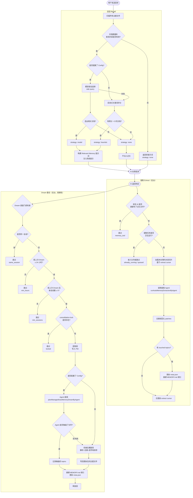
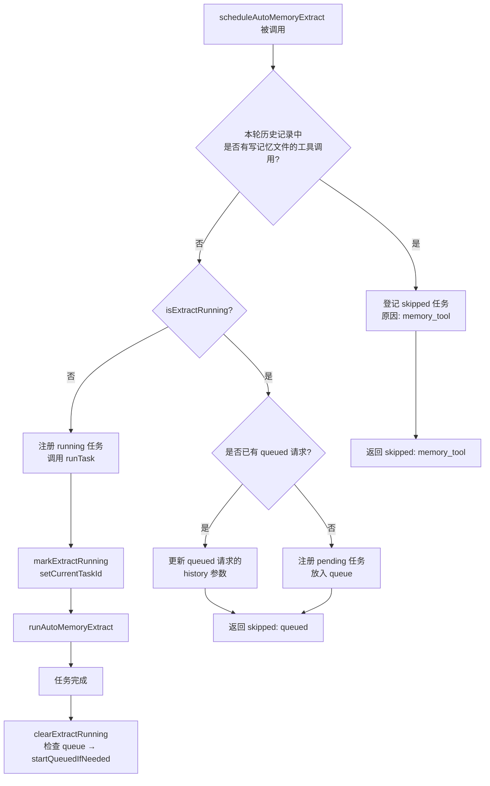
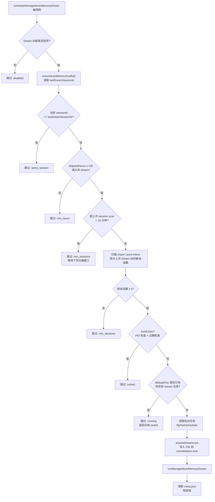
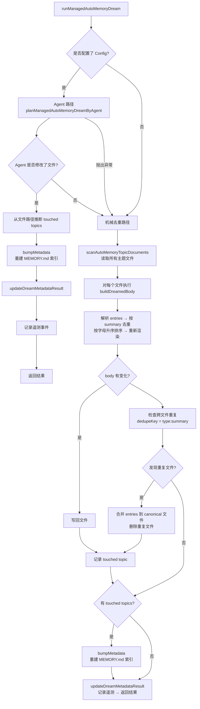
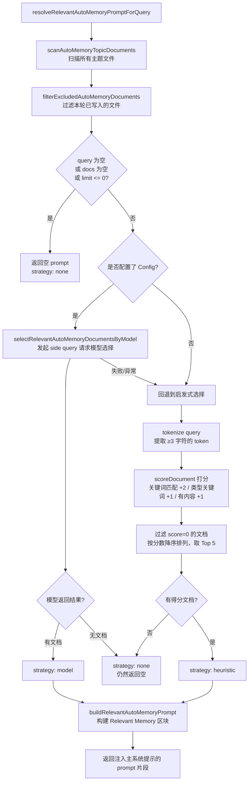
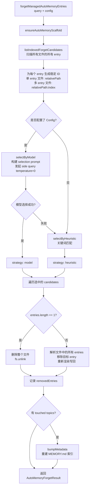

# Memory-Verwaltungssystem

> Dieser Artikel beschreibt den Mechanismus, die Auslösebedingungen und die Implementierungsdetails des **Managed Auto-Memory** (verwalteter automatischer Speicher) in Qwen Code.

---

## Inhaltsverzeichnis

1. [Übersicht](#übersicht)
2. [Speicherstruktur](#speicherstruktur)
3. [Speichertypen](#speichertypen)
4. [Format der Speichereinträge](#format-der-speichereinträge)
5. [Kernlebenszyklus](#kernlebenszyklus)
6. [Extract – Extraktion](#extract--extraktion)
7. [Dream – Konsolidierung](#dream--konsolidierung)
8. [Recall – Abruf](#recall--abruf)
9. [Forget – Vergessen](#forget--vergessen)
10. [Index-Neuaufbau](#index-neuaufbau)
11. [Telemetrie](#telemetrie)

---

## Übersicht

Managed Auto-Memory ist ein persistentes Speichersystem, das während KI-Sitzungen benutzerbezogenes Wissen **automatisch** sammelt, konsolidiert und abruft. Es verwaltet den Lebenszyklus der Erinnerungen über vier Kernoperationen:

| Operation | Englisch | Auslöser | Zweck |
| ---- | ------- | -------------------------- | -------------------------------------- |
| Extraktion | Extract | Automatisch (nach jeder Konversationsrunde) | Extrahiert neues Wissen aus dem Gesprächsverlauf und schreibt es in die Speicherdatei |
| Konsolidierung | Dream | Automatisch (periodischer Hintergrundtask) | Dedupliziert und zusammenführt Speicherdateien, um sie übersichtlich zu halten |
| Abruf | Recall | Automatisch (vor jeder Konversationsrunde) | Ruft relevante Erinnerungen zur aktuellen Anfrage ab und injiziert sie in den System-Prompt |
| Vergessen | Forget | Manuell (Benutzerbefehl `/forget`) | Löscht gezielt angegebene Speichereinträge |

---

## Speicherstruktur

### Verzeichnislayout

```
~/.qwen/                                      ← 全局基础目录（默认）
└── projects/
    └── <sanitized-git-root>/                 ← 项目标识（基于 Git 根路径）
        ├── meta.json                         ← 元数据（提取/整合时间戳、状态）
        ├── extract-cursor.json               ← 提取游标（已处理的对话偏移量）
        ├── consolidation.lock                ← Dream 进程互斥锁
        └── memory/                           ← 记忆主目录
            ├── MEMORY.md                     ← 索引文件（自动生成，汇总所有条目）
            ├── user.md                       ← 用户偏好记忆（示例）
            ├── feedback.md                   ← 反馈规范记忆（示例）
            ├── project/
            │   └── milestone.md              ← 项目记忆（支持子目录）
            └── reference/
                └── grafana.md                ← 外部资源记忆
```

> **Überschreibung durch Umgebungsvariablen**:
>
> - `QWEN_CODE_MEMORY_BASE_DIR`: Ersetzt das globale Basisverzeichnis
> - `QWEN_CODE_MEMORY_LOCAL=1`: Verwendet stattdessen den projektspezifischen Pfad `.qwen/memory/`

### Beschreibung der Schlüsseldateien

| Datei | Beschreibung |
| --------------------- | ---------------------------------------------------------------------- |
| `meta.json` | Protokolliert Zeitpunkt des letzten Extract/Dream, Session-ID, beteiligte Speichertypen und Ausführungsstatus |
| `extract-cursor.json` | Speichert den aktuellen Offset im Gesprächsverlauf der Session, um doppelte Extraktionen zu vermeiden |
| `consolidation.lock` | Dateisperre während der Dream-Ausführung; enthält die PID des Besitzers und läuft nach 1 Stunde automatisch ab |
| `MEMORY.md` | Index aller Themendateien; wird nach jedem Extract/Dream neu aufgebaut und als Markdown-Liste formatiert |

---

## Speichertypen

Das System unterstützt vier integrierte Speichertypen, die jeweils unterschiedliche Informationsdimensionen abdecken:

| Typ | Gespeicherter Inhalt | Wann geschrieben | Wann gelesen |
| ----------- | ----------------------------------------------------- | ---------------------------------------- | ---------------------------- |
| `user` | Rolle, fachlicher Hintergrund und Arbeitsgewohnheiten des Nutzers | Wenn Rolle/Präferenzen/Wissen des Nutzers erkannt werden | Wenn Antworten an den Nutzerhintergrund angepasst werden müssen |
| `feedback` | Anweisungen des Nutzers zum KI-Verhalten: Was zu vermeiden ist, was beibehalten werden soll | Wenn der Nutzer die KI korrigiert oder eine nicht offensichtliche Vorgehensweise bestätigt | Wenn es das Verhalten der KI beeinflusst |
| `project` | Projektfortschritt, Ziele, Entscheidungen, Deadlines, Bug-Tracking | Wenn bekannt wird, wer was warum bis wann macht | Wenn es der KI hilft, den Arbeitskontext und die Motivation zu verstehen |
| `reference` | Verweise auf externe Systemressourcen (Dashboards, Ticket-Systeme, Slack-Kanäle etc.) | Wenn eine externe Ressource und ihr Zweck bekannt werden | Wenn der Nutzer externe Systeme oder relevante Informationen erwähnt |

**Inhalte, die nicht gespeichert werden sollten**: Code-Patterns/Konventionen, Git-Historie, Debugging-Ansätze, temporäre Task-Status, Inhalte, die bereits in `QWEN.md`/`AGENTS.md` dokumentiert sind.

---

## Format der Speichereinträge

Jede Themendatei verwendet das Format **YAML-Frontmatter + Markdown-Body**:

```markdown
---
name: 记忆名称
description: 一句话描述（用于判断召回相关性，要具体）
type: user|feedback|project|reference
---

记忆主体内容（summary 行）

Why: 背后原因（让 AI 能理解边界情况而不是盲目遵守规则）
How to apply: 适用场景和使用方式
```

Für die Typen `feedback` und `project` wird dringend empfohlen, `Why` und `How to apply` auszufüllen, damit die Erinnerung auch in Grenzfällen korrekt angewendet werden kann.

---

## Kernlebenszyklus



---

## Extract – Extraktion

### Auslösebedingungen

Wird nach jeder abgeschlossenen KI-Antwort automatisch durch `scheduleAutoMemoryExtract` ausgelöst (nicht blockierend im Hintergrund).

### Scheduling-Logik (`extractScheduler.ts`)



**Erläuterung der Skip-Gründe**:

| Grund | Bedeutung |
| ----------------- | ----------------------------------------------- |
| `memory_tool` | Der Haupt-Agent hat in dieser Runde direkt Speicherdateien geschrieben; wird übersprungen, um Konflikte zu vermeiden |
| `already_running` | Extraktion läuft bereits und kann nicht in die Warteschlange gestellt werden |
| `queued` | Eine Extraktion läuft bereits, die aktuelle Anfrage wurde in die Warteschlange gestellt |

### Kern-Extraktionsablauf (`extract.ts`)

```mermaid
flowchart TD
    A[runAutoMemoryExtract] --> B[ensureAutoMemoryScaffold\n初始化目录和文件]
    B --> C[buildTranscriptMessages\n将 Content[] 转换为带 offset 的消息列表]
    C --> D[readExtractCursor\n读取上次处理到的位置]
    D --> E[loadUnprocessedTranscriptSlice\n截取未处理的消息段]
    E --> F{slice 为空?}
    F -- 是 --> G[返回无 patches 结果]
    F -- 否 --> H[runAutoMemoryExtractionByAgent\n调用 forked agent 提取 patches]
    H --> I[dedupeExtractPatches\n去重+规范化]
    I --> J{有 touched topics?}
    J -- 是 --> K[bumpMetadata\n更新 meta.json]
    K --> L[rebuildManagedAutoMemoryIndex\n重建 MEMORY.md]
    L --> M[writeExtractCursor\n记录最新 offset]
    J -- 否 --> M
    M --> N[返回 AutoMemoryExtractResult]
```

**Extraktions-Cursor**:

- Felder: `{ sessionId, processedOffset, updatedAt }`
- `processedOffset` wird nach jeder Extraktion auf die aktuelle Verlaufslänge aktualisiert
- Bei der nächsten Extraktion werden nur Nachrichten mit `offset >= processedOffset` verarbeitet
- Bei Session-Wechsel (`sessionId` ändert sich) wird bei Offset 0 neu begonnen

**Patch-Filterregeln**:

- Zusammenfassung < 12 Zeichen → wird verworfen
- Zusammenfassung endet mit `?` → wird verworfen (Fragesatz)
- Enthält temporäre Keywords (today/now/currently/temporary etc.) → wird verworfen
- Gleiche `topic:summary`-Kombination → wird dedupliziert

---

## Dream – Konsolidierung

### Auslösebedingungen

Wird nach jeder abgeschlossenen KI-Antwort automatisch durch `scheduleManagedAutoMemoryDream` ausgelöst (nicht blockierend im Hintergrund). Durch mehrere Gate-Bedingungen geschützt, wird es in den meisten Fällen jedoch übersprungen.

### Scheduling-Gates (`dreamScheduler.ts`)



**Gate-Parameter**:

| Parameter | Standardwert | Beschreibung |
| -------------------------- | -------- | ----------------------------- |
| `minHoursBetweenDreams` | 24 Stunden | Minimaler Zeitabstand zwischen zwei Dreams |
| `minSessionsBetweenDreams` | 5 Sessions | Minimale Anzahl neuer Sessions zum Auslösen eines Dreams |
| `SESSION_SCAN_INTERVAL_MS` | 10 Minuten | Drosselungsintervall für das Scannen von Session-Dateien |
| `DREAM_LOCK_STALE_MS` | 1 Stunde | Zeitschwelle, nach der eine Lock-Datei als abgelaufen gilt |

**Lock-Mechanismus**:

- Lock-Datei befindet sich unter `<project-state-dir>/consolidation.lock`
- Inhalt ist die PID des haltenden Prozesses
- Bei Prüfung: Wenn der PID-Prozess nicht mehr existiert (`kill(pid, 0)` fehlschlägt) oder der Lock älter als 1 Stunde ist → gilt als abgelaufen und wird automatisch entfernt

### Konsolidierungsablauf (`dream.ts`)



**Algorithmische Deduplizierungslogik**:

1. Innerhalb jeder Themendatei: Deduplizierung nach `summary.toLowerCase()`, Zusammenführung der `why`/`howToApply`-Felder
2. Neusortierung nach alphabetischer Reihenfolge der Summary
3. Dateiübergreifend: Einträge mit gleichem `type:summary` werden in die zuerst gefundene Datei zusammengeführt, Duplikate werden gelöscht

---

## Recall – Abruf

### Auslösebedingungen

Wird vor jeder Verarbeitung einer Nutzeranfrage durch die KI automatisch durch `resolveRelevantAutoMemoryPromptForQuery` ausgelöst, um relevante Erinnerungen in den System-Prompt zu injizieren.

### Abrufablauf (`recall.ts`)



**Bewertungsregeln (heuristisch)**:

| Bedingung | Punkte |
| -------------------------------- | ---------------- |
| Query-Token erscheint im Dokumentinhalt | +2 (pro Token) |
| Query-Token ist ein charakteristisches Keyword des Typs | +1 (pro Token) |
| Dokument-Body ist nicht leer | +1 |

**Charakteristische Keywords pro Typ**:

- `user`: user, preference, background, role, terse
- `feedback`: feedback, rule, avoid, style, summary
- `project`: project, goal, incident, deadline, release
- `reference`: reference, dashboard, ticket, docs, link

**Regeln zur Prompt-Erstellung**:

- Maximal 5 Dokumente werden injiziert (`MAX_RELEVANT_DOCS`)
- Der Body jedes Dokuments wird auf 1200 Zeichen gekürzt (`MAX_DOC_BODY_CHARS`)
- Bei Überschreitung wird der Hinweis angehängt: "NOTE: Relevant memory truncated for prompt budget."
- Enthält Frische-Informationen des Dokuments (basierend auf Datei-mtime)

---

## Forget – Vergessen

### Auslösebedingungen

Wird durch manuelle Ausführung des Befehls `/forget <query>` durch den Nutzer ausgelöst.

### Vergessensablauf (`forget.ts`)



**Design der Entry-IDs**:

- Einzeldateien (häufigster Fall): `relativePath` (z. B. `feedback/no-summary.md`)
- Mehrfachdateien: `relativePath:index` (z. B. `feedback/style.md:2`)
- Stabile IDs ermöglichen es dem Modell, Einträge präzise zu adressieren, ohne andere Einträge in derselben Datei zu beeinträchtigen

---

## Index-Neuaufbau

`MEMORY.md` ist der Navigationsindex aller Themendateien und wird nach jedem Extract oder Dream durch Aufruf von `rebuildManagedAutoMemoryIndex` neu aufgebaut:

```
- [用户偏好](user/preferences.md) — 用户是资深 Go 工程师，第一次接触 React
- [反馈规范](feedback/style.md) — 保持回复简洁，不要尾部总结
- [项目里程碑](project/milestone.md) — 移动端发布切分支前的合并冻结窗口
```

**Index-Limits**:

- Maximal 150 Zeichen pro Zeile (Überschreitung wird mit `…` gekürzt)
- Maximal 200 Zeilen
- Gesamtgröße maximal 25.000 Byte

---

## Telemetrie

Das System enthält drei Arten von Telemetrie-Events zur Überwachung der Performance und Effektivität von Speicheroperationen:

### Extract-Telemetrie

| Feld | Typ | Beschreibung |
| ---------------- | --------------------------- | ----------------------- |
| `trigger` | `'auto'` | Auslöseart (derzeit nur automatisch) |
| `status` | `'completed'` \| `'failed'` | Ausführungsergebnis |
| `patches_count` | number | Anzahl extrahierter gültiger Patches |
| `touched_topics` | string[] | Liste der geschriebenen Speichertypen |
| `duration_ms` | number | Gesamtdauer (Millisekunden) |

### Dream-Telemetrie

| Feld | Typ | Beschreibung |
| ----------------- | ------------------------------------- | ---------------------- |
| `trigger` | `'auto'` | Auslöseart |
| `status` | `'updated'` \| `'noop'` \| `'failed'` | Ausführungsergebnis |
| `deduped_entries` | number | Anzahl deduplizierter Einträge im algorithmischen Pfad |
| `touched_topics` | string[] | Liste der geänderten Speichertypen |
| `duration_ms` | number | Gesamtdauer (Millisekunden) |

### Recall-Telemetrie

| Feld | Typ | Beschreibung |
| --------------- | -------------------------------------- | ---------------- |
| `query_length` | number | Länge des Query-Strings |
| `docs_scanned` | number | Gesamtzahl gescannter Dokumente |
| `docs_selected` | number | Anzahl final injizierter Dokumente |
| `strategy` | `'none'` \| `'heuristic'` \| `'model'` | Auswahlstrategie |
| `duration_ms` | number | Gesamtdauer (Millisekunden) |

---

## Index relevanter Quelldateien

| Datei | Verantwortung |
| ---------------------------------------------------- | ----------------------------------------------------------------------------- |
| `packages/core/src/memory/types.ts` | Typdefinitionen: `AutoMemoryType`, `AutoMemoryMetadata`, `AutoMemoryExtractCursor` |
| `packages/core/src/memory/paths.ts` | Pfadberechnung: `getAutoMemoryRoot`, `isAutoMemPath`, diverse Pfad-Helper |
| `packages/core/src/memory/store.ts` | Scaffold-Initialisierung: `ensureAutoMemoryScaffold`, Lesen/Schreiben von Index/Metadaten |
| `packages/core/src/memory/scan.ts` | Scannen von Themendateien: `scanAutoMemoryTopicDocuments`, Frontmatter-Parsing |
| `packages/core/src/memory/entries.ts` | Eintrags-Parsing und Rendering: `parseAutoMemoryEntries`, `renderAutoMemoryBody` |
| `packages/core/src/memory/extract.ts` | Kernlogik Extraktion: `runAutoMemoryExtract`, Cursor-Management, Patch-Deduplizierung |
| `packages/core/src/memory/extractScheduler.ts` | Extraktions-Scheduler: `ManagedAutoMemoryExtractRuntime`, Queue/Laufzeit-Statusmaschine |
| `packages/core/src/memory/extractionAgentPlanner.ts` | Extraktions-Agent: `runAutoMemoryExtractionByAgent` |
| `packages/core/src/memory/dream.ts` | Kernlogik Konsolidierung: `runManagedAutoMemoryDream`, Agent-Pfad + algorithmische Deduplizierung |
| `packages/core/src/memory/dreamScheduler.ts` | Konsolidierungs-Scheduler: `ManagedAutoMemoryDreamRuntime`, Gate-Prüfungen, Lock-Management |
| `packages/core/src/memory/dreamAgentPlanner.ts` | Konsolidierungs-Agent: `planManagedAutoMemoryDreamByAgent` |
| `packages/core/src/memory/recall.ts` | Abruflogik: `resolveRelevantAutoMemoryPromptForQuery`, heuristischer + modellbasierter Dual-Pfad |
| `packages/core/src/memory/forget.ts` | Vergessenslogik: `forgetManagedAutoMemoryEntries`, Kandidatengenerierung + gezieltes Löschen |
| `packages/core/src/memory/indexer.ts` | Index-Neuaufbau: `rebuildManagedAutoMemoryIndex`, `buildManagedAutoMemoryIndex` |
| `packages/core/src/memory/prompt.ts` | System-Prompt-Templates: Erläuterung der Speichertypen, Formatbeispiele, Nutzungsrichtlinien |
| `packages/core/src/memory/governance.ts` | Governance-Empfehlungstypen: `AutoMemoryGovernanceSuggestionType` |
| `packages/core/src/memory/state.ts` | Extraktionslaufzeitstatus: `isExtractRunning`, `markExtractRunning`, `clearExtractRunning` |
| `packages/core/src/memory/memoryAge.ts` | Frische-Beschreibung: `memoryAge`, `memoryFreshnessText` |