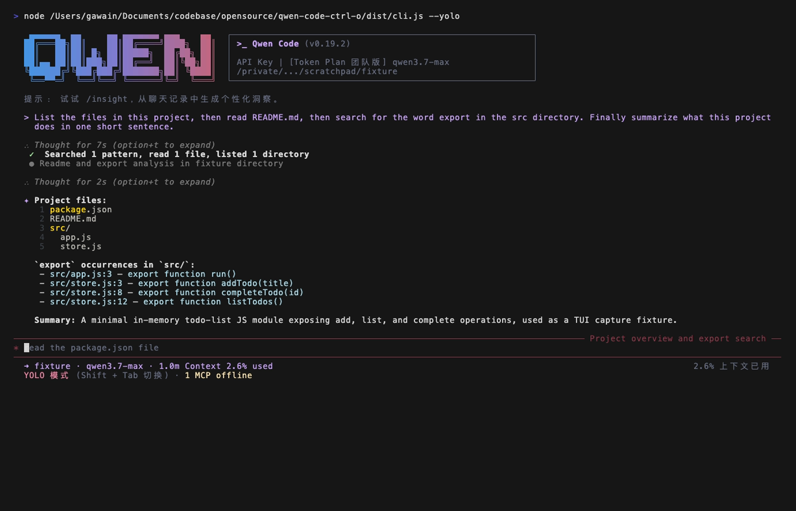

# Designvorschlag: Ctrl+O-Verhaltensrefaktor — Ausrichtung am Transkript-Modell von Claude Code

> **⚠️ Überholt (superseded)**: Der in diesem Dokument beschriebene Ansatz **`TranscriptView` + `AlternateScreen` Full-Detail-Freeze-Snapshot-Screen** wurde in einem späteren Refaktor (PR #8077) **entfernt**. In der aktuellen Implementierung öffnet `Ctrl+O` (teilt sich `Command.TOGGLE_THINKING_EXPANDED` mit `Alt+T`) keinen separaten Transkript-Screen mehr, sondern **schaltet den Full-Detail-Modus inline um**: Über `ThoughtExpandedContext.allExpanded` wird von `MainContent` als `fullDetail` an jedes `HistoryItemDisplay` übergeben, wodurch alle Thinking-Blöcke und Tool-Gruppen inline in der Hauptansicht expandiert werden (und die Tool-Ergebnis-Trunkierung aufgehoben wird); ein weiterer Druck klappt wieder ein. Die Abschnitte unten, die einen separaten Transkript-Screen und Alt-Screen beschreiben (wie §3.2, §4.2–§4.5, die gestapelte Commit-Aufteilung in §9), bleiben nur als **historische Aufzeichnung** erhalten und stimmen nicht mit dem aktuellen Code überein.

- Branch: `feat/ctrl-o-detail-expand`
- Worktree: `<worktree-path>`
- Status: **Implementierung läuft — dieses Dokument ist die Abnahme-Baseline der aktuellen PR-Implementierung** (nicht docs-only; die aktuelle PR enthält bereits Implementierungs-Dateiänderungen)
- Zielgruppe: qwen-code-TUI-Maintainer

> **Implementierungs-Statusübersicht (aktuelle PR)**:
>
> | Teil                                                                                                                     | Status                                                                                                                                                                                                   |
> | ------------------------------------------------------------------------------------------------------------------------ | -------------------------------------------------------------------------------------------------------------------------------------------------------------------------------------------------------- |
> | Entfernung des globalen compactMode (context/settings/toggle/i18n-Key, `mergeCompactToolGroups`)                          | ✅ Implementiert                                                                                                                                                                                         |
> | `fullDetail`-Pipeline (`HistoryItemDisplay`/`ToolGroupMessage`, Integration von `forceExpandAll`/`forceShowResult`/Thinking-Block-expanded) | ✅ Implementiert                                                                                                                                                                                         |
> | `fullDetail` wird nicht von den zwei Early-Returns in `ToolGroupMessage` umgangen (rein parallele / memory-only bewachen `!fullDetail`) | ✅ Implementiert + Regressionstests                                                                                                                                                                      |
> | `TranscriptView` + Alt-Screen-Anbindung (Ctrl+O-Toggle, Esc/q/Ctrl+C schließen, Zwei-Segment-Freeze, Exit-Redraw, Auto-Close bei Hintergrundbestätigung, Message-Queue-Guard) | ✅ Implementiert                                                                                                                                                                                         |
> | Rebase auf die type-based partition aus #5661 (bereits in main gemerged)                                                                                          | ✅ Implementiert                                                                                                                                                                                         |
> | `process.stdout.isTTY`-Guard in `AlternateScreen` (§4.2)                                                                                                          | ✅ Implementiert + Tests                                                                                                                                                                                 |
> | Cleanup alter compact-i18n-Texte (9 Sprachen) + KeyboardShortcuts-Text `ctrl+o → view transcript` (§5)                                                            | ✅ Implementiert                                                                                                                                                                                         |
> | **Vollständige Detail-Weiterleitung für read/search/list ins Transkript (§4.9: `detailedDisplay`-Extraktions-Helper + Rendering-Split + live/resume/replay)**    | ✅ **Implementiert + Tests** (Ansatz Y: Core `getToolResponseDisplayText` + live/resume-Ableitung + `ToolMessage`-Datenquellenwechsel; ACP bringt über `transformPartsToToolCallContent` bereits Volltext mit, keine neuen Protokollfelder nötig; Screenshot §3.4 muss neu aufgenommen werden) |
> | **Mausklick-Inline-Expansion von Tool-Blöcken (§4.8, Follow-up)**                                                                                                 | ⏭️ **Follow-up (separate PR, nicht in dieser PR)** — Begründung siehe §4.8: keine Per-Tool-Klickziele unter type-based, ~250–400 Zeilen, SGR-Selection-Risiko                                          |

---

## 1. Hintergrund und Problem

qwen-code bindet aktuell **Ctrl+O an `TOGGLE_COMPACT_MODE`**: ein **globaler Zwei-Zustands-Schalter** (`compactMode`, persistiert in `settings.ui.compactMode`). Wenn aktiviert:

- werden Ergebnis-Ausgaben abgeschlossener (Success) Tools ausgeblendet;
- werden Thinking-Blöcke auf eine einzelne Zeile `Thought for …` zusammengefaltet;
- ein einziger Tastendruck **rendert die gesamte Historie rückwirkend neu** (`refreshStatic()` hängt `<Static>` neu auf).

Das erzeugt eine globale Spaltung zwischen "**Kompaktmodus vs Detailmodus**": dieselbe Historie springt durch einen globalen Schalter komplett zwischen zwei völlig verschiedenen Erscheinungsformen, mit hoher kognitiver Last und deutlichem visuellen Flackern, und widerspricht sowohl der Designphilosophie des Upstream gemini-cli als auch von Claude Code.

> **Dieser Ansatz baut auf der partition-Baseline von [#5661](https://github.com/QwenLM/qwen-code/pull/5661) auf (bereits in main gemerged).** #5661 refaktorierte das Default-Rendering von Tool-Gruppen: `CompactToolGroupDisplay` wurde zu einem **nach Kategorie partitionierenden Summary-Renderer** erweitert (`ToolCategory` / `TOOL_NAME_TO_CATEGORY` / `CATEGORY_ORDER` / `getToolCategory` / `buildToolSummary`), und die Einklapp-Entscheidung von `ToolGroupMessage` wurde auf **type-based partition** umgestellt: mit `forceExpandAll` als inversem Gate werden Tools **nach Typ** in `collapsibleTools` (read/search/list, über `isCollapsibleTool(name)`) aufgeteilt → eingeklappt zu `CompactToolGroupDisplay`-Partition-Summary, und `nonCollapsibleTools` (edit/write/command/agent und Canceled) → **immer einzeln** als `ToolMessage`. **Hinweis: #5661 hat nichts mit `compactMode` zu tun** — `compactMode` beeinflusst das Tool-Rendering nicht mehr; das Partition-Einklappen wird rein durch Tool-Typ + `forceExpandAll` bestimmt. Diese PR **baut die Tool-Rendering-Baseline nicht neu** — sie stapelt auf der partition-Baseline von #5661 + der Maus-Infrastruktur von #5751: (1) Entfernung des verbliebenen globalen `compactMode`, (2) Ctrl+O-Transkript-Full-Detail-Screen, (3) Maus-Klick-Inline-Expansion von Tool-Blöcken. Details in §3.1 (partition-Baseline), §4.1 / §5 (Entfernungsliste), §9 (gestapelte Commit-Aufteilung).
>
> **Revisionshinweis (Rebase auf den Merge-Zustand von #5661)**: Frühere Versionen dieses Dokuments basierten auf einem frühen state-based Snapshot von #5661 (`showCompact = (compactMode || allComplete)`, gesamte Gruppe wird eingeklappt, sobald komplett abgeschlossen). #5661 entwickelte sich im Review zur oben genannten **type-based partition** und wurde in main gemerged. §3.1 / §4.1 / §4.5 / Anhang wurden auf Basis der tatsächlich gemergten Implementierung umgeschrieben: die Kernsymbole sind `isCollapsibleTool` / `forceExpandAll` (**sie existieren tatsächlich**), das `fullDetail` des Transkripts setzt direkt `forceExpandAll=true` (statt ein nicht mehr existierendes `showCompact` zu ändern).

### Ziele

**Die globale Unterscheidung „Kompakt/Detail" vollständig abschaffen**, ausgerichtet an Claude Code:

1. Die Hauptkonversationsansicht hat **nur ein einziges stabiles, eher knappes Default-Rendering** und verformt sich nicht mehr global durch einen Schalter.
2. **Ctrl+O ist nur für „volle Details bestimmter Blöcke ansehen" zuständig** — es öffnet einen **separaten Transkript-Full-Detail-Scroll-Screen**; die Hauptansicht bleibt immer sauber.
3. Der Inline-Hinweis `(ctrl+o to expand)` dient als Hinweis „hier gibt es mehr Inhalt, drücke Ctrl+O, um im Transkript das Gesamtbild zu sehen".
4. **(Follow-up, nicht in dieser PR) Maus-Klick-Inline-Expansion von Blöcken**: als VP-only-MVP einer Folge-PR — ein Klick auf eine eingeklappte Partition-Summary-Zeile expandiert die gesamte Gruppe inline. **Diese PR liefert das nicht** (Begründung siehe §4.8: unter type-based partition sind eingeklappte Tools bereits zu einer einzelnen Zeile aggregiert, es gibt keine Per-Tool-Klickziele, die Klick-Granularität muss neu bestimmt werden; zusätzlich SGR-Maus-/native-Selection-Risiko; Aufwand ~250–400 Zeilen). Das Klicken auf einen eingeklappten Thinking-Block zum Öffnen des ThinkingViewer wird bereits von main/#5751 bereitgestellt und von dieser PR nicht angetastet.

> Explizite Anweisung des Nutzers: **einfach direkt an Claude Code ausrichten**. Dieser Ansatz nimmt „getreue Nachbildung des Claude-Code-Modells ctrl+o = toggleTranscript" als Richtschnur. Die Maus-Klick-Expansion ist ein zweiter Interaktionskanal, der darüber gestapelt wird (Tastatur + Maus als zwei Kanäle).

---

## 2. Verhaltensvergleich der drei (Rechercheergebnis)

| Dimension        | qwen-code (Status quo / #5661-Basis)                          | Claude Code (real)                             | gemini-cli (Upstream)                     |
| ---------------- | ------------------------------------------------------------- | ---------------------------------------------- | ----------------------------------------- |
| Ctrl+O-Bindung   | `TOGGLE_COMPACT_MODE`                                         | `app:toggleTranscript`                         | `SHOW_MORE_LINES` + `EXPAND_PASTE`        |
| Kernmodell       | **globaler Kompakt/Detail-Zwei-Zustand** (persistiert) + partition-Auto-Einklappen von #5661 | **globaler Transkript-Screen** + Per-Block-Expansion | globales `constrainHeight` + Per-Tool-Expansion |
| Auswirkung auf Hauptansicht | ein Tastendruck rendert die gesamte Historie rückwirkend neu | Hauptansicht konstant; Transkript ist separater Screen | Höhenbeschränkung umschalten, „letzte Runde" expandieren |
| Block-Zustand    | ❌ keiner                                                      | ✅ `expandedKeys` (nach tool_use_id/uuid)      | ✅ `ToolActionsContext.toggleExpansion`   |
| Verlassen        | erneut Ctrl+O drücken                                          | erneut Ctrl+O / Esc zurück zum Prompt           | erneut Ctrl+O drücken zum Einklappen      |

**Die „neue Status-quo-Basis" von qwen = das type-based-partition-Modell von #5661 (Startpunkt dieses Ansatzes, keine alte Baseline, die umgestoßen werden soll):** #5661 entwickelte das Default-Rendering von Tool-Gruppen von „alles anzeigen/alles ausblenden je nach `compactMode`" zu **nach Tool-Typ partitioniertem Einklappen** — wenn `forceExpandAll` falsch ist, werden `collapsibleTools` (read/search/list, über `isCollapsibleTool(name)`, nicht Canceled) zu einer `CompactToolGroupDisplay`-Partition-Summary-Zeile eingeklappt (aggregiert nach `CATEGORY_ORDER`: search/read/list/command/edit/write/agent/other, z. B. `Read 3 files, edited 2 files`), `nonCollapsibleTools` (edit/write/command/agent + Canceled) werden **immer einzeln** als `ToolMessage` gerendert; Force-Bedingungen (Bestätigung/Fehler/fokussierte Shell/vom Nutzer initiiert/Terminal-Subagent) setzen `forceExpandAll=true` → alles einzeln expandiert. **Dieses Modell hat nichts mit `compactMode` zu tun** — `compactMode` beeinflusst in #5661 das Tool-Rendering nicht mehr (beeinflusst nur noch Thinking-Blöcke als Rest). Dieser Ansatz **behält auf dieser Basis den gesamten type-based-partition-Mechanismus unverändert**, entfernt nur den verbliebenen globalen `compactMode`-Schalter und stapelt das `fullDetail` des Transkripts darauf (setzt `forceExpandAll=true`).

**Der tatsächliche Mechanismus von Claude Code (aus Forensik des gebündelten `claude-code`-Quellcodes):**

- `defaultBindings.ts`: `'ctrl+o': 'app:toggleTranscript'`.
- `useGlobalKeybindings.tsx`: `setScreen(s => (s === 'transcript' ? 'prompt' : 'transcript'))`, plus Telemetrie `tengu_toggle_transcript`.
- `REPL.tsx`: wenn `screen === 'transcript'`, wird die **gesamte** Historie mit **virtuellem Scrollen** gerendert, mit `verbose={true}` (erzwingt volle Expansion); im `prompt`-Modus gibt es eine Zeilen-Anzeigeobergrenze.
- `CtrlOToExpand.tsx`: am Ende trunkierter Blöcke wird `(ctrl+o to expand)` gerendert; Klick/Druck wechselt ins Transkript, um das Gesamtbild zu sehen.
- Zusätzlich gibt es ein separates `expandedKeys` (pro Nachricht), aber **der primäre Interaktionskanal ist der Transkript-Screen**.

**Das Per-Block-Modell von gemini-cli (Forensik-Ergänzung)**: gemini-cli geht über Per-Tool-Expansion — `ToolActionsContext` mit `expandedTools` / `toggleExpansion` verwaltet den Expansionszustand pro einzelnes Tool. Das ist **derselbe Ansatz wie die in qwen main bereits vorhandene Alt+T-Per-Block-Thinking-Expansion (`ThoughtExpandedContext`)**: beide lösen „einzelnen Block inline expandieren". Das Transkript dieses Ansatzes löst dagegen eine **andere Dimension** — „vollständiger Rückblick über die gesamte Session" (Alt-Screen-Freeze-Snapshot, alle Blöcke in fullDetail, scrollbar). Beide sind orthogonal und komplementär (Details in §4.7).

**Wesentlicher Vorteil**: qwen-code besitzt bereits die komplette Basis für einen Transkript-Screen (`ScrollableList`/`VirtualizedList` + das bereits vorhandene `AlternateScreen.tsx`), siehe §4.4.

---

## 3. Zielverhaltensdefinition

### 3.1 Default-Baseline (Hauptansicht) = partition-Modell von #5661

Die Hauptansicht verwendet für **alle Historieneinträge** eine einzige, stabile Rendering-Regel; **es gibt keinen globalen Schalter, der sie umschaltet**. Diese Baseline ist **nicht von diesem Ansatz selbst gebaut**, sondern das bereits in [#5661](https://github.com/QwenLM/qwen-code/pull/5661) umgesetzte **type-based-partition-Modell (Einklappen nach Tool-Typ)** — dieser Ansatz behält es unverändert und entfernt nur den damit zusammenhanglosen globalen `compactMode`-Schalter:

| Block-Typ                                                        | Default-Baseline-Rendering (type-based-partition-Modell von #5661)                                                                                                                                        | Nur im Transkript vollständig sichtbar |
| ---------------------------------------------------------------- | ---------------------------------------------------------------------------------------------------------------------------------------------------------------------------------------------------------- | -------------------------------------- |
| Thinking (gemini_thought / \_content)                            | einzeilige Zusammenfassung `✻ Thought for 3s (ctrl+o to expand)`; beim Streaming live angezeigt, nach Festlegung zur Zusammenfassung reduziert                                                                | ja                                     |
| **Collapsible Tools** (read/search/list, nicht force)            | über `isCollapsibleTool(name)` in `collapsibleTools` eingeordnet, zu einer **`CompactToolGroupDisplay`-Partition-Summary-Zeile eingeklappt** (aggregiert nach `CATEGORY_ORDER`, z. B. `Read 3 files, edited 2 files, ran 1 command`) | Details pro Tool im Transkript sichtbar |
| **Non-collapsible Tools** (edit/write/command/agent / Canceled)  | in `nonCollapsibleTools` eingeordnet, **immer einzeln** als vollständige `ToolMessage` gerendert (ihre Ausgabe ist selbst die Antwort) — auch bei abgeschlossener Gruppe nicht zu Summary eingeklappt      | —                                      |
| Gemischte Gruppe (collapsible + non-collapsible zusammen)        | **Summary-Zeile + einzelne Tools koexistieren**: Collapsible-Teil → eine `CompactToolGroupDisplay`-Summary-Zeile; Non-collapsible-Teil → einzeln als `ToolMessage`. **Nicht die gesamte Gruppe wird eingeklappt** | teilweise                              |
| string/ansi-Ergebnisse abgeschlossener collapsible Tools         | standardmäßig eingeklappt (`shouldCollapseResult = !forceShowResult && Success && isCollapsibleTool(name) && (string\|ansi)` → Ergebnisbereich wird nicht gerendert); **Shell/Edit- u. a. non-collapsible Ergebnisse werden immer angezeigt**; diff/plan/todo/task haben eigene Renderer | im Transkript vollständig sichtbar     |
| Fehler / wartende Bestätigung / vom Nutzer initiiert / fokussierte Shell / Terminal-Subagent | setzen `forceExpandAll=true` → die ganze Gruppe einzeln als `ToolMessage`; das auslösende Tool erhält `forceShowResult=true`, um das Ergebnis-Einklappen aufzuheben                                        | —                                      |
| Normale Textnachricht                                            | vollständig angezeigt                                                                                                                                                                                       | —                                      |

Kernpunkte:

- **Das Partition-Einklappen wird von `forceExpandAll` + `isCollapsibleTool` aus #5661 getrieben** — in `ToolGroupMessage` ist `forceExpandAll = hasConfirmingTool || hasSubagentPendingConfirmation || hasErrorTool || isEmbeddedShellFocused || isUserInitiated || hasTerminalSubagent` (**ohne `compactMode`/`allComplete`**). Wenn `forceExpandAll` falsch ist, werden über `isCollapsibleTool(name)` (read/search/list, nicht Canceled) `collapsibleTools` herausgetrennt → `CompactToolGroupDisplay`-Summary, der Rest geht in `nonCollapsibleTools` → einzeln als `ToolMessage`; wenn wahr, gehen alle Tools in `nonCollapsibleTools`.
- **Das Einklappen abgeschlossener Ergebnisse wird vom `shouldCollapseResult`-Gate aus #5661 getrieben** — in `ToolMessage` ist `shouldCollapseResult = !forceShowResult && status === Success && isCollapsibleTool(name) && (renderer.type === 'string' || 'ansi')`. **Hinweis auf den zusätzlichen `isCollapsibleTool(name)`-Guard**: nur string/ansi-Ergebnisse von read/search/list werden eingeklappt; Ergebnisse non-collapsible Tools wie Shell/Edit/Agent sind **immer sichtbar**. `ToolGroupMessage` übergibt in Force-Szenarien an das auslösende Tool **einzeln** `forceShowResult=true` (`isUserInitiated || Confirming || Error || pending-agent || Terminal-Subagent`).
- **Die Force-Bedingungen haben die Sicherheitssemantik „muss sichtbar sein"** — Fehler-Stacks, Bestätigungs-Prompts, fokussierte Shell, vom Nutzer initiierte Tools werden alle über `forceExpandAll` nicht partition-eingeklappt, und Ergebnisse non-collapsible Tools werden von Natur aus nicht eingeklappt (plus `forceShowResult` für das auslösende Tool). **Die Kernsymbole `forceExpandAll` / `isCollapsibleTool` existieren tatsächlich** (in #5661 gemergte Implementierung); ein separates `shouldForceFullDetail.ts` / `COLLAPSIBLE_CATEGORIES` ist **nicht nötig** — die Force-Semantik ist in `forceExpandAll` inline, das Ergebnis-Einklapp-Gate ist in `shouldCollapseResult` inline (siehe §4.5).
- **`fullDetail` muss vor den zwei Early-Returns von `ToolGroupMessage` wirken (Implementierungsdetail, nicht regressieren)** — `ToolGroupMessage` hat **vor** der Berechnung von `forceExpandAll` zwei vorzeitige Rückgaben, die die Partitionslogik umgehen: (1) **rein parallele Agent-Gruppe** → dichtes `InlineParallelAgentsDisplay`-Panel; (2) **abgeschlossene memory-only-Gruppe** → `Recalled/Wrote N memories`-Badge. Beide würden dazu führen, dass auch unter Transkript-fullDetail **keine vollständige Anzeige** entsteht. Daher sind beide Early-Returns mit **`!fullDetail`** bewacht: wenn fullDetail wahr ist, werden sie übersprungen und jedes Tool/jeder Agent landet in einer einzelnen `ToolMessage` (`forceExpandAll=true` + `forceShowResult=true` + keine Trunkierung). Regressions-Tests vorhanden (memory-only-Gruppe wird unter fullDetail einzeln statt als Badge gerendert).

### 3.2 Ctrl+O = Transkript-Full-Detail-Screen öffnen/schließen (separater Freeze-Snapshot-Screen)

Getreue Nachbildung des Transkripts von Claude Code (bereits aus dem claude-code-Quellcode forensisch belegt):

- Zu beliebiger Zeit **Ctrl+O** drücken: wechselt zu einem Transkript, das den gesamten Screen übernimmt, und rendert einen **Freeze-Snapshot**: friert die Historie zum Eintrittszeitpunkt ein, **hebt die UI-seitigen Höhen-/Zeilen-Trunkierungen auf** (Thinking-Volltext, Tool-Ausgaben möglichst vollständig), unterstützt Hoch/Runter/PageUp/PageDown/Home/End-Scrollen. Der Default-VP-Pfad nutzt den bereits vom ink-Root belegten Alternate Screen; nur der Legacy-`<Static>`-Pfad tritt über die `AlternateScreen`-Komponente temporär via DEC `1049` (`\x1b[?1049h`) ein. ⚠️ „Vollständig" bezieht sich nur auf die UI-Schicht — **Inhalte, die durch Modell-Response-Budget oder Historien-display-Kompression bereits entfernt wurden, lassen sich nicht aus der UI-Historie wiederherstellen** (siehe §4.4); es ist nicht wörtlich „Volltext".
- **Freeze-Snapshot-Semantik (inklusive pending; Länge speichern statt Historie klonen)**: die Historie von qwen-code besteht aus **zwei Segmenten** — der festgelegten `history: HistoryItem[]` (`UIStateContext.tsx:45`) und den laufenden `pendingHistoryItems` (`:123`, beim Rendering mit negativen ids verkettet, `MainContent.tsx:456-461`). Der Freeze von Claude Code speichert tatsächlich nur zwei Zahlen `{ messagesLength, streamingToolUsesLength }` und slice't beim Render, statt zum Eintrittszeitpunkt zu klonen. **qwen-code friert entsprechend beide Segmente ein, aber in der sparsamsten Form**: die festgelegte Historie **speichert nur die Länge** `historyLength` (beim Rendering `history.slice(0, historyLength)`, kein Klonen der gesamten Historie), vom laufenden `pendingItems: [...pendingHistoryItems]` wird eine **flache Kopie gespeichert** (pending ist ein temporärer Bereich, der später überschrieben oder geleert wird; nur eine Kopie kann die Form zu jenem Zeitpunkt einfrieren). Das Transkript rendert `history.slice(0, historyLength)` verkettet mit dem **zum Eintrittszeitpunkt eingefrorenen** Pending-Snapshot. Später im Hintergrund neu hinzukommende Historie/Pending gelangen **nicht** ins Transkript und garantieren, dass das Standbild nicht zittert.
- **Beeinflusst nicht die Daten des Hauptscreens**: Hintergrundkonversation/Streaming laufen weiter (nur Eingabefeld/Spinner werden nicht gerendert). Beim Verlassen stellt der Default-VP-Pfad den Hauptbaum innerhalb desselben Root-Alt-Screens wieder her; der Legacy-Pfad verlässt den temporären Alt-Screen und hängt die aktuelle Historie über `refreshStatic()` neu auf, garantiert ohne Duplikate, ohne Verluste und ohne den Scrollback zu verschmutzen.
- **Exit-Tasten**: `Esc` / `q` (less-Stil) / `Ctrl+C` schließen; erneutes Drücken von **Ctrl+O** schaltet ebenfalls aus. Nach dem Verlassen kehrt man zum Hauptschirm zurück und sieht die während der Transkript-Öffnung im Hintergrund neu hinzugekommenen Streaming-Inhalte.
- Die Semantik des Inline-Hinweises `(ctrl+o to expand)` wird **vereinheitlicht zu „Ctrl+O drücken, um ins Transkript zu wechseln und den vollständigen Kontext zu sehen", statt „hier wurde trunkiert"**. Beachte: die Thinking-Block-Zusammenfassung trägt den Hinweis immer (unabhängig von der ursprünglichen Textlänge); Tool-Ausgaben tragen `+N lines` nur, wenn sie durch die Höhenbeschränkung trunkiert wurden — beide haben verschiedene Auslösebedingungen, das ist beabsichtigt (siehe §7 #7).

> Forensik: claude-code `ink/components/AlternateScreen.tsx`, `termio/dec.ts:16` (`ALT_SCREEN_CLEAR: 1049`), `screens/REPL.tsx:1325/4184/4381` (frozenTranscriptState + slice), `keybindings/defaultBindings.ts:160-169` (`escape/q/ctrl+c → transcript:exit`).

### 3.3 Beziehung zu Ctrl+S (`SHOW_MORE_LINES` / `constrainHeight`)

- `SHOW_MORE_LINES` (aktuell Ctrl+S) bleibt unverändert: es hebt die Höhenbeschränkung des **aktuellen Pending-Bereichs** auf, gehört zum „temporär mehr Zeilen während des Streaming-Ansehens" und ist orthogonal zum Transkript.
- Dieser Ansatz **fasst die Ctrl+S-Bindung nicht an**, um die Änderungsfläche nicht zu groß werden zu lassen. (Alternative: künftig kann evaluiert werden, `SHOW_MORE_LINES` ebenfalls ins Transkript zu integrieren, aber nicht in dieser Iteration.)

### 3.4 Implementierungs-Screenshots (VHS-automatisierte Aufnahme)

Die folgenden zwei Bilder sind Vorher/Nachher-Aufnahmen desselben Builds dieses Branches (`node dist/cli.js --yolo`) in einem festen virtuellen Terminal (1400×900 / FontSize 14), derselben Session, aufgenommen mit dem `qwen-code-mac-autotest`-Skill (`session.tape` ist reproduzierbar). Der Session-Prompt war: Dateien auflisten → `README.md` lesen → `export` greppen → Ein-Satz-Zusammenfassung, was die drei **collapsible** Tools list/read/grep auslöst.

**Hauptansicht (Default-Baseline, §3.1)** — die drei read/search/list-Tools sind zu einer einzeiligen Partition-Summary eingeklappt `✔ Searched 1 pattern, read 1 file, listed 1 directory`, Thinking-Blöcke sind zu `Thought for Ns (option+t to expand)` eingeklappt:



**Ctrl+O-Transkript-Screen (§3.2 + §4.5 `fullDetail`)** — Alt-Screen-Vollbild, Header „完整记录", Footer „Esc/q 关闭 ↑↓ 滚动 PgUp/PgDn Ctrl+Home/End"; in derselben Session werden die drei Tools von der **einzeiligen kombinierten Summary** der Hauptansicht in **jeweils eigene Zeilen** aufgeteilt, Thinking-Blöcke sind expandiert (`option+t to collapse`) und zeigen den Volltext:


> ⚠️ **Dieser Screenshot zeigt den Zustand vor der §4.9-Implementierung**: hier zeigen die read/search/list-Tools nur Ergebnisse auf **Summary-Ebene** (`Listed 3 item(s)` / `Found 4 matches` / `读取文件 README.md`) und **noch keine vollständigen Details** (Verzeichniseinträge, grep-Trefferzeilen, Datei-Volltext). Das heißt, das `fullDetail` aus §4.5 hob nur „Partition-Einklappen / Ergebnis-Einklapp-Gate / Höhenbeschränkung" auf, aber das `returnDisplay` collapsible Tools ist selbst nur eine Zusammenfassung — die Daten-Schicht-Weiterleitung der vollständigen Details ist §4.9 (**Merge-Blocker**); nach der Umsetzung wird dieser Screenshot **neu aufgenommen**, um das echte „Full-Detail" widerzuspiegeln.
>
> Vergleichspunkt: `fullDetail` wird über `forceExpandAll` an einer Stelle integriert und hebt gleichzeitig Partition-Einklappen, Pro-Tool-Ergebnis-Einklapp-Gate und Höhenbeschränkung auf (§4.5), ohne das nicht mehr existierende `showCompact` berühren zu müssen. Die chinesischen i18n-Keys (`完整记录` / `关闭` / `滚动` / `列出文件` / `读取文件`) werden alle korrekt gerendert.

---

## 4. Architekturentwurf

### 4.1 Entfernung des verbliebenen globalen compactMode (Netto-Entfernung auf der partition-Baseline von #5661)

> **Scope-Klarstellung**: #5661 hat die Tool-Rendering-Baseline bereits auf das type-based-partition-Modell umgestellt, **und `compactMode` beeinflusst in #5661 das Tool-Rendering nicht mehr** (`forceExpandAll` referenziert `compactMode` nicht; `compactToggleHasVisualEffect` wurde von #5661 so geändert, dass es nur noch `gemini_thought` prüft, nicht mehr `tool_group`). Daher ist der Entfernungsumfang dieser PR **kleiner** als ursprünglich gedacht: es wird nur der nach #5661 **weiterhin verbliebene globale Zwei-Zustands-Schalter** entfernt (context/settings/binding/i18n), die Partitionsentscheidung von `ToolGroupMessage` wird **nicht angefasst** (es gibt kein `showCompact`, kein `compactMode ||`-Element zu entfernen), und `CompactToolGroupDisplay` sowie der gesamte type-based-partition-Mechanismus werden **beibehalten**.

Die folgenden Konzepte und alle ihre Referenzen werden entfernt (Liste siehe §5):

- `CompactModeContext` / `CompactModeProvider` / `useCompactMode`
- `compactMode` / `compactInline` / `setCompactMode`-Zustand und Settings-Eintrag (`settingsSchema.ts`; **die web-shell-seitige `ui.compactMode`-Weiterleitung wird beibehalten** — sie ist eine eigenständige Oberfläche)
- `Command.TOGGLE_COMPACT_MODE`-Befehl und alte Ctrl+O-Bindung
- `compactToggleHasVisualEffect` und das es enthaltende `mergeCompactToolGroups.ts` (nach Entfernung des globalen compact referenziert es niemand mehr → gesamte Datei entfernen)
- compact-bezogene i18n-Texte (9 Sprachen)
- verbliebener Einfluss von `compactMode` auf die **Thinking-Block-Expansion** (`HistoryItemDisplay` ändert `expanded` von einer Abhängigkeit von `compactMode` zu einer Abhängigkeit von `fullDetail`/`thoughtExpanded`, §4.5/§4.7)

**Beibehalten (gehört zur type-based-partition-Baseline von #5661, wird von dieser PR nicht angefasst)**:

- `CompactToolGroupDisplay` und seine Partitionssymbole `ToolCategory` / `TOOL_NAME_TO_CATEGORY` / `CATEGORY_ORDER` / `getToolCategory` / `buildToolSummary` / `isCollapsibleTool`;
- die `forceExpandAll` + `collapsibleTools`/`nonCollapsibleTools`-Partitionsentscheidung von `ToolGroupMessage` (**wird nicht entfernt, nicht geändert**, nur `fullDetail → forceExpandAll=true` darüber gestapelt);
- das `forceShowResult`-Prop von `ToolMessage` und das `shouldCollapseResult`-Einklapp-Gate (mit `isCollapsibleTool(name)`-Guard).

> Hinweis: das `forceExpandAll = hasConfirmingTool || hasSubagentPendingConfirmation || hasErrorTool || isEmbeddedShellFocused || isUserInitiated || hasTerminalSubagent` aus #5661 trägt bereits die Sicherheitssemantik „Fehler/wartende Bestätigung/vom Nutzer initiiert/fokussierte Shell/Terminal-Subagent müssen vollständig angezeigt werden" — diese PR **behält es unverändert**, es muss in keine neue Datei migriert werden.

### 4.2 Neuer Transkript-Screen-Zustandsautomat + Alt-Screen-Fähigkeit

**Für die Alt-Screen-Fähigkeit gibt es bereits eine wiederverwendbare fertige Komponente**: qwen-code nutzt das Upstream-offizielle **`ink ^7.0.3`** (Achtung: ein **anderes Paket und andere Hauptversion** als gemini-cli — gemini-cli nutzt den Fork `npm:@jrichman/ink@6.6.9`(v6); **nicht** mehr als dieselbe Version betrachten). Noch wichtiger: **in main gibt es bereits das direkt wiederverwendbare `packages/cli/src/ui/components/AlternateScreen.tsx` (PR #5627)**, kein Neuerstellen nötig, kein Portieren von Hooks, kein Einführen eines ink-Forks:

- **Fertige Komponente wiederverwenden**: `AlternateScreen.tsx` schreibt in `useEffect` `writeRaw(ENTER_ALT_SCREEN + CLEAR + HIDE_CURSOR)`, beim Unmount/`process.on('exit')` `writeRaw(SHOW_CURSOR + EXIT_ALT_SCREEN)`; intern werden `useTerminalOutput()`/`useTerminalSize()` genutzt. Das Transkript muss `TranscriptView` nur in `<AlternateScreen>` einwickeln, um den vollständigen Lebenszyklus „beim Eintritt in Alt-Screen, beim Unmount zurück zum Normal-Buffer" zu erhalten.
- **Der Default-Interaktionspfad nutzt bereits `alternateScreen: true` des ink-Roots**: beim Start berechnet `startInteractiveUI.tsx` einmal die endgültige VP-Entscheidung über `shouldUseVirtualViewport(setting, screenReader, isInteractiveTerminal())` und nutzt sie sowohl für das `alternateScreen` von ink als auch als eingefrorenen Startwert für `AppContainer`. Ein normales interaktives Terminal tritt bei nicht spezifizierten Einstellungen standardmäßig in VP/Alt-Screen ein; explizites `ui.useTerminalBuffer: false`, Screen-Reader, CI, Nicht-TTY oder `TERM=dumb` gehen den Legacy-`<Static>`- + nativen Scrollback-Pfad.
- ⚠️ **Im VP-Modus ist der ink-Root bereits dauerhaft im Alt-Screen, `disabled`-Prop muss Double-Enter vermeiden**: wenn die beim Start eingefrorene VP-Entscheidung wahr ist und das Transkript erneut `?1049h` schreibt, würde der Buffer-Zustand beschädigt. `AlternateScreen.tsx` bietet daher das `disabled?: boolean`-Prop (sein Kommentar: „Skip escape writes when the root Ink renderer already owns the alt screen (VP mode)"). Das Transkript wird immer in **`<AlternateScreen disabled={useVP}>`** eingewickelt:
  - Nicht-VP-Modus (`useVP=false`): die Komponente schreibt normal `ENTER_ALT_SCREEN`/`EXIT_ALT_SCREEN`, tritt in/aus dem Alt-Screen;
  - VP-Modus (`useVP=true`): `disabled` übergeben, um das Schreiben der Escapes zu überspringen, weil der ink-Root bereits im Alt-Screen ist; das Transkript rendert direkt in diesem Buffer, indem es den Hauptinhaltsbaum ersetzt.
- **Degradierung/Verfügbarkeitsentscheidung konvergiert**: keine vage `isAltScreenSupported()`-Heuristik mehr nötig. Die Entscheidung konvergiert auf zwei klare Grundlagen — (1) **ob bereits im Alt-Screen, entscheidet `useVP`** (entscheidet, ob `disabled` übergeben wird); (2) **Nicht-TTY-Schutz**. ⚠️ **Statusklärung (Forensik)**: `AlternateScreen.tsx` hat aktuell **keinen** `process.stdout.isTTY`-Guard (in `useEffect` wird bedingungslos `writeRaw(ENTER_ALT_SCREEN…)` geschrieben). Aber die TUI rendert nur, wenn `interactive` wahr ist; ohne Prompt ist `interactive = process.stdin.isTTY ?? false` (`config.ts:1532`) — **Nicht-TTY tritt standardmäßig gar nicht ins interaktive Rendering ein**, TranscriptView/AlternateScreen werden nicht gemountet; die einzige Randerscheinung ist explizites `-i` (erzwingt interactive, während stdout möglicherweise Nicht-TTY ist). **Noch zu implementieren**: `AlternateScreen` einen `process.stdout.isTTY`-Guard hinzufügen (vor dem Schreiben der Escapes entscheiden, bei Nicht-TTY den Screen nicht übernehmen, zu normalem In-Buffer-Rendering degradieren), ausgerichtet an den bestehenden Konventionen des Repos (`startInteractiveUI.tsx:77/81`, `notificationService.ts:53` u. a. prüfen `isTTY` vor dem Schreiben von Terminal-Escapes). Minimale Änderung, gehört zum „Konventions-Ausgleichs-Fallback", plus zugehörige Unit-Tests.

Zustand (**Single Source of Truth: `useState` im `AppContainer`, lokal gehalten, auf oberster Ebene konsumiert — wird nicht in den breiten `UIStateContext` projiziert**):

> **Design-Abwägung (Forensik: konsistent mit ThinkingViewer + REPL-lokal in claude-code + Präzedenzfall in gemini-cli)**: das Transkript ist ein einzelner UI-Zustand, „über globale Taste Ctrl+O geöffnet, auf oberster Layout-Ebene konsumiert", **ohne tiefe Konsumenten**. Der jüngste ähnliche Overlay dieses Repos, `ThinkingViewer`, legt den Canonical ebenfalls in ein lokales `useState` des `AppContainer` (`thinkingViewerData`) und gibt nur die minimale `open`-Aktion über einen **dedizierten** `ThinkingViewerContext` weiter, **nicht** in den breiten `UIStateContext`; auch der Transkript-Screen-Zustand in claude-code bleibt REPL-lokal auf oberster Ebene. Daher bleibt auch das Transkript **im `AppContainer` lokal** und wird im Top-Level-JSX des `AppContainer` wie `<ThinkingViewer>` bedingt als `<TranscriptView>` gerendert, **nicht** über `UIStateContext`/`UIActionsContext` projiziert. (Hinweis: **der Implementierungscode ist bereits so** — `transcriptFreeze` ist ein lokales useState im `AppContainer`, `UIStateContext` hat keinerlei Transkript-Feld; frühere Dokumente schrieben fälschlich „in UIStateContext projizieren", das wird hier korrigiert.)

- **canonical (lokal)**: `AppContainer` trägt über `useState` `transcriptFreeze: { historyLength: number; pendingItems: HistoryItemWithoutId[] } | null` (`HistoryItemWithoutId` ist der Elementtyp von `pendingHistoryItems`), `isTranscriptOpen = transcriptFreeze != null` wird direkt abgeleitet.
- **Aktion (lokale Closure)**: `openTranscript()` (nimmt den Zwei-Segment-Snapshot: `setTranscriptFreeze({ historyLength: history.length, pendingItems: [...pendingHistoryItems] })`) / `closeTranscript()` (auf null setzen) / `toggleTranscript()` — alles lokale Callbacks im `AppContainer`, die direkt von der globalen Tastenbehandlung (§4.3) aufgerufen werden, ohne über `UIActionsContext`.
- **Snapshot-Zeitpunkt und -Semantik**: jedes `openTranscript()` nimmt den aktuellen Snapshot **neu auf**; `closeTranscript()` leert ihn. Das heißt, das Transkript friert den Moment „dieses Öffnens" ein; Schließen und erneutes Öffnen aktualisiert auf den neuesten Stand — kein permanentes Einfrieren beim ersten Mal. Beachte: der Snapshot speichert für die **festgelegte Historie nur die Länge** (`historyLength`, beim Rendering `history.slice(0, historyLength)`, ausgerichtet daran, dass Claude Code `messagesLength` statt eines Klons speichert), für den **laufenden Pending-Bereich eine flache Kopie** (`[...pendingHistoryItems]`, da pending ein temporärer Bereich ist, der später überschrieben/geleert wird; nur eine Kopie kann die Form jenes Moments einfrieren). **Nicht die gesamte Historie klonen**.
- **`isTranscriptOpen` wird nicht in die `dialogsVisible`-Aggregation aufgenommen** (siehe die Esc/Tasten-Analyse in §4.3 — eine Aufnahme würde Logiken wie „Esc kann Request nur abbrechen, wenn Responding und kein Dialog" fälschlich beeinträchtigen); die Abschirmung des Composers wird natürlich dadurch erreicht, dass das Transkript über den Alt-Screen den gesamten Screen übernimmt, ohne `dialogsVisible` zu benötigen.

### 4.3 Umschreiben der Ctrl+O-Tastenbehandlung

In `AppContainer.handleGlobalKeypress`:

```ts
// Entfernen: TOGGLE_COMPACT_MODE-Zweig
// Neu:
} else if (keyMatchers[Command.TOGGLE_TRANSCRIPT](./key)) {
  toggleTranscript();           // open <-> close
}
```

- Neu `Command.TOGGLE_TRANSCRIPT = 'toggleTranscript'`, Default-Bindung `[{ key: 'o', ctrl: true }]`.

**Tastenzuordnung (Doppelverarbeitungs-Race vermeiden)**: `KeypressContext` ist **Broadcast ohne consumed-Flag** (`KeypressContext.tsx:655`, alle `useKeypress`-Abonnenten erhalten denselben Tastendruck). Daher muss es einen **einzelnen Owner** geben, mit folgenden Regeln:

- **Ctrl+O wird nur vom globalen `handleGlobalKeypress` behandelt** (die Toggle-Semantik gilt für Öffnen/Schließen). **Das `useKeypress` von TranscriptView selbst behandelt niemals Ctrl+O**, sonst wird ein Tastendruck an zwei Stellen beantwortet → Race von Schließen und sofortigem Wiederöffnen.
- **Esc / q / Ctrl+C schließen das Transkript: wird vom globalen `handleGlobalKeypress` behandelt und muss der [allererste] Zweig von `handleGlobalKeypress` sein** — ⚠️ beachte, dass der aktuelle erste Zweig `Command.QUIT` ist (Ctrl+C, `AppContainer.tsx:3104`), der zweite `Command.EXIT` (Ctrl+D, `:3121`), erst der dritte ist `ESCAPE` (`:3132`), und der `ESCAPE`-Zweig beginnt zusätzlich mit dem vim-Guard `if (vimEnabled && vimMode==='INSERT') return;`. Der Transkript-Schließ-Zweig muss daher **vor all diesen** liegen — vor QUIT/Ctrl+C, vor EXIT, vor dem ESCAPE-Zweig und seinem vim-INSERT-Guard — Kurzschluss:
  ```ts
  const handleGlobalKeypress = (key) => {
    // Muss der allererste Zweig von handleGlobalKeypress sein:
    // vor QUIT(Ctrl+C) / EXIT(Ctrl+D) / ESCAPE-Zweig (und seinem vim-INSERT-Guard)
    if (isTranscriptOpenRef.current &&
        (key.name === 'escape' || key.name === 'q' || (key.ctrl && key.name === 'c'))) {
      closeTranscript(); return;
    }
    if (keyMatchers[Command.QUIT](./key)) { ... }   // bestehend :3104
    ...
  ```
  Sonst: bei geöffnetem Transkript würde Ctrl+C zuerst Exit/`ctrlCPressedOnce` auslösen; Esc würde vom vim-INSERT-Guard verschluckt und das Transkript könnte nicht geschlossen werden. Da dieser Zweig von `isTranscriptOpenRef` bewacht wird, wirkt er nur bei geöffnetem Transkript und hat keinen Einfluss auf normales vim-Editieren. **Tests**: `Ctrl+C closes transcript and does NOT set quit/ctrlCPressedOnce`; `Esc closes transcript even when vim INSERT mode is active`.
  - **Warum `q` (normaler Buchstabe) sicher ist**: dieser Zweig wird von `isTranscriptOpenRef` bewacht und matcht nur bei geöffnetem Transkript (wobei der Composer vom Alt-Screen übernommen ist und kein Texteingabefokus existiert); bei geschlossenem Transkript fällt `q` direkt in den normalen Eingabestrom, unbeeinflusst. Keine neue `Command`-Bindung nötig, Inline-Match genügt.
- Da `isTranscriptOpen` **nicht in `dialogsVisible` aufgenommen wird**, läuft es **nicht** über `useDialogClose`; das Esc des Transkripts wird im obigen globalen Vorab-Zweig unabhängig behandelt (`useDialogClose` bleibt unverändert).
- Um Stale-Closures zu vermeiden, wird `isTranscriptOpenRef` neu eingeführt (nach dem Muster des bestehenden `dialogsVisibleRef`, `AppContainer.tsx:2425`).

### 4.4 Transkript-Screen-Komponente (Wiederverwendung der Basis)

Neu `components/TranscriptView.tsx`, außen das **wiederverwendete bestehende** `<AlternateScreen disabled={useVP}>` (§4.2: im VP-Modus belegt der ink-Root bereits den Alt-Screen, `disabled` übergeben, um das Schreiben der Escapes zu überspringen; im Nicht-VP-Modus normaler Alt-Screen-Ein-/Austritt; Nicht-TTY degradiert über den **noch zu ergänzenden** `process.stdout.isTTY`-Guard zu normalem In-Buffer-Rendering, siehe §4.2):

- **Daten (Zwei-Segment-Freeze-Snapshot)**: `[...history.slice(0, freeze.historyLength), ...freeze.pendingItems]` — Historien-Präfix + die zum Eintrittszeitpunkt eingefrorene Pending-Kopie (siehe §3.2). Später im Hintergrund neu hinzukommende Inhalte gelangen nicht ins Transkript.
- **Rendering-Container (Gating beachten)**: `ScrollableList`/`VirtualizedList` **existieren bereits in main** (Standard-Ink-7-Komponenten, kein ink-Fork; `ScrollableList.tsx` hat `scrollBy/scrollTo/scrollToEnd/scrollToIndex` und PageUp/Down/Home/End/Mausrad) und werden von `MainContent` im Default-VP/virtual-viewport-Pfad genutzt; nur expliziter Opt-out, Screen-Reader, CI, Nicht-Interaktiv oder inkompatible Terminals fallen auf `<Static>` + pending zurück. Das Transkript **nutzt diese zwei Komponenten bedingungslos** (vom Gating des Hauptscreens entkoppelt, verwaltet seinen Scroll-Container selbst). ⚠️ Diese Komponenten sind relativ neu; Scroll-Performance bei langen Sessions, Tastatur-Scrollen und Resize-Neulayout müssen in die Tests (§8); nicht „kostenlose Wiederverwendung" annehmen.
- **`estimatedItemHeight` (Virtual-Scrolling-Schätzhöhe, muss erhöht/adaptiv werden)**: `MainContent` nutzt aktuell für `VirtualizedList` konstant `estimatedItemHeight=3`. Das Transkript rendert mit `fullDetail` (Thinking-Volltext, vollständige Tool-Ausgaben), **jede Zeile ist weit höher als 3 Zeilen**; würde 3 übernommen, wären Scrollbar/Positionierung verzerrt und PageUp/Down-Sprünge chaotisch. Das Transkript muss eine **größere oder adaptive `estimatedItemHeight`** nutzen (nach Inhaltstyp schätzen oder über den Messhöhen-Feedback-Mechanismus von `VirtualizedList` korrigieren lassen). Diese Schätzhöhe kommt in die Tests (§8).
- **Volle Expansion (`fullDetail`-Prop)**: für den Rendering-Pfad wird ein explizites `fullDetail` eingeführt, das die frühere Ableitung über `!compactMode` ersetzt. Wenn `fullDetail=true`: Thinking-Blöcke `expanded={true}`; Tool-Ausgaben müssen **gleichzeitig** zwei Punkte erfüllen, damit die UI-Höhenbeschneidung aufgehoben ist — (a) `availableTerminalHeight={undefined}` (verifiziert, dass `ToolGroupMessage.tsx:357-365` dadurch `availableTerminalHeightPerToolMessage` auf undefined setzt); (b) Aufhebung der Höhenbeschränkung von `MaxSizedBox`, `sliceTextForMaxHeight`, `shellStringCapHeight/shellOutputMaxLines` der Shell (`ToolMessage.tsx:67-74,750-756`). ⚠️ **Modell-Response-Budget und Interaktionshistorien-display-Kompression bleiben erhalten** — sie sind Request-Body- und Session-Speicher-Grenzen und gehören nicht zur UI-Expansionsverantwortung des Transkripts, um zu vermeiden, dass eine einzelne riesige Ausgabe den Request, die Session-Datei oder das virtuelle Scrollen überlastet.
- **Drei Trunkierungsschichten (wichtig, Über-Versprechen vermeiden)**: (1) **Modell-Response-Schicht**: Shell/MCP-Producer-Vorschau und Final-Batch-Budget kürzen die an das Modell gesendeten `responseParts`; der Volltext ist möglicherweise nur im temporären Output-Artifact gespeichert; das reiche `resultDisplay` ist davon unabhängig, MCP kann auf Producer-Seite weiterhin das vollständige transformed Display behalten. (2) **Interaktionshistorien-Schicht**: vor dem Schreiben in UI-Historie/Session komprimieren `compactResultDisplayForInteractiveHistory` / Recording-Compaction zu große reiche Displays nochmals auf Zeichenebene. (3) **UI-Schicht**: `MaxSizedBox`/`sliceTextForMaxHeight` etc. beschneiden nach Terminalhöhe. **Das Transkript kann nur Schicht 3 aufheben**; es kann Inhalte nicht wiederherstellen, die bereits aus der Modell-Response oder dem Historien-Display entfernt wurden. Regel: bestehende truncation/compaction-Marker bleiben erhalten; „persistiertes Output-Artifact lesen und anzeigen" ist als **spätere optionale Erweiterung** gelistet, nicht im Scope dieser Iteration. i18n/Texte dürfen nicht „vollständige Tool-Ausgabe ansehen" behaupten, sondern „vollständigen Kontext ansehen (ohne Teile, die bereits durch Modell-Response- oder Session-Speicher-Grenzen beschnitten wurden)".
- **Tastenaufteilung**: das eigene `useKeypress` von TranscriptView (`isActive: isTranscriptOpen`) behandelt **nur Scroll-Tasten** (Hoch/Runter/PageUp/PageDown/Home/End). **Schließ-Tasten (Esc/q/Ctrl+C/Ctrl+O) werden alle vom globalen `handleGlobalKeypress` behandelt** (§4.3); TranscriptView fasst sie nicht an und eliminiert so Broadcast-Doppelantworten.
- **Rendering-Modell (eindeutige Einzelstrategie, Mehrdeutigkeit beseitigen)**: ein einzelner ink-Root kann nur einen Baum linear rendern. Wenn das Transkript geöffnet ist, **ersetzt das Top-Level-Layout den Hauptinhaltsbaum durch den in `<AlternateScreen disabled={useVP}>` eingewickelten `TranscriptView`** (`MainContent` wird aus dem Rendering genommen und **nicht mehr gezeichnet**); Hintergrundkonversation/Streaming aktualisieren nur die **Datenschicht** (`history`/`pendingHistoryItems` wachsen weiter), werden aber **nicht gezeichnet**. Beim Verlassen bleibt der Default-VP-Pfad im vom Root bereits belegten Alt-Screen und React stellt den Hauptbaum wieder her; der Legacy-`<Static>`-Pfad verlässt über `AlternateScreen` in den Normal-Buffer und hängt die Historie über `refreshStatic()` neu auf, garantiert ohne Duplikate, ohne Verluste und ohne Versatz auf dem Hauptschirm.
- **`refreshStatic` während der Transkript-Öffnung unterdrücken/guarden (Verschmutzung des Hauptschirm-Scrollbacks vermeiden)**: interne Pfade wie `useResizeSettleRepaint` (z. B. Resize) könnten während der Transkript-Öffnung `refreshStatic` auslösen — ließe man es zu, würde es Hauptinhalte in den **Normal-Buffer-Scrollback** schreiben/neu anordnen, während der Screen gerade vom Alt-Screen belegt ist, was nach dem Verlassen zu Hauptschirm-Versatz oder Scrollback-Verschmutzung führt. Regel: **`refreshStatic` mit `isTranscriptOpenRef` guarden, während der Transkript-Öffnung immer überspringen**; beim Verlassen des Transkripts dann einmal gesammelt `refreshStatic()` zum Neuzeichnen des Hauptschirms ausführen (wie oben). So wird klargestellt, dass „der Normal-Buffer-Scrollback des Hauptschirms nicht durch Schreiben während des Alt-Screens verschmutzt wird". **Test**: während der Transkript-Öffnung schließt der Hintergrund eine Tool-Aufruf-Runde ab / löst Resize aus; nach dem Verlassen erscheint der Inhalt jener Runde auf dem Hauptschirm exakt einmal und der Scrollback ist nicht beschädigt.
- **Header/Footer**: Titel (z. B. `Transcript — ↑↓ scroll · Ctrl+O/Esc/q to close`), anfängliches `initialScrollIndex` scrollt ans Ende (ausgerichtet daran, dass Claude Code beim Öffnen direkt an der neuesten Stelle ist).

### 4.5 `fullDetail`-Verknüpfung auf der #5661-Baseline einführen (Transkript-Pfad setzt `forceExpandAll=true`)

Die type-based-partition-Baseline von #5661 hat die zwei Entscheidungsebenen „welche Tools zu Partition-Summary eingeklappt werden" (`forceExpandAll` + `isCollapsibleTool`-Partition) und „ob abgeschlossene Ergebnisse eingeklappt werden" (`shouldCollapseResult`-Gate) bereits umgesetzt. Diese PR **schreibt diese zwei Ebenen nicht neu**, sondern fügt nur ein explizites `fullDetail`-Signal hinzu, damit der Transkript-Pfad Partition-Einklappen + Ergebnis-Einklappen + Höhenbeschränkung **insgesamt aufheben** kann. **Wesentlicher Vorteil**: unter der type-based-Baseline muss das Transkript `fullDetail` nur in `forceExpandAll` integrieren (`forceExpandAll = fullDetail || hasConfirmingTool || ...`) — an einer Stelle wird gleichzeitig die Partition deaktiviert (alle Tools gehen in `nonCollapsibleTools` und werden einzeln gerendert) und über die Pro-Tool-`forceShowResult`-Verknüpfung das Ergebnis-Einklappen aufgehoben, **ohne ein nicht mehr existierendes `showCompact` ändern zu müssen**.

- **Die zwei von #5661 bereitgestellten Entscheidungsebenen (beibehalten)**:
  - Wenn `forceExpandAll` von `ToolGroupMessage` (`fullDetail || hasConfirmingTool || hasSubagentPendingConfirmation || hasErrorTool || isEmbeddedShellFocused || isUserInitiated || hasTerminalSubagent`) wahr ist → type-based-Partition überspringen, alle Tools einzeln als `ToolMessage`; wenn falsch → nach `isCollapsibleTool` in collapsible (Summary) / non-collapsible (einzeln) aufteilen.
  - Das `forceShowResult`-Prop von `ToolMessage` entscheidet über `shouldCollapseResult = !forceShowResult && status === Success && isCollapsibleTool(name) && (string|ansi)`, ob string/ansi-Ergebnisse abgeschlossener collapsible Tools eingeklappt werden. `ToolGroupMessage` übergibt in force/fullDetail-Szenarien an Tools `forceShowResult={fullDetail || isUserInitiated || Confirming || Error || pending-agent || Terminal-Subagent}`.
  - **Die obigen Force-Bedingungen tragen die Sicherheitssemantik „Fehler/wartende Bestätigung/vom Nutzer initiiert/fokussierte Shell/Subagent müssen vollständig sichtbar sein"** — diese PR behält sie unverändert, **fügt kein** `shouldForceFullDetail.ts` **hinzu** und **migriert keine** Entscheidung.
- **Thinking-Blöcke**: `HistoryItemDisplay` ändert das `expanded` der Thinking-Blöcke von einer Abhängigkeit von `compactMode` zu `resolvedThoughtExpanded = fullDetail || (thoughtExpanded ?? contextThoughtExpanded)` (§4.7) — Transkript-Pfad-fullDetail oder der Alt+T-Per-Block-Schalter von main, wenn eines von beiden wahr ist, wird expandiert; in der Hauptansicht ist normalerweise `fullDetail=false`.

**Die `fullDetail`-Verknüpfung (wirkt gleichzeitig, wenn der Transkript-Pfad = true ist)**:

Wenn `fullDetail=true` (Transkript), müssen gleichzeitig folgende Punkte erfüllt sein, um wirklich „pro Tool, vollständig ohne Trunkierung" zu erreichen:

1. **`forceExpandAll=true` setzen** (`fullDetail` in `forceExpandAll` integrieren) — hebt die type-based-Partition von #5661 auf; alle Tools gehen in `nonCollapsibleTools` und werden einzeln als `ToolMessage` gerendert (statt den collapsible Teil zu einer Partition-Summary-Zeile zu aggregieren);
2. **pro Tool `forceShowResult=true` übergeben** (`fullDetail` in `forceShowResult` integrieren) — das `!forceShowResult` von `shouldCollapseResult` greift nicht mehr, auch string/ansi-Ergebnisse abgeschlossener collapsible Tools werden expandiert (non-collapsible Ergebnisse werden ohnehin angezeigt);
3. **`MaxSizedBox`-Höhenbeschränkung aufheben** — `ToolGroupMessage` übergibt bei fullDetail an jede `ToolMessage` `availableTerminalHeight={undefined}`; in `ToolMessage` ist `availableHeight` entsprechend undefined, `MaxSizedBox maxHeight` ist unbegrenzt, das `isCappingShell` der Shell (inklusive `!forceShowResult`) wird aufgehoben. ⚠️ **Modell-Response-Budget und Historien-Display-Zeichenlimit bleiben erhalten** — zwischen „Zeilenhöhen-Trunkierung (für die aktuelle UI, vom Transkript aufgehoben)" und „Request/Session-Speicher-Grenze (vom Transkript nicht aufgehoben)" unterscheiden;
4. **Thinking-Block `expanded`** — die `fullDetail`-Komponente von `resolvedThoughtExpanded` des Transkript-Pfads ist true (siehe oben).

**`fullDetail`-Datenfluss (wer berechnet, wer übergibt, Default)**:

- `fullDetail` ist ein explizites Prop von `HistoryItemDisplay` / `ToolGroupMessage`, das **vom Elternteil nach Rendering-Kontext berechnet und übergeben wird**, nicht aus dem Context gelesen (vermeidet einen weiteren impliziten globalen Zustand).
- **Hauptansicht** (`MainContent`): übergibt kein `fullDetail` (Default `false`). „Welche Tool-Gruppen vollständig angezeigt werden müssen" wird vollständig durch die `forceExpandAll`/`forceShowResult`-Bedingungen entschieden, die #5661 bereits in `ToolGroupMessage` inline hat (Eingaben wie `embeddedShellFocused`/`activeShellPtyId` hält und übergibt `HistoryItemDisplay` ohnehin), **keine zusätzliche Force-Boolean-Berechnung in `MainContent` nötig**.
- **Transkript** (`TranscriptView`): übergibt für alle Items konstant `fullDetail={true}` und löst die obige Verknüpfung aus.

> So konvergiert der Unterschied „Hauptansicht vs Transkript" zu einem sauberen Boolean `fullDetail`: die Hauptansicht nutzt weiterhin die type-based-Partition + Force-Sicherheitssemantik von #5661; das Transkript hebt mit `fullDetail` (in `forceExpandAll` + `forceShowResult` integriert) diese zwei Ebenen samt Höhenbeschränkung auf. **Keine neuen Dateien, keine Entscheidungs-Migration, keine Änderung der Partitionslogik von #5661**.

---

### 4.6 Hintergrundinteraktionen während der Transkript-Öffnung (Bestätigungsdialoge / Resize)

Das Transkript übernimmt über den Alt-Screen den gesamten Screen, aber die Hintergrundkonversation läuft weiter — das bringt einige Interaktionsregeln mit sich, die geklärt werden müssen:

1. **Blockierende Bestätigungen/Dialoge (Deadlock-Schutz, muss behandelt werden, alle Arten abdecken)**: blockierende Bestätigungen sind **nicht nur `WaitingForConfirmation`** — `DialogManager.tsx` rendert auch `shellConfirmationRequest`(ShellConfirmationDialog), `loopDetectionConfirmationRequest`(LoopDetectionConfirmation), `confirmationRequest`(ConsentPrompt), `confirmUpdateExtensionRequests`(ConsentPrompt), `providerUpdateRequest`(ProviderUpdatePrompt) usw. Wenn irgendeine davon vom Alt-Screen verdeckt wird, sieht der Nutzer sie nicht und kann nicht antworten → **Deadlock**. Regel: **wenn irgendeine blockierende Bestätigung/Dialog Nutzereingabe benötigt, automatisch `closeTranscript()`** (in `AppContainer` ein `useEffect`, der die Vereinigung dieser Request-Zustände + `streamingState===WaitingForConfirmation` beobachtet; wenn einer wahr ist, den Alt-Screen verlassen), damit der Nutzer sieht und antwortet. Das ist einfacher und eindeutiger als „verschiedene Bestätigungsdialoge innerhalb des Alt-Screens neu zu rendern". **Tests müssen jede der oben genannten blockierenden Bestätigungen als Auslöser des Auto-Close abdecken** (§8).
2. **Fenster-Resize**: wenn während der Transkript-Öffnung die Terminalgröße geändert wird, muss `VirtualizedList` nach der neuen Breite neu anordnen und Zeilenhöhen neu berechnen. Seine bestehende Resize-Reaktion kann wiederverwendet werden; beim Verlassen des Transkripts sorgt das `refreshStatic()` aus §4.4 ebenfalls für ein Neu-Layout des Hauptschirms. Tests müssen abdecken, dass „die Scroll-Position nach Resize innerhalb des Transkripts nicht zusammenbricht".
3. **Auto-Submit der Message-Queue (Guard, stilles Senden vermeiden)**: die Message-Queue-Drain-Logik in `AppContainer.tsx` hat einen `if (dialogsVisible) return;`-Guard, der stilles Auto-Submitten von Queue-Nachrichten bei geöffnetem Dialog vermeidet. Da `isTranscriptOpen` **nicht in `dialogsVisible` aufgenommen wird** (§4.2/§4.3), deckt dieser Guard den Transkript-Offen-Zustand nicht ab. Regel: **in dieser Drain-Logik `|| isTranscriptOpenRef.current` (oder eine äquivalente Bedingung) ergänzen**, um sicherzustellen, dass während der Transkript-Öffnung Queue-Nachrichten **nicht automatisch gesendet** werden und erst nach Verlassen des Transkripts normal geleert werden. **Test**: während der Transkript-Öffnung werden Queue-Nachrichten nicht automatisch submitted; nach dem Verlassen wird die Leerung wieder aufgenommen.

### 4.7 Beziehung zum bestehenden Per-Block-Thinking-Mechanismus in main (komplementäre Koexistenz, kein Konflikt)

Nach dem Merge des Upstream main existiert im Repo bereits ein **Block-Level (per-block) Thinking-Expansionsmechanismus**, der mit dem Gesamt-Session-Transkript dieses Ansatzes **komplementär koexistiert** und jeweils andere Bedürfnisse löst:

- **Von main bereits bereitgestellte Per-Block-Fähigkeiten**:
  - `ThoughtExpandedContext` — `Alt+T` (`Command.TOGGLE_THINKING_EXPANDED`) schaltet die Expansion/Faltung **eines einzelnen Thinking-Blocks** inline um;
  - `ThinkingViewer` / `ThinkingViewerContext` — Anzeige des **Volltextes** eines einzelnen Thinking-Blocks;
  - zugehöriger Datenfluss: `thoughtExpanded` / `thinkingFullText`-Props von Thinking-Blöcken, `buildThinkingFullTextMap`, `ClickableThinkMessage`.
- **Entscheidung des Thinking-Block-expanded nach dem Merge**: beim Rendering ist `expanded = isPending || fullDetail || resolvedThoughtExpanded` — wenn eine der drei Quellen wahr ist, wird expandiert:
  - `isPending`: beim Streaming live Volltext (§4.5);
  - `fullDetail`: auf dem Transkript-Pfad konstant true (§4.5);
  - `resolvedThoughtExpanded`: der Alt+T-Per-Block-Schalter von main.
    Die `fullDetail`-Änderung dieses Ansatzes **übernimmt nur die ersten beiden** und fasst `resolvedThoughtExpanded` nicht an — der Per-Block-Mechanismus bleibt unverändert.
- **Warum kein Konflikt (direkte Antwort auf die Reviewer-Besorgnis „das ursprüngliche Nutzerbedürfnis war per-block")**: das vom Reviewer angesprochene Bedürfnis „einzelnen Thinking-Block inline expandieren" ist **bereits durch Alt+T / ThinkingViewer in main erfüllt**; das Transkript dieses Ansatzes löst eine **andere Dimension** — „vollständiger Rückblick über die gesamte Session" (Alt-Screen-Freeze-Snapshot, alle Blöcke mit fullDetail gerendert, scrollbar). Beide haben verschiedene Ziele, verschiedene Zugänge (Alt+T vs Ctrl+O), verschiedene Wirkungsbereiche (einzelner Block vs gesamte Session) und sind **orthogonal und komplementär**, kein Entweder-oder.

### 4.8 Maus-Klick-Inline-Expansion von Blöcken (zweiter Interaktionskanal)

> **📌 Scope festgelegt: diese Funktion ist Follow-up und wird nicht in der aktuellen PR geliefert.** Die aktuelle PR liefert nur das **Ctrl+O-Transkript**. Die Maus-Klick-Expansion wird in eine spätere eigenständige PR verschoben (VP-only-MVP). Begründung (aus echtem Code evaluiert):
>
> 1. **Keine Per-Tool-Klickziele**: die type-based-Partition von #5661 **aggregiert** eingeklappte read/search-Tools **zu einer einzeiligen Summary** — im eingeklappten Zustand existiert kein „einzelner Tool-Block" zum Klicken. Die Klick-Granularität muss von „per-tool" auf **„Summary-Zeile anklicken → ganze Gruppe expandieren"** (`forceExpandAll`) umgestellt werden; das ist eine Designänderung, keine direkte Übernahme.
> 2. **Aufwand ~250–400 Zeilen / 4–5 Dateien**: `ToolExpandedContext` + AppContainer-Verdrahtung + `ClickableToolMessage` (`useMouseEvents` darf nicht in `.map()` aufgerufen werden, muss als Komponente extrahiert werden; die Vorlage `ClickableThinkMessage` hat allein 59 Zeilen) + ToolGroupMessage-Verdrahtung + Maus-Hit-Test (muss `measureElementPosition` mocken).
> 3. **Bekannte Risiken**: SGR-Maus-Tracking kollidiert mit der nativen Textauswahl des Terminals ([[project_vp_text_selection]]); ob Klick in Transkript/Hauptansicht aktiviert wird, muss gesondert abgewogen werden.
>
> Im Folgenden bleibt der **Designentwurf** für die spätere PR erhalten; §1-Ziel#4, die Statustabelle und die Schlussnotiz in §9 dieser PR markieren die Maus-Klick-Expansion bereits als Follow-up (§4.9 / Commit 4 ist jetzt die vollständige Detail-Weiterleitung, nicht Maus).

Neben der Tastatur (Ctrl+O→Transkript, Alt+T→Thinking-Block) bietet (eine spätere PR) **Maus-Klick** als zweiten Kanal der Inline-Expansion. Im Folgenden der Designentwurf für dieses Follow-up.

**Arbeitsteilung mit [#5751](https://github.com/QwenLM/qwen-code/pull/5751) (Abhängigkeit, das Rad nicht neu erfinden)**:

- **#5751 (bereits in main gemerged, 2026-06-23) liefert die „Maus-Infrastruktur"**: stellt das Terminal-Maus-Tracking von Per-Component-Start/-Stopp auf **globale Referenzzählung** um (fixt „beim Unmount eines eingeklappten Blocks wird die Maus fälschlich abgeschaltet, wodurch Maus im VP nicht mehr funktioniert") und fügt `ScrollableList`/`VirtualizedList` Mausrad-Scrollen und **Scrollbar-Klick-Drag** hinzu. Betrifft `useMouseEvents.ts`, `ScrollableList.tsx`, `VirtualizedList.tsx`. Dieses Design baut auf der bereits gemergten Infrastruktur auf.
- **Diese PR ändert diese Maus-Basisdateien nicht**, um Konflikte/Duplikation mit #5751 zu vermeiden; nach dem Merge von #5751 in main wird gerebased und auf der stabilen Maus-Basis das unten beschriebene „Tool-Block-Anklicken zum Expandieren" gestapelt. Falls #5751 lange nicht gemerged wird, wird erneut über Cherry-Pick evaluiert (Default ist der Abhängigkeitspfad).
- **Thinking-Block-Klick wird bereits von mains `ClickableThinkMessage` + #5751 bereitgestellt** (Klick auf eine eingeklappte Thinking-Zeile → öffnet ThinkingViewer); diese PR **macht das nicht neu**, sondern stellt nur die Koexistenz mit der neuen Baseline/dem Transkript sicher.

**(Follow-up-Designentwurf) Tool-Aufruf-Block anklicken zum Inline-Expandieren/Einklappen der Details**

Das in main bereits bewährte Paradigma wiederverwenden (`ClickableThinkMessage` + `measureElementPosition` + `useMouseEvents`) und von „Thinking-Block" auf „Tool-Block" verallgemeinern. **Ausrichtung: Per-Tool-Klick-Expansion = dieses Tool/diese Gruppe inline auf `forceExpandAll=true` (nicht durch Partition eingeklappt) + `forceShowResult=true` umschalten** (mit einem Per-id-Expansionszustand, nach Treffer togglen), wobei der **bestehende `forceExpandAll` / `forceShowResult`-Mechanismus von #5661 wiederverwendet** wird, ohne einen separaten Rendering-Zweig zu erfinden:

1. **Per-Tool-Expansionszustand (neu)**: aktuell haben Tool-Blöcke **keinen** vom Nutzer umschaltbaren Einzelblock-Expansionszustand (Partition/Ergebnis-Einklappen von #5661 wird automatisch nach Force-Regeln berechnet). Einen leichtgewichtigen Context hinzufügen (nach der Form von gemini-cli `ToolActionsContext` / mains `ThoughtExpandedContext`):
   - Zustand: `expandedToolGroupIds: ReadonlySet<string>` (nach tool_group-id oder callId). Canonical liegt im `AppContainer`-useState.
   - **Weitergabe über einen dedizierten kleinen Context** (nach der Form von gemini-cli `ToolActionsContext` / `ThinkingViewerContext`/`ThoughtExpandedContext` dieses Repos), exponiert `toggleToolExpanded(id)` / `isToolExpanded(id)` — **nicht** in den breiten `UIStateContext`/`UIActionsContext` stopfen. Anders als das Transkript (§4.2, rein lokal, auf oberster Ebene konsumiert, ohne tiefe Konsumenten): die Per-Tool-Expansion hat **tatsächlich** Schicht-übergreifende Produzenten (tiefer Tool-Block-Klick setzt) + Konsumenten (`ToolGroupMessage` liest `isToolExpanded` und integriert es in `forceExpandAll`), daher ist die Weitergabe gerechtfertigt, aber über einen dedizierten Context statt die globale UI-Zustands-Aggregation zu verschmutzen.
2. **Anbindung an die zwei Ebenen von #5661 (keinen dritten Pfad hinzufügen)**: ein per Klick expandiertes Tool/Gruppe zeigt sich beim Rendering als —
   - `ToolGroupMessage`: `isToolExpanded(id)` in die „wahr"-Komponente von `forceExpandAll` integrieren (`forceExpandAll = fullDetail || isToolExpanded(id) || hasConfirmingTool || ...`) → type-based-Partition aufheben, einzeln als `ToolMessage`;
   - `ToolMessage`: an dieses Tool `forceShowResult=true` übergeben (das `!forceShowResult` von `shouldCollapseResult` greift nicht mehr), zusammen mit der Aufhebung der Höhenbeschränkung.
   - Das heißt, die Klick-Expansion **verwendet** dasselbe Schalterpaar „`forceExpandAll=true` + `forceShowResult=true`" der Transkript-fullDetail-Verknüpfung (§4.5 #1/#2) **wieder**, nur mit dem Scope eines einzelnen angeklickten Tools/Gruppe statt der gesamten Session. Symmetrisch zur Multi-Quellen-Synthese des Thinking-Block-`expanded` (§4.7).
3. **Klick-Treffer in ToolMessage / ToolGroupMessage**: an die **Titelzeile** und den **Ausgabebereich** des Tools jeweils eine klickbare Box hängen (`ref` + `measureElementPosition`-Hit-Test, übernommen von `ClickableThinkMessage` mit `left-press` + Koordinaten-Enthalten-Entscheidung). Treffer → `toggleToolExpanded(id)`.
   - Die Trefferbereiche sind „Titelzeile" oder „Ausgabebereich"; ein Klick auf eine der beiden Stellen toggelt die Details dieses Tools.
   - `isActive`-Guard: den Klick-Listener nur aufhängen, wenn das Tool **abgeschlossen ist und sein Ergebnis von `shouldCollapse` eingeklappt oder die Ausgabe durch Höhe trunkiert ist** (d. h. es existiert „mehr zu sehen"), um keine wirkungslosen Listener an Blöcke ohne expandierbaren Inhalt zu hängen; im Transkript nicht nötig (dort bereits voll expandiert).
4. **VP/Koordinaten-Ausrichtung**: im VP-Modus sind yogaNode-Koordinaten gleich Viewport-Koordinaten, `measureElementPosition` ist direkt nutzbar (dieselbe Voraussetzung wie `ClickableThinkMessage`); der Static-Modus nimmt wegen Append-only nicht an der Klick-Expansion teil (Klick-Expansion dient primär VP/sichtbarem Bereich; Static kann weiterhin über Ctrl+O ins Transkript gehen).
5. **Thinking-Block-Klick nicht neu machen**: die Klick-Expansion der eingeklappten Thinking-Zeile wird bereits von mains `ClickableThinkMessage` + #5751 bereitgestellt; diese PR macht es nicht neu, sondern stellt nur die Koexistenz mit der neuen Baseline/dem Transkript sicher.
6. **Beziehung zum Transkript**: Tool-Block-Klick ist „einzelne Tool-Details inline expandieren" (bleibt in der Hauptansicht, Scope einzelnes Tool/Gruppe), Ctrl+O ist „Gesamt-Session-Rückblick" (alle Items fullDetail) — wie bei Thinking-Blöcken Alt+T vs Ctrl+O, orthogonal und komplementär.

> Abhängigkeitshinweis: die Verfügbarkeits-Voraussetzung dieser Funktion = die Maus-Referenzzählungs-Korrektur aus #5751 (sonst könnte im VP die Maus durch den Unmount eines eingeklappten Blocks fälschlich abgeschaltet werden). Design und Implementierung nehmen „#5751 ist bereits in main" als Voraussetzung; die Commit-Reihenfolge siehe §9.

### 4.9 Daten-Schicht-Vervollständigung für Transkript-Full-Detail (den „zweite-Ebene-Einklappen"-Zwischenzustand beseitigen)

**Hintergrund**: diese PR definiert Ctrl+O als „Transkript-Full-Detail-Screen" (§3.2) — die Hauptansicht behält die knappe Partition-Summary von #5661, Ctrl+O ruft jederzeit den „vollständigen Datensatz" ab, alle Items werden mit `fullDetail` gerendert. Das Design **verspricht**, dass Tool-Ausgaben im Transkript **vollständig expandiert, nicht eingeklappt und nicht höhen-trunkiert** sind; implementiert wird das über das einzelne `fullDetail`-Signal, das in `forceExpandAll` + Pro-Tool-`forceShowResult` + `availableTerminalHeight=undefined` integriert wird (§4.5).

**Problem (Abnahme-Messung, §3.4)**: das „Drei-Ebenen-Einklappen"-Modell des Nutzers hängt auf der zweiten Ebene fest — die erste Ebene (Hauptansicht) `✔ read 1 file, listed 1 dir` Partition-Summary soll bleiben; die zweite Ebene (Ctrl+O aktuell) zeigt jedes Tool in einer Zeile + **kurze Zusammenfassung** (`列出文件 Listed 3 items` / `Grep Found 4 matches` / `读取文件 README.md`); aber **die detaillierteste Ebene fehlt** (tatsächliche Verzeichniseinträge, grep-Trefferzeilen, Datei-Volltext). **Collapsible Read-only-Tools** wie `read_file` / `ls` / `grep` / `glob` erreichen im Transkript nur Summary-Ebene und widersprechen der „Full-Detail"-Semantik.

**Grundursache (Daten-Schicht, kein Einklapp-Schalter)**: nach Forensik ist die Kette `fullDetail → forceExpandAll / forceShowResult / availableTerminalHeight=undefined` aus §4.5 **korrekt wirksam**; das Problem ist, dass das Frontend die vollständigen Details gar nicht erhalten kann:

- `ToolResult` hat zwei Inhaltswege (`packages/core/src/tools/tools.ts:443+`): `llmContent` („factual outcome", vollständig) und `returnDisplay` (im Kommentar ausdrücklich „user-friendly **summary**").
- Das `returnDisplay` von `ls` / `grep` / `ripGrep` / `read_file` enthält nur die Zusammenfassung (`Listed N` / `Found N` / `''`); der vollständige Inhalt geht nur in `llmContent` (Forensik: Rückgaben von `ls.ts` / `grep.ts` / `ripGrep.ts` / `read-file.ts`).
- Die Frontend-Tool-Anzeigestruktur `IndividualToolCallDisplay` (`packages/cli/src/ui/types.ts:65`) hat **nur `resultDisplay`**, kein Vollinhalt-Feld; der Konversionspunkt `useReactToolScheduler.ts:330` nimmt nur `response.resultDisplay` (Zusammenfassung).
- Der vollständige Inhalt erreicht das Frontend zwar über `ToolCallResponseInfo.responseParts` (`turn.ts:116`), aber das ist ein `functionResponse`-Wrapper; `partToString` / `getResponseTextFromParts` nehmen beide nur `part.text` und **können `functionResponse.response.output` nicht lesen** (`partUtils.ts:61-69`, `generateContentResponseUtilities.ts:14`) — in den Parts, die das Frontend erhält, ist der vollständige Inhalt vorhanden, aber es **gibt keinen fertigen Helper, ihn herauszuholen**.

**Wichtige Erkenntnis: die vollständigen Details sind bereits von Natur aus persistiert (bestimmt die Richtung des Ansatzes)**

- `convertToFunctionResponse(...)` (`coreToolScheduler.ts:679-714`) schreibt das **vollständige `llmContent`** in `functionResponse.response.output` (string direkt; bei array werden **alle** `text` extrahiert und verkettet, media geht in `parts`) — das heißt, die Tool-Ergebnis-Parts **enthalten bereits die vollständigen Details**.
- Das persistierte `ChatRecord.message` speichert genau `response.responseParts` (Forensik: Aufrufstellen von `recordToolResult(...)` wie `coreToolScheduler.ts:4009`, `Session.ts:3334/4404` übergeben alle `responseParts`), ist die **vollständige functionResponse**, keine Zusammenfassung.
- Daher sind die vollständigen Details auf allen drei Pfaden vorhanden und gleichen Ursprungs: **live** (`trackedCall.response.responseParts`) / **resume** (`record.message.parts`, tool_result-Fall in `resumeHistoryUtils`) / **ACP-Replay** (`HistoryReplayer.replayToolResult` übergibt bereits `message: record.message.parts` an `emitResult`). „Persistierung" ist auf Daten-Schicht **von Natur aus erfüllt**, kein neues Persistenz-Feld nötig (diese Voraussetzung wird durch den „Ansatz-Y-Voraussetzungs-Schutz"-Test in §8 bewacht — es wird assertet, dass das vollständige `output` in `message.parts` über die vier Stufen recording / loadSession / resume / replay nicht verloren geht und nicht fälschlich in die API-`compressedHistory` läuft; **falls fehlschlagend, wird auf Ansatz X zurückgefallen**).

**Ansatz Y (einzelne vollständige Datenquelle + Display-Schicht-Extraktion, ausgerichtet an claude code)**

Der Mechanismus von claude code ist „**Speicherschicht behält das Vollständige, Display-Schicht trunkiert nach `verbose`**", ohne `llmContent`/`returnDisplay` zu trennen; das Transkript bleibt auch nach Resume Full-Detail (Forensik: `claude-code/src/screens/REPL.tsx:4185-4194,4381-4382,4402` frozen transcript = In-Memory-messages-Snapshot + `verbose=true`; `src/utils/toolResultStorage.ts`, `sessionStorage.ts` persistieren vollständige Inhalte/Dateireferenzen). Da der vollständige Inhalt bei qwen bereits in den Parts persistiert ist, wird der isomorphe Ansatz übernommen — **kein neues Persistenz-Feld, der vollständige Text wird aus der bereits existierenden functionResponse zentral extrahiert und angezeigt**.

- **Nicht X (neues Feld `contentForDisplay`, das core→Serialisierung→Replay→Frontend durchläuft, 8 Stellen)**: **inhaltlich redundant** zum bereits persistierten `responseParts` (derselbe vollständige Inhalt zweimal gespeichert), vergrößert Persistenz-Schema und Migrationsfläche.
- **Nicht B (pro Tool `returnDisplay` ändern, damit es das Vollständige trägt)**: widerspricht der `returnDisplay`="summary"-Semantik, ändert viele Tools.
- **Nicht „Frontend verteilt Protokoll zerreißen"**: grundursächlich die beschriebene Zerbrechlichkeit — aber Ansatz Y extrahiert mit **einem zentralen Core-Helper**, nicht an mehreren Stellen verteilt.

**Änderungspunkte (Ansatz Y)**:

1. **Core: neuer Extraktions-Helper** `getToolResponseDisplayText(parts: Part[]): string | undefined` (parallel zu `getResponseTextFromParts`). **Implementierbare Prioritätsregeln** — Media hängt an **verschachtelten `functionResponse.parts`** (nicht Top-Level, Forensik: `coreToolScheduler.ts:661-744`, `postCompactAttachments.ts:149-161`, `compactionInputSlimming.ts:205-213`): Top-Level-Parts durchlaufen → für jede `functionResponse` den nicht-leeren `response.output`-Text lesen und verketten; dann ihre **verschachtelten `functionResponse.parts`** durchlaufen, für `inlineData`/`fileData` Platzhalter ausgeben (z. B. `<image: mimeType>`), auch Platzhalter für verschachtelte `{text}` behalten (der Compaction-Slimmer erzeugt diese Form); **wenn kein output aber verschachteltes Media vorhanden → Platzhalter zurückgeben**; **weder output noch Media → `undefined` zurückgeben, damit die UI zur Zusammenfassung degradiert** (vermeidet, dass media-only `read_file` leer anzeigt oder fälschlich „Tool execution succeeded" verwendet). **Einzelner Extraktionseinstieg, gemeinsam von live/resume/replay**.
2. **CLI: `IndividualToolCallDisplay` (`types.ts:65`) neu** `detailedDisplay?: string` — **abgeleiteter Wert, wird nicht persistiert** (jedes Mal aus den bereits persistierten Parts extrahiert).
3. **Live-Extraktion**: `useReactToolScheduler`-Success-Zweig: `detailedDisplay = getToolResponseDisplayText(trackedCall.response.responseParts)` (**keine zweite Trunkierung**, siehe unten „Speicher und Limits").
4. **Resume-Extraktion**: der `tool_result`-Fall in `resumeHistoryUtils` (:411-431, hält bereits `record.message.parts`) extrahiert mit demselben Helper.
5. **ACP-Replay-Extraktion**: `HistoryReplayer.replayToolResult` (:259) übergibt bereits `message: record.message.parts` an `emitResult`; an der ACP→Display-Abbildungsstelle (`resumeHistoryUtils` / `ToolCallEmitter`) mit demselben Helper ableiten. **Kein neues ACP-Protokollfeld nötig**.
6. **Rendering-Split (`forceShowResult`-Leak korrigieren)**: an `ToolMessage` **explizit `fullDetail` übergeben** (von `ToolGroupMessage` weitergegeben). Nur wenn **`fullDetail && isCollapsibleTool(name) && detailedDisplay`**, ersetzt `detailedDisplay` die Zusammenfassung `resultDisplay`.
   - **Entscheidend**: „Einklappen/Höhe aufheben" (`forceShowResult`/`forceExpandAll`, kann durch `isUserInitiated` / `Confirming` / `Error` / pending-agent / terminal-subagent ausgelöst werden, siehe `ToolGroupMessage.tsx:469-475`) von „auf vollständige Datenquelle wechseln" (**nur** `fullDetail`) **trennen**. Sonst würden in der Hauptansicht user-initiated/error- u. a. Force-Szenarien fälschlich vollständige Details anzeigen und „Hauptansicht bleibt unverändert" verletzen.

**Speicher und Limits (keine zweite Trunkierung, entspricht der „Full-Detail"-Semantik)**: `detailedDisplay` läuft **nicht** durch die 32k-Trunkierung von `compactStringForHistory` — das würde Ctrl+O zu einer „32k-bounded-Vorschau" statt „Full-Detail" machen und dem §3.2/§3.4-Versprechen widersprechen (besonders `read_file`: `maxOutputChars=Infinity`, verwaltet Paging selbst, ist von der Scheduler-Zeichen-Trunkierung ausgenommen, siehe `read-file.ts:385-390`; legitime große Lesungen überschreiten 32k; in diesem Fall ist in `functionResponse.response.output` weiterhin der >32k-Vollinhalt vorhanden und sollte von der UI nicht weiter beschnitten werden). `detailedDisplay` ist direkt der vollständige Text von `getToolResponseDisplayText(parts)`; seine Grenze ist die **bereits vom Core aufgebrachte** `truncateToolOutput`/Tool-eigene Paging (die UI kann vom Core bereits verworfene Inhalte nicht zurückholen, §4.5) — **die UI-Schicht addiert kein weiteres Zeichenlimit**. `detailedDisplay` ist ein abgeleiteter Wert und wird nicht gespeichert; der Inhalt existiert bereits in `responseParts`, nur eine weitere String-Referenz. Extrem große Ausgaben werden vom Transkript-`ScrollableList`-Virtual-Scrolling nach Viewport gerendert (begrenzt), isomorph zu claude code „Speicher behält das Vollständige, Display-Schicht entscheidet `verbose`".

**Scope (nach Kategorie entscheiden, keine Namensliste hart codieren)**:

- Maßgeblich ist **`isCollapsibleTool(name)`** — Kategorie-Ebene `read/search/list`, **inklusive `glob`/`FindFiles`** (`getToolCategory` ordnet GLOB in search ein, siehe `CompactToolGroupDisplay.tsx:74-95`; auch das `returnDisplay` von `glob.ts:267-280` ist nur `Found N matching file(s)`). **Nicht** `read_file/ls/grep` hart codieren.
- Hauptansicht (nicht `fullDetail`), `run_shell_command` (`returnDisplay = result.output`, vollständig) / `edit` / `write` (vollständiger Diff) bleiben **unverändert**.

**Testpunkte (in §8 integriert)**:

- Core-Helper: `functionResponse.response.output`-Extraktion, Media-Platzhalter, leere/fehlende Degradierung;
- **sowohl der Live- als auch der Resume-Weg erzeugen `detailedDisplay`**, insbesondere **nach Resume/Replay bleibt das Transkript weiterhin Full-Detail**; der ACP-Weg bringt über `transformPartsToToolCallContent` bereits den Volltext mit (kein TUI-Transkript, kein `detailedDisplay` nötig);
- `ToolMessage`: `fullDetail && collapsible && detailedDisplay` verwendet das Vollständige; **`forceShowResult` aber nicht `fullDetail` (Hauptansicht user-initiated/error) verwendet weiterhin die Zusammenfassung** (Regression „Hauptansicht bleibt unverändert");
- `glob` abdecken (oder Legacy-search-displayName), nicht nur read/grep/list;
- alte gespeicherte Historie: `detailedDisplay` wird aus den Parts extrahiert, auch alte Records haben Parts → natürlich Full-Detail; extrem alte Records ohne Parts degradieren zur Zusammenfassung.

## 5. Änderungsliste (nach Datei)

> Die vollständige Symbolliste stammt aus Code-Forensik; im Folgenden die zu ändernden Dateien und Aktionen; Zeilennummern beziehen sich auf den aktuellen main, bei der Implementierung gilt der tatsächliche Stand.
>
> **Abhängigkeits-Baseline (#5661, wird von dieser PR nicht neu gemacht)**: #5661 hat das Tool-Rendering bereits auf das type-based-partition-Modell umgestellt. **`MainContent` behält `mergedHistory = visibleHistory` (kein Cross-Group-Merge, kein `absorbedCallIds`/Summary-Absorptionsmechanismus)**; `tool_use_summary` wird in `HistoryItemDisplay` als eigenständige `● <summary>`-Zeile gerendert (nicht in den Tabellenkopf absorbiert). `CompactToolGroupDisplay` wurde zum Partition-Summary-Renderer erweitert und **bleibt erhalten**. Diese PR entfernt darüber hinaus nur den verbliebenen globalen `compactMode` (context/settings/i18n) und löscht das dadurch referenzlos gewordene `mergeCompactToolGroups.ts` (inklusive `compactToggleHasVisualEffect`).
> **Bereits durch den main-Merge erledigte, in diesem Design nicht mehr separat aufzuführende Punkte**: der `isDim`-Dim-Stil des alten compact-Renderings wurde implementierungsseitig mit dem zugehörigen Refaktor entfernt (existiert nach dem main-Merge nicht mehr) und muss in der Änderungsliste nicht separat verfolgt werden.

### A. Löschen / Netto-Entfernung

| Datei                                                 | Aktion                                                  |
| ----------------------------------------------------- | ------------------------------------------------------- |
| `packages/cli/src/ui/contexts/CompactModeContext.tsx` | gesamte Datei löschen (`CompactModeProvider`/`useCompactMode`) |

> **`CompactToolGroupDisplay` nicht löschen**: es ist der Kern-Summary-Renderer der partition-Baseline von #5661 (`ToolCategory`/`CATEGORY_ORDER`/`buildToolSummary`) und bleibt in dieser PR erhalten.
> **`mergeCompactToolGroups.ts` löschen**: nach Entfernung des globalen compactMode werden `compactToggleHasVisualEffect` (dessen einziger Import-Punkt der bereits entfernte compact-toggle-Mechanismus ist) und die gesamte Datei nicht mehr referenziert → gesamte Datei löschen (inklusive Tests). Die type-based-Partition von #5661 hängt nicht von dieser Datei ab.
> **`shouldForceFullDetail.ts` nicht neu hinzufügen**: die Force-Sicherheitssemantik ist bereits in `forceExpandAll`/`forceShowResult` von #5661 inline, keine Extraktion in eine neue Datei nötig (siehe §4.5). Diese Datei hat nie tatsächlich existiert.

### B. Ändern

| Datei                                                                              | Aktion                                                                                                                                                                                                                                                                                                                                                                                                                                                                                                                                                                                                                                                                                                             |
| ---------------------------------------------------------------------------------- | ------------------------------------------------------------------------------------------------------------------------------------------------------------------------------------------------------------------------------------------------------------------------------------------------------------------------------------------------------------------------------------------------------------------------------------------------------------------------------------------------------------------------------------------------------------------------------------------------------------------------------------------------------------------------------------------------------------------ |
| `packages/cli/src/config/keyBindings.ts`                                           | `TOGGLE_COMPACT_MODE` löschen; `TOGGLE_TRANSCRIPT='toggleTranscript'` hinzufügen, Default-Bindung Ctrl+O; `SHOW_MORE_LINES`(Ctrl+S) unverändert behalten. Die Start-Migrationserkennung ist **aktuell nicht anwendbar** — die Codebasis hat keine vom Nutzer konfigurierbaren Keybinding-Overrides (`keyMatchers` verwendet immer hart codierte Defaults), es gibt keine zu scannenden Restbindungen (siehe §6)                                                                                                                                                                                                                                                                                             |
| `packages/cli/src/ui/keyMatchers.ts`                                               | Matcher synchron hinzufügen/entfernen                                                                                                                                                                                                                                                                                                                                                                                                                                                                                                                                                                                                                                                                               |
| `packages/cli/src/ui/AppContainer.tsx`                                             | `compactMode/compactInline/setCompactMode`-Zustand, `CompactModeProvider`, alten Ctrl+O-Zweig, `compactToggleHasVisualEffect`-Aufruf löschen; `isTranscriptOpen` (canonical useState, §4.2) + `isTranscriptOpenRef` + `transcriptFreeze` + `toggleTranscript/openTranscript/closeTranscript` hinzufügen; globales Ctrl+O→`toggleTranscript`; Esc/q/Ctrl+C schließen im **ersten Zweig von handleGlobalKeypress** (vor QUIT/EXIT/ESCAPE und vim-INSERT-Guard, §4.3); `useEffect` beobachtet **alle blockierenden Bestätigungen/Dialoge** für Auto-Close (§4.6 #1); Message-Queue-Drain-Guard um `\|\| isTranscriptOpenRef.current` ergänzen (§4.6 #3); `refreshStatic` mit `isTranscriptOpenRef` guarden, beim Verlassen einmal neu zeichnen (§4.4). **Nicht in `dialogsVisible` aufnehmen, `useDialogClose` nicht ändern** |
| `packages/cli/src/ui/contexts/UIStateContext.tsx`                                  | **nicht ändern**: Transkript-Zustand bleibt lokal im `AppContainer`, wird auf oberster Ebene konsumiert, **nicht projiziert** (Forensik: ThinkingViewer / claude-code-REPL-lokale Präzedenzfälle, §4.2). Der Implementierungscode ist bereits so                                                                                                                                                                                                                                                                                                                                                                                                                                                                     |
| `packages/cli/src/ui/contexts/UIActionsContext.tsx`                                | **nicht ändern**: `toggleTranscript/closeTranscript` sind lokale Callbacks des `AppContainer` und werden direkt von der globalen Tastenbehandlung aufgerufen, nicht über diesen Context (§4.2)                                                                                                                                                                                                                                                                                                                                                                                                                                                                                                                     |
| `packages/cli/src/ui/hooks/useDialogClose.ts`                                      | **nicht ändern** (das Transkript läuft nicht über diesen Pfad; Esc wird im globalen Vorab-Zweig behandelt, siehe §4.3)                                                                                                                                                                                                                                                                                                                                                                                                                                                                                                                                                                                             |
| `packages/cli/src/ui/layouts/DefaultAppLayout.tsx` (und `ScreenReaderAppLayout`)   | Top-Level-Bedingung hinzufügen: wenn `isTranscriptOpen`, `<TranscriptView/>` rendern (übernommen von `<AlternateScreen disabled={useVP}>`) statt des Hauptinhalts. **Kein separater Overlay-Pfad** — Nicht-TTY degradiert über den `isTTY`-Guard von `AlternateScreen` zu normalem In-Buffer-Rendering (§4.2), VP nutzt über `disabled` den Alt-Screen des ink-Roots                                                                                                                                                                                                                                                                                                                                               |
| `packages/cli/src/ui/components/MainContent.tsx`                                   | #5661 behält `mergedHistory = visibleHistory` (kein Cross-Group-Merge, kein `getCompactLabel`/`absorbedCallIds`/`isSummaryAbsorbed`). Diese PR **ändert nichts**: die Hauptansicht übergibt kein `fullDetail` (Default false), die Force-Semantik ist vollständig in `ToolGroupMessage` inline (§4.5)                                                                                                                                                                                                                                                                                                                                                                                                               |
| `packages/cli/src/ui/components/HistoryItemDisplay.tsx`                            | `fullDetail`-Prop einführen (vom Elternteil übergeben, Default false): in `resolvedThoughtExpanded = fullDetail \|\| (thoughtExpanded ?? contextThoughtExpanded)` integrieren (§4.7, wirkt automatisch in beiden Thinking-Block-Zweigen); `fullDetail` an `ToolGroupMessage` weitergeben. `tool_use_summary` bleibt als eigenständige `● <summary>`-Zeile gerendert (mit main Schritt halten, kein Absorptionsmechanismus)                                                                                                                                                                                                                                                                                        |
| `packages/cli/src/ui/components/messages/ConversationMessages.tsx`                 | **nicht ändern**: das `expanded` von `ThinkMessage/Content` wird von `resolvedThoughtExpanded` (enthält bereits die `fullDetail`-Komponente) bestimmt, das von `HistoryItemDisplay` übergeben wird; hier kein Verweis auf compactMode/fullDetail nötig                                                                                                                                                                                                                                                                                                                                                                                                                                                             |
| `packages/cli/src/ui/components/messages/ToolMessage.tsx`                          | Das `forceShowResult`-Prop + `shouldCollapseResult`-Einklapp-Gate von #5661 (inklusive `isCollapsibleTool(name)`-Guard) **unverändert behalten**. fullDetail/Klick-Expansion hebt über das von `ToolGroupMessage` übergebene `forceShowResult=true` + `availableTerminalHeight=undefined` automatisch das Ergebnis-Einklappen und die `MaxSizedBox`/Shell-Höhenbeschränkung auf (§4.5 #2/#3). **§4.9-Änderung**: neues explizites `fullDetail`-Prop (von `ToolGroupMessage` weitergegeben); nur wenn `fullDetail && isCollapsibleTool(name) && detailedDisplay`, ersetzt `detailedDisplay` **die Summary-Datenquelle `resultDisplay`**; „Einklappen/Höhe aufheben" (`forceShowResult`, kann durch user-initiated/error ausgelöst werden) von „auf vollständige Datenquelle wechseln" (nur `fullDetail`) **trennen**, um zu vermeiden, dass Hauptansichts-Force-Szenarien fälschlich vollständige Details anzeigen (Audit #2 korrigieren); Klick-Treffer wird von `ToolGroupMessage` umwickelt (§4.8) |
| `packages/cli/src/ui/components/messages/ToolGroupMessage.tsx`                     | `forceExpandAll` + `collapsibleTools`/`nonCollapsibleTools`-type-based-Partition **behalten**. Diese PR: `fullDetail`-Prop hinzufügen → in `forceExpandAll = fullDetail \|\| ...` integrieren (Partition aufheben) + Pro-Tool-`forceShowResult = fullDetail \|\| ...` + bei fullDetail `availableTerminalHeight=undefined` (§4.5 #1/#2/#3); Klick-Treffer `isToolExpanded(id)` ebenfalls in `forceExpandAll` integrieren (§4.8). **Kein `showCompact`/`compactMode` zu löschen**; **§4.9: `fullDetail` explizit als Datenquellen-Schalter an `ToolMessage` weitergeben**                                                                                                                                              |
| `packages/cli/src/ui/components/SettingsDialog.tsx`                                | die spezielle `setCompactMode`-Synchronisationslogik für `ui.compactMode` löschen                                                                                                                                                                                                                                                                                                                                                                                                                                                                                                                                                                                                                                   |
| `packages/cli/src/config/settingsSchema.ts`                                        | `ui.compactMode`/`ui.compactInline` entfernen (siehe §6 Migrationsstrategie)                                                                                                                                                                                                                                                                                                                                                                                                                                                                                                                                                                                                                                        |
| `packages/cli/src/serve/routes/workspace-settings.ts`                              | `ui.compactMode` in `WEB_SHELL_SETTINGS` **behalten** — die web-shell hat einen eigenen `CompactModeContext` (`packages/web-shell/client/App.tsx` liest `'ui.compactMode'`); auch wenn das CLI-`settingsSchema` den Key nicht mehr definiert, muss die serve-Schicht ihn weiterhin an die web-shell durchleiten, sonst bricht deren compact. Die Frage, ob das web-shell-eigene compact bleibt, wird **gesondert evaluiert und liegt außerhalb dieser PR** (§6/§7 #5)                                                                                                                                                                                                                                             |
| `packages/cli/src/ui/components/KeyboardShortcuts.tsx`                             | Ctrl+O-Text auf `to view transcript` ändern                                                                                                                                                                                                                                                                                                                                                                                                                                                                                                                                                                                                                                                                          |
| `packages/cli/src/services/tips/tipRegistry.ts`                                    | den Start-Tipp mit `id: 'compact-mode'` löschen/ändern (`:183-185` „Press Ctrl+O to toggle compact mode …") — sonst wird Nutzern auch nach der Implementierung noch das alte Verhalten angezeigt; in einen Transkript-Tipp ändern oder entfernen                                                                                                                                                                                                                                                                                                                                                                                                                                                                    |
| `packages/cli/src/i18n/locales/{en,zh,zh-TW,ca,de,fr,ja,pt,ru}.js`                 | **alle 9 Sprachdateien** müssen die compact-Texte ändern/löschen und Transkript-Texte hinzufügen (der Präzedenzfall PR #3100 änderte ebenfalls de/ja/ru/pt). Nur en/zh zu ändern würde dazu führen, dass mehrsprachige Nutzer die verbliebenen alten „toggle compact mode"-Texte sehen                                                                                                                                                                                                                                                                                                                                                                                                                             |
| `packages/web-shell/client/i18n.tsx`                                               | compact→transcript-Texte synchronisieren (web-shell-Verhalten wird gesondert entschieden, siehe §7)                                                                                                                                                                                                                                                                                                                                                                                                                                                                                                                                                                                                                  |

> **Schichtübergreifende Änderungen von §4.9 (Ansatz Y, Merge-Blocker)** (Details siehe §4.9-Änderungspunkte 1–6; die obige Tabelle enthält den Rendering-Split bereits in den `ToolMessage`/`ToolGroupMessage`-Zeilen):
>
> - **Neu**: Core-Helper `getToolResponseDisplayText(parts)` in `packages/core/src/utils/generateContentResponseUtilities.ts` (liest `functionResponse.response.output` + durchläuft verschachtelte `functionResponse.parts` für Media-Platzhalter, leer/fehlend gibt `undefined` zurück; **keine zweite Trunkierung**; Regeln siehe §4.9-Änderungspunkt 1);
> - **Ändern**: `packages/cli/src/ui/types.ts`: `IndividualToolCallDisplay` erhält `detailedDisplay?: string` (abgeleitet, nicht persistiert);
> - **Ändern**: `packages/cli/src/ui/hooks/useReactToolScheduler.ts` (Live-Extraktion, `success`-Zweig leitet `detailedDisplay` ab), `packages/cli/src/ui/utils/resumeHistoryUtils.ts` (Resume-Extraktion, `tool_result`-Zweig leitet aus `responseParts ?? message.parts` ab), `packages/cli/src/ui/components/messages/ToolMessage.tsx` + `ToolGroupMessage.tsx` (Rendering-Split: `ToolGroupMessage` gibt `fullDetail` weiter, `ToolMessage` wechselt die Datenquelle nur bei `fullDetail && isCollapsibleTool && detailedDisplay`);
> - **Nicht ändern**: `packages/cli/src/acp-integration/session/history-replayer.ts` / `emitters/tool-call-emitter.ts` — das ACP-`content[]` enthält bereits das vollständige `output` (siehe obige Tabelle); das TUI-Transkript läuft nicht über diesen Weg, keine Änderung nötig;
> - **Nicht ändern**: Persistenz-Schema (`serializeToolResponse` / `chatRecordingService` / ACP-Protokollfelder) — die vollständigen Details sind bereits von Natur aus in `responseParts` gespeichert; das neue Feld ist ein abgeleiteter Wert.

### C. Neu

| Datei                                                                               | Inhalt                                                                                                                                                                                                                                                 |
| ----------------------------------------------------------------------------------- | ------------------------------------------------------------------------------------------------------------------------------------------------------------------------------------------------------------------------------------------------------ |
| `packages/cli/src/ui/components/TranscriptView.tsx`                                | Transkript-Full-Detail-Scroll-Screen (in `<AlternateScreen disabled={useVP}>` eingewickelt + Zwei-Segment-Freeze-Snapshot + ScrollableList/VirtualizedList (mit erhöhter/adaptiver `estimatedItemHeight`) + Rendering mit `fullDetail={true}`)        |
| `packages/cli/src/ui/components/TranscriptView.test.tsx`                           | Rendering/Scrollen/Schließen/Snapshot-Einfrier-Tests                                                                                                                                                                                                    |
| `packages/cli/src/ui/contexts/ToolExpandedContext.tsx` (Follow-up, Maus-Klick-Expansion) | **dedizierter kleiner Context** (nach gemini-cli `ToolActionsContext`/`ThinkingViewerContext` dieses Repos): exponiert `toggleToolExpanded(id)`/`isToolExpanded(id)`; der Canonical `expandedToolGroupIds` bleibt im `AppContainer`-useState (§4.8). **Nicht** in den breiten `UIStateContext` stopfen |

> **Bestehende Komponenten wiederverwenden, kein neues AlternateScreen mehr**: `packages/cli/src/ui/components/AlternateScreen.tsx` (PR #5627) implementiert bereits DEC-1049-Ein-/Austritt + `disabled`-Prop und wird **direkt wiederverwendet** (§4.2). Die frühere Formulierung „AlternateScreen/useAlternateBuffer neu hinzufügen" wurde gestrichen.

### D. Tests synchronisieren (compact-Mocks entfernen)

Alle `CompactModeProvider`-Wrapper und `compactMode`-Testfälle in `MainContent.test.tsx`, `HistoryItemDisplay.test.tsx`, `ToolGroupMessage.test.tsx`, `ToolMessage.test.tsx`, `SettingsDialog.test.tsx` müssen entfernt oder in Baseline-/Transkript-Fälle umgeschrieben werden.

---

## 6. Migration und Kompatibilität

- **settings.ui.compactMode / compactInline**: können bereits in Nutzerkonfigurationen existieren. Strategie: aus dem CLI-**Schema entfernen** (`settingsSchema.ts`), aber **`WEB_SHELL_SETTINGS` (`workspace-settings.ts:36`) behält `ui.compactMode`** — die web-shell hat einen eigenen `CompactModeContext` (`packages/web-shell/client/App.tsx` liest `'ui.compactMode'`); die serve-Schicht muss weiterhin durchleiten, sonst bricht die web-shell (siehe #12 / §7 #5). Verifiziert, dass das Settings-System bei unbekannten Keys **tolerant** ist — `getSettingsFileKeyWarnings` (`settings.ts:250-309`, Behandlung unbekannter Keys bei `:290-306`, `debugLogger.warn` bei `:303-305`) loggt nur auf `debug`, meldet keinen Fehler und blockiert nicht. Daher können alte CLI-Konfigurationen sicher gelesen werden (vom CLI ignoriert); das neue CLI-Settings-UI/API listet den Eintrag nicht mehr. **CLI-seitig wird keine Rückwärtskompatibilität der Semantik bewahrt** — das Konzept des Modus wird insgesamt entfernt; auch eine Beibehaltung hätte keine Wirkung; über den Verbleib des web-shell-seitigen compact wird **gesondert entschieden**.
- **Tastaturkürzel-Anpassung (Migrationshinweis)**: die aktuelle Codebasis hat **keinen** Mechanismus für vom Nutzer konfigurierbare Keybinding-Overrides — `keyMatchers` (`keyMatchers.ts`) wird immer aus den hart codierten `defaultKeyBindings` aufgebaut, auch `settingsSchema` hat keinen Keybinding-Eintrag (nur `vimMode`). Daher **existiert keine** vom Nutzer persistierte `toggleCompactMode`-Bindung, die stillschweigend verworfen würde; die Start-Migrationserkennung hat **kein Scan-Ziel und ist aktuell nicht anwendbar**. Sobald künftig vom Nutzer konfigurierbare Keybindings eingeführt werden, wird „Rest-`toggleCompactMode`-Bindungen erkennen und einmalig auf das Umbinden auf `toggleTranscript` hinweisen" nachgeliefert. **Die aktuelle PR benötigt nur** einen Release-Note-Hinweis, dass die Ctrl+O-Semantik auf Transkript umgestellt wurde (`docs/users/reference/keyboard-shortcuts.md` wurde bereits aktualisiert).
- **Telemetrie**: ausgerichtet an Claude Code kann ein neues `toggle_transcript`-Event hinzugefügt werden (optional).

---

## 7. Grenzen, Risiken und offene Punkte

1. **Performance bei großer Historie**: das Transkript rendert die gesamte Historie. Virtuelles Scrollen (`VirtualizedList`) ist durch den Viewport begrenzt; zwischen zwei Arten von Limits unterscheiden — **nur die „Zeilenhöhen"-Trunkierung wird aufgehoben** (für die Anzeige, vom Transkript aufgehoben), aber **das „Zeichen"-Limit bleibt erhalten** (für die Performance, bleibt immer). Beachte, dass qwen-code **kein** `SlicingMaxSizedBox` hat (das gehört zu gemini-cli); der Zeichen-Level-Schutz bei qwen ist der Tool-Ausgabe-Trunkierungsschwellwert `DEFAULT_TRUNCATE_TOOL_OUTPUT_THRESHOLD` (~25000). Bei der Implementierung ist die Scroll-Flüssigkeit bei Historien mit zehntausend Zeilen zu verifizieren.
2. **Alt-Screen-Koordination (durch Wiederverwendung der bestehenden Komponente deutlich entschärft)**: dieser Ansatz nutzt das **bereits in main vorhandene `AlternateScreen.tsx` (PR #5627) wieder** für den Alt-Screen-Ein-/Austritt, statt die `?1049h/l`-Timing-Sequenz selbst zu schreiben; das Risiko ist deutlich geringer als im Erstentwurf. Zwei verbleibende Punkte: (a) **Double-Enter im VP-Modus** — wenn `useTerminalBuffer` aktiviert ist, belegt der ink-Root bereits den Alt-Screen; es muss `disabled={useVP}` übergeben werden, um das Escape zu überspringen (§4.2); (b) **Abschluss-Redraw beim Verlassen** — beim Verlassen wird der Hauptschirm einmal über `refreshStatic()` gelöscht und neu gezeichnet (§4.4), und während des Transkripts wird `refreshStatic` vom `isTranscriptOpenRef`-Guard übersprungen, um den Normal-Buffer-Scrollback nicht zu verschmutzen. Beachte: das alte compact führte bei **jedem Toggle** ein refreshStatic aus; dieser Ansatz nur **einmal beim Schließen** des Transkripts, weit geringere Frequenz. Dennoch muss in tmux / iTerm2 / VSCode / Apple Terminal verifiziert werden.
3. **Force-Sicherheitssemantik (Inline-Bedingungen von #5661 behalten, nicht fälschlich löschen)**: wenn diese PR `forceExpandAll` den Präfix `fullDetail || isToolExpanded(id) ||` voranstellt, müssen unbedingt die übrigen `hasConfirmingTool || hasSubagentPendingConfirmation || hasErrorTool || isEmbeddedShellFocused || isUserInitiated || hasTerminalSubagent` sowie das `shouldCollapseResult`-Gate (inklusive `isCollapsibleTool`-Guard) von `ToolMessage` **erhalten bleiben** — das ist die von #5661 bereitgestellte Sicherheitssemantik „Fehler/wartende Bestätigung/vom Nutzer initiiert/fokussierte Shell/Subagent müssen vollständig angezeigt werden" (§4.5); ein fälschliches Löschen würde die Regression „ein fehlerhaftes Tool wird eingeklappt und ist nicht vollständig sichtbar" verursachen. **Keine** Migration in eine neue Datei nötig.
4. **Maus/SGR-Koordination**: die mögliche Überlagerung mit dem in [[project_vp_text_selection]] dokumentierten Problem „SGR-Maus-Tracking bricht native Textauswahl" beachten — ob das Mausrad im Transkript aktiviert wird, muss abgewogen werden (Mausrad aktivieren vs native Terminal-Textauswahl behalten). Die Maus-Ein-/Aus-Behandlung folgt dem bestehenden Mechanismus von `AlternateScreen` und VP-Root, kein zusätzliches manuelles Schreiben nötig.
5. **web-shell (eigenständige Oberfläche, nicht im Entfernungsumfang dieser PR)**: die web-shell hat einen **eigenen** `CompactModeContext` (`packages/web-shell/client/App.tsx` liest `'ui.compactMode'`), zwei getrennte Implementierungen vom CLI-compact. Um sie nicht zu brechen, **behält diese PR `ui.compactMode` in `WEB_SHELL_SETTINGS`** (auch wenn das CLI-Schema den Key nicht mehr definiert, leitet die serve-Schicht weiterhin durch, siehe #12 / §6). In dieser Iteration bereinigt das CLI nur seine eigenen Texte und Settings-Einträge; **über den Verbleib des web-shell-eigenen compact wird gesondert entschieden**, außerhalb des Implementierungs-Scopes dieses Designs.
6. **Ob Ctrl+S/`SHOW_MORE_LINES` integriert wird**: in dieser Iteration separat behalten, um die Änderungsfläche nicht unkontrollierbar zu machen; als spätere optionale Optimierung gelistet.
7. **`(ctrl+o to expand)`-Hinweis-Semantik (festgelegt)**: die Thinking-Block-Zusammenfassung trägt den Hinweis **immer** (weist auf „ins Transkript wechseln, um den vollständigen Kontext zu sehen", nicht auf „hier wurde trunkiert"); Tool-Ausgaben tragen `+N lines` nur, wenn sie durch die Höhenbeschränkung trunkiert wurden. Dass beide verschiedene Auslösebedingungen haben, ist **beabsichtigtes Verhalten**; i18n-Texte müssen „vollständigen Kontext ansehen" statt „trunkierten Inhalt expandieren" ausdrücken, um nicht irrezuführen.

---

## 8. Testplan

- **Unit-Tests**:
  - `AlternateScreen` (Wiederverwendung der bestehenden Komponente + **Anbindungstests nach dem neu ergänzten isTTY-Guard**): im Nicht-VP-Modus schreiben Enter/Exit `ENTER_ALT_SCREEN`/`EXIT_ALT_SCREEN`; **der VP-Modus-Pfad (`disabled=true`) überspringt das Schreiben der Escapes, kein Double-Enter**; **Nicht-TTY (`process.stdout.isTTY` falsch) überspringt das Schreiben der Escapes** (Guard noch zu ergänzen, §4.2).
  - `TranscriptView`: Öffnen rendert die gesamte Historie + **Pending-Snapshot zum Eintrittszeitpunkt**, Thinking/Tools voll expandiert und nicht trunkiert, Scroll-API, Zwei-Segment-Freeze (im Hintergrund neu hinzukommende Historie/Pending gelangen nicht in die Ansicht), **Scroll-Position bleibt nach erhöhter/adaptiver `estimatedItemHeight` unverzerrt** (§4.4).
  - `ToolGroupMessage`/`ToolMessage` (type-based-partition-Baseline + fullDetail-Verknüpfung): ohne Force werden collapsible (read/search/list) zu einer `CompactToolGroupDisplay`-Summary eingeklappt, non-collapsible (edit/write/command/agent) einzeln als `ToolMessage`, gemischte Gruppen mit Summary-Zeile + einzelnen Tools koexistierend; Force-Gruppen (Fehler/Bestätigung/fokussierte Shell/vom Nutzer initiiert/Terminal-Subagent) mit `forceExpandAll=true` → alle einzeln, auslösendes Tool `forceShowResult=true`; bei `fullDetail=true` (Transkript/Klick-Expansion) `forceExpandAll=true` + `forceShowResult=true` + `availableTerminalHeight=undefined` hebt die Höhenbeschränkung auf; Ergebnisse non-collapsible Tools sind auch ohne Force immer sichtbar (`isCollapsibleTool`-Guard von `shouldCollapseResult`); Thinking-Summary enthält `(ctrl+o to expand)`; Thinking-Block `resolvedThoughtExpanded = fullDetail || (thoughtExpanded ?? contextThoughtExpanded)` (koexistiert mit dem Alt+T-Per-Block-Schalter von main, §4.7).
  - Tasten: Ctrl+O schaltet Transkript (einmalige Antwort beim Öffnen/Schließen, keine Doppelverarbeitung); bei geöffnetem Transkript **schließt Ctrl+C das Transkript und löst kein quit/`ctrlCPressedOnce` aus** (verifiziert den Kurzschluss vor dem QUIT-Zweig, §4.3); **Esc schließt das Transkript auch im vim-INSERT-Modus** (verifiziert, dass es vor dem vim-Guard des ESCAPE-Zweigs liegt, §4.3); Esc/q schließen das Transkript, **ohne den Hintergrund-Request abzubrechen**; Ctrl+S schaltet weiterhin constrainHeight, ohne gegenseitige Störung.
  - Interaktion (Deadlock-Schutz, alle blockierenden Bestätigungen einzeln abdecken): während der Transkript-Öffnung löst der Hintergrund **eine beliebige** von `WaitingForConfirmation`, `shellConfirmationRequest`, `loopDetectionConfirmationRequest`, `confirmationRequest`, `confirmUpdateExtensionRequests`, `providerUpdateRequest` aus → automatisches `closeTranscript()` (§4.6 #1).
  - Message-Queue: während der Transkript-Öffnung werden Queue-Nachrichten **nicht automatisch submitted**; nach dem Verlassen wird die Leerung wieder aufgenommen (§4.6 #3).
  - Rendering-Modell + `refreshStatic`-Guard: während der Transkript-Öffnung schließt der Hintergrund eine Tool-Aufruf-Runde ab / löst Resize aus; **während des Transkripts wird `refreshStatic` vom `isTranscriptOpenRef`-Guard übersprungen** und nach dem Verlassen einmal neu gezeichnet — der Inhalt jener Runde erscheint **exakt einmal** (kein Replay-Duplikat/kein Verlust/Scrollback nicht beschädigt, §4.4).
  - Drei-Trunkierungsschichten-Grenze: Tool-Ausgaben, die bereits auf der Modell-Response- oder Historien-display-Schicht trunkiert wurden, zeigen im Transkript weiterhin den zugehörigen Marker; es wird kein „Volltext" erfunden (§4.4).
  - **Vollständige Detail-Weiterleitung aus §4.9 (implementiert + getestet)**: der Core-Helper extrahiert aus `functionResponse.response.output` + Media-Platzhalter + leere/fehlende Degradierung; `detailedDisplay` (TUI-exklusiv, abgeleitetes Feld von `IndividualToolCallDisplay`) wird auf **beiden Wegen live (`useReactToolScheduler`) + resume (`resumeHistoryUtils`)** erzeugt, insbesondere **nach Resume/Replay zeigt das Ctrl+O-Transkript weiterhin die zur Aufnahmezeit vollständigen finalized Details** (kein Rückfall auf die Zusammenfassung); **der ACP-Weg braucht kein `detailedDisplay`** — `ToolCallEmitter.transformPartsToToolCallContent` schreibt dieselbe finalized `functionResponse.response.output` in das ACP-`content[]` (dessen SSE-Client rendert selbst, kein TUI-Transkript), daher erfüllt die Wiederverwendung von `message: record.message.parts` ohne neue Protokollfelder bereits §4.9; `ToolMessage` verwendet die vollständigen Details nur bei `fullDetail && isCollapsibleTool && detailedDisplay`, während **`forceShowResult` aber nicht `fullDetail` (Hauptansicht user-initiated/error usw.) weiterhin die Zusammenfassung `resultDisplay` verwendet** (Regression „Hauptansicht bleibt unverändert"); `glob` abdecken (oder Legacy-search-displayName), nicht nur read/grep/list; **keine zusätzliche UI-Trunkierung** (`read_file`-`output` über 32K, aber innerhalb des Final-Batch-Budgets, bleibt in Ctrl+O vollständig; Inhalte, die das Modell-Response-Budget überschreiten, können weiterhin nur über das persistierte Artifact wiederhergestellt werden); extrem alte Records ohne `parts` degradieren zur Zusammenfassung.
  - **Ansatz-Y-Voraussetzungs-Schutz (Persistierung/Replay verliert keine finalized Details)**: ein `functionResponse.response.output` mit Länge > `MAX_RETAINED_TOOL_RESULT_DISPLAY_CHARS`, aber unter `toolOutputBatchBudget` konstruieren, daneben die `toolCallResult.resultDisplay`-Zusammenfassung stellen und einen `chat_compression`-Record anhängen; asserten, dass `record.message.parts[0].functionResponse.response.output` den **finalized String über alle vier Stufen recording / loadSession / `resumeHistoryUtils` / `HistoryReplayer` behält** und `detailedDisplay` aus `message.parts` abgeleitet wird (**nicht** aus `resultDisplay`, **nicht** aus der API-`compressedHistory`). **Schlägt dieser Fall fehl, wird auf Ansatz X zurückgefallen** (neues persistiertes Display-Feld). Quellseitig gilt die Voraussetzung: die finale Tool-Response erfährt an der Runtime-Aggregationsgrenze zuerst die Budget-Konvergenz, dann schreibt `ChatRecordingService.recordToolResult` `record.message` unverändert über `createUserContent(message)` und saniert nur `resultDisplay`; TUI-Resume / ACP-Replay laufen über `conversation.messages`, nicht über die API-`compressedHistory`. Diese Voraussetzung garantiert „aufgenommene finalized Details gehen nicht mehr verloren", nicht „Produzent-Originaltext unter Umgehung des Modell-Response-Budgets behalten".
- **Regressionen**: nach der Entfernung des globalen compactMode bestätigen, dass im CLI keine Restreferenzen bleiben (`grep -rE 'TOGGLE_COMPACT_MODE|useCompactMode|CompactModeContext|compactInline|compactToggleHasVisualEffect'` sollte in den Nicht-Test-Quellen von `packages/cli/src` leer sein; `compactMode` bleibt nur in der web-shell-Durchleitung `WEB_SHELL_SETTINGS` und im lokalen layout-Prop von `ToolConfirmationMessage`); **beachte, dass `CompactToolGroupDisplay` und Partitionssymbole (`getToolCategory`/`CATEGORY_ORDER`/`isCollapsibleTool` usw.) weiterhin existieren sollten** (gehören zur #5661-Baseline, nicht im Entfernungsumfang); `mergeCompactToolGroups.ts` sollte gelöscht sein; typecheck/lint/test vollständig grün.
- **TUI-Snapshots (Baseline hat sich mit #5661 bereits geändert, diese PR justiert weiter nach, Neuaufnahme nötig)**: die type-based-partition-Baseline wurde von #5661 eingeführt; nach der Entfernung des globalen compactMode in dieser PR wird das Einklappen von Tool-Gruppen nicht mehr von `compactMode` beeinflusst (läuft immer über die type-based-Partition). `qwen-code-mac-autotest` muss neu aufgenommen werden: Default-partition-Baseline (collapsible→Summary, non-collapsible→einzeln, gemischte Gruppen koexistierend), mit Fehler-Tool (Force-Einzelanzeige), mit langer Shell-Ausgabe (non-collapsible Ergebnis sichtbar), Tool-Block-Klick-Inline-Expansion, Transkript öffnen, im Transkript nach oben/unten scrollen, Resize im Transkript, Hauptschirm-Wiederherstellung nach dem Verlassen.
- **Terminal-Kompatibilität**: die Wiederverwendung des `AlternateScreen`-Ein-/Austritts (inklusive VP-`disabled`-Pfad und Nicht-VP-Escape-Schreibpfad) einzeln in tmux / iTerm2 / VSCode-Integrationsterminal / Apple Terminal verifizieren (Redraw, Abschluss-`refreshStatic` beim Verlassen, Resize).

---

## 9. Umsetzungs-Aufteilung (einzelne PR + interne Commits)

Die Implementierung dieser PR wird zur Erleichterung von Review/Rollback nach Commits aufgeteilt (die folgende Tabelle ist der **tatsächliche/geplante Status**, nicht das reine „erst Dokument, dann Implementierung" eines Design-first-Ansatzes). **Die Abhängigkeits-Baselines [#5661](https://github.com/QwenLM/qwen-code/pull/5661) (partition-Baseline) + [#5751](https://github.com/QwenLM/qwen-code/pull/5751) (Maus-Infrastruktur) sind bereits in main gemerged**; dieser Branch ist darauf gerebased. **Jeder Commit muss für sich kompilierbar und testbar sein**:

1. `commit 1` — **verbliebenen globalen compactMode entfernen (type-based-partition-Baseline behalten)**: `CompactModeContext`/`useCompactMode`/`compactMode`-settings(schema)/i18n löschen, das referenzlos gewordene `mergeCompactToolGroups.ts` (inklusive `compactToggleHasVisualEffect`) löschen. `forceExpandAll`/Partitionsentscheidung von `ToolGroupMessage` **nicht anfassen** (kein `showCompact`/`compactMode ||` zu löschen). Synchron das `fullDetail`-Prop (Default false) einführen, das `HistoryItemDisplay`/`ToolGroupMessage` durchläuft, und `fullDetail` in `forceExpandAll`/`forceShowResult` integrieren; Thinking-Blöcke in `resolvedThoughtExpanded` integrieren; die Hauptansicht übergibt es nicht (nutzt weiterhin die type-based-Partition von #5661). Danach ist die Hauptansicht „#5661-type-based-partition-Baseline ohne globalen Schalter", Ctrl+O ist vorübergehend ein No-op.
2. `commit 2` — Alt-Screen-Fähigkeit anbinden: **das bestehende `AlternateScreen.tsx` (PR #5627) wiederverwenden**, verifizieren, dass `disabled={useVP}` den Double-Enter überspringt, Exit-`refreshStatic()`-Redraw + `isTranscriptOpenRef`-Guard für refreshStatic währenddessen, Nicht-TTY-Degradierung. Nur Fähigkeit hinzufügen, noch nicht verdrahten.
3. `commit 3` — neues `TranscriptView` (`<AlternateScreen disabled={useVP}>` + Zwei-Segment-Freeze-Snapshot + virtuelles Scrollen + erhöhte/adaptive `estimatedItemHeight` + `fullDetail={true}`), **`fullDetail`-Verknüpfung umsetzen**: Transkript-Pfad `forceExpandAll=true` + `forceShowResult=true` + `availableTerminalHeight=undefined` hebt die Höhenbeschränkung auf + Thinking-Block-expanded (§4.5); `TOGGLE_TRANSCRIPT`-Bindung, globale Tastenverdrahtung (Ctrl+O-Toggle / Esc·Ctrl+C·q schließen im ersten Zweig, vor QUIT/vim-Guard), **alle blockierenden Bestätigungen** mit Auto-Close, Message-Queue-Drain-Guard, Top-Level-Layout-Bedingungs-Rendering.
4. `commit 4` (§4.9, **Merge-Blocker dieser PR**) — **vollständige Detail-Weiterleitung für read/search/list (Ansatz Y)**: Core neu `getToolResponseDisplayText` (liest `functionResponse.response.output`); `IndividualToolCallDisplay.detailedDisplay` (abgeleitet, nicht persistiert); die drei Wege live(`useReactToolScheduler`)/resume(`resumeHistoryUtils`)/ACP-Replay(`HistoryReplayer`+`ToolCallEmitter`) leiten mit demselben Helper ab; `ToolMessage` nimmt explizit `fullDetail` entgegen und wechselt die Datenquelle nur bei `fullDetail && isCollapsibleTool && detailedDisplay` (vom `forceShowResult`-Einklapp-Aufheben getrennt, Audit #2 korrigieren). **Erst danach ist Ctrl+O wirklich „Full-Detail", und der §3.4-Screenshot wird neu aufgenommen**.
5. `commit 5` — i18n-Texte (9 Sprachen compact→transcript), Settings-Bereinigung, KeyboardShortcuts/Help, Tests und TUI-Snapshot-Neuaufnahme.

> **Maus-Klick-Inline-Expansion = Follow-up (separate PR, VP-only-MVP)**: neues `ToolExpandedContext` (`toggleToolExpanded`/`isToolExpanded`) + `ClickableToolMessage`-Trefferbereiche; Klick auf die eingeklappte Summary-Zeile → für die Gruppe `forceExpandAll=true` (§4.8). **Nicht in der Commit-Sequenz dieser PR**; Begründung und Neubestimmung der Klick-Granularität siehe Banner am Anfang von §4.8.

> Commit 1 entfernt das verbliebene compact, behält die type-based-Partition und führt die fullDetail-Pipeline ein (Default false); Commit 2 fügt nur die Alt-Screen-Fähigkeit hinzu; Commit 3 verdrahtet und zündet das Ctrl+O-Transkript + die fullDetail-Verknüpfung (zu diesem Zeitpunkt erreichen collapsible Tools nur Summary-Ebene); **Commit 4 vervollständigt die vollständige Detail-Weiterleitung für read/search/list (§4.9, Merge-Blocker) — erst danach ist Ctrl+O wirklich „Full-Detail"**; Commit 5 finalisiert Texte/Settings und Tests, nimmt die Screenshots neu auf. Jeder Schritt ist kompilierbar. **Maus-Klick-Inline-Expansion = Follow-up (separate PR), siehe §4.8, nicht in dieser Commit-Sequenz.**

---

## 10. Gegenseitige Befruchtung mit dem bestehenden Design-Dokument #3100

Die Vorarbeit [PR #3100](https://github.com/QwenLM/qwen-code/pull/3100) hat bereits `docs/design/compact-mode/compact-mode-design.md` (284 Zeilen Wettbewerbsanalyse) hervorgebracht. Die Beziehung dieses Ansatzes dazu:

1. **Wir übernehmen den Weg, den es analysierte, aber damals nicht ging**. #3100 §4.4 verglich bereits „screen-level transcript (Claude Code)" vs „component-level toggle (damalige Wahl von qwen)" und stellte fest, dass Ersteres „einfacher, Konsistenz garantiert" ist. Dieser Ansatz wechselt genau zum screen-level transcript.
2. **Korrektur eines Faktenfehlers**: die Tabelle in #3100 behauptet, Claude Code habe „Frozen snapshot: None (no concept)". Nach Forensik im neuesten claude-code-Quellcode **gibt es tatsächlich einen Freeze-Snapshot** (`frozenTranscriptState` + `messages.slice(0, len)`). Dieser Ansatz übernimmt den Freeze-Snapshot entsprechend der echten Implementierung und kennzeichnet in §3.2 die Quelle.
3. **Direkte Wiederverwendung seiner Schlussfolgerungen**: #3100 §4.3/§5.4 empfiehlt „Bestätigungsdialoge in einer separaten Overlay-Schicht, strukturell garantiert nie verdeckt". Nachdem das Transkript ein separater Screen ist, werden Bestätigungen/Fehler des Hauptscreens ohnehin nicht von ihm beeinflusst und erfüllen das Anliegen natürlich. Und „Fehler/wartende Bestätigung/fokussierte Shell müssen sichtbar sein" wird auf der Hauptansichtsseite durch die `forceExpandAll`-Bedingungen von #5661 + `forceShowResult` garantiert (von dieser PR unverändert behalten, §4.5); kein separater Mechanismus nötig.
4. **Auflösung des Persistenz-Streits**: #3100 §4.2/§5.3 wog wiederholt ab, ob compact persistiert werden soll (settings vs session-scoped). Dieser Ansatz **entfernt den Modus selbst**; es gibt keinen zu persistierenden Zustand mehr, der Streit verschwindet automatisch; auch die „session override"-Komplexität aus §5.3 entfällt.
5. **Dokumentbehandlung**: in der Implementierungs-PR wird `docs/design/compact-mode/` als „superseded by ctrl-o-detail-expand" markiert (Historie bleibt erhalten, mit einer Hinweiszeile), um zwei widersprüchliche Designs nicht parallel bestehen zu lassen.

> In einem Satz: #3100 ist das Design „wie man den compact-Modus gut macht"; dieser Ansatz ist das Design „warum keinen compact-Modus, sondern Transkript". Beide sind iterative Entscheidungen zum selben Problem.

## Anhang: Forensik-Index der Schlüsselcode-Stellen

> **PR-Abhängigkeiten**: diese PR stapelt auf **#5661 (partition-Baseline) + #5751 (Maus-Infrastruktur)**; **beide sind bereits in main gemerged**, und dieser Branch ist darauf gerebased (§9).

### #5661 type-based-partition-Baseline-Forensik (diese PR behält und stapelt darauf; Symbolnamen richten sich nach dem **in main gemergten** echten Code)

- **`ToolGroupMessage.tsx` (`forceExpandAll` + Partitionsentscheidung)**: `forceExpandAll = hasConfirmingTool || hasSubagentPendingConfirmation || hasErrorTool || isEmbeddedShellFocused || isUserInitiated || hasTerminalSubagent` (**ohne `compactMode`/`allComplete`**). `collapsibleTools = forceExpandAll ? [] : inlineToolCalls.filter(t => isCollapsibleTool(t.name) && t.status !== Canceled)`; `nonCollapsibleTools = forceExpandAll ? inlineToolCalls : der Rest`. Vollständig collapsible Gruppe → `<CompactToolGroupDisplay>`; gemischte Gruppe → Summary-Zeile + einzelne `<ToolMessage>`; an ToolMessage wird einzeln `forceShowResult={isUserInitiated || Confirming || Error || isAgentWithPendingConfirmation || isTerminalSubagentTool}` übergeben. **Stapelung dieser PR**: `forceExpandAll = fullDetail || ...`, `forceShowResult = fullDetail || ...`, bei fullDetail `availableTerminalHeight=undefined`.
- **`CompactToolGroupDisplay.tsx` (Partition-Summary-Renderer + `isCollapsibleTool`)**: **exportiert** `getOverallStatus`, `isCollapsibleTool(name)` (entscheidet read/search/list), `buildToolSummary`, `CompactToolGroupDisplay`; **interne Symbole** (nicht exportiert, nur dateiintern verwendet) `ToolCategory`, `TOOL_NAME_TO_CATEGORY`, `CATEGORY_ORDER` (tatsächliche Reihenfolge `search/read/list/command/edit/write/agent/other`), `getToolCategory`. Diese PR **behält** sie.
- **`ToolMessage.tsx` (`shouldCollapseResult`-Gate)**: `shouldCollapseResult = !forceShowResult && status === ToolCallStatus.Success && isCollapsibleTool(name) && (effectiveDisplayRenderer.type === 'string' || 'ansi')` (**beachte den `isCollapsibleTool(name)`-Guard**: nur string/ansi-Ergebnisse von read/search/list werden eingeklappt; Shell/Edit/Agent-Ergebnisse werden immer angezeigt; diff/plan/todo/task gehen über ihre jeweiligen Renderer); Höhenbeschränkungs-Symbole: `MaxSizedBox`, `sliceTextForMaxHeight`, `shellOutputMaxLines`/`shellStringCapHeight`, `isCappingShell` (wird von `!forceShowResult` aufgehoben). Diese PR **behält** das Gate und stapelt die fullDetail/Klick-Expansions-Verknüpfung (`forceShowResult=true` + `availableTerminalHeight=undefined`, ohne den `ToolMessage`-Körper selbst zu ändern).
- **Korrektur (fehlerhafte Behauptung früherer Dokumente auf Basis eines state-based Snapshots)**: frühe Versionen behaupteten, es gebe **kein** `forceExpandAll` / `isCollapsibleTool` — **tatsächlich sind diese zwei Symbole der Kern der in #5661 gemergten Implementierung und existieren tatsächlich**. `shouldForceFullDetail.ts` / `COLLAPSIBLE_CATEGORIES` existieren nicht (die Force-Semantik ist in `forceExpandAll` inline, die Partitions-Kategorien in `TOOL_NAME_TO_CATEGORY`/`isCollapsibleTool` inline); maßgeblich ist der echte Code.

### Forensik der in dieser PR zu entfernenden/ändernden Stellen (Zeilennummern beziehen sich auf den aktuellen main)

- Aktuelle Ctrl+O-Bindung: `packages/cli/src/config/keyBindings.ts:225` (`TOGGLE_COMPACT_MODE`→Ctrl+O), `:223` (`SHOW_MORE_LINES`→Ctrl+S)
- Aktuelle Ctrl+O-Behandlung: `packages/cli/src/ui/AppContainer.tsx:3257-3269`
- compact-Context: `packages/cli/src/ui/contexts/CompactModeContext.tsx` (`CompactModeProvider`/`useCompactMode`)
- Thinking-Block-expanded: `HistoryItemDisplay.tsx:203,215` (`expanded={!compactMode}`); Rendering `ConversationMessages.tsx:373-454`
- Settings: `settingsSchema.ts:940-958` (`compactMode/compactInline`); `serve/routes/workspace-settings.ts:36`
- Wiederverwendbare Scroll-Screen-Basis: `components/shared/ScrollableList.tsx`, `VirtualizedList.tsx` (`MainContent` nutzt dafür standardmäßig konstant `estimatedItemHeight=3`; das Transkript muss erhöhen/adaptieren); Overlay `DialogManager.tsx`, `layouts/DefaultAppLayout.tsx`; Esc-einheitliches Schließen `hooks/useDialogClose.ts`
- **Wiederverwendbare Alt-Screen-Komponente (von qwen selbst)**: `packages/cli/src/ui/components/AlternateScreen.tsx` (PR #5627) — `useEffect` schreibt `ENTER_ALT_SCREEN+CLEAR+HIDE_CURSOR`, Unmount/`process.on('exit')` schreibt `SHOW_CURSOR+EXIT_ALT_SCREEN`, nutzt `useTerminalOutput()`/`useTerminalSize()`, mit `disabled?: boolean` (Kommentar: „Skip escape writes when the root Ink renderer already owns the alt screen (VP mode)")
- **Alt-Screen-Entscheidung im VP-Modus**: `startInteractiveUI.tsx` berechnet einmal die Startentscheidung über `shouldUseVirtualViewport(...)` und übergibt sie sowohl an ink `render({ alternateScreen: useVP })` als auch an `AppContainer`; `AppContainer` friert den Wert ein und stellt ihn Hauptinhalt, Transkript und Maus-Konsumenten zur Verfügung
- **ink-Version (Klarstellung)**: qwen-code nutzt das Upstream-offizielle `ink ^7.0.3`; gemini-cli nutzt den Fork `npm:@jrichman/ink@6.6.9` (v6) — **anderes Paket, andere Hauptversion**; die Alt-Screen-Fähigkeit basiert auf qwen-eigenem ink v7 + der Wiederverwendung der oben genannten Komponenten
- **main-Per-Block-Thinking-Mechanismus (koexistiert mit diesem Ansatz)**: `ThoughtExpandedContext` (Alt+T `TOGGLE_THINKING_EXPANDED`), `ThinkingViewer`/`ThinkingViewerContext`, `thoughtExpanded`/`thinkingFullText`-Props, `buildThinkingFullTextMap`, `ClickableThinkMessage` (Details in §4.7)
- **Blockierende Bestätigungen/Dialoge (alle müssen das Transkript automatisch schließen)**: `DialogManager.tsx` rendert `shellConfirmationRequest`(ShellConfirmationDialog), `loopDetectionConfirmationRequest`(LoopDetectionConfirmation), `confirmationRequest`(ConsentPrompt), `confirmUpdateExtensionRequests`(ConsentPrompt), `providerUpdateRequest`(ProviderUpdatePrompt) usw. (§4.6 #1)
- **web-shell-eigenes compact**: `packages/web-shell/client/App.tsx` (liest `'ui.compactMode'`, eigener `CompactModeContext`) — `WEB_SHELL_SETTINGS` muss den Key zur Durchleitung behalten (§6 / §7 #5)
- Claude-Code-Forensik: `defaultBindings.ts` (`ctrl+o: app:toggleTranscript`; `escape/q/ctrl+c → transcript:exit`, Zeilen 160-169), `useGlobalKeybindings.tsx` (setScreen-Wechsel + `tengu_toggle_transcript`), `REPL.tsx` (transcript = virtuelles Scrollen + verbose; `frozenTranscriptState` friert die zwei Längen `{ messagesLength, streamingToolUsesLength }` ein, beim Rendering slice statt Klon, Zeilen 1325/4184/4381), `ink/components/AlternateScreen.tsx` + `termio/dec.ts:16` (`ALT_SCREEN_CLEAR: 1049` → `\x1b[?1049h/l`), `CtrlOToExpand.tsx` (`(ctrl+o to expand)`)
- gemini-cli-Per-Tool-Expansions-Forensik: `ToolActionsContext` (`expandedTools` / `toggleExpansion`, Per-Block-Dimension, derselbe Ansatz wie Alt+T in main, Details in §2 / §4.7)
- Bestehendes Design: `docs/design/compact-mode/compact-mode-design.md` (Wettbewerbsanalyse von PR #3100; dieser Ansatz befruchtet sich in §10 gegenseitig damit und korrigiert)
