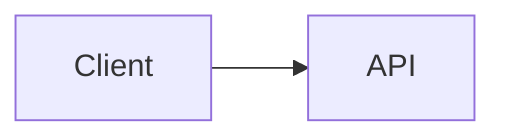

# Design der Markdown-Syntaxerweiterung

## Kontext

Dieses Dokument enthält die Implementierungsreferenzen für den integrierten Markdown-Syntaxerweiterungs-PR. Es basiert auf der TUI-Optimierungsforschung aus `origin/docs/tui-optimization-design`, insbesondere:

- `docs/design/tui-optimization/00-overview.md`
- `docs/design/tui-optimization/03-rendering-extensibility.md`
- `docs/design/tui-optimization/04-gemini-cli-research.md`
- `docs/design/tui-optimization/05-claude-code-research.md`
- `docs/design/tui-optimization/06-implementation-rollout-checklist.md`
- `docs/design/tui-optimization/08-execution-plan-and-test-matrix.md`

Die genannte Forschung empfiehlt eine langfristige Markdown-Architektur, die auf einem AST-Parser, Block-/Token-Caching, Stable-Prefix-Streaming, begrenzten Detail-Panels und Terminal-Fähigkeitserkennung aufbaut. Diese erste Implementierung hält den Laufzeit-Fußabdruck klein und macht das neue Verhalten sofort sichtbar.

## Umfang des integrierten PR

Dieser PR behandelt die Markdown-Syntaxerweiterung als eine zusammenhängende Renderer-Verbesserung, nicht als separate Feature-PRs.

Im ersten Release enthalten:

- Mermaid-Codeblöcke werden im TUI visuell dargestellt.
- Mermaid-Diagramme werden als PNG-Terminalbilder gerendert, wenn die Bilddarstellung explizit aktiviert ist, `mmdc` verfügbar ist und das Terminal einen Bildpfad unterstützt.
- `flowchart` / `graph` Mermaid-Diagramme fallen auf Box-Pfeil-Vorschauen zurück.
- `sequenceDiagram` Mermaid-Diagramme fallen auf Teilnehmer-Pfeil-Vorschauen zurück.
- Grundlegende `classDiagram`, `stateDiagram`, `erDiagram`, `gantt`, `pie`, `journey`, `mindmap`, `gitGraph` und `requirementDiagram`-Blöcke fallen auf begrenzte Textvorschauen zurück.
- Mermaid-Typen ohne Textvorschau fallen auf den ursprünglichen Code-Block zurück, damit der Benutzer die Diagrammdefinition noch lesen und kopieren kann.
- Aufgabenlistenelemente zeigen aktivierte/deaktivierte Markierungen.
- Blockzitate werden mit einer sichtbaren Zitierleiste dargestellt.
- Inline `$...$`-Mathe und Block-`$$...$$`-Mathe werden mit gängigen Unicode-Ersetzungen gerendert.
- Vorhandene Markdown-Tabellen verwenden weiterhin `TableRenderer`.
- Vorhandene Nicht-Mermaid-Codeblöcke verwenden weiterhin `CodeColorizer`.
- Gerenderte visuelle Blöcke bleiben über `/copy mermaid N`, `/copy latex N`, `/copy latex inline N` und den Raw-Modus erreichbar.
- `ui.renderMode` steuert, ob Sitzungen im gerenderten oder Raw-/Source-Modus starten, während `Alt/Option+M` die aktive Sitzungsansicht umschaltet.

## Mermaid-Rendering-Strategie

### Erste Version: fähigkeitsabhängige Bilddarstellung plus Text-Fallback

Die Implementierung behandelt Mermaids eigenes Layout nun als bevorzugten Pfad. Wenn die lokale Umgebung dies unterstützt, rendert die TUI Mermaid-Blöcke über diese Pipeline:

```text
Mermaid-Quelle
  -> mmdc / Mermaid CLI
  -> PNG
  -> Kitty- oder iTerm2-Terminalbildprotokoll
```

Wenn das Terminal keine Inline-Bilder unterstützt, aber `chafa` installiert ist, wird dasselbe PNG als ANSI-Blockgrafik gerendert. Wenn weder Bildprotokoll noch `chafa` verfügbar sind, fällt der Renderer auf die unten beschriebene synchrone Terminal-Textvorschau zurück.

Die Bilddarstellung wird nicht versucht, solange eine Antwort noch gestreamt wird. Während des Streamings zeigen Mermaid-Blöcke eine begrenzte Wartevorschau. Sobald die Antwort abgeschlossen ist, wird der Bildpfad nur dann versucht, wenn er explizit aktiviert wurde. Dadurch bleibt der langsame `mmdc`-Start, insbesondere der opt-in `npx`-Pfad, außerhalb des standardmäßigen interaktiven Render-Pfads.

Die PNG-Generierung wird unabhängig von der Terminal-Platzierung zwischengespeichert. Wiederholte Renderings derselben Mermaid-Quelle, einschließlich Terminal-Größenänderungen, verwenden das generierte PNG und berechnen nur die Kitty-/iTerm2-Platzierungsdimensionen neu.

Der Bildpfad ist bewusst opt-in und fähigkeitsabhängig, anstatt immer Puppeteer/Chromium zu bündeln oder aus dem heißen CLI-Pfad aufzurufen. Ein Benutzer kann den Bildpfad mit `QWEN_CODE_MERMAID_IMAGE_RENDERING=1` aktivieren und dann `@mermaid-js/mermaid-cli` bereitstellen, indem er `mmdc` im `PATH` installiert oder `QWEN_CODE_MERMAID_MMD_CLI` auf den Binärpfad setzt. Für Ad-hoc-Lokaltests erlaubt `QWEN_CODE_MERMAID_ALLOW_NPX=1` dem Renderer, `npx -y @mermaid-js/mermaid-cli@11.12.0` aufzurufen; dies ist bewusst opt-in, da der erste Durchlauf Puppeteer/Chromium installieren und das Rendering blockieren kann. Repo-lokale `node_modules/.bin`-Renderer werden nicht automatisch erkannt, es sei denn, `QWEN_CODE_MERMAID_ALLOW_LOCAL_RENDERERS=1` ist gesetzt. Die Auswahl des Terminalprotokolls kann mit `QWEN_CODE_MERMAID_IMAGE_PROTOCOL=kitty|iterm2|off` erzwungen werden.

Für Kitty-kompatible Terminals wie Ghostty verwendet der Renderer Kitty-Unicode-Platzhalter anstatt die Bildnutzdaten als Ink-Text zu schreiben. Das PNG wird über rohes stdout im Quiet-Modus (`q=2`) mit einer virtuellen Platzierung (`U=1`) übertragen, und der React-Baum rendert das normale Platzhalter-Zeichenraster (`U+10EEEE`) mit expliziten Zeilen- und Spalten-Diakritika für jede Zelle. Dadurch bleibt Ink für Layout und Größenänderung zuständig, während verhindert wird, dass APC-Nutzdatenbytes in sichtbaren Base64-Text verpackt werden.

### Fallback: skalierbare Drahtgittervorschau

Der Fallback vermeidet asynchrone Arbeit, da Inks `<Static>`-Pfad append-only ist: Eine abgeschlossene Nachricht kann nicht zuverlässig auf einen Hintergrund-Rendering-Job warten und dann ohne erzwungenen vollständigen statischen Refresh aktualisiert werden. Der Fallback muss daher während des normalen React-Render-Durchlaufs Terminalausgabe erzeugen.

Für `flowchart` / `graph`-Diagramme erstellt der Fallback ein leichtgewichtiges Graphenmodell anstatt jede Kante einzeln auszugeben:

- Knoten werden nach Mermaid-ID, Label und Grundform normalisiert.
- Knotenlabels unterstützen Mermaid-ähnliche `\n` / `<br>`-Zeilenumbrüche.
- Top-Down-Diagramme werden in horizontale Ebenen eingeteilt.
- Left-to-Right-Diagramme werden in vertikale Spalten eingeteilt, wenn sie passen.
- Mehrere ausgehende Kanten vom selben Knoten werden als eine Gabelung mit eckigen Kantenbeschriftungen wie `[Yes]`, `[No]`, `[是]` und `[否]` gezeichnet.
- Rückwärtskanten und Zyklen werden in einem Abschnitt `Cycles:` mit expliziten `↩ to <node>`-Markierungen zusammengefasst. Dies vermeidet instabile lange Querverbindungen in Terminal-Schriftarten, während die Schleifensemantik sichtbar bleibt.
- Der Graph wird aus `contentWidth` neu berechnet, sodass eine Größenänderung Knotenbreite, Abstände und Verbindungspfade ändert.
- Große Vorschauen werden vor dem Graphenlayout begrenzt, damit sehr große Mermaid-Blöcke während des Renderings keine unbegrenzte Terminal-Canvas zuweisen.

Beispiel:



wird als visuelle Terminalvorschau und nicht als Mermaid-Quelle gerendert.

Andere gängige Mermaid-Diagrammfamilien verwenden begrenzte Textzusammenfassungen anstelle einer vollständigen Layout-Engine: Klassenbeziehungen/-mitglieder, Zustandsübergänge, ER-Entitäten/Beziehungen, Gantt-Aufgaben, Kuchendiagramme, Journey-Schritte, Mindmap-Bäume, Git-Graph-Einträge und Anforderungsbäume. Wenn ein Diagrammtyp unbekannt oder nicht vorschau-bar ist, zeigt der Renderer die ursprüngliche Mermaid-Quelle anstelle eines Platzhalters an, sodass der Inhalt im Terminal lesbar und auswählbar/kopierbar bleibt. Gerenderte Mermaid-Überschriften zeigen auch den Mermaid-spezifischen Kopierbefehl, z.B. `/copy mermaid 2`, damit Benutzer die ursprüngliche Diagrammquelle wiederherstellen können, ohne die gesamte Ansicht in den Raw-Modus zu schalten.

Der Fallback ist immer noch keine vollständige Mermaid-Engine. Es ist eine schnelle, abhängigkeitsarme Vorschau-Ebene für häufige LLM-generierte Diagramme, wenn hochauflösendes Rendering nicht verfügbar ist.

### Zukünftige Provider

Die Provider-Grenze ist bewusst offen für zusätzliche native Bild-Provider:

- `mmdc` / `@mermaid-js/mermaid-cli` für SVG/PNG-Ausgabe.
- `terminal-image` für Kitty/iTerm2 plus ANSI-Fallback.
- `chafa` falls vorhanden für Sixel/Kitty/iTerm2/Unicode-Mosaike.

Dieser Pfad sollte optional, zwischengespeichert und fähigkeitsabhängig bleiben, mit Cache-Schlüsseln basierend auf Quell-Hash, Terminalbreite, Renderer-Provider und Terminalprotokoll. Er sollte den Start nicht blockieren oder standardmäßig gebündelte Mermaid/Puppeteer-Arbeit in den heißen TUI-Pfad einbringen.

## AST-Renderer-Kompatibilität

Die erste Version erweitert den vorhandenen Parser, um die Auswirkungen zu minimieren. Die Feature-Grenzen sind weiterhin mit einer zukünftigen `marked`-Token-Pipeline kompatibel:

- `code(lang=mermaid)` -> `MermaidDiagram`
- `code(lang=*)` -> vorhandenes `CodeColorizer`
- `table` -> vorhandenes `TableRenderer`
- `blockquote` -> Zitatblock-Renderer
- `list(task=true)` -> Aufgabenlisten-Renderer
- `paragraph/text` -> Inline-Renderer mit Mathe/Link/Style-Unterstützung

Die Implementierung cached keine React-Knoten. Ein zukünftiger AST-Renderer sollte Tokens/Blöcke cachen und dann aus aktuellen Breiten-/Theme-/Einstellungs-Props rendern.

## Sicherheit und Leistung

- Mermaid-Quelle wird als nicht vertrauenswürdige Eingabe behandelt.
- Der erste Renderer führt kein Mermaid-JavaScript aus.
- Native Bilddarstellung muss opt-in oder fähigkeitsabhängig sein.
- Zukünftige browserbasierte Darstellung muss Timeouts und Größenbeschränkungen verwenden.
- Rendering sollte auf Terminaltext zurückfallen, anstatt einen Fehler zu werfen.
- Große Blöcke sollten verfügbare Höhe und Breite respektieren.

## Validierung

Gezielte Unit-Überprüfung:

```bash
cd packages/cli
npx vitest run \
  src/config/settingsSchema.test.ts \
  src/ui/AppContainer.test.tsx \
  src/ui/utils/MarkdownDisplay.test.tsx \
  src/ui/utils/mermaidImageRenderer.test.ts \
  src/ui/commands/copyCommand.test.ts \
  src/ui/components/BaseTextInput.test.tsx \
  src/ui/keyMatchers.test.ts \
  src/ui/contexts/KeypressContext.test.tsx
```

Breitere Überprüfung vor PR-Einreichung:

```bash
npm run build --workspace=packages/cli
npm run typecheck --workspace=packages/cli
npm run lint --workspace=packages/cli
git diff --check
```

Terminal-Capture-Integrationsszenario:

```bash
npm run build && npm run bundle
cd integration-tests/terminal-capture
npm run capture:markdown-rendering
```

Dieses Szenario erfasst eine Markdown-lastige Modellantwort, schaltet mit `Alt/Option+M` zwischen Raw-/Source-Modus um und überprüft die sichtbaren Source-Copy-Flows mit `/copy mermaid 1` und `/copy latex 1`.

Manuelle Szenarien:

- Assistentenantwort mit einem Mermaid `flowchart LR`-Block.
- Assistentenantwort mit einem Mermaid `sequenceDiagram`-Block.
- Markdown-Tabelle plus Mermaid in derselben Antwort.
- JavaScript-Codeblock mit weiterhin sichtbarer Code-Formatierung.
- Schmale Terminalbreite.
- Eingeschränkte Tool-/Detailfläche.
- `ui.renderMode: "raw"` startet eine Sitzung im quellorientierten Modus.
- `Alt/Option+M` schaltet dieselbe Antwort zwischen gerendertem und Raw-/Source-Modus um.
- Mermaid- und LaTeX-Visualblöcke zeigen Kopierhinweise, die der tatsächlichen Quellreihenfolge von `/copy mermaid N` und `/copy latex N` entsprechen.