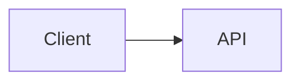

# Entwurf der Markdown-Syntaxerweiterung

## Kontext

Dieses Dokument enthält die Implementierungsreferenzen für den integrierten PR zur Markdown-Syntaxerweiterung. Es basiert auf der TUI-Optimierungsforschung aus `origin/docs/tui-optimization-design`, insbesondere:

- `docs/design/tui-optimization/00-overview.md`
- `docs/design/tui-optimization/03-rendering-extensibility.md`
- `docs/design/tui-optimization/04-gemini-cli-research.md`
- `docs/design/tui-optimization/05-claude-code-research.md`
- `docs/design/tui-optimization/06-implementation-rollout-checklist.md`
- `docs/design/tui-optimization/08-execution-plan-and-test-matrix.md`

Die referenzierte Forschung empfiehlt eine langfristige Markdown-Architektur, die auf einem AST-Parser, Block-/Token-Caching, Stable-Prefix-Streaming, begrenzten Detail-Panels und Terminal-Fähigkeitserkennung basiert. Diese erste Implementierung hält den Laufzeit-Fußabdruck klein und macht das neue Verhalten sofort sichtbar.

## Umfang des integrierten PR

Dieser PR behandelt die Markdown-Syntaxerweiterung als eine zusammenhängende Renderer-Verbesserung, nicht als separate Feature-PRs.

Enthalten in der ersten Implementierung:

- Mermaid-Codeblöcke werden visuell im TUI gerendert.
- Mermaid-Diagramme werden über PNG-Terminalbilder gerendert, wenn die Bilddarstellung explizit aktiviert ist, `mmdc` verfügbar ist und das Terminal einen Bildpfad unterstützt.
- `flowchart` / `graph` Mermaid-Diagramme fallen auf Box-and-Arrow-Vorschauen zurück.
- `sequenceDiagram` Mermaid-Diagramme fallen auf Teilnehmer-Pfeil-Vorschauen zurück.
- Einfache Blöcke wie `classDiagram`, `stateDiagram`, `erDiagram`, `gantt`, `pie`, `journey`, `mindmap`, `gitGraph` und `requirementDiagram` fallen auf begrenzte Textvorschauen zurück.
- Mermaid-Typen ohne Textvorschau fallen auf ihre ursprüngliche gefensterte Quelle zurück, sodass der Benutzer die Diagrammdefinition weiterhin lesen und kopieren kann.
- Aufgabenlistenelemente rendern aktivierte/deaktivierte Markierungen.
- Blockzitate werden mit einer sichtbaren Zitatleiste gerendert.
- Inline-`$...$`-Mathematik und Block-`$$...$$`-Mathematik werden mit gängigen Unicode-Ersetzungen gerendert.
- Vorhandene Markdown-Tabellen verwenden weiterhin `TableRenderer`.
- Vorhandene nicht-Mermaid-gefenzte Codeblöcke verwenden weiterhin `CodeColorizer`.
- Gerenderte visuelle Blöcke bleiben über `/copy mermaid N`, `/copy latex N`, `/copy latex inline N` und den Raw-Modus erreichbar.
- `ui.renderMode` steuert, ob Sitzungen im gerenderten oder im Raw-/Quellmodus starten, während `Alt/Option+M` die aktive Sitzungsansicht umschaltet.

## Mermaid-Rendering-Strategie

### Erste Version: fähigkeitsgesteuerte Bilddarstellung plus Text-Fallback

Die Implementierung betrachtet nun Mermaids eigenes Layout als bevorzugten Weg. Wenn die lokale Umgebung dies unterstützt, rendert das TUI Mermaid-Blöcke über diese Pipeline:

```text
Mermaid source
  -> mmdc / Mermaid CLI
  -> PNG
  -> Kitty or iTerm2 terminal image protocol
```

Wenn das Terminal keine Inline-Bilder unterstützt, aber `chafa` installiert ist, wird dasselbe PNG als ANSI-Blockgrafik gerendert. Wenn weder ein Bildprotokoll noch `chafa` verfügbar ist, fällt der Renderer auf die unten beschriebene synchrone Terminal-Textvorschau zurück.

Der Bildrender wird nicht versucht, während eine Antwort noch gestreamt wird. Während des Streamings zeigen Mermaid-Blöcke eine begrenzte ausstehende Vorschau. Sobald die Antwort abgeschlossen ist, wird der Bildpfad nur bei expliziter Aktivierung versucht. Dies hält den langsamen Start von `mmdc`, insbesondere den opt-in `npx`-Pfad, aus dem Standard-Interaktiv-Renderpfad heraus.

Die PNG-Generierung wird unabhängig von der Terminalplatzierung zwischengespeichert. Wiederholte Renderings derselben Mermaid-Quelle, einschließlich Terminalgrößenänderungen, verwenden das generierte PNG erneut und berechnen nur die Kitty-/iTerm2-Platzierungsdimensionen neu.

Der Bildpfad ist bewusst als Opt-in und fähigkeitsgesteuert ausgelegt, anstatt Puppeteer/Chromium immer zu bündeln oder vom heißen CLI-Pfad aus aufzurufen. Ein Benutzer kann den Bildpfad mit `QWEN_CODE_MERMAID_IMAGE_RENDERING=1` aktivieren und dann `@mermaid-js/mermaid-cli` bereitstellen, indem er `mmdc` im `PATH` installiert oder `QWEN_CODE_MERMAID_MMD_CLI` auf den Binärpfad setzt. Für Ad-hoc-Lokalverifikation erlaubt `QWEN_CODE_MERMAID_ALLOW_NPX=1` dem Renderer, `npx -y @mermaid-js/mermaid-cli@11.12.0` aufzurufen; dies ist bewusst als Opt-in ausgelegt, da der erste Lauf Puppeteer/Chromium installieren und das Rendern blockieren kann. Repo-lokale `node_modules/.bin`-Renderer werden nicht automatisch erkannt, es sei denn, `QWEN_CODE_MERMAID_ALLOW_LOCAL_RENDERERS=1` ist gesetzt. Die Terminalprotokollauswahl kann mit `QWEN_CODE_MERMAID_IMAGE_PROTOCOL=kitty|iterm2|off` erzwungen werden.

Für Kitty-kompatible Terminals wie Ghostty verwendet der Renderer Kitty-Unicode-Platzhalter, anstatt die Bildnutzlast als Ink-Text zu schreiben. Das PNG wird im leisen Modus (`q=2`) mit einer virtuellen Platzierung (`U=1`) über Raw-Stdout übertragen, und der React-Baum rendert das normale Platzhalterzeichenraster (`U+10EEEE`) mit expliziten Zeilen- und Spaltendiakritika für jede Zelle. Dadurch bleibt Ink für Layout und Größenänderung zuständig, während verhindert wird, dass APC-Nutzlastbytes in sichtbaren Base64-Text eingebettet werden.

### Fallback: größenveränderbare Drahtgittervorschau

Der Fallback vermeidet asynchrone Arbeit, da Inks `<Static>`-Pfad append-only ist: Eine fertiggestellte Nachricht kann nicht zuverlässig auf einen Hintergrund-Render-Job warten und dann ohne einen vollständigen Static-Refresh aktualisieren. Der Fallback muss daher während des normalen React-Render-Durchlaufs Terminalausgabe erzeugen.
Für `flowchart`/`graph`-Diagramme baut der Fallback ein leichtgewichtiges Graphenmodell auf, anstatt Kante für Kante auszugeben:

- Knoten werden nach Mermaid-ID, Label und Grundform normalisiert.
- Knotenlabels unterstützen Mermaid-`\n`/`<br>`-Zeilenumbrüche.
- Top-Down-Diagramme werden in horizontale Ebenen eingeteilt.
- Links-nach-rechts-Diagramme werden in vertikale Spalten eingeteilt, wenn es passt.
- Mehrere ausgehende Kanten vom selben Knoten werden als eine Verzweigung mit eckigen Kantenbeschriftungen wie `[Yes]`, `[No]`, `[是]` und `[否]` dargestellt.
- Rückwärtskanten und Zyklen werden in einem Abschnitt `Cycles:` mit expliziten `↩ zu <Knoten>`-Markern zusammengefasst. Dies vermeidet instabile lange Querverbindungen in Terminal-Schriftarten, während die Schleifensemantik sichtbar bleibt.
- Der Graph wird aus `contentWidth` neu berechnet, sodass eine Größenänderung Knotenbreite, Abstände und Verbindungspfade ändert.
- Große Vorschauen werden vor dem Graph-Layout begrenzt, damit sehr große Mermaid-Blöcke keine unbegrenzte Terminal-Leinwand während des Renderns zuweisen.

Beispiel:



wird als visuelle Terminal-Vorschau statt als Mermaid-Quelltext gerendert.

Andere gängige Mermaid-Diagrammfamilien verwenden begrenzte Textzusammenfassungen anstelle einer vollständigen Layout-Engine: Klassenbeziehungen/-mitglieder, Zustandsübergänge, ER-Entitäten/Beziehungen, Gantt-Aufgaben, Tortendiagrammsegmente, Journey-Schritte, Mindmap-Bäume, Git-Graph-Einträge und Anforderungsbäume. Wenn ein Diagrammtyp unbekannt oder nicht vorschau-fähig ist, zeigt der Renderer den ursprünglichen eingerahmten Mermaid-Quelltext anstelle eines Platzhalters an, sodass der Inhalt lesbar und im Terminal auswählbar/kopierbar bleibt. Gerenderte Mermaid-Überschriften zeigen außerdem den Mermaid-spezifischen Kopierbefehl an, z.B. `/copy mermaid 2`, damit Benutzer den ursprünglichen Diagrammquelltext wiederherstellen können, ohne die gesamte Ansicht in den Rohmodus zu schalten.

Der Fallback ist immer noch keine vollständige Mermaid-Engine. Es ist eine schnelle, abhängigkeitsarme Vorschau-Ebene für übliche LLM-generierte Diagramme, wenn eine hochauflösende Darstellung nicht verfügbar ist.

### Zukünftige Provider

Die Provider-Grenze ist absichtlich offen für zusätzliche native Bild-Provider:

- `mmdc` / `@mermaid-js/mermaid-cli` für SVG/PNG-Ausgabe.
- `terminal-image` für Kitty/iTerm2 plus ANSI-Fallback.
- `chafa` wenn vorhanden, für Sixel/Kitty/iTerm2/Unicode-Mosaike.

Dieser Pfad sollte optional, zwischengespeichert und fähigkeitsgesteuert bleiben, mit Cache-Schlüsseln basierend auf Quell-Hash, Terminalbreite, Renderer-Provider und Terminalprotokoll. Er sollte den Start nicht blockieren oder standardmäßig gebündelte Mermaid/Puppeteer-Arbeit in den heißen TUI-Pfad einfügen.

## AST-Renderer-Kompatibilität

Die erste Version erweitert den vorhandenen Parser, um den Einflussbereich zu minimieren. Die Funktionsgrenzen sind weiterhin mit einer zukünftigen `marked`-Token-Pipeline kompatibel:

- `code(lang=mermaid)` -> `MermaidDiagram`
- `code(lang=*)` -> bestehender `CodeColorizer`
- `table` -> bestehender `TableRenderer`
- `blockquote` -> Zitatblock-Renderer
- `list(task=true)` -> Aufgabenlisten-Renderer
- `paragraph/text` -> Inline-Renderer mit Mathe/Link/Style-Unterstützung

Die Implementierung cached keine React-Knoten. Ein zukünftiger AST-Renderer sollte Tokens/Blöcke cachen und dann aus den aktuellen width/theme/settings-Props rendern.

## Sicherheit und Leistung

- Mermaid-Quelltext wird als nicht vertrauenswürdige Eingabe behandelt.
- Der erste Renderer führt kein Mermaid-JavaScript aus.
- Native Bilddarstellung muss opt-in oder fähigkeitsgesteuert sein.
- Zukünftige browserbasierte Darstellung muss Timeouts und Größenbeschränkungen verwenden.
- Rendern sollte auf Terminaltext zurückfallen anstatt Fehler zu werfen.
- Große Blöcke sollten verfügbare Höhe und Breite respektieren.

## Validierung

Gezielte Einheitstests:

```bash
cd packages/cli
npx vitest run \
  src/config/settingsSchema.test.ts \
  src/ui/AppContainer.test.tsx \
  src/ui/utils/MarkdownDisplay.test.tsx \
  src/ui/utils/mermaidImageRenderer.test.ts \
  src/ui/commands/copyCommand.test.ts \
  src/ui/components/BaseTextInput.test.tsx \
  src/ui/keyMatchers.test.ts \
  src/ui/contexts/KeypressContext.test.tsx
```

Breitere Validierung vor PR-Einreichung:

```bash
npm run build --workspace=packages/cli
npm run typecheck --workspace=packages/cli
npm run lint --workspace=packages/cli
git diff --check
```

Integrationsszenario für Terminalaufnahmen:

```bash
npm run build && npm run bundle
cd integration-tests/terminal-capture
npm run capture:markdown-rendering
```

Dieses Szenario erfasst eine Markdown-lastige Modellantwort, wechselt mit `Alt/Option+M` zwischen Roh-/Quellmodus und überprüft die sichtbaren Quelltext-Kopierabläufe mit `/copy mermaid 1` und `/copy latex 1`.

Manuelle Szenarien:

- Assistentenantwort mit einem Mermaid-`flowchart LR`-Block.
- Assistentenantwort mit einem Mermaid-`sequenceDiagram`-Block.
- Markdown-Tabelle plus Mermaid in derselben Antwort.
- JavaScript-Codeblock (eingerahmt) zeigt weiterhin Code-Formatierung.
- Schmale Terminalbreite.
- Eingeschränkte Tool-/Detail-Oberfläche.
- `ui.renderMode: "raw"` startet eine Sitzung im quellorientierten Modus.
- `Alt/Option+M` schaltet dieselbe Antwort zwischen gerendertem und Roh-/Quellmodus um.
- Visuelle Mermaid- und LaTeX-Blöcke zeigen Kopierhinweise an, die der tatsächlichen Quelltext-Reihenfolge von `/copy mermaid N` und `/copy latex N` entsprechen.
