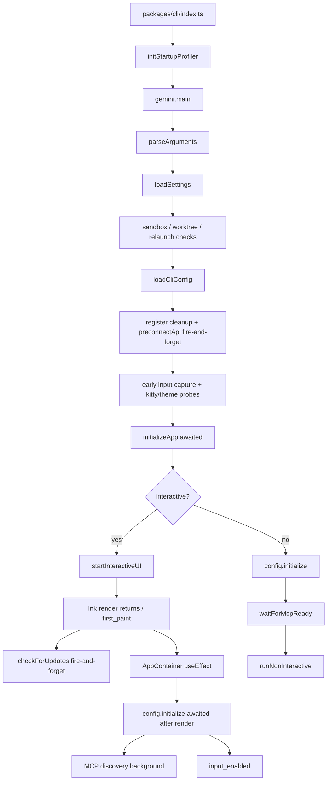
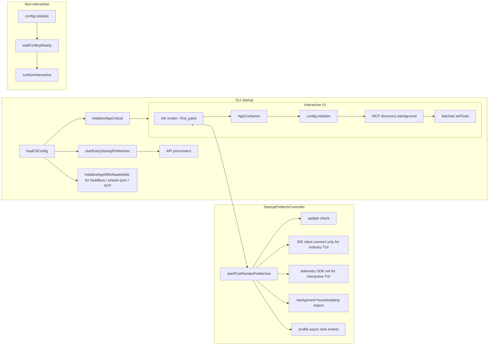
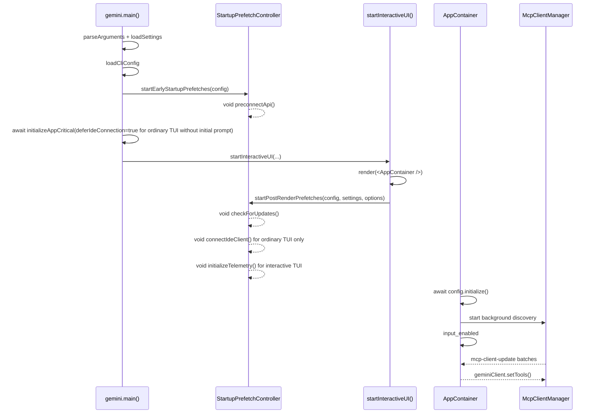

# Design der Fire-and-Forget-Startup-Prefetch-Optimierung

## Hintergrund und Ziele

Das übergeordnete Issue #3011 unterteilt die Startup-Optimierung von qwen-code in mehrere Teilaufgaben. Das aktuelle Repository enthält bereits mehrere grundlegende Funktionen:

- #3219: Der Startup-Performance-Profiler ist integriert und unterstützt `QWEN_CODE_PROFILE_STARTUP=1` zur Ausgabe von Startup-Phasen-JSON.
- #3221: Die Tool-Registrierung wurde auf eine Lazy-Factory umgestellt; `Config.initialize()` instanziiert nicht mehr statisch alle Tools.
- #3223: API-Preconnect existiert bereits und wird derzeit im Fire-and-Forget-Verfahren nach `loadCliConfig()` ausgelöst.
- Early Input Capture, progressive MCP-Discovery und `config.initialize()` nach dem AppContainer-Render sind ebenfalls teilweise implementiert.

Das Ziel von #3222 ist es nicht, diese Funktionen neu zu implementieren, sondern die nicht-kritischen Startup-Operationen, die noch über den Startup-Pfad verstreut sind, in einer einheitlichen Fire-and-Forget-Prefetch-Schicht zusammenzuführen: Vor dem First Paint werden nur Operationen abgewartet, die die Korrektheit wirklich beeinflussen; nach dem First Paint werden Hintergrundtasks gestartet, die die Korrektheit der ersten Interaktion nicht beeinträchtigen, wobei kompatible Semantiken für nicht-interaktive Modi beibehalten werden.

## Aktueller Startup-Ablauf

Der zentrale Ablauf des aktuellen interaktiven Startup-Pfads ist wie folgt:



Bewertung des aktuellen Zustands:

- `initializeApp()` führt i18n, Auth, Theme-Validierung und IDE-Client-Verbindung weiterhin seriell vor dem First Paint aus.
- Auth und i18n müssen vor dem First Paint bleiben; die IDE-Verbindung ist keine harte Abhängigkeit für den First Paint einer einfachen TUI ohne anfänglichen Prompt und kann auf dem einfachen TUI-Pfad aufgeschoben werden. Für Pfade wie `qwen -i "prompt"`, `qwen -p`, stream-json und ACP/Zed – die kein sicheres Post-Render-Fenster haben oder deren erste Anfrage IDE-Kontext/-Status benötigt – muss die IDE-Verbindung jedoch weiterhin vor der ersten Anfrage abgewartet werden.
- `checkForUpdates()` ist in `startInteractiveUI()` bereits Fire-and-Forget nach dem Render, aber die Logik ist über die UI-Startup-Funktion verstreut.
- `preconnectApi()` ist bereits Fire-and-Forget und sollte so früh wie möglich ausgelöst werden, muss aber in eine einheitliche Steuerung integriert werden.
- Die Telemetry-SDK-Initialisierung erfolgte bisher synchron während der `Config`-Konstruktion; für die einfache interaktive TUI kann sie auf die Zeit nach dem Render verschoben werden, während nicht-interaktive Pfade die Initialisierungssemantik vor der ersten Anfrage beibehalten.
- Auf dem interaktiven Pfad wird `config.initialize()` bereits nach dem React-Mount ausgeführt; die MCP-Discovery läuft bereits im Hintergrund im Core, wobei der AppContainer die Tool-Liste gebündelt aktualisiert.
- Der nicht-interaktive Pfad muss weiterhin `config.waitForMcpReady()` abwarten, da sonst der erste Prompt möglicherweise keine MCP-Tools sieht, was zu einer Regression im skriptgesteuerten Verhalten führt.

## Zielarchitektur

Einführung einer schlanken Startup-Prefetch-Steuerungsschicht, die "Starten, aber nicht abwarten"-Tasks einheitlich verwaltet, aufgeteilt in zwei Kategorien nach Auslösezeitpunkt: Early und Post-Render.



Die interaktive Startup-Sequenz im neuen Design:



## Designänderungen

### 1. Neuer einheitlicher Startup-Prefetch-Scheduler

Hinzufügen von `packages/cli/src/startup/startup-prefetch.ts`, das zwei Einstiegspunkte bereitstellt:

```ts
startEarlyStartupPrefetches(config: Config): void;
startPostRenderPrefetches(
  config: Config,
  settings: LoadedSettings,
  options?: { connectIde?: boolean; initializeTelemetry?: boolean },
): void;
```

Der Scheduler übernimmt genau drei Aufgaben:

- Startet Prefetch-Tasks anhand ihres Namens.
- Verwendet `void task().catch(...)`, um explizit nicht abzuwarten und keine Fehler zu werfen.
- Zeichnet Debug-Logs und Profiler-Async-Events auf, um zu überprüfen, ob Tasks vor oder nach dem Render gestartet werden.

Der Scheduler muss die Idempotenz pro Phase garantieren, um zu verhindern, dass React StrictMode, wiederholte Testaufrufe oder anomale Re-Entries denselben Task mehrfach starten.

### 2. Early Prefetch: Vorsprung maximieren

`startEarlyStartupPrefetches(config)` wird unmittelbar nach dem erfolgreichen Abschluss von `loadCliConfig()` aufgerufen.

Die erste Phase umfasst nur den API-Preconnect:

- Liest den aktuellen Auth-Typ und die aufgelöste Base-URL aus `config.getModelsConfig()`.
- Liest den Proxy aus `config.getProxy()`.
- Ruft das bestehende `preconnectApi(authType, { resolvedBaseUrl, proxy })` auf.
- Behält bestehende Environment-Gates bei: `QWEN_CODE_DISABLE_PRECONNECT`, Sandbox, Custom CA, Non-Node-Runtime, kein Proxy usw.

Dies fügt keine neuen Konfigurationsoptionen hinzu. Preconnect-Fehler schreiben nur Debug-Logs und beeinflussen den Startup nicht.

### 3. Post-Render Prefetch: Start nach dem First Paint

`startPostRenderPrefetches(config, settings)` wird in `startInteractiveUI()` aufgerufen, nachdem Ink `render()` zurückkehrt und `first_paint` aufgezeichnet wurde.

Der erste Batch umfasst:

- Update-Check: Migration der bestehenden `checkForUpdates().then(handleAutoUpdate)`-Logik unter Beibehaltung des `settings.merged.general?.enableAutoUpdate !== false`-Gates.
- IDE-Client-Verbindung: Wird nur auf dem einfachen interaktiven TUI-Pfad ohne anfänglichen Prompt auf den Post-Render-Prefetch verschoben. Caller müssen explizit `connectIde: true` übergeben, und der Scheduler prüft intern weiterhin `config.getIdeMode()`. `qwen -i "prompt"`, nicht-interaktiv, stream-json und ACP/Zed verschieben die IDE-Verbindung nicht über diesen Einstiegspunkt.
- Telemetry-SDK-Initialisierung: Wird nur auf dem interaktiven TUI-Pfad auf den Post-Render-Prefetch verschoben. `Config` behält weiterhin die Telemetry-Einstellungen bei, überspringt aber den SDK-Seiteneffekt zur Konstruktionszeit über `deferTelemetryInitialization`; der Post-Render-Prefetch startet das SDK über `initializeTelemetry(config)`. Nicht-interaktiv, stream-json und ACP/Zed verschieben dies nicht.
- Hintergrund-Housekeeping: Kann von `gemini.tsx` auf den Post-Render-Prefetch migriert werden, was allen Hintergrund-Startup-Tasks einen einheitlichen Einstiegspunkt gibt; weiterhin auf interaktiv beschränkt, verwendet weiterhin dynamischen Import und Error-Swallowing.

Keiner dieser Tasks darf den Rückgabewert von `startInteractiveUI()` beeinflussen, noch dürfen sie für Benutzer sichtbare Fehler auf die TUI-Stderr schreiben. Fehler gehen nur in die Debug-Logs ein.

### 4. Aufteilung des kritischen Pfads von initializeApp() und Beibehaltung der abgewarteten IDE-Verbindung für Nicht-TUI

Hinzufügen eines gemeinsamen Helpers, um eine Duplizierung der IDE-Verbindungslogik zwischen dem verschobenen TUI-Pfad und dem abgewarteten Nicht-TUI-Pfad zu vermeiden:

```ts
export async function connectIdeForStartup(config: Config): Promise<void> {
  if (!config.getIdeMode()) return;

  const ideClient = await IdeClient.getInstance();
  await ideClient.connect();
  logIdeConnection(config, new IdeConnectionEvent(IdeConnectionType.START));
}
```

`initializeApp()` bleibt als kritische Initialisierung vor dem First Paint bestehen, erhält jedoch eine explizite Option:

```ts
interface InitializeAppOptions {
  deferIdeConnection?: boolean;
}
```

Der Standard muss abwärtskompatibel bleiben: `deferIdeConnection` ist standardmäßig `false`. Das heißt, wenn keine Option übergeben wird, wird die IDE-Verbindung weiterhin innerhalb von `initializeApp()` abgewartet.

Der abgewartete Inhalt von `initializeApp()` wird zu:

- `initializeI18n(...)`
- `performInitialAuth(...)`
- `validateTheme(settings)`
- Wenn `deferIdeConnection !== true`, `await connectIdeForStartup(config)`
- Berechnung von `shouldOpenAuthDialog`
- Lesen von `config.getGeminiMdFileCount()`

Die Aufrufstelle in `gemini.tsx` ist für die Auswahl basierend auf dem Run-Mode verantwortlich:

```ts
const deferIdeConnections =
  config.isInteractive() && !config.getExperimentalZedIntegration() && !input;

const initializationResult = await initializeApp(config, settings, {
  deferIdeConnections,
});
```

Anschließend feuert `startInteractiveUI()` die IDE-Verbindung nur dann als Fire-and-Forget über `startPostRenderPrefetches(..., { connectIde: true })` ab, wenn `deferIdeConnections === true` ist; prompt-interactive, das die erste Frage automatisch absendet, wartet weiterhin die IDE vor dem Render ab und übergibt `connectIde: false`, um eine doppelte Verbindung nach dem Render zu vermeiden.

Diese Aufteilung adressiert das im Review gekennzeichnete Kompatibilitätsrisiko:

- Einfache interaktive TUI: IDE-Socket/IPC-Verbindung blockiert nicht länger den First Paint.
- `qwen -i "prompt"`: Wartet weiterhin die IDE-Verbindung vor der ersten automatisch abgesendeten Anfrage ab, und Post-Render stellt keine erneute Verbindung her.
- `qwen -p` / gepipte Stdin: Wartet weiterhin die IDE-Verbindung vor der ersten Model-Anfrage ab.
- stream-json: Schließt die IDE-Verbindung weiterhin vor der Bearbeitung von Session/Control-Anfragen ab.
- ACP/Zed: Behält weiterhin den abgewarteten IDE-Startup bei, um fehlenden IDE-Kontext/-Status bei der ersten Anfrage zu vermeiden.

### 5. MCP- und nicht-interaktive Semantik bleiben unverändert

Dieses Design ändert nichts an der Kern-MCP-State-Machine.

Interaktiv:

- Ruft weiterhin `config.initialize()` im Mount-Effect von `AppContainer` auf.
- `Config.initialize()` startet weiterhin die Hintergrund-MCP-Discovery.
- AppContainer lauscht weiterhin auf `mcp-client-update` und ruft `geminiClient.setTools()` gebündelt in Intervallen von ~16 ms auf.
- First Paint und Input-Verfügbarkeit warten nicht darauf, dass MCP vollständig abgeschlossen ist.

Nicht-interaktiv / stream-json / ACP:

- Wartet weiterhin die IDE-Verbindung vor der ersten Model-Anfrage ab.
- Wartet weiterhin `config.waitForMcpReady()` vor der ersten Model-Anfrage ab.
- Bewahrt die Tool-Sichtbarkeitssemantik des alten synchronen Pfads.
- Bewahrt das bestehende Verhalten von Stderr-Warnungen bei MCP-Fehlern.

## Geschätzte Performance-Gewinne

Die Gewinne fallen in zwei Kategorien.

Die erste ist der verkürzte kritische Pfad vor dem First Paint:

- IDE-Client-Verbindung für die einfache interaktive TUI blockiert nicht länger den First Paint; die Gewinne hängen von der IDE-Socket/IPC-Verbindungszeit ab, die voraussichtlich im Bereich von zehn bis hundert Millisekunden liegt.
- Telemetry-SDK-Initialisierung für die einfache interaktive TUI blockiert nicht länger den First Paint; die Gewinne hängen von den Konstruktionskosten des OTel-SDK/Exporters ab, typischerweise ein geringer bis mittlerer synchroner Startup-Overhead.
- Update-Check, Housekeeping, Preconnect und ähnliche Tasks haben einen einheitlichen Fire-and-Forget-Einstiegspunkt, was verhindert, dass sie bei zukünftigen Wartungsarbeiten versehentlich wieder auf den abgewarteten Pfad verschoben werden.
Der zweite Punkt betrifft die Vorteile der ersten API-Anfrage:

- Das API-Preconnect-Design aus #3223 bleibt weiterhin erhalten.
- Wenn der Proxy/Shared Dispatcher wiederverwendbar ist, kann die erste API-Anfrage die Kosten für den TCP+TLS-Handshake vermeiden, was voraussichtlich 100-200 ms einspart.

Hinweis: Die historische Basislinie von #3219 zeigte, dass das einmalige Laden von Modulen einst ~94 % der gesamten Startzeit ausmachte; die Lazy-Tool-Registrierung aus #3221 hat bereits den größten Engpass beseitigt. Der Hauptvorteil von #3222 liegt eher in der wahrgenommenen TTI (Time to Interactive) und der Reaktionsfähigkeit beim First Paint, anstatt alle Kosten für das Laden von Modulen zu eliminieren.

## Risiken und Umfang der Auswirkungen

### Risiken

- IDE-Funktionen in der reinen TUI könnten sich von "verbunden vor dem First Paint" zu "sehr kurz nach dem First Paint verbunden" verschieben. Abhilfe: Nur im Pfad der reinen interaktiven TUI verzögern; nicht-interaktive, stream-json und ACP/Zed behalten die erwartete Verbindung vor der ersten Anfrage bei.
- Pre-Render-Telemetrieereignisse werden möglicherweise als No-Op verworfen, wenn das SDK noch nicht initialisiert ist. Abhilfe: Nur für interaktive TUI verzögern; nicht-interaktive Telemetrie vor der ersten Anfrage behält ihre ursprüngliche Semantik bei, es wird keine neue Pufferwarteschlange hinzugefügt.
- Fehler bei verzögerten Tasks sind möglicherweise nicht offensichtlich. Abhilfe: Ein einheitlicher Wrapper zeichnet Debug-Logs und asynchrone Profiler-Events auf.
- Die Migration von Update/Preconnect könnte unbeabsichtigt bestehende Gates ändern. Abhilfe: Exakte Beibehaltung bestehender Einstellungen und Umgebungsbedingungen.
- Zu starkes Verzögern könnte dazu führen, dass Funktionen nicht bereit sind, wenn die erste Benutzereingabe davon abhängt. Abhilfe: Auth, Config-Erstellung, Berechtigungen, Hooks, Memory, Tool-Registry und das Bereithalten von nicht-interaktivem MCP werden weiterhin abgewartet (awaited).

### Umfang der Auswirkungen

Voraussichtlich nur die CLI-Startup-Ebene betreffend:

- `packages/cli/src/startup/startup-prefetch.ts`
- `packages/cli/src/core/initializer.ts`
- `packages/cli/src/gemini.tsx`
- `packages/cli/src/ui/startInteractiveUI.tsx`
- Entsprechende Unit-Tests

Keine Änderungen an:

- CLI-Argumenten und Konfigurationsschema
- Core-Tool-Registry-Protokoll
- MCP-Discovery-Statusmaschine
- Modell-Anfrageprotokoll
- Für Benutzer sichtbarem Befehlsverhalten

## Unit-Test-Plan

### `packages/cli/src/startup/startup-prefetch.test.ts`

Abdeckung:

- `startEarlyStartupPrefetches()` ruft `preconnectApi()` mit Auth-Typ, aufgelöster Base-URL und Proxy auf.
- Early Prefetch wartet nicht auf den Abschluss des Tasks.
- Wiederholte Aufrufe sind idempotent und starten nicht denselben Early-Task erneut.
- `startPostRenderPrefetches()` startet die Update-Prüfung, wenn `enableAutoUpdate !== false`.
- Startet keine Update-Prüfung, wenn `enableAutoUpdate === false`.
- Startet IDE-Connect und ruft `logIdeConnection()` auf, wenn `options.connectIde === true` und `config.getIdeMode() === true`.
- Löst keinen IDE-Connect aus, wenn `options.connectIde !== true`.
- Löst keinen IDE-Connect aus, wenn `config.getIdeMode() === false`, selbst wenn `options.connectIde === true`.
- Startet die Telemetrie-SDK-Initialisierung, wenn `options.initializeTelemetry === true`.
- Löst keine Telemetrie-SDK-Initialisierung aus, wenn `options.initializeTelemetry !== true`.
- Rejections verzögerter Tasks führen nicht dazu, dass die öffentliche API einen Fehler wirft, sondern schreiben nur Debug-Logs.

### `packages/cli/src/core/initializer.test.ts`

Anpassungen und Ergänzungen:

- `initializeApp()` wartet standardmäßig auf `connectIdeForStartup()`, um die Kompatibilität des Nicht-TUI-Pfads zu erhalten.
- `initializeApp(..., { deferIdeConnection: true })` ruft weder `IdeClient.getInstance()` noch `connect()` auf.
- `initializeApp(..., { deferIdeConnection: false })` ruft den IDE-Connect auf und wartet darauf, wenn `config.getIdeMode() === true`.
- Wartet weiterhin auf `initializeI18n()`.
- Wartet weiterhin auf `performInitialAuth()`.
- Behält bei einem Auth-Fehler `authError` und `shouldOpenAuthDialog === true` bei.
- Behält bei einem Fehler bei der Theme-Validierung `themeError` bei.
- Wenn der Auth-Typ explizit angegeben wird und die Authentifizierung erfolgreich ist, gilt `shouldOpenAuthDialog === false`.

### `packages/cli/src/ui/startInteractiveUI.test.tsx`

Abdeckung:

- Nachdem Ink `render()` zurückkehrt und `first_paint` aufgezeichnet wurde, wird `startPostRenderPrefetches(config, settings)` aufgerufen.
- Der Pfad der reinen TUI übergibt `{ connectIde: true, initializeTelemetry: true }`.
- Wenn prompt-interactive die IDE bereits vor dem Rendering abgewartet hat, wird `{ connectIde: false, initializeTelemetry: true }` übergeben, um einen doppelten IDE-Connect zu vermeiden.
- Nicht-TUI-Pfade lösen keinen IDE/Telemetrie-Post-Render-Prefetch über `startInteractiveUI()` aus.
- Rejections des Post-Render-Prefetches führen nicht dazu, dass `startInteractiveUI()` rejected.
- Nachdem die Update-Prüfung aus der Inline-Logik von `startInteractiveUI()` ausgelagert wurde, wird sie nicht mehr direkt aufgerufen.

### `packages/cli/src/gemini.test.tsx`

Anpassungen und Ergänzungen:

- Die rein interaktive TUI ruft `initializeApp(config, settings, { deferIdeConnection: true })` auf und stellt die IDE-Verbindung im Post-Render-Prefetch her.
- Prompt-interactive ruft `initializeApp(config, settings, { deferIdeConnection: false })` auf, und der Post-Render-Prefetch stellt die IDE-Verbindung nicht erneut her.
- `qwen -p` / gepipte stdin / stream-json ruft `initializeApp(config, settings, { deferIdeConnection: false })` auf oder verwendet die Standardwerte, um sicherzustellen, dass die IDE vor der ersten Anfrage verbunden ist.
- Der ACP/Zed-Pfad aktiviert keinen verzögerten IDE-Prefetch, sondern setzt auf das abgewartete IDE-Startup.

### `packages/core/src/config/config.test.ts`

Abdeckung:

- Wenn Telemetrie aktiviert ist und `deferTelemetryInitialization` nicht übergeben wird, ruft die `Config`-Erstellung weiterhin `initializeTelemetry(config)` auf.
- Wenn Telemetrie aktiviert ist und `deferTelemetryInitialization === true`, ruft die `Config`-Erstellung `initializeTelemetry(config)` nicht auf, aber `config.getTelemetryEnabled()` gibt weiterhin true zurück.

### Regressionstests

Empfohlene Ausführung:

```bash
cd packages/cli && npx vitest run src/core/initializer.test.ts src/startup/startup-prefetch.test.ts
cd packages/cli && npx vitest run src/gemini.test.tsx
cd packages/core && npx vitest run src/config/config.test.ts -t "telemetry"
```

## Abnahmekriterien

- Das erste Rendering des interaktiven REPL wartet nicht auf die IDE-Verbindung, Telemetrie-Initialisierung, Update-Prüfung oder Housekeeping-Aufgaben.
- Nicht-interaktive, stream-json und ACP/Zed warten weiterhin auf die IDE-Verbindung vor der ersten Anfrage.
- Nicht-interaktive, stream-json und ACP/Zed verzögern die Telemetrie-SDK-Initialisierung nicht.
- API-Preconnect wird weiterhin nach `loadCliConfig()` so früh wie möglich als Fire-and-Forget ausgeführt.
- Auth, Config, Berechtigungen, Hooks, Memory und andere korrekturkritische Initialisierungen werden dort, wo nötig, weiterhin abgewartet.
- Der erste Prompt im nicht-interaktiven Modus wartet weiterhin auf die MCP-Bereitschaft.
- Fehler bei verzögerten Tasks beeinträchtigen das REPL-Rendering nicht.
- Der Profiler zeigt, dass verzögerte Tasks wie erwartet um `first_paint` herum gestartet werden.
- Unit-Tests decken kritische Pfade, Idempotenz, Fehlerunterdrückung und Kompatibilitätseinschränkungen für den nicht-interaktiven Modus ab.

## Standardannahmen

- #3221 ist eigentlich ein Issue auf GitHub, kein PR; das aktuelle Repository enthält bereits die Implementierung der Lazy-Tool-Registry.
- Dieses Design fügt keine neuen Konfigurationsoptionen hinzu, um zu vermeiden, dass die Startzeitoptimierung in eine vom Benutzer konfigurierbare Komplexität umschlägt.
- "REPL rendert vor Abschluss verzögerter Operationen" bedeutet die Rückkehr von Ink beim First Paint und die Eingabeverfügbarkeit, nicht dass alle Hintergrundfunktionen abgeschlossen sein müssen, bevor der Benutzer die UI sieht.
- Der nicht-interaktive Modus priorisiert die Kompatibilität und verfolgt die First-Paint-Optimierung nicht so aggressiv wie der interaktive Modus.