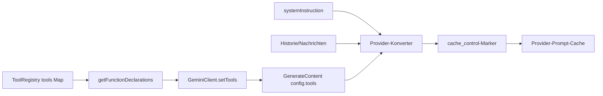
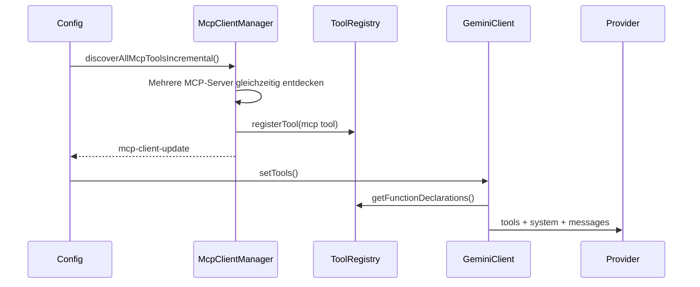

# Design für stabile Sortierung des globalen Tool-Schemas

## Hintergrund

Qwen Code unterstützt bereits `cache_control` in den Request-Konvertierungsschichten von Anthropic und DashScope. Wenn ein Provider Prompt-Caching unterstützt, kann ein stabiler Request-Präfix zwischengespeichert und wiederverwendet werden, was die Kosten für wiederholte Input-Tokens senkt und die Time-to-First-Token (TTFT) verringert.

Der Hauptpräfix besteht derzeit aus drei Teilen:

1. Tool-Schema: Tool-Deklarationen, die von `ToolRegistry.getFunctionDeclarations()` generiert werden.
2. System-Instruktion: der System-Prompt der Hauptsitzung.
3. Nachrichten/Historie: Start-Prälude, Benutzernachrichten, Tool-Ergebnisse und zugehöriger Kontext.

Das Tool-Schema ist oft groß und steht nahe am Anfang des Provider-Cache-Präfix. Wenn sich die serialisierten Bytes des Tool-Arrays ändern, kann auch der nachfolgende System- und Nachrichten-Präfix seine Wiederverwendbarkeit verlieren.

Heute verwendet `GeminiClient.setTools()` direkt den Rückgabewert von `ToolRegistry.getFunctionDeclarations()`, und `getFunctionDeclarations()` iteriert die Tools in der `Map`-Einfügereihenfolge. Die Registrierungsreihenfolge der eingebauten Tools ist normalerweise stabil, aber die progressive MCP-Discovery, ToolSearch-Reveals, MCP-Reconnects und die Registrierung externer Tools können alle dazu führen, dass derselbe Tool-Satz in unterschiedlichen Reihenfolgen serialisiert wird. Das führt zu unnötigen Prompt-Cache-Misses.

## Ziele

Implementierung einer globalen stabilen Sortierung für Tool-Schemas: `functionDeclarations`, die an Modell-Requests gesendet werden, müssen für denselben Tool-Satz eine stabile Reihenfolge haben, unabhängig von der Reihenfolge des Abschlusses der Registrierung.

Dieses Design behebt nur Cache-Misses, bei denen der Tool-Satz identisch ist, aber die Reihenfolge abweicht. Das Hinzufügen von Tools, das Entfernen von Tools oder das Ändern des Schema-Inhalts ändert weiterhin den Präfix; dies sind legitime Cache-Misses.

Dieses Design umfasst nicht:

- Blockbildung des System-Prompts.
- Sitzungsweisen Snapshot/Cache des Tool-Schemas.
- Vollständige Implementierung der Erkennung von Prompt-Cache-Brüchen.
- Änderungen an der `cache_control`-Richtlinie des Providers.

## Aktueller Ablauf



Die progressive MCP-Discovery ist die häufigste Ursache für Reihenfolgeänderungen:



Wenn zwei MCP-Server schließlich verfügbar werden, sich aber in unterschiedlichen Reihenfolgen einpendeln, kann der aktuelle Tool-Block abweichen:

```text
Run 1:
[
  read_file,
  shell,
  mcp__filesystem__read_tree,
  mcp__github__search_issues
]

Run 2:
[
  read_file,
  shell,
  mcp__github__search_issues,
  mcp__filesystem__read_tree
]
```

Aus der Perspektive der Modellfähigkeiten legen beide Durchläufe denselben Tool-Satz offen. Aus der Perspektive des Prompt-Caches sind es unterschiedliche Tool-Präfixe.

Nach der Sortierung stabilisiert sich derselbe Satz auf:

```text
[
  mcp__filesystem__read_tree,
  mcp__github__search_issues,
  read_file,
  shell
]
```

## Rolle des Prompt-Caches und Unterschiede bei Hits/Misses

Der Prompt-Cache ermöglicht es dem Provider, die KV/Cache-Berechnung für einen stabilen Präfix wiederzuverwenden. Bei langen Tool-Listen, langen System-Prompts und langen Historien-Präfixen hat ein Cache-Hit normalerweise zwei Vorteile:

- Geringere Input-Token-Kosten: Der zwischengespeicherte Präfix durchläuft den Cache-Read-Abrechnungspfad.
- Niedrigere TTFT: Der Provider muss den vollständigen Präfix nicht erneut verarbeiten.

Vor einem Hit:

```text
request bytes changed
-> tools/system/messages prefix cannot be reused
-> cache_read_input_tokens is low or 0
-> the full prefix is counted again as input/cache creation
-> TTFT is higher
```

Nach einem Hit:

```text
stable prefix bytes unchanged
-> tools/system/messages prefix is reused from provider cache
-> cache_read_input_tokens increases
-> only the new tail content is counted as input/cache creation
-> TTFT is lower
```

Dieses Design verbessert die Hit-Wahrscheinlichkeit durch Stabilisierung der Reihenfolge des Tool-Arrays, insbesondere bei Reihenfolgeänderungen durch progressive MCP-Discovery und ToolSearch-Reveals.

## Design

Die Sortierung gehört in `ToolRegistry.getFunctionDeclarations()`, da dies der einzige Generierungspunkt für aktuelle API-Tool-Deklarationen ist. Nicht im Provider-Konverter sortieren, da andere Deklarations-Leser sonst instabil bleiben würden. Nicht nur in `GeminiClient.setTools()` sortieren, da Diagnosen, Kontextschätzungen und Tests sonst weiterhin unsortierte Deklarationen sehen könnten.

Sortierregeln:

1. Zuerst die bestehende Filterlogik anwenden:
   - Standardmäßig Tools ausschließen, bei denen `shouldDefer && !alwaysLoad && !revealedDeferred` zutrifft.
   - `{ includeDeferred: true }` schließt verzögerte (deferred) Tools ein.
   - `alwaysLoad`-Tools sind immer sichtbar.
2. Die gefilterten Tool-Instanzen sortieren.
3. `tool.schema.name ?? tool.name` als primären Sortierschlüssel verwenden.
4. `tool.displayName` als Tie-Breaker verwenden.
5. Die sortierten `tool.schema`-Werte zurückgeben.

Pseudocode:

```ts
getFunctionDeclarations(options?: { includeDeferred?: boolean }) {
  const includeDeferred = options?.includeDeferred === true;
  return Array.from(this.tools.values())
    .filter((tool) => {
      if (
        !includeDeferred &&
        tool.shouldDefer &&
        !tool.alwaysLoad &&
        !this.revealedDeferred.has(tool.name)
      ) {
        return false;
      }
      return true;
    })
    .sort(compareToolsByDeclarationName)
    .map((tool) => tool.schema);
}
```

Die Vergleichsfunktion lokal und einfach halten. Keine Konfiguration hinzufügen:

```ts
function compareToolsByDeclarationName(
  a: AnyDeclarativeTool,
  b: AnyDeclarativeTool,
) {
  const aName = a.schema.name ?? a.name;
  const bName = b.schema.name ?? b.name;
  const byName = aName.localeCompare(bName);
  if (byName !== 0) return byName;
  return a.displayName.localeCompare(b.displayName);
}
```

Die Registrierungsreihenfolge nicht als implizites Ranking beibehalten. Die Tool-Reihenfolge sollte keine Modellpräferenz ausdrücken; das Modell sollte Tools basierend auf Name, Beschreibung, Schema und Kontext auswählen.

## Testplan

Tests in `packages/core/src/tools/tool-registry.test.ts` hinzufügen oder aktualisieren.

### 1. Reguläre Tools nach kanonischem Namen sortieren

Registrierungsreihenfolge:

```text
zeta, alpha, middle
```

Assertion:

```text
getFunctionDeclarations().map(name) === [alpha, middle, zeta]
```

### 2. Deferred Tools vor der Sortierung filtern

Registrieren:

```text
visible-z
hidden-a (shouldDefer)
visible-a
```

Standard-Assertion:

```text
[visible-a, visible-z]
```

### 3. includeDeferred schließt alle Tools ein und sortiert sie

Dieselben Tools wie oben verwenden und Folgendes aufrufen:

```ts
getFunctionDeclarations({ includeDeferred: true });
```

Assertion:

```text
[hidden-a, visible-a, visible-z]
```

### 4. Aufgedeckte (revealed) deferred Tools erscheinen an ihrer sortierten Position

Registrieren:

```text
visible-m
hidden-a (shouldDefer)
visible-z
```

Ausführen:

```ts
toolRegistry.revealDeferredTool('hidden-a');
```

Assertion:

```text
[hidden-a, visible-m, visible-z]
```

### 5. alwaysLoad deferred Tools bleiben sichtbar und sortiert

Registrieren:

```text
z (shouldDefer, alwaysLoad)
a
```

Standard-Assertion:

```text
[a, z]
```

### 6. Registrierungsreihenfolge der MCP-Tools unterscheidet sich, aber die Ausgabe stimmt überein

Zwei `ToolRegistry`-Instanzen erstellen:

```text
registryA registration order:
  mcp__github__search_issues
  mcp__filesystem__read_tree

registryB registration order:
  mcp__filesystem__read_tree
  mcp__github__search_issues
```

Assertion:

```text
registryA.getFunctionDeclarations().map(name)
  === registryB.getFunctionDeclarations().map(name)
```

### 7. Alte Assertions aktualisieren

Bestehende Tests, die von der Registrierungsreihenfolge abhängen, sollten so aktualisiert werden, dass sie stattdessen von der sortierten Reihenfolge abhängen. Ein Deferred-Filter-Test, der nur `['visible']` assertiert, kann beispielsweise unverändert bleiben; wenn er in Zukunft mehrere sichtbare Tools registriert, sollte er das sortierte Array assertieren.

Empfohlene Verifizierungsbefehle:

```bash
cd packages/core && npx vitest run src/tools/tool-registry.test.ts
cd packages/core && npx vitest run src/tools/tool-search.test.ts
cd packages/core && npx vitest run src/core/client.test.ts
npm run build && npm run typecheck
```

## Risiken und Einschränkungen

- Das Ändern der Tool-Reihenfolge kann die implizite Auswahlpräferenz des Modells beeinflussen. Dieses Risiko ist akzeptabel, da die Tool-Reihenfolge keine Produktsemantik sein sollte; stabile Cache-Präfixe haben eine höhere Priorität.
- Dieses Design verhindert keine Cache-Misses, die durch neu hinzugefügte Tools verursacht werden. Neue MCP-Server-Tools, Änderungen am Tool-Schema-Inhalt und ToolSearch-Reveals neuer Tools ändern den Tool-Block weiterhin auf legitime Weise.
- Wenn ein Provider in Zukunft die Beibehaltung der Tool-Registrierungssemantik erfordert, sollte dies in der Provider-Schicht behandelt werden. Der aktuelle Code hat keine solche Anforderung.

## Nächster Schritt: Erkennung von Prompt-Cache-Brüchen

Nachdem das globale Sortieren implementiert ist, sollte der nächste Schritt eine leichtgewichtige Erkennung von Prompt-Cache-Brüchen sein, um den Nutzen der Sortierung zu validieren und verbleibende Cache-Misses zu lokalisieren.

Implementierung in zwei Phasen:

1. Vor jedem Request einen Snapshot aufzeichnen:
   - Modell.
   - Hash der System-Instruktion.
   - `functionDeclaration`-Namen und Schema-Hash.
   - Cache-Control aktiviert/Bereich (scope).
2. Nach jeder Response die Nutzung auslesen:
   - `cache_read_input_tokens`.
   - `cache_creation_input_tokens`.
   - Kompatible Cached-Token-Metadaten von OpenAI/DashScope/Gemini.

Wenn der Cache-Read im Vergleich zur vorherigen Runde signifikant abfällt, ein Debug-Log oder Telemetrie-Event ausgeben:

```text
prompt_cache_break:
  reason: tools_order_changed | tools_schema_changed | system_changed |
          cache_control_changed | model_changed | likely_provider_ttl_or_eviction
  previousCacheReadTokens
  currentCacheReadTokens
  changedToolNames
```

Die erste Version sollte nur beobachten und das Request-Verhalten nicht ändern. Ihr Ziel ist es, zwei Fragen zu beantworten:

1. Reduziert die globale Tool-Sortierung Cache-Misses durch Tool-Reihenfolge?
2. Stammen verbleibende Cache-Misses hauptsächlich aus System-Text, Tool-Schema-Inhalt, `cache_control` oder Provider-TTL/Eviction?