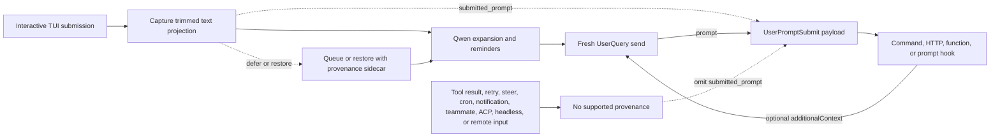

# Submitted-Prompt-Provenance für `UserPromptSubmit`

## Zusammenfassung

`UserPromptSubmit.prompt` ist der Prompt für den aktuellen Modellaufruf. Er
kann von Qwen erzeugte Reminder, expandierte Dateien und Ressourcen,
Slash-Befehl-Ausgaben, Extension-Ausgaben oder Kontext enthalten, der von
einem früheren Hook hinzugefügt wurde. Er kann daher eine andere Frage nicht
zuverlässig beantworten: Welche Text-Projektion hat eine unterstützte
interaktive Eingabegrenze überquert?

Diese Änderung fügt ein optionales `submitted_prompt`-Feld hinzu:

```ts
interface UserPromptSubmitInput {
  prompt: string;
  submitted_prompt?: string;
}
```

Das Feld wird nur befüllt, wenn Qwen die Provenance von einer unterstützten
interaktiven TUI-Übermittlung zu einer frischen `UserQuery` tragen kann.
Consumer, die vom Nutzer übermittelten Text benötigen, müssen ein fehlendes
Feld als nicht verfügbar behandeln und dürfen nicht auf `prompt`
zurückfallen.

Die Änderung ändert nicht, wann `UserPromptSubmit` feuert, den bestehenden
`prompt`-Wert, die Hook-Reihenfolge oder Blockierung oder das
`additionalContext`-Verhalten.

## Ziele und Nicht-Ziele

Ziele:

- Den über eine unterstützte interaktive TUI übermittelten Text bewahren,
  bevor Qwen ihn expandiert.
- Diesen Text durch aufgeschobene und wiederhergestellte Übermittlungen
  tragen, ohne ihn mit dem falschen Modell-Request zu assoziieren.
- Das Feld hinzufügen, ohne Consumer zu brechen, die vorwärtskompatibles
  JSON akzeptieren.
- Alle Datenempfänger und Vertrauensgrenzen explizit machen.

Nicht-Ziele:

- Änderung der `UserPromptSubmit`-Trigger-Semantik.
- Ableiten eines ursprünglichen Prompts aus modellgebundenem Content.
- Unterstützung von ACP, Headless, Remote, SDK oder anderen
  Input-Producern in dieser Änderung.
- Bereitstellung von Authentifizierung, Tenant-Identität, DLP oder einem
  unveränderlichen Security-Label.
- Implementierung von External-Context-Recall.

## Datenfluss



Die Queue bleibt für das Rendering textorientiert. Provenance wird über ein
internes Sidecar assoziiert und nur konsumiert, wenn der Text in der Queue
zu einem frischen Turn wird. Jede mehrdeutige Transformation, ein partieller
Batch oder eine bearbeitete Wiederherstellung schlägt fail-closed fehl,
indem `submitted_prompt` weggelassen wird.

Large-Paste-Platzhalter bleiben in `submitted_prompt` kompakt; ihr
vollständiger Inhalt wird nur in den modellgebundenen `prompt` expandiert.
Dies bewahrt die TUI-Projektion und vermeidet das Duplizieren von
Multi-Megabyte-Paste-Content in jedem Hook-Payload.

Die Wiederherstellung nach einem Abbruch behält die Ownership des
Haupt-Turns, wenn eine gleichzeitige `/btw`-Nebenfrage läuft. Da diese
Nebenfrage einen neueren Nutzereintrag in die Disk-History schreiben kann,
entfernt der Abbruch den zuletzt geloggten Eintrag nur, wenn der Haupt-Turn
ihn noch exklusiv besitzt. Diese Kopplung hält das wiederhergestellte
Provenance-Sidecar und die persistente History konsistent, statt einen Turn
wiederherzustellen und einen anderen zu löschen.

## Qualifikation

| Pfad                                                                                   | `prompt`                          | `submitted_prompt`                                           | Regel                                                             |
| -------------------------------------------------------------------------------------- | --------------------------------- | ------------------------------------------------------------ | ----------------------------------------------------------------- |
| Frische interaktive TUI-Übermittlung, die als `UserQuery` gesendet wird                | Bestehender modellgebundener Wert | Vorhanden                                                    | Die getrimmte Projektion vor der Expansion erfassen               |
| Aufgeschobene TUI-Übermittlung, die später ein frischer Turn wird                      | Bestehender modellgebundener Wert | Nur bei vollständiger Provenance vorhanden                   | Das Sidecar in der Queue bewahren                                 |
| Exakte Abbruch- oder Queue-Wiederherstellung gefolgt von erneuter Übermittlung         | Bestehender modellgebundener Wert | Nur vorhanden, wenn der wiederhergestellte Text unverändert ist | Das Sidecar nur für eine exakte Wiederherstellung wiederverwenden |
| Bearbeiteter oder teilweise bekannter wiederhergestellter Input                        | Bestehender modellgebundener Wert | Abwesend                                                     | Provenance nicht raten                                            |
| Prompt-, Befehls- oder Shell-History-Navigation oder ausgewählter Such-Treffer         | Bestehender modellgebundener Wert | Abwesend                                                     | Die History kann generierte Expansionen enthalten                 |
| Prompt, der aus dem Cross-Restart-Stash wiederhergestellt wurde                        | Bestehender modellgebundener Wert | Abwesend                                                     | Der Stash speichert Text ohne Provenance                          |
| Prompt, der durch Gesprächs-Rewind wiederhergestellt wurde                             | Bestehender modellgebundener Wert | Abwesend                                                     | Die Rewind-History speichert nur modellgebundenen Text            |
| Same-Turn-Steering-Input                                                               | Bestehendes Verhalten             | Abwesend                                                     | Steering ist keine frische unterstützte Übermittlung              |
| Tool-Ergebnis- oder Hook-Fortsetzung                                                   | Bestehendes Verhalten             | Abwesend                                                     | Bestehendes Fortsetzungsverhalten bewahren                        |
| Retry-, Cron-, Benachrichtigungs- oder Teammate-Traffic                                | Bestehendes Verhalten             | Abwesend                                                     | Bestehendes Trigger-Verhalten bewahren                            |
| Konfigurierter `--prompt-interactive` Initial-Prompt                                   | Bestehender modellgebundener Wert | Abwesend                                                     | Er hat die interaktive Eingabegrenze nicht überquert              |
| Nicht-leerer Input, während der Vim-Modus aktiviert ist, auch nach Deaktivierung von Vim | Bestehender modellgebundener Wert | Abwesend                                                     | Vim-Register tragen keine Provenance                              |
| ACP, Headless, `serve`, SDK, Remote-Input oder akzeptierter spekulativer Input         | Bestehendes Verhalten             | Abwesend                                                     | In dieser Änderung wird kein Producer hinzugefügt                 |

Wenn wiederhergestellter oder Provenance-loser modellgebundener Input
geleert oder übermittelt wird, verwirft die TUI die Undo- und Redo-History
des Textpuffers, bevor späterer Input qualifiziert werden kann. Dies
verhindert, dass Undo modellgebundenen Text wiederherstellt, nachdem sein
Provenance-Marker oder sein Sidecar konsumiert wurde.

Jeder nicht-leere Input, der vorhanden ist, während Vim aktiviert ist,
bleibt auch nach der Deaktivierung von Vim unqualifiziert, bis der Composer
geleert ist. Diese konservative Regel deckt auch Entwürfe ab, die vor der
Aktivierung von Vim eingegeben wurden. Vim-Register können modellgebundenen
Text über Pufferleerungen hinweg behalten, daher kann ein Moduswechsel die
Provenance für bestehenden Content nicht wiederherstellen.

Die Tabelle definiert nur Provenance. Das bestehende Event-Triggering bleibt
unverändert, einschließlich Pfaden, die `UserPromptSubmit` nicht feuern.

## Invarianten

1. Core serialisiert `submitted_prompt` nur für eine frische `UserQuery`,
   die einen nicht-leeren String von einem unterstützten Producer trägt.
2. Der Wert bleibt so erhalten, wie er von Core empfangen wurde; Core
   trimmt ihn nicht, rekonstruiert ihn nicht und leitet ihn nicht aus
   `prompt` ab.
3. Sequentielle `additionalContext`-Updates dürfen `prompt` erweitern, aber
   `submitted_prompt` nicht umschreiben.
4. Rekursive und maschinengesteuerte Sends löschen die Provenance.
5. Ein Batch in der Queue wird nur zugeschrieben, wenn jedes enthaltene
   Item kompatible Provenance hat. Andernfalls lässt der Batch das Feld
   weg.
6. Ein wiederhergestelltes Sidecar ist Single-Use und gilt nur für eine
   exakte erneute Übermittlung.
7. Fehlende Provenance ist ein Normalzustand, kein Fehler.

## Kompatibilität und Migration

Der Hook-JSON-Vertrag ist vorwärts-erweiterbar. Decoder sollten unbekannte
Felder ignorieren. Consumer, die unbekannte Felder absichtlich ablehnen, zum
Beispiel ein JSON-Schema mit `additionalProperties: false`, müssen die
optionale `submitted_prompt`-Property explizit erlauben, bevor sie
upgraden. Für einen sicherheitskritischen Hook kann ein
Strict-Decoder-Fehler ändern, ob ein Aufruf fail-open oder fail-closed
fehlschlägt, daher müssen Administratoren den upgegradeten Payload mit dem
deployten Hook testen, bevor sie ausrollen.

Bestehende Consumer, die nur `prompt` lesen, behalten ihr aktuelles
Verhalten. Consumer, bei denen die Herkunft des Textes relevant ist,
sollten `submitted_prompt` lesen und bei dessen Fehlen überspringen, den
Nutzer fragen oder eine dokumentierte Fallback-Policy anwenden. `prompt`
stillschweigend als ursprünglichen Nutzertext zu verwenden, ist kein
sicherer Fallback.

## Vertrauens- und Datengrenzen

`submitted_prompt` ist vom Caller gelieferte Provenance. Es ist keine
authentifizierte Identität, keine Autorisierungsentscheidung, keine
Repository-Bindung und kein DLP-Ergebnis. Es erbt das Vertrauen vom lokalen
Qwen-Prozess und dem unterstützten TUI-Producer; es begründet keine neue
Vertrauensgrenze. Insbesondere erhält ein Function-Hook ein
In-Prozess-Objekt und muss als vertrauenswürdiger Code behandelt werden;
dieses Design beansprucht keine Runtime-Immutability gegenüber einem
solchen Hook.

Alle konfigurierten Hook-Executors erhalten den Event-Payload:

| Hook-Typ | Empfänger                                                 |
| -------- | --------------------------------------------------------- |
| Command  | Kindprozess über Standard-Input                           |
| HTTP     | Konfigurierter Endpoint über den POST-Body                |
| Function | Vertrauenswürdiger In-Prozess-Callback                    |
| Prompt   | Konfigurierter Modell-Provider nach `$ARGUMENTS`-Substitution |

Operatoren müssen sowohl `prompt` als auch `submitted_prompt` als potenziell
sensibel behandeln. Prompt-Hooks senden den Payload an einen
Modell-Provider. Datei-basiertes Debug-Logging zeichnet den vollständig
expandierten Prompt-Hook-Request auf, daher müssen Aufbewahrung und
Zugriffskontrollen den übermittelten Daten entsprechen. Ein Hook kann
seinen Input auch in seine eigene Ausgabe, Fehler, Logs oder nachgelagerte
Systeme kopieren; diese Ziele liegen außerhalb der Garantien dieses Feldes.

Wenn beide Felder vorhanden sind, enthalten Prompt-Hook-Payloads
überlappenden Text und können zusätzliche Modell-Input-Tokens verbrauchen.
Dieser Vertrag bietet keine Pro-Hook-Feld-Unterdrückung.

Die Hook-Call-Telemetrie exportiert aktuell Hook-Metadaten statt des
vollständigen Inputs, aber dieses Implementierungsdetail ist keine
Privacy-Grenze und Consumer sollten sich nicht darauf verlassen.

## Warum dies sich von Claude Code unterscheidet

Claude Code führt `UserPromptSubmit` an seiner Nutzer-Übermittlungsgrenze
aus, bevor die Kontrolle in die Modell-Query-Schleife eintritt. Die
Tool-Ergebnis-Rekursion überquert diese Grenze nicht, daher repräsentiert
sein bestehendes `prompt` natürlicherweise den übermittelten Input.

Qwen Code führt den Hook näher an seiner geteilten Modell-Send-Pipeline aus
und bewahrt das Legacy-Verhalten über mehr Send-Pfade hinweg. Das Event zu
verschieben wäre eine umfassendere, brechende semantische Änderung. Ein
additives Provenance-Feld gibt unterstützten TUI-Callern das fehlende
Grenzsignal und bewahrt gleichzeitig bestehende Integrationen.

## Verifikation

Unit-Tests decken das Core-Serialisierungs-Gate, Hook-Chaining,
TUI-Erfassung, Large-Paste-Projektion, aufgeschobene Queues, exakte und
bearbeitete Wiederherstellung, Provenance-Löschung und unvollständige
Batches. Interaktive E2E-Abdeckung erfasst einen echten Command-Hook-Payload
und bestätigt, dass Expansion `prompt` ändern kann, ohne
`submitted_prompt` zu ändern, und dass eine Tool-Ergebnis-Fortsetzung das
Feld weglässt.
