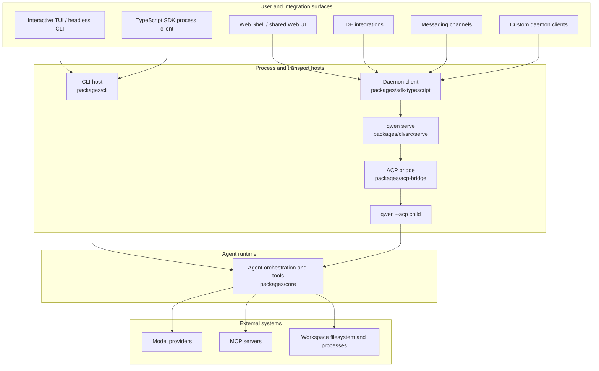

# Qwen Code Architektur-Überblick

Qwen Code ist eine Monorepo, die ein interaktives Terminal, Headless- und
programmierbare Ausführung, das Agent Client Protocol (ACP), einen langlebigen
HTTP-Daemon, Web- und IDE-Clients sowie Messaging-Channel-Adapter unterstützt.
Dieses Dokument ordnet diese Oberflächen den Packages zu, die sie
implementieren, und erklärt die wichtigsten Runtime-Grenzen.

Für detaillierte Daemon-Interna beginnen Sie mit der
[Daemon-Dokumentation](./daemon/00-index.md). Für HTTP-Request- und Event-
Formate siehe die [`qwen serve` Protokollreferenz](./qwen-serve-protocol.md).

## System auf einen Blick

Qwen Code verfügt über zwei Agent-Ausführungsmodelle:

- **Direkte Ausführung:** Das interaktive TUI und die Headless-CLI konstruieren
  und starten die Agent-Runtime direkt.
- **ACP-Ausführung:** `qwen --acp` hostet den Agent hinter einem ACP-Transport.
  Es kann direkt von einem ACP-Client oder von `qwen serve` über die gemeinsame
  ACP-Bridge gesteuert werden.

`qwen serve` fügt eine HTTP- + Server-Sent-Events (SSE) Control-Plane um die
ACP-Ausführung, sodass mehrere Clients langlebige, Workspace-scoped Runtimes
nutzen können.

Das Diagramm zeigt die wichtigsten Produktionspfade. Einige Adapter haben auch
Stand-alone-Modi: Beispielsweise verwendet `qwen channel start` die ACP-Bridge
ohne einen HTTP-Daemon. Siehe den
[Channel-Plugin-Guide](./channel-plugins.md#runtime-modes) für diese Varianten.

## Repository-Struktur

| Pfad                                                                                                       | Verantwortung                                                                                                                                                                                   |
| ---------------------------------------------------------------------------------------------------------- | ----------------------------------------------------------------------------------------------------------------------------------------------------------------------------------------------- |
| `packages/cli`                                                                                             | Die `qwen`-Executable, Argument-Parsing, Konfigurationszusammenstellung, Ink TUI, Headless-Output, ACP-Einstiegspunkt, `qwen serve` und befehlsspezifische Adapter.                              |
| `packages/core`                                                                                            | UI-unabhängige Agent-Orchestrierung, Model-Provider-Integration, Prompt- und Kontexterstellung, Tool-Registrierung und -Ausführung, Berechtigungen, Sessions, Memory, Telemetrie und Shared Services. |
| `packages/acp-bridge`                                                                                      | ACP-Channel-Lifecycle, Session-Multiplexing, Event-Zustellung, Berechtigungsmediation, Prozess-Spawning und die Workspace-Dateisystem-Naht, die von Daemon- und Adapter-Hosts gemeinsam genutzt wird. |
| `packages/sdk-typescript`                                                                                  | Programmatische Prozessausführung über `query()` sowie HTTP/SSE-Clients und Transkript-Projektion für `qwen serve`.                                                                             |
| `packages/webui`                                                                                           | Gemeinsame React-Komponenten und der Daemon-React-Adapter, der auf dem TypeScript SDK aufbaut.                                                                                                  |
| `packages/web-shell`                                                                                       | Die terminalartige Browser-UI, die auf `packages/webui` und dem Daemon-SDK aufbaut.                                                                                                             |
| `packages/web-templates`                                                                                   | Web-Templates, die als einbettbare JavaScript- und CSS-Strings paketiert sind.                                                                                                                  |
| `packages/audio-capture`                                                                                   | Native Mikrofon-Aufnahme für Spracheingabe.                                                                                                                                                     |
| `packages/channels`                                                                                        | Die gemeinsame Channel-Runtime und Plattform-Adapter für Messaging-Dienste.                                                                                                                     |
| `packages/desktop`, `packages/vscode-ide-companion`, `packages/chrome-extension`, `packages/zed-extension` | Produkt- und Editor-Oberflächen, die Qwen Code an ihre Host-Umgebungen anpassen.                                                                                                                |
| `packages/sdk-java`, `packages/sdk-python`                                                                 | Sprachspezifische programmierbare Clients.                                                                                                                                                      |
| `packages/cua-driver`, `packages/mobile-mcp`                                                               | Computer-Use- und Mobilgeräte-Integrationen, die über MCP-k kompatible Grenzen exponiert werden.                                                                                                |
| `integration-tests`                                                                                        | End-to-End-Abdeckung für CLI-, Interaktiv-, SDK-, Sandbox-, Hook- und Terminal-Verhalten.                                                                                                       |
| `docs` und `docs-site`                                                                                     | Benutzer-, Entwickler-, Protokoll- und Designdokumentation sowie die Dokumentationswebsite.                                                                                                     |
| `scripts`                                                                                                  | Build-, Packaging-, Release-, Validierungs- und Repository-Wartungsautomatisierung.                                                                                                             |

Der meiste Code lebt in npm-Workspaces unter `packages/`. Ein Package sollte über
deklarierte öffentliche Exporte von einem anderen Package abhängen, nicht über
einen relativen Pfad in den Quellbaum dieses Packages.

## Package-Grenzen

### CLI und Präsentations-Oberflächen

`packages/cli` besitzt die Executable und wählt den Runtime-Modus aus den
Kommandozeilenargumenten. Es lädt Benutzer- und Workspace-Einstellungen,
konstruiert die Core-Konfiguration, wechselt bei Bedarf in die angeforderte
Sandbox und startet dann einen der interaktiven, Headless-, ACP-, Daemon-,
Channel- oder Wartungs-Flows.

Die Präsentation bleibt außerhalb der Core-Runtime:

- Das Ink TUI rendert lokale interaktive Sessions;
- `packages/webui` adaptiert den Daemon-Zustand in React-Provider und Hooks;
- `packages/web-shell` bietet das Browser-Terminal-Erlebnis;
- IDE- und Channel-Packages übersetzen hostspezifische Events in gemeinsame
  Client- oder Bridge-Verträge.

### Core-Runtime

`packages/core` besitzt die Agent-Schleife. Es konstruiert Model-Requests,
pflegt den Konversationskontext, dispatcht Tool-Calls, wendet die
Berechtigungsrichtlinie an und liefert strukturierte Events und Ergebnisse an
den aktiven Host. Eingebaute Tools decken Dateioperationen, Shell-Ausführung,
Suche, Planung, Web-Zugriff, Memory, Skills und Subagenten ab. MCP erweitert
die Tool- und Ressourcen-Oberfläche, ohne die Runtime an eine spezifische
Integration zu koppeln.

Das Core-Package entscheidet nicht, wie Ergebnisse angezeigt oder wie ein
Remote-Client sie transportiert. Diese Entscheidungen gehören zur CLI, Bridge,
SDK und UI-Schicht.

### ACP-Bridge

`packages/acp-bridge` verbindet einen Host-Prozess mit einer ACP-Agent-Runtime.
Seine Hauptverantwortlichkeiten sind:

- Spawning oder Anhängen an einen ACP-Channel;
- Multiplexing von Sessions und Clients;
- Weiterleiten von Prompts, Abbrüchen und ACP-Benachrichtigungen;
- Mediation von Berechtigungsanfragen;
- Veröffentlichung begrenzter Session-Event-Streams;
- Bereitstellung einer Workspace-Dateisystem-Schnittstelle für den Host.

Die Bridge kann einen echten `qwen --acp`-Kindprozess in der Produktion oder
einen In-Memory-Channel in Tests verwenden. Siehe das
[`@qwen-code/acp-bridge` README](../../packages/acp-bridge/README.md) für seine
öffentlichen Einstiegspunkte.

### SDK- und UI-Adapter

Das TypeScript SDK exponiert zwei Client-Stile:

- `query()` startet und steuert einen Qwen Code-Prozess für programmatische
  lokale Nutzung;
- Daemon-Clients kommunizieren über HTTP und SSE mit `qwen serve`.

`packages/webui` baut eine React-Zustandsschicht auf dem Daemon-Client auf, und
`packages/web-shell` baut die Browser-UI auf dieser Zustandsschicht. Andere
Clients, einschließlich IDE-Integrationen und Daemon-verwalteter Channels,
verwenden dasselbe SDK und dieselben Event-Verträge, statt
Server-Implementierungscode zu importieren.

## Runtime-Flows

### Direkter CLI-Flow

1. Die CLI parst Argumente und löst Benutzer-, Workspace-, Umgebungs- und
   Kommandozeilenkonfiguration auf.
2. Sie bereitet die Sandbox vor und konstruiert die Core-Runtime-Konfiguration.
3. Die Core-Runtime baut den Model-Request auf und betritt die Agent/Tool-
   Schleife.
4. Tool-Calls werden gegen die Berechtigungsrichtlinie geprüft und in der
   aktiven Workspace-Umgebung ausgeführt.
5. Die CLI rendert inkrementelle Events im TUI oder serialisiert sie für die
   Headless-Ausgabe.

### Daemon-Flow

1. Ein Client nutzt das TypeScript SDK oder die dokumentierte HTTP-API, um sich
   mit `qwen serve` zu verbinden.
2. Der Daemon authentifiziert den Request und löst den Workspace auf, der für
   die angeforderte Operation zuständig ist.
3. Die Workspace-Runtime leitet Agent-Operationen über ihre ACP-Bridge an ein
   `qwen --acp`-Kind weiter.
4. Das Kind führt dieselbe Core-Agent- und Tool-Logik aus wie die direkte
   Ausführung.
5. Antworten und Benachrichtigungen kehren durch die Bridge zurück; Session-
   Events werden über SSE an Clients zugestellt.

Bei aktivierten Multi-Workspace-Sessions besitzt jede aktive Workspace-Runtime
ihre eigene Bridge und ihr eigenes ACP-Kind. Dateisystemzugriff, Umgebungs-
Overlays, MCP-Transporte, Sessions und Fehlerbehandlung bleiben auf diese
aufgelöste Runtime beschränkt. Die
[Daemon-Architektur](./daemon/01-architecture.md) dokumentiert die Prozess-
Topologie, Vertrauensgrenzen, Event-Replays und den Lifecycle im Detail.

## Erweiterungspunkte

Qwen Code kann auf mehreren Ebenen erweitert werden:

- **MCP-Server** fügen Tools, Prompts und Ressourcen zur Core-Runtime hinzu.
- **Extensions und Skills** paketieren wiederverwendbare Befehle, Konfiguration
  und Agent-Verhalten.
- **Channel-Plugins** adaptieren Messaging-Plattformen an die gemeinsame
  Channel-Runtime.
- **SDK-Clients** bauen eigene lokale oder Daemon-basierte Anwendungen.
- **UI-Adapter** projizieren gemeinsame Daemon-Events in hostspezifischen
  Zustand und Präsentation.

Halten Sie plattformspezifische Belange in den Adaptern. Gemeinsames Agent-
Verhalten gehört in die Core-Runtime, während Transport- und Wire-Verhalten in
die ACP-Bridge, das SDK oder den Daemon-Host gehört.

## Konfiguration und Zustand

Die CLI stellt die effektive Konfiguration aus Kommandozeilenargumenten,
Umgebungsvariablen, Benutzereinstellungen, Workspace-Einstellungen und
Standardwerten zusammen, bevor sie die Runtime konstruiert. Die Core erhält die
aufgelöste Konfiguration, statt präsentationsspezifische Eingaben zu lesen.
Siehe [Einstellungen](../users/configuration/settings.md) für die unterstützten
Einstellungen und ihre Gültigkeitsbereiche.

Direkte Sessions persistieren ihre Historie und Metadaten über gemeinsame Core-
Services. Im Daemon-Modus löst der Daemon den besitzenden Workspace auf und
stellt Clients Workspace- und Session-scoped Operationen bereit; das ACP-Kind
bleibt Eigentümer der Live-Agent-Ausführung.

## Wohin als Nächstes

- [Daemon-Entwicklerdokumentation](./daemon/00-index.md)
- [`qwen serve` HTTP-Protokoll](./qwen-serve-protocol.md)
- [TypeScript SDK](../../packages/sdk-typescript/README.md)
- [ACP-Bridge](../../packages/acp-bridge/README.md)
- [Channel-Plugin-Entwicklerguide](./channel-plugins.md)
- [Tool-Entwicklung](./tools/introduction.md)
- [Integrationstests](./development/integration-tests.md)
