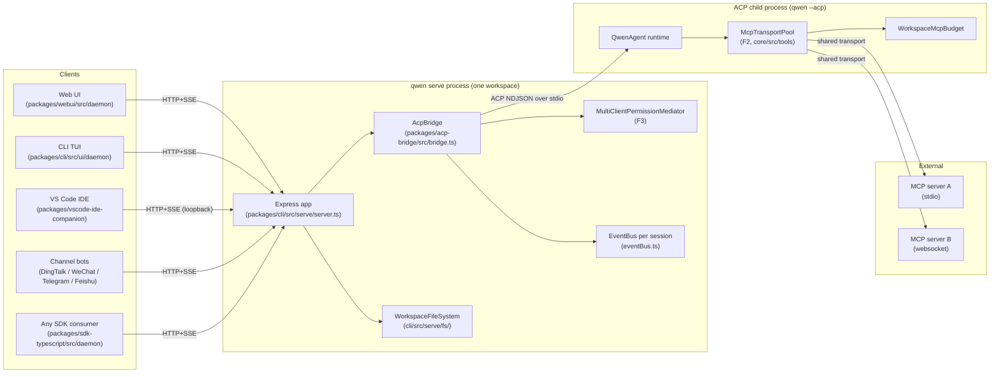
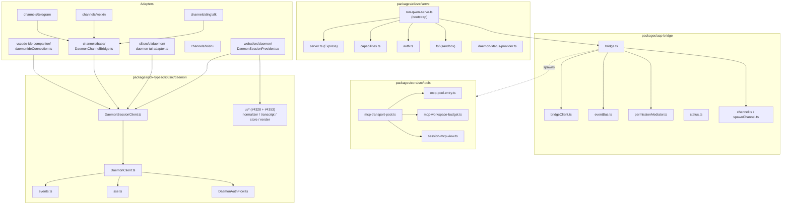
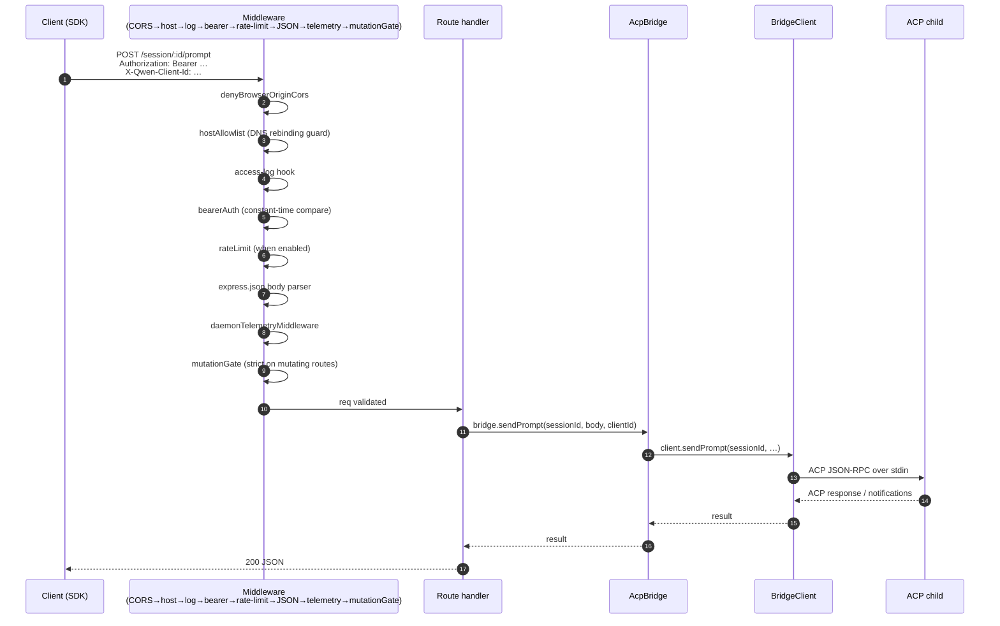
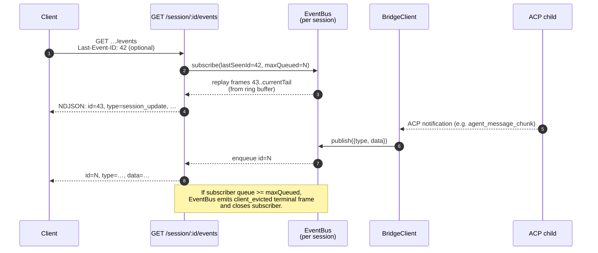
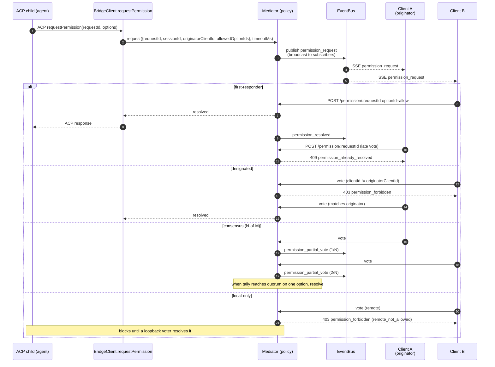
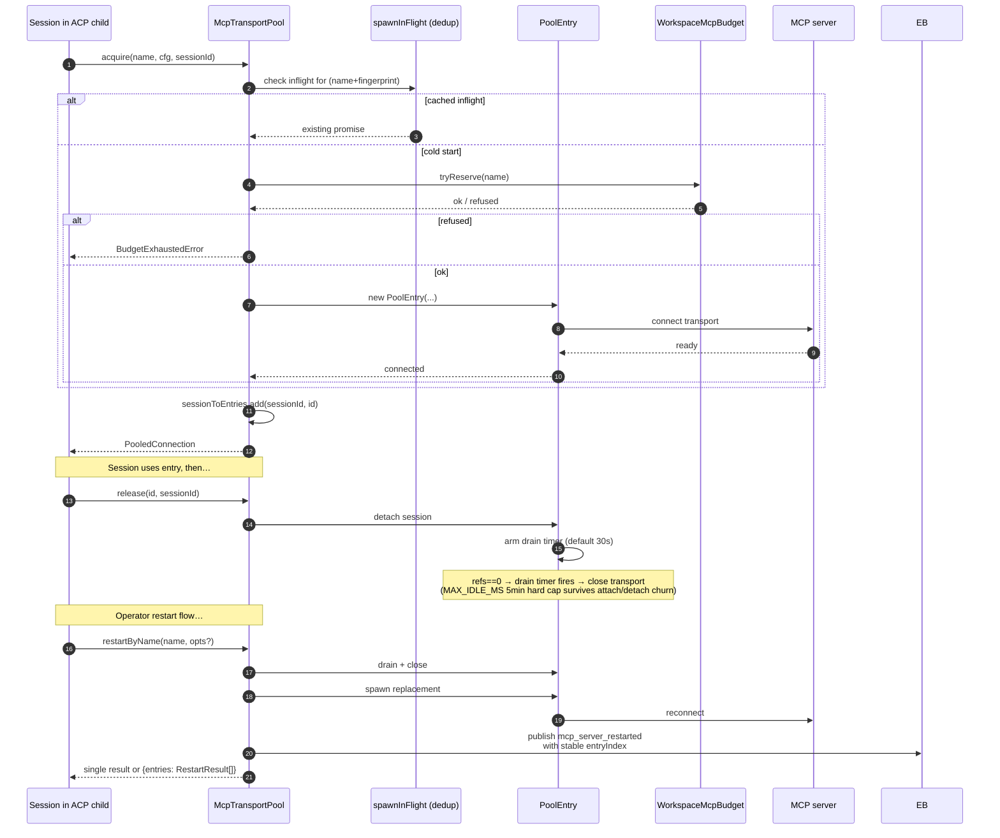
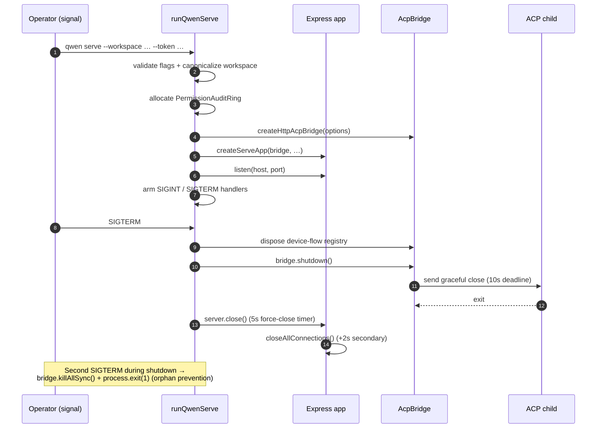

# Daemon-Architektur

## Übersicht

Ein `qwen serve`-Prozess ist **ein Daemon = ein Workspace**. Er beherbergt einen einzelnen Express-HTTP-Server, besitzt eine `@qwen-code/acp-bridge`-Instanz und erzeugt einen ACP-Kindprozess (`qwen --acp`), der die eigentliche Agent-Laufzeitumgebung ausführt. Mehrere Clients (CLI TUI, IDE-Begleiter, IM-Channel-Bots, Web-BFFs, benutzerdefinierte Skripte) verbinden sich über HTTP + SSE und teilen sich entweder eine ACP-Sitzung (`sessionScope: 'single'`, Standard) oder teilen Sitzungen nach Gesprächsfaden auf (`sessionScope: 'thread'`).

Innerhalb des ACP-Kindprozesses werden MCP-Server Workspace-weit über `McpTransportPool` (F2) gemeinsam genutzt: Ein einzelnes Tupel aus (Servername + Konfigurationsfingerabdruck) wird auf einen MCP-Transport abgebildet, unabhängig davon, wie viele Sitzungen ihn entdecken. Der `MultiClientPermissionMediator` (F3) der Bridge koordiniert Berechtigungsvoten aller verbundenen Clients unter einer von vier Richtlinien.

Dieses Dokument liefert das **Systembild**, auf dem der Rest dieser Dokumentation aufbaut. Jeder kritische Ablauf wird als Mermaid-Sequenzdiagramm dargestellt; Details zur Implementierung der einzelnen Komponenten finden sich in den anderen 18 Dokumenten.

## Prozesstopologie

Der Daemon-Prozess und der ACP-Kindprozess sind über einen `AcpChannel` verbunden (Standard: ein reales stdio-Pipe-Paar des Unterprozesses; `inMemoryChannel` für Tests). Alles, was der Daemon tut, wird durch diese Aufteilung bestimmt: HTTP- und SSE-Datenverkehr enden im Daemon, Agentenentscheidungen und Tool-Aufrufe finden im Kindprozess statt, und die Bridge verbindet die beiden.

## Paketübersicht

Drei Vertrauensgrenzen sind relevant: die HTTP-Kante (`serve/auth.ts` Middleware-Kette), die Grenze zwischen Bridge und ACP-Kindprozess (NDJSON über stdio, keine Authentifizierung; der Kindprozess vertraut der Bridge implizit) und die Grenze zwischen Agent und MCP-Server (der Agent kann Tools aufrufen, die den Host berühren).

## Workflow 1: HTTP-Request-Lebenszyklus

Nicht-Streaming-Routen (Prompt, Cancel, Modellwechsel, Metadaten, Workspace CRUD) enden als einzelne JSON-Antwort. Streaming-Ausgabe wird out-of-band auf dem SSE-Kanal geliefert, **nicht** als chunked HTTP-Body auf dieser Verbindung. Siehe Workflow 2.

## Workflow 2: SSE-Event-Zustellung und -Wiederholung

Der Ringpuffer ist begrenzt (`eventRingSize`, Standard 8000). Ein sich wieder verbindender Client, dessen `Last-Event-ID` älter als der Kopf des Rings ist, erhält ein synthetisches Catch-up-Signal und muss `loadSession` / `resumeSession` aufrufen, um den tieferen Zustand wiederherzustellen. Langsame Clients lösen bei 75 % Queue-Füllung `slow_client_warning` und am Cap `client_evicted` aus.

## Workflow 3: Multi-Client-Berechtigungsvermittlung

Übergreifende Notluke: Jeder Client kann `CANCEL_VOTE_SENTINEL` stimmen, um die Anfrage als `cancelled / agent_cancelled` abzukürzen. Die Bridge verhindert, dass Aufrufer von außen den Sentinel über das normale `optionId`-Feld einschmuggeln (`InvalidPermissionOptionError`).

## Workflow 4: MCP-Transportpool – Akquise / Freigabe / Neustart

`releaseSession(sessionId)` nutzt den umgekehrten `sessionToEntries`-Index, um jeden Eintrag, den die Sitzung hält, in O(refs) freizugeben. Beim Herunterfahren des Daemons setzt `drainAll()` das `draining`-Flag (lehnt neue Akquises ab) und wartet darauf, dass jeder Eintrag unter einem konfigurierbaren Timeout schließt.

## Workflow 5: Lebenszyklus – Start und sauberes Herunterfahren

Die zweiphasige Abschaltung ist wichtig, weil laufende HTTP-Requests, laufende SSE-Abonnenten und die laufenden Tool-Aufrufe des ACP-Kindprozesses begrenzte Beendigungsfenster benötigen. Wenn etwas diese Fristen überschreitet, übernimmt der erzwungene Schließpfad, damit ein festsitzender Kindprozess den Daemon-Prozess nicht am Leben halten kann.

## Kritische Dateien

| Bereich                     | Datei                                                         |
| --------------------------- | ------------------------------------------------------------- |
| Bootstrap                   | `packages/cli/src/serve/run-qwen-serve.ts`                     |
| Express-App                 | `packages/cli/src/serve/server.ts`                            |
| Capability-Registry         | `packages/cli/src/serve/capabilities.ts`                      |
| Auth-Middleware             | `packages/cli/src/serve/auth.ts`                              |
| Bridge                      | `packages/acp-bridge/src/bridge.ts`                           |
| BridgeClient                | `packages/acp-bridge/src/bridgeClient.ts`                     |
| Permission-Mediator         | `packages/acp-bridge/src/permissionMediator.ts`               |
| EventBus                    | `packages/acp-bridge/src/eventBus.ts`                         |
| MCP-Transportpool           | `packages/core/src/tools/mcp-transport-pool.ts`               |
| Workspace-MCP-Budget        | `packages/core/src/tools/mcp-workspace-budget.ts`            |
| Workspace-Dateisystem       | `packages/cli/src/serve/fs/`                                  |
| SDK DaemonClient            | `packages/sdk-typescript/src/daemon/DaemonClient.ts`          |
| SDK SessionClient           | `packages/sdk-typescript/src/daemon/DaemonSessionClient.ts`   |
| Event-Schema                | `packages/sdk-typescript/src/daemon/events.ts`                |

## Referenzen

- Design-Issues: [#3803](https://github.com/QwenLM/qwen-code/issues/3803) (Daemon-Design), [#4175](https://github.com/QwenLM/qwen-code/issues/4175) (F-Serie-Meilensteine).
- Benutzerhandbuch: [`../../users/qwen-serve.md`](../../users/qwen-serve.md).
- Wire-Protokoll-Referenz: [`../qwen-serve-protocol.md`](../qwen-serve-protocol.md).
- F2-Designdokument: [`../../design/f2-mcp-transport-pool.md`](../../design/f2-mcp-transport-pool.md).
- F2-Designnotizen: Issue [#4175](https://github.com/QwenLM/qwen-code/issues/4175) Commits 4-6.