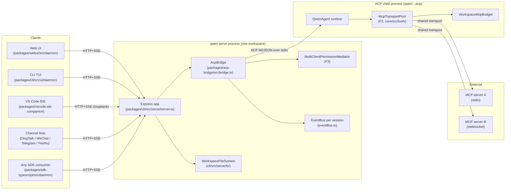
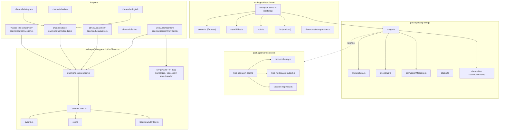
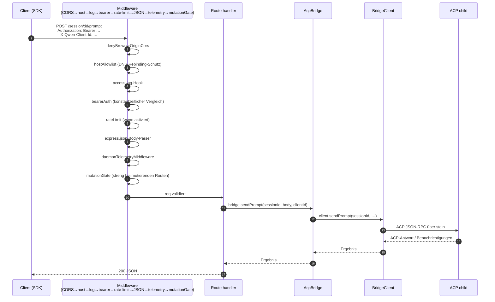
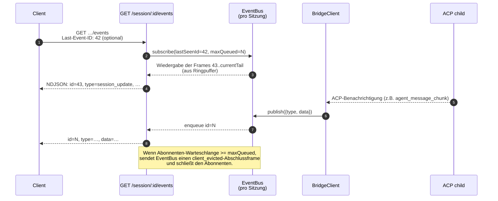
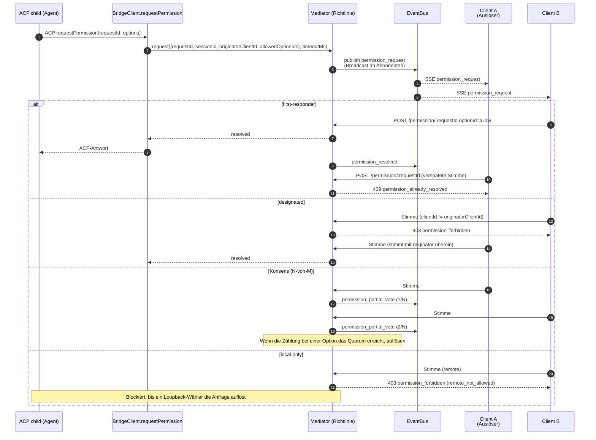
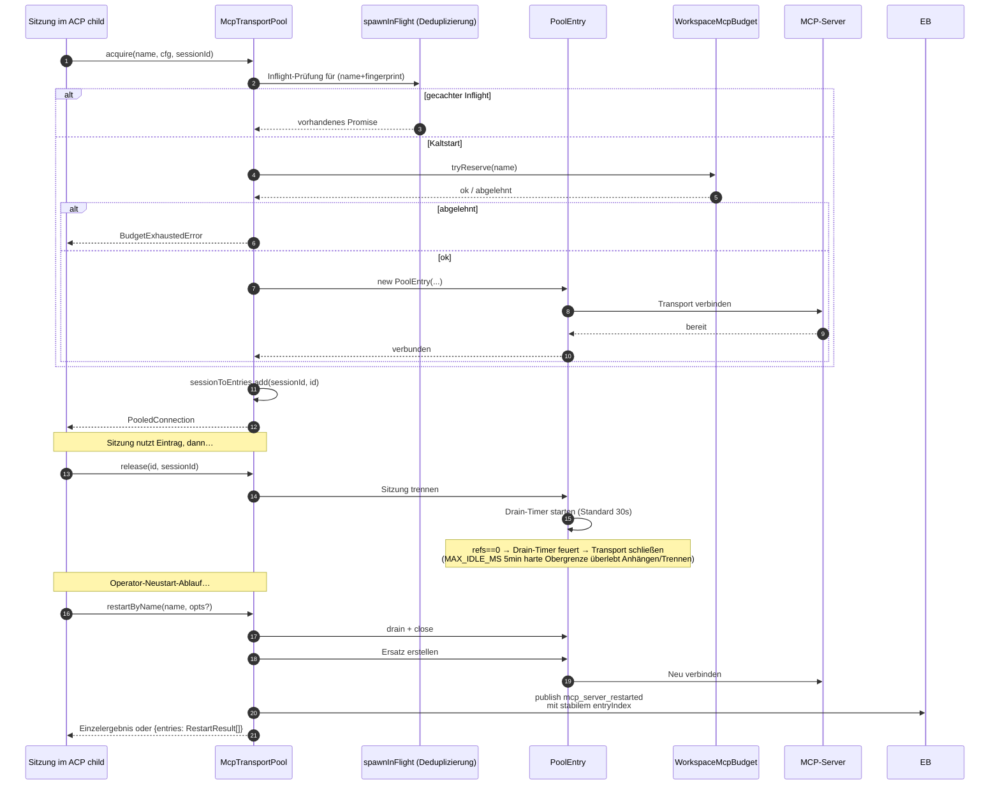
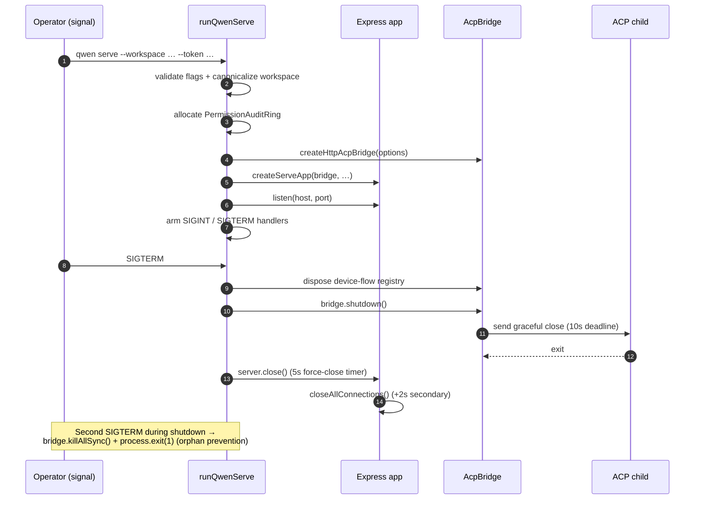

# Daemon-Architektur

## Übersicht

Ein `qwen serve`-Prozess ist **ein Daemon = ein Workspace**. Er hostet einen einzelnen Express-HTTP-Server, besitzt eine Instanz von `@qwen-code/acp-bridge` und erzeugt einen ACP-Kindprozess (`qwen --acp`), der die eigentliche Agent-Laufzeitumgebung ausführt. Mehrere Clients (CLI TUI, IDE-Begleitprogramm, IM-Kanal-Bots, Web-BFFs, benutzerdefinierte Skripte) verbinden sich über HTTP + SSE und teilen sich entweder eine ACP-Sitzung (`sessionScope: 'single'`, Standard) oder teilen Sitzungen nach Konversationsthread auf (`sessionScope: 'thread'`).

Innerhalb des ACP-Kindprozesses werden MCP-Server workspace-weit über `McpTransportPool` (F2) gemeinsam genutzt: Ein einzelnes Tupel (Servername + Konfigurationsfingerabdruck) wird auf einen MCP-Transport abgebildet, unabhängig davon, wie viele Sitzungen ihn entdecken. Der `MultiClientPermissionMediator` (F3) der Brücke koordiniert Berechtigungsabstimmungen über alle verbundenen Clients hinweg unter einer von vier Richtlinien.

Dieses Dokument gibt das **Systembild auf höchster Ebene**, auf dem der Rest dieses Dokumentsatzes aufbaut. Jeder kritische Ablauf wird als Mermaid-Sequenzdiagramm dargestellt; komponentenspezifische Implementierungsdetails finden sich in den anderen 18 Dokumenten.

## Prozess-Topologie

Der Daemon-Prozess und der ACP-Kindprozess sind über einen `AcpChannel` verbunden (Standard: ein echter Subprozess-stdio-Pipepaar; `inMemoryChannel` für Tests). Alles, was der Daemon tut, wird durch diese Aufteilung bestimmt: HTTP- und SSE-Daten enden im Daemon, Agent-Entscheidungen und Tool-Aufrufe finden im Kindprozess statt, und die Brücke verbindet beide.

## Paketübersicht

Drei Vertrauensgrenzen sind von Bedeutung: der HTTP-Rand (Middleware-Kette von `serve/auth.ts`), die Grenze zwischen Brücke und ACP-Kindprozess (NDJSON über stdio, keine Authentifizierung; der Kindprozess vertraut der Brücke implizit) und die Grenze zwischen Agent und MCP-Server (der Agent kann Tools aufrufen, die den Host berühren).
## Workflow 1: HTTP-Anfrage-Lebenszyklus

Nicht-Streaming-Routen (prompt, cancel, Modellwechsel, Metadaten, Workspace-CRUD) enden als einzelne JSON-Antwort. Streaming-Ausgaben werden out-of-band über den SSE-Kanal geliefert, **nicht** als chunked HTTP-Body auf dieser Verbindung. Siehe Workflow 2.

## Workflow 2: SSE-Ereignisauslieferung und -Wiederholung

Der Ringpuffer ist begrenzt (`eventRingSize`, Standard 8000). Ein Client, der sich mit einer `Last-Event-ID` wieder verbindet, die älter als der Kopf des Rings ist, erhält ein synthetisches Aufholsignal und muss `loadSession` / `resumeSession` aufrufen, um den tieferen Zustand wiederherzustellen. Langsame Clients lösen bei 75 % Warteschlangenfüllung `slow_client_warning` und bei Erreichen des Grenzwerts `client_evicted` aus.

## Workflow 3: Mehrfach-Client-Berechtigungsvermittlung

Richtlinienübergreifender Notausstieg: Jeder Client kann mit `CANCEL_VOTE_SENTINEL` stimmen, um die Anfrage als `cancelled / agent_cancelled` abzubrechen. Die Bridge schützt vor Drahtanrufern, die den Sentinel über das normale `optionId`-Feld schmuggeln (`InvalidPermissionOptionError`).

## Workflow 4: MCP-Transport-Pool – Erwerb / Freigabe / Neustart

`releaseSession(sessionId)` verwendet den umgekehrten Index `sessionToEntries`, um jeden von der Session gehaltenen Eintrag in O(refs) freizugeben. Beim Herunterfahren des Daemons setzt `drainAll()` das `draining`-Flag (verweigert neue Akquisitionen) und wartet darauf, dass jeder Eintrag innerhalb eines konfigurierbaren Timeouts geschlossen wird.

## Workflow 5: Lebenszyklus – Start und Graceful Shutdown

Der zweiphasige Shutdown ist wichtig, da laufende HTTP-Anfragen, laufende SSE-Abonnenten und die laufenden Tool-Aufrufe des ACP-Kindprozesses begrenzte Herunterfahrfenster benötigen. Falls etwas diese Fristen überschreitet, übernimmt der erzwungene Schließpfad, sodass ein blockierter Kindprozess den Daemon-Prozess nicht am Leben halten kann.

## Critical files

| Bereich              | Datei                                                        |
| -------------------- | ----------------------------------------------------------- |
| Bootstrap            | `packages/cli/src/serve/run-qwen-serve.ts`                    |
| Express app          | `packages/cli/src/serve/server.ts`                          |
| Capability registry  | `packages/cli/src/serve/capabilities.ts`                    |
| Auth middleware      | `packages/cli/src/serve/auth.ts`                            |
| Bridge               | `packages/acp-bridge/src/bridge.ts`                         |
| BridgeClient         | `packages/acp-bridge/src/bridgeClient.ts`                   |
| Permission mediator  | `packages/acp-bridge/src/permissionMediator.ts`             |
| EventBus             | `packages/acp-bridge/src/eventBus.ts`                       |
| MCP transport pool   | `packages/core/src/tools/mcp-transport-pool.ts`             |
| Workspace MCP budget | `packages/core/src/tools/mcp-workspace-budget.ts`           |
| Workspace FS         | `packages/cli/src/serve/fs/`                                |
| SDK DaemonClient     | `packages/sdk-typescript/src/daemon/DaemonClient.ts`        |
| SDK SessionClient    | `packages/sdk-typescript/src/daemon/DaemonSessionClient.ts` |
| Event schema         | `packages/sdk-typescript/src/daemon/events.ts`              |

## References

- Design issues: [#3803](https://github.com/QwenLM/qwen-code/issues/3803) (daemon design), [#4175](https://github.com/QwenLM/qwen-code/issues/4175) (F-series milestones).
- User guide: [`../../users/qwen-serve.md`](../../users/qwen-serve.md).
- Wire protocol reference: [`../qwen-serve-protocol.md`](../qwen-serve-protocol.md).
- F2 design document: [`../../design/f2-mcp-transport-pool.md`](../../design/f2-mcp-transport-pool.md).
- F2 design notes: issue [#4175](https://github.com/QwenLM/qwen-code/issues/4175) commits 4-6.
