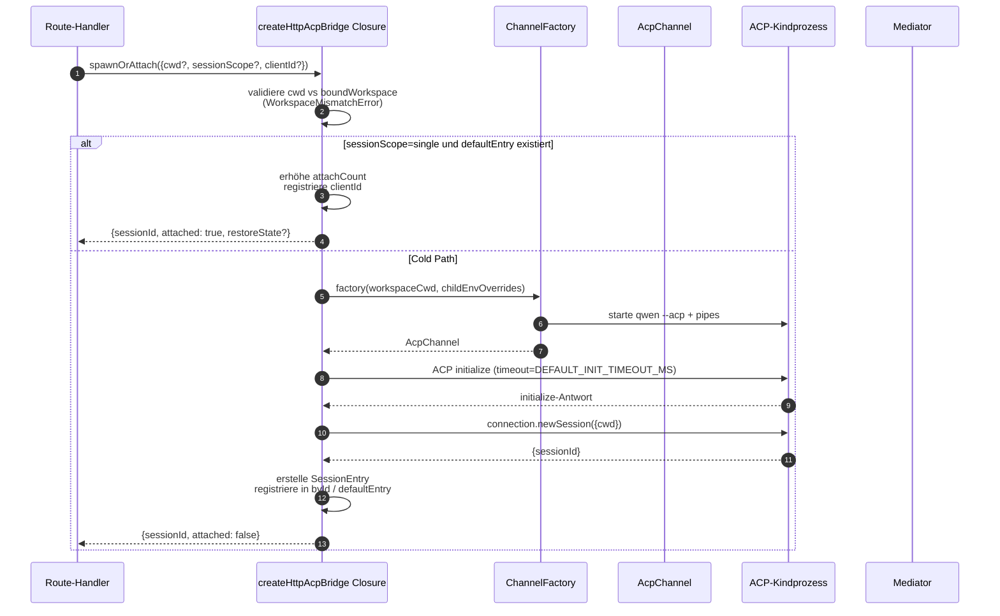
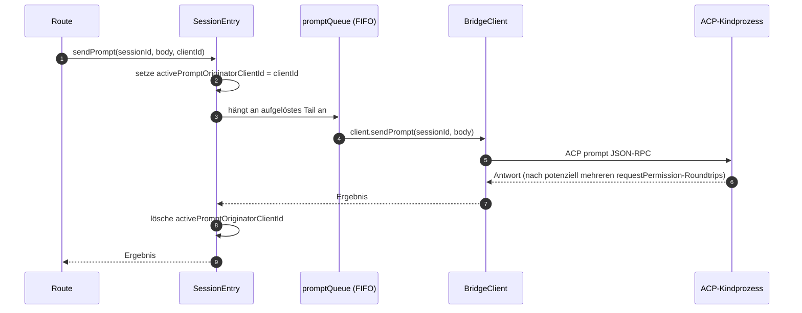
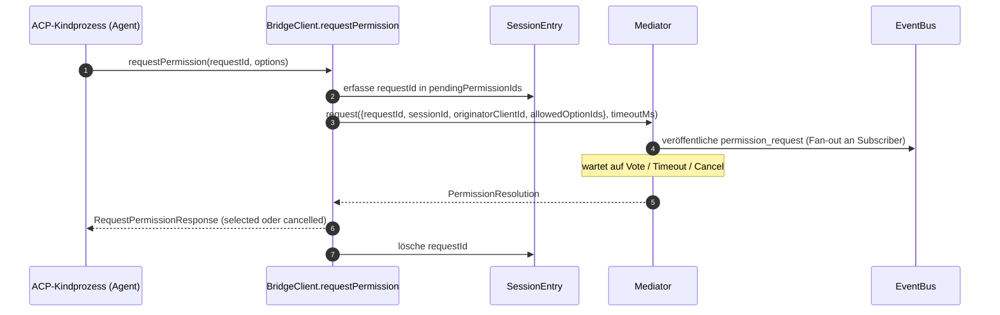
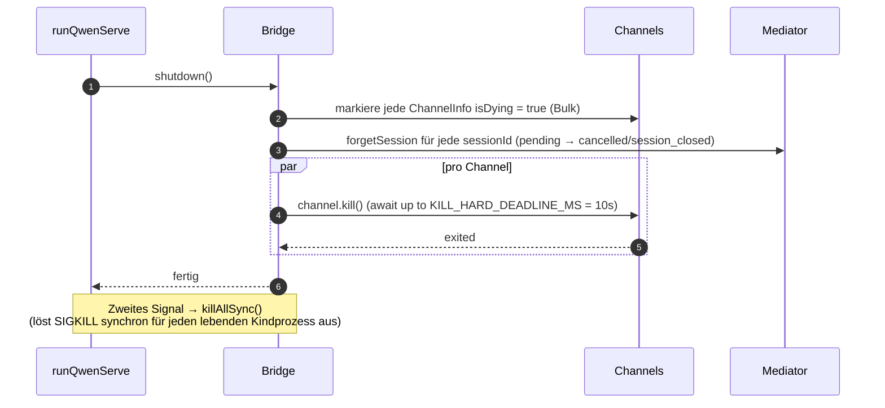

# ACP Bridge

## Übersicht

`packages/acp-bridge/` bildet die Grenze zwischen der HTTP-Schicht des Daemons und dem ACP-Kindprozess. Es wird von `packages/cli/src/serve/` (dem `qwen serve`-Daemon) konsumiert und wurde in #4175 F1 Schritt 3 extrahiert, damit zukünftige Konsumenten (`channels/base/AcpBridge.ts`, der VS Code IDE Companion) dieselbe Bridge-Kernlogik nutzen können, ohne auf das CLI-Paket zugreifen zu müssen.

Die Bridge stellt eine `HttpAcpBridge`-Instanz, einen `AcpChannel` zum ACP-Kindprozess, gemultiplexte Sessions über diesen Channel, sessionbezogene `EventBus`-Instanzen, einen `MultiClientPermissionMediator`, einen `BridgeFileSystem`-Adapter sowie ACP-orientierte Helper (`spawnOrAttach`, `loadSession`, `resumeSession`, `sendPrompt`, `cancelSession`, `respondToPermission` sowie extMethod-RPCs für Workspace-Status und MCP-Restart) bereit.

## Verantwortlichkeiten

- Starten oder Anhängen an den ACP-Kindprozess über eine austauschbare `ChannelFactory`. Standard-Factory: `defaultSpawnChannelFactory` (Subprozess `qwen --acp`). Tests injizieren `inMemoryChannel`.
- Verwalten von `aliveChannels` (Channel-Registry) und `byId` (Session-Registry).
- Multiplexen von N HTTP-seitigen Sessions auf einen ACP-Kindprozess via `connection.newSession()`.
- Serialisieren von sessionbezogenen Prompts über `promptQueue` (ACP erzwingt einen aktiven Prompt pro Session).
- Sessionbezogener FIFO für `setSessionModel`-Aufrufe, damit gleichzeitige Attaches mit unterschiedlichen Modellen nicht beim Agenten zu Race Conditions führen.
- Sessionbezogener `EventBus`, der `GET /session/:id/events` antreibt (siehe [`10-event-bus.md`](./10-event-bus.md)).
- Permission-Flow: `BridgeClient.requestPermission` → `MultiClientPermissionMediator.request` → Fan-out → Vote-Sammlung → ACP-Antwort (siehe [`04-permission-mediation.md`](./04-permission-mediation.md)).
- Datei-I/O: `BridgeFileSystem`-Adapter für ACP `readTextFile` / `writeTextFile`-Aufrufe (siehe [`07-workspace-filesystem.md`](./07-workspace-filesystem.md)).
- extMethod-RPCs für Workspace-weiten Status (`/workspace/mcp`, `/workspace/skills`, `/workspace/providers`) und MCP-Restart.
- Lifecycle: Graceful `shutdown()` mit `KILL_HARD_DEADLINE_MS` (10s) pro Channel; synchrones `killAllSync()` für erzwungenes Beenden beim zweiten Signal.

## Architektur

**Öffentlicher Einstiegspunkt**: `createHttpAcpBridge(opts: BridgeOptions): HttpAcpBridge` in `packages/acp-bridge/src/bridge.ts`.

**Wichtige Typen**:

| Type                            | File                    | Role                                                                                                                                                                                                                  |
| ------------------------------- | ----------------------- | --------------------------------------------------------------------------------------------------------------------------------------------------------------------------------------------------------------------- |
| `HttpAcpBridge`                 | `bridgeTypes.ts`        | Öffentliche Schnittstelle: `spawnOrAttach`, `loadSession`, `resumeSession`, `sendPrompt`, `cancelSession`, `subscribeEvents`, `respondToPermission`, `getWorkspaceMcpStatus`, `restartMcpServer`, `shutdown`, `killAllSync`, … |
| `BridgeSession`                 | `bridgeTypes.ts`        | `{ sessionId, workspaceCwd, attached, clientId?, createdAt? }` wird an HTTP-Handler zurückgegeben.                                                                                                                             |
| `BridgeOptions`                 | `bridgeOptions.ts`      | Konfiguration zur Erstellungszeit (siehe [Configuration](#configuration)).                                                                                                                                                       |
| `AcpChannel`                    | `channel.ts`            | `{ stream, kill(), killSync(), exited }` – ein ACP-NDJSON-Channel.                                                                                                                                                    |
| `ChannelFactory`                | `channel.ts`            | `(workspaceCwd, childEnvOverrides?) => Promise<AcpChannel>`.                                                                                                                                                          |
| `BridgeClient`                  | `bridgeClient.ts`       | Kapselt eine ACP `ClientSideConnection`; implementiert ACP `Client` (`requestPermission`, `readTextFile`, `writeTextFile`, `sessionUpdate`, `extNotification`).                                                             |
| `EventBus`                      | `eventBus.ts`           | Sessionbezogener In-Memory-Pub/Sub. Siehe [`10-event-bus.md`](./10-event-bus.md).                                                                                                                                            |
| `MultiClientPermissionMediator` | `permissionMediator.ts` | Mediator mit vier Richtlinien. Siehe [`04-permission-mediation.md`](./04-permission-mediation.md).                                                                                                                               |

**Interner Zustand (über Closure in `createHttpAcpBridge` gebunden)**:

| State           | Shape                           | Purpose                                                                                                                                                                                                                                                                                                                                                                                                  |
| --------------- | ------------------------------- | -------------------------------------------------------------------------------------------------------------------------------------------------------------------------------------------------------------------------------------------------------------------------------------------------------------------------------------------------------------------------------------------------------- |
| `aliveChannels` | `Map<string, ChannelInfo>`      | Channel-Registry, gekeyed nach Channel-ID. Jede `ChannelInfo` enthält `channel`, `connection`, `client` (ein `BridgeClient` pro Channel), `sessionIds: Set<string>`, `pendingRestoreIds`, `statusClosedReject?`, `isDying: boolean`.                                                                                                                                                                            |
| `byId`          | `Map<string, SessionEntry>`     | Session-Registry, gekeyed nach sessionId. Jeder `SessionEntry` enthält `channel`, `connection`, `events: EventBus`, `promptQueue: Promise<void>`, `modelChangeQueue: Promise<void>`, `pendingPermissionIds: Set<string>`, `clientIds: Map<string, count>`, `activePromptOriginatorClientId?`, `attachCount`, `spawnOwnerWantedKill`, `restoreState?`, `sessionLastSeenAt?`, `clientLastSeenAt: Map<string, ms>`. |
| `defaultEntry`  | `SessionEntry \| null`          | Die "einzelne" Session, die bei `sessionScope: 'single'` verwendet wird.                                                                                                                                                                                                                                                                                                                                                 |
| `defaultPolicy` | `PermissionPolicy`              | Konfiguriert über `BridgeOptions.permissionPolicy`.                                                                                                                                                                                                                                                                                                                                                         |
| `mediator`      | `MultiClientPermissionMediator` | Eine Instanz pro Bridge.                                                                                                                                                                                                                                                                                                                                                                                 |
| Constants       | —                               | `DEFAULT_INIT_TIMEOUT_MS = 10_000`, `MCP_RESTART_TIMEOUT_MS = 300_000`, `DEFAULT_MAX_SESSIONS = 20`, `MAX_EVENT_RING_SIZE = 1_000_000`, `DEFAULT_PERMISSION_TIMEOUT_MS = 5min`, `DEFAULT_MAX_PENDING_PER_SESSION = 64`.                                                                                                                                                                                  |

**`isDying`-Invariante**: Jeder Teardown-Pfad muss `ChannelInfo.isDying = true` synchron **vor** dem Awaiting von `channel.kill()` setzen. `ensureChannel` behandelt einen sterbenden Channel als nicht vorhanden und startet einen neuen. Ohne dieses Flag würde ein gleichzeitiger `spawnOrAttach`, der während des SIGTERM-Grace-Windows (bis zu 10s) eintrifft, an einen Transport anhängen, der gleich geschlossen wird, und die sessionId des Aufrufers würde bei jedem Folgeaufruf ein 404 zurückgeben. **Set-Stellen** (müssen synchron gehalten werden): `ensureChannel` (Initialisierungsfehler + Late-Shutdown-Re-Check), `doSpawn` (newSession-Fehler bei leerem Channel), `killSession` (letzte Session wird verlassen), `shutdown` (Bulk).

**`channelInfo`-Retention-Invariante**: `channelInfo` **nicht** löschen, wenn `isDying = true` gesetzt wird. `killAllSync` muss den Channel während des SIGTERM-Grace-Windows weiterhin finden können, um bei `process.exit(1)` SIGKILL auszulösen. `aliveChannels` hält den sterbenden Eintrag, bis `channel.exited` feuert.

**BridgeClient Bounded Buffering**: ACP `extNotification`-Frames, die auf `BridgeClient` für eine sessionId eintreffen, die noch nicht in `byId` ist (weil die Antwort von `connection.newSession` noch nicht zurückgekehrt ist, aber die MCP-Discovery innerhalb von `newSession` bereits Budget-Events gefeuert hat), werden in eine Early-Events-Queue gepuffert, begrenzt durch `MAX_EARLY_EVENT_SESSIONS = 64` × `MAX_EARLY_EVENTS_PER_SESSION = 32` × `EARLY_EVENT_TTL_MS = 60_000`. Der Worst Case sind etwa 400 KB Heap. Ohne Pufferung würde der erste SSE-Replay-Ring-Slot für eine neue Session Events vermissen, die während ihrer Erstellung gefeuert wurden.

## Workflow

### spawnOrAttach (primärer Einstiegspunkt)

Wichtige Punkte:

- `sessionScope='single'` mit einem vorhandenen `defaultEntry` erhöht nur `attachCount`, registriert `clientId` und gibt `attached: true` zurück.
- Der Cold Path führt die ChannelFactory aus, führt ACP `initialize` aus (`DEFAULT_INIT_TIMEOUT_MS=10s`), ruft `connection.newSession({cwd})` auf und registriert dann den neuen `SessionEntry`.
- `SessionLimitExceededError` wird geworfen, wenn `byId.size >= maxSessions`.
- `InvalidClientIdError` wird geworfen, wenn `X-Qwen-Client-Id` außerhalb von `[A-Za-z0-9._:-]{1,128}` liegt.
- Der Disconnect-Reaper in `server.ts` trackt den Spawn-Owner über `attachCount`/`spawnOwnerWantedKill`, um zu vermeiden, dass eine Session abgerissen wird, deren Spawn-Owner die Verbindung getrennt hat, aber andere Clients bereits attached sind (siehe #3889 BQ9tV).

### Prompt-Serialisierung

Fehler am Ende der Queue werden **unterdrückt**, damit die Ablehnung eines vorherigen Prompts nachfolgende Prompts nicht vergiftet; der ursprüngliche Aufrufer erhält die Ablehnung weiterhin auf seinem eigenen zurückgegebenen Promise. Das auf der Session zwischengespeicherte `transportClosedReject` setzt das Prompt-Promise gegen `channel.exited` in ein Race, sodass ein abgestürzter Kindprozess sofort sichtbar wird, anstatt zu hängen.

### Permission-Flow (High-Level)

`InvalidPermissionOptionError` wird vor dem Mediator geworfen, wenn ein Wire-Vote versucht, `CANCEL_VOTE_SENTINEL` über das normale `optionId`-Feld zu injizieren – der Sentinel ist die einzige Escape-Hatch der Bridge, um eine Anfrage als `cancelled / agent_cancelled` kurzzuschließen, und darf nicht versehentlich vom Wire erreichbar sein. Siehe [`04-permission-mediation.md`](./04-permission-mediation.md).

### Shutdown

## Channel-Factory

`AcpChannel` (`channel.ts`) ist die Transportabstraktion der Bridge. Die Produktion verwendet `defaultSpawnChannelFactory` in `spawnChannel.ts`, die `qwen --acp` als Subprozess mit einem Stdio-Pipe-Paar ausführt. Tests injizieren `inMemoryChannel`, um den Agenten In-Process auszuführen. Die Bridge weiß nichts über den zugrunde liegenden Mechanismus – sie benötigt nur `{ stream, kill, killSync, exited }`.

`ChannelFactory` akzeptiert `childEnvOverrides`, damit jeder Daemon-Handle seine eigenen MCP-Budget-Umgebungsvariablen (`QWEN_SERVE_MCP_CLIENT_BUDGET`, `QWEN_SERVE_MCP_BUDGET_MODE`) übergeben kann, ohne `process.env` zu mutieren (was zu Race Conditions führen würde, wenn zwei eingebettete Daemons im selben Node-Prozess laufen).

## Zustand & Lifecycle

- Die Bridge-Erstellung ist synchron; der erste `spawnOrAttach` startet den ACP-Kindprozess kalt.
- `defaultEntry` lebt über die Lebensdauer der Bridge bei `sessionScope: 'single'`; der Channel wird abgeräumt, wenn `sessionIds.size === 0` (nach `killSession`) UND `isDying` auf true springt.
- `MAX_EVENT_RING_SIZE = 1_000_000` ist eine weiche Obergrenze für `BridgeOptions.eventRingSize`, um Tippfehler von Operatoren vor ~500 MB pro-Session OOMs abzufangen.
- `DEFAULT_PERMISSION_TIMEOUT_MS = 5 * 60 * 1000` verhindert, dass eine klemmende Permission-Anfrage die sessionbezogene `promptQueue` für immer blockiert.
- `DEFAULT_MAX_PENDING_PER_SESSION = 64` spiegelt `DEFAULT_MAX_SUBSCRIBERS` wider; überschüssige `requestPermission`-Aufrufe werden als cancelled mit einer Stderr-Warnung aufgelöst.

## Abhängigkeiten

| Upstream                                                                                     | Downstream                                     |
| -------------------------------------------------------------------------------------------- | ---------------------------------------------- |
| `@agentclientprotocol/sdk` — `ClientSideConnection`, `PROTOCOL_VERSION`, ACP-Typen           | `packages/cli/src/serve/` (der Daemon)         |
| `@qwen-code/qwen-code-core` — `ApprovalMode`, `TrustGateError`, `getCurrentGeminiMdFilename` | `packages/channels/base/` (geplant, F4)        |
| `node:crypto`, `node:fs`, `node:path`                                                        | `packages/vscode-ide-companion/` (geplant, F4) |

## Konfiguration

`BridgeOptions` (`bridgeOptions.ts`):

| Key                                           | Default                                            | Purpose                                                                                                               |
| --------------------------------------------- | -------------------------------------------------- | --------------------------------------------------------------------------------------------------------------------- |
| `boundWorkspace`                              | (erforderlich)                                         | Kanonischer Workspace-Pfad, den die Bridge erzwingt.                                                                         |
| `sessionScope`                                | `'single'`                                         | `'single'` teilt eine Session über alle Clients; `'thread'` erstellt eine separate Session für jeden Konversations-Thread. |
| `channelFactory`                              | `defaultSpawnChannelFactory`                       | Austauschbare ACP-Kindprozess-Factory.                                                                                          |
| `initializeTimeoutMs`                         | `DEFAULT_INIT_TIMEOUT_MS = 10_000`                 | Timeout für den ACP `initialize`-Handshake.                                                                                   |
| `maxSessions`                                 | `DEFAULT_MAX_SESSIONS = 20`                        | Obergrenze für `byId.size`. `0` / `Infinity` = unbegrenzt; NaN/negativ wirft einen Fehler.                                                |
| `eventRingSize`                               | `DEFAULT_RING_SIZE` (aus `eventBus.ts`)           | Sessionbezogener Event-Ring; weich gedeckelt bei `MAX_EVENT_RING_SIZE`.                                                         |
| `permissionResponseTimeoutMs`                 | `DEFAULT_PERMISSION_TIMEOUT_MS = 5 min`            | Wallclock-Timeout pro Anfrage für den Mediator.                                                                               |
| `maxPendingPermissionsPerSession`             | `DEFAULT_MAX_PENDING_PER_SESSION = 64`             | Backpressure für High-Volume-Agenten.                                                                                   |
| `childEnvOverrides`                           | `{}`                                               | Handle-spezifische Env-Ergänzungen / -Bereinigungen für den ACP-Kindprozess.                                                                  |
| `persistApprovalMode`, `persistDisabledTools` | —                                                  | Settings-Write-Hooks für die Wave-4-Mutationsrouten.                                                                  |
| `contextFilename`                             | aus `context.fileName` in `settings.json`          | Überschreibt `getCurrentGeminiMdFilename`.                                                                               |
| `statusProvider`                              | (keine)                                             | Daemon-Host-Preflight-Zellen (`DaemonStatusProvider`).                                                                 |
| `fileSystem`                                  | (keine)                                             | `BridgeFileSystem`-Adapter für ACP `readTextFile` / `writeTextFile`.                                                  |
| `permissionPolicy`                            | aus `policy.permissionStrategy` in `settings.json` | Einer von `first-responder` / `designated` / `consensus` / `local-only`.                                                 |
| `permissionConsensusQuorum`                   | aus `settings.json`                               | N für Consensus-Policy.                                                                                               |
| `permissionAudit`                             | `createNoOpPermissionAuditPublisher()`             | Verbindung zu `PermissionAuditRing` für den Audit-Trail.                                                                    |
| `channelIdleTimeoutMs`                        | `0`                                                | Hält den ACP-Kindprozess für diese Anzahl an Millisekunden am Leben, nachdem die letzte Session geschlossen wird.                                    |
## Zusätzliche Bridge-Methoden

Neben den Kernaufrufen `spawnOrAttach`, `sendPrompt`, `cancelSession`,
`respondToPermission`, `loadSession` und `resumeSession` umfasst die
`HttpAcpBridge`-Schnittstelle nun diese Daemon-Hilfsfunktionen:

| Methode                                                      | Zweck                                         |
| ------------------------------------------------------------ | --------------------------------------------- |
| `generateSessionRecap(sessionId, context?)`                  | Generiert eine einzeilige Zusammenfassung der Session. |
| `generateSessionBtw(sessionId, question, signal?, context?)` | Beantwortet eine Nebenfrage / einen "btw"-Prompt. |
| `executeShellCommand(sessionId, command, signal?, context?)` | Führt einen Shell-Befehl auf dem Daemon-Host aus. |
| `getSessionContextUsageStatus(sessionId, opts?)`             | Gibt die Context-Window-Nutzung zurück.       |
| `getSessionSupportedCommandsStatus(sessionId)`               | Gibt die verfügbaren Slash-Befehle zurück.    |
| `getSessionTasksStatus(sessionId)`                           | Gibt einen Snapshot der Hintergrundtasks zurück. |
| `getSessionStatsStatus(sessionId)`                           | Gibt die Nutzungsstatistiken der Session zurück. |
| `setSessionApprovalMode(sessionId, mode, opts, context?)`    | Aktualisiert den Approval-Modus für eine Session. |
| `detachClient(sessionId, clientId?)`                         | Trennt einen Client explizit.                 |
| `addRuntimeMcpServer(name, config, originatorClientId)`      | Fügt zur Laufzeit einen MCP-Server hinzu.     |
| `removeRuntimeMcpServer(name, originatorClientId)`           | Entfernt zur Laufzeit einen MCP-Server.       |
| `manageMcpServer(serverName, action, originatorClientId)`    | Aktiviert / deaktiviert / authentifiziert / löscht die Authentifizierung. |
| `generateWorkspaceAgent(description, originatorClientId)`    | Generiert mit KI eine Subagent-Definition.    |
| `preheat()`                                                  | Wärmt das ACP-Child vor der ersten Session auf. |
| `getSessionLastEventId(sessionId)`                           | Liest die monotone Event-ID der Session.      |
| `getWorkspaceToolsStatus()`                                  | Gibt den Snapshot der integrierten Tool-Registry zurück. |
| `getWorkspaceMcpToolsStatus(serverName)`                     | Gibt die Tools für einen bestimmten MCP-Server zurück. |

`BridgeSpawnRequest.sessionScope` wurde von `'per-client'` in
`'thread'` umbenannt. `BridgeRestoredSession` enthält nun `compactedReplay`,
`liveJournal` und `lastEventId`. `BridgeClientRequestContext` ist der Request-
Context, der durch die Bridge-Aufrufe gereicht wird; er enthält `clientId`,
`fromLoopback: boolean` und `promptId`.

## Einschränkungen & bekannte Limits

- `MCP_RESTART_TIMEOUT_MS = 300_000` (5 min) – Das Bridge-Timeout für `/workspace/mcp/:server/restart` ist absichtlich groß gewählt, da `McpClientManager.MAX_DISCOVERY_TIMEOUT_MS` für Stdio-Server bis zu 5 Minuten betragen kann. Ein kürzeres Zeitlimit würde zu Fehlern durch Timeouts führen, während das ACP-Child im Hintergrund weiterhin versucht, die Verbindung wiederherzustellen.
- `BridgeOptions.eventRingSize > 1_000_000` löst bei der Konstruktion einen Fehler aus.
- `connection.unstable_resumeSession` wird über die stabile `session_resume`-Daemon-Capability bereitgestellt; `unstable_session_resume` bleibt als veralteter Kompatibilitäts-Alias für ältere SDKs verfügbar. Clients sollten `session_resume` per Feature-Detection erkennen.
- Das Bridge-Paket ist `@qwen-code/acp-bridge`. Der aktuelle Code importiert Event-Bus- und Status-Primitiven direkt aus den Paket-Subpfaden; `serve/acp-session-bridge.ts` bleibt als CLI-lokale Kompatibilitäts-Fassade für die umfassendere Bridge-Oberfläche erhalten.

## Referenzen

- `packages/acp-bridge/src/bridge.ts` (insb. `createHttpAcpBridge` ab Zeile 350+)
- `packages/acp-bridge/src/bridgeClient.ts`
- `packages/acp-bridge/src/bridgeTypes.ts`
- `packages/acp-bridge/src/bridgeOptions.ts`
- `packages/acp-bridge/src/channel.ts`
- `packages/acp-bridge/src/spawnChannel.ts`
- `packages/acp-bridge/src/bridgeErrors.ts`
- Issues: [#3803](https://github.com/QwenLM/qwen-code/issues/3803), [#4175](https://github.com/QwenLM/qwen-code/issues/4175).