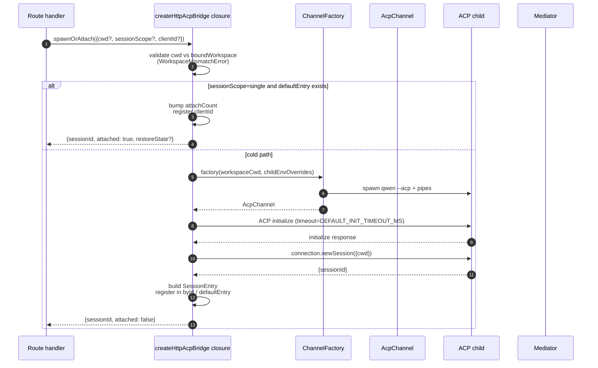
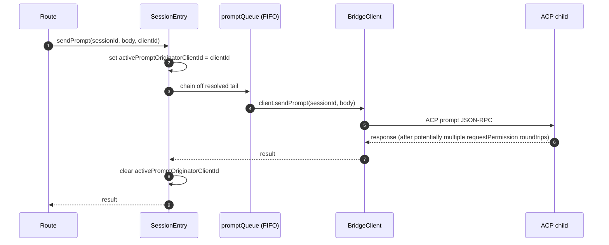
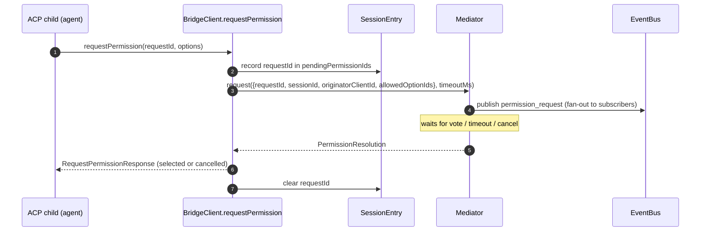
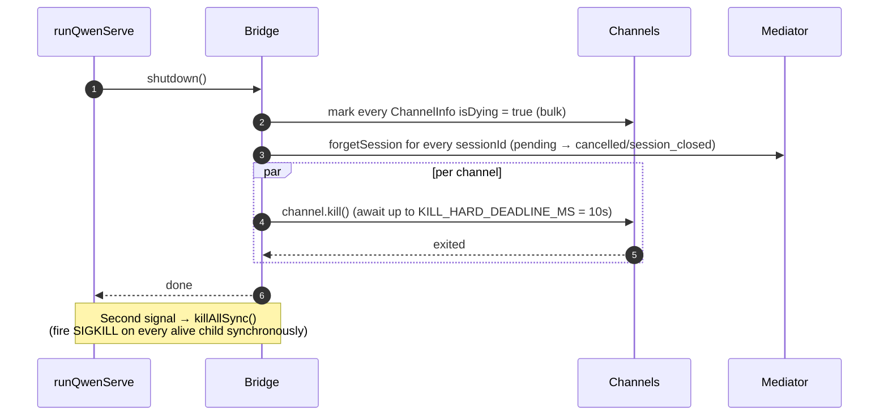

# ACP-Bridge

## Übersicht

`packages/acp-bridge/` verwaltet die Grenze zwischen der HTTP-Schicht des Daemons und dem ACP-Kindprozess. Es wird von `packages/cli/src/serve/` (dem `qwen serve`-Daemon) konsumiert und wurde in #4175 F1 Schritt 3 extrahiert, damit zukünftige Konsumenten (`channels/base/AcpBridge.ts`, der VS Code IDE-Begleiter) denselben Bridge-Kern nutzen können, ohne auf das CLI-Paket zugreifen zu müssen.

Die Bridge bietet eine `HttpAcpBridge`-Instanz, einen `AcpChannel` zum ACP-Kind, multiplexte Sitzungen über diesen Kanal, pro Sitzung `EventBus`es, einen `MultiClientPermissionMediator`, einen `BridgeFileSystem`-Adapter sowie ACP-orientierte Hilfsfunktionen (`spawnOrAttach`, `loadSession`, `resumeSession`, `sendPrompt`, `cancelSession`, `respondToPermission`, plus extMethod-RPCs für Workspace-Status und MCP-Neustart).

## Verantwortlichkeiten

- Starten oder Anbinden des ACP-Kindprozesses über eine steckbare `ChannelFactory`. Standard-Factory: `defaultSpawnChannelFactory` (Subprozess `qwen --acp`). Tests injizieren `inMemoryChannel`.
- Verwalten von `aliveChannels` (Kanal-Registry) und `byId` (Sitzungs-Registry).
- Multiplexen von N HTTP-seitigen Sitzungen auf einen ACP-Kindprozess via `connection.newSession()`.
- Serialisieren von Prompts pro Sitzung durch `promptQueue` (ACP erzwingt einen aktiven Prompt pro Sitzung).
- FIFO pro Sitzung für `setSessionModel`-Aufrufe, sodass gleichzeitige Attaches mit verschiedenen Modellen den Agenten nicht überholen.
- `EventBus` pro Sitzung, der `GET /session/:id/events` antreibt (siehe [`10-event-bus.md`](./10-event-bus.md)).
- Berechtigungsablauf: `BridgeClient.requestPermission` → `MultiClientPermissionMediator.request` → Fan-out → Stimmensammlung → ACP-Antwort (siehe [`04-permission-mediation.md`](./04-permission-mediation.md)).
- Datei-I/O: `BridgeFileSystem`-Adapter für ACP-`readTextFile`/`writeTextFile`-Aufrufe (siehe [`07-workspace-filesystem.md`](./07-workspace-filesystem.md)).
- extMethod-RPCs für Workspace-Status (`/workspace/mcp`, `/workspace/skills`, `/workspace/providers`) und MCP-Neustart.
- Lebenszyklus: ordentliches `shutdown()` mit `KILL_HARD_DEADLINE_MS` (10s) pro Kanal; synchrones `killAllSync()` für sofortiges Beenden bei zweitem Signal.

## Architektur

**Öffentlicher Einstieg**: `createHttpAcpBridge(opts: BridgeOptions): HttpAcpBridge` in `packages/acp-bridge/src/bridge.ts`.

**Wichtige Typen**:

| Typ                            | Datei                    | Rolle                                                                                                                                                                                                                                                   |
| ------------------------------ | ------------------------ | ------------------------------------------------------------------------------------------------------------------------------------------------------------------------------------------------------------------------------------------------------- |
| `HttpAcpBridge`                | `bridgeTypes.ts`         | Öffentliches Interface: `spawnOrAttach`, `loadSession`, `resumeSession`, `sendPrompt`, `cancelSession`, `subscribeEvents`, `respondToPermission`, `getWorkspaceMcpStatus`, `restartMcpServer`, `shutdown`, `killAllSync`, …                              |
| `BridgeSession`                | `bridgeTypes.ts`         | `{ sessionId, workspaceCwd, attached, clientId?, createdAt? }` — wird an HTTP-Handler zurückgegeben.                                                                                                                                                    |
| `BridgeOptions`                | `bridgeOptions.ts`       | Konfiguration zum Zeitpunkt der Erstellung (siehe [Konfiguration](#configuration)).                                                                                                                                                                     |
| `AcpChannel`                   | `channel.ts`             | `{ stream, kill(), killSync(), exited }` — ein ACP-NDJSON-Kanal.                                                                                                                                                                                       |
| `ChannelFactory`               | `channel.ts`             | `(workspaceCwd, childEnvOverrides?) => Promise<AcpChannel>`.                                                                                                                                                                                            |
| `BridgeClient`                 | `bridgeClient.ts`        | Kapselt eine ACP `ClientSideConnection`; implementiert ACP `Client` (`requestPermission`, `readTextFile`, `writeTextFile`, `sessionUpdate`, `extNotification`).                                                                                         |
| `EventBus`                     | `eventBus.ts`            | In-Memory-Pub/Sub pro Sitzung. Siehe [`10-event-bus.md`](./10-event-bus.md).                                                                                                                                                                            |
| `MultiClientPermissionMediator`| `permissionMediator.ts`  | Vermittler mit vier Strategien. Siehe [`04-permission-mediation.md`](./04-permission-mediation.md).                                                                                                                                                    |
**Interner Zustand (abgeschlossen von `createHttpAcpBridge`)**:

| Zustand           | Form                             | Zweck                                                                                                                                                                                                                                                                                                                                                                                         |
| ----------------- | -------------------------------- | --------------------------------------------------------------------------------------------------------------------------------------------------------------------------------------------------------------------------------------------------------------------------------------------------------------------------------------------------------------------------------------------- |
| `aliveChannels`   | `Map<string, ChannelInfo>`       | Channel-Registry, indiziert nach Channel-ID. Jedes `ChannelInfo` enthält `channel`, `connection`, `client` (ein `BridgeClient` pro Channel), `sessionIds: Set<string>`, `pendingRestoreIds`, `statusClosedReject?`, `isDying: boolean`.                                                                                                                                                       |
| `byId`            | `Map<string, SessionEntry>`      | Session-Registry, indiziert nach sessionId. Jedes `SessionEntry` enthält `channel`, `connection`, `events: EventBus`, `promptQueue: Promise<void>`, `modelChangeQueue: Promise<void>`, `pendingPermissionIds: Set<string>`, `clientIds: Map<string, count>`, `activePromptOriginatorClientId?`, `attachCount`, `spawnOwnerWantedKill`, `restoreState?`, `sessionLastSeenAt?`, `clientLastSeenAt: Map<string, ms>`. |
| `defaultEntry`    | `SessionEntry \| null`           | Die „Single“-Session, die verwendet wird, wenn `sessionScope: 'single'`.                                                                                                                                                                                                                                                                                                                      |
| `defaultPolicy`   | `PermissionPolicy`               | Konfiguriert über `BridgeOptions.permissionPolicy`.                                                                                                                                                                                                                                                                                                                                           |
| `mediator`        | `MultiClientPermissionMediator`  | Eine pro Bridge-Instanz.                                                                                                                                                                                                                                                                                                                                                                      |
| Konstanten        | —                                | `DEFAULT_INIT_TIMEOUT_MS = 10_000`, `MCP_RESTART_TIMEOUT_MS = 300_000`, `DEFAULT_MAX_SESSIONS = 20`, `MAX_EVENT_RING_SIZE = 1_000_000`, `DEFAULT_PERMISSION_TIMEOUT_MS = 5min`, `DEFAULT_MAX_PENDING_PER_SESSION = 64`.                                                                                                        |

**`isDying`-Invariante**: Jeder Teardown-Pfad muss `ChannelInfo.isDying = true` synchron **vor** dem `await` auf `channel.kill()` setzen. `ensureChannel` behandelt einen sterbenden Channel als nicht vorhanden und erzeugt einen neuen. Ohne dieses Flag würde ein gleichzeitiger `spawnOrAttach`-Aufruf während des SIGTERM-Gnadenfensters (bis zu 10 s) an einen Transport anhängen, der kurz vor dem Schließen steht, und die sessionId des Aufrufers würde bei jedem Folgeschritt 404 erhalten. **Set-Stellen** (müssen synchron bleiben): `ensureChannel` (Initialisierungsfehler + späte Shutdown-Überprüfung), `doSpawn` (newSession-Fehler bei leerem Channel), `killSession` (letzte Session verlässt), `shutdown` (Massenhaft).

**`channelInfo`-Aufbewahrungsinvariante**: `channelInfo` **nicht** löschen, wenn `isDying = true` gesetzt wird. `killAllSync` muss den Channel während des SIGTERM-Gnadenfensters noch finden können, um SIGKILL bei `process.exit(1)` zu senden. `aliveChannels` behält den sterbenden Eintrag, bis `channel.exited` ausgelöst wird.

**BridgeClient gebundene Pufferung**: ACP `extNotification`-Frames, die auf `BridgeClient` für eine sessionId eintreffen, die noch nicht in `byId` ist (weil die Antwort von `connection.newSession` noch nicht zurückgekehrt ist, aber die MCP-Erkennung innerhalb von `newSession` bereits Budget-Ereignisse ausgelöst hat), werden in eine Warteschlange für frühe Ereignisse gepuffert, die begrenzt ist durch `MAX_EARLY_EVENT_SESSIONS = 64` × `MAX_EARLY_EVENTS_PER_SESSION = 32` × `EARLY_EVENT_TTL_MS = 60_000`. Der schlimmste Fall sind ungefähr 400 KB Heap. Ohne Pufferung würde der erste SSE-Replay-Ring-Slot für eine neue Session Ereignisse vermissen, die während ihrer Erstellung ausgelöst wurden.
## Workflow

### `spawnOrAttach` (primärer Einstiegspunkt)

Wichtige Punkte:

- `sessionScope='single'` mit einem vorhandenen `defaultEntry` erhöht nur
  `attachCount`, registriert `clientId` und gibt `attached: true` zurück.
- Der Kaltstart-Pfad durchläuft die ChannelFactory, führt die ACP-`initialize`
  (`DEFAULT_INIT_TIMEOUT_MS=10s`) aus, ruft `connection.newSession({cwd})` auf und
  registriert anschließend den neuen `SessionEntry`.
- `SessionLimitExceededError` wird ausgelöst, wenn `byId.size >= maxSessions`.
- `InvalidClientIdError` wird ausgelöst, wenn `X-Qwen-Client-Id` nicht dem Muster
  `[A-Za-z0-9._:-]{1,128}` entspricht.
- Der Disconnect-Reaper in `server.ts` verfolgt den Spawn-Besitzer über
  `attachCount`/`spawnOwnerWantedKill`, um die Zerstörung einer Session zu vermeiden, deren
  Spawn-Besitzer die Verbindung getrennt hat, während andere Clients bereits verbunden sind (siehe #3889
  BQ9tV).

### Prompt-Serialisierung

Fehler am Ende der Warteschlange werden **geschluckt**, sodass die Ablehnung eines vorherigen Prompts keine nachfolgenden Prompts vergiftet; der ursprüngliche Aufrufer erhält die Ablehnung weiterhin über sein eigenes zurückgegebenes Promise. Der auf der Session gecachte `transportClosedReject` setzt das Prompt-Promise gegen `channel.exited` in Wettbewerb, sodass ein abgestürzter Kindprozess sofort sichtbar wird, anstatt zu hängen.

### Berechtigungsablauf (High-Level)

`InvalidPermissionOptionError` wird vor dem Mediator ausgelöst, wenn eine Wire-Abstimmung versucht, `CANCEL_VOTE_SENTINEL` über das normale `optionId`-Feld zu injizieren – der Sentinel ist der einzige Ausweg der Brücke, um eine Anfrage als `cancelled / agent_cancelled` kurz zu schließen, und darf nicht versehentlich über das Wire erreichbar sein. Siehe [`04-permission-mediation.md`](./04-permission-mediation.md).

### Herunterfahren

## Channel-Factory

`AcpChannel` (`channel.ts`) ist die Transportabstraktion der Brücke. In der Produktion wird `defaultSpawnChannelFactory` in `spawnChannel.ts` verwendet, die `qwen --acp` als Subprozess mit einem stdio-Pipe-Paar startet. Tests injizieren `inMemoryChannel`, um den Agenten prozessintern auszuführen. Die Brücke weiß nichts über den zugrunde liegenden Mechanismus – sie benötigt nur `{ stream, kill, killSync, exited }`.

`ChannelFactory` akzeptiert `childEnvOverrides`, sodass jedes Daemon-Handle seine eigenen MCP-Budget-Umgebungsvariablen (`QWEN_SERVE_MCP_CLIENT_BUDGET`, `QWEN_SERVE_MCP_BUDGET_MODE`) übergeben kann, ohne `process.env` zu mutieren (was zu Wettlaufsituationen führen würde, wenn zwei eingebettete Daemons im selben Node-Prozess laufen).
## Zustand & Lebenszyklus

- Die Bridge-Erstellung ist synchron; der erste `spawnOrAttach` startet das ACP-Child kalt.
- `defaultEntry` lebt für die gesamte Lebensdauer der Bridge unter `sessionScope: 'single'`; der Kanal räumt auf, wenn `sessionIds.size === 0` (nach `killSession`) UND `isDying` auf true wechselt.
- `MAX_EVENT_RING_SIZE = 1_000_000` ist eine weiche Obergrenze für `BridgeOptions.eventRingSize`, um Tippfehler des Operators zu erkennen, bevor es zu ~500 MB pro Session OOMs kommt.
- `DEFAULT_PERMISSION_TIMEOUT_MS = 5 * 60 * 1000` verhindert, dass eine blockierte Berechtigungsanfrage die pro Session bestehende `promptQueue` auf unbestimmte Zeit blockiert.
- `DEFAULT_MAX_PENDING_PER_SESSION = 64` spiegelt `DEFAULT_MAX_SUBSCRIBERS` wider; überzählige `requestPermission`-Aufrufe werden mit einer stderr-Warnung als abgebrochen aufgelöst.

## Abhängigkeiten

| Vorgänger                                                                                     | Nachfolger                                     |
| -------------------------------------------------------------------------------------------- | ---------------------------------------------- |
| `@agentclientprotocol/sdk` — `ClientSideConnection`, `PROTOCOL_VERSION`, ACP types           | `packages/cli/src/serve/` (der Daemon)         |
| `@qwen-code/qwen-code-core` — `ApprovalMode`, `TrustGateError`, `getCurrentGeminiMdFilename` | `packages/channels/base/` (geplant, F4)        |
| `node:crypto`, `node:fs`, `node:path`                                                        | `packages/vscode-ide-companion/` (geplant, F4) |

## Konfiguration

`BridgeOptions` (`bridgeOptions.ts`):

| Schlüssel                                    | Standard                                            | Zweck                                                                                                               |
| ------------------------------------------- | -------------------------------------------------- | ------------------------------------------------------------------------------------------------------------------- |
| `boundWorkspace`                              | (erforderlich)                                         | Kanonischer Arbeitsbereichspfad, den die Bridge erzwingt.                                                                |
| `sessionScope`                                | `'single'`                                         | `'single'` teilt eine Session über alle Clients; `'thread'` erstellt eine separate Session für jeden Konversationsthread. |
| `channelFactory`                              | `defaultSpawnChannelFactory`                       | Plugbare ACP-Child-Factory.                                                                                          |
| `initializeTimeoutMs`                         | `DEFAULT_INIT_TIMEOUT_MS = 10_000`                 | Timeout des ACP `initialize`-Handshakes.                                                                                   |
| `maxSessions`                                 | `DEFAULT_MAX_SESSIONS = 20`                        | Obergrenze für `byId.size`. `0` / `Infinity` = unbegrenzt; NaN/negativ löst Fehler aus.                                                |
| `eventRingSize`                               | `DEFAULT_RING_SIZE` (aus `eventBus.ts`)           | Event-Ring pro Session; weich begrenzt auf `MAX_EVENT_RING_SIZE`.                                                         |
| `permissionResponseTimeoutMs`                 | `DEFAULT_PERMISSION_TIMEOUT_MS = 5 min`            | Pro-Anfrage verfügbare Laufzeit für den Mediator.                                                                               |
| `maxPendingPermissionsPerSession`             | `DEFAULT_MAX_PENDING_PER_SESSION = 64`             | Gegendruck bei Agenten mit hohem Volumen.                                                                                   |
| `childEnvOverrides`                           | `{}`                                               | Umgebungsvariablen-Ergänzungen/-Bereinigungen pro Handle für das ACP-Child.                                                                  |
| `persistApprovalMode`, `persistDisabledTools` | —                                                  | Schreib-Hooks für die Wave-4-Mutationsrouten in den Einstellungen.                                                                  |
| `contextFilename`                             | aus `settings.json` (Eigenschaft `context.fileName`)          | Überschreibt `getCurrentGeminiMdFilename`.                                                                               |
| `statusProvider`                              | (keine)                                             | Daemon-gehostete Preflight-Zellen (`DaemonStatusProvider`).                                                                 |
| `fileSystem`                                  | (keine)                                             | `BridgeFileSystem`-Adapter für ACP `readTextFile` / `writeTextFile`.                                                  |
| `permissionPolicy`                            | aus `settings.json`, Eintrag `policy.permissionStrategy` | Einer von `first-responder` / `designated` / `consensus` / `local-only`.                                                 |
| `permissionConsensusQuorum`                   | aus `settings.json`                               | N für die Konsensrichtlinie.                                                                                               |
| `permissionAudit`                             | `createNoOpPermissionAuditPublisher()`             | An `PermissionAuditRing` für den Audit-Pfad anschließen.                                                                    |
| `channelIdleTimeoutMs`                        | `0`                                                | Hält das ACP-Child für diese Anzahl Millisekunden am Leben, nachdem die letzte Session geschlossen wurde.                                    |
## Zusätzliche Bridge-Methoden

Zusätzlich zu den Kernaufrufen `spawnOrAttach`, `sendPrompt`, `cancelSession`,
`respondToPermission`, `loadSession` und `resumeSession` enthält das
`HttpAcpBridge`-Interface nun diese Daemon-orientierten Hilfsfunktionen:

| Methode                                                      | Zweck                                        |
| ------------------------------------------------------------ | -------------------------------------------- |
| `generateSessionRecap(sessionId, context?)`                  | Generiert eine einzeilige Sitzungszusammenfassung. |
| `generateSessionBtw(sessionId, question, signal?, context?)` | Beantwortet eine Nebenfrage / btw-Prompt.    |
| `executeShellCommand(sessionId, command, signal?, context?)` | Führt einen Shell-Befehl auf dem Daemon-Host aus. |
| `getSessionContextUsageStatus(sessionId, opts?)`             | Gibt die Nutzung des Kontextfensters zurück. |
| `getSessionSupportedCommandsStatus(sessionId)`               | Gibt verfügbare Slash-Befehle zurück.        |
| `getSessionTasksStatus(sessionId)`                           | Gibt eine Momentaufnahme der Hintergrundaufgaben zurück. |
| `getSessionStatsStatus(sessionId)`                           | Gibt Sitzungsnutzungsstatistiken zurück.     |
| `setSessionApprovalMode(sessionId, mode, opts, context?)`    | Aktualisiert den Genehmigungsmodus für eine Sitzung. |
| `detachClient(sessionId, clientId?)`                         | Trennt einen Client explizit.                |
| `addRuntimeMcpServer(name, config, originatorClientId)`      | Fügt einen MCP-Server zur Laufzeit hinzu.    |
| `removeRuntimeMcpServer(name, originatorClientId)`           | Entfernt einen MCP-Server zur Laufzeit.      |
| `manageMcpServer(serverName, action, originatorClientId)`    | Aktivieren / Deaktivieren / Authentifizieren / Authentifizierung löschen. |
| `generateWorkspaceAgent(description, originatorClientId)`    | Generiert eine Subagent-Definition mit KI.   |
| `preheat()`                                                  | Wärmt das ACP-Kind vor der ersten Sitzung.   |
| `getSessionLastEventId(sessionId)`                           | Liest die monotone Ereignis-ID der Sitzung.  |
| `getWorkspaceToolsStatus()`                                  | Gibt die Momentaufnahme der integrierten Tool-Registry zurück. |
| `getWorkspaceMcpToolsStatus(serverName)`                     | Gibt Tools für einen bestimmten MCP-Server zurück. |

`BridgeSpawnRequest.sessionScope` wurde von `'per-client'` in `'thread'` umbenannt. `BridgeRestoredSession` enthält nun `compactedReplay`, `liveJournal` und `lastEventId`. `BridgeClientRequestContext` ist der Request-Kontext, der durch Bridge-Aufrufe gereicht wird; er enthält `clientId`, `fromLoopback: boolean` und `promptId`.

## Einschränkungen & bekannte Grenzen

- `MCP_RESTART_TIMEOUT_MS = 300_000` (5 Minuten) – der Bridge-Timeout für `/workspace/mcp/:server/restart` ist bewusst groß, da `McpClientManager.MAX_DISCOVERY_TIMEOUT_MS` bei Stdio-Servern bis zu 5 Minuten betragen kann. Eine kürzere Frist würde zu fälschlichen Timeouts führen, während das ACP-Kind im Hintergrund weiterhin eine Verbindung aufbaut.
- `BridgeOptions.eventRingSize > 1_000_000` wirft beim Erstellen einen Fehler.
- `connection.unstable_resumeSession` wird über die stabile Daemon-Funktion `session_resume` bereitgestellt; `unstable_session_resume` bleibt als veraltetes Kompatibilitätsalias für ältere SDKs erhalten. Clients sollten per Feature-Erkennung `session_resume` verwenden.
- Das Bridge-Paket ist `@qwen-code/acp-bridge` und wird über Reexport-Shims in `serve/event-bus.ts`, `serve/status.ts`, `serve/httpAcpBridge.ts` für Abwärtskompatibilität mit Pre-F1-Importpfaden konsumiert. Neuer Code sollte direkt importieren.

## Referenzen

- `packages/acp-bridge/src/bridge.ts` (insb. `createHttpAcpBridge` ab Zeile 350+)
- `packages/acp-bridge/src/bridgeClient.ts`
- `packages/acp-bridge/src/bridgeTypes.ts`
- `packages/acp-bridge/src/bridgeOptions.ts`
- `packages/acp-bridge/src/channel.ts`
- `packages/acp-bridge/src/spawnChannel.ts`
- `packages/acp-bridge/src/bridgeErrors.ts`
- Issues: [#3803](https://github.com/QwenLM/qwen-code/issues/3803), [#4175](https://github.com/QwenLM/qwen-code/issues/4175).
