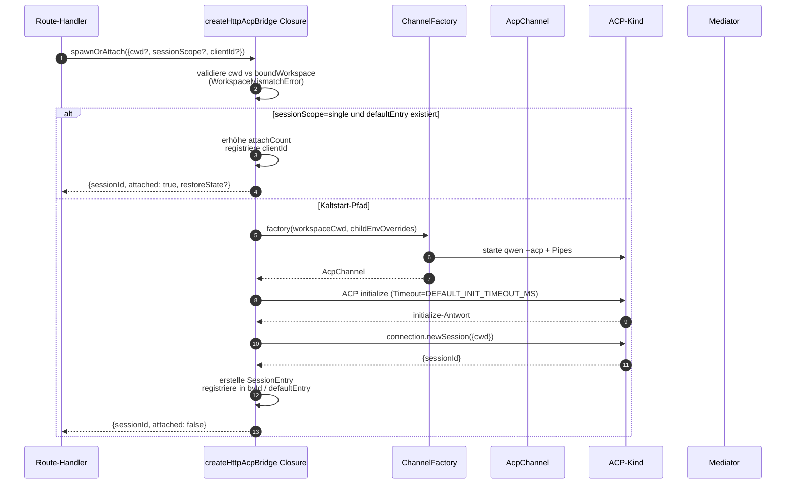
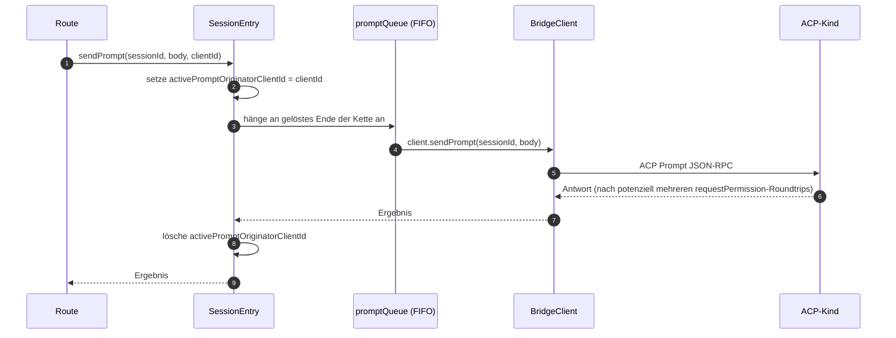
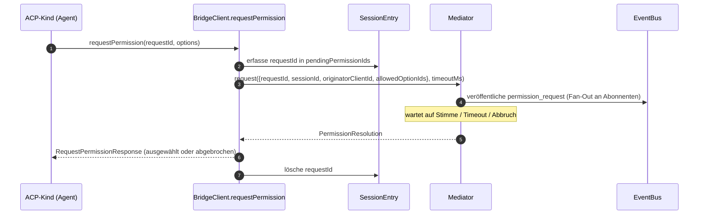
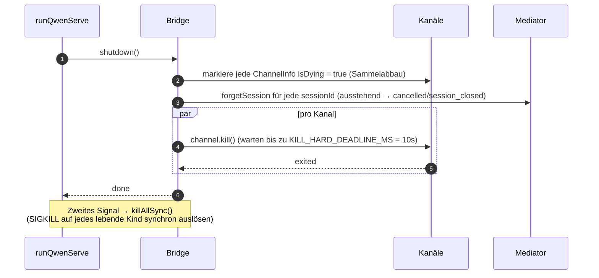

# ACP Bridge

## Übersicht

`packages/acp-bridge/` bildet die Grenze zwischen der HTTP-Schicht des Daemons und dem ACP-Kindprozess. Es wird von `packages/cli/src/serve/` (dem `qwen serve`-Daemon) verwendet und wurde im Rahmen von #4175 F1 Schritt 3 extrahiert, damit zukünftige Konsumenten (`channels/base/AcpBridge.ts`, der VS Code IDE- Companion) denselben Bridge-Kern verwenden können, ohne auf das CLI-Paket zugreifen zu müssen.

Die Bridge stellt eine `HttpAcpBridge`-Instanz, einen `AcpChannel` zum ACP-Kind, multiplexte Sessions über diesen Kanal, pro-Session `EventBus`es, einen `MultiClientPermissionMediator`, einen `BridgeFileSystem`-Adapter und ACP-orientierte Helfer (`spawnOrAttach`, `loadSession`, `resumeSession`, `sendPrompt`, `cancelSession`, `respondToPermission`, sowie extMethod-RPCs für Workspace-Status und MCP-Neustart) bereit.

## Verantwortlichkeiten

- Starten oder Anhängen an den ACP-Kindprozess über eine pluggbare `ChannelFactory`. Standard-Factory: `defaultSpawnChannelFactory` (Subprozess `qwen --acp`). Tests injizieren `inMemoryChannel`.
- Verwaltung von `aliveChannels` (Kanal-Registry) und `byId` (Session-Registry).
- Multiplexen von N HTTP-seitigen Sessions auf einen ACP-Kindprozess via `connection.newSession()`.
- Serialisierung von Prompts pro Session durch `promptQueue` (ACP erlaubt nur einen aktiven Prompt pro Session).
- Pro-Session FIFO für `setSessionModel`-Aufrufe, sodass gleichzeitige Attachments mit verschiedenen Modellen den Agenten nicht in Konflikt bringen.
- Pro-Session `EventBus`, der `GET /session/:id/events` speist (siehe [`10-event-bus.md`](./10-event-bus.md)).
- Berechtigungsablauf: `BridgeClient.requestPermission` → `MultiClientPermissionMediator.request` → Fan-Out → Stimmen sammeln → ACP-Antwort (siehe [`04-permission-mediation.md`](./04-permission-mediation.md)).
- Datei-I/O: `BridgeFileSystem`-Adapter für ACP `readTextFile` / `writeTextFile`-Aufrufe (siehe [`07-workspace-filesystem.md`](./07-workspace-filesystem.md)).
- extMethod-RPCs für Workspace-Status (`/workspace/mcp`, `/workspace/skills`, `/workspace/providers`) und MCP-Neustart.
- Lebenszyklus: Graceful `shutdown()` mit `KILL_HARD_DEADLINE_MS` (10s) pro Kanal; synchrones `killAllSync()` für den sofortigen Zwangsstopp bei zweitem Signal.

## Architektur

**Öffentlicher Einstiegspunkt**: `createHttpAcpBridge(opts: BridgeOptions): HttpAcpBridge` in `packages/acp-bridge/src/bridge.ts`.

**Wichtige Typen**:

| Typ                             | Datei                    | Rolle                                                                                                                                                                                                                         |
| ------------------------------- | ------------------------ | ----------------------------------------------------------------------------------------------------------------------------------------------------------------------------------------------------------------------------- |
| `HttpAcpBridge`                 | `bridgeTypes.ts`         | Öffentliches Interface: `spawnOrAttach`, `loadSession`, `resumeSession`, `sendPrompt`, `cancelSession`, `subscribeEvents`, `respondToPermission`, `getWorkspaceMcpStatus`, `restartMcpServer`, `shutdown`, `killAllSync`, …    |
| `BridgeSession`                 | `bridgeTypes.ts`         | `{ sessionId, workspaceCwd, attached, clientId?, createdAt? }` zurückgegeben an HTTP-Handler.                                                                                                                                |
| `BridgeOptions`                 | `bridgeOptions.ts`       | Konfiguration zur Erstellungszeit (siehe [Konfiguration](#configuration)).                                                                                                                                                    |
| `AcpChannel`                    | `channel.ts`             | `{ stream, kill(), killSync(), exited }` — ein ACP-NDJSON-Kanal.                                                                                                                                                             |
| `ChannelFactory`                | `channel.ts`             | `(workspaceCwd, childEnvOverrides?) => Promise<AcpChannel>`.                                                                                                                                                                 |
| `BridgeClient`                  | `bridgeClient.ts`        | Kapselt eine ACP `ClientSideConnection`; implementiert ACP `Client` (`requestPermission`, `readTextFile`, `writeTextFile`, `sessionUpdate`, `extNotification`).                                                              |
| `EventBus`                      | `eventBus.ts`            | In-Memory Pub/Sub pro Session. Siehe [`10-event-bus.md`](./10-event-bus.md).                                                                                                                                                 |
| `MultiClientPermissionMediator` | `permissionMediator.ts`  | Vier-Policy-Vermittler. Siehe [`04-permission-mediation.md`](./04-permission-mediation.md).                                                                                                                                   |

**Interner Zustand (von `createHttpAcpBridge` geschlossen)**:

| Zustand         | Form                             | Zweck                                                                                                                                                                                                                                                                                                                                                       |
| --------------- | -------------------------------- | ----------------------------------------------------------------------------------------------------------------------------------------------------------------------------------------------------------------------------------------------------------------------------------------------------------------------------------------------------------- |
| `aliveChannels` | `Map<string, ChannelInfo>`       | Kanal-Registry, indiziert nach Kanal-ID. Jede `ChannelInfo` enthält `channel`, `connection`, `client` (ein `BridgeClient` pro Kanal), `sessionIds: Set<string>`, `pendingRestoreIds`, `statusClosedReject?`, `isDying: boolean`.                                                                                                                            |
| `byId`          | `Map<string, SessionEntry>`      | Session-Registry, indiziert nach sessionId. Jede `SessionEntry` enthält `channel`, `connection`, `events: EventBus`, `promptQueue: Promise<void>`, `modelChangeQueue: Promise<void>`, `pendingPermissionIds: Set<string>`, `clientIds: Map<string, count>`, `activePromptOriginatorClientId?`, `attachCount`, `spawnOwnerWantedKill`, `restoreState?`, `sessionLastSeenAt?`, `clientLastSeenAt: Map<string, ms>`. |
| `defaultEntry`  | `SessionEntry \| null`           | Die "Single"-Session, die verwendet wird, wenn `sessionScope: 'single'`.                                                                                                                                                                                                                                                                                   |
| `defaultPolicy` | `PermissionPolicy`               | Konfiguriert über `BridgeOptions.permissionPolicy`.                                                                                                                                                                                                                                                                                                         |
| `mediator`      | `MultiClientPermissionMediator`  | Einer pro Bridge-Instanz.                                                                                                                                                                                                                                                                                                                                   |
| Konstanten      | —                                | `DEFAULT_INIT_TIMEOUT_MS = 10_000`, `MCP_RESTART_TIMEOUT_MS = 300_000`, `DEFAULT_MAX_SESSIONS = 20`, `MAX_EVENT_RING_SIZE = 1_000_000`, `DEFAULT_PERMISSION_TIMEOUT_MS = 5min`, `DEFAULT_MAX_PENDING_PER_SESSION = 64`.                                                                                                                                    |

**`isDying`-Invariante**: Jeder Teardown-Pfad muss `ChannelInfo.isDying = true` synchron **vor** dem Erwarten von `channel.kill()` setzen. `ensureChannel` behandelt einen sterbenden Kanal als nicht vorhanden und startet einen neuen. Ohne dieses Flag würde ein gleichzeitiger `spawnOrAttach`, der während des SIGTERM-Gnadenfensters (bis zu 10s) eintrifft, an einen Transport anhängen, der gerade geschlossen wird, und die sessionId des Aufrufers würde bei allen Folgeschritten mit einem 404 quittiert. **Setzorte** (müssen synchron gehalten werden): `ensureChannel` (Initialisierungsfehler + Late-Shutdown-Nachprüfung), `doSpawn` (newSession-Fehler auf leerem Kanal), `killSession` (letzte Session verlässt), `shutdown` (Sammelabbau).

**`channelInfo`-Retentionsinvariante**: `channelInfo` **nicht** löschen, wenn `isDying = true` gesetzt wird. `killAllSync` muss den Kanal während des SIGTERM-Gnadenfensters noch finden, um bei `process.exit(1)` SIGKILL auszulösen. `aliveChannels` behält den sterbenden Eintrag, bis `channel.exited` feuert.

**BridgeClient-gepufferte Events**: ACP `extNotification`-Frames, die auf einem `BridgeClient` für eine sessionId eintreffen, die noch nicht in `byId` ist (weil die Antwort von `connection.newSession` noch nicht zurückgekehrt ist, aber die MCP-Erkennung innerhalb von `newSession` bereits Budget-Events gefeuert hat), werden in eine Early-Event-Warteschlange gepuffert, die durch `MAX_EARLY_EVENT_SESSIONS = 64` × `MAX_EARLY_EVENTS_PER_SESSION = 32` × `EARLY_EVENT_TTL_MS = 60_000` begrenzt ist. Der schlimmste Fall liegt bei etwa 400 KB Heap. Ohne Pufferung würde der erste SSE-Replay-Ring-Platz für eine neue Session Events vermissen, die während ihrer Erstellung gefeuert wurden.

## Arbeitsablauf

### `spawnOrAttach` (primärer Einstiegspunkt)

Wichtige Punkte:

- `sessionScope='single'` mit einem existierenden `defaultEntry` erhöht nur
  `attachCount`, registriert `clientId` und gibt `attached: true` zurück.
- Der Kaltstart-Pfad führt die ChannelFactory aus, führt ACP `initialize`
  (`DEFAULT_INIT_TIMEOUT_MS=10s`) durch, ruft `connection.newSession({cwd})` auf und
  registriert dann den neuen `SessionEntry`.
- `SessionLimitExceededError` wird ausgelöst, wenn `byId.size >= maxSessions`.
- `InvalidClientIdError` wird ausgelöst, wenn `X-Qwen-Client-Id` außerhalb von
  `[A-Za-z0-9._:-]{1,128}` liegt.
- Der Disconnect-Reaper in `server.ts` verfolgt den Spawn-Besitzer über
  `attachCount`/`spawnOwnerWantedKill`, um zu vermeiden, dass eine Session abgerissen wird, deren
  Spawn-Besitzer die Verbindung getrennt hat, andere Clients aber bereits verbunden sind (Review #3889
  BQ9tV).

### Prompt-Serialisierung

Fehler am Ende der Warteschlange werden **geschluckt**, sodass die Ablehnung eines vorherigen Prompts nachfolgende Prompts nicht vergiftet; der ursprüngliche Aufrufer erhält die Ablehnung dennoch auf seinem eigenen zurückgegebenen Promise. Der `transportClosedReject`, der auf der Session zwischengespeichert ist, konkurriert das Prompt-Promise gegen `channel.exited`, sodass ein abgestürzter Kindprozess sofort sichtbar wird, anstatt zu hängen.

### Berechtigungsablauf (High-Level)

`InvalidPermissionOptionError` wird vor dem Mediator ausgelöst, wenn eine Wire-Stimme versucht, `CANCEL_VOTE_SENTINEL` über das normale `optionId`-Feld zu injizieren — der Sentinel ist der einzige Ausweg der Bridge, um eine Anfrage als `cancelled / agent_cancelled` kurz zu schließen, und darf nicht versehentlich von der Leitung erreichbar sein. Siehe [`04-permission-mediation.md`](./04-permission-mediation.md).

### Herunterfahren

## Kanalfactory

`AcpChannel` (`channel.ts`) ist die Transportabstraktion der Bridge. Die Produktion verwendet `defaultSpawnChannelFactory` in `spawnChannel.ts`, die `qwen --acp` als Subprozess mit einem stdio-Pipe-Paar ausführt. Tests injizieren `inMemoryChannel`, um den Agenten prozessintern auszuführen. Die Bridge weiß nichts über den zugrunde liegenden Mechanismus — sie benötigt nur `{ stream, kill, killSync, exited }`.

`ChannelFactory` akzeptiert `childEnvOverrides`, sodass jeder Daemon-Handle seine eigenen MCP-Budget-Env-Vars (`QWEN_SERVE_MCP_CLIENT_BUDGET`, `QWEN_SERVE_MCP_BUDGET_MODE`) übergeben kann, ohne `process.env` zu mutieren (was zu Wettlaufsituationen führen würde, wenn zwei eingebettete Daemons im selben Node-Prozess laufen).

## Zustand & Lebenszyklus

- Die Bridge-Erstellung ist synchron; der erste `spawnOrAttach` startet den ACP-Kindprozess kalt.
- `defaultEntry` lebt für die Lebensdauer der Bridge unter `sessionScope: 'single'`; der Kanal wird abgeräumt, wenn `sessionIds.size === 0` (nach `killSession`) UND `isDying` auf true gesetzt ist.
- `MAX_EVENT_RING_SIZE = 1_000_000` ist eine weiche Obergrenze für `BridgeOptions.eventRingSize`, um Tippfehler des Operators abzufangen, bevor es zu ~500 MB Out-of-Memory pro Session kommt.
- `DEFAULT_PERMISSION_TIMEOUT_MS = 5 * 60 * 1000` verhindert, dass eine festgefahrene Berechtigungsanforderung die pro-Session `promptQueue` für immer blockiert.
- `DEFAULT_MAX_PENDING_PER_SESSION = 64` spiegelt `DEFAULT_MAX_SUBSCRIBERS` wider; überzählige `requestPermission`-Aufrufe werden mit einer Warnung auf stderr als abgebrochen aufgelöst.

## Abhängigkeiten

| Upstream                                                                                      | Downstream                                          |
| --------------------------------------------------------------------------------------------- | --------------------------------------------------- |
| `@agentclientprotocol/sdk` — `ClientSideConnection`, `PROTOCOL_VERSION`, ACP-Typen            | `packages/cli/src/serve/` (der Daemon)              |
| `@qwen-code/qwen-code-core` — `ApprovalMode`, `TrustGateError`, `getCurrentGeminiMdFilename`  | `packages/channels/base/` (geplant, F4)             |
| `node:crypto`, `node:fs`, `node:path`                                                         | `packages/vscode-ide-companion/` (geplant, F4)      |

## Konfiguration

`BridgeOptions` (`bridgeOptions.ts`):

| Schlüssel                                  | Standard                                            | Zweck                                                                                                                  |
| ------------------------------------------ | --------------------------------------------------- | ---------------------------------------------------------------------------------------------------------------------- |
| `boundWorkspace`                           | (erforderlich)                                      | Kanonischer Workspace-Pfad, den die Bridge durchsetzt.                                                                |
| `sessionScope`                             | `'single'`                                          | `'single'` teilt eine Session zwischen allen Clients; `'thread'` erstellt eine separate Session für jeden Gesprächsthread. |
| `channelFactory`                           | `defaultSpawnChannelFactory`                        | Pluggbare ACP-Kind-Factory.                                                                                            |
| `initializeTimeoutMs`                      | `DEFAULT_INIT_TIMEOUT_MS = 10_000`                  | ACP `initialize`-Handshake-Timeout.                                                                                    |
| `maxSessions`                              | `DEFAULT_MAX_SESSIONS = 20`                         | Obergrenze für `byId.size`. `0` / `Infinity` = unbegrenzt; NaN/negativ löst Fehler aus.                                |
| `eventRingSize`                            | `DEFAULT_RING_SIZE` (aus `eventBus.ts`)             | Pro-Session-Event-Ring; weich begrenzt auf `MAX_EVENT_RING_SIZE`.                                                      |
| `permissionResponseTimeoutMs`              | `DEFAULT_PERMISSION_TIMEOUT_MS = 5 min`             | Pro-Anfrage-Echtzeit für den Mediator.                                                                                 |
| `maxPendingPermissionsPerSession`          | `DEFAULT_MAX_PENDING_PER_SESSION = 64`              | Backpressure für hochvolumige Agenten.                                                                                 |
| `childEnvOverrides`                        | `{}`                                                | Pro-Handle-Env-Ergänzungen/Entfernungen für den ACP-Kindprozess.                                                       |
| `persistApprovalMode`, `persistDisabledTools` | —                                                 | Settings-Schreib-Hooks für die Wave-4-Mutationsrouten.                                                                 |
| `contextFilename`                          | aus `settings.json`'s `context.fileName`            | Überschreibt `getCurrentGeminiMdFilename`.                                                                             |
| `statusProvider`                           | (keine)                                             | Daemon-Host-Preflight-Zellen (`DaemonStatusProvider`).                                                                 |
| `fileSystem`                               | (keine)                                             | `BridgeFileSystem`-Adapter für ACP `readTextFile` / `writeTextFile`.                                                   |
| `permissionPolicy`                         | aus `settings.json`'s `policy.permissionStrategy`   | Einer von `first-responder` / `designated` / `consensus` / `local-only`.                                               |
| `permissionConsensusQuorum`                | aus `settings.json`                                 | N für Consensus-Policy.                                                                                                |
| `permissionAudit`                          | `createNoOpPermissionAuditPublisher()`              | Verbindung mit `PermissionAuditRing` für den Audit-Trail.                                                              |
| `channelIdleTimeoutMs`                     | `0`                                                 | ACP-Kind für diese Millisekunden nach Schließen der letzten Session am Leben halten.                                    |
## Zusätzliche Bridge-Methoden

Zusätzlich zu den Kernaufrufen `spawnOrAttach`, `sendPrompt`, `cancelSession`,
`respondToPermission`, `loadSession` und `resumeSession` enthält das
Interface `HttpAcpBridge` nun diese Helfer für den Daemon:

| Methode                                                       | Zweck                                          |
| ------------------------------------------------------------ | ---------------------------------------------- |
| `generateSessionRecap(sessionId, context?)`                  | Erzeugt eine einzeilige Sitzungszusammenfassung. |
| `generateSessionBtw(sessionId, question, signal?, context?)` | Beantwortet eine Nebenfrage / einen btw-Prompt. |
| `executeShellCommand(sessionId, command, signal?, context?)` | Führt einen Shell-Befehl auf dem Daemon-Host aus. |
| `getSessionContextUsageStatus(sessionId, opts?)`             | Gibt die Kontextfenster-Auslastung zurück.       |
| `getSessionSupportedCommandsStatus(sessionId)`               | Gibt verfügbare Slash-Befehle zurück.            |
| `getSessionTasksStatus(sessionId)`                           | Gibt eine Momentaufnahme der Hintergrundaufgaben zurück. |
| `getSessionStatsStatus(sessionId)`                           | Gibt Sitzungsnutzungsstatistiken zurück.         |
| `setSessionApprovalMode(sessionId, mode, opts, context?)`    | Aktualisiert den Genehmigungsmodus einer Sitzung. |
| `detachClient(sessionId, clientId?)`                         | Trennt einen Client explizit.                    |
| `addRuntimeMcpServer(name, config, originatorClientId)`      | Fügt einen MCP-Server zur Laufzeit hinzu.        |
| `removeRuntimeMcpServer(name, originatorClientId)`           | Entfernt einen MCP-Server zur Laufzeit.          |
| `manageMcpServer(serverName, action, originatorClientId)`    | Aktivieren / Deaktivieren / Authentifizieren / Authentifizierung löschen. |
| `generateWorkspaceAgent(description, originatorClientId)`    | Erzeugt eine Subagenten-Definition mit KI.       |
| `preheat()`                                                  | Wärmt den ACP-Child vor der ersten Sitzung auf.  |
| `getSessionLastEventId(sessionId)`                           | Liest die monotone Ereignis-ID der Sitzung.      |
| `getWorkspaceToolsStatus()`                                  | Gibt die Momentaufnahme der integrierten Tool-Registry zurück. |
| `getWorkspaceMcpToolsStatus(serverName)`                     | Gibt Tools für einen bestimmten MCP-Server zurück. |

`BridgeSpawnRequest.sessionScope` wurde von `'per-client'` in `'thread'` umbenannt.
`BridgeRestoredSession` enthält nun `compactedReplay`, `liveJournal` und `lastEventId`.
`BridgeClientRequestContext` ist der Anforderungskontext, der durch Bridge-Aufrufe
durchgereicht wird; er enthält `clientId`, `fromLoopback: boolean` und `promptId`.

## Einschränkungen & bekannte Grenzen

- `MCP_RESTART_TIMEOUT_MS = 300_000` (5 Min.) – das Bridge-Timeout für `/workspace/mcp/:server/restart` ist bewusst groß, da `McpClientManager.MAX_DISCOVERY_TIMEOUT_MS` für stdio-Server bis zu 5 Min. betragen kann. Eine kürzere Frist würde zu falschen Timeouts führen, während der ACP-Child im Hintergrund weiterhin eine Wiederverbindung versucht.
- `BridgeOptions.eventRingSize > 1_000_000` wirft beim Erstellen einen Fehler.
- `connection.unstable_resumeSession` wird über die stabile Daemon-Fähigkeit `session_resume` bereitgestellt; `unstable_session_resume` bleibt als veraltetes Kompatibilitätsalias für ältere SDKs gekennzeichnet. Clients sollten auf `session_resume` per Feature-Erkennung prüfen.
- Das Bridge-Paket ist `@qwen-code/acp-bridge` und wird über Re-Export-Shims in `serve/event-bus.ts`, `serve/status.ts`, `serve/httpAcpBridge.ts` für Abwärtskompatibilität mit Import-Pfaden vor F1 konsumiert. Neuer Code sollte direkt importieren.

## Referenzen

- `packages/acp-bridge/src/bridge.ts` (insb. `createHttpAcpBridge` ab Zeile 350+)
- `packages/acp-bridge/src/bridgeClient.ts`
- `packages/acp-bridge/src/bridgeTypes.ts`
- `packages/acp-bridge/src/bridgeOptions.ts`
- `packages/acp-bridge/src/channel.ts`
- `packages/acp-bridge/src/spawnChannel.ts`
- `packages/acp-bridge/src/bridgeErrors.ts`
- Issues: [#3803](https://github.com/QwenLM/qwen-code/issues/3803), [#4175](https://github.com/QwenLM/qwen-code/issues/4175).