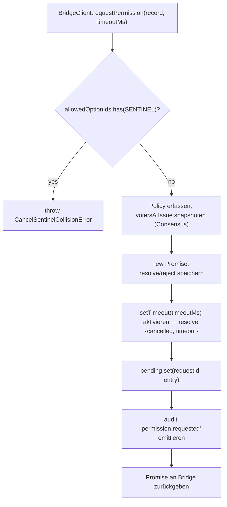
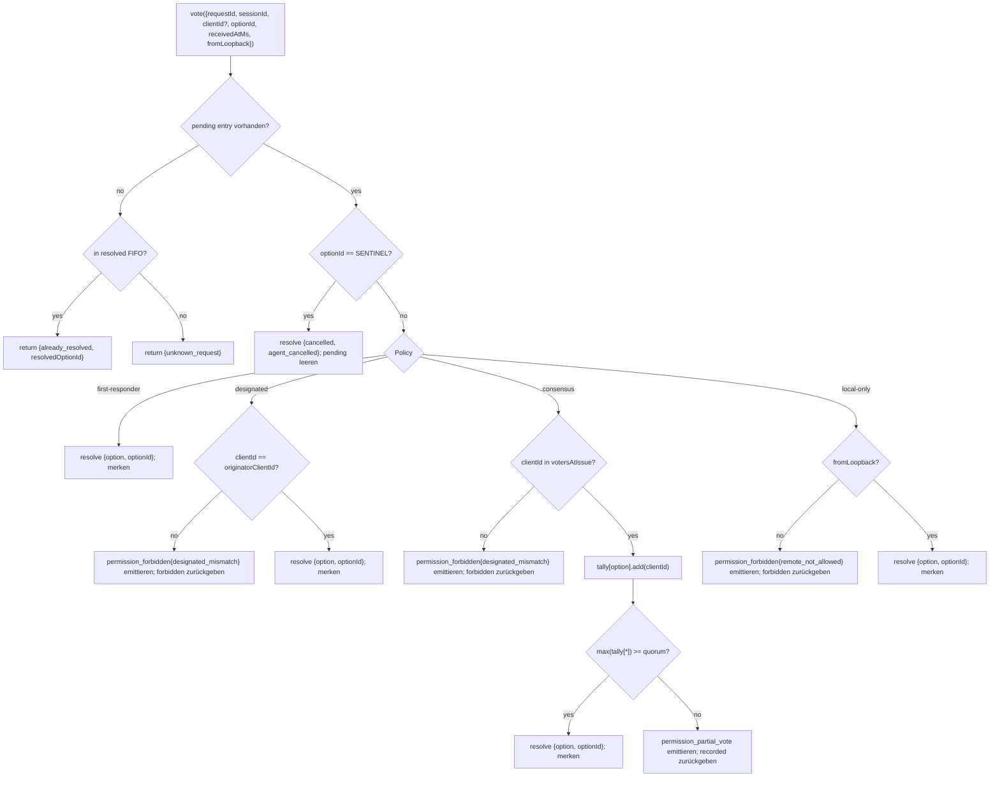

# Multi-Client Permission Mediation

## Overview

Wenn der Agent des ACP-Childs `requestPermission` aufruft, leitet der Daemon ihn nicht einfach an einen einzigen Client weiter. Unter `sessionScope: 'single'` sieht jeder verbundene Client die Anfrage und jeder von ihnen kann darauf antworten. Ohne Mediation haben späte Votes kein Ziel, zwei Clients können sich bei derselben Anfrage ein Rennen liefern, und ein einzelner bösartiger Client kann den Urheber überschreiben.

`MultiClientPermissionMediator` (`packages/acp-bridge/src/permissionMediator.ts`) implementiert den `PermissionMediator`-Vertrag (`packages/acp-bridge/src/permission.ts`) und verwaltet den gesamten ausstehenden und aufgelösten Berechtigungsstatus für die Bridge. Es verteilt Votes über eine von vier in `PermissionPolicy` deklarierten Richtlinien:

| Policy            | Auflösungsregel                                                                                                      | Anwendungsfall                                                           |
| ----------------- | -------------------------------------------------------------------------------------------------------------------- | ------------------------------------------------------------------------ |
| `first-responder` | Erster gültiger Vote gewinnt; spätere Voter erhalten `permission_already_resolved`.                                  | UX für Live-Collaboration über Clients hinweg (Standard).                |
| `designated`      | Nur die `originatorClientId` des Prompts darf auflösen; andere sehen `permission_forbidden{designated_mismatch}`.    | Pro-Mandant SaaS, bei der die UI-Oberfläche ihre eigenen Genehmigungen verwalten muss. |
| `consensus`       | N-von-M-Quorum über den v1-Client-ID-Snapshot hinweg; intermediäre `permission_partial_vote`-Events ermöglichen es UIs, den Fortschritt anzuzeigen. | Enterprise-Change-Review, bei dem sich zwei Operatoren einig sein müssen. |
| `local-only`      | Lehnt jeden Nicht-Loopback-Voter ab; blockiert, bis ein Loopback-Client auflöst.                                     | Workstations, bei denen Fernsteuerung niemals eine Rechteausweitung gewähren darf. |

> **v1-Sicherheitslimit**: Die `X-Qwen-Client-Id` wird selbst angegeben. `designated` und
> `consensus` verfügen noch nicht über einen Proof-of-Possession. Ein Client, der
> `originatorClientId` beobachtet, kann diese ID wiederverwenden. `{outcome:'cancelled'}` wird ebenfalls
> über das Cancel-Sentinel vor dem Policy-Dispatch geleitet, sodass selbst `local-only`
> Cancel nicht als policy-geschützte Auflösung behandeln kann. Für starke Isolierung binde
> den Daemon an Loopback oder platziere ihn hinter einem authentifizierten Reverse Proxy. Siehe
> [Sicherheitshinweis: v1-Client-Identität wird selbst angegeben](#security-note-v1-client-identity-is-self-reported).

## Responsibilities

- Verfolge jede ausstehende Anfrage (Lebenszyklus `request → vote → resolved`).
- Aktiviere und deaktiviere anfragebezogene Wallclock-Timeouts (die **N1-Invariante**: Der Timeout muss synchron innerhalb von `request()` aktiviert werden, damit eine sofort abgebrochene Session kein permanent ausstehendes Closure leaken kann).
- Verteile Votes über die zum Zeitpunkt von `request()` erfasste Policy (eine Änderung der Daemon-Policy während der Ausführung betrifft keine laufenden Anfragen).
- Verwalte eine begrenzte FIFO (`MAX_RESOLVED_PERMISSION_RECORDS = 512`) kürzlich aufgelöster Anfragen, damit doppelte Votes ein strukturiertes `already_resolved` statt `unknown_request` erhalten.
- Emittiere `permission_partial_vote` (Consensus) und `permission_forbidden` (Designated / Consensus / Local-only) auf dem sessionbezogenen EventBus.
- Löse ausstehende Anfragen als `{kind: 'cancelled', reason: 'session_closed'}` über `forgetSession(sessionId)` beim Session-Teardown auf.
- Weise böswillige oder versehentliche Injektion von `CANCEL_VOTE_SENTINEL` über das Wire (`InvalidPermissionOptionError`) und über vom Agenten veröffentlichte Options-Labels (`CancelSentinelCollisionError`) zurück.

## Architecture

### Öffentliche Schnittstelle

```ts
interface PermissionMediator {
  readonly policy: PermissionPolicy;
  request(
    record: PermissionRequestRecord,
    timeoutMs: number,
  ): Promise<PermissionResolution>;
  vote(vote: PermissionVote): PermissionVoteOutcome;
  forgetSession(sessionId: string): void;
}
```

`MultiClientPermissionMediator` fügt hinzu: `peekSessionFor(requestId)`, `pendingCount(sessionId)`, interner Audit-Publisher usw. `BridgeClient` hängt nur von der `request()`-Hälfte ab (strukturelles Sub-Typing – siehe `bridgeClient.ts`).

### `PermissionPolicy` und `PermissionVoteOutcome`

```ts
type PermissionPolicy =
  | 'first-responder'
  | 'designated'
  | 'consensus'
  | 'local-only';

type PermissionVoteOutcome =
  | { kind: 'resolved'; resolvedOptionId: string }
  | { kind: 'recorded'; votesNeeded: number } // consensus partial
  | { kind: 'already_resolved'; resolvedOptionId: string }
  | { kind: 'forbidden'; reason: 'designated_mismatch' | 'remote_not_allowed' }
  | { kind: 'unknown_request' };

type PermissionResolution =
  | { kind: 'option'; optionId: string }
  | {
      kind: 'cancelled';
      reason: 'timeout' | 'session_closed' | 'agent_cancelled';
    };
```

### Cancel-Sentinel

`CANCEL_VOTE_SENTINEL = '__cancelled__'`. Die Bridge mappt den Voter `{outcome:'cancelled'}` **vor** dem Aufruf von `mediator.vote` auf dieses Sentinel. Der Mediator leitet das Sentinel **vor** dem Policy-Dispatch – Voter-Cancel funktioniert unter jeder Policy unabhängig von `clientId` / Loopback / Membership. Zwei Guards:

1. **`bridge.ts`** weist Wire-Votes zurück, deren `optionId === CANCEL_VOTE_SENTINEL` ist, mit `InvalidPermissionOptionError` (ein bösartiger Wire-Client darf kein Cancel durch Lügen über eine `optionId` injizieren können).
2. **`mediator.request`** weist Records zurück, deren `allowedOptionIds` das Sentinel mit `CancelSentinelCollisionError` enthalten (ein Agent, der legitimerweise `'__cancelled__'` als Options-Label veröffentlicht, darf sich nicht maskieren können).

Dieser bewusste Cross-Policy-Escape ist in `permissionMediator.ts` dokumentiert, damit ein zukünftiger Maintainer den Bypass nicht versehentlich entfernt.

### Pending State

Jede ausstehende Anfrage ist über `requestId` indiziert und enthält:

- `policy` – zum Zeitpunkt von `request()` erfasst.
- `record: PermissionRequestRecord` (requestId, sessionId, originatorClientId, allowedOptionIds, issuedAtMs).
- `resolve`- / `reject`-Closures.
- `votesAtIssue` (nur Consensus) – Snapshot der registrierten `clientIds` für die Session zum Ausstellungszeitpunkt; spätere Votes werden abgelehnt, wenn sie nicht in dieser Menge enthalten sind.
- `tally` (nur Consensus) – `Map<optionId, Set<clientId>>` zur Zählung der Votes pro Option.
- `timeoutHandle` – Node-Timeout, aktiviert innerhalb von `request()` (N1-Invariante).
- `auditTrail[]` – Audit-Records pro Vote.

### Resolved FIFO

`MAX_RESOLVED_PERMISSION_RECORDS = 512`. Die Eviction erfolgt FIFO über `resolvedOrder.shift()` (DeepSeek Review #4335 / 3271627446 – spiegelt `PermissionAuditRing` wider). Speichert nur `{requestId, sessionId, outcome}`, sodass 512 Records über normale UI-Reconnect-/Race-Windows hinweg unter 100 KB bleiben.

## Workflow

### `request()` (N1-Invariante)



Der Timer wird aktiviert, **bevor** der Eintrag überhaupt woanders sichtbar ist. Ohne dies würde ein `forgetSession`, das zwischen `pending.set` und `setTimeout` eintrifft, den Eintrag ohne Timeout ausstehend lassen – die sessionbezogene `promptQueue` der Bridge würde für immer hängen.

### `vote()`-Dispatch



### `forgetSession()`

Wird bei Session-Schließung, Eviction und Bridge-Shutdown aufgerufen. Für jeden ausstehenden Eintrag, dessen `record.sessionId === sessionId` ist:

1. Timeout abbrechen.
2. Das ausstehende Promise mit `{kind: 'cancelled', reason: 'session_closed'}` auflösen.
3. Einen Audit-Record anhängen.
4. Aus `pending` entfernen.

Der Session-Teardown-Pfad der Bridge ruft `forgetSession` immer **vor** dem Channel-Kill-Window auf, damit ausstehende Permissions ihre Session nicht überleben.

## State & Lifecycle

- `policy` wird pro Anfrage erfasst. Eine Änderung der daemon-weiten Policy (zukünftige Schnittstelle) betrifft keine laufenden Anfragen.
- `votesAtIssue` (Consensus) wird zum Zeitpunkt von `request()` erfasst; Clients, die nach der Anfrage eintreffen, können voten, aber wenn ihre `clientId` zum Ausstellungszeitpunkt noch nicht bei der Session registriert war, wird ihr Vote als `designated_mismatch` abgelehnt. Dies nutzt absichtlich den Mismatch-Grund der `designated`-Policy, um den Vertrag geschlossen zu halten; zukünftige Versionen könnten die Union aufteilen, wenn SDK-Consumer unterscheiden müssen.
- Aufgelöste Einträge leben maximal `MAX_RESOLVED_PERMISSION_RECORDS` (512) lang in der FIFO. Nach der Eviction gibt ein doppelter Vote auf dieselbe `requestId` `{unknown_request}` zurück.
- `permission_partial_vote` feuert nur für `consensus`. Verlasse dich unter keiner anderen Policy darauf.
- `permission_forbidden` feuert für `designated`, `consensus` und `local-only` – nicht für `first-responder`.

## Dependencies

- [`03-acp-bridge.md`](./03-acp-bridge.md) – wie die Bridge `BridgeClient.requestPermission` mit `mediator.request` verdrahtet.
- [`10-event-bus.md`](./10-event-bus.md) – wie Partial-Vote- und Forbidden-Frames Clients erreichen.
- [`09-event-schema.md`](./09-event-schema.md) – Payload-Verträge für `permission_*`-Events.
- [`08-session-lifecycle.md`](./08-session-lifecycle.md) – `forgetSession()` wird bei jeder Session-Beendigung aufgerufen.
- [`02-serve-runtime.md`](./02-serve-runtime.md) – `PermissionAuditRing` (512-Einträge-FIFO von Audit-Records).

## Configuration

| Quelle            | Parameter                                                                                              | Effekt                                |
| ----------------- | ------------------------------------------------------------------------------------------------------ | ------------------------------------- |
| `settings.json`     | `policy.permissionStrategy`                                                                            | Aktive Mediator-Policy.               |
| `settings.json`     | `policy.consensusQuorum`                                                                               | N für Consensus.                      |
| `BridgeOptions`     | `permissionPolicy`, `permissionConsensusQuorum`, `permissionAudit`                                     | Programmatisches Override.            |
| Capability-Tag      | `permission_mediation` (immer; `modes: ['first-responder', 'designated', 'consensus', 'local-only']`) | Build-unterstützte Menge.             |
| Capability-Envelope | `policy.permission`                                                                                    | Aktive Policy, unter der dieser Daemon läuft. |

Wenn `policy.permissionStrategy` nicht explizit konfiguriert ist, verwendet der Daemon `first-responder`. `designated`, `consensus` und `local-only` treten nur in Kraft, wenn sie in `settings.json` gesetzt sind.

## Consensus-Quorum: Standardformel und der M=2-Sonderfall

Wenn die `consensus`-Policy aktiv ist und `policy.consensusQuorum` nicht gesetzt ist, berechnet der Mediator **N = floor(M/2) + 1** über `consensusQuorumFor` in `permissionMediator.ts`:

```ts
Math.max(1, Math.floor(m / 2) + 1);
```

| M (`votersAtIssue.size`) | Standard-N | Verhalten                       |
| ------------------------ | ---------- | ------------------------------- |
| 1                        | 1          | Ein Voter löst sofort auf.      |
| 2                        | 2          | Erfordert einstimmige Zustimmung. |
| 3                        | 2          | Mehrheit.                       |
| 4                        | 3          | Mehr als die Hälfte.            |
| 5                        | 3          | Mehrheit.                       |
| 6                        | 4          | Mehr als die Hälfte.            |

Für **M = 2** können Split-Votes (A wählt X, B wählt Y) nur durch den anfragebezogenen Permission-Timeout aufgelöst werden: Keine Option erreicht Einstimmigkeit, daher wartet die Anfrage bis `permissionResponseTimeoutMs` (Standard 5 Min.) und löst sich als `{cancelled, timeout}` auf. Der Vote-Advance-Pfad loggt dieses Verhalten „Einstimmigkeit bedeutet, dass Split-Votes ein Timeout haben“ auf stderr für Operatoren.

Operatoren, die für M = 2 ein First-Vote-Wins-Verhalten wünschen, können explizit `policy.consensusQuorum: 1` setzen. Strengere Konfigurationen, wie das Erfordernis von Einstimmigkeit für M = 4, verwenden dasselbe Feld.

## Policy-Validierung zur Boot-Zeit

`runQwenServe.validatePolicyConfig(policyConfig)` (`packages/cli/src/serve/run-qwen-serve.ts`) validiert das zusammengeführte `policy.*` aus `settings.json` beim Boot und wirft `InvalidPolicyConfigError` bei Operator-Fehlern:

- `policy.permissionStrategy` ist gesetzt, aber nicht in den vier unterstützten Modi. Die gültige Menge wird zur Laufzeit aus `SERVE_CAPABILITY_REGISTRY.permission_mediation.modes` abgeleitet, der Single Source of Truth für die Capability-Ankündigung.
- `policy.consensusQuorum` ist gesetzt, aber keine positive Ganzzahl.

Es gibt zudem eine weiche stderr-Warnung, wenn `consensusQuorum` gesetzt ist, während `permissionStrategy !== 'consensus'` gilt; andernfalls würde das Override unter Non-Consensus-Policies stillschweigend ignoriert.

`InvalidPolicyConfigError` wird für `instanceof`-Tests exportiert. `runQwenServe` nutzt es, um Operator-Fehlkonfigurationen, die als expliziter Boot-Fehler erneut geworfen werden, von I/O-Fehlern beim Lesen der Einstellungen zu unterscheiden, die auf Standardwerte zurückfallen.

## Sicherheitshinweis: v1-Client-Identität wird selbst angegeben

Die `X-Qwen-Client-Id` wird vom HTTP-Client bereitgestellt. In v1 validiert der Daemon das Format (`[A-Za-z0-9._:-]{1,128}`) und verfolgt angehängte Client-IDs in `clientIds`, führt aber keinen Proof-of-Possession durch. Jeder Client, der `originatorClientId` in SSE beobachten kann, kann sich mit derselben ID registrieren und diesen Urheber in späteren Anfragen imitieren.

Policy-Auswirkungen:

- **`first-responder`** ist nicht betroffen, da es nicht von der Identität abhängt.
- **`designated`** kann von einem Remote-Client gespooft werden, der `originatorClientId` wiederverwendet.
- **`consensus`** prüft gegen den `votersAtIssue`-Snapshot zum Ausstellungszeitpunkt; wenn eine gespoofte ID zum Zeitpunkt der Anfrage bereits angehängt ist, kann sie voten.
- **`local-only`** ist immun gegen ID-Spoofing, da `fromLoopback: boolean` vom Daemon aus der Remote-Adresse der Verbindung gestempelt und nicht vom Client bereitgestellt wird.

Ein zukünftiger Pair-Token-Mechanismus wird ein sessionbezogenes Secret aus `POST /session` ausgeben und es für `designated`- / `consensus`-Votes erfordern. Dieser Mechanismus existiert in v1 nicht.

## Verbindungsübergreifendes Vote-Routing

### Vote-Zustellungspfade

Permission-Votes können den Bridge-Mediator über zwei unabhängige Transportpfade erreichen:

1. **ACP-Transport (Same-Connection-Antwort)**: Das `permission_request`-Bridge-Event wird als `session/request_permission`-JSON-RPC-Request an den sessionbezogenen SSE/WS-Stream der besitzenden Verbindung geliefert. Der Client antwortet mit einer JSON-RPC-Response auf derselben Verbindung. Die `resolveClientResponse` des Dispatchers mappt die verbindungslokale JSON-RPC-ID zurück auf die `requestId` der Bridge und ruft `bridge.respondToSessionPermission` auf.

2. **REST-API (verbindungsübergreifend)**: Jeder HTTP-Client – einschließlich Clients auf einer anderen ACP-Verbindung oder ganz ohne ACP-Verbindung – kann über `POST /session/:id/permission/:requestId` voten. Die Legacy-Route `POST /permission/:requestId` (keine Session in der URL) verwendet `peekSessionFor(requestId)`, um die Session aufzulösen, bevor sie an denselben `respondToSessionPermission`-Pfad delegiert.

### Verbindungslokale Permission-Request-IDs

Der ACP-Transport verwendet ein zweistufiges ID-Schema, um zwischen Wire und Bridge zu mappen:

| Layer               | ID-Format                                            | Scope            | Zweck                                                                                         |
| ------------------- | ---------------------------------------------------- | ---------------- | --------------------------------------------------------------------------------------------- |
| JSON-RPC-Message-ID | `_qwen_perm_N` (String, monoton pro Verbindung)      | Verbindungslokal | Korreliert das JSON-RPC-Request→Response-Paar auf dem Session-Stream.                         |
| Bridge-Request-ID   | Opaque Zeichenfolge (UUID generiert vom Agent/Mediator) | Daemon-global    | Identifiziert die Permission-Anfrage über alle Routen und die pending/resolved-Maps des Mediators hinweg. |

Die Bridge-Request-ID wird durch die `_meta`-Vendor-Extension gereicht, damit der Client sie beim Voten über den REST-Pfad einschließen kann:

```json
{
  "method": "session/request_permission",
  "id": "_qwen_perm_3",
  "params": {
    "sessionId": "<session-id>",
    "toolCall": { "name": "shell" },
    "options": [{ "optionId": "allow", "name": "Allow" }],
    "_meta": { "qwen": { "requestId": "<bridge-request-id>" } }
  }
}
```

Die Verbindung speichert das Mapping in `conn.pending: Map<jsonRpcId, PendingClientRequest>`, wobei `PendingClientRequest.bridgeRequestId` die ID auf Bridge-Ebene ist.

### Vote-Autorisierungsregeln

`respondToSessionPermission(sessionId, requestId, response, context)` wendet die folgenden Prüfungen **der Reihe nach** an:

1. **Session-Existenz** – die über `sessionId` adressierte Session muss live sein (`byId.has(sessionId)`). Andernfalls `SessionNotFoundError`.

2. **Cross-Session-Ablehnung** – `peekSessionFor(requestId)` löst die Session auf, zu der die Anfrage tatsächlich gehört. Wenn sie zu einer _anderen_ Session gehört, wird der Vote abgelehnt (gibt `false` / 404 zurück), ohne Session-Mitgliedschaftsinformationen preiszugeben.

3. **Unknown-Request-Guard** – wenn `peekSessionFor` `undefined` zurückgibt (Anfrage hat Timeout, LRU-evictet oder existierte nie), wird der Vote **vor** jeder `clientId`-Validierung abgelehnt (gibt `false` / 404 zurück). Dies verhindert einen Oracle-Angriff: Ohne dies könnte ein Probe-Request mit einer fabrizierten `clientId` zwischen „Session hat diesen Client“ (besteht Validierung → 404) und „Client unbekannt“ (`InvalidClientIdError` → 400) unterscheiden.

4. **Client-Identitätsvalidierung** – `resolveTrustedClientId(entry, context?.clientId)` verifiziert, dass die bereitgestellte `X-Qwen-Client-Id` (REST) oder die von der Bridge gestempelte `clientId` (ACP) in der `clientIds`-Map der Session registriert ist. Anonyme Votes (`clientId === undefined`) werden durchgelassen – der Policy-Dispatch verarbeitet sie. Nicht registrierte IDs werfen `InvalidClientIdError` (durch Route-Handler auf 400 gemappt).

5. **Cancel-Sentinel-Erzwingung** – ein Wire-Vote von `{ outcome: "selected", optionId: "__cancelled__" }` wird mit `InvalidPermissionOptionError` abgelehnt, um Sentinel-Injektion zu verhindern.

6. **Mediator-`vote()`-Dispatch** – der validierte Vote wird an `permissionMediator.vote(...)` weitergeleitet, was die aktive Policy anwendet (siehe [Workflow → `vote()`-Dispatch](#vote-dispatch)).
### Loopback-Auswertung

Das `fromLoopback`-Bit wird **pro Anfrage** ausgewertet, nicht pro Verbindung:

- **ACP-Transport**: `reqLoopback` wird auf der HTTP-Ebene aus der `req.socket.remoteAddress` auf Kernel-Ebene der POST-Anfrage gesetzt und an `dispatcher.handle(conn, msg, sessionHeader, isLoopbackReq(req))` übergeben. Das bedeutet, dass eine POST-Anfrage für ein Permission-Vote, die von einem anderen Peer als die `initialize`-Anfrage eingeht, eine eigene Loopback-Prüfung durchläuft.
- **REST-API**: `detectFromLoopback(req)` wertet dieselbe Remote-Adresse auf Socket-Ebene aus.

Keiner dieser Pfade leitet den Loopback-Status von fälschbaren Headern (`X-Forwarded-For`, `Forwarded` usw.) ab.

### Antwortformat für ACP-Transport-Votes

Ein Client antwortet auf `session/request_permission` mit einer Standard-JSON-RPC-Antwort:

**Akzeptieren (eine Option auswählen)**:

```json
{
  "jsonrpc": "2.0",
  "id": "_qwen_perm_3",
  "result": {
    "outcome": { "outcome": "selected", "optionId": "allow" }
  }
}
```

**Abbrechen**:

```json
{
  "jsonrpc": "2.0",
  "id": "_qwen_perm_3",
  "result": {
    "outcome": { "outcome": "cancelled" }
  }
}
```

**Fehlerantwort** (vom Dispatcher auf "Abbrechen" gemappt):

```json
{
  "jsonrpc": "2.0",
  "id": "_qwen_perm_3",
  "error": { "code": -32000, "message": "user declined" }
}
```

### Fehlerbehandlung in `resolveClientResponse`

Wenn `bridge.respondToSessionPermission` einen Fehler wirft (z. B. bei einem fehlerhaften Vote-Body), greift der Dispatcher auf ein explizites Abbrechen (`cancelAbandonedPermission`) zurück, damit der Mediator niemals dauerhaft blockiert bleibt. Wenn sowohl das Vote als auch das Abbrechen einen Fehler werfen (Doppelfehler), wird der `pending`-Eintrag **beibehalten**, damit das spätere Teardown der Verbindung (`abandonPendingForSession`) es erneut versuchen kann.

## Einschränkungen & bekannte Limits

- **Cancel-Sentinel-Routen VOR dem Policy-Dispatch** sind konstruktionsbedingt so ausgelegt – ein `local-only`-Daemon und ein `consensus`-Daemon können beide von jedem Voter abgebrochen werden, der `{outcome: 'cancelled'}` sendet. Dies ist in `permissionMediator.ts` dokumentiert und stellt den Abbruchpfad auf Agentenseite dar.
- **`designated` und `consensus` überladen `designated_mismatch`** in `PermissionVoteOutcome`. Der Mediator gibt separate Audit-Datensätze aus, aber das Übertragungsformat ist einheitlich. Zukünftige Protokollversionen könnten die Union aufteilen.
- **Anonyme Voter (keine `X-Qwen-Client-Id`)** werden nur unter `first-responder` und `local-only` (Loopback) akzeptiert; `designated` und `consensus` lehnen sie ab.
- **Cross-Policy-Escape-Hatch** bedeutet, dass Abbrüche nicht durch Policies gefiltert werden können. Wenn ein Deployment policy-gefilterte Abbrüche benötigt, erfordert dies eine zukünftige Änderung des API-Vertrags – versuche nicht, dies durch Prüfungen auf Routen-Ebene zu kaschieren.
- **`votesAtIssue`-Snapshot-Semantik** bedeutet, dass bei einem Consensus-Deployment mit einem fluktuierenden Client-Bestand legitime Clients abgelehnt werden können, weil sie sich nach dem Absenden der Anfrage verbunden haben. Operatoren sollten Collaborator-Client-IDs vorregistrieren, bevor sie Change-Review-Prompts ausgeben.

## Referenzen

- `packages/acp-bridge/src/permission.ts` (festgeschriebener Contract)
- `packages/acp-bridge/src/permissionMediator.ts` (F3-Mediator-Implementierung)
- `packages/acp-bridge/src/bridgeClient.ts` (verwendet strukturelles Sub-Typing für `PermissionMediator`)
- `packages/acp-bridge/src/bridge.ts` (`respondToSessionPermission` — Vote-Routing und Autorisierung)
- `packages/acp-bridge/src/bridgeErrors.ts` (`CancelSentinelCollisionError`, `InvalidPermissionOptionError`, `PermissionForbiddenError`, `InvalidClientIdError`)
- `packages/cli/src/serve/acp-http/dispatch.ts` (`resolveClientResponse` — ACP-Transport-Vote-Pfad)
- `packages/cli/src/serve/acp-http/connection-registry.ts` (`AcpConnection.pending` — verbindungsspezifisches Request-Mapping)
- `packages/cli/src/serve/routes/permission.ts` (REST-Vote-Routen)
- `packages/cli/src/serve/permission-audit.ts` (Audit-Ring + Publisher)
- Issue: [#4175](https://github.com/QwenLM/qwen-code/issues/4175) F3-Serie.