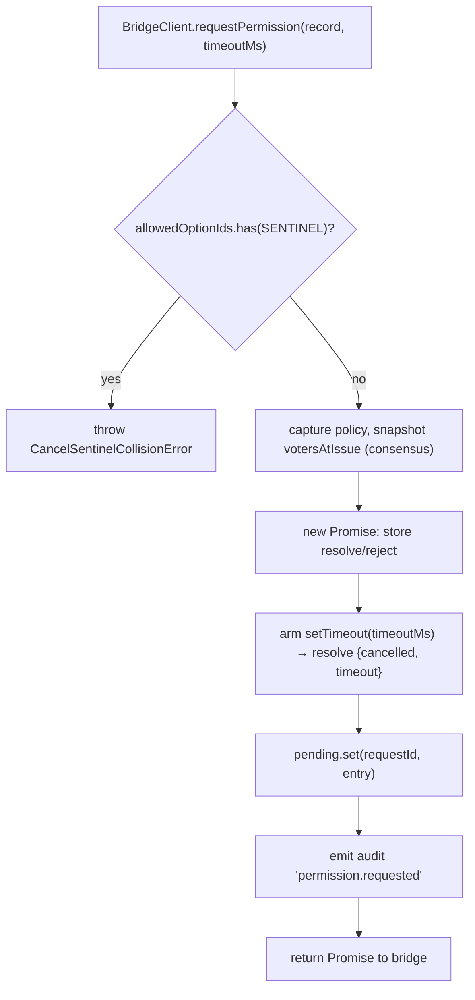
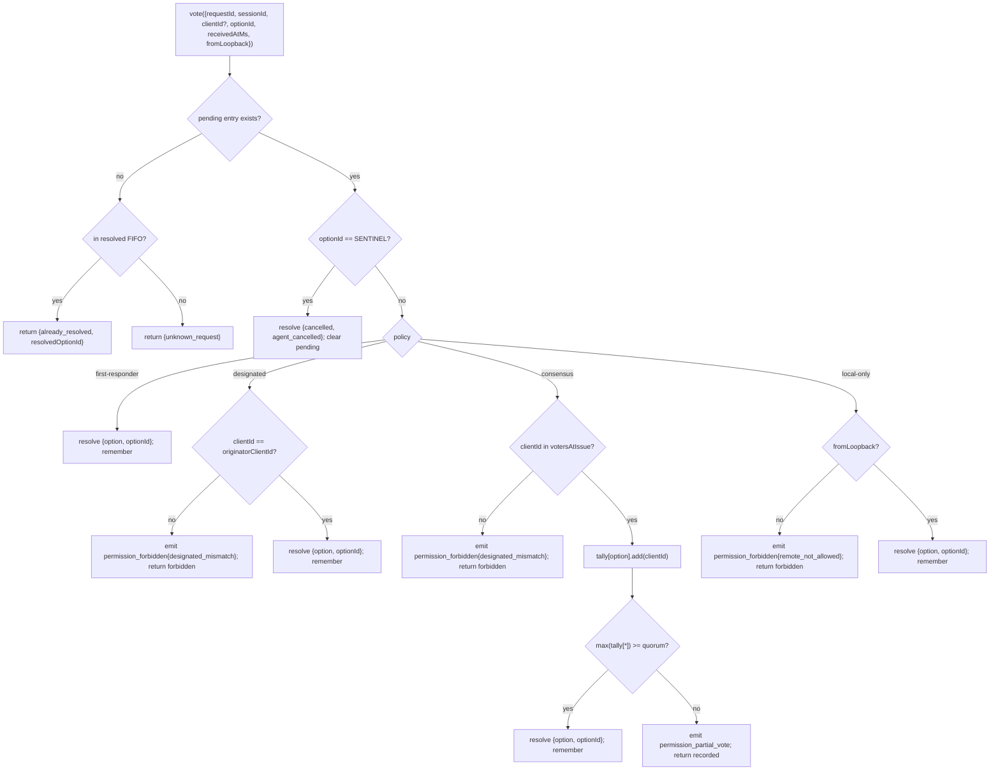

# Multi-Client-Berechtigungsvermittlung

## Überblick

Wenn der Agent des ACP-Kinds `requestPermission` aufruft, leitet der Daemon dies nicht einfach an einen Client weiter. Unter `sessionScope: 'single'` sieht jeder verbundene Client die Anfrage, und jeder von ihnen kann antworten. Ohne Vermittlung haben späte Stimmen keinen Zielort, zwei Clients können um dieselbe Anfrage konkurrieren, und ein einzelner schädlicher Client kann den Urheber überschreiben.

`MultiClientPermissionMediator` (`packages/acp-bridge/src/permissionMediator.ts`) implementiert den `PermissionMediator`-Vertrag (`packages/acp-bridge/src/permission.ts`) und besitzt den gesamten anstehenden und aufgelösten Berechtigungsstatus für die Brücke. Es leitet Stimmen über eine von vier in `PermissionPolicy` deklarierten Strategien weiter:

| Strategie         | Auflösungsregel                                                                                                        | Anwendungsfall                                                          |
| ----------------- | ---------------------------------------------------------------------------------------------------------------------- | ----------------------------------------------------------------------- |
| `first-responder` | Erste gültige Stimme gewinnt; spätere Wähler erhalten `permission_already_resolved`.                                   | Live-Cross-Client-Kollaborations-UI (Standard).                         |
| `designated`      | Nur die `originatorClientId` der Aufforderung darf auflösen; andere sehen `permission_forbidden{designated_mismatch}`. | Mandantenfähiges SaaS, bei dem die UI-Oberfläche ihre eigenen Genehmigungen besitzen muss. |
| `consensus`       | N-von-M-Quorum über den v1-Client-ID-Snapshot; Zwischenereignisse `permission_partial_vote` ermöglichen UI-Fortschrittsanzeige. | Unternehmens-Change-Review, bei dem zwei Operatoren zustimmen müssen. |
| `local-only`      | Lehnt jeden Nicht-Loopback-Wähler ab; blockiert, bis ein Loopback-Client auflöst.                                      | Workstations, bei denen Fernsteuerung niemals eine Privilegienausweitung gewähren darf. |

> **v1-Sicherheitsgrenze**: `X-Qwen-Client-Id` ist selbstberichtet. `designated` und
> `consensus` haben noch keinen Besitznachweis. Ein Client, der
> `originatorClientId` beobachtet, kann diese ID wiederverwenden. `{outcome:'cancelled'}` wird
> ebenfalls vor der Strategieverteilung durch den Abbruch-Sentinel geleitet, sodass selbst
> `local-only` einen Abbruch nicht als strategiegeschützte Auflösung behandeln kann. Für starke
> Isolierung binden Sie den Daemon an Loopback oder setzen Sie ihn hinter einen authentifizierten
> Reverse-Proxy. Siehe [Sicherheitshinweis: v1-Client-Identität ist selbstberichtet](#sicherheitshinweis-v1-client-identität-ist-selbstberichtet).

## Zuständigkeiten

- Verfolgung jeder ausstehenden Anfrage (Lebenszyklus `Anfrage → Stimme → aufgelöst`).
- Scharfschalten und Entschärfen von anfragespezifischen Wanduhr-Timeout (die **N1-Invariante**: Der Timeout muss synchron innerhalb von `request()` scharfgeschaltet sein, damit eine sofort abgebrochene Sitzung keinen dauerhaft ausstehenden Abschluss hinterlässt).
- Weiterleitung von Stimmen über die zum Zeitpunkt von `request()` erfasste Strategie (eine nachträgliche Änderung der Daemon-Strategie beeinflusst keine laufenden Anfragen).
- Führen einer begrenzten FIFO-Liste (`MAX_RESOLVED_PERMISSION_RECORDS = 512`) kürzlich aufgelöster Anfragen, sodass doppelte Stimmen ein strukturiertes `already_resolved` anstelle von `unknown_request` erhalten.
- Senden von `permission_partial_vote` (Konsens) und `permission_forbidden` (designated / consensus / local-only) auf dem sitzungsspezifischen EventBus.
- Auflösen ausstehender Anfragen als `{kind: 'cancelled', reason: 'session_closed'}` über `forgetSession(sessionId)` beim Sitzungsabbau.
- Zurückweisen von böswilliger oder versehentlicher Einschleusung von `CANCEL_VOTE_SENTINEL` über die Leitung (`InvalidPermissionOptionError`) und über vom Agenten veröffentlichte Optionsbezeichnungen (`CancelSentinelCollisionError`).

## Architektur

### Öffentliche Schnittstelle

```ts
interface PermissionMediator {
  readonly policy: PermissionPolicy;
  request(
    record: PermissionRequestRecord,
    timeoutMs: number,
  ): Promise<PermissionResolution>;
  vote(vote: PermissionVote): PermissionVoteOutcome;
  forgetSession(sessionId: string): void;
}
```

`MultiClientPermissionMediator` fügt hinzu: `peekSessionFor(requestId)`, `pendingCount(sessionId)`, interner Audit-Publisher usw. `BridgeClient` hängt nur von der `request()`-Hälfte ab (strukturelle Untertypisierung — siehe `bridgeClient.ts`).

### `PermissionPolicy` und `PermissionVoteOutcome`

```ts
type PermissionPolicy =
  | 'first-responder'
  | 'designated'
  | 'consensus'
  | 'local-only';

type PermissionVoteOutcome =
  | { kind: 'resolved'; resolvedOptionId: string }
  | { kind: 'recorded'; votesNeeded: number } // consensus partial
  | { kind: 'already_resolved'; resolvedOptionId: string }
  | { kind: 'forbidden'; reason: 'designated_mismatch' | 'remote_not_allowed' }
  | { kind: 'unknown_request' };

type PermissionResolution =
  | { kind: 'option'; optionId: string }
  | {
      kind: 'cancelled';
      reason: 'timeout' | 'session_closed' | 'agent_cancelled';
    };
```

### Abbruch-Sentinel

`CANCEL_VOTE_SENTINEL = '__cancelled__'`. Die Brücke ordnet den Wähler `{outcome:'cancelled'}` **vor** dem Aufruf von `mediator.vote` diesem Sentinel zu. Der Vermittler leitet den Sentinel **vor** der Strategieverteilung weiter – der Wähler-Abbruch funktioniert unter jeder Strategie, unabhängig von `clientId` / Loopback / Mitgliedschaft. Zwei Sicherungen:
1. **`bridge.ts`** lehnt Wire-Abstimmungen ab, deren `optionId === CANCEL_VOTE_SENTINEL` mit `InvalidPermissionOptionError` (ein bösartiger Wire-Client darf nicht in der Lage sein, einen Abbruch durch eine falsche `optionId` einzufügen).
2. **`mediator.request`** lehnt Datensätze ab, deren `allowedOptionIds` den Sentinel enthalten, mit `CancelSentinelCollisionError` (ein Agent, der legitimerweise `'__cancelled__'` als Optionsbezeichnung veröffentlicht, darf nicht in der Lage sein, sich zu tarnen).

Diese bewusste politikübergreifende Ausnahme ist in `permissionMediator.ts` dokumentiert, damit ein zukünftiger Maintainer den Umgehungsweg nicht versehentlich entfernt.

### Ausstehender Zustand

Jede ausstehende Anfrage ist durch `requestId` gekeyt und führt mit:

- `policy` — zum Zeitpunkt von `request()` erfasst.
- `record: PermissionRequestRecord` (requestId, sessionId, originatorClientId, allowedOptionIds, issuedAtMs).
- `resolve` / `reject`-Closures.
- `votesAtIssue` (nur Konsens) — Snapshot der registrierten `clientIds` für die Session zum Zeitpunkt der Ausstellung; spätere Stimmen werden abgelehnt, wenn sie nicht in diesem Set sind.
- `tally` (nur Konsens) — `Map<optionId, Set<clientId>>` zählt Stimmen pro Option.
- `timeoutHandle` — Node-Timer, der innerhalb von `request()` gesetzt wird (N1-Invariante).
- `auditTrail[]` — Prüfdatensätze pro Stimme.

### Aufgelöst FIFO

`MAX_RESOLVED_PERMISSION_RECORDS = 512`. Räumung erfolgt FIFO via `resolvedOrder.shift()` (DeepSeek-Review #4335 / 3271627446 — spiegelt `PermissionAuditRing`). Speichert nur `{requestId, sessionId, outcome}`, sodass 512 Datensätze unter 100 KB bleiben – bei normalen UI-Wiederverbindungs-/Race-Fenstern.

## Arbeitsablauf

### `request()` (N1-Invariante)



Der Timer wird **vor** gesetzt, bevor der Eintrag an anderer Stelle sichtbar wird. Ohne dies würde ein `forgetSession`, das zwischen `pending.set` und `setTimeout` eintrifft, den Eintrag ohne Timeout ausstehend lassen – die sessionbezogene `promptQueue` der Bridge würde sich aufhängen.

### `vote()`-Dispatch



### `forgetSession()`

Wird bei Session-Schließung, Räumung und Bridge-Shutdown aufgerufen. Für jeden ausstehenden Eintrag, dessen `record.sessionId === sessionId`:

1. Timeout abbrechen.
2. Das ausstehende Promise mit `{kind: 'cancelled', reason: 'session_closed'}` auflösen.
3. Einen Audit-Eintrag anhängen.
4. Aus `pending` entfernen.

Der Session-TearDown-Pfad der Bridge ruft `forgetSession` **vor** dem Channel-Kill-Fenster auf, sodass ausstehende Berechtigungen ihre Session nicht überleben.

## Zustand & Lebenszyklus

- `policy` wird pro Anfrage erfasst. Eine Änderung der dämonenweiten Richtlinie (zukünftige Oberfläche) beeinflusst keine laufenden Anfragen.
- `votesAtIssue` (Konsens) wird zum Zeitpunkt von `request()` erfasst; Clients, die nach der Anfrage eintreffen, können zwar abstimmen, aber wenn ihre `clientId` zum Zeitpunkt der Ausstellung nicht bei der Session registriert war, wird ihre Stimme als `designated_mismatch` abgelehnt. Dies verwendet bewusst den Fehlergrund der `designated`-Richtlinie wieder, um den Vertrag geschlossen zu halten; zukünftige Versionen könnten die Union aufteilen, wenn SDK-Konsumenten zwischen den Gründen unterscheiden müssen.
- Aufgelöste Einträge verbleiben maximal `MAX_RESOLVED_PERMISSION_RECORDS` (512) im FIFO. Nach der Räumung gibt eine doppelte Abstimmung zur selben `requestId` `{unknown_request}` zurück.
- `permission_partial_vote` wird nur für `consensus` ausgelöst. Unter keiner anderen Richtlinie darauf verlassen.
- `permission_forbidden` wird für `designated`, `consensus` und `local-only` ausgelöst – nicht für `first-responder`.

## Abhängigkeiten
- [`03-acp-bridge.md`](./03-acp-bridge.md) – wie die Brücke `BridgeClient.requestPermission` an `mediator.request` anbindet.
- [`10-event-bus.md`](./10-event-bus.md) – wie Partial-Vote- und Forbidden-Frames Clients erreichen.
- [`09-event-schema.md`](./09-event-schema.md) – Verträge für Nutzdaten von `permission_*`-Ereignissen.
- [`08-session-lifecycle.md`](./08-session-lifecycle.md) – `forgetSession()` wird bei jeder Session-Beendigung aufgerufen.
- [`02-serve-runtime.md`](./02-serve-runtime.md) – `PermissionAuditRing` (512 Einträge, FIFO der Audit-Datensätze).

## Konfiguration

| Quelle              | Stellschraube                                                                                         | Wirkung                                |
| ------------------- | ----------------------------------------------------------------------------------------------------- | -------------------------------------- |
| `settings.json`     | `policy.permissionStrategy`                                                                            | Aktive Mediator-Richtlinie.               |
| `settings.json`     | `policy.consensusQuorum`                                                                               | N für Konsens.                      |
| `BridgeOptions`     | `permissionPolicy`, `permissionConsensusQuorum`, `permissionAudit`                                     | Programmgesteuerte Überschreibung.                |
| Capability-Tag      | `permission_mediation` (immer; `modes: ['first-responder', 'designated', 'consensus', 'local-only']`) | Build-unterstützter Satz.                  |
| Capability-Envelope | `policy.permission`                                                                                    | Aktive Richtlinie, unter der dieser Daemon läuft. |

Wenn `policy.permissionStrategy` nicht explizit konfiguriert ist, verwendet der Daemon
`first-responder`. `designated`, `consensus` und `local-only` treten nur dann in Kraft,
wenn sie in `settings.json` gesetzt sind.

## Konsens-Quorum: Standardformel und der Fall M=2

Wenn die `consensus`-Richtlinie aktiv ist und `policy.consensusQuorum` nicht gesetzt ist,
berechnet der Mediator **N = floor(M/2) + 1** via `consensusQuorumFor` in
`permissionMediator.ts`:

```ts
Math.max(1, Math.floor(m / 2) + 1);
```

| M (`votersAtIssue.size`) | Standard N | Verhalten                        |
| ------------------------ | ---------- | -------------------------------- |
| 1                        | 1          | Ein Wähler entscheidet sofort. |
| 2                        | 2          | Erfordert einstimmige Zustimmung.   |
| 3                        | 2          | Mehrheit.                       |
| 4                        | 3          | Mehr als die Hälfte.                 |
| 5                        | 3          | Mehrheit.                       |
| 6                        | 4          | Mehr als die Hälfte.                 |

Für **M = 2** können geteilte Stimmen (A wählt X, B wählt Y) nur durch das
pro-Berechtigung Timeout aufgelöst werden: Keine Option erreicht Einstimmigkeit, daher wartet
die Anfrage bis `permissionResponseTimeoutMs` (Standard 5 Minuten) und wird als
`{cancelled, timeout}` aufgelöst. Der Vote-Advance-Pfad protokolliert dieses Verhalten
– „Einstimmigkeit bedeutet, dass geteilte Stimmen auslaufen“ – nach stderr für Betreiber.

Betreiber, die für M=2 ein „Erste-Stimme-gewinnt“-Verhalten wünschen, können explizit
`policy.consensusQuorum: 1` setzen. Strengere Konfigurationen, wie die Forderung nach
Einstimmigkeit für M=4, verwenden dasselbe Feld.

## Startzeit-Richtlinienvalidierung

`runQwenServe.validatePolicyConfig(policyConfig)`
(`packages/cli/src/serve/run-qwen-serve.ts`) validiert die zusammengeführten `settings.json`
`policy.*`-Werte beim Start und wirft `InvalidPolicyConfigError` bei Bedienerfehlern:

- `policy.permissionStrategy` ist gesetzt, aber nicht in den vier unterstützten Modi. Die
  gültige Menge wird zur Laufzeit aus
  `SERVE_CAPABILITY_REGISTRY.permission_mediation.modes` abgeleitet, der einzigen
  Quelle der Wahrheit für die Fähigkeitsanzeige.
- `policy.consensusQuorum` ist gesetzt, aber keine positive Ganzzahl.

Es gibt auch eine weiche stderr-Warnung, wenn `consensusQuorum` gesetzt ist, während
`permissionStrategy !== 'consensus'`; die Überschreibung würde ansonsten stillschweigend
unter Nicht-Konsens-Richtlinien ignoriert.

`InvalidPolicyConfigError` wird für `instanceof`-Tests exportiert. `runQwenServe`
verwendet es, um Bedienerfehlkonfiguration, die als expliziter Startfehler weitergereicht wird,
von I/O-Fehlern beim Lesen der Einstellungen zu unterscheiden, welche auf Standardwerte zurückfallen.

## Sicherheitshinweis: v1-Client-Identität ist selbstberichtet

`X-Qwen-Client-Id` wird vom HTTP-Client geliefert. In v1 validiert der Daemon
das Format (`[A-Za-z0-9._:-]{1,128}`) und verfolgt angehängte Client-IDs in
`clientIds`, führt jedoch keinen Besitznachweis durch. Jeder Client, der
`originatorClientId` im SSE beobachten kann, kann sich mit derselben ID registrieren und
diesen Urheber in späteren Anfragen imitieren.

Auswirkungen auf die Richtlinie:

- **`first-responder`** ist nicht betroffen, da es nicht von der Identität abhängt.
- **`designated`** kann von einem entfernten Client durch Wiederverwendung von
  `originatorClientId` gefälscht werden.
- **`consensus`** prüft gegen den zum Zeitpunkt der Anfrage aufgenommenen Snapshot
  `votersAtIssue`; wenn eine gefälschte ID zum Zeitpunkt der Anfrage bereits angehängt ist, kann sie abstimmen.
- **`local-only`** ist immun gegen ID-Spoofing, da `fromLoopback: boolean` vom Daemon
  aus der Remote-Adresse der Verbindung gestempelt wird, nicht vom Client geliefert.
Ein zukünftiger Pair-Token-Mechanismus wird ein pro-Sitzung-Geheimnis von `POST /session` ausstellen und es für `designated`-/`consensus`-Abstimmungen erfordern. Dieser Mechanismus existiert in v1 nicht.

## Einschränkungen & bekannte Grenzen

- **Cancel sentinel routes BEFORE policy dispatch** by design — ein `local-only`-Daemon und ein `consensus`-Daemon können von jedem Wähler, der `{outcome: 'cancelled'}` postet, abgebrochen werden. Dies ist in `permissionMediator.ts` dokumentiert und stellt den agentenseitigen Abbruchpfad dar.
- **`designated` und `consensus` überladen `designated_mismatch`** in `PermissionVoteOutcome`. Der Mediator gibt separate Audit-Datensätze aus, aber das Wire-Format ist einzeln. Zukünftige Protokollversionen könnten die Union aufteilen.
- **Anonyme Wähler (keine `X-Qwen-Client-Id`)** werden nur unter `first-responder` und `local-only` (Loopback) akzeptiert; `designated` und `consensus` lehnen sie ab.
- **Cross-Policy-Escape-Hatch** bedeutet, dass Cancel nicht durch eine Policy eingeschränkt werden kann. Wenn eine Bereitstellung ein policy-gestütztes Cancel benötigt, wäre das eine zukünftige Vertragsänderung — dies nicht mit Routenprüfungen überdecken.
- **`votesAtIssue`-Snapshot-Semantik** bedeutet, dass ein Consensus-Deployment mit einer wechselnden Clientmenge legitime Clients ablehnen kann, weil sie sich erst nach der Ausstellung der Anfrage verbunden haben. Betreiber sollten vor dem Ausstellen von Change-Review-Prompts die Client-IDs der Mitarbeiter vorregistrieren.

## Referenzen

- `packages/acp-bridge/src/permission.ts` (eingefrorener Vertrag)
- `packages/acp-bridge/src/permissionMediator.ts` (F3-Mediator-Implementierung)
- `packages/acp-bridge/src/bridgeClient.ts` (verwendet strukturelle Subtypisierung auf `PermissionMediator`)
- `packages/acp-bridge/src/bridgeErrors.ts` (`CancelSentinelCollisionError`, `InvalidPermissionOptionError`, `PermissionForbiddenError`)
- `packages/cli/src/serve/permission-audit.ts` (Audit-Ring + Publisher)
- Issue: [#4175](https://github.com/QwenLM/qwen-code/issues/4175) F3-Serie.
