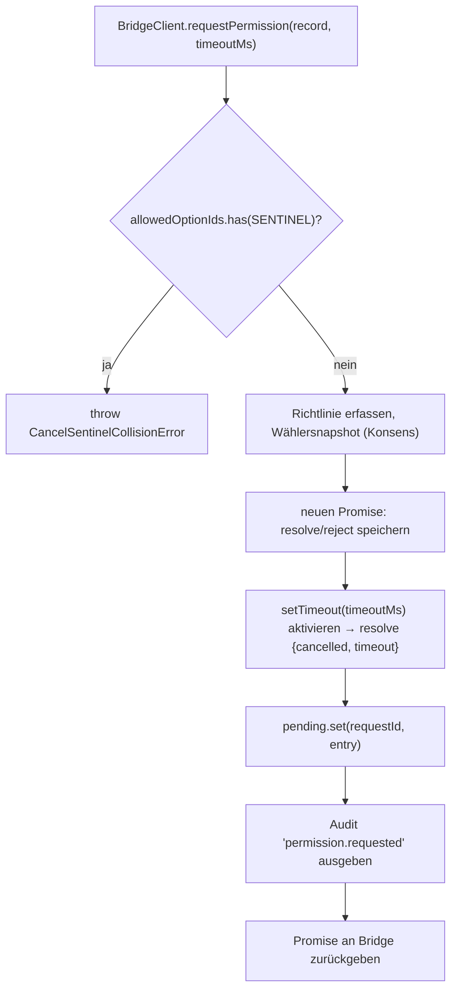
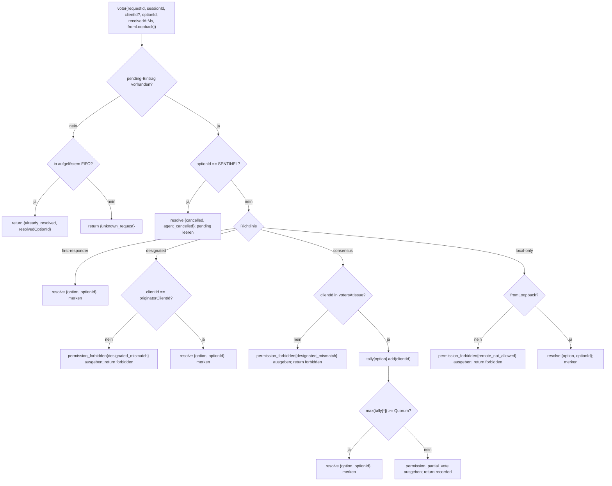

# Multi-Client-Berechtigungsvermittlung

## Übersicht

Wenn der Agent des ACP-Kindes `requestPermission` aufruft, leitet der Daemon dies nicht einfach an einen Client weiter. Unter `sessionScope: 'single'` sieht jeder verbundene Client die Anfrage, und jeder kann darauf antworten. Ohne Vermittlung haben späte Stimmen kein Ziel, zwei Clients können dieselbe Anfrage überholen, und ein einzelner bösartiger Client kann den Urheber überschreiben.

`MultiClientPermissionMediator` (`packages/acp-bridge/src/permissionMediator.ts`) implementiert den `PermissionMediator`-Vertrag (`packages/acp-bridge/src/permission.ts`) und besitzt den gesamten ausstehenden und aufgelösten Berechtigungsstatus für die Brücke. Es verteilt Stimmen über eine von vier in `PermissionPolicy` deklarierten Richtlinien:

| Richtlinie       | Auflösungsregel                                                                                                                | Anwendungsfall                                                                 |
| ---------------- | ------------------------------------------------------------------------------------------------------------------------------ | ------------------------------------------------------------------------------ |
| `first-responder` | Die erste gültige Stimme gewinnt; spätere Wähler erhalten `permission_already_resolved`.                                         | Live-Client-über-greifende Zusammenarbeits-UX (Standard).                      |
| `designated`     | Nur der `originatorClientId` des Prompts darf auflösen; andere sehen `permission_forbidden{designated_mismatch}`.               | Pro-Tenant SaaS, bei dem die UI-Oberfläche ihre eigenen Genehmigungen besitzen muss. |
| `consensus`      | N-von-M-Quorum über den v1-Client-ID-Snapshot; zwischenzeitliche `permission_partial_vote`-Ereignisse ermöglichen UI-Fortschrittsanzeige. | Enterprise-Change-Review, bei dem zwei Betreiber zustimmen müssen.             |
| `local-only`     | Lehnt jeden Nicht-Loopback-Wähler ab; blockiert, bis ein Loopback-Client auflöst.                                               | Workstations, bei denen Remote-Steuerung niemals Privilegieneskalation gewähren darf. |

> **v1-Sicherheitslimit**: `X-Qwen-Client-Id` ist selbstberichtend. `designated` und
> `consensus` haben noch keinen Besitznachweis. Ein Client, der
> `originatorClientId` beobachtet, kann diese ID wiederverwenden. `{outcome:'cancelled'}` wird
> ebenfalls vor der Richtlinienverteilung durch den Cancel-Sentinel geleitet, sodass selbst `local-only`
> eine Abbrechung nicht als richtliniengeschützte Auflösung behandeln kann. Für starke Isolation binden
> Sie den Daemon an Loopback oder setzen Sie ihn hinter einen authentifizierten Reverse-Proxy. Siehe
> [Sicherheitshinweis: v1-Client-Identität ist selbstberichtet](#sicherheitshinweis-v1-client-identität-ist-selbstberichtet).

## Verantwortlichkeiten

- Jede ausstehende Anfrage verfolgen (`request → vote → resolved`-Lebenszyklus).
- Schützen und entschärfen von Echtzeit-Timeouts pro Anfrage (die **N1-Invariante**: der Timeout muss synchron innerhalb von `request()` aktiviert werden, sodass eine sofort abgebrochene Sitzung keinen dauerhaft ausstehenden Abschluss hinterlassen kann).
- Stimmen durch die bei `request()` erfasste Richtlinie verteilen (Ändern der Daemon-Richtlinie während des Flugs wirkt sich nicht auf laufende Anfragen aus).
- Ein begrenztes FIFO (`MAX_RESOLVED_PERMISSION_RECORDS = 512`) kürzlich aufgelöster Anfragen führen, sodass doppelte Stimmen ein strukturiertes `already_resolved` statt `unknown_request` erhalten.
- `permission_partial_vote` (Konsens) und `permission_forbidden` (designated / consensus / local-only) auf dem pro-Sitzung-EventBus ausgeben.
- Ausstehende Anfragen als `{kind: 'cancelled', reason: 'session_closed'}` über `forgetSession(sessionId)` beim Sitzungsabbau auflösen.
- Bösartige oder versehentliche Injektion von `CANCEL_VOTE_SENTINEL` über die Leitung (`InvalidPermissionOptionError`) und über agentenveröffentlichte Optionsbezeichnungen (`CancelSentinelCollisionError`) ablehnen.

## Architektur

### Öffentliche Oberfläche

```ts
interface PermissionMediator {
  readonly policy: PermissionPolicy;
  request(
    record: PermissionRequestRecord,
    timeoutMs: number,
  ): Promise<PermissionResolution>;
  vote(vote: PermissionVote): PermissionVoteOutcome;
  forgetSession(sessionId: string): void;
}
```

`MultiClientPermissionMediator` fügt hinzu: `peekSessionFor(requestId)`, `pendingCount(sessionId)`, interner Audit-Publisher usw. `BridgeClient` hängt nur von der `request()`-Hälfte ab (strukturelle Subtypisierung — siehe `bridgeClient.ts`).

### `PermissionPolicy` und `PermissionVoteOutcome`

```ts
type PermissionPolicy =
  | 'first-responder'
  | 'designated'
  | 'consensus'
  | 'local-only';

type PermissionVoteOutcome =
  | { kind: 'resolved'; resolvedOptionId: string }
  | { kind: 'recorded'; votesNeeded: number } // consensus partial
  | { kind: 'already_resolved'; resolvedOptionId: string }
  | { kind: 'forbidden'; reason: 'designated_mismatch' | 'remote_not_allowed' }
  | { kind: 'unknown_request' };

type PermissionResolution =
  | { kind: 'option'; optionId: string }
  | {
      kind: 'cancelled';
      reason: 'timeout' | 'session_closed' | 'agent_cancelled';
    };
```

### Cancel-Sentinel

`CANCEL_VOTE_SENTINEL = '__cancelled__'`. Die Brücke bildet Wähler `{outcome:'cancelled'}` auf diesen Sentinel ab, **bevor** `mediator.vote` aufgerufen wird. Der Mediator leitet den Sentinel **vor** der Richtlinienverteilung weiter – der Abbrechungsvorgang eines Wählers funktioniert unter jeder Richtlinie, unabhängig von `clientId` / Loopback / Mitgliedschaft. Zwei Schutzmechanismen:

1. **`bridge.ts`** lehnt Wire-Votes ab, deren `optionId === CANCEL_VOTE_SENTINEL` mit `InvalidPermissionOptionError` (ein bösartiger Wire-Client darf keine Abbrechung durch Lügen über eine `optionId` injizieren können).
2. **`mediator.request`** lehnt Datensätze ab, deren `allowedOptionIds` den Sentinel enthalten, mit `CancelSentinelCollisionError` (ein Agent, der legitimerweise `'__cancelled__'` als Optionsbezeichnung veröffentlicht, darf sich nicht als Sentinel tarnen können).

Dieser bewusste richtlinienübergreifende Ausweg ist in `permissionMediator.ts` dokumentiert, damit ein zukünftiger Betreuer nicht versehentlich die Umgehung entfernt.

### Ausstehender Zustand

Jede ausstehende Anfrage ist durch `requestId` geschlüsselt und trägt:

- `policy` – erfasst zum Zeitpunkt von `request()`.
- `record: PermissionRequestRecord` (requestId, sessionId, originatorClientId, allowedOptionIds, issuedAtMs).
- `resolve` / `reject`-Closures.
- `votesAtIssue` (nur consensus) – Snapshot der registrierten `clientIds` für die Sitzung zum Ausgabezeitpunkt; spätere Stimmen werden abgelehnt, wenn sie nicht in diesem Satz sind.
- `tally` (nur consensus) – `Map<optionId, Set<clientId>>` zum Zählen der Stimmen pro Option.
- `timeoutHandle` – Node-Timeout, der innerhalb von `request()` aktiviert wird (N1-Invariante).
- `auditTrail[]` – Audit-Datensätze pro Stimme.

### Aufgelöstes FIFO

`MAX_RESOLVED_PERMISSION_RECORDS = 512`. Das Entfernen erfolgt per FIFO über `resolvedOrder.shift()` (DeepSeek-Review #4335 / 3271627446 – spiegelt `PermissionAuditRing` wider). Speichert nur `{requestId, sessionId, outcome}`, sodass 512 Datensätze unter normalen UI-Wiederherstellungs-/Überlappungsfenstern unter 100 KB bleiben.

## Workflow

### `request()` (N1-Invariante)



Der Timer wird **bevor** der Eintrag an anderer Stelle sichtbar ist, aktiviert. Ohne dies würde ein `forgetSession`, das zwischen `pending.set` und `setTimeout` eintrifft, den Eintrag ohne Timeout ausstehend lassen – die pro-Sitzung `promptQueue` der Brücke würde für immer hängen bleiben.

### `vote()`-Verteilung



### `forgetSession()`

Wird beim Sitzungsschluss, bei Räumung und beim Brücken-Shutdown aufgerufen. Für jeden ausstehenden Eintrag, dessen `record.sessionId === sessionId`:

1. Timeout abbrechen.
2. Ausstehenden Promise mit `{kind: 'cancelled', reason: 'session_closed'}` auflösen.
3. Audit-Datensatz anhängen.
4. Aus `pending` entfernen.

Der Sitzungsabbau-Pfad der Brücke ruft `forgetSession` **vor** dem Channel-Kill-Fenster auf, sodass ausstehende Berechtigungen ihre Sitzung nicht überleben.

## Zustand und Lebenszyklus

- `policy` wird pro Anfrage erfasst. Eine Änderung der daemonweiten Richtlinie (zukünftige Oberfläche) wirkt sich nicht auf laufende Anfragen aus.
- `votesAtIssue` (Konsens) wird zum Zeitpunkt von `request()` erfasst; Clients, die nach der Anfrage eintreffen, können stimmen, aber wenn ihre `clientId` zum Zeitpunkt der Ausgabe nicht bereits bei der Sitzung registriert war, wird ihre Stimme als `designated_mismatch` abgelehnt. Dies verwendet absichtlich den gleichen Grund für die Nichtübereinstimmung wie die `designated`-Richtlinie, um den Vertrag geschlossen zu halten; zukünftige Versionen können die Vereinigung aufteilen, wenn SDK-Konsumenten unterscheiden müssen.
- Aufgelöste Einträge bleiben maximal `MAX_RESOLVED_PERMISSION_RECORDS` (512) im FIFO. Nach dem Entfernen gibt eine doppelte Stimme für dieselbe `requestId` `{unknown_request}` zurück.
- `permission_partial_vote` wird nur für `consensus` ausgelöst. Verlassen Sie sich unter keiner anderen Richtlinie darauf.
- `permission_forbidden` wird für `designated`, `consensus` und `local-only` ausgelöst – nicht für `first-responder`.

## Abhängigkeiten

- [`03-acp-bridge.md`](./03-acp-bridge.md) – wie die Brücke `BridgeClient.requestPermission` mit `mediator.request` verbindet.
- [`10-event-bus.md`](./10-event-bus.md) – wie partielle Stimmen- und Verbots-Frames Clients erreichen.
- [`09-event-schema.md`](./09-event-schema.md) – Nutzlastverträge für `permission_*`-Ereignisse.
- [`08-session-lifecycle.md`](./08-session-lifecycle.md) – `forgetSession()` wird bei jeder Sitzungsbeendigung aufgerufen.
- [`02-serve-runtime.md`](./02-serve-runtime.md) – `PermissionAuditRing` (512-Eintrag-FIFO von Audit-Datensätzen).

## Konfiguration

| Quelle             | Stellschraube                                                                                                                 | Wirkung                                |
| ------------------ | ------------------------------------------------------------------------------------------------------------------------------ | -------------------------------------- |
| `settings.json`    | `policy.permissionStrategy`                                                                                                    | Aktive Mediatorrichtlinie.             |
| `settings.json`    | `policy.consensusQuorum`                                                                                                       | N für Konsens.                         |
| `BridgeOptions`    | `permissionPolicy`, `permissionConsensusQuorum`, `permissionAudit`                                                             | Programmatische Überschreibung.        |
| Fähigkeits-Tag     | `permission_mediation` (immer; `modes: ['first-responder', 'designated', 'consensus', 'local-only']`)                          | Vom Build unterstützte Menge.          |
| Fähigkeits-Hülle   | `policy.permission`                                                                                                            | Aktive Richtlinie dieses Daemons.      |

Wenn `policy.permissionStrategy` nicht explizit konfiguriert ist, verwendet der Daemon
`first-responder`. `designated`, `consensus` und `local-only` werden nur wirksam,
wenn sie in `settings.json` gesetzt sind.

## Konsens-Quorum: Standardformel und der M=2-Rand

Wenn die `consensus`-Richtlinie aktiv ist und `policy.consensusQuorum` nicht gesetzt ist,
berechnet der Mediator **N = floor(M/2) + 1** über `consensusQuorumFor` in
`permissionMediator.ts`:

```ts
Math.max(1, Math.floor(m / 2) + 1);
```

| M (`votersAtIssue.size`) | Standard-N | Verhalten                        |
| ------------------------ | ---------- | -------------------------------- |
| 1                        | 1          | Ein Wähler löst sofort auf.      |
| 2                        | 2          | Erfordert einstimmige Zustimmung.|
| 3                        | 2          | Mehrheit.                        |
| 4                        | 3          | Mehr als die Hälfte.             |
| 5                        | 3          | Mehrheit.                        |
| 6                        | 4          | Mehr als die Hälfte.             |

Bei **M = 2** können geteilte Stimmen (A wählt X, B wählt Y) nur durch den
Timeout pro Berechtigung aufgelöst werden: Keine Option erreicht Einstimmigkeit, daher wartet die Anfrage
bis `permissionResponseTimeoutMs` (Standard 5 Min.) und wird als
`{cancelled, timeout}` aufgelöst. Der Stimmfortschrittspfad protokolliert dieses Verhalten
"Einstimmigkeit bedeutet, dass geteilte Stimmen auslaufen" auf stderr für Betreiber.

Betreiber, die ein Verhalten "erste Stimme gewinnt" für M = 2 wünschen, können explizit
`policy.consensusQuorum: 1` setzen. Strengere Konfigurationen, wie z. B.
Einstimmigkeit für M = 4 erforderlich, verwenden dasselbe Feld.

## Bootzeit-Richtlinienvalidierung

`runQwenServe.validatePolicyConfig(policyConfig)`
(`packages/cli/src/serve/run-qwen-serve.ts`) validiert zusammengeführte `settings.json`
`policy.*`-Einträge beim Boot und wirft `InvalidPolicyConfigError` bei Betreiberfehlern:

- `policy.permissionStrategy` ist gesetzt, aber nicht in den vier unterstützten Modi. Der
  gültige Satz wird zur Laufzeit aus
  `SERVE_CAPABILITY_REGISTRY.permission_mediation.modes` abgeleitet, der einzigen Quelle der Wahrheit
  für Fähigkeitsankündigungen.
- `policy.consensusQuorum` ist gesetzt, aber keine positive Ganzzahl.

Es gibt auch eine weiche stderr-Warnung, wenn `consensusQuorum` gesetzt ist, während
`permissionStrategy !== 'consensus'`; die Überschreibung würde ansonsten unter
Nicht-Konsens-Richtlinien stillschweigend ignoriert.

`InvalidPolicyConfigError` wird für `instanceof`-Tests exportiert. `runQwenServe`
verwendet es, um Bedienerfehlkonfiguration, die als expliziter Boot-Fehler
weitergeworfen wird, von Lesefehler der Einstellungen zu unterscheiden, die auf
Standardwerte zurückgreifen.

## Sicherheitshinweis: v1-Client-Identität ist selbstberichtet

`X-Qwen-Client-Id` wird vom HTTP-Client bereitgestellt. In v1 validiert der Daemon
das Format (`[A-Za-z0-9._:-]{1,128}`) und verfolgt verbundene Client-IDs in
`clientIds`, führt aber keinen Besitznachweis durch. Jeder Client, der
`originatorClientId` in SSE beobachten kann, kann sich mit derselben ID registrieren und
diesen Ursprung in späteren Anfragen impersonieren.

Richtlinienauswirkung:

- **`first-responder`** ist nicht betroffen, da es nicht von der Identität abhängt.
- **`designated`** kann von einem entfernten Client durch Wiederverwendung von
  `originatorClientId` gefälscht werden.
- **`consensus`** prüft den Ausgabezeitraum-`votersAtIssue`-Snapshot; wenn eine gefälschte
  ID zum Zeitpunkt der Ausgabe bereits angehängt ist, kann sie abstimmen.
- **`local-only`** ist immun gegen ID-Fälschung, da `fromLoopback: boolean` vom
  Daemon aus der Remote-Adresse der Verbindung gestempelt wird und nicht vom
  Client bereitgestellt wird.

Ein zukünftiger Pair-Token-Mechanismus wird ein pro-Sitzung-Geheimnis von
`POST /session` ausstellen und es bei `designated` / `consensus`-Stimmen erfordern. Dieser
Mechanismus existiert in v1 nicht.

## Einschränkungen und bekannte Grenzen

- **Cancel-Sentinel wird VOR der Richtlinienverteilung weitergeleitet** by design – ein `local-only`-Daemon und ein `consensus`-Daemon können beide von jedem Wähler abgebrochen werden, der `{outcome: 'cancelled'}` sendet. Dies ist in `permissionMediator.ts` dokumentiert und ist der agentenseitige Abbruchpfad.
- **`designated` und `consensus` überladen `designated_mismatch`** in `PermissionVoteOutcome`. Der Mediator gibt separate Audit-Datensätze aus, aber die Wire-Form ist einheitlich. Zukünftige Protokollversionen können die Vereinigung aufteilen.
- **Anonyme Wähler (kein `X-Qwen-Client-Id`)** werden nur unter `first-responder` und `local-only` (Loopback) akzeptiert; `designated` und `consensus` lehnen sie ab.
- **Richtlinienübergreifende Ausweichmöglichkeit** bedeutet, dass Cancel nicht durch die Richtlinie eingeschränkt werden kann. Wenn eine Bereitstellung eine richtliniengesteuerte Abbrechung benötigt, wäre das eine zukünftige Vertragsänderung – nicht mit Routenprüfungen überdecken.
- **`votesAtIssue`-Snapshot-Semantik** bedeutet, dass bei einer Konsensbereitstellung mit wechselndem Clientsatz legitime Clients abgelehnt werden können, weil sie sich nach der Ausgabe der Anfrage verbunden haben. Betreiber sollten Partner-Client-IDs vor der Ausgabe von Change-Review-Prompts vorab registrieren.

## Referenzen

- `packages/acp-bridge/src/permission.ts` (eingefrorener Vertrag)
- `packages/acp-bridge/src/permissionMediator.ts` (F3-Mediator-Implementierung)
- `packages/acp-bridge/src/bridgeClient.ts` (verwendet strukturelle Subtypisierung auf `PermissionMediator`)
- `packages/acp-bridge/src/bridgeErrors.ts` (`CancelSentinelCollisionError`, `InvalidPermissionOptionError`, `PermissionForbiddenError`)
- `packages/cli/src/serve/permission-audit.ts` (Audit-Ring + Publisher)
- Issue: [#4175](https://github.com/QwenLM/qwen-code/issues/4175) F3-Serie.