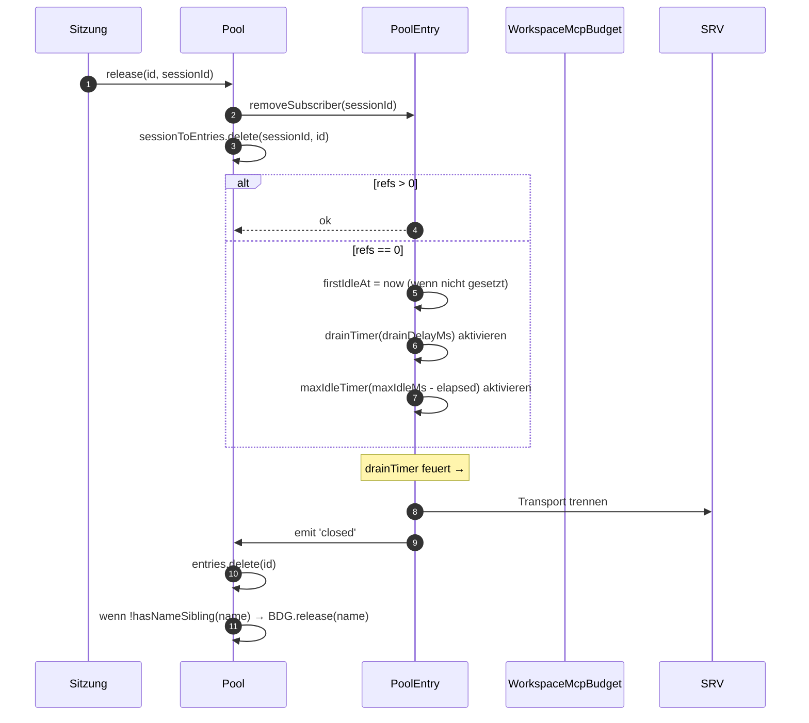
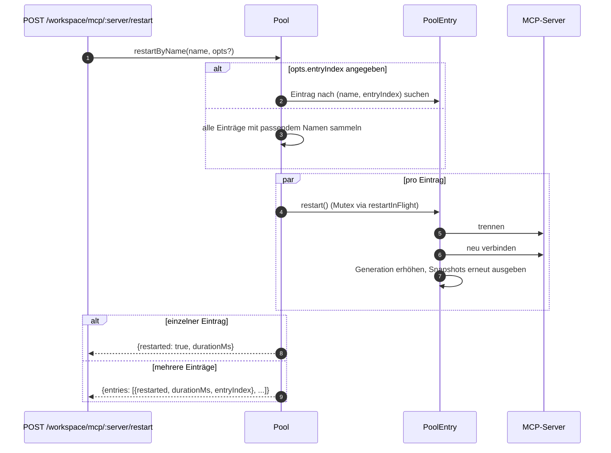
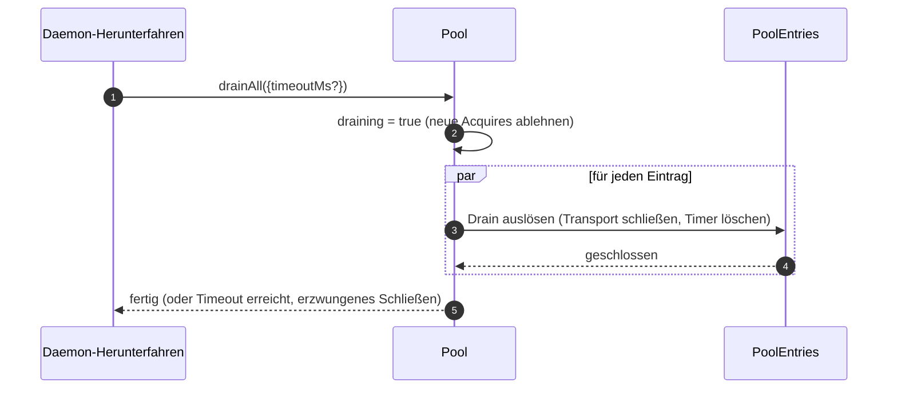

# Workspace MCP Transport Pool

## Überblick

`McpTransportPool` (`packages/core/src/tools/mcp-transport-pool.ts`) ist der F2 (#4175 Commit 5) Workspace-weite Pool: Mehrere ACP-Sitzungen auf einem Daemon teilen sich einen Transport pro eindeutigem `(serverName + configFingerprint)`-Tupel, anstatt dass jede ihren eigenen MCP-Kindprozess startet. Der Pool lebt **innerhalb des ACP-Kindprozesses** (`QwenAgent.mcpPool`), wird einmalig beim Start des Agenten mit der Bootstrap-`Config` des Daemons erstellt und überlebt Sitzungslebenszyklen. Einträge zählen die Referenzen der Sitzungszuordnungen und schließen nach einer konfigurierbaren Nachlaufzeit, wenn der Referenzzähler null erreicht.

Es ist der Hauptmechanismus, der verhindert, dass ein Multi-Sitzungs-Daemon für jede Sitzung eine Kopie jedes MCP-Servers fork-t.

## Verantwortlichkeiten

- Einen MCP-Transport pro `(name + fingerprint)` akquirieren oder spawnen, wobei gleichzeitige Acquires über `spawnInFlight` dedupliziert werden.
- Referenzen pro Sitzung freigeben; den Drain-Timer des Eintrags aktivieren, wenn die letzte Referenz gelöst wird.
- Referenzzähler-Churn mit einem harten `MAX_IDLE_MS`-Limit überleben, sodass ein überlasteter Client einen Leerlauf-Transport nicht ewig am Leben halten kann.
- Referenzen von Sitzungen in einem inversen Index (`sessionToEntries`) zählen, sodass `releaseSession(sessionId)` O(refs) statt O(entries) ist.
- Einträge auf Anfrage (`restartByName`) neu starten – einzelner Eintrag gibt `{restarted, durationMs}` zurück, mehrere Einträge geben `{entries: RestartResult[]}` zurück (F2-Multi-Eintrag-Vertrag).
- Den gesamten Pool beim Herunterfahren des Daemons mit einer konfigurierbaren Timeout-Zeit entleeren; neue Acquires während des Entleerens ablehnen.
- `WorkspaceMcpBudget` (siehe [`06-mcp-budget-guardrails.md`](./06-mcp-budget-guardrails.md)) beim `acquire` konsultieren, um Reservierungsobergrenzen pro Name durchzusetzen; den Slot beim Schließen des Eintrags freigeben, wenn kein Geschwistereintrag denselben Namen hält.
- Pro Sitzung gefilterte Tool/Prompt-Snapshots über `SessionMcpView` erzeugen, sodass eine Discovery in einer Sitzung keine Tools in anderen Sitzungen registriert.

## Architektur

### Öffentliche Oberfläche

```ts
class McpTransportPool {
  constructor(cliConfig: Config, options: McpTransportPoolOptions);
  acquire(
    serverName,
    cfg,
    sessionId,
    sessionToolRegistry,
    sessionPromptRegistry,
  ): Promise<PooledConnection>;
  release(id, sessionId): void;
  releaseSession(sessionId): void;
  restartByName(
    name,
    opts?,
  ): Promise<RestartResult | { entries: RestartResult[] }>;
  drainAll(opts?): Promise<void>;
  getBudget(): WorkspaceMcpBudget | undefined;
  getSnapshot(): McpPoolSnapshot;
}
```

`McpTransportPoolOptions`:

- `workspaceContext: WorkspaceContext` (erforderlich).
- `debugMode: boolean`.
- `sendSdkMcpMessage?` — Callback pro Sitzung (Pool umgeht SDK MCP).
- `pooledTransports?: ReadonlySet<McpTransportKind>` — Standard `{stdio, websocket}`. HTTP/SSE-Transports bleiben standardmäßig ungepoolt, da ihre Header sitzungsspezifischen OAuth-Status enthalten können, aber Betreiber können sie mit `QWEN_SERVE_MCP_POOL_TRANSPORTS` explizit in das Pooling einbeziehen.
- `drainDelayMs?` — Standard `30_000`.
- `entryOptions?: (transport) => PoolEntryOptions`.
- `budget?: WorkspaceMcpBudget`.

### Interner Zustand

| Zustand            | Typ                                     | Zweck                                                                                                              |
| ------------------ | --------------------------------------- | ------------------------------------------------------------------------------------------------------------------ |
| `entries`          | `Map<ConnectionId, PoolEntry>`          | Live-Pool-Einträge, keyed by `connectionIdOf(name, fingerprint)`.                                                  |
| `unpooledIds`      | `Set<ConnectionId>`                     | Einträge für Transports außerhalb der konfigurierten `pooledTransports`-Whitelist.                                 |
| `spawnInFlight`    | `Map<ConnectionId, Promise<PoolEntry>>` | Dedupliziert gleichzeitige kalte Acquires für denselben Schlüssel.                                                 |
| `sessionToEntries` | `Map<string, Set<ConnectionId>>`        | V21-2 inverser Index für O(refs) `releaseSession`.                                                                |
| `draining`         | `boolean`                               | Drain-Mutex – einmal gesetzt, lehnen alle `acquire`-Aufrufe ab.                                                    |
| `nextIndexByName`  | `Map<string, number>`                   | V21-7 monotoner `entryIndex` pro Servername (Dashboards werden nicht neu gemischt, wenn ein neuer Eintrag erscheint). |

### `PoolEntry` (Pro-Eintrag-Struktur, `mcp-pool-entry.ts`)

Zustandsautomat: `spawning → active ⇄ (active ↔ reconnect) → (active → draining beim letzten Detach, draining → active bei attach ODER draining → closed nach Timer)`.

| Feld                                                   | Zweck                                                                                  |
| ------------------------------------------------------ | -------------------------------------------------------------------------------------- |
| `localStatus: MCPServerStatus`                         | Gesteuert durch den `MCPServerStatus`-Lebenszyklus.                                    |
| `state: PoolEntryState`                                | `spawning`/`active`/`draining`/`closed`/`failed`.                                      |
| `generation: number`                                   | Wird bei jedem Neustart erhöht; Abonnenten vergleichen, um Wiederverbindungszyklen zu erkennen. |
| `refs: Set<string>`                                    | Derzeit zugeordnete Sitzungs-IDs.                                                       |
| `subscribers: Map<string, SessionMcpView>`             | Pro Sitzung gefilterte Ansichten.                                                       |
| `subscriberHandles: Map<string, PooledConnectionImpl>` | Von `acquire` zurückgegebene Handles.                                                    |
| `toolsSnapshot[], promptsSnapshot[]`                   | Kanonische Pool-weite Snapshots; werden bei `toolsChanged` / `promptsChanged` neu ausgegeben. |
| `drainTimer?`                                          | Wird aktiviert, wenn `refs.size === 0`; Standard 30s. Wird bei Attach zurückgesetzt.    |
| `maxIdleTimer?`                                        | Wird beim ersten Leerlauf aktiviert; wird durch Acquire/Release-Churn nie zurückgesetzt. Standard 5 Min. |
| `firstIdleAt?`                                         | Wasserzeichen für die harte Max-Idle-Obergrenze.                                        |
| `restartInFlight?`                                     | Mutex für `restart()`.                                                                  |

### `PoolEntryOptions`

```ts
interface PoolEntryOptions {
  drainDelayMs: number; // Standard 30_000
  maxIdleMs: number; // Standard 5 * 60_000
  maxReconnectAttempts: number; // Standard 3 (stdio/ws) oder 5 (http/sse)
  reconnectStrategy:
    | { kind: 'fixed'; delayMs: number }
    | { kind: 'exponential'; baseMs: number; capMs: number };
}
```

`defaultPoolEntryOptions(transport)` (`mcp-pool-entry.ts`) gibt für stdio/ws Standardwerte `{fixed 5s, 3 attempts}` und für http/sse Standardwerte `{exponential 1s → 16s, 5 attempts}` zurück. Fern-Transports erhalten längere Wiederholungsbudgets, da ihre Ausfälle häufiger transient sind.

## Arbeitsablauf

### `acquire`

```mermaid
sequenceDiagram
    autonumber
    participant S as Sitzung
    participant P as Pool
    participant SIF as spawnInFlight
    participant E as PoolEntry
    participant BDG as WorkspaceMcpBudget
    participant SRV as MCP-Server

    S->>P: acquire(name, cfg, sessionId, sessionToolRegistry, sessionPromptRegistry)
    P->>P: ablehnen, wenn draining
    P->>P: connectionId = connectionIdOf(name, fingerprint)
    P->>P: wenn !isPoolable(cfg) → als ungepoolt markieren
    alt Eintrag in entries (warm)
        E-->>P: vorhandener PoolEntry
    else Cold-Spawn in Bearbeitung
        SIF-->>P: vorhandener Promise<PoolEntry>
    else Kaltstart
        P->>BDG: tryReserve(name) (wenn Budget gesetzt + poolable)
        BDG-->>P: 'reserved' | 'already_held' | 'refused'
        alt refused
            P->>BDG: recordRefusal(name, transport)
            P-->>S: BudgetExhaustedError
        else ok
            P->>E: spawnEntry(name, cfg)
            E->>SRV: Transport verbinden
            SRV-->>E: bereit
            P->>P: entries.set(id, E); nextIndexByName++
            E-->>P: verbunden
        end
    end
    P->>E: addSubscriber(sessionId, sessionToolRegistry, sessionPromptRegistry)
    P->>P: sessionToEntries.add(sessionId, id)
    P->>P: Drain-Timer abbrechen (refs>0)
    P-->>S: PooledConnection { id, serverName, entryIndex, client, toolsSnapshot, promptsSnapshot, on, off, release }
```

### `release` + Drain



`hasNameSibling(name)` (`mcp-transport-pool.ts`) iteriert sowohl über `entries.values()` als auch über `spawnInFlight.keys()` und parst letztere mit `parseConnectionId` (Servernamen können legitimerweise `::` enthalten, daher würde `startsWith` bei einem Geschwisternamen, der mit `${name}::` beginnt, einen Fehlalarm auslösen).

`releaseSession(sessionId)` liest aus `sessionToEntries`, gibt alle referenzierten Einträge in O(refs) frei und löscht dann den Indexeintrag. Wird vom Sitzungs-Schließpfad der Brücke verwendet, sodass der gesamte Eintrags-Map nicht iteriert werden muss.

### `restartByName`



Die Vorab-Budgetprüfung auf der HTTP-Ebene des Daemons gibt `{restarted:false, skipped:true, reason:'budget_would_exceed'}` (Wave 4-Mutationskontrolle) zurück, wenn der Slot des Ziels nicht bereits reserviert ist und ein Neustart die Live-Anzahl über das `enforce`-Budget drücken würde.

### `drainAll`



## Zustand & Lebenszyklus

- Die Pool-Erstellung ist synchron; der erste `acquire` startet einen Transport kalt.
- `drainDelayMs` (Standard 30s) wird bei Attach auf Löschung zurückgesetzt.
- `maxIdleMs` (Standard 5 Min.) wird **niemals** durch Attach/Detach zurückgesetzt – es beginnt beim ERSTEN Leerlauf zu ticken und stoppt nur, wenn der Eintrag tatsächlich schließt oder sich vor Ablauf der Frist neu verbindet. Schutz gegen überlastete Clients.
- `nextIndexByName` ist monoton. Alte Einträge behalten ihren zugewiesenen Index, auch nachdem neuere erschienen sind, sodass Dashboards, die `entryIndex` lesen, nicht neu mischen.
- Fehlgeschlagener Spawn gibt den reservierten Budget-Slot frei (V21-4 – ohne dies würde ein kalter Spawn, der während der Verbindung abstürzt, die Reservierung für immer verlieren).

## Abhängigkeiten

- `packages/core/src/tools/mcp-client.ts` — `McpClient`, Status-Enum, `SendSdkMcpMessage`.
- `packages/core/src/tools/mcp-pool-entry.ts` — `PoolEntry`, `PoolEntryOptions`, `defaultPoolEntryOptions`.
- `packages/core/src/tools/mcp-pool-key.ts` — `connectionIdOf`, `parseConnectionId`, `isPoolable`, `mcpTransportOf`, `POOLED_TRANSPORTS_DEFAULT`.
- `packages/core/src/tools/mcp-pool-events.ts` — `ConnectionId`, `PoolEntryState`, `PoolEvent`.
- `packages/core/src/tools/session-mcp-view.ts` — Pro-Sitzungs-Ansicht, die Pool-Snapshots filtert.
- `packages/core/src/tools/mcp-workspace-budget.ts` — `WorkspaceMcpBudget` (siehe [`06-mcp-budget-guardrails.md`](./06-mcp-budget-guardrails.md)).
- `packages/core/src/tools/mcp-discovery-timeout.ts` — `discoveryTimeoutFor`, `runWithTimeout`.

## Konfiguration

| Quelle                        | Einstellung                                                  | Effekt                                                                                                     |
| ----------------------------- | ------------------------------------------------------------ | ---------------------------------------------------------------------------------------------------------- |
| Umgebungsvariable             | `QWEN_SERVE_NO_MCP_POOL=1`                                   | Kill-Switch – `QwenAgent.mcpPool` bleibt undefiniert; pro Sitzung `McpClientManager` greift (Pre-F2-Pfad).|
| Flag                          | `--mcp-client-budget=N`, `--mcp-budget-mode={off,warn,enforce}` | Wird an den ACP-Kindprozess über `childEnvOverrides` weitergeleitet; Kind erstellt `WorkspaceMcpBudget` und übergibt an Pool. |
| Capability-Tags (bedingt)     | `mcp_workspace_pool`, `mcp_pool_restart`                     | Werden zusammen beworben, wenn der Pool aktiv ist. SDK prüft beide vorab, um auf Pool-bewusste Antwortformen umzuschalten. |

### Ungepoolte Einträge (HTTP / SSE / SDK-MCP)

Transports außerhalb der konfigurierten `pooledTransports`-Whitelist (HTTP, SSE und SDK-MCP standardmäßig) nehmen einen separaten Pfad: `createUnpooledConnection(name, cfg, sessionId, ...)` (`mcp-transport-pool.ts`) erstellt einen Pro-Sitzungs-Eintrag mit der ID `${name}::unpooled-${entryIndex}`. Unterschiede zu gepoolten Einträgen:

- Gespeichert in `entries` UND verfolgt in `unpooledIds: Set<ConnectionId>`, sodass `release` / `releaseSession` das Close-on-Detach-Verhalten schnell durchführen kann (refs sind immer maximal 1).
- `McpClient.discover()` wird direkt verwendet anstelle von Pool-Wiederholung; `applyTools` / `applyPrompts` sind No-Ops, da die Sitzungsregister bereits das Registrierte enthalten (W77 / `skipReplay: true` in `attach()`).
- Workspace-Budget schützt sie trotzdem – das F2-Budget-Follow-up schloss die vorherige Lücke, bei der ungepoolte Verbindungen `tryReserve` umgingen; derselbe `WorkspaceMcpBudget`-Slot wird reserviert und beim Schließen des Eintrags freigegeben (ob gepoolt oder ungepoolt).

Der W77-Race (`cb206da36`): `createUnpooledConnection` speichert den Eintrag in `this.entries`, BEVOR auf `client.connect()` / `client.discover()` gewartet wird, indiziert aber `sessionToEntries[sessionId]` erst NACH erfolgreichem `attach()`. Ein gleichzeitiges `closeStoredSession()` / `releaseSession(sessionId)` während des Connect/Discover-Fensters sah einen leeren Index, ließ den ungepoolten Spawn beenden, und `attach()` registrierte dann Tools/Prompts in einer bereits geschlossenen Sitzung. Die Lösung:

- `mcp-pool-entry.ts`: öffentlicher `isTerminated(): boolean`-Test (`state === 'closed' || state === 'failed'`).
- `mcp-pool-entry.ts`: `markActive()` bricht kurz ab, wenn `isTerminated()` wahr ist, sodass ein abgebauter Eintrag nicht wieder auf `'active'` gesetzt werden kann.
- Aufrufer (der ungepoolte Pfad des Pools) prüfen `isTerminated()` zwischen den Awaits und brechen den Attach ab, wenn die übergeordnete Sitzung verschwunden ist.

Dieser Race war zum Zeitpunkt der Implementierung latent (die pro-Sitzung `releaseSession`-Hooks von W61/W71 landen in F4), würde aber aktiv werden, sobald dieser Hook eintrifft. Die Lösung wurde früh in der F2-Serie angewendet.

## `GET /workspace/mcp` Pool-bewusste Snapshot-Felder

Wenn der Pool aktiv ist, enthält jede `ServeWorkspaceMcpStatus`-Serverzelle
(`packages/acp-bridge/src/status.ts`) drei zusätzliche Felder:

| Feld            | Typ                                        | Zweck                                                                                                                                                                                                                                                                                                                                       |
| ---------------- | ------------------------------------------- | --------------------------------------------------------------------------------------------------------------------------------------------------------------------------------------------------------------------------------------------------------------------------------------------------------------------------------------------- |
| `disabledReason` | `'config' \| 'budget'`                      | Unterscheidet vom Betreiber deaktivierte Server (`disabled: true` aus `disabledMcpServers`) von Budget-Verweigerung (`status: 'error', errorKind: 'budget_exhausted'`). Dashboards können eine Serverzeile rendern, ohne `errors[]` oder `budgets[]` querlesen zu müssen.                                                                                              |
| `entryCount`     | `number` (`>=1`)                            | Im Pool-Modus kann ein Workspace mehrere `PoolEntry`-Instanzen mit demselben Namen haben, wenn Sitzungen unterschiedliche Fingerprints wie pro-Sitzung OAuth-Header injizieren. Dieses Feld fehlt, wenn `QWEN_SERVE_NO_MCP_POOL=1` den Pool deaktiviert. Neue Clients zeigen ein "N entries"-Badge, wenn `entryCount > 1`. |
| `entrySummary`   | `ReadonlyArray<{entryIndex, refs, status}>` | Aufschlüsselung pro Eintrag. `entryIndex` ist die stabile undurchsichtige Ganzzahl, die bei der Erstellung des Eintrags zugewiesen wurde; es ist nicht der rohe Fingerprint, sodass Snapshot-Diffs keine OAuth- oder Umgebungsrotations-Zeiten preisgeben. `refs` ist die aktuelle Anzahl zugeordneter Sitzungen. `status` ermöglicht es Dashboards, die Gesundheit pro Eintrag anzuzeigen, während der aggregierte `mcpStatus` bereits verbunden ist. |

`(entryCount, entrySummary)` werden immer als Paar gesendet. Das
`mcp_workspace_pool`-Capability-Tag impliziert beide Felder. Ältere SDK-Clients
ignorieren sie unter dem additiven Protokollvertrag.

Pool-Snapshots machen auch `subprocessCount` verfügbar. Es zählt nur die
`'stdio'`-Familie. WebSocket-, HTTP- und SSE-Transports verbinden sich mit
Remoteservern und starten keine lokalen Kindprozesse. Frühe Versionen zählten
WebSocket-Transports als lokale Kindprozesse, was Ressourcen-Dashboards
aufblähte.

## Drain läuft von beiden Herunterfahrpfaden

Pool-Drain ist nicht auf den SIGTERM-Handler beschränkt. Der normale IDE-Herunterfahrpfad (`await connection.closed`) ruft ebenfalls `drainAll` über
`packages/cli/src/acp-integration/acpAgent.ts`'s `drainPoolBeforeExit` auf. Ob
der Daemon ein Prozesssignal erhält oder die IDE ihre Verbindung sauber
schließt, der Pool wechselt in den `draining`-Zustand, lehnt neue Acquires ab
und wartet auf das Schließen der Einträge.

## `/mcp refresh` teilt den Boot-Discovery-Pfad

`discoverAllMcpTools` (Boot-Discovery) und
`discoverAllMcpToolsIncremental` (`/mcp refresh` / Hot Reload) konsultieren
beide zuerst den Pool im Pool-Modus (`packages/core/src/tools/mcp-client-manager.ts`). Das
gemeinsame Gate verhindert, dass Hot Reload versehentlich einen
Pro-Sitzungs-Client erstellt, Budget doppelt zählt oder einen verwaisten
Transport hinterlässt.

## In-Flight-Tool-Aufrufe während der Wiederverbindung (`MCPCallInterruptedError`)

Wenn der zugrunde liegende MCP-Transport still trennt (die Verbindung springt
von `'active'` / `'draining'` zu `localStatus === DISCONNECTED` ohne explizites
Close), markiert der Pool den Eintrag als `'failed'`, entfernt ihn aus
`pool.entries` und emittiert das `failed`-Ereignis, bevor die
Abonnentenansichten gelöst werden. Diese Reihenfolge (Emit vor Detach) ist
wichtig: Abonnenten erhalten das `failed`-Ereignis rechtzeitig, um
ausstehende `callTool`-Promises an `MCPCallInterruptedError` weiterzuleiten,
sodass ein hängendes `await client.callTool(...)` sauber abgelehnt wird, anstatt
zu hängen. `forceShutdown` verwendet dieselbe Reihenfolge (Emit-dann-Detach).
## Fingerprint- und `canonicalOAuth`-Normalisierung

Der Pool-Key stammt von `fingerprint(cfg)` in `mcp-pool-key.ts`. Der Hash umfasst alle transportdefinierenden Felder:

> `transport, command, args, cwd, env, url, httpUrl, tcp, headers, timeout, oauth`

Filter- und Metadatenfelder pro Sitzung (`includeTools`, `excludeTools`, `trust`, `description`, `extensionName`, `discoveryTimeoutMs`) werden ausgeschlossen, sodass Sitzungen mit unterschiedlichen Filtern einen gemeinsamen Eintrag nutzen können.

Für die OAuth-Zelle hasht `canonicalOAuth(o)` jedes `MCPOAuthConfig`-Feld: `clientId`, `clientSecret`, sortierte `scopes`, sortierte `audiences`, `authorizationUrl`, `tokenUrl`, `redirectUri`, `tokenParamName` und `registrationUrl`. Dies ist der Credential-Isolationsvertrag: Zwei Sitzungskonfigurationen, die sich nur durch `clientSecret`, `audiences` oder `redirectUri` unterscheiden, erhalten unterschiedliche Fingerprints und können keinen gemeinsamen Eintrag nutzen. Vertrauliche Clients und Multi-Audience-Token-Bereitstellungen hängen davon ab.

Das Sortieren von `scopes` und `audiences` macht die Aufrufreihenfolge irrelevant. Explizites `null` wird normalisiert, sodass undefinierte Felder denselben Hash wie explizites `null` ergeben. Der Schlüssel enthält kein `discoveryTimeoutMs`; gleichzeitige `acquire`-Aufrufe mit demselben Schlüssel, aber unterschiedlichen Timeouts, folgen dem "First Wins"-Prinzip, was dem Verhalten des Pro-Sitzungs-Managers vor F2 entspricht.

`PoolEntry` hält `cfg: MCPServerConfig` privat. Externer Code muss den Getter `entry.transportKind` verwenden, wenn er die Transportfamilie benötigt. Dadurch wird verhindert, dass Umgebungs-, Header-Auth- und OAuth-Felder versehentlich an Konsumenten durchsickern.

## Entladen von Erweiterungen basiert auf `MAX_IDLE_MS`

Es gibt absichtlich keinen aktiven Bereinigungspfad zum Entladen einer MCP-Erweiterung zur Laufzeit. Verwaiste Einträge, deren `MCPServerConfig` nicht mehr in den zusammengeführten Arbeitsbereichseinstellungen erscheint, werden durch die harte Obergrenze von `MAX_IDLE_MS` nach der Abmeldung des letzten Abonnenten natürlich zurückgewonnen. Ein synchroner Entlade-Bereinigungspfad würde für einen seltenen Operator-Grenzfall Komplexität hinzufügen; die harte Obergrenze begrenzt die Lebensdauer verwaister Prozesse ab dem Entladepunkt standardmäßig auf 5 Minuten.

Betreiber, die eine schnellere Bereinigung benötigen, können den Daemon neu starten oder `POST /workspace/mcp/:server/restart` für den nun nicht konfigurierten Namen aufrufen, was den Pfad für deaktivierte Server durchläuft und den Eintrag abbaut.

## Beobachtbarkeit der Selbstheilung

Der Pool gibt zwei strukturierte Diagnoseinformationen auf dem Selbstheilungspfad aus:

**`McpClient.lastTransportError: Error | undefined`** (`packages/core/src/tools/mcp-client.ts`) — `McpClient.onerror` speichert die neueste Transportausnahme in einem privaten Feld und löscht sie beim Eintritt in `connect()`. Der `PoolEntry`-Stille-Drop-Pfad liest `client.getLastTransportError()` und gibt es in `emit({kind:'failed', lastError})` weiter, sodass Abonnenten und Dashboards nicht stderr nach der Ursache durchsuchen müssen.

**`SweepResult`** (internes Interface, nicht exportiert; `packages/core/src/tools/mcp-pool-entry.ts`) — `sweepAndDisconnect(reason)` gibt `Promise<SweepResult>` zurück:

```ts
interface SweepResult {
  pidSweepError?: Error; // listDescendantPids itself threw
  descendantsFound?: number; // descendant pid count found
  descendantsSignaled?: number; // successfully SIGTERM'd count
}
```

Der einzige Konsument ist der Stille-Drop-Block in `statusChangeListener`. Er verwendet `descendantsFound` / `descendantsSignaled`, um Fälle von teilweiser Signalisierung zu erkennen (weniger Prozesse signalisiert als gefunden, normalerweise weil ein Prozess zwischen `listDescendantPids` und `sigtermPids` beendet wurde oder EPERM auftrat) und Sweep-Fehler, und protokolliert dann eine strukturierte Warnung. `forceShutdown` und `doRestart` ignorieren diesen Rückgabewert, da ihre Catch-Pfade bereits reichhaltigere Fehlersignale enthalten.

## Subprozess-Bereinigung: der `pid-descendants`-Snapshot-Pfad

Wenn `McpTransportPool` stdio-Subprozesse herunterfährt, muss es deren Nachkommenprozesse aufzählen; `npx`-Wrapper und Shell-Wrapper können mehrere Fork-Ebenen erzeugen. `packages/core/src/tools/pid-descendants.ts` stellt `listDescendantPids(rootPid) → Promise<number[]>` und `sigtermPids(pids)` für `sweepAndDisconnect` bereit.

### Primärer Pfad unter Linux / macOS

Ein einzelner Snapshot `ps -A -o pid=,ppid=` liest die Prozesstabelle, parst sie in `Map<ppid, pid[]>`, dann führt `walkDescendants(tree, root)` eine BFS durch, um den Teilbaum zu extrahieren. Jede Tiefe erfordert nur einen `ps`-Fork.

`walkDescendants` verwaltet `visited: Set<number>` und fügt `root` in die Menge ein, um gegen PID-Wiederverwendungszyklen zu schützen. Bei schnellem Prozesswechsel kann der Snapshot theoretisch A→B / B→A-Schleifen enthalten. Ohne `visited` könnte der Walker das `MAX_DESCENDANTS`-Kontingent mit falschen Daten füllen und echte Nachkommen verdrängen.

### Primärer Pfad unter Windows

Ein einzelner Snapshot mit `Get-CimInstance Win32_Process | ConvertTo-Csv -Delimiter ","` gibt alle Zeilen `(ProcessId, ParentProcessId)` aus, dann wird dieselbe `Map`- und `walkDescendants`-Logik ausgeführt.

Das explizite `-Delimiter ","` ist erforderlich. PowerShell 5.1, das mit Windows ausgeliefert wird, verwendet standardmäßig das Listentrennzeichen des Systemgebietsschemas für `ConvertTo-Csv`; Gebietsschemata wie DE, FR, NL, IT und ähnliche verwenden `;`, sodass der Parser vor der Korrektur `^"(\d+)","(\d+)"$` nie zuschlug und jedes Herunterfahren des Daemons auf den Pro-PID-CIM-Filterpfad zurückfiel, was etwa 0,5–1 s PowerShell-Startkosten pro Kindprozess hinzufügte.

### Fallback-Pfad

BusyBox `<v1.28` fehlt `ps -o`, distroless Container enthalten möglicherweise kein `ps`, und einige Windows-Umgebungen kürzen CIM-Ausgaben über ACLs. Wenn der primäre Pfad null Zeilen parst oder eine Ausnahme auslöst, fällt der Code auf eine Pro-PID-BFS zurück: Linux/macOS verwenden `pgrep -P <pid>`, und Windows verwendet `Get-CimInstance -Filter "ParentProcessId=$p"` wobei `$p` eine PowerShell-Variablebindung und keine Zeichenfolgenverkettung ist. Die aktuelle `Number.isInteger`-Prüfung ist für den Einstiegspunkt ausreichend; die Bindung dient als Verteidigung in der Tiefe.

### Gemeinsame Einschränkungen

Beide Pfade sind durch `MAX_DESCENDANTS = 256` und `MAX_DEPTH = 8` begrenzt, um zu verhindern, dass ein bösartiger oder degenerierter Prozessbaum den Sweep verlangsamt.

Der Snapshot-Pfad verwendet `maxBuffer: 8MB`, ausreichend für pathologische Hosts mit etwa 250.000 Prozessen. Der Standardpuffer von Node mit 1 MB kann die Ausgabe von Kindprozessen bei etwa 30.000 Prozessen abschneiden.

Der Leistungsgewinn ist bewusst bescheiden (typische Entwicklungsmaschinen mit 200–500 Prozessen parsen in unter 10 ms, etwa 2× schneller als Pro-PID-`pgrep`). Der Hauptvorteil ist die Fork-Hygiene und Snapshot-Konsistenz: BFS sieht den gesamten Teilbaum auf einmal, während der vorherige Pro-PID-Abfragepfad einen Enkel, der zwischen zwei Abfragen geforkt wurde, übersehen konnte.

## Hinweis für Einbettende: `McpClientManager`-Konstruktor

`McpClientManager` wird als `(config, toolRegistry, options?: McpClientManagerOptions)` konstruiert. Einbettende, die die Klasse direkt importieren, sollten übergeben:

```ts
new McpClientManager(config, toolRegistry, {
  eventEmitter,
  sendSdkMcpMessage,
  healthConfig,
  budgetConfig,
  pool,
});
```

Tests sollten eine `mkManager(overrides?)`-Factory bevorzugen, sodass Fälle, die nur ein oder zwei Felder betreffen, in einer Zeile bleiben.

## Implementierungshinweise

Diese Hilfsfunktionen sind intern, aber Leser des Quellcodes können sie sehen:

- `McpTransportPool.acquire()` verwendet `attachPooledSession` und `rollbackReservationOnSpawnFailure`, um das Fast-Path-Anhängen, das Anhängen nach dem Start und das gebündelte Verhalten von "Spawn in Flight" zu teilen. Das Laufzeitverhalten ist unverändert; die Invarianten der Race-Fenster liegen weiterhin an den Aufrufstellen.
- `SessionMcpView.applyTools` / `applyPrompts` kompilieren `includeTools` / `excludeTools` einmal über `compileNameFilter(cfg)` und prüfen jedes Tool mit `compiledFilterAccepts(compiled, name)`. Die exportierten `passesSessionFilter` / `passesSessionPromptFilter` verwenden denselben kompilierten Pfad. `excludeTools` ist eine exakte Übereinstimmung; `includeTools` entfernt das erste `(...)`-Suffix, sodass `toolName(args)` mit `toolName` übereinstimmt.

Design-Dokument: [`../../design/f2-mcp-transport-pool.md`](../../design/f2-mcp-transport-pool.md) §6 behandelt die Transport-Pool-Zustandsmaschine, Wiederverbindung, Drain und Descendant-Sweep-Pfade.

## Einschränkungen & Bekannte Grenzen

- **HTTP-/SSE-Transports sind standardmäßig nicht gepoolt** — sofern Operatoren sie nicht explizit in `QWEN_SERVE_MCP_POOL_TRANSPORTS` aufnehmen, erstellt jeder `acquire`-Aufruf einen neuen Eintrag, der nur so lange wie seine Sitzung lebt. Ihre Header können sitzungsspezifischen OAuth-Status enthalten, daher würde das Standard-Poolen das Risiko von Credential-Leaks über Sitzungen hinweg bergen.
- **`maxIdleMs` ist eine harte Obergrenze, die Anhänge-/Abmeldewechsel überlebt.** Eine 5-minütige Leerlauf-Obergrenze bedeutet, dass selbst ein aggressiv an- und abmeldender Client einen Leerlauf-Transport nicht länger als 5 Minuten halten kann. Betreiber, die dauerhafte langlebige Transports wünschen, sollten `maxIdleMs` erhöhen oder den Server außerhalb des Pools ausführen.
- **Budget-Plätze pro Servername** bedeuten, dass zwei Pool-Einträge, die denselben Namen, aber unterschiedliche Fingerprints teilen, zusammen EINEN Slot belegen, nicht zwei. Die Subprozess-Zählung wird separat über `pool.getSnapshot().subprocessCount` bereitgestellt.
- **`startsWith`-Regression** wurde in `hasNameSibling` vermieden, weil MCP-Servernamen legitimerweise `::` enthalten können (`mcp-pool-key.test.ts`). Verwenden Sie immer die `lastIndexOf('::')`-Aufteilung von `parseConnectionId`, niemals String-Präfix-Vergleiche.
- **Pool-Draining ist unidirektional** — `drainAll` setzt `draining = true` dauerhaft; für weitere Arbeiten ist ein neuer Pool erforderlich.

## Referenzen

- `packages/core/src/tools/mcp-transport-pool.ts` (gesamte Datei)
- `packages/core/src/tools/mcp-pool-entry.ts` (Eintragslebenszyklus)
- `packages/core/src/tools/mcp-pool-key.ts` (`connectionIdOf`, `parseConnectionId`)
- `packages/core/src/tools/mcp-pool-events.ts` (Ereignistypen)
- `packages/core/src/tools/session-mcp-view.ts` (gefilterte Ansicht pro Sitzung)
- F2-Design-Dokument (v2.2, mit dem 32-Änderungs-Changelog): [`../../design/f2-mcp-transport-pool.md`](../../design/f2-mcp-transport-pool.md). Behandeln Sie den Design-Vertrag als maßgeblich; diese Seite ist der tiefgehende Entwickler-Einblick.
- F2-Design-Notizen: Issue [#4175](https://github.com/QwenLM/qwen-code/issues/4175) (Commits 4-6 der F2-Serie).