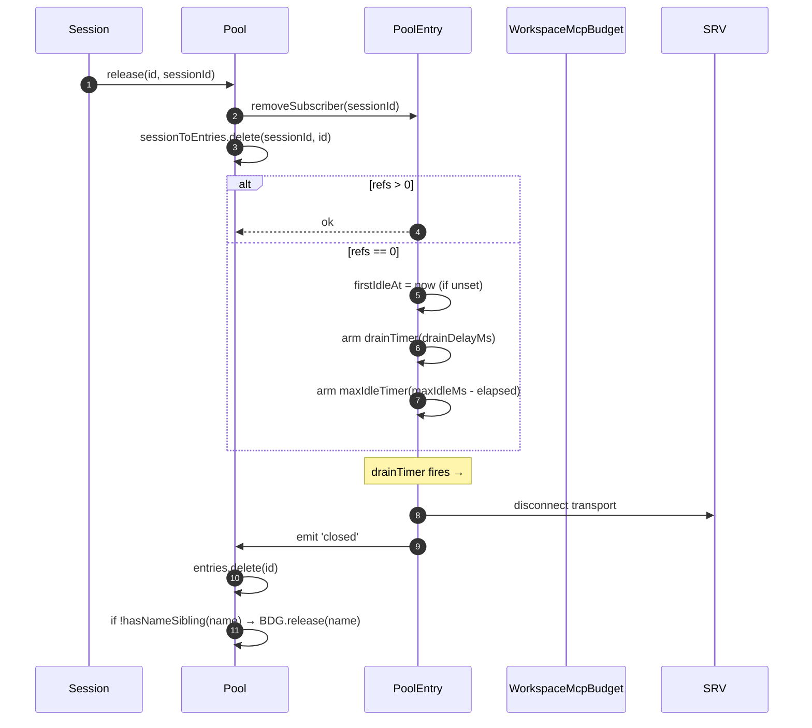
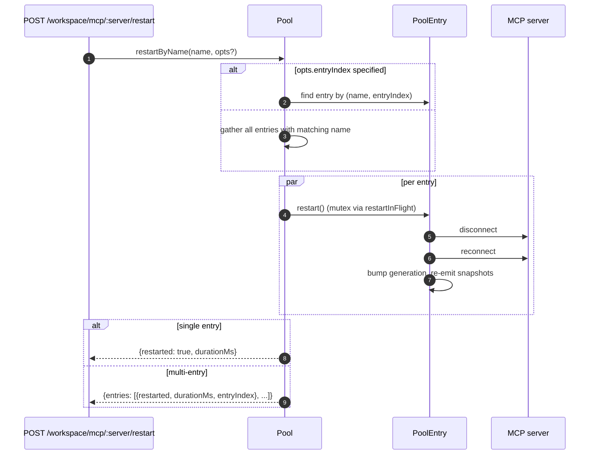
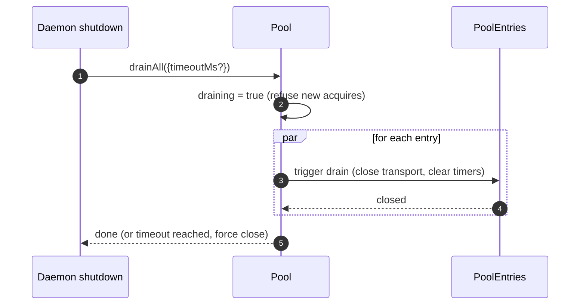

# Workspace MCP Transport Pool

## Übersicht

`McpTransportPool` (`packages/core/src/tools/mcp-transport-pool.ts`) ist der F2 (#4175 Commit 5) arbeitsbereichsbezogene Pool: Mehrere ACP-Sitzungen auf einem Daemon teilen sich einen Transport pro eindeutigem `(serverName + configFingerprint)`-Tuple, anstatt dass jede ihren eigenen MCP-Kindprozess startet. Der Pool lebt **innerhalb des ACP-Kindes** (`QwenAgent.mcpPool`), wird einmalig beim Agentenstart mit dem Bootstrap-`Config` des Daemons erstellt und überlebt Sitzungslebenszyklen. Einträge zählen Sitzungsverknüpfungen referenziell und werden nach einer konfigurierbaren Gnadenfrist geschlossen, wenn der Referenzzähler null erreicht.

Es ist der Hauptmechanismus, der verhindert, dass ein Multi-Session-Daemon für jede Sitzung eine Kopie jedes MCP-Servers erzeugt.

## Verantwortlichkeiten

- Einen MCP-Transport pro `(name + fingerprint)` anfordern oder starten, gleichzeitige Anforderungen über `spawnInFlight` deduplizieren.
- Sitzungsspezifische Referenzen freigeben; den Drain-Timer des Eintrags aktivieren, wenn die letzte Referenz getrennt wird.
- Überlebe Referenzzähler-Fluktuation mit einer harten `MAX_IDLE_MS`-Obergrenze, sodass ein überlasteter Client einen Leerlauf-Transport nicht auf unbestimmte Zeit am Leben erhalten kann.
- Sitzungen in einem inversen Index (`sessionToEntries`) referenzzählen, sodass `releaseSession(sessionId)` O(refs) statt O(entries) ist.
- Einträge bei Bedarf neu starten (`restartByName`) – Einzeleintrag gibt `{restarted, durationMs}` zurück, mehrere Einträge geben `{entries: RestartResult[]}` zurück (F2-Multi-Eintrag-Vertrag).
- Den gesamten Pool beim Herunterfahren des Daemons mit einem konfigurierbaren Timeout leeren; neue Anforderungen während des Leerens ablehnen.
- `WorkspaceMcpBudget` konsultieren (siehe [`06-mcp-budget-guardrails.md`](./06-mcp-budget-guardrails.md)) bei `acquire`, um Namensreservierungsobergrenzen durchzusetzen; den Slot freigeben, wenn der Eintrag geschlossen wird und kein verwandter Eintrag denselben Namen hält.
- Pro Sitzung gefilterte Tool-/Prompt-Snapshots über `SessionMcpView` erstellen, sodass eine Erkennung in einer Sitzung keine Tools in anderen Sitzungen registriert.

## Architektur

### Öffentliche Oberfläche

```ts
class McpTransportPool {
  constructor(cliConfig: Config, options: McpTransportPoolOptions);
  acquire(
    serverName,
    cfg,
    sessionId,
    sessionToolRegistry,
    sessionPromptRegistry,
  ): Promise<PooledConnection>;
  release(id, sessionId): void;
  releaseSession(sessionId): void;
  restartByName(
    name,
    opts?,
  ): Promise<RestartResult | { entries: RestartResult[] }>;
  drainAll(opts?): Promise<void>;
  getBudget(): WorkspaceMcpBudget | undefined;
  getSnapshot(): McpPoolSnapshot;
}
```

`McpTransportPoolOptions`:

- `workspaceContext: WorkspaceContext` (erforderlich).
- `debugMode: boolean`.
- `sendSdkMcpMessage?` — sitzungsspezifischer Callback (Pool umgeht SDK MCP).
- `pooledTransports?: ReadonlySet<McpTransportKind>` — Standard `{stdio, websocket}`. HTTP/SSE-Transporte bleiben standardmäßig ungepoolt, da ihre Header sitzungsspezifischen OAuth-Status enthalten können, aber Betreiber können sie explizit mit `QWEN_SERVE_MCP_POOL_TRANSPORTS` ins Pooling aufnehmen.
- `drainDelayMs?` — Standard `30_000`.
- `entryOptions?: (transport) => PoolEntryOptions`.
- `budget?: WorkspaceMcpBudget`.

### Interner Zustand

| Zustand             | Typ                                    | Zweck                                                                                              |
| ------------------- | --------------------------------------- | ---------------------------------------------------------------------------------------------------- |
| `entries`           | `Map<ConnectionId, PoolEntry>`          | Live-Pool-Einträge, indiziert mit `connectionIdOf(name, fingerprint)`.                              |
| `unpooledIds`       | `Set<ConnectionId>`                     | Einträge für Transporte außerhalb der konfigurierten `pooledTransports`-Erlaubnisliste.             |
| `spawnInFlight`     | `Map<ConnectionId, Promise<PoolEntry>>` | Dedupliziert gleichzeitige Kaltanforderungen für denselben Schlüssel.                               |
| `sessionToEntries`  | `Map<string, Set<ConnectionId>>`        | V21-2 inverser Index für O(refs) `releaseSession`.                                                 |
| `draining`          | `boolean`                               | Drain-Mutex – wenn gesetzt, lehnen alle `acquire`-Aufrufe ab.                                      |
| `nextIndexByName`   | `Map<string, number>`                   | V21-7 monotoner `entryIndex` pro Servername (Dashboards werden nicht neu gemischt, wenn ein neuer Eintrag erscheint). |

### `PoolEntry` (Eintragsstruktur, `mcp-pool-entry.ts`)

Zustandsmaschine: `spawning → active ⇄ (active ↔ reconnect) → (active → draining bei letztem Trennen, draining → active bei Verbinden ODER draining → closed nach Timer)`.

| Feld                                                  | Zweck                                                                         |
| ------------------------------------------------------ | ------------------------------------------------------------------------------- |
| `localStatus: MCPServerStatus`                         | Gesteuert durch den `MCPServerStatus`-Lebenszyklus.                             |
| `state: PoolEntryState`                                | `spawning`/`active`/`draining`/`closed`/`failed`.                               |
| `generation: number`                                   | Wird bei jedem Neustart erhöht; Abonnenten vergleichen, um Wiederverbindungszyklen zu erkennen. |
| `refs: Set<string>`                                    | Derzeit verbundene Sitzungs-IDs.                                                 |
| `subscribers: Map<string, SessionMcpView>`             | Pro Sitzung gefilterte Ansichten.                                                |
| `subscriberHandles: Map<string, PooledConnectionImpl>` | Von `acquire` zurückgegebene Handles.                                            |
| `toolsSnapshot[], promptsSnapshot[]`                   | Kanonische Pool-Ebene-Snapshots; werden bei `toolsChanged` / `promptsChanged` neu ausgestellt. |
| `drainTimer?`                                          | Aktiviert, wenn `refs.size === 0`; Standard 30s. Wird bei Verbindung zurückgesetzt. |
| `maxIdleTimer?`                                        | Wird bei erstem Leerlauf aktiviert; niemals durch Acquire/Release-Fluktuation zurückgesetzt. Standard 5 Min. |
| `firstIdleAt?`                                         | Wasserzeichen für die harte Max-Idle-Obergrenze.                                 |
| `restartInFlight?`                                     | Mutex für `restart()`.                                                          |
### `PoolEntryOptions`

```ts
interface PoolEntryOptions {
  drainDelayMs: number; // default 30_000
  maxIdleMs: number; // default 5 * 60_000
  maxReconnectAttempts: number; // default 3 (stdio/ws) or 5 (http/sse)
  reconnectStrategy:
    | { kind: 'fixed'; delayMs: number }
    | { kind: 'exponential'; baseMs: number; capMs: number };
}
```

`defaultPoolEntryOptions(transport)` (`mcp-pool-entry.ts`) gibt für stdio/ws die Standardwerte `{fixed 5s, 3 Versuche}` und für http/sse die Standardwerte `{exponential 1s → 16s, 5 Versuche}` zurück. Remote-Transporte erhalten längere Wiederholungsbudgets, da ihre Fehler häufiger vorübergehender Natur sind.

## Workflow

### `acquire`

```mermaid
sequenceDiagram
    autonumber
    participant S as Session
    participant P as Pool
    participant SIF as spawnInFlight
    participant E as PoolEntry
    participant BDG as WorkspaceMcpBudget
    participant SRV as MCP server

    S->>P: acquire(name, cfg, sessionId, sessionToolRegistry, sessionPromptRegistry)
    P->>P: refuse if draining
    P->>P: connectionId = connectionIdOf(name, fingerprint)
    P->>P: if !isPoolable(cfg) → mark unpooled
    alt entry in entries (warm)
        E-->>P: existing PoolEntry
    else inflight cold spawn
        SIF-->>P: existing Promise<PoolEntry>
    else cold start
        P->>BDG: tryReserve(name) (if budget set + poolable)
        BDG-->>P: 'reserved' | 'already_held' | 'refused'
        alt refused
            P->>BDG: recordRefusal(name, transport)
            P-->>S: BudgetExhaustedError
        else ok
            P->>E: spawnEntry(name, cfg)
            E->>SRV: connect transport
            SRV-->>E: ready
            P->>P: entries.set(id, E); nextIndexByName++
            E-->>P: connected
        end
    end
    P->>E: addSubscriber(sessionId, sessionToolRegistry, sessionPromptRegistry)
    P->>P: sessionToEntries.add(sessionId, id)
    P->>P: cancel drain timer (refs>0)
    P-->>S: PooledConnection { id, serverName, entryIndex, client, toolsSnapshot, promptsSnapshot, on, off, release }
```

### `release` + Entleeren



`hasNameSibling(name)` (`mcp-transport-pool.ts`) durchläuft sowohl `entries.values()` als auch `spawnInFlight.keys()` und parst letztere mit `parseConnectionId` (Servernamen können legitimerweise `::` enthalten, daher würde `startsWith` bei einem Geschwisternamen, der mit `${name}::` beginnt, zu einem Fehlalarm führen).

`releaseSession(sessionId)` liest aus `sessionToEntries`, gibt alle referenzierten Einträge in O(refs) frei und löscht dann den Indexeintrag. Wird vom Bridge-Session-Close-Pfad verwendet, damit nicht die gesamte Eintragsmap durchlaufen werden muss.

### `restartByName`



Die vorausschauende Budgetprüfung auf der HTTP-Ebene des Daemons gibt `{restarted:false, skipped:true, reason:'budget_would_exceed'}` (Wave 4 Mutation Control) zurück, wenn der Slot des Ziels nicht bereits reserviert ist und ein Neustart die Live-Anzahl über das `enforce`-Budget hinaus erhöhen würde.

### `drainAll`



## Zustand & Lebenszyklus

- Die Pool-Konstruktion ist synchron; der erste `acquire` startet einen Transport kalt.
- `drainDelayMs` (Standard 30s) wird bei erneuter Anbindung auf Abbruch zurückgesetzt.
- `maxIdleMs` (Standard 5 Min.) wird **nie** durch An-/Abmelden zurückgesetzt – es beginnt bei der ERSTEN Leerlaufzeit zu ticken und stoppt nur, wenn der Eintrag tatsächlich geschlossen oder vor Ablauf der Frist angebunden wird. Absicherung gegen übermäßig viele Client-Anfragen.
- `nextIndexByName` ist monoton. Alte Einträge behalten ihren zugewiesenen Index, auch wenn neuere erscheinen, sodass Dashboards, die `entryIndex` lesen, nicht neu sortieren.
- Ein Fehler beim Starten des Eintrags gibt den reservierten Budgetslot frei (V21‑4 – ohne dies würde ein Kaltstart, der mitten im Verbindungsaufbau abstürzt, die Reservierung für immer belegen).
## Abhängigkeiten

- `packages/core/src/tools/mcp-client.ts` — `McpClient`, Status-Enum, `SendSdkMcpMessage`.
- `packages/core/src/tools/mcp-pool-entry.ts` — `PoolEntry`, `PoolEntryOptions`, `defaultPoolEntryOptions`.
- `packages/core/src/tools/mcp-pool-key.ts` — `connectionIdOf`, `parseConnectionId`, `isPoolable`, `mcpTransportOf`, `POOLED_TRANSPORTS_DEFAULT`.
- `packages/core/src/tools/mcp-pool-events.ts` — `ConnectionId`, `PoolEntryState`, `PoolEvent`.
- `packages/core/src/tools/session-mcp-view.ts` — pro-Sitzungsansicht, die Pool-Snapshots filtert.
- `packages/core/src/tools/mcp-workspace-budget.ts` — `WorkspaceMcpBudget` (siehe [`06-mcp-budget-guardrails.md`](./06-mcp-budget-guardrails.md)).
- `packages/core/src/tools/mcp-discovery-timeout.ts` — `discoveryTimeoutFor`, `runWithTimeout`.

## Konfiguration

| Quelle                        | Einstellung                                                    | Wirkung                                                                                                                                   |
| ----------------------------- | -------------------------------------------------------------- | ----------------------------------------------------------------------------------------------------------------------------------------- |
| Env                           | `QWEN_SERVE_NO_MCP_POOL=1`                                     | Kill-Schalter — `QwenAgent.mcpPool` bleibt undefiniert; pro-Sitzung `McpClientManager` erzwingt (Pre-F2-Pfad).                             |
| Flag                          | `--mcp-client-budget=N`, `--mcp-budget-mode={off,warn,enforce}` | An das ACP-Kind über `childEnvOverrides` weitergeleitet; das Kind erstellt `WorkspaceMcpBudget` und übergibt es an den Pool.              |
| Capability tags (conditional) | `mcp_workspace_pool`, `mcp_pool_restart`                        | Gemeinsam angekündigt, wenn der Pool aktiv ist. Das SDK führt beide Vorprüfungen durch, um auf pool-bewusste Antwortformen zu verzweigen. |

### Ungepoolte Einträge (HTTP / SSE / SDK-MCP)

Transports außerhalb der konfigurierten `pooledTransports`-Whitelist (standardmäßig HTTP, SSE und SDK-MCP) nehmen einen separaten Pfad: `createUnpooledConnection(name, cfg, sessionId, ...)` (`mcp-transport-pool.ts`) erstellt einen pro-Sitzungs-Eintrag mit der ID `${name}::unpooled-${entryIndex}`. Unterschiede zu gepoolten Einträgen:

- Gespeichert in `entries` UND verfolgt in `unpooledIds: Set<ConnectionId>`, damit `release` / `releaseSession` das Close-on-Detach-Verhalten schnell durchführen kann (refs sind immer maximal 1).
- `McpClient.discover()` wird direkt anstelle von Pool-Replay verwendet; `applyTools` / `applyPrompts` sind No-Ops, da die Registries der Sitzung bereits das Registrierte enthalten (W77 / `skipReplay: true` in `attach()`).
- Workspace-Budget sperrt sie dennoch — das F2-Budget-Follow-up schloss das vorherige Schlupfloch, bei dem ungepoolte Verbindungen `tryReserve` umgingen; derselbe `WorkspaceMcpBudget`-Slot wird beim Schließen des Eintrags reserviert und freigegeben (sowohl gepoolt als auch ungepoolt).

Der W77-Race (`cb206da36`): `createUnpooledConnection` speichert den Eintrag in `this.entries`, BEVOR `client.connect()` / `client.discover()` abgewartet wird, indiziert aber `sessionToEntries[sessionId]` erst, NACHDEM `attach()` erfolgreich war. Ein gleichzeitiger `closeStoredSession()` / `releaseSession(sessionId)` während des Connect/Discover-Fensters sah einen leeren Index, ließ den ungepoolten Spawn beenden, und `attach()` registrierte dann Tools/Prompts in einer bereits geschlossenen Sitzung. Der Fix:

- `mcp-pool-entry.ts`: öffentlicher `isTerminated(): boolean`-Test (`state === 'closed' || state === 'failed'`).
- `mcp-pool-entry.ts`: `markActive()` bricht ab, wenn `isTerminated()`, sodass ein abgerissener Eintrag nicht zu `'active'` wiederbelebt werden kann.
- Aufrufer (der ungepoolte Pfad des Pools) prüfen `isTerminated()` zwischen den Await-Aufrufen und brechen den Attach ab, wenn die übergeordnete Sitzung nicht mehr existiert.

Dieser Race war zu diesem Zeitpunkt latent (die W61/W71 pro-Sitzung `releaseSession`-Hooks kommen in F4), wäre aber in dem Moment aktiv geworden, als dieser Hook eintraf. Der Fix wurde früh in der F2-Serie angewendet.

## `GET /workspace/mcp` pool-bewusste Snapshot-Felder

Wenn der Pool aktiv ist, enthält jede `ServeWorkspaceMcpStatus`-Serverzelle (`packages/acp-bridge/src/status.ts`) drei zusätzliche Felder:

| Feld            | Typ                                        | Zweck                                                                                                                                                                                                                                                                                                                    |
| --------------- | ------------------------------------------ | ------------------------------------------------------------------------------------------------------------------------------------------------------------------------------------------------------------------------------------------------------------------------------------------------------------------------ |
| `disabledReason`| `'config' \| 'budget'`                     | Unterscheidet von Betreibern deaktivierte Server (`disabled: true` von `disabledMcpServers`) von Budget-Ablehnung (`status: 'error', errorKind: 'budget_exhausted'`). Dashboards können eine Serverzeile rendern, ohne `errors[]` oder `budgets[]` querlesen zu müssen.                                                     |
| `entryCount`    | `number` (`>=1`)                           | Im Pool-Modus kann ein Arbeitsbereich mehrere `PoolEntry`-Instanzen mit demselben Namen haben, wenn Sitzungen unterschiedliche Fingerprints wie pro-Sitzung OAuth-Header injizieren. Dieses Feld fehlt, wenn `QWEN_SERVE_NO_MCP_POOL=1` den Pool deaktiviert. Neue Clients rendern einen „N Einträge”-Badge, wenn `entryCount > 1`. |
| `entrySummary`  | `ReadonlyArray<{entryIndex, refs, status}>`| Aufschlüsselung pro Eintrag. `entryIndex` ist die stabile, undurchsichtige Ganzzahl, die beim Erstellen des Eintrags zugewiesen wurde; es ist nicht der rohe Fingerprint, sodass Snapshot-Diffs kein OAuth oder Env-Rotations-Timing preisgeben. `refs` ist die aktuelle Anzahl angehängter Sitzungen. `status` ermöglicht Dashboards, die Gesundheit pro Eintrag anzuzeigen, während der aggregierte `mcpStatus` bereits verbunden ist. |
`(entryCount, entrySummary)` werden immer als Paar gesendet. Das
`mcp_workspace_pool`-Capability-Tag impliziert beide Felder. Ältere SDK-Clients ignorieren sie gemäß dem additiven Protokollvertrag.

Pool-Snapshots zeigen auch `subprocessCount`. Es zählt nur die `'stdio'`-Familie.
WebSocket-, HTTP- und SSE-Transports verbinden sich mit entfernten Servern und erzeugen keine lokalen Kindprozesse. Frühe Versionen zählten WebSocket-Transports als lokale Unterprozesse, was Ressourcen-Dashboards aufblähte.

## Drain läuft über beide Herunterfahr-Pfade

Pool-Drain ist nicht auf den SIGTERM-Handler beschränkt. Der normale IDE-Herunterfahr-Pfad (`await connection.closed`) ruft ebenfalls `drainAll` auf, und zwar über
`packages/cli/src/acp-integration/acpAgent.ts`'s `drainPoolBeforeExit`. Ob der Daemon ein Prozesssignal empfängt oder die IDE ihre Verbindung sauber schließt, der Pool wechselt in `draining`, lehnt neue Acquires ab und wartet auf das Schließen der Einträge.

## `/mcp refresh` teilt den Boot-Erkennungspfad

`discoverAllMcpTools` (Boot-Erkennung) und
`discoverAllMcpToolsIncremental` (`/mcp refresh` / Hot Reload) konsultieren im Pool-Modus zuerst den Pool (`packages/core/src/tools/mcp-client-manager.ts`). Das gemeinsame Gate verhindert, dass Hot Reload versehentlich einen sitzungsspezifischen Client erstellt, das Budget doppelt zählt oder einen verwaisten Transport zurücklässt.

## Ausstehende Tool-Aufrufe während Wiederverbindung (`MCPCallInterruptedError`)

Wenn der zugrunde liegende MCP-Transport stillschweigend die Verbindung trennt (die Verbindung springt von `'active'` / `'draining'` zu `localStatus === DISCONNECTED` ohne explizites Schließen), markiert der Pool den Eintrag als `'failed'`, entfernt ihn aus `pool.entries` und sendet das `failed`-Ereignis, bevor die Abonnentenansichten abgekoppelt werden. Diese Reihenfolge – Ereignis senden vor Abkoppeln – ist wichtig: Abonnenten erhalten das `failed`-Ereignis rechtzeitig, um ausstehende `callTool`-Promises an `MCPCallInterruptedError` weiterzuleiten, sodass ein hängender `await client.callTool(...)` sauber ablehnt, anstatt zu hängen. `forceShutdown` verwendet dieselbe Reihenfolge: erst senden, dann abkoppeln.

## Fingerprint und `canonicalOAuth`-Normalisierung

Der Pool-Schlüssel stammt aus `fingerprint(cfg)` in `mcp-pool-key.ts`. Der Hash deckt alle transportdefinierenden Felder ab:

> `transport, command, args, cwd, env, url, httpUrl, tcp, headers, timeout, oauth`

Sitzungsspezifische Filter- und Metadatenfelder (`includeTools`, `excludeTools`, `trust`, `description`, `extensionName`, `discoveryTimeoutMs`) werden ausgeschlossen, sodass Sitzungen mit unterschiedlichen Filtern einen Eintrag gemeinsam nutzen können.

Für die OAuth-Zelle hasht `canonicalOAuth(o)` jedes `MCPOAuthConfig`-Feld:
`clientId`, `clientSecret`, sortierte `scopes`, sortierte `audiences`,
`authorizationUrl`, `tokenUrl`, `redirectUri`, `tokenParamName` und
`registrationUrl`. Dies ist der Vertrag der Anmeldeinformationsisolierung: Zwei Sitzungskonfigurationen, die sich nur durch `clientSecret`, `audiences` oder `redirectUri` unterscheiden, erhalten unterschiedliche Fingerabdrücke und können keinen Eintrag gemeinsam nutzen. Vertrauliche Clients und Multi-Audience-Token-Bereitstellungen hängen davon ab.

Das Sortieren von `scopes` und `audiences` macht die Aufrufreihenfolge irrelevant. Explizites `null` wird normalisiert, sodass undefinierte Felder genauso hashen wie explizites `null`. Der Schlüssel enthält kein `discoveryTimeoutMs`; gleichzeitige Acquire-Aufrufe mit demselben Schlüssel, aber unterschiedlichen Timeouts werden nach dem „Erster gewinnt"-Prinzip behandelt, was dem Verhalten des sitzungsspezifischen Managers vor F2 entspricht.

`PoolEntry` behält `cfg: MCPServerConfig` als privat. Externer Code muss den Getter `entry.transportKind` verwenden, wenn die Transportfamilie benötigt wird. Dadurch wird verhindert, dass Umgebungs-, Header-Auth- und OAuth-Felder versehentlich an Verbraucher gelangen.

## Entladen von Erweiterungen basiert auf `MAX_IDLE_MS`

Es gibt bewusst keinen aktiven Bereinigungspfad zum Entladen einer MCP-Erweiterung zur Laufzeit. Verwaiste Einträge, deren `MCPServerConfig` nicht mehr in den zusammengeführten Workspace-Einstellungen erscheint, werden nach der Trennung des letzten Abonnenten natürlich durch die harte Obergrenze `MAX_IDLE_MS` zurückgewonnen. Ein synchroner Bereinigungspfad beim Entladen würde für einen seltenen Edge-Case des Operators Komplexität hinzufügen; die harte Obergrenze begrenzt die Lebensdauer verwaister Prozesse nach dem Entladen standardmäßig auf 5 Minuten.

Operatoren, die eine schnellere Bereinigung benötigen, können den Daemon neu starten oder `POST /workspace/mcp/:server/restart` für den nun nicht konfigurierten Namen aufrufen, was über den deaktivierten Server-Pfad läuft und den Eintrag abbaut.

## Self-Heal-Beobachtbarkeit

Der Pool gibt auf dem Self-Heal-Pfad zwei strukturierte Diagnosen aus:

**`McpClient.lastTransportError: Error | undefined`** (`packages/core/src/tools/mcp-client.ts`) — `McpClient.onerror` speichert die letzte Transportausnahme in einem privaten Feld und löscht sie beim `connect()`-Eintritt. Der `PoolEntry`-Silent-Drop-Pfad liest `client.getLastTransportError()` und fügt es in `emit({kind:'failed', lastError})` ein, sodass Abonnenten und Dashboards nicht stderr nach der Ursache durchsuchen müssen.

**`SweepResult`** (internes Interface, nicht exportiert; `packages/core/src/tools/mcp-pool-entry.ts`) — `sweepAndDisconnect(reason)` gibt `Promise<SweepResult>` zurück:

```ts
interface SweepResult {
  pidSweepError?: Error; // listDescendantPids selbst warf einen Fehler
  descendantsFound?: number; // Anzahl gefundener Kind-PIDs
  descendantsSignaled?: number; // Anzahl erfolgreich per SIGTERM beendeter
}
```
Der einzige Konsument ist der `silent-drop`-Block in `statusChangeListener`. Er verwendet
`descendantsFound` / `descendantsSignaled`, um Partial-Signal-Fälle zu erkennen
(weniger Prozesse signalisiert als gefunden, normalerweise weil ein Prozess beendet wurde oder ein EPERM
zwischen `listDescendantPids` und `sigtermPids` aufgetreten ist) und Fehler zu bereinigen, und
protokolliert dann eine strukturierte Warnung. `forceShutdown` und `doRestart` ignorieren diesen
Rückgabewert, da ihre Catch-Pfade bereits reichhaltigere Fehlersignale transportieren.

## Subprozess-Bereinigung: der `pid-descendants`-Snapshot-Pfad

Wenn `McpTransportPool` stdio-Subprozesse herunterfährt, muss deren Nachkommensprozesse aufzählen;
`npx`-Wrapper und Shell-Wrapper können mehrere Fork-Ebenen erzeugen. `packages/core/src/tools/pid-descendants.ts` stellt
`listDescendantPids(rootPid) → Promise<number[]>` und `sigtermPids(pids)` für
`sweepAndDisconnect` bereit.

### Linux / macOS primärer Pfad

Ein einzelner `ps -A -o pid=,ppid=`-Snapshot liest die Prozesstabelle, parst sie in
`Map<ppid, pid[]>`, dann führt `walkDescendants(tree, root)` eine BFS durch, um den Teilbaum
zu extrahieren. Jede Tiefe erfordert nur einen einzigen `ps`-Fork.

`walkDescendants` führt `visited: Set<number>` und schließt `root` in die Menge ein,
um gegen PID-Wiederverwendungszyklen zu schützen. Bei schnellem Prozess-Wechsel kann der Snapshot
theoretisch A→B / B→A-Schleifen enthalten. Ohne `visited` könnte der Walker das
`MAX_DESCENDANTS`-Kontingent mit ungültigen Daten füllen und echte Nachkommen verdrängen.

### Windows primärer Pfad

Ein einziger `Get-CimInstance Win32_Process | ConvertTo-Csv -Delimiter ","`-Snapshot
gibt alle `(ProcessId, ParentProcessId)`-Zeilen aus, dann wird derselbe `Map`- und
`walkDescendants`-Pfad ausgeführt.

Das explizite `-Delimiter ","` ist erforderlich. PowerShell 5.1, das mit Windows
ausgeliefert wird, verwendet standardmäßig das System-Gebietsschema-Trennzeichen für `ConvertTo-Csv`; DE,
FR, NL, IT und ähnliche Gebietsschemata verwenden `;`, sodass der Parser vor der Korrektur
`^"(\d+)","(\d+)"$` nie passte und jedes Daemon-Herunterfahren auf den pro-PID-CIM-Filterpfad zurückfiel,
was etwa 0,5-1s PowerShell-Startkosten pro Kindprozess hinzufügte.

### Fallback-Pfad

BusyBox `<v1.28` besitzt kein `ps -o`, Distroless-Container enthalten möglicherweise kein `ps`,
und einige Windows-Umgebungen kürzen die CIM-Ausgabe durch ACLs. Wenn der primäre Pfad
null Zeilen parst oder eine Ausnahme auslöst, fällt der Code auf eine pro-PID-BFS zurück: Linux /
macOS verwenden `pgrep -P <pid>`, und Windows verwendet
`Get-CimInstance -Filter "ParentProcessId=$p"`, wobei `$p` eine PowerShell-Variablenbindung
und keine Stringverkettung ist. Die derzeitige `Number.isInteger`-Prüfung ist für den Einstiegspunkt ausreichend; die
Bindung ist eine Sicherheitsschicht.

### Gemeinsame Einschränkungen

Beide Pfade sind durch `MAX_DESCENDANTS = 256` und `MAX_DEPTH = 8` begrenzt, um zu verhindern,
dass ein bösartiger oder degenerierter Prozessbaum den Sweep verlangsamt.

Der Snapshot-Pfad verwendet `maxBuffer: 8MB`, ausreichend für pathologische Hosts mit etwa 250k Prozessen. Der Node-Standardwert von 1MB kann die Ausgabe eines Kindprozesses bei etwa 30k Prozessen abschneiden.

Der Leistungsgewinn ist bewusst bescheiden (typische Entwicklermaschinen mit 200-500 Prozessen parsen in unter 10ms, etwa 2x schneller als pro-PID-`pgrep`). Der Hauptvorteil ist Fork-Hygiene und Snapshot-Konsistenz: BFS sieht den gesamten Teilbaum auf einmal, während der vorherige pro-PID-Query-Pfad einen zwischen zwei Abfragen forkierten Enkel übersehen konnte.

## Embedder-Hinweis: `McpClientManager`-Konstruktor

`McpClientManager` wird als
`(config, toolRegistry, options?: McpClientManagerOptions)` konstruiert. Embedder, die die Klasse
direkt importieren, sollten Folgendes übergeben:

```ts
new McpClientManager(config, toolRegistry, {
  eventEmitter,
  sendSdkMcpMessage,
  healthConfig,
  budgetConfig,
  pool,
});
```

Tests sollten eine `mkManager(overrides?)`-Factory bevorzugen, sodass Fälle, die sich nur für ein oder zwei Felder interessieren, einzeilig bleiben.

## Implementierungshinweise

Diese Hilfsfunktionen sind intern, aber Quellcode-Leser können sie sehen:

- `McpTransportPool.acquire()` verwendet `attachPooledSession` und `rollbackReservationOnSpawnFailure`, um den Fast-Path-Attach, den Post-Spawn-Attach und das gepoolte Spawn-in-Flight-Catch-Verhalten gemeinsam zu nutzen. Das Laufzeitverhalten ist unverändert; Invarianten für Race-Window befinden sich weiterhin an den Aufrufstellen.
- `SessionMcpView.applyTools` / `applyPrompts` kompilieren `includeTools` / `excludeTools` einmal über `compileNameFilter(cfg)` und prüfen jedes Tool mit `compiledFilterAccepts(compiled, name)`. Die exportierten `passesSessionFilter` / `passesSessionPromptFilter` verwenden denselben kompilierten Pfad. `excludeTools` ist exakte Übereinstimmung; `includeTools` entfernt das erste `(...)`-Suffix, sodass `toolName(args)` auf `toolName` passt.

Entwurfsdokument: [`../../design/f2-mcp-transport-pool.md`](../../design/f2-mcp-transport-pool.md) §6 behandelt die Transport-Pool-Zustandsmaschine, Wiederverbindung, Drain und Nachkommen-Sweep-Pfade.

## Einschränkungen & bekannte Grenzen

- **HTTP / SSE-Transporte sind standardmäßig ungepoolt** — sofern Betreiber sie nicht explizit in `QWEN_SERVE_MCP_POOL_TRANSPORTS` aufnehmen, erzeugt jeder Acquire einen frischen Eintrag, der nur so lange lebt wie seine Sitzung. Ihre Header können sitzungsspezifische OAuth-Statusdaten enthalten, daher würde eine Standard-Poolung dieser Transporte ein Risiko des Auslaufens von Anmeldeinformationen über Sitzungen hinweg darstellen.
- **`maxIdleMs` ist eine harte Obergrenze, die Attach/Detach-Wechsel überlebt.** Eine 5-minütige Leerlauf-Obergrenze bedeutet, dass selbst ein aggressiv attachierender/detachierender Client einen Leerlauf-Transport nicht länger als 5 Minuten halten kann. Betreiber, die dauerhaft aktive langlebige Transporte wünschen, sollten `maxIdleMs` erhöhen oder den Server außerhalb des Pools ausführen.
- **Budget-Slots pro Servername** bedeuten, dass zwei Pool-Einträge, die einen Namen teilen, sich aber im Fingerabdruck unterscheiden, zusammen EINEN Slot belegen, nicht zwei. Die Subprozess-Zählung wird separat über `pool.getSnapshot().subprocessCount` bereitgestellt.
- **`startsWith`-Regressionsproblem** wurde in `hasNameSibling` vermieden, da MCP-Server-Namen legitimerweise `::` enthalten können (`mcp-pool-key.test.ts`). Verwenden Sie immer `parseConnectionId`'s `lastIndexOf('::')`-Aufteilung, niemals String-Präfix-Vergleiche.
- **Pool-Draining ist unidirektional** — `drainAll` setzt `draining = true` dauerhaft; für weitere Arbeit ist ein neuer Pool erforderlich.
## References

- `packages/core/src/tools/mcp-transport-pool.ts` (gesamte Datei)
- `packages/core/src/tools/mcp-pool-entry.ts` (Lebenszyklus des Eintrags)
- `packages/core/src/tools/mcp-pool-key.ts` (`connectionIdOf`, `parseConnectionId`)
- `packages/core/src/tools/mcp-pool-events.ts` (Ereignistypen)
- `packages/core/src/tools/session-mcp-view.ts` (pro Sitzung gefilterte Ansicht)
- F2 design document (v2.2, with the 32-item review fold-in changelog): [`../../design/f2-mcp-transport-pool.md`](../../design/f2-mcp-transport-pool.md). Behandeln Sie den Designvertrag als maßgeblich; diese Seite ist der detaillierte Leitfaden für Entwickler.
- F2 design notes: issue [#4175](https://github.com/QwenLM/qwen-code/issues/4175) (Commits 4-6 der F2-Serie).
