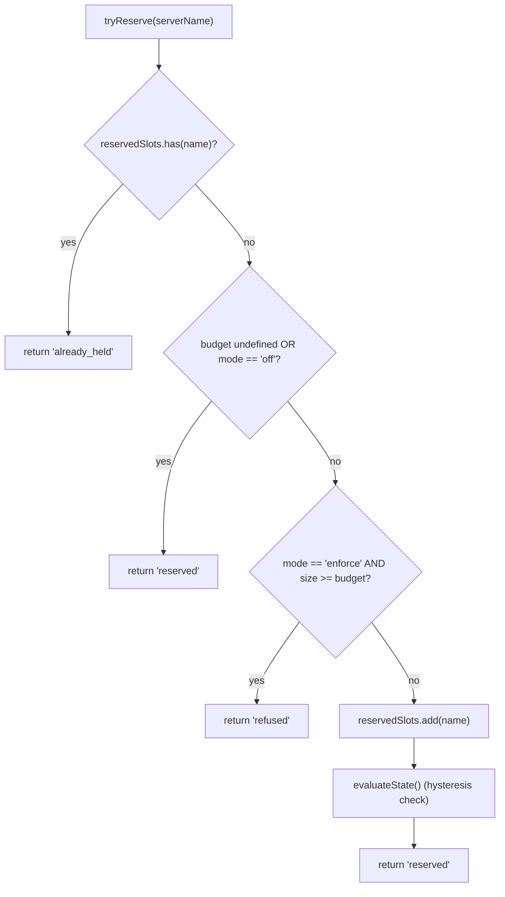
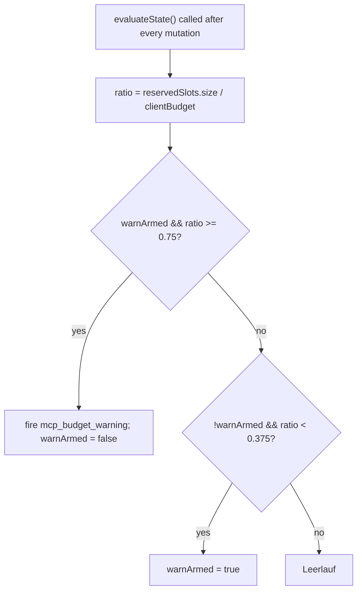

# MCP Workspace Budget Guardrails

## Überblick

`WorkspaceMcpBudget` (`packages/core/src/tools/mcp-workspace-budget.ts`) ist der auf den Arbeitsbereich bezogene Budget-Controller für MCP-Clients aus F2 (#4175 Commit 6). Er besitzt die gleiche Zustandsmaschine, die `McpClientManager` inline mitführt (Slot-Reservierung, 75%-Hysterese-Warnung, Zusammenfassen von abgelehnten Batches über einen `discoverAllMcpTools*`-Durchlauf), existiert aber **einmal pro Arbeitsbereich** innerhalb von `McpTransportPool` statt einmal pro Sitzung im jeweiligen ACP-Child-Manager. Der Pool delegiert `acquire`- und `release`-Aufrufe hierhin, sodass das Limit für den **Arbeitsbereich** gilt, nicht für jede Sitzung.

Die bisherige Budget-Mechanik von `McpClientManager` bleibt für eigenständige Qwen- und SDK-MCP-Server bestehen (die den Pool gemäß Commit-4-Fix umgehen). Pool-Modus → `WorkspaceMcpBudget` setzt durch; eigenständig / SDK-MCP → die inline-Mechanik des Managers setzt durch. Es gibt keine Doppelerfassung, da die Pool-Modus-Erkennung niemals `tryReserveSlot` des Managers aufruft.

## Zuständigkeiten

- Verfolgung von `reservedSlots: Set<string>` mit den aktuell gehaltenen Server-NAMEN (Slot-Schlüssel ist pro NAME, passend zu PR 14 v1).
- `tryReserve(name) → 'reserved' | 'already_held' | 'refused'` — atomar und synchron, sodass gleichzeitige `Promise.all`-Acquires das Limit nicht an einer await-Grenze überschreiten können.
- `release(name) → boolean` — idempotent (`Set.delete`-Semantik).
- Auslösen von `mcp_budget_warning` einmalig beim Überschreiten von 75 % von `reservedSlots.size / clientBudget` nach oben; erneute Scharfschaltung erst nach einem Unterschreiten von 37,5 %.
- Zusammenfassen von Ablehnungen pro Server über einen Bulk-Erkennungsdurchlauf — `beginBulkPass()` / `endBulkPass()` klammern Ablehnungen zu einem einzigen `mcp_child_refused_batch`-Ereignis zusammen.
- Verwaltung von `lastRefusedServerNames` für Snapshot-Konsumenten (`GET /workspace/mcp`) — wird zu **Beginn** des nächsten Bulk-Durchlaufs gelöscht, nicht beim Senden, sodass ein Snapshot zwischen Durchläufen immer noch den letzten Ablehnungssatz sieht.

## Architektur

### Konfiguration

```ts
new WorkspaceMcpBudget({
  clientBudget?: number,           // undefined = unbegrenzt
  mode: 'off' | 'warn' | 'enforce',
  onEvent?: (event: McpBudgetEvent) => void,
});
```

`mode`-Semantik:

- `off` — alle Methoden sind No-Ops; `tryReserve` gibt bedingungslos `'reserved'` zurück; keine Ereignisse.
- `warn` — Slots werden verfolgt und `mcp_budget_warning` wird bei 75 % ausgelöst, aber `tryReserve` lehnt NIE ab.
- `enforce` — `tryReserve` lehnt ab, wenn `clientBudget` überschritten wird; `recordRefusal` stellt Ablehnungen pro Server in die Warteschlange; `endBulkPass` sendet `mcp_child_refused_batch`.

### Konstanten aus `mcp-client-manager.ts`

- `MCP_BUDGET_WARN_FRACTION = 0.75` — oberer Schwellwert.
- `MCP_BUDGET_REARM_FRACTION = 0.375` — unterer Hysterese-Schwellwert zur erneuten Scharfschaltung.
- `McpBudgetMode = 'off' | 'warn' | 'enforce'`.

### Interner Zustand

| Zustand                                    | Zweck                                                                                                                       |
| ------------------------------------------ | --------------------------------------------------------------------------------------------------------------------------- |
| `reservedSlots: Set<string>`               | Autoritative Reservierungsmenge; die Hysterese bewertet `size / clientBudget`.                                               |
| `pendingRefusalNames: Set<string>`         | Während des aktuellen `beginBulkPass`/`endBulkPass`-Fensters gesammelte Ablehnungsnamen; werden bei `endBulkPass` geleert. |
| `pendingRefusalTransports: Map<string, transport>` | Seitenkanal, damit der gesendete Batch den Transport jedes abgelehnten Servers enthält.                                  |
| `lastRefusedServerNames: readonly string[]`        | Im Snapshot sichtbare Liste der Ablehnungen aus dem letzten abgeschlossenen Durchlauf. Wird zu Beginn des nächsten Durchlaufs gelöscht. |
| `warnArmed: boolean`                       | Hysterese-Zustand — true = bereit zum Auslösen, false = bereits ausgelöst seit letztem 37,5 %-Unterschreiten.               |
| `bulkPassDepth: number`                    | Wiedereintrittszähler für verschachtelte Bulk-Durchläufe (verschachtelte Durchläufe dürfen nicht doppelt senden).            |

## Arbeitsablauf

### `tryReserve`



`tryReserve` ist **synchron**. Das `acquire` des Pools ist asynchron, aber die Reservierung erfolgt vor jedem `await`, sodass zwei gleichzeitige `Promise.all`-Acquires für unterschiedliche Namen das Limit nicht beide überschreiten können.

### Hysterese



Die Hysterese vermeidet wiederholte Warnungen, wenn eine Auslastung um 75 % schwankt. Der erste Überschreiter löst aus; nachfolgende Überschreitungen ohne Abfall auf 37,5 % lösen nicht aus.

### Zusammenfassen abgelehnter Batches

```mermaid
sequenceDiagram
    autonumber
    participant POOL as pool.discoverAllMcpToolsViaPool
    participant BDG as WorkspaceMcpBudget
    participant EB as EventBus

    POOL->>BDG: beginBulkPass()
    BDG->>BDG: bulkPassDepth++<br/>clear lastRefusedServerNames if outermost
    loop per server in pass
        POOL->>BDG: tryReserve(name)
        alt refused
            POOL->>BDG: recordRefusal(name, transport)
            BDG->>BDG: pendingRefusalNames.add; pendingRefusalTransports.set
            Note over BDG: NO event yet (coalesce)
        end
    end
    POOL->>BDG: endBulkPass()
    BDG->>BDG: bulkPassDepth--
    alt outermost (depth == 0) AND pending non-empty
        BDG->>EB: emit mcp_child_refused_batch<br/>{refusedServers, budget, liveCount, reservedCount, mode: 'enforce', scope?: 'workspace'}
        BDG->>BDG: lastRefusedServerNames = drain pendingRefusalNames
    end
```

Ablehnungen außerhalb eines Durchlaufs (z. B. ein faul gestarteter `readResource`, der den Bulk-Durchlauf komplett umgeht) senden Batches der Länge 1 inline, um die Form konsistent zu halten. Verschachtelte Durchläufe (`bulkPassDepth > 0`) lösen nicht aus; nur der äußerste End-of-Pass sendet den zusammengefassten Batch.

## Zustand & Lebenszyklus

- Der Budget-Controller wird einmal pro Arbeitsbereich bei der Pool-Initialisierung erstellt.
- `clientBudget` ist nach der Konstruktion unveränderlich; Laufzeitänderungen erfordern eine Neuerstellung des Pools.
- `mode` ist ebenfalls unveränderlich (`onEvent` wird als `undefined` hinterlegt, wenn `mode === 'off'` – als Verteidigung in der Tiefe).
- `warnArmed` beginnt mit true; wird über den 37,5 %-Unterschreiter wieder auf true gesetzt.
- `lastRefusedServerNames` wird NICHT beim Senden von `endBulkPass` gelöscht – nur zu **Beginn** des nächsten Bulk-Durchlaufs. So kann ein zwischen zwei Durchläufen aufgerufener Snapshot immer noch den letzten Ablehnungssatz melden (andernfalls würden Dashboards unmittelbar nach der Zustellung eines abgelehnten Batches leere Ablehnungen anzeigen).

## Abhängigkeiten

- `packages/core/src/tools/mcp-client-manager.ts` — wiederverwendet `McpBudgetEvent`, `McpBudgetMode`, `McpRefusedServer`, `MCP_BUDGET_WARN_FRACTION`, `MCP_BUDGET_REARM_FRACTION`, `BudgetExhaustedError` (wird vom `acquire` des Pools bei Ablehnung geworfen).
- `packages/core/src/tools/mcp-transport-pool.ts` — verbraucht das Budget; leitet Ereignisse über die `onEvent`-Verkabelung des Pools an den Daemon-EventBus weiter.
- Snapshot-Route des Daemons `GET /workspace/mcp` — liest `getReservedSlots()`, `getRefusedServerNames()`, `getReservedCount()`, `getBudget()`, `getMode()`.

## Konfiguration

| Quelle          | Einstellung                                                                             | Wirkung                                                                                                             |
| --------------- | --------------------------------------------------------------------------------------- | ------------------------------------------------------------------------------------------------------------------- |
| Flag            | `--mcp-client-budget=N`                                                                 | Setzt `clientBudget` für den Arbeitsbereich-Controller.                                                             |
| Flag            | `--mcp-budget-mode={off,warn,enforce}`                                                  | Setzt `mode`. `enforce` erfordert ein positives `clientBudget`; andernfalls startet der Bootvorgang explizit fehl. |
| Env             | `QWEN_SERVE_MCP_CLIENT_BUDGET`, `QWEN_SERVE_MCP_BUDGET_MODE`                            | Wird über `childEnvOverrides` an das ACP-Child weitergeleitet; `readBudgetFromEnv()` des Childs liest sie aus.      |
| Capability-Tags | `mcp_guardrails` (immer; `modes: ['warn', 'enforce']`), `mcp_guardrail_events` (immer) | Siehe [`11-capabilities-versioning.md`](./11-capabilities-versioning.md).                                            |

## Hinweise & bekannte Grenzen

- **Reservierungsschlüssel ist pro NAME.** Zwei Pool-Einträge mit demselben Server-Namen, aber unterschiedlichen Fingerabdrücken (z. B. Sitzungen mit unterschiedlichen OAuth-Headern) belegen gemeinsam EINEN Slot. Die Subprozess-Erfassung wird separat über den `subprocessCount` des Pool-Snapshots bereitgestellt. Betreiber sollten das Budget als "konfigurierte Server-Slots" und nicht als "Subprozess-Anzahl" betrachten.
- **Die Hysterese wird durch die Reservierungsanzahl ausgelöst, nicht durch die Anzahl der aktiven (VERBUNDENEN) Verbindungen.** Reservierungen umfassen laufende Verbindungsaufbauten und überleben vorübergehende Trennungen, sodass die Hysterese über Wiederverbindungszyklen stabil bleibt. Die aktive Anzahl wird in Ereignis-Payloads als `liveCount` für SDK-Konsumenten bereitgestellt, die diese Perspektive benötigen.
- **Der Modus `warn` lehnt niemals ab.** Er verfolgt weiterhin Reservierungen und löst `mcp_budget_warning` aus, aber `tryReserve` gibt immer `'reserved'` zurück. Ablehnungssemantik ist nur für `enforce`.
- **Arbeitsbereichsbezogene Budget-Ereignisse tragen `scope: 'workspace'`**, sodass sie gleichzeitig an jede angeschlossene Sitzung verteilt werden. Die `mcpBudgetWarningCount` / `mcpChildRefusedBatchCount` der SDK-Reducer erhöhen sich synchron über alle Sitzungen derselben Verbindung hinweg. Sitzungsbezogene Legacy-Ereignisse von `McpClientManager` tragen kein `scope` (semantisch standardmäßig `'session'`).
- **Der Kill-Switch `QWEN_SERVE_NO_MCP_POOL=1`** deaktiviert den Pool vollständig; das Arbeitsbereichs-Budget wird ebenfalls deaktiviert, und das sitzungsbezogene Budget von `McpClientManager` übernimmt. Der Capabilities-Block entfernt `mcp_workspace_pool` und `mcp_pool_restart`, um dies korrekt zu melden.
- **`ServeMcpBudgetStatusCell.scope` ist eine vorwärtskompatible Listenform.** Snapshot-Zellen geben `budgets[]` aus, nicht ein einzelnes `budget?`-Feld. PR 14 v1 sendet eine `scope: 'session'`-Zelle für jede ACP-Sitzung, weil `acpAgent.newSessionConfig()` das `Config` / `McpClientManager` dieser Sitzung erstellt. Der Bereich `'pool'` ist für die Wave-5-PR-23-Pool-Zelle reserviert, die neben den sitzungsbezogenen Zellen platziert wird. Konsumenten müssen unbekannte zusätzliche `scope`-Werte tolerieren, indem sie sie ignorieren, anstatt fehlzuschlagen.

## Referenzen

- `packages/core/src/tools/mcp-workspace-budget.ts` (gesamte Klasse)
- `packages/core/src/tools/mcp-client-manager.ts` (`BudgetExhaustedError`, `McpBudgetEvent`, Hysterese-Konstanten)
- `packages/core/src/tools/mcp-transport-pool.ts` (`acquire`-Stelle des Pools, die `tryReserve` aufruft)
- F2-Designdokument (v2.2): [`../../design/f2-mcp-transport-pool.md`](../../design/f2-mcp-transport-pool.md) §11 für das Arbeitsbereichs-Budget und die v2.2-Changelog-Einträge zu Budget- und Fingerprint-Nacharbeiten.
- F2-Designnotizen: Issue [#4175](https://github.com/QwenLM/qwen-code/issues/4175) Commit 6.