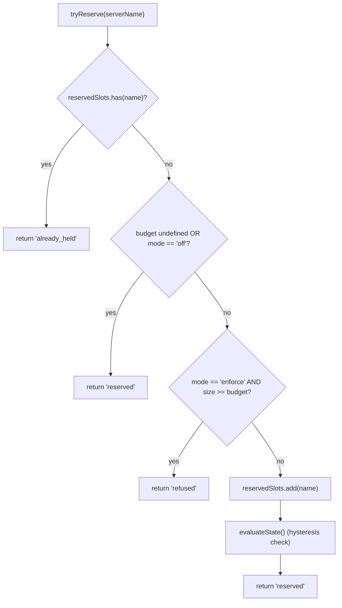
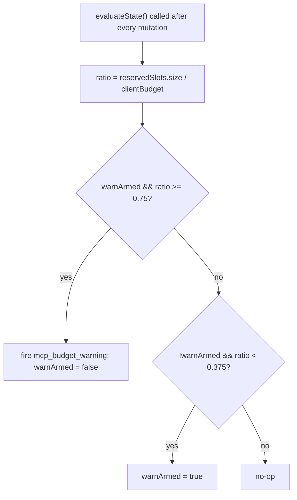

# MCP Workspace Budget – Sicherheitsgrenzen

## Übersicht

`WorkspaceMcpBudget` (`packages/core/src/tools/mcp-workspace-budget.ts`) ist der arbeitsbereichsbezogene Budget-Controller für den MCP-Client aus F2 (#4175 Commit 6). Er besitzt die gleiche Zustandsmaschine, die `McpClientManager` inline mitführt (Slot-Reservierung, 75%-Hysterese-Warnung, verweigerte Batch-Zusammenführung über einen `discoverAllMcpTools*`-Durchlauf), lebt jedoch **einmal pro Arbeitsbereich** innerhalb von `McpTransportPool` anstatt einmal pro Session innerhalb des Managers jedes ACP-Kindes. Der Pool delegiert `acquire`- und `release`-Aufrufe hierhin, sodass die Obergrenze für den **Arbeitsbereich** gilt, nicht für jede Session.

Die veraltete Budget-Mechanik von `McpClientManager` bleibt für eigenständige Qwen- und SDK-MCP-Server bestehen (die den Pool gemäß Commit 4 umgehen). Pool-Modus → `WorkspaceMcpBudget` setzt durch; eigenständig/SDK-MCP → die Inline-Mechanik des Managers setzt durch. Keine Doppelzählung, da die Pool-Modus-Erkennung niemals `tryReserveSlot` des Managers aufruft.

## Verantwortlichkeiten

- Verfolgt `reservedSlots: Set<string>` der aktuell gehaltenen Server-NAMEN (Slot-Key ist pro NAME, wie in PR 14 v1).
- `tryReserve(name) → 'reserved' | 'already_held' | 'refused'` – atomar und synchron, sodass gleichzeitige `Promise.all`-Acquires die Obergrenze nicht an einer `await`-Grenze überschreiten können.
- `release(name) → boolean` – idempotent (Semantik von `Set.delete`).
- Löst `mcp_budget_warning` einmalig beim Überschreiten von 75% von `reservedSlots.size / clientBudget` aus; erneut aktiviert erst nach einem Unterschreiten von 37,5%.
- Fasst serverbezogene Ablehnungen über einen Bulk-Erkennungsdurchlauf zusammen – `beginBulkPass()` / `endBulkPass()` Klammern, um Ablehnungen in einem einzigen `mcp_child_refused_batch`-Ereignis zu sammeln.
- Pflegt `lastRefusedServerNames` für Snapshot-Konsumenten (`GET /workspace/mcp`) – wird zu BEGINN des nächsten Bulk-Durchlaufs gelöscht, NICHT beim Senden, sodass ein Snapshot zwischen zwei Durchläufen immer noch den letzten Satz abgelehnter Server zeigt.

## Architektur

### Konfiguration

```ts
new WorkspaceMcpBudget({
  clientBudget?: number,           // undefined = unbegrenzt
  mode: 'off' | 'warn' | 'enforce',
  onEvent?: (event: McpBudgetEvent) => void,
});
```

Semantik von `mode`:

- `off` – jede Methode ist ein No-Op; `tryReserve` gibt immer `'reserved'` zurück; es werden keine Ereignisse ausgelöst.
- `warn` – Slots werden verfolgt und `mcp_budget_warning` wird bei 75% ausgelöst, aber `tryReserve` lehnt NIE ab.
- `enforce` – `tryReserve` lehnt ab, sobald `clientBudget` erreicht ist; `recordRefusal` reiht serverbezogene Ablehnungen ein; `endBulkPass` sendet `mcp_child_refused_batch`.

### Konstanten aus `mcp-client-manager.ts`

- `MCP_BUDGET_WARN_FRACTION = 0.75` – Aufwärtsschwelle.
- `MCP_BUDGET_REARM_FRACTION = 0.375` – Abwärts-Hysterese zur erneuten Aktivierung.
- `McpBudgetMode = 'off' | 'warn' | 'enforce'`.

### Interner Zustand

| Zustand                                          | Zweck                                                                                                           |
| ------------------------------------------------ | ---------------------------------------------------------------------------------------------------------------- |
| `reservedSlots: Set<string>`                     | Maßgeblicher Reservierungssatz; Hysterese bewertet `size / clientBudget`.                                        |
| `pendingRefusalNames: Set<string>`               | Namen von Ablehnungen, die während des aktuellen `beginBulkPass`/`endBulkPass`-Fensters gesammelt wurden; werden bei `endBulkPass` geleert. |
| `pendingRefusalTransports: Map<string, transport>` | Seitenwagon, damit der gesendete Batch den Transport jedes abgelehnten Servers enthält.                         |
| `lastRefusedServerNames: readonly string[]`      | Snapshot-sichtbare Ablehnungsliste des letzten abgeschlossenen Durchlaufs. Wird zu Beginn des nächsten Durchlaufs gelöscht. |
| `warnArmed: boolean`                             | Hysterese-Zustand – true = bereit zum Auslösen, false = bereits ausgelöst seit letztem 37,5%-Abfluss.               |
| `bulkPassDepth: number`                          | Wiedereintrittszähler für verschachtelte Bulk-Durchläufe (verschachtelte Durchläufe dürfen nicht doppelt senden). |

## Arbeitsablauf

### `tryReserve`



`tryReserve` ist **synchron**. Der `acquire`-Aufruf des Pools ist asynchron, aber die Reservierung erfolgt vor jedem `await`, sodass zwei gleichzeitige `Promise.all`-Acquires für verschiedene Namen die Obergrenze nicht beide überschreiten können.

### Hysterese


Hysterese vermeidet wiederholte Warnungen, wenn eine Arbeitslast um 75% schwankt. Die erste Überschreitung feuert; nachfolgende Überschreitungen ohne einen Abfall auf 37,5% lösen keine Warnung aus.

### Zusammenfassen abgelehnter Batches

```mermaid
sequenceDiagram
    autonumber
    participant POOL as pool.discoverAllMcpToolsViaPool
    participant BDG as WorkspaceMcpBudget
    participant EB as EventBus

    POOL->>BDG: beginBulkPass()
    BDG->>BDG: bulkPassDepth++<br/>clear lastRefusedServerNames if outermost
    loop per server in pass
        POOL->>BDG: tryReserve(name)
        alt refused
            POOL->>BDG: recordRefusal(name, transport)
            BDG->>BDG: pendingRefusalNames.add; pendingRefusalTransports.set
            Note over BDG: NO event yet (coalesce)
        end
    end
    POOL->>BDG: endBulkPass()
    BDG->>BDG: bulkPassDepth--
    alt outermost (depth == 0) AND pending non-empty
        BDG->>EB: emit mcp_child_refused_batch<br/>{refusedServers, budget, liveCount, reservedCount, mode: 'enforce', scope?: 'workspace'}
        BDG->>BDG: lastRefusedServerNames = drain pendingRefusalNames
    end
```

Ablehnungen außerhalb eines Durchgangs (z. B. ein faules `readResource`-Spawn, das den gesamten Batch-Durchgang umgeht) geben aus Konsistenzgründen Batches der Länge 1 inline aus. Verschachtelte Durchgänge (`bulkPassDepth > 0`) feuern nicht; nur der äußerste Durchgangs-Abschluss gibt den zusammengefassten Batch aus.

## Zustand & Lebenszyklus

- Der Budget-Controller wird einmal pro Workspace beim Pool-Initialisieren erstellt.
- `clientBudget` ist nach der Erstellung unveränderlich; Laufzeitänderungen erfordern eine Neuerstellung des Pools.
- `mode` ist ebenfalls unveränderlich (`onEvent` wird als `undefined` gespeichert, wenn `mode === 'off'` – Defence-in-Depth).
- `warnArmed` beginnt als `true`; wird durch die 37,5 %-Abwärtskreuzung auf `true` zurückgesetzt.
- `lastRefusedServerNames` wird beim `endBulkPass`-Emit NICHT gelöscht – erst zu BEGINN des nächsten Bulk-Durchgangs. So kann eine zwischen zwei Durchgängen aufgerufene Snapshot-Route immer noch den letzten Satz abgelehnter Server melden (andernfalls würden Dashboards direkt nach der Zustellung eines abgelehnten Batch-Ereignisses leere Ablehnungen anzeigen).

## Abhängigkeiten

- `packages/core/src/tools/mcp-client-manager.ts` – verwendet `McpBudgetEvent`, `McpBudgetMode`, `McpRefusedServer`, `MCP_BUDGET_WARN_FRACTION`, `MCP_BUDGET_REARM_FRACTION`, `BudgetExhaustedError` (wird vom Pool bei `acquire` bei Ablehnung geworfen) wieder.
- `packages/core/src/tools/mcp-transport-pool.ts` – konsumiert das Budget; leitet Ereignisse über die `onEvent`-Verkabelung des Pools an den Daemon-EventBus weiter.
- Daemon-Snapshot-Route `GET /workspace/mcp` – liest `getReservedSlots()`, `getRefusedServerNames()`, `getReservedCount()`, `getBudget()`, `getMode()` aus.

## Konfiguration

| Quelle          | Einstellung                                                                              | Wirkung                                                                                         |
| --------------- | ---------------------------------------------------------------------------------------- | ----------------------------------------------------------------------------------------------- |
| Flag            | `--mcp-client-budget=N`                                                                  | Setzt `clientBudget` für den Workspace-Controller.                                              |
| Flag            | `--mcp-budget-mode={off,warn,enforce}`                                                   | Setzt `mode`. `enforce` erfordert ein positives `clientBudget`; andernfalls schlägt der Start explizit fehl. |
| Umgebungsvar.   | `QWEN_SERVE_MCP_CLIENT_BUDGET`, `QWEN_SERVE_MCP_BUDGET_MODE`                             | Wird über `childEnvOverrides` an das ACP-Kind weitergeleitet; `readBudgetFromEnv()` des Kindes liest sie aus.|
| Capability-Tags | `mcp_guardrails` (immer; `modes: ['warn', 'enforce']`), `mcp_guardrail_events` (immer) | Siehe [`11-capabilities-versioning.md`](./11-capabilities-versioning.md).                         |

## Einschränkungen & bekannte Grenzen

- **Reservierungsschlüssel ist PRO NAME.** Zwei Pool-Einträge mit demselben Server-Namen, aber unterschiedlichen Fingerprints (z. B. Sessions, die abweichende OAuth-Header einfügen) belegen GEMEINSAM einen Slot. Die Subprozess-Abrechnung wird separat über die `subprocessCount` des Pool-Snapshots angezeigt. Betreiber sollten das Budget als „konfigurierte Server-Slots" betrachten, nicht als „Subprozess-Anzahl".
- **Die Hysterese wird durch die Anzahl der Reservierungen ausgelöst, nicht durch die Anzahl der aktiven (CONNECTED) Verbindungen.** Reservierungen umfassen laufende Verbindungsaufbauten und überstehen vorübergehende Trennungen, sodass die Hysterese über Wiederverbindungszyklen hinweg stabil bleibt. Die Live-Verbindungsanzahl wird in Ereignis-Payloads als `liveCount` bereitgestellt, für SDK-Konsumenten, die diese Perspektive benötigen.
- **Der `warn`-Modus lehnt niemals ab.** Er verfolgt weiterhin Reservierungen und feuert `mcp_budget_warning`, aber `tryReserve` gibt immer `'reserved'` zurück. Die Ablehnungssemantik ist ausschließlich für `enforce`.
- **Workspace-bezogene Budget-Ereignisse enthalten `scope: 'workspace'`**, sodass sie gleichzeitig an jede angeschlossene Session verteilt werden. Die `mcpBudgetWarningCount` / `mcpChildRefusedBatchCount` der SDK-Reducer inkrementieren auf derselben Verbindung in allen Sessions synchron. Legacy-Ereignisse pro Session von `McpClientManager` enthalten keinen `scope` (semantisch standardmäßig `'session'`).
- **Der Kill-Switch `QWEN_SERVE_NO_MCP_POOL=1`** deaktiviert den Pool vollständig; das Workspace-Budget wird ebenfalls deaktiviert, und das pro-Session-Budget des `McpClientManager` übernimmt. Das Capabilities-Paket entfernt `mcp_workspace_pool` und `mcp_pool_restart`, um dies korrekt zu melden.
- **`ServeMcpBudgetStatusCell.scope` ist eine vorwärtskompatible Listenform.** Snapshot-Zellen geben `budgets[]` aus, nicht ein einzelnes Feld `budget?`. PR 14 v1 gibt eine Zelle mit `scope: 'session'` pro ACP-Session aus, da `acpAgent.newSessionConfig()` das `Config`/ `McpClientManager` dieser Session erstellt. Der `'pool'`-Scope ist für die pool-bezogene Zelle des Wave 5 PR 23 reserviert, die neben Sessions-bezogenen Zellen platziert wird. Konsumenten müssen zusätzliche unbekannte `scope`-Werte tolerieren, indem sie sie ignorieren anstatt einen Fehler zu werfen.
## Referenzen

- `packages/core/src/tools/mcp-workspace-budget.ts` (gesamte Klasse)
- `packages/core/src/tools/mcp-client-manager.ts` (`BudgetExhaustedError`, `McpBudgetEvent`, Hysterese-Konstanten)
- `packages/core/src/tools/mcp-transport-pool.ts` (die `acquire`-Stelle des Pools, die `tryReserve` aufruft)
- F2-Design-Dokument (v2.2): [`../../design/f2-mcp-transport-pool.md`](../../design/f2-mcp-transport-pool.md) §11 für das Arbeitsbereichs-Budget und die v2.2-Changelog-Einträge zu Budget- und Fingerprint-Nachfassungen.
- F2-Designnotizen: Issue [#4175](https://github.com/QwenLM/qwen-code/issues/4175) Commit 6.
