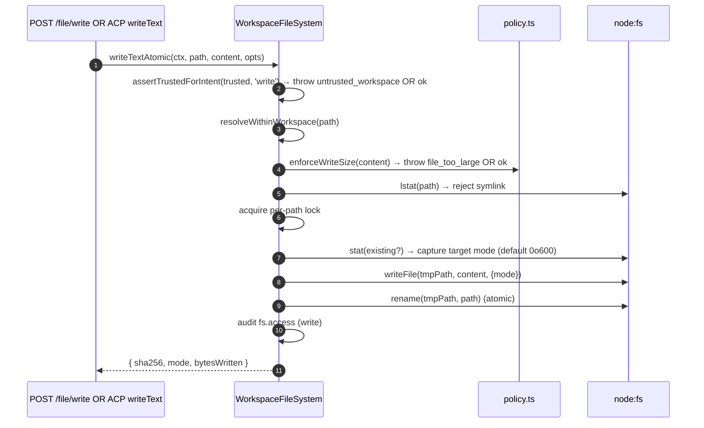
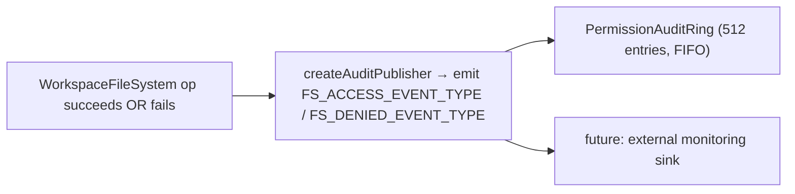

# Arbeitsbereichs-Dateisystem-Grenze

## Überblick

Der Daemon lässt HTTP-Routen oder agentenseitige Agentenaufrufe niemals direkt auf das Host-Dateisystem zugreifen. Jeder Lese-, Schreib-, Auflistungs-, Glob- und Stat-Vorgang durchläuft die `WorkspaceFileSystem`-Grenze (`packages/cli/src/serve/fs/`), die Folgendes bietet:

- **Pfadauflösung** — Pfade kanonisieren und alles ablehnen, was den gebundenen Arbeitsbereich verlässt, auch über Symlinks.
- **Vertrauensprüfung** — Schreibvorgänge verweigern, wenn der Arbeitsbereich nicht vertrauenswürdig ist (`untrusted_workspace`).
- **Größen- & Inhaltsrichtlinie** — Leseobergrenze (`MAX_READ_BYTES = 256 KiB`), Schreibobergrenze (`MAX_WRITE_BYTES = 5 MiB`), Binärerkennung.
- **Atomizität** — Schreiben-dann-Umbenennen mit Erhalt der Zielmodus und `0o600` Standard für neue Dateien.
- **Audit** — Jeder Zugriff / jede Ablehnung erzeugt ein strukturiertes Ereignis für `PermissionAuditRing` / Überwachung.
- **Typisierte Fehler** — Geschlossene `FsErrorKind`-Vereinigung, die auf HTTP-Statuscodes abgebildet wird.

Die HTTP-Datei-Routen (`GET /file`, `GET /file/bytes`, `POST /file/write`, `POST /file/edit`, `GET /list`, `GET /glob`, `GET /stat`) und der ACP-seitige `BridgeFileSystem`-Adapter (sodass agentengesteuerte `readTextFile` / `writeTextFile`-Aufrufe die gleichen Prüfungen durchlaufen) nutzen beide diese Grenze.

## Verantwortlichkeiten

- Benutzerbereitgestellte Pfade in gebrandete `ResolvedPath`-Werte auflösen, die der Rest der Grenze sicher verwenden kann.
- Pfade ablehnen, die außerhalb des gebundenen Arbeitsbereichs liegen (`path_outside_workspace`), und Pfade, deren Ziel ein Symlink ist (`symlink_escape`).
- Lesezugriffe über `MAX_READ_BYTES`, Schreibzugriffe über `MAX_WRITE_BYTES` und Binärdateien (`binary_file`) ablehnen.
- Schreib-/Bearbeitungsvorgänge ablehnen, wenn der Arbeitsbereich nicht vertrauenswürdig ist (`untrusted_workspace`) — geprüft durch `assertTrustedForIntent(trusted, intent)`.
- `.gitignore` / `.qwenignore`-Muster über `shouldIgnore` berücksichtigen.
- Atomares Schreiben-dann-Umbenennen mit Erhalt des Zielmodus durchführen; Standardmodus für neue Dateien ist `0o600`.
- `fs.access` / `fs.denied`-Audit-Ereignisse bei jedem Vorgang ausgeben.
- Jeden Fehler auf einen `FsError` mit Art und HTTP-Status abbilden; Routen-Handler serialisieren diese einheitlich.

## Architektur

### Modulaufteilung

| Datei                        | Zweck                                                                                                                                                                                                                         |
| ---------------------------- | ----------------------------------------------------------------------------------------------------------------------------------------------------------------------------------------------------------------------------- |
| `paths.ts`                   | `canonicalizeWorkspace`, `resolveWithinWorkspace`, `hasSuspiciousPathPattern`, gebrandetes `ResolvedPath`, `Intent`-Vereinigung (`read \| write \| list \| stat \| glob`).                                                              |
| `policy.ts`                  | `MAX_READ_BYTES`, `MAX_WRITE_BYTES`, `BINARY_PROBE_BYTES`, `assertTrustedForIntent`, `detectBinary`, `enforceReadBytesSize`, `enforceReadSize`, `enforceWriteSize`, `shouldIgnore`.                                           |
| `audit.ts`                   | `FS_ACCESS_EVENT_TYPE`, `FS_DENIED_EVENT_TYPE`, `createAuditPublisher`, Audit-Payload-Typen.                                                                                                                                  |
| `errors.ts`                  | `FsError`-Klasse, `isFsError`, `FsErrorKind`-Vereinigung (14 Arten), `FsErrorStatus`-Vereinigung (`400 / 403 / 404 / 409 / 413 / 422 / 500 / 503`).                                                                                  |
| `workspace-file-system.ts`   | `createWorkspaceFileSystemFactory`, `WorkspaceFileSystem` (der Orchestrator, der liest/schreibt/auflistet), `WriteMode`, `ContentHash`, `FsEntry`, `FsStat`, `ListOptions`, `GlobOptions`, `ReadTextOptions`, `ReadBytesOptions`, `WriteTextAtomicOptions`. |

### `FsErrorKind`-Taxonomie

| Art                        | Standard-HTTP | Bedeutung                                                                                                                                                            |
| -------------------------- | ------------- | -------------------------------------------------------------------------------------------------------------------------------------------------------------------- |
| `path_outside_workspace`   | 400           | Aufgelöster Pfad liegt außerhalb des gebundenen Arbeitsbereichs.                                                                                                     |
| `symlink_escape`           | 400           | Ziel ist ein Symlink (gemäß der konservativen Haltung von PR 18 + PR 20 abgelehnt).                                                                                  |
| `path_not_found`           | 404           | `ENOENT`.                                                                                                                                                            |
| `binary_file`              | 422           | Inhalt als binär identifiziert bei einer Text-Route.                                                                                                                 |
| `file_too_large`           | 413           | Über `MAX_READ_BYTES` oder `MAX_WRITE_BYTES`.                                                                                                                        |
| `hash_mismatch`            | 409           | Optimistische Nebenläufigkeit `expectedSha256` fehlgeschlagen.                                                                                                        |
| `file_already_exists`      | 409           | `mode: 'create'` gegen eine vorhandene Datei.                                                                                                                        |
| `text_not_found`           | 422           | Suchstring von `POST /file/edit` nicht in der Datei gefunden.                                                                                                        |
| `ambiguous_text_match`     | 422           | Mehrere Übereinstimmungen, obwohl genau eine erforderlich war.                                                                                                       |
| `untrusted_workspace`      | 403           | Schreibversuch in einem nicht vertrauenswürdigen Arbeitsbereich.                                                                                                     |
| `permission_denied`        | 403           | OS-Ebene `EACCES` / `EPERM`.                                                                                                                                         |
| `io_error`                 | 503           | `ENOSPC` / `EIO` / `EBUSY` / `ETXTBSY` / `ENAMETOOLONG` / `EMFILE` / `ENFILE`. **Abgrenzung zu `permission_denied`**, damit Überwachungspipelines nicht Sicherheitsverantwortliche für "Festplatte voll" alarmieren. |
| `internal_error`           | 500           | Nicht-Errno-Fehler, der die Grenze erreicht (`TypeError`, Programmierfehler).                                                                                        |
| `parse_error`              | 400 / 422     | Fehler beim Parsen des Anforderungstextes (400) oder Verletzung einer Dienstinvariante (422).                                                                        |
### `BridgeFileSystem` (der ACP-seitige Adapter)

`packages/acp-bridge/src/bridgeFileSystem.ts` definiert:

```ts
interface BridgeFileSystem {
  readText(params: ReadTextFileRequest): Promise<ReadTextFileResponse>;
  writeText(params: WriteTextFileRequest): Promise<WriteTextFileResponse>;
}
```

Dies ist der Einsprungspunkt für ACP `readTextFile` / `writeTextFile`. Bridge-Tests und eingebettete Aufrufer im Modus A können es in `BridgeOptions` weglassen; `BridgeClient` fällt dann auf seinen internen `fs.readFile` / `fs.writeFile`-Proxy zurück (bewahrt das Verhalten vor F1). Im Produktionsbetrieb verdrahtet `qwen serve` die `BridgeFileSystem` über `createBridgeFileSystemAdapter(fsFactory)` (`packages/cli/src/serve/bridge-file-system-adapter.ts`), sodass agentenseitige ACP-Schreibvorgänge dieselben TOCTOU-, Symlink-, Trust-Gate- und Audit-Gates durchlaufen wie die HTTP-Routen.

Zwei defensive Gates, die der Adapter zwingend replizieren muss (da der Inline-Proxy bei eingespritztem Adapter vollständig umgangen wird):

1. **Nicht-Reguläre-Dateien ablehnen** — Sockets / Pipes / Char-Devices / procfs / sysfs-Einträge können unbegrenzte Daten strömen, obwohl `stats.size === 0`. Der Inline-Pfad wirft einen Fehler mit `describeStatKind(stats)` in der Nachricht.
2. **Puffergröße begrenzen** auf `READ_FILE_SIZE_CAP = 100 MiB`. Eine kleine Anfrage `{ line: 1, limit: 10 }` gegen eine 500 MB große Logdatei würde sonst 500 MB RSS kosten, nur um 10 Zeilen zurückzugeben.

Der Adapter geht noch weiter: Er verwendet `WorkspaceFileSystem.writeTextOverwrite` (PR-18-Primitive) für atomare temporäre-Datei-und-umbenennen-Schreibvorgänge mit Modi-Erhaltung, `0o600`-Standard und Symlink-Ablehnung innerhalb einer pfadbezogenen Sperre. Dies ist eine **Abweichung vom Inline-Proxy vor F1**, der Symlinks aufgelöst und in deren Ziel geschrieben hat – Agenten, die sich darauf verließen, durch symlinkverknüpfte Dotfiles zu schreiben, müssen nun den aufgelösten Pfad direkt ansprechen.

### FsError-Erhaltung über die ACP-Leitung

Wenn der `BridgeFileSystem`-Adapter ein `FsError` wirft (`kind: 'untrusted_workspace'` / `'symlink_escape'` / `'file_too_large'` / usw.), serialisiert der standardmäßige ACP-SDK-RPC-Fehlerpfad nur `error.message` als generischen `-32603 "Internal error"` – `kind` / `status` / `hint` werden entfernt. Der nachgelagerte Agent-RPC-Client müsste dann per Regex auf die menschenlesbare Nachricht zugreifen, um typisierte UI-Aktionen zu dispatchen (Auth-Wiederholung vs. Dateiauswahl vs. Proxy-Hinweis).

`BridgeClient.writeTextFile` und `BridgeClient.readTextFile` installieren eine dünne Absicherung (`packages/acp-bridge/src/bridgeClient.ts`), die nach `FsError`-artigen Würfen fängt und sie als ACP `RequestError` erneut wirft:

```ts
function isFsErrorShape(err: unknown): err is FsErrorShape {
  return (
    err instanceof Error &&
    err.name === 'FsError' &&
    typeof (err as { kind?: unknown }).kind === 'string'
  );
}

function preserveFsErrorOverAcp(err: unknown): never {
  if (isFsErrorShape(err)) {
    throw new RequestError(-32603, err.message, {
      errorKind: err.kind,
      ...(err.hint !== undefined ? { hint: err.hint } : {}),
      ...(err.status !== undefined ? { status: err.status } : {}),
    });
  }
  throw err;
}
```

Der RPC-Client des Agenten erhält nun `data.errorKind` (den geschlossenen `FsErrorKind`-Wert) plus optional `data.hint` und `data.status`, sodass SDK-Konsumenten auf dem typisierten Enum verzweigen können, anstatt per Regex auf die Nachricht zu matchen.

Zwei Designhinweise:

- **Duck-Typing statt Import** – `FsError` lebt in `packages/cli/src/serve/fs/errors.ts`, während `BridgeClient` in `packages/acp-bridge` lebt. Ein direkter `import { FsError }` würde die Abhängigkeit umkehren. Der Duck-Check (`name === 'FsError'` + `kind: string`) spiegelt wider, was `mapDomainErrorToErrorKind` (`status.ts`) bereits für `TrustGateError` / `SkillError` aus demselben Cross-Package-Bundling-Grund tut.
- **JSON-RPC-Code bleibt bei -32603** – die Bridge kann `FsError.kind` nicht zuverlässig auf eine JSON-RPC-Fehlercode-Form abbilden, daher trägt das strukturierte `data`-Feld die semantischen Informationen für SDK-Konsumenten. Der Wire-Statuscode (`-32603` "internal error") bleibt unverändert; Clients routen anhand von `data.errorKind`.

### Trust-Gate

`assertTrustedForIntent(trusted, intent)` konsumiert den Trust-Booleschen Wert, der vom Aufrufer injiziert wird; die Policy-Ebene liest `Config.isTrustedFolder()` nicht direkt. Read / List / Stat / Glob sind immer erlaubt (Trust gilt nur für Schreibvorgänge). Schreib-Intents in nicht vertrauenswürdigen Workspaces werfen `FsError('untrusted_workspace', ..., status: 403)`. Das Trust-Signal fließt über `WorkspaceFileSystemFactoryDeps.trusted: boolean` ein – `runQwenServe` übergibt `true`, weil der Operator den Daemon gegen einen Workspace gestartet hat, dem er implizit vertraut; `createServeApp` (direktes Einbetten ohne `runQwenServe`) setzt standardmäßig `false` und warnt einmal pro Prozess (siehe [`02-serve-runtime.md`](./02-serve-runtime.md)).

## Workflow

### Lesen

```mermaid
sequenceDiagram
    autonumber
    participant R as HTTP route OR BridgeFileSystem.readText
    participant FS as WorkspaceFileSystem
    participant POL as policy.ts
    participant FSP as node:fs

    R->>FS: readText(ctx, path, opts)
    FS->>FS: resolveWithinWorkspace(path) → ResolvedPath OR throw
    FS->>FSP: stat(path)
    FSP-->>FS: stats
    FS->>FS: reject if not regular file (describeStatKind)
    FS->>POL: enforceReadSize(stats.size, opts.maxBytes?)<br/>→ throw file_too_large OR slice plan
    FS->>FSP: readFile(path)
    FSP-->>FS: buffer
    FS->>POL: detectBinary(buffer)
    POL-->>FS: isBinary?
    FS->>FS: reject if binary; sha256 hash; truncate to line window
    FS->>FS: shouldIgnore? → annotate meta.matchedIgnore
    FS->>FS: audit fs.access
    FS-->>R: { content, sha256, truncated?, meta }
```
`readText` überspringt oder verwirft Lesevorgänge nicht aufgrund von Ignorier-Regeln. Es liest die Datei normal und zeichnet die passende Ignorier-Klassifikation in `meta.matchedIgnore` auf. `list` und `glob` filtern ignorierte Ergebnisse nur, wenn `includeIgnored` nicht aktiviert ist.

### Write



Das atomare Schreiben-dann-Umbenennen stellt sicher, dass ein SIGKILL/OOM während des Schreibens das Ziel NICHT abgeschnitten hinterlässt. `mode: 'create'` bricht mit `file_already_exists` bei lstat ab; `mode: 'overwrite'` fährt fort; `expectedSha256` aktiviert optimistische Nebenläufigkeit (`hash_mismatch` bei Nichtübereinstimmung).

### `POST /file/edit` (single text replacement)

Fügt zwei Fehlermodi zusätzlich zum Schreiben hinzu:

- `text_not_found` (422) – Suchstring nicht in der Datei gefunden.
- `ambiguous_text_match` (422) – Mehrere Übereinstimmungen, obwohl genau eine erforderlich war (Vertrag der Route).

### Audit fan-out



`FS_ACCESS_EVENT_TYPE` / `FS_DENIED_EVENT_TYPE` transportieren Kontext (`ctx`), Pfad, Absicht, Ergebnis, errorKind?, bytesRead/written, sha256?.

## State & Lifecycle

- Die Factory wird einmal beim Daemon-Start gebaut (`runQwenServe` → `resolveBridgeFsFactory` → Adapter).
- Jede Anfrage erstellt einen `RequestContext` und ruft den Orchestrator der Factory nur für diesen Aufruf auf – kein dauerhafter, pro-Datei-Zustand.
- Sperren pro Pfad existieren nur für die Dauer des Schreibvorgangs (keine aufrufübergreifenden Sperren; gleichzeitige Schreibvorgänge auf denselben Pfad konkurrieren um die Sperre und werden serialisiert).
- Der Audit-Ring gehört `runQwenServe` und wird mit dem Permission-Audit-Publisher geteilt.

## Dependencies

- `@qwen-code/qwen-code-core` – `Ignore`, `isBinaryFile`, `Config.isTrustedFolder()`.
- `node:fs`, `node:path`, `node:crypto`.
- `@qwen-code/acp-bridge` – `BridgeFileSystem`-Vertrag auf der ACP-Seite.
- HTTP-Routen: `packages/cli/src/serve/routes/workspace-file-read.ts`, `workspace-file-write.ts`.

## Configuration

| Quelle                                            | Parameter                                                              | Wirkung                                                                                                            |
| ------------------------------------------------- | ---------------------------------------------------------------------- | ------------------------------------------------------------------------------------------------------------------ |
| `WorkspaceFileSystemFactoryDeps.trusted: boolean` | Konstruktor-Eingabe                                                    | Ob Schreibvorgänge erlaubt sind; Standardwert `true` von `runQwenServe`, `false` von `createServeApp` (mit Warnung). |
| Konstante                                         | `MAX_READ_BYTES = 256 KiB`                                             | Leseobergrenze; `file_too_large` darüber.                                                                          |
| Konstante                                         | `MAX_WRITE_BYTES = 5 MiB`                                              | Schreibobergrenze; kleiner als `express.json({ limit: '10mb' })` dimensioniert.                                    |
| Konstante                                         | `BINARY_PROBE_BYTES = 4096`                                            | Stichprobengröße für inhaltsbasierte Binärerkennung.                                                               |
| Capability-Tags                                   | `workspace_file_read`, `workspace_file_bytes`, `workspace_file_write`  | Siehe [`11-capabilities-versioning.md`](./11-capabilities-versioning.md).                                          |
| Arbeitsbereichsdateien                            | `.gitignore`, `.qwenignore`                                            | Ignorierte Pfade erscheinen als `ignored: true` von `shouldIgnore`.                                                |

## Caveats & Known Limits

- **Symlinks werden abgewiesen, nicht verfolgt.** Dies ist eine Abweichung vom Inline-Proxy `BridgeClient.writeTextFile` vor F1, der Symlinks aufgelöst hat. Agenten, die durch symlinkierte Dotfiles schreiben, müssen den aufgelösten Pfad direkt ansprechen.
- **`io_error` und `permission_denied` sind verschieden.** Vermischen Sie sie nicht. Überwachungspipelines verwenden `errorKind` für Alarmierungen – die Zusammenlegung von ENOSPC mit permission_denied würde Sicherheitsverantwortliche für `df -h`-Probleme alarmieren.
- **Der Standardmodus für neue Dateien ist `0o600`, nicht der umask-Standard.** Das `mode`-Argument des Syscalls write umgeht umask. Agenten, die öffentliche Dateien schreiben, sollten explizit eine Modus-Überschreibung übergeben.
- **`createServeApp` Standard `trusted: false`** lehnt ACP-Schreibvorgänge still mit `untrusted_workspace` ab, für Einbettungen, die keine benutzerdefinierte `fsFactory` oder `bridge` injizieren. Eine einmalige stderr-Warnung wird beim ersten Mal ausgegeben; spätere Aufrufer sehen keine Erinnerung. Siehe [`02-serve-runtime.md`](./02-serve-runtime.md).
- **Die Leseobergrenze wird vor der Dekodierung durchgesetzt.** Eine Datei mit `MAX_READ_BYTES + 1` wird abgelehnt, selbst wenn die Anfrage nur 10 Zeilen möchte – weil das zugrundeliegende `readFileWithLineAndLimit` die gesamte Datei in den Speicher liest, bevor sie aufgeteilt wird.
- **Der `BridgeFileSystem`-Adapter MUSS beide Inline-Proxy-Sperren replizieren** (Ablehnung von Nicht-Regulärdateien + gepufferte Größenbegrenzung). Der Inline-Pfad wird vollständig umgangen, wenn der Adapter injiziert wird.
## Referenzen

- `packages/cli/src/serve/fs/index.ts` (Sammeldatei)
- `packages/cli/src/serve/fs/paths.ts`
- `packages/cli/src/serve/fs/policy.ts`
- `packages/cli/src/serve/fs/errors.ts`
- `packages/cli/src/serve/fs/audit.ts`
- `packages/cli/src/serve/fs/workspace-file-system.ts`
- `packages/cli/src/serve/bridge-file-system-adapter.ts`
- `packages/acp-bridge/src/bridgeFileSystem.ts`
- HTTP-Routen-Referenz: [`../qwen-serve-protocol.md`](../qwen-serve-protocol.md).
