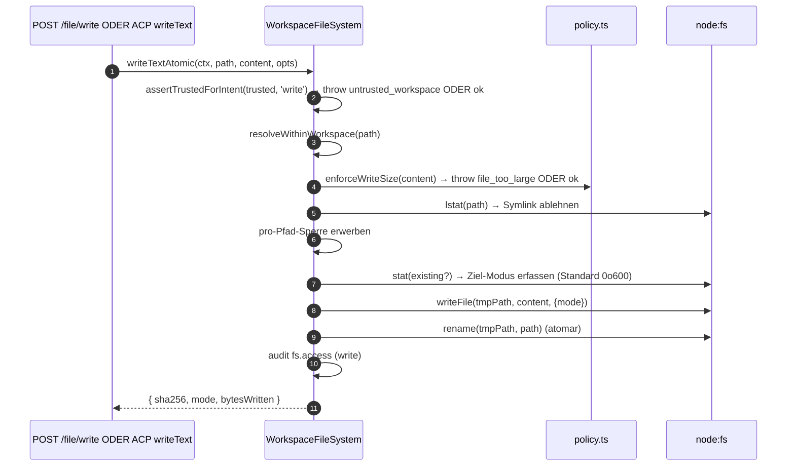
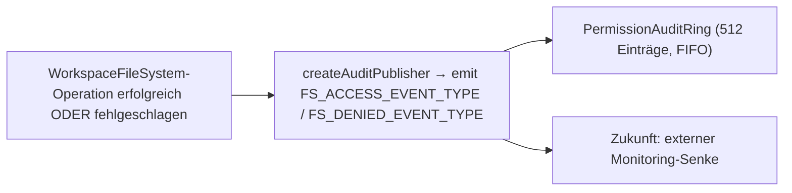

# Workspace-Dateisystem-Grenze

## Übersicht

Der Daemon lässt niemals zu, dass HTTP-Routen oder ACP-seitige Agent-Aufrufe direkt auf das Host-Dateisystem zugreifen. Jeder Lese-, Schreib-, Auflistungs-, Glob- und Stat-Vorgang durchläuft die `WorkspaceFileSystem`-Grenze (`packages/cli/src/serve/fs/`), die Folgendes bereitstellt:

- **Pfadauflösung** – Pfade kanonisieren und alles ablehnen, was den gebundenen Arbeitsbereich verlässt, auch über Symlinks.
- **Vertrauensprüfung** – Schreibvorgänge verweigern, wenn der Arbeitsbereich nicht vertrauenswürdig ist (`untrusted_workspace`).
- **Größen- & Inhaltsrichtlinie** – Lese-Limit (`MAX_READ_BYTES = 256 KiB`), Schreib-Limit (`MAX_WRITE_BYTES = 5 MiB`), Binärerkennung.
- **Atomizität** – Schreiben-dann-Umbenennen mit Ziel-Modus-Erhaltung und Standard `0o600` für neue Dateien.
- **Prüfung** – Jeder Zugriff / jede Ablehnung erzeugt ein strukturiertes Ereignis für `PermissionAuditRing` / Monitoring.
- **Typisierte Fehler** – Geschlossene `FsErrorKind`-Union, die auf HTTP-Status abgebildet wird.

Die HTTP-Dateirouten (`GET /file`, `GET /file/bytes`, `POST /file/write`, `POST /file/edit`, `GET /list`, `GET /glob`, `GET /stat`) und der ACP-seitige `BridgeFileSystem`-Adapter (damit agentengesteuerte `readTextFile`/`writeTextFile`-Aufrufe dieselben Prüfungen durchlaufen) gehen beide durch diese Grenze.

## Verantwortlichkeiten

- Benutzerbereitgestellte Pfade in gebrandete `ResolvedPath`-Werte auflösen, die der Rest der Grenze sicher verwenden kann.
- Pfade außerhalb des gebundenen Arbeitsbereichs ablehnen (`path_outside_workspace`) und Pfade, deren Ziel ein Symlink ist (`symlink_escape`).
- Lesevorgänge über `MAX_READ_BYTES`, Schreibvorgänge über `MAX_WRITE_BYTES` und Binärdateien ablehnen (`binary_file`).
- Schreib-/Bearbeitungsvorgänge verweigern, wenn der Arbeitsbereich nicht vertrauenswürdig ist (`untrusted_workspace`) – geschützt durch `assertTrustedForIntent(trusted, intent)`.
- `.gitignore`/`.qwenignore`-Muster über `shouldIgnore` beachten.
- Atomares Schreiben-dann-Umbenennen mit Ziel-Modus-Erhaltung durchführen; Standard-Dateimodus für neue Dateien ist `0o600`.
- `fs.access`-/`fs.denied`-Prüfungsereignisse bei jeder Operation ausgeben.
- Jeden Fehler auf einen `FsError` mit Art und HTTP-Status abbilden; Routen-Handler serialisieren sie einheitlich.

## Architektur

### Modulaufteilung

| Datei                       | Zweck                                                                                                                                                                                                                                                     |
| --------------------------- | --------------------------------------------------------------------------------------------------------------------------------------------------------------------------------------------------------------------------------------------------------- |
| `paths.ts`                  | `canonicalizeWorkspace`, `resolveWithinWorkspace`, `hasSuspiciousPathPattern`, gebrandetes `ResolvedPath`, `Intent`-Union (`read \| write \| list \| stat \| glob`).                                                                                      |
| `policy.ts`                 | `MAX_READ_BYTES`, `MAX_WRITE_BYTES`, `BINARY_PROBE_BYTES`, `assertTrustedForIntent`, `detectBinary`, `enforceReadBytesSize`, `enforceReadSize`, `enforceWriteSize`, `shouldIgnore`.                                                                       |
| `audit.ts`                  | `FS_ACCESS_EVENT_TYPE`, `FS_DENIED_EVENT_TYPE`, `createAuditPublisher`, Audit-Payload-Typen.                                                                                                                                                              |
| `errors.ts`                 | `FsError`-Klasse, `isFsError`, `FsErrorKind`-Union (14 Arten), `FsErrorStatus`-Union (`400 / 403 / 404 / 409 / 413 / 422 / 500 / 503`).                                                                                                                   |
| `workspace-file-system.ts`  | `createWorkspaceFileSystemFactory`, `WorkspaceFileSystem` (der Orchestrator, der liest/schreibt/auflistet), `WriteMode`, `ContentHash`, `FsEntry`, `FsStat`, `ListOptions`, `GlobOptions`, `ReadTextOptions`, `ReadBytesOptions`, `WriteTextAtomicOptions`. |

### `FsErrorKind`-Taxonomie

| Art                        | Standard-HTTP | Bedeutung                                                                                                                                                                                         |
| -------------------------- | ------------- | ------------------------------------------------------------------------------------------------------------------------------------------------------------------------------------------------- |
| `path_outside_workspace`   | 400           | Aufgelöster Pfad liegt außerhalb des gebundenen Arbeitsbereichs.                                                                                                                                  |
| `symlink_escape`           | 400           | Ziel ist ein Symlink (abgelehnt gemäß der konservativen Haltung aus PR 18 + PR 20).                                                                                                               |
| `path_not_found`           | 404           | `ENOENT`.                                                                                                                                                                                         |
| `binary_file`              | 422           | Inhalt auf einer Text-Route als Binär erkannt.                                                                                                                                                    |
| `file_too_large`           | 413           | Über `MAX_READ_BYTES` oder `MAX_WRITE_BYTES`.                                                                                                                                                     |
| `hash_mismatch`            | 409           | Optimistische Nebenläufigkeit `expectedSha256` fehlgeschlagen.                                                                                                                                    |
| `file_already_exists`      | 409           | `mode: 'create'` gegen eine vorhandene Datei.                                                                                                                                                     |
| `text_not_found`           | 422           | Der Suchstring von `POST /file/edit` war nicht in der Datei.                                                                                                                                      |
| `ambiguous_text_match`     | 422           | Mehrere Treffer, obwohl genau einer erforderlich war.                                                                                                                                             |
| `untrusted_workspace`      | 403           | Schreibversuch in einem nicht vertrauenswürdigen Arbeitsbereich.                                                                                                                                  |
| `permission_denied`        | 403           | OS-Level `EACCES`/`EPERM`.                                                                                                                                                                        |
| `io_error`                 | 503           | `ENOSPC`/`EIO`/`EBUSY`/`ETXTBSY`/`ENAMETOOLONG`/`EMFILE`/`ENFILE`. **Abgegrenzt von `permission_denied`**, damit Überwachungspipelines Sicherheitsverantwortliche nicht wegen "Festplatte voll" alarmieren. |
| `internal_error`           | 500           | Nicht-Errno-Fehler, der die Grenze erreicht (`TypeError`, Programmierfehler).                                                                                                                     |
| `parse_error`              | 400 / 422     | Request-Body-Parse-Fehler (400) oder Invariante auf Service-Ebene verletzt (422).                                                                                                                |

### `BridgeFileSystem` (der ACP-seitige Adapter)

`packages/acp-bridge/src/bridgeFileSystem.ts` definiert:

```ts
interface BridgeFileSystem {
  readText(params: ReadTextFileRequest): Promise<ReadTextFileResponse>;
  writeText(params: WriteTextFileRequest): Promise<WriteTextFileResponse>;
}
```

Dies ist der Injektionspunkt für ACP `readTextFile`/`writeTextFile`. Bridge-Tests und eingebettete Mode-A-Aufrufer können ihn in `BridgeOptions` weglassen; `BridgeClient` greift auf seinen Inline-`fs.readFile`-/`fs.writeFile`-Proxy zurück (bewahrt das Pre-F1-Verhalten). Die Produktion `qwen serve` verdrahtet `BridgeFileSystem` über `createBridgeFileSystemAdapter(fsFactory)` (`packages/cli/src/serve/bridge-file-system-adapter.ts`), sodass agentenseitige ACP-Schreibvorgänge dieselben TOCTOU-, Symlink-, Vertrauens- und Prüfungsgates wie die HTTP-Routen übernehmen.

Zwei defensive Gates, die der Adapter replizieren MUSS (da der Inline-Proxy vollständig umgangen wird, wenn der Adapter injiziert ist):

1. **Nicht-gewöhnliche Dateien ablehnen** – Sockets/Pipes/Character-Devices/procfs/sysfs-Einträge können unbegrenzte Daten streamen, obwohl `stats.size === 0`. Der Inline-Pfad wirft einen Fehler mit `describeStatKind(stats)` in der Nachricht.
2. **Gepufferte Größe begrenzen** auf `READ_FILE_SIZE_CAP = 100 MiB`. Eine kleine Anfrage `{ line: 1, limit: 10 }` gegen eine 500 MB große Logdatei würde sonst 500 MB RSS kosten, nur um 10 Zeilen zurückzugeben.

Der Adapter geht noch weiter: Er verwendet `WorkspaceFileSystem.writeTextOverwrite` (PR-18-Primitive) für atomare temporäre Datei-Umbenennung-Schreibvorgänge mit Moduserhaltung, `0o600`-Standard und Symlink-Ablehnung innerhalb einer pro-Pfad-Sperre. Dies ist eine **Abweichung vom Pre-F1-Inline-Proxy**, der Symlinks aufgelöst und durch diese hindurch geschrieben hat – Agenten, die sich auf das Schreiben durch Symlink-Punktdateien verlassen haben, müssen nun direkt den aufgelösten Pfad adressieren.

### FsError-Erhaltung über die ACP-Verbindung

Wenn der `BridgeFileSystem`-Adapter einen `FsError` wirft (`kind: 'untrusted_workspace'`/`'symlink_escape'`/`'file_too_large'`/usw.), serialisiert der Standard-ACP-SDK-RPC-Fehlerpfad nur `error.message` als generischen `-32603 "Internal error"` – `kind`/`status`/`hint` werden entfernt. Der nachgelagerte Agent-RPC-Client müsste dann mit Regex auf die menschenlesbare Nachricht matchen, um getyptes UI (Auth-Wiederholung vs. Dateiauswahl vs. Proxy-Hinweis) zu dispatchen.

`BridgeClient.writeTextFile` und `BridgeClient.readTextFile` installieren einen dünnen Guard (`packages/acp-bridge/src/bridgeClient.ts`), der FsError-artige Würfe fängt und als ACP `RequestError` erneut wirft:

```ts
function isFsErrorShape(err: unknown): err is FsErrorShape {
  return (
    err instanceof Error &&
    err.name === 'FsError' &&
    typeof (err as { kind?: unknown }).kind === 'string'
  );
}

function preserveFsErrorOverAcp(err: unknown): never {
  if (isFsErrorShape(err)) {
    throw new RequestError(-32603, err.message, {
      errorKind: err.kind,
      ...(err.hint !== undefined ? { hint: err.hint } : {}),
      ...(err.status !== undefined ? { status: err.status } : {}),
    });
  }
  throw err;
}
```

Der RPC-Client des Agenten empfängt nun `data.errorKind` (den geschlossenen `FsErrorKind`-Wert) plus die optionalen `data.hint` und `data.status`, sodass SDK-Konsumenten auf das typisierte Enum verzweigen können, anstatt mit Regex auf die Nachricht zu matchen.

Zwei Design-Notizen:

- **Duck-Typing statt Import** – `FsError` lebt in `packages/cli/src/serve/fs/errors.ts`, während `BridgeClient` in `packages/acp-bridge` lebt. Ein direkter `import { FsError }` würde die Abhängigkeit umkehren. Der Duck-Check (`name === 'FsError'` + `kind: string`) spiegelt wider, was `mapDomainErrorToErrorKind` (`status.ts`) bereits für `TrustGateError`/`SkillError` aus demselben Cross-Package-Bundling-Grund tut.
- **JSON-RPC-Code bleibt bei -32603** – die Bridge kann `FsError.kind` nicht zuverlässig auf eine JSON-RPC-Fehlercode-Form abbilden, daher trägt das strukturierte `data`-Feld die semantischen Informationen für SDK-Konsumenten. Der Wire-Statuscode (`-32603` "internal error") bleibt unverändert; Clients routen auf `data.errorKind`.

### Vertrauensprüfung

`assertTrustedForIntent(trusted, intent)` verwendet das vom Aufrufer injizierte Vertrauens-Boolean; die Richtlinienebene liest `Config.isTrustedFolder()` nicht direkt. Lese-/Listen-/Stat-/Glob-Vorgänge sind immer erlaubt (Vertrauen ist nur für Schreibvorgänge erforderlich). Schreibabsichten in nicht vertrauenswürdigen Arbeitsbereichen werfen `FsError('untrusted_workspace', ..., status: 403)`. Das Vertrauenssignal fließt über `WorkspaceFileSystemFactoryDeps.trusted: boolean` ein – `runQwenServe` übergibt `true`, da der Betreiber den Daemon gegen einen Arbeitsbereich gestartet hat, dem er implizit vertraut; `createServeApp` (direkte Einbettung ohne `runQwenServe`) standardmäßig `false` und warnt einmal pro Prozess (siehe [`02-serve-runtime.md`](./02-serve-runtime.md)).

## Workflow

### Lesen

```mermaid
sequenceDiagram
    autonumber
    participant R as HTTP-Route ODER BridgeFileSystem.readText
    participant FS as WorkspaceFileSystem
    participant POL as policy.ts
    participant FSP as node:fs

    R->>FS: readText(ctx, path, opts)
    FS->>FS: resolveWithinWorkspace(path) → ResolvedPath ODER throw
    FS->>FSP: stat(path)
    FSP-->>FS: stats
    FS->>FS: Ablehnen, wenn keine reguläre Datei (describeStatKind)
    FS->>POL: enforceReadSize(stats.size, opts.maxBytes?)<br/>→ throw file_too_large ODER Slice-Plan
    FS->>FSP: readFile(path)
    FSP-->>FS: buffer
    FS->>POL: detectBinary(buffer)
    POL-->>FS: isBinary?
    FS->>FS: Ablehnen, wenn binär; sha256-Hash; auf Zeilenfenster kürzen
    FS->>FS: shouldIgnore? → annotiere meta.matchedIgnore
    FS->>FS: audit fs.access
    FS-->>R: { content, sha256, truncated?, meta }
```

`readText` überspringt oder lehnt Lesevorgänge aufgrund von Ignorier-Regeln nicht ab. Es liest die Datei normal und zeichnet die passende Ignorier-Klassifizierung in `meta.matchedIgnore` auf. `list` und `glob` filtern ignorierte Ergebnisse nur dann, wenn `includeIgnored` nicht aktiviert ist.

### Schreiben



Das atomare Schreiben-dann-Umbenennen stellt sicher, dass ein SIGKILL/OOM während des Schreibens das Ziel NICHT abgeschnitten hinterlässt. `mode: 'create'` bricht mit `file_already_exists` bei lstat ab; `mode: 'overwrite'` fährt fort; `expectedSha256` aktiviert optimistische Nebenläufigkeit (`hash_mismatch` bei Nichtübereinstimmung).

### `POST /file/edit` (einzelne Textersetzung)

Fügt zwei Fehlermodi zusätzlich zum Schreiben hinzu:

- `text_not_found` (422) – Suchstring nicht in der Datei.
- `ambiguous_text_match` (422) – Mehrere Treffer, wenn genau einer erforderlich war (Vertrag der Route).

### Audit-Fan-Out



`FS_ACCESS_EVENT_TYPE`/`FS_DENIED_EVENT_TYPE` transportieren Kontext (`ctx`), Pfad, Absicht, Ergebnis, errorKind?, gelesene/geschriebene Bytes, sha256?.

## Zustand & Lebenszyklus

- Die Factory wird einmal beim Daemon-Start erstellt (`runQwenServe` → `resolveBridgeFsFactory` → Adapter).
- Jede Anfrage erstellt einen `RequestContext` und ruft den Orchestrator der Factory nur für diesen Aufruf auf – kein langlebiger Zustand pro Datei.
- Pro-Pfad-Sperren leben nur für die Dauer der Schreiboperation (keine aufrufübergreifende Sperre; gleichzeitige Schreibvorgänge auf denselben Pfad konkurrieren um die Sperre und werden serialisiert).
- Der Audit-Ring gehört `runQwenServe` und wird mit dem Berechtigungs-Audit-Publisher geteilt.

## Abhängigkeiten

- `@qwen-code/qwen-code-core` – `Ignore`, `isBinaryFile`, `Config.isTrustedFolder()`.
- `node:fs`, `node:path`, `node:crypto`.
- `@qwen-code/acp-bridge` – `BridgeFileSystem`-Vertrag auf der ACP-Seite.
- HTTP-Routen: `packages/cli/src/serve/routes/workspace-file-read.ts`, `workspace-file-write.ts`.

## Konfiguration

| Quelle                                             | Stellhebel                                                           | Wirkung                                                                                                               |
| -------------------------------------------------- | -------------------------------------------------------------------- | --------------------------------------------------------------------------------------------------------------------- |
| `WorkspaceFileSystemFactoryDeps.trusted: boolean`  | Konstruktor-Eingabe                                                  | Ob Schreibvorgänge erlaubt sind; Standard `true` von `runQwenServe`, `false` von `createServeApp` (mit Warnung).      |
| Konstante                                          | `MAX_READ_BYTES = 256 KiB`                                           | Lese-Limit; `file_too_large` darüber.                                                                                 |
| Konstante                                          | `MAX_WRITE_BYTES = 5 MiB`                                            | Schreib-Limit; unterhalb von `express.json({ limit: '10mb' })` dimensioniert.                                         |
| Konstante                                          | `BINARY_PROBE_BYTES = 4096`                                          | Stichprobengröße für inhaltsbasierte Binärerkennung.                                                                  |
| Capability-Tags                                    | `workspace_file_read`, `workspace_file_bytes`, `workspace_file_write`| Siehe [`11-capabilities-versioning.md`](./11-capabilities-versioning.md).                                             |
| Arbeitsbereichsdateien                             | `.gitignore`, `.qwenignore`                                          | Ignorierte Pfade werden von `shouldIgnore` als `ignored: true` gemeldet.                                              |

## Hinweise & bekannte Grenzen

- **Symlinks werden abgelehnt, nicht verfolgt.** Dies ist eine Abweichung vom Inline-`BridgeClient.writeTextFile`-Proxy vor F1, der Symlinks aufgelöst hat. Agenten, die durch Symlink-Punktdateien schreiben, müssen den aufgelösten Pfad direkt adressieren.
- **`io_error` und `permission_denied` sind verschieden.** Nicht vermischen. Überwachungspipelines nutzen `errorKind` zur Alarmierung – das Einordnen von ENOSPC in permission_denied würde Sicherheitsverantwortliche wegen `df -h`-Problemen alarmieren.
- **Neuer Dateimodus standardmäßig `0o600`, nicht umask-Standard.** Das `mode`-Argument des write-Syscalls umgeht die umask. Agenten, die öffentliche Dateien schreiben, sollten explizit eine Modus-Überschreibung übergeben.
- **`createServeApp` Standard `trusted: false`** lehnt ACP-Schreibvorgänge stillschweigend mit `untrusted_workspace` für Einbettende ab, die keine benutzerdefinierte `fsFactory` oder `bridge` injizieren. Eine einmalige stderr-Warnung wird beim ersten Mal ausgegeben; weitere Aufrufer erhalten keine Erinnerung. Siehe [`02-serve-runtime.md`](./02-serve-runtime.md).
- **Lese-Limit wird vor der Dekodierung erzwungen.** Eine Datei mit `MAX_READ_BYTES + 1` wird abgelehnt, selbst wenn die Anfrage nur 10 Zeilen möchte – weil das zugrundeliegende `readFileWithLineAndLimit` die gesamte Datei in den Speicher liest, bevor es sie sliced.
- **`BridgeFileSystem`-Adapter MUSS beide Inline-Proxy-Gates replizieren** (Ablehnung nicht-regulärer Dateien + Begrenzung der gepufferten Größe). Der Inline-Pfad wird vollständig umgangen, wenn der Adapter injiziert ist.

## Referenzen

- `packages/cli/src/serve/fs/index.ts` (Barrel)
- `packages/cli/src/serve/fs/paths.ts`
- `packages/cli/src/serve/fs/policy.ts`
- `packages/cli/src/serve/fs/errors.ts`
- `packages/cli/src/serve/fs/audit.ts`
- `packages/cli/src/serve/fs/workspace-file-system.ts`
- `packages/cli/src/serve/bridge-file-system-adapter.ts`
- `packages/acp-bridge/src/bridgeFileSystem.ts`
- HTTP-Route-Referenz: [`../qwen-serve-protocol.md`](../qwen-serve-protocol.md).