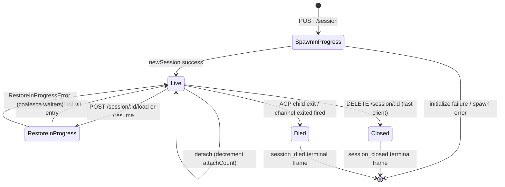

# Sitzungslebenszyklus & Identität

## Übersicht

Eine **Sitzung** (Session) des Daemons ist eine logische Unterhaltung, die an eine ACP‑`sessionId` gebunden ist. Die Bridge verwaltet pro Sitzung einen `SessionEntry` (siehe [`03-acp-bridge.md`](./03-acp-bridge.md)), der die ACP‑Kindverbindung mit HTTP‑seitigen Buchhaltungsdaten koppelt: Prompt‑FIFO, Modellwechsel‑FIFO, Event‑Bus, ausstehende Berechtigungen, angeschlossene Clients, Heartbeats, Wiederherstellungszustand, Terminal‑Frame‑Tombstones.

Ein **Client** des Daemons wird über `X-Qwen-Client-Id` identifiziert – eine undurchsichtige, vom Daemon validierte Zeichenkette, die der HTTP‑Aufrufer seinen Requests beifügt. Die Bridge verfolgt, welche Clients welchen Sitzungen zugeordnet sind, und verwendet die ID des ursprünglichen Absenders, um die `designated`‑Berechtigungsrichtlinie, Prüfpfade und Ereigniszuschreibungen zu steuern.

Dieses Dokument erklärt jeden Übergang im Sitzungslebenszyklus (erstellen / anfügen / laden / fortsetzen / schließen / beenden / verdrängen) sowie jede Identitätsoberfläche, die der Daemon bereitstellt.

## Zuständigkeiten

- Sitzungen anlegen, anfügen, wiederherstellen und räumen.
- `X-Qwen-Client-Id` validieren und fehlerhafte IDs ablehnen.
- Mehrere angefügte Clients pro Sitzung verfolgen (`clientIds: Map<string, count>`, `attachCount`).
- `originatorClientId` auf ausgehenden Ereignissen setzen.
- Heartbeats ausführen, damit Dashboards wissen, welche Clients noch verbunden sind.
- Sitzungsmetadaten (`displayName`) bereitstellen, die Bediener über `PATCH /session/:id/metadata` setzen können.
- Ausgabe von Terminal‑Frames steuern (`session_died`, `session_closed`, `client_evicted`, `stream_error`).

## Architektur

| Belang                      | Quelle                                                        | Hinweise                                                                                     |
| --------------------------- | ------------------------------------------------------------- | -------------------------------------------------------------------------------------------- |
| `SessionEntry`              | `packages/acp-bridge/src/bridge.ts`                           | Pro‑Sitzungs‑Struktur; vollständige Feldliste in [`03-acp-bridge.md`](./03-acp-bridge.md).   |
| `BridgeSession` (öffentlich)| `packages/acp-bridge/src/bridgeTypes.ts`                      | `{ sessionId, workspaceCwd, attached, clientId?, createdAt? }`, an HTTP‑Handler zurückgegeben.|
| `BridgeSessionState`        | `packages/acp-bridge/src/bridgeTypes.ts`                      | `LoadSessionResponse \| ResumeSessionResponse`, als `restoreState` auf dem Eintrag zwischengespeichert. |
| `DaemonSession` (SDK)       | `packages/sdk-typescript/src/daemon/types.ts`                 | `{ sessionId, workspaceCwd, attached, clientId?, createdAt? }`.                               |
| Client‑ID‑Validierung       | `packages/acp-bridge/src/bridge.ts` (um `spawnOrAttach` herum)| Muster `[A-Za-z0-9._:-]{1,128}`; `InvalidClientIdError` bei Fehlern.                          |
| Sitzungs‑Trennungs‑Räumer   | `packages/cli/src/serve/server.ts`                            | Verfolgt Trennungen des Spawn‑Besitzers mit `attachCount` + `spawnOwnerWantedKill`.            |

### Zustandsautomat



### Anfügen vs. Erzeugen

Unter `sessionScope: 'single'` (Standard) wird der `defaultEntry` der Bridge von jedem verbindenden Client gemeinsam genutzt. Ein `POST /session`, das eintrifft, während `defaultEntry` bereits existiert, gibt `attached: true` zurück, ohne ein neues ACP‑Kind zu erzeugen. Die Bridge erhöht synchron `attachCount` und trägt die `X-Qwen-Client-Id` des Aufrufers in `clientIds` ein.

Unter `sessionScope: 'thread'` kann jeder Thread eine eigene Sitzung erzeugen. Der Aufrufer respektiert weiterhin `maxSessions`.

### Identität

`X-Qwen-Client-Id` ist **optional**, aber **dringend empfohlen**. Der Daemon generiert keine eigene ID für den Aufrufer – Clients wählen ihre eigene ID und verwenden sie über mehrere Requests hinweg, sodass der Daemon Abstimmungen, Prüfereignisse und Wiederverbindungen zuordnen kann.

Validierungsregeln:

- Zeichensatz: `[A-Za-z0-9._:-]`
- Länge: 1–128
- Außerhalb dieses Bereichs: `InvalidClientIdError` (`400`)

Der Daemon setzt `originatorClientId` auf ausgehenden SSE‑Ereignissen, wenn:

1. Der Request, der das Ereignis auslöste, `X-Qwen-Client-Id` enthielt, UND
2. die ID aktuell im `clientIds`‑Set der Sitzung registriert ist, UND
3. die Sitzung eine gesetzte `activePromptOriginatorClientId` hat (inline‑`sessionUpdate` und `permission_request` erben den Ursprungsabsender vom aktiven Prompt).

Anonyme Aufrufer (ohne `X-Qwen-Client-Id`) funktionieren mit der `first-responder`‑Richtlinie; `designated` lehnt ihre Stimmen mit `permission_forbidden{ reason: 'designated_mismatch' }` ab; `consensus` lehnt ebenfalls mit `forbidden` ab, weil der Wähler nicht in der zum Zeitpunkt der Ausstellung aufgenommenen `votersAtIssue`‑Momentaufnahme enthalten ist; `local-only` ist die einzige Richtlinie, die anonyme Loopback‑Wähler akzeptiert.
## Workflow

### Erstellen oder anhängen

```mermaid
sequenceDiagram
    autonumber
    participant C as Client
    participant R as POST /session
    participant B as Bridge.spawnOrAttach
    participant CH as ACP child

    C->>R: POST /session<br/>X-Qwen-Client-Id: alice<br/>{cwd, sessionScope?}
    R->>R: validate clientId pattern
    R->>B: spawnOrAttach({cwd, sessionScope, clientId})
    alt single scope + defaultEntry exists
        B->>B: bump attachCount; register clientId
        B-->>R: {sessionId, attached: true, restoreState?}
    else cold
        B->>CH: spawn + ACP initialize + newSession
        CH-->>B: sessionId
        B->>B: build SessionEntry; register in byId
        B-->>R: {sessionId, attached: false}
    end
    R-->>C: 200 { sessionId, attached, ... }
```

### Laden / fortsetzen

`POST /session/:id/load` – spielt die vollständige ACP-Historie erneut ab (`session/load`-Benachrichtigungen werden ausgelöst, bevor die Antwort zurückkommt).
`POST /session/:id/resume` – stellt wieder her ohne Wiederholung (`connection.unstable_resumeSession`, bereitgestellt unter der stabilen Daemon-Fähigkeit `session_resume`; `unstable_session_resume` bleibt ein veralteter Alias).

Beide:

1. Verwenden einen pro-Sitzung `pendingRestoreIds`-Satz auf dem Kanal, sodass gleichzeitige Restore-Aufrufe zusammengefasst werden (`RestoreInProgressError`).
2. Zwischenspeichern `restoreState` im Eintrag, sodass ein späterer Anhänger dieselbe Nutzlast erhält wie der ursprüngliche Wiederhersteller.

### Heartbeat

`POST /session/:id/heartbeat` aktualisiert `sessionLastSeenAt` unabhängig von `clientId`. Trägt die Anfrage eine registrierte `X-Qwen-Client-Id`, wird auch `clientLastSeenAt.set(clientId, Date.now())` aktualisiert. Die sitzungsbezogene Entfernung pro Client ist in v1 **nicht** implementiert; der Widerruf ist für F-Serie Welle 5 geplant. Derzeit bieten Heartbeats Beobachtbarkeit für Dashboards und für die anstehende Widerrufsrichtlinie in PR 24.

### Metadaten

`PATCH /session/:id/metadata` akzeptiert `{displayName?}`. Validierung:

- Maximale Länge: `MAX_DISPLAY_NAME_LENGTH = 256`.
- Darf keine Steuerzeichen enthalten (`hasControlCharacter` lehnt Codepunkte ≤ 0x1f oder == 0x7f ab).
- `InvalidSessionMetadataError` (`400`) bei Verstoß.

Ein erfolgreiches Update sendet `session_metadata_updated` an jeden Abonnenten.

### Beendigung

| Abschlussereignis | Auslöser |
| ---------------- | ------------------------------------------------------------------------------------------------------------------------------------------------------------- |
| `session_closed` | `DELETE /session/:id` (client_close) oder programmatisches Schließen. |
| `session_died`   | `channel.exited` wird ausgelöst (aus beliebigem Grund: Absturz, Kindprozess beendet). Enthält `exitCode?` + `signalCode?`, wenn der OS-Exit-Pfad verwendet wurde. |
| `client_evicted` | Überlauf der Warteschlange pro Abonnent auf dem EventBus (siehe [`10-event-bus.md`](./10-event-bus.md)). KEINE sitzungsbezogene Beendigung – nur dieser Abonnent wird geschlossen. |
| `stream_error`   | SubscriberLimitExceededError oder anderer streckenbezogener Stream-Fehler. |

Ausstehende Berechtigungen werden als `{kind:'cancelled', reason:'session_closed'}` über `mediator.forgetSession(sessionId)` auf jedem Beendigungspfad aufgelöst.

### Schutz durch Disconnect-Reaper

Wenn die HTTP-Antwort des Clients, der den Prozess gestartet hat, nicht geschrieben werden kann (TCP-Reset während des Handshakes), ruft die Route `killSession({ requireZeroAttaches: true })` auf. Falls ein anderer Client bereits angehängt ist (`attachCount > 0`), wird der Schutz kurzgeschlossen und die Sitzung bleibt bestehen. Das Setzen von `spawnOwnerWantedKill = true` merkt sich diese Absicht, sodass ein späteres `detachClient()`, das `attachCount` wieder auf 0 bringt, die verzögerte Bereinigung abschließt. Ohne dies würde ein schnell trennender Startbesitzer eine intakte Sitzung bei jeder erneuten Verbindung zerstören.

## Zustand & Lebenszyklus

Für den Lebenszyklus kritische Felder von `SessionEntry`:

| Feld | Typ | Bedeutung |
| -------------------------------- | --------------------- | -------------------------------------------------------------------------------- |
| `clientIds` | `Map<string, number>` | Registrierte Client-IDs → Referenzzählung der Registrierung. |
| `attachCount` | `number` | Häufigkeit, mit der `spawnOrAttach` für diesen Eintrag `attached: true` zurückgegeben hat. |
| `activePromptOriginatorClientId` | `string?` | Urheber der derzeit laufenden Eingabeaufforderung. |
| `restoreState` | `BridgeSessionState?` | Zwischengespeicherte Load/Resume-Antwort, sodass spätere Anhänger konsistente Nutzlasten sehen. |
| `spawnOwnerWantedKill` | `boolean` | Grabstein für verzögerte Bereinigung (siehe Disconnect-Reaper oben). |
| `sessionLastSeenAt` | `number?` | Letzter Heartbeat über beliebige Clients hinweg (Epochen-Millisekunden). |
| `clientLastSeenAt` | `Map<string, number>` | Heartbeat pro Client. |
| `pendingPermissionIds` | `Set<string>` | Derzeit ausstehende ACP-requestIds – werden bei Abbruch/Schließen als abgebrochen aufgelöst. |
## Abhängigkeiten

- ACP-Ebene: `connection.newSession`, `connection.unstable_resumeSession`, `connection.loadSession`.
- [`03-acp-bridge.md`](./03-acp-bridge.md) für die umgebende Bridge-Architektur.
- [`04-permission-mediation.md`](./04-permission-mediation.md) für die Entscheidungsfindung auf Basis von Originator + Identität.
- [`10-event-bus.md`](./10-event-bus.md) für die Zustellung von Terminal-Frames.

## Zusätzliche Session-Endpunkte

Diese Endpunkte erweitern die grundlegende Lebenszyklus-Oberfläche:

### Non-blocking Prompt (`non_blocking_prompt` capability tag)

`POST /session/:id/prompt` gibt jetzt HTTP **202** zurück mit
`{ promptId, lastEventId }` statt zu blockieren, bis der Prompt abgeschlossen ist.
Das eigentliche Ergebnis wird per SSE als `turn_complete` / `turn_error` geliefert, und das
Feld `promptId` verknüpft diese Ereignisse mit der 202-Antwort.
`DaemonSessionClient.prompt()` verwendet automatisch den nicht-blockierenden Pfad, wenn es
ein aktives Event-Abonnement hat, und ordnet das Ergebnis transparent dem SSE-Stream zu.

### Session Recap (`session_recap` capability tag)

`POST /session/:id/recap` fragt das schnelle Modell nach einer einzeiligen „Wo habe ich aufgehört“-Zusammenfassung. Es gibt `{ sessionId, recap: string | null }` zurück; `null` bedeutet, dass der Verlauf zu kurz oder das Modell vorübergehend fehlgeschlagen ist. Dieser Endpunkt arbeitet nach bestem Bemühen (best-effort).

### Session BTW / Side Question (`session_btw` capability tag)

`POST /session/:id/btw` stellt eine einmalige Frage zum Session-Kontext, ohne den Hauptgesprächsfluss zu unterbrechen. Es verwendet `runForkedAgent` auf dem Cache-Pfad für einen Single-Turn-LLM-Aufruf ohne Tools und gibt `{ sessionId, answer: string | null }` zurück. Die Implementierung erzwingt `BTW_MAX_INPUT_LENGTH`, Schutz vor sessionübergreifenden Datenlecks und Timeout-Behandlung.

### Shell Command Execution

`POST /session/:id/shell` führt einen Shell-Befehl direkt auf dem Daemon-Host aus, ohne durch das LLM zu leiten. Die Ausgabe wird per SSE-Bus der Session als `user_shell_command` / `user_shell_result`-Events gestreamt und der Befehl samt Ergebnis in den LLM-Gesprächsverlauf eingefügt. Die Antwort ist `{ exitCode, output, aborted }`.

### Session Detach

`POST /session/:id/detach` trennt explizit einen Client von einer Session, indem es `attachCount` dekrementiert; es schließt die Session nicht selbst. Wenn kein anderer Attach- oder Subscriber mehr vorhanden ist, wird die Session abgeräumt. Der Endpunkt gibt 204 zurück.

### Batch Session Delete

`POST /sessions/delete` akzeptiert `{ sessionIds: string[] }` (bis zu 100 IDs), schließt Bridge-Sessions und löscht Transkriptdateien. Es verwendet `Promise.allSettled` für Resilienz und gibt `{ removed, notFound, errors }` zurück.

### Context Usage (`session_context_usage` capability tag)

`GET /session/:id/context-usage` gibt eine strukturierte Nutzung des Kontextfensters zurück. `?detail=true` enthält detailliertere Nutzung, gruppiert nach Tool, Memory und Skill.

### Session Stats (`session_stats` capability tag)

`GET /session/:id/stats` gibt Nutzungsstatistiken zurück: Modellmetriken (Input/Output-Token, Cache-Lese-/Schreibvorgänge, Gesamtkosten), Aufrufzahlen und Latenzen pro Tool, Dateibearbeitungszählungen und Aufrufzahlen pro Skill für die aktive Session. Der `skills`-Block spiegelt Skill-Body-Ladungen und Skill-Slash-Befehle nur innerhalb dieser Session wider; es handelt sich nicht um eine sessionsübergreifende Aktivitätsübersicht.

### Session Tasks (`session_tasks` capability tag)

`GET /session/:id/tasks` gibt eine Momentaufnahme der Hintergrundaufgaben für Agenten-aufgaben, Shell-Aufgaben und Überwachungsaufgaben sowie deren Lebenszyklusstatus zurück.

### Session LSP Status (`session_lsp` capability tag)

`GET /session/:id/lsp` gibt bereinigten LSP-Status pro Session für Daemon-Clients zurück: Aktivierung, aggregierte Serveranzahlen, nicht verfügbarer/Initialisierungsstatus und pro-Server `name`, `status`, `languages`, `transport`, `command` und `error`. Deaktiviertes oder nicht verfügbares LSP wird als HTTP-200-Statusdaten dargestellt, nicht als Transportfehler.

### Compacted Replay

`POST /session/:id/load` gibt jetzt ein `BridgeRestoredSession` zurück, das `compactedReplay?: BridgeEvent[]`, `liveJournal?: BridgeEvent[]` und `lastEventId?: number` enthalten kann. `compactedReplay` wird von der `TurnBoundaryCompactionEngine` erzeugt: an Turn-Grenzen werden aufeinanderfolgende Text-/Denkblöcke zusammengeführt, Tool-Call-Sequenzen auf ihren Endzustand reduziert, transiente Signale verworfen und O(turns) Wiedergabelogs anstelle von O(tokens) Logs erzeugt (typischerweise eine Reduktion um den Faktor 25–30).

### ACP Child Preheat

`bridge.preheat()` wärmt den ACP-Kindprozess vor der ersten Session auf, sodass die erste echte Session keine Kaltstartlatenz erleidet. Es arbeitet mit `channelIdleTimeoutMs` zusammen, das den ACP-Kindprozess nach dem Schließen der letzten Session am Leben hält, und mit dem Skip-Reload-Verhalten, das einen bereits ruhenden Kindprozess wiederverwendet, wenn eine neue Session eintrifft.

## Konfiguration

- `BridgeOptions.maxSessions` (Standard 20) – Obergrenze.
- `BridgeOptions.sessionScope` (Standard `'single'`; optional `'thread'`).
- `BridgeOptions.initializeTimeoutMs` (Standard 10s) – ACP-`initialize`-Handshake.
- `BridgeOptions.channelIdleTimeoutMs` (Standard 0; ACP-Kind sofort beenden).
- Fähigkeits-Tags: `session_create`, `session_scope_override`, `session_load`, `session_resume`, `unstable_session_resume` (veralteter Alias), `session_list`, `session_close`, `session_metadata`, `session_set_model`, `client_identity`, `client_heartbeat`, `session_recap`, `session_btw`, `session_context_usage`, `session_tasks`, `session_stats`, `session_lsp`, `non_blocking_prompt`.
## Hinweise & bekannte Grenzen

- `connection.unstable_resumeSession` ist möglicherweise auf der ACP-Ebene noch instabil, aber der Daemon bewirbt den festgelegten v1-Routenvertrag mit `session_resume`. `unstable_session_resume` wird nur als veralteter Kompatibilitäts-Alias beibehalten.
- v1 hat **kein client-spezifisches Entfernen** (kein per-client eviction); nur Sitzungs- und Abonnenten-basierte Beendigung. Die Widerrufsrichtlinie ist F-Serie Welle 5 / PR 24.
- `client_evicted` gilt pro Abonnent, nicht pro Sitzung. Ein Client, dessen SSE-Abonnent entfernt wurde, kann sich erneut verbinden.
- Anonyme Clients (ohne `X-Qwen-Client-Id`) können bei den Richtlinien `designated` oder `consensus` nicht abstimmen.

## Referenzen

- `packages/acp-bridge/src/bridge.ts` (Definition von SessionEntry)
- `packages/acp-bridge/src/bridgeTypes.ts` (`HttpAcpBridge`, `BridgeSession`, `BridgeSessionState`)
- `packages/sdk-typescript/src/daemon/types.ts` (`DaemonSession`)
- `packages/sdk-typescript/src/daemon/DaemonSessionClient.ts`
- Wire-Referenz: [`../qwen-serve-protocol.md`](../qwen-serve-protocol.md) (Routenverzeichnis).
