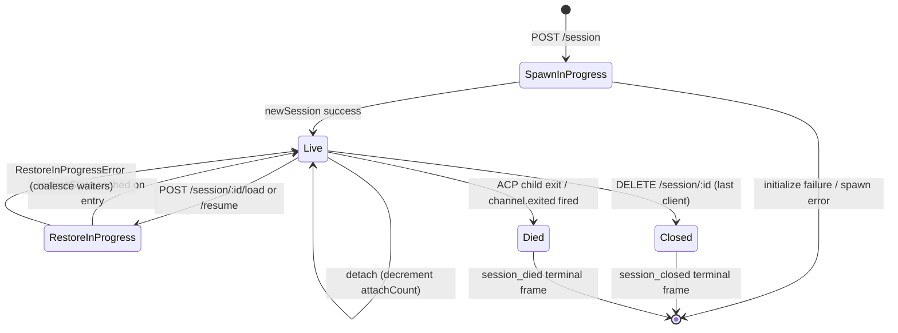

# Session-Lebenszyklus & Identität

## Übersicht

Eine Daemon-**Session** ist eine logische Konversation, die an eine ACP-`sessionId` gebunden ist. Die Bridge verwaltet pro Session einen `SessionEntry` (siehe [`03-acp-bridge.md`](./03-acp-bridge.md)), der die ACP-Child-Verbindung mit dem HTTP-seitigen Bookkeeping koppelt: Prompt-FIFO, Model-Change-FIFO, Event Bus, ausstehende Permissions, angehängte Clients, Heartbeats, Restore-State, Terminal-Frame-Tombstones.

Ein Daemon-**Client** wird durch die `X-Qwen-Client-Id` identifiziert – ein opaker, vom Daemon validierter String, den der HTTP-Caller seinen Requests hinzufügt. Die Bridge verfolgt, welche Clients mit welchen Sessions verbunden sind, und verwendet die Originator-Client-ID, um die `designated`-Permission-Policy, Audit-Trails und Event-Attribution zu steuern.

Dieses Dokument erklärt jeden Session-Lebenszyklus-Übergang (create / attach / load / resume / close / die / evict) und jede Identitätsoberfläche, die der Daemon bereitstellt.

## Verantwortlichkeiten

- Sessions erstellen, anhängen, wiederherstellen und bereinigen.
- `X-Qwen-Client-Id` validieren und fehlerhafte IDs ablehnen.
- Mehrere angehängte Clients pro Session verfolgen (`clientIds: Map<string, count>`, `attachCount`).
- `originatorClientId` zu ausgehenden Events hinzufügen.
- Heartbeats ausführen, damit Dashboards wissen, welche Clients noch verbunden sind.
- Session-Metadaten (`displayName`) bereitstellen, die Operatoren über `PATCH /session/:id/metadata` setzen.
- Ausgabe von Terminal-Frames steuern (`session_died`, `session_closed`, `client_evicted`, `stream_error`).

## Architektur

| Bereich                   | Quelle                                                       | Hinweise                                                                                  |
| ------------------------- | ------------------------------------------------------------ | ----------------------------------------------------------------------------------------- |
| `SessionEntry`            | `packages/acp-bridge/src/bridge.ts`                          | Pro-Session-Struct; siehe [`03-acp-bridge.md`](./03-acp-bridge.md) für die vollständige Feldauflistung. |
| `BridgeSession` (public)  | `packages/acp-bridge/src/bridgeTypes.ts`                     | `{ sessionId, workspaceCwd, attached, clientId?, createdAt? }`, das an HTTP-Handler zurückgegeben wird. |
| `BridgeSessionState`      | `packages/acp-bridge/src/bridgeTypes.ts`                     | `LoadSessionResponse \| ResumeSessionResponse`, im Entry als `restoreState` zwischengespeichert. |
| `DaemonSession` (SDK)     | `packages/sdk-typescript/src/daemon/types.ts`                | `{ sessionId, workspaceCwd, attached, clientId?, createdAt? }`.                           |
| Client-ID-Validierung     | `packages/acp-bridge/src/bridge.ts` (um `spawnOrAttach`)     | Pattern `[A-Za-z0-9._:-]{1,128}`; `InvalidClientIdError` bei fehlerhafter Formatierung.   |
| Session-Disconnect-Reaper | `packages/cli/src/serve/server.ts`                           | Verfolgt Spawn-Owner-Disconnects mit `attachCount` + `spawnOwnerWantedKill`.              |

### Zustandsmaschine



### Attach vs. Spawn

Unter `sessionScope: 'single'` (Standard) wird der `defaultEntry` der Bridge von jedem verbindenden Client geteilt. Ein `POST /session`, das eintrifft, während `defaultEntry` bereits existiert, gibt `attached: true` zurück, ohne ein neues ACP-Child zu spawnen. Die Bridge erhöht synchron den `attachCount` und registriert die `X-Qwen-Client-Id` des Callers in `clientIds`.

Unter `sessionScope: 'thread'` kann jeder Thread eine eigene Session erstellen. Der Caller beachtet dabei weiterhin `maxSessions`.

### Identität

`X-Qwen-Client-Id` ist **optional**, wird aber **dringend empfohlen**. Der Daemon generiert keine im Namen des Callers – Clients wählen ihre eigene und verwenden sie über Requests hinweg wieder, damit der Daemon Votes zuordnen, Events auditieren und Reconnects erkennen kann.

Validierungsregeln:

- Zeichensatz: `[A-Za-z0-9._:-]`.
- Länge: 1–128.
- Außerhalb dieses Sets: `InvalidClientIdError` (`400`).

Der Daemon fügt ausgehenden SSE-Events die `originatorClientId` hinzu, wenn:

1. der Request, der das Event ausgelöst hat, die `X-Qwen-Client-Id` enthielt, UND
2. die ID derzeit im `clientIds`-Set der Session registriert ist, UND
3. die Session eine `activePromptOriginatorClientId` gesetzt hat (Inline-`sessionUpdate` und `permission_request` erben den Originator vom aktiven Prompt).

Anonyme Caller (ohne `X-Qwen-Client-Id`) funktionieren einwandfrei mit der `first-responder`-Policy; `designated` lehnt ihre Votes mit `permission_forbidden{ reason: 'designated_mismatch' }` ab; `consensus` lehnt mit demselben `forbidden`-Grund ab, da der Voter nicht im `votersAtIssue`-Snapshot zum Ausgabezeitpunkt enthalten ist; `local-only` ist die einzige Policy, die anonyme Loopback-Voter akzeptiert.

## Workflow

### Erstellen oder Anhängen

```mermaid
sequenceDiagram
    autonumber
    participant C as Client
    participant R as POST /session
    participant B as Bridge.spawnOrAttach
    participant CH as ACP child

    C->>R: POST /session<br/>X-Qwen-Client-Id: alice<br/>{cwd, sessionScope?}
    R->>R: validate clientId pattern
    R->>B: spawnOrAttach({cwd, sessionScope, clientId})
    alt single scope + defaultEntry exists
        B->>B: bump attachCount; register clientId
        B-->>R: {sessionId, attached: true, restoreState?}
    else cold
        B->>CH: spawn + ACP initialize + newSession
        CH-->>B: sessionId
        B->>B: build SessionEntry; register in byId
        B-->>R: {sessionId, attached: false}
    end
    R-->>C: 200 { sessionId, attached, ... }
```

### Load / Resume

`POST /session/:id/load` – spielt die vollständige ACP-Historie ab (`session/load`-Benachrichtigungen werden vor der Rückgabe der Response ausgelöst).
`POST /session/:id/resume` – stellt ohne Replay wieder her (`connection.unstable_resumeSession`, verfügbar unter der stabilen `session_resume`-Daemon-Capability; `unstable_session_resume` bleibt ein deprecated Alias).

Beide:

1. Verwenden ein session-spezifisches `pendingRestoreIds`-Set auf dem Channel, sodass gleichzeitige Restore-Aufrufe zusammengeführt werden (`RestoreInProgressError`).
2. Zwischenspeichern von `restoreState` im Entry, sodass ein später verbindender Client dieselbe Payload erhält wie der ursprüngliche Restorer.

### Heartbeat

`POST /session/:id/heartbeat` aktualisiert `sessionLastSeenAt` unabhängig von der `clientId`. Wenn der Request eine registrierte `X-Qwen-Client-Id` enthält, wird zusätzlich `clientLastSeenAt.set(clientId, Date.now())` aktualisiert. Eine client-spezifische Eviction ist in v1 **nicht** implementiert; Revocation ist für F-Series Wave 5 geplant. Heute bieten Heartbeats Observability für Dashboards und für die kommende Revocation-Policy in PR 24.

### Metadaten

`PATCH /session/:id/metadata` akzeptiert `{displayName?}`. Validierung:

- Maximale Länge: `MAX_DISPLAY_NAME_LENGTH = 256`.
- Darf keine Steuerzeichen enthalten (`hasControlCharacter` lehnt Codepoints ≤ 0x1f oder == 0x7f ab).
- `InvalidSessionMetadataError` (`400`) bei Verstößen.

Ein erfolgreiches Update verteilt `session_metadata_updated` an alle Subscriber.

### Termination

| Terminal-Frame     | Auslöser                                                                                                                                                        |
| ------------------ | --------------------------------------------------------------------------------------------------------------------------------------------------------------- |
| `session_closed`   | `DELETE /session/:id` (client_close) oder programmatischer Close.                                                                                               |
| `session_died`     | `channel.exited` wird aus beliebigen Gründen ausgelöst (Crash, Child-Kill). Enthält `exitCode?` + `signalCode?`, wenn der OS-Exit-Pfad verwendet wurde.         |
| `client_evicted`   | Per-Subscriber-Queue-Überlauf auf dem EventBus (siehe [`10-event-bus.md`](./10-event-bus.md)). KEINE Session-Level-Termination – nur dieser Subscriber wird geschlossen. |
| `stream_error`     | SubscriberLimitExceededError oder anderer Route-Level-Stream-Fehler.                                                                                            |

Ausstehende Permissions werden auf jedem Termination-Pfad über `mediator.forgetSession(sessionId)` als `{kind:'cancelled', reason:'session_closed'}` aufgelöst.

### Disconnect-Reaper-Guard

Wenn die HTTP-Response des Spawn-owning Clients nicht geschrieben werden kann (TCP-Reset mitten im Handshake), ruft die Route `killSession({ requireZeroAttaches: true })` auf. Wenn bereits ein anderer Client angehängt ist (`attachCount > 0`), greift die Guard nicht und die Session läuft weiter. Das Setzen von `spawnOwnerWantedKill = true` merkt die Absicht vor, sodass ein späterer `detachClient()`-Aufruf, der `attachCount` auf 0 zurücksetzt, das verzögerte Aufräumen abschließt. Ohne dies würde ein schnell trennender Spawn-Owner bei jedem zweiten Reconnect eine gesunde Session abbauen.

## State & Lebenszyklus

Für den Lebenszyklus kritische `SessionEntry`-Felder:

| Feld                             | Typ                   | Bedeutung                                                                        |
| -------------------------------- | --------------------- | -------------------------------------------------------------------------------- |
| `clientIds`                      | `Map<string, number>` | Registrierte Client-IDs → Referenzzähler der Registrierung.                      |
| `attachCount`                    | `number`              | Anzahl der Male, die `spawnOrAttach` für diesen Entry `attached: true` zurückgegeben hat. |
| `activePromptOriginatorClientId` | `string?`             | Originator für den aktuell laufenden Prompt.                                     |
| `restoreState`                   | `BridgeSessionState?` | Zwischengespeicherte Load/Resume-Response, sodass später verbindende Clients konsistente Payloads sehen. |
| `spawnOwnerWantedKill`           | `boolean`             | Verzögerte-Reap-Tombstone (siehe Disconnect-Reaper oben).                        |
| `sessionLastSeenAt`              | `number?`             | Letzter Heartbeat über alle Clients hinweg (Epoch-ms).                           |
| `clientLastSeenAt`               | `Map<string, number>` | Heartbeat pro Client.                                                            |
| `pendingPermissionIds`           | `Set<string>`         | Derzeit ausstehende ACP-requestIds – werden bei Cancel/Close verwendet, um sie als cancelled aufzulösen. |

## Abhängigkeiten

- ACP-Layer: `connection.newSession`, `connection.unstable_resumeSession`, `connection.loadSession`.
- [`03-acp-bridge.md`](./03-acp-bridge.md) für die umgebende Bridge-Architektur.
- [`04-permission-mediation.md`](./04-permission-mediation.md) dafür, wie Originator + Identität Policy-Entscheidungen steuern.
- [`10-event-bus.md`](./10-event-bus.md) für die Terminal-Frame-Zustellung.

## Zusätzliche Session-Endpoints

Diese Endpoints erweitern die Basis-Lebenszyklus-Oberfläche:

### Non-blocking Prompt (`non_blocking_prompt` Capability-Tag)

`POST /session/:id/prompt` gibt jetzt HTTP **202** mit `{ promptId, lastEventId }` zurück, anstatt zu blockieren, bis der Prompt abgeschlossen ist. Das eigentliche Ergebnis trifft auf SSE als `turn_complete` / `turn_error` ein, und das `promptId`-Feld korreliert diese Events mit der 202-Response. `DaemonSessionClient.prompt()` verwendet automatisch den nicht-blockierenden Pfad, wenn es ein aktives Event-Abonnement hat, und gleicht das Ergebnis transparent aus dem SSE-Stream ab.

### Session Recap (`session_recap` Capability-Tag)

`POST /session/:id/recap` fragt das schnelle Modell nach einer einzeiligen Zusammenfassung im Stil von "Wo habe ich aufgehört". Es gibt `{ sessionId, recap: string | null }` zurück; `null` bedeutet, dass die Historie zu kurz war oder das Modell vorübergehend fehlgeschlagen ist. Dieser Endpoint ist Best-Effort.

### Session BTW / Side Question (`session_btw` Capability-Tag)

`POST /session/:id/btw` stellt eine einmalige Frage gegen den Session-Kontext, ohne den Hauptkonversationsfluss zu unterbrechen. Es verwendet `runForkedAgent` auf dem Cache-Pfad für einen Single-Turn-LLM-Call ohne Tools und gibt `{ sessionId, answer: string | null }` zurück. Die Implementierung erzwingt `BTW_MAX_INPUT_LENGTH`, Cross-Session-Leakage-Guards und Timeout-Handling.

### Shell-Befehlsausführung

`POST /session/:id/shell` führt einen Shell-Befehl direkt auf dem Daemon-Host aus, ohne über das LLM zu routen. Es streamt die Ausgabe auf dem Session-SSE-Bus über `user_shell_command` / `user_shell_result`-Events und injiziert den Befehl sowie das Ergebnis in die LLM-Konversationshistorie. Die Response ist `{ exitCode, output, aborted }`.

### Session Detach

`POST /session/:id/detach` trennt einen Client explizit von einer Session, indem es `attachCount` dekrementiert; es schließt die Session nicht von selbst. Wenn kein weiterer Attach oder Subscriber übrig ist, wird die Session aufgeräumt. Der Endpoint gibt 204 zurück.

### Batch Session Delete

`POST /sessions/delete` akzeptiert `{ sessionIds: string[] }` (bis zu 100 IDs), schließt Bridge-Sessions und löscht aktive oder archivierte Transcript-Dateien. Wenn für dieselbe ID sowohl aktive als auch archivierte JSONL-Dateien existieren, entfernt ein Hard Delete beide, sodass Operatoren den Konflikt bereinigen können. Es bereinigt aktive und archivierte Worktree-Sidecars, lässt aber File-History-Snapshots, Subagent-Transcripts und Runtime-Sidecars intakt. Es verwendet `Promise.allSettled` für Resilienz und gibt `{ removed, notFound, errors }` zurück.

### Session Archive

`POST /sessions/archive` verschiebt inaktive Session-JSONL-Dateien von `chats/` nach `chats/archive/`. Wenn die Ziel-Session live ist, tritt der Daemon zuerst in ein session-spezifisches Archive-Gate ein und führt einen strikten Close durch, der vom ACP-Child das Flushen von `ChatRecordingService` erfordert; Archive lässt die JSONL an Ort und Stelle, wenn Close oder Flush fehlschlägt.

`POST /sessions/unarchive` verschiebt archivierte JSONL-Dateien zurück nach `chats/`. Dies ist nur ein Storage-State-Übergang; Clients müssen danach `session/load` oder `session/resume` aufrufen. Archivierte Sessions geben für Load/Resume `409 session_archived` zurück, und Mutationen, die mit einem Archive-Übergang konkurrieren, geben `409 session_archiving` zurück.

### Context Usage (`session_context_usage` Capability-Tag)

`GET /session/:id/context-usage` gibt strukturierte Context-Window-Nutzung zurück. `?detail=true` beinhaltet feiner granulierte Nutzung, gruppiert nach Tool, Memory und Skill.

### Session Stats (`session_stats` Capability-Tag)

`GET /session/:id/stats` gibt Nutzungsstatistiken zurück: Modell-Metriken (Input/Output-Tokens, Cache-Reads/Writes, Gesamtkosten), Tool-Call-Zählungen und Latenzen pro Tool, File-Edit-Zählungen und Skill-Invocation-Zählungen pro Skill für die Live-Session. Der `skills`-Block spiegelt nur Skill-Body-Loads und Skill-Slash-Commands innerhalb dieser Session wider; er ist kein sessionübergreifendes Aktivitätsaggregat.

### Session Tasks (`session_tasks` Capability-Tag)

`GET /session/:id/tasks` gibt einen Background-Task-Snapshot für Agent-Tasks, Shell-Tasks, Monitor-Tasks und deren Lebenszyklus-Zustände zurück.

### Session LSP Status (`session_lsp` Capability-Tag)

`GET /session/:id/lsp` gibt bereinigten session-spezifischen LSP-Status für Daemon-Clients zurück: Aktivierung, aggregierte Server-Zählungen, nicht verfügbarer/Initialisierungs-Zustand sowie pro Server `name`, `status`, `languages`, `transport`, `command` und `error`. Deaktiviertes oder nicht verfügbares LSP wird als HTTP-200-Statusdaten dargestellt, nicht als Transportfehler.

### Compacted Replay

`POST /session/:id/load` gibt jetzt eine `BridgeRestoredSession` zurück, die `compactedReplay?: BridgeEvent[]`, `liveJournal?: BridgeEvent[]` und `lastEventId?: number` enthalten kann. `compactedReplay` wird von der `TurnBoundaryCompactionEngine` erzeugt: An Turn-Grenzen faltet sie aufeinanderfolgende Text-/Thought-Blöcke, komprimiert Tool-Call-Sequenzen auf ihren Endzustand, verwirft transiente Signale und erzeugt O(turns)-Replay-Logs anstelle von O(tokens)-Logs (typischerweise eine 25-30-fache Reduzierung).

### ACP Child Preheat

`bridge.preheat()` wärmt den ACP-Child-Prozess vor der ersten Session auf, sodass die erste echte Session Cold-Start-Latenz vermeidet. Es wird gepaart mit `channelIdleTimeoutMs`, das den ACP-Child nach dem Schließen der letzten Session am Leben erhält, und Skip-Relaunch-Verhalten, das ein bereits idle Child wiederverwendet, wenn eine neue Session eintrifft.

## Konfiguration

- `BridgeOptions.maxSessions` (Standard 20) – Obergrenze.
- `BridgeOptions.sessionScope` (Standard `'single'`; optional `'thread'`).
- `BridgeOptions.initializeTimeoutMs` (Standard 10s) – ACP-`initialize`-Handshake.
- `BridgeOptions.channelIdleTimeoutMs` (Standard 0; ACP-Child sofort aufräumen).
- Capability-Tags: `session_create`, `session_scope_override`, `session_load`, `session_resume`, `unstable_session_resume` (deprecated Alias), `session_list`, `session_close`, `session_metadata`, `session_set_model`, `client_identity`, `client_heartbeat`, `session_recap`, `session_btw`, `session_context_usage`, `session_tasks`, `session_stats`, `session_lsp`, `session_status`, `non_blocking_prompt`.

## Einschränkungen & bekannte Limits

- `connection.unstable_resumeSession` ist auf dem ACP-Layer möglicherweise noch instabil, aber der Daemon bewirbt den fest zugesagten v1-Route-Vertrag mit `session_resume`. `unstable_session_resume` wird nur als deprecated Kompatibilitäts-Alias beibehalten.
- v1 hat **keine client-spezifische Eviction**; nur session-spezifische und subscriber-spezifische Termination. Revocation-Policy ist F-Series Wave 5 / PR 24.
- `client_evicted` ist subscriber-spezifisch, nicht session-spezifisch. Ein Client, dessen SSE-Subscriber evicted wurde, kann sich erneut verbinden.
- Anonyme Clients (ohne `X-Qwen-Client-Id`) können unter `designated`- oder `consensus`-Policies nicht abstimmen.

## Referenzen

- `packages/acp-bridge/src/bridge.ts` (SessionEntry-Definition)
- `packages/acp-bridge/src/bridgeTypes.ts` (`HttpAcpBridge`, `BridgeSession`, `BridgeSessionState`)
- `packages/sdk-typescript/src/daemon/types.ts` (`DaemonSession`)
- `packages/sdk-typescript/src/daemon/DaemonSessionClient.ts`
- Wire-Referenz: [`../qwen-serve-protocol.md`](../qwen-serve-protocol.md) (Route-Katalog).