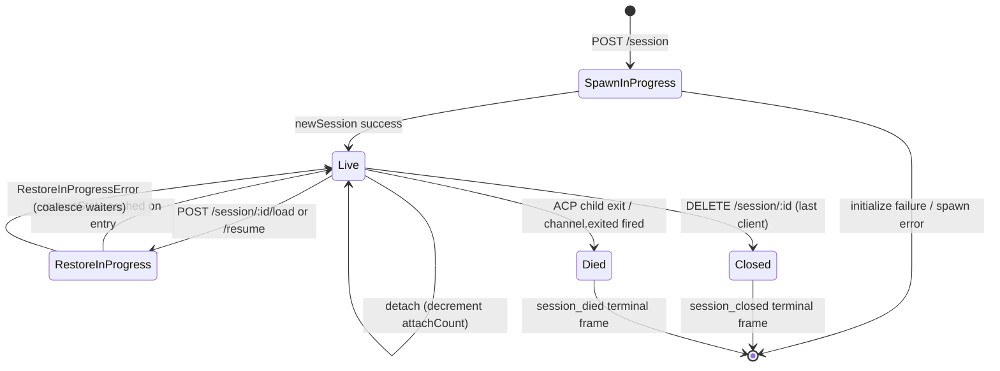

# Session Lifecycle & Identity (Sitzungslebenszyklus & Identität)

## Übersicht

Eine Daemon-**Session** ist eine logische Konversation, die an eine ACP `sessionId` gebunden ist. Die Bridge verwaltet einen `SessionEntry` pro Session (siehe [`03-acp-bridge.md`](./03-acp-bridge.md)), der die ACP-Child-Verbindung mit HTTP-seitiger Buchhaltung koppelt: Prompt-FIFO, Model-Change-FIFO, Event-Bus, ausstehende Berechtigungen, angehängte Clients, Heartbeats, Wiederherstellungszustand, Terminal-Frame-Tombstones.

Ein Daemon-**Client** wird durch `X-Qwen-Client-Id` identifiziert – eine undurchsichtige, vom Daemon validierte Zeichenkette, die der HTTP-Aufrufer auf seine Anfragen setzt. Die Bridge verfolgt, welche Clients an welche Sessions angehängt sind, und verwendet die Client-ID des Ursprungs, um die `designated`-Berechtigungsrichtlinie, Audit-Trails und Ereigniszuordnung zu steuern.

Dieses Dokument erklärt jeden Übergang im Session-Lebenszyklus (Erstellen / Anhängen / Laden / Fortsetzen / Schließen / Beenden / Entfernen) und jede Identitätsoberfläche, die der Daemon bereitstellt.

## Verantwortlichkeiten

- Sessions erzeugen, anhängen, wiederherstellen und aufräumen.
- `X-Qwen-Client-Id` validieren und fehlerhafte IDs ablehnen.
- Mehrere angehängte Clients pro Session verfolgen (`clientIds: Map<string, count>`, `attachCount`).
- `originatorClientId` auf ausgehende Ereignisse setzen.
- Heartbeats ausführen, damit Dashboards wissen, welche Clients noch verbunden sind.
- Session-Metadaten (`displayName`) bereitstellen, die Betreiber über `PATCH /session/:id/metadata` setzen können.
- Terminal-Frames ausgeben (`session_died`, `session_closed`, `client_evicted`, `stream_error`).

## Architektur

| Bereich                   | Quelle                                                       | Anmerkungen                                                                               |
| ------------------------- | ------------------------------------------------------------ | ----------------------------------------------------------------------------------------- |
| `SessionEntry`            | `packages/acp-bridge/src/bridge.ts`                          | Pro-Session-Struktur; vollständige Feldliste siehe [`03-acp-bridge.md`](./03-acp-bridge.md). |
| `BridgeSession` (öffentlich) | `packages/acp-bridge/src/bridgeTypes.ts`                     | `{ sessionId, workspaceCwd, attached, clientId?, createdAt? }` wird an HTTP-Handler zurückgegeben. |
| `BridgeSessionState`      | `packages/acp-bridge/src/bridgeTypes.ts`                     | `LoadSessionResponse | ResumeSessionResponse` zwischengespeichert im Eintrag als `restoreState`. |
| `DaemonSession` (SDK)     | `packages/sdk-typescript/src/daemon/types.ts`                | `{ sessionId, workspaceCwd, attached, clientId?, createdAt? }`.                           |
| Client-ID-Validierung     | `packages/acp-bridge/src/bridge.ts` (um `spawnOrAttach`)     | Muster `[A-Za-z0-9._:-]{1,128}`; `InvalidClientIdError` bei Fehler.                       |
| Session-Connection-Reaper | `packages/cli/src/serve/server.ts`                           | Verfolgt Verbindungsabbrüche des Spawn-Besitzers mit `attachCount` + `spawnOwnerWantedKill`. |

### Zustandsautomat



### Anhängen vs. Spawn

Unter `sessionScope: 'single'` (Standard) wird der `defaultEntry` der Bridge von jedem verbindenden Client gemeinsam genutzt. Ein `POST /session`, der eingeht, während `defaultEntry` bereits existiert, gibt `attached: true` zurück, ohne ein neues ACP-Child zu starten. Die Bridge erhöht synchron `attachCount` und registriert die `X-Qwen-Client-Id` des Aufrufers in `clientIds`.

Unter `sessionScope: 'thread'` kann jeder Thread eine eigene Session erzeugen. Der Aufrufer respektiert weiterhin `maxSessions`.

### Identität

`X-Qwen-Client-Id` ist **optional**, aber **dringend empfohlen**. Der Daemon generiert keine eigene ID im Namen des Aufrufers – Clients wählen ihre eigene und verwenden sie über Anfragen hinweg, damit der Daemon Stimmen zuordnen, Ereignisse auditieren und Wiederverbindungen erkennen kann.

Validierungsregeln:

- Zeichensatz: `[A-Za-z0-9._:-]`.
- Länge: 1–128.
- Außerhalb dieses Bereichs: `InvalidClientIdError` (`400`).

Der Daemon setzt `originatorClientId` auf ausgehende SSE-Ereignisse, wenn:

1. Die Anfrage, die das Ereignis auslöste, `X-Qwen-Client-Id` enthielt, UND
2. Die ID aktuell in der `clientIds`-Menge der Session registriert ist, UND
3. Die Session einen gesetzten `activePromptOriginatorClientId` hat (inline `sessionUpdate` und `permission_request` erben den Originator vom aktiven Prompt).

Anonyme Aufrufer (kein `X-Qwen-Client-Id`) funktionieren für die `first-responder`-Richtlinie einwandfrei; `designated` lehnt ihre Stimmen mit `permission_forbidden{ reason: 'designated_mismatch' }` ab; `consensus` lehnt mit demselben `forbidden`-Grund ab, da der Wähler nicht im zum Zeitpunkt der Ausstellung aufgenommenen `votersAtIssue`-Snapshot ist; `local-only` ist die einzige Richtlinie, die anonyme Loopback-Wähler akzeptiert.

## Arbeitsablauf

### Erstellen oder Anhängen

```mermaid
sequenceDiagram
    autonumber
    participant C as Client
    participant R as POST /session
    participant B as Bridge.spawnOrAttach
    participant CH as ACP child

    C->>R: POST /session<br/>X-Qwen-Client-Id: alice<br/>{cwd, sessionScope?}
    R->>R: validate clientId pattern
    R->>B: spawnOrAttach({cwd, sessionScope, clientId})
    alt single scope + defaultEntry exists
        B->>B: bump attachCount; register clientId
        B-->>R: {sessionId, attached: true, restoreState?}
    else cold
        B->>CH: spawn + ACP initialize + newSession
        CH-->>B: sessionId
        B->>B: build SessionEntry; register in byId
        B-->>R: {sessionId, attached: false}
    end
    R-->>C: 200 { sessionId, attached, ... }
```

### Laden / Fortsetzen

`POST /session/:id/load` – spielt die vollständige ACP-Historie ab (`session/load`-Benachrichtigungen werden ausgelöst, bevor die Antwort zurückkommt).
`POST /session/:id/resume` – stellt ohne Wiedergabe wieder her (`connection.unstable_resumeSession`, bereitgestellt unter dem stabilen Daemon-Feature `session_resume`; `unstable_session_resume` bleibt ein veralteter Alias).

Beide:

1. Verwenden eine pro-Session `pendingRestoreIds`-Menge auf dem Kanal, sodass gleichzeitige Wiederherstellungsaufrufe zusammengefasst werden (`RestoreInProgressError`).
2. Zwischenspeichern `restoreState` im Eintrag, damit ein späterer Anhänger dieselbe Nutzlast wie der ursprüngliche Wiederhersteller erhält.

### Heartbeat

`POST /session/:id/heartbeat` aktualisiert `sessionLastSeenAt` unabhängig von der `clientId`. Wenn die Anfrage eine registrierte `X-Qwen-Client-Id` enthält, wird auch `clientLastSeenAt.set(clientId, Date.now())` aktualisiert. Die Entfernung einzelner Clients ist **nicht** in v1 implementiert; der Widerruf ist für F-Serie Welle 5 geplant. Heute bieten Heartbeats Beobachtbarkeit für Dashboards und für die kommende Widerrufsrichtlinie in PR 24.

### Metadaten

`PATCH /session/:id/metadata` akzeptiert `{displayName?}`. Validierung:

- Maximale Länge: `MAX_DISPLAY_NAME_LENGTH = 256`.
- Darf keine Steuerzeichen enthalten (`hasControlCharacter` lehnt Codepunkte ≤ 0x1f oder == 0x7f ab).
- `InvalidSessionMetadataError` (`400`) bei Verstoß.

Ein erfolgreiches Update sendet `session_metadata_updated` an jeden Abonnenten.

### Beendigung

| Terminal-Frame   | Auslöser                                                                                                                     |
| ---------------- | ---------------------------------------------------------------------------------------------------------------------------- |
| `session_closed` | `DELETE /session/:id` (client_close) oder programmatisches Schließen.                                                        |
| `session_died`   | `channel.exited` wird aus beliebigem Grund ausgelöst (Absturz, Kind beenden). Überträgt `exitCode?` + `signalCode?`, wenn der OS-Beendigungspfad verwendet wurde. |
| `client_evicted` | Überlauf der Warteschlange pro Abonnent auf dem EventBus (siehe [`10-event-bus.md`](./10-event-bus.md)). KEINE Session-Beendigung – nur dieser Abonnent wird geschlossen. |
| `stream_error`   | SubscriberLimitExceededError oder anderer streckenbezogener Stream-Fehler.                                                   |

Ausstehende Berechtigungen werden als `{kind:'cancelled', reason:'session_closed'}` über `mediator.forgetSession(sessionId)` bei jedem Beendigungspfad aufgelöst.

### Schutz vor Verbindungsabbruch

Wenn die HTTP-Antwort des spawn-bereitstellenden Clients nicht geschrieben werden kann (TCP-Reset während des Handshakes), ruft die Route `killSession({ requireZeroAttaches: true })` auf. Wenn bereits ein anderer Client angehängt ist (`attachCount > 0`), bricht der Schutz kurz und die Session bleibt bestehen. Das Setzen von `spawnOwnerWantedKill = true` merkt sich die Absicht, sodass ein späteres `detachClient()`, das `attachCount` wieder auf 0 bringt, das verzögerte Aufräumen abschließt. Ohne dies würde ein schnell trennender Spawn-Besitzer bei jeder erneuten Verbindung eine gesunde Session niederreißen.

## Zustand & Lebenszyklus

`SessionEntry`-Felder, die für den Lebenszyklus entscheidend sind:

| Feld                              | Typ                  | Bedeutung                                                                         |
| -------------------------------- | -------------------- | --------------------------------------------------------------------------------- |
| `clientIds`                      | `Map<string, number>` | Registrierte Client-IDs → Referenzzähler.                                         |
| `attachCount`                    | `number`             | Wie oft `spawnOrAttach` `attached: true` für diesen Eintrag zurückgegeben hat.    |
| `activePromptOriginatorClientId` | `string?`            | Ursprung des aktuell laufenden Prompts.                                           |
| `restoreState`                   | `BridgeSessionState?`| Zwischengespeicherte Lade-/Fortsetzungsantwort, damit späte Anhänger konsistente Nutzlasten sehen. |
| `spawnOwnerWantedKill`           | `boolean`            | Tombstone für verzögertes Aufräumen (siehe Schutz vor Verbindungsabbruch oben).   |
| `sessionLastSeenAt`              | `number?`            | Jüngster Heartbeat über alle Clients hinweg (Epoche ms).                          |
| `clientLastSeenAt`              | `Map<string, number>`| Heartbeat pro Client.                                                             |
| `pendingPermissionIds`           | `Set<string>`        | Derzeit ausstehende ACP-Request-IDs – werden bei Abbruch/Schließen als abgebrochen aufgelöst. |

## Abhängigkeiten

- ACP-Ebene: `connection.newSession`, `connection.unstable_resumeSession`, `connection.loadSession`.
- [`03-acp-bridge.md`](./03-acp-bridge.md) für die umgebende Bridge-Architektur.
- [`04-permission-mediation.md`](./04-permission-mediation.md) für die Steuerung von Richtlinienentscheidungen durch Originator und Identität.
- [`10-event-bus.md`](./10-event-bus.md) für die Zustellung von Terminal-Frames.

## Zusätzliche Session-Endpunkte

Diese Endpunkte erweitern die grundlegende Lebenszyklusoberfläche:

### Nicht blockierender Prompt (`non_blocking_prompt`-Fähigkeits-Tag)

`POST /session/:id/prompt` gibt jetzt HTTP **202** zurück mit
`{ promptId, lastEventId }`, anstatt zu blockieren, bis der Prompt abgeschlossen ist. Das
tatsächliche Ergebnis kommt per SSE als `turn_complete` / `turn_error` an, und das
Feld `promptId` korreliert diese Ereignisse mit der 202-Antwort.
`DaemonSessionClient.prompt()` verwendet automatisch den nicht blockierenden Pfad, wenn ein
aktives Ereignisabonnement besteht, und gleicht das Ergebnis transparent aus dem
SSE-Stream ab.

### Session-Zusammenfassung (`session_recap`-Fähigkeits-Tag)

`POST /session/:id/recap` fragt das schnelle Modell nach einer einzeiligen Zusammenfassung „Wo war ich stehen geblieben?".
Es gibt `{ sessionId, recap: string | null }` zurück; `null` bedeutet, dass der
Verlauf zu kurz war oder das Modell vorübergehend fehlschlug. Dieser Endpunkt wird
nach bestem Wissen und Gewissen bereitgestellt.

### Session BTW / Seitenfrage (`session_btw`-Fähigkeits-Tag)

`POST /session/:id/btw` stellt eine einmalige Frage zum Session-Kontext,
ohne den Hauptgesprächsfluss zu unterbrechen. Es verwendet `runForkedAgent` auf dem
Cache-Pfad für einen Single-Turn-LLM-Aufruf ohne Tools und gibt
`{ sessionId, answer: string | null }` zurück. Die Implementierung erzwingt
`BTW_MAX_INPUT_LENGTH`, Schutz vor Cross-Session-Lecks und Timeout-Behandlung.

### Shell-Befehlsausführung

`POST /session/:id/shell` führt einen Shell-Befehl direkt auf dem Daemon-Host aus,
ohne den LLM zu durchlaufen. Es streamt die Ausgabe auf dem Session-SSE-Bus über
`user_shell_command` / `user_shell_result`-Ereignisse und fügt den Befehl sowie das
Ergebnis in den Gesprächsverlauf des LLM ein. Die Antwort ist
`{ exitCode, output, aborted }`.

### Session abtrennen

`POST /session/:id/detach` trennt einen Client explizit von einer Session, indem
`attachCount` dekrementiert wird; es schließt die Session nicht selbst. Wenn kein anderer
angehängter Client oder Abonnent mehr vorhanden ist, wird die Session aufgeräumt. Der Endpunkt gibt 204 zurück.

### Batch-Session-Löschung

`POST /sessions/delete` akzeptiert `{ sessionIds: string[] }` (bis zu 100 IDs),
schließt Bridge-Sessions und löscht Transkriptdateien. Es verwendet
`Promise.allSettled` für Resilienz und gibt `{ removed, notFound, errors }` zurück.

### Kontextnutzung (`session_context_usage`-Fähigkeits-Tag)

`GET /session/:id/context-usage` gibt eine strukturierte Nutzung des Kontextfensters zurück.
`?detail=true` enthält eine detailliertere Nutzung, gruppiert nach Tool, Speicher und Skill.

### Session-Statistiken (`session_stats`-Fähigkeits-Tag)

`GET /session/:id/stats` gibt Nutzungsstatistiken zurück: Modellmetriken
(Eingabe-/Ausgabetoken, Cache-Lese-/Schreibvorgänge, Gesamtkosten), Aufrufzahlen und Latenzen pro Tool,
Dateibearbeitungszahlen und Aufrufzahlen pro Skill für die aktive Session. Der `skills`-Block spiegelt Skill-Body-Ladungen und Skill-Slash-Befehle nur innerhalb dieser Session wider; es handelt sich nicht um eine Session-übergreifende Aktivitätsaggregation.

### Session-Aufgaben (`session_tasks`-Fähigkeits-Tag)

`GET /session/:id/tasks` gibt einen Snapshot von Hintergrundaufgaben für Agentenaufgaben,
Shell-Aufgaben, Überwachungsaufgaben und deren Lebenszyklusstatus zurück.

### Session-LSP-Status (`session_lsp`-Fähigkeits-Tag)

`GET /session/:id/lsp` gibt bereinigten pro-Session-LSP-Status für Daemon-Clients zurück: Aktivierung, aggregierte Serveranzahl, nicht verfügbaren/Initialisierungsstatus und pro-Server `name`, `status`, `languages`, `transport`, `command` und `error`. Deaktiviertes oder nicht verfügbares LSP wird als HTTP-200-Statusdaten dargestellt, nicht als Transportfehler.

### Komprimierte Wiedergabe

`POST /session/:id/load` gibt jetzt eine `BridgeRestoredSession` zurück, die
`compactedReplay?: BridgeEvent[]`, `liveJournal?: BridgeEvent[]` und
`lastEventId?: number` enthalten kann. `compactedReplay` wird von
`TurnBoundaryCompactionEngine` erzeugt: an Turn-Grenzen faltet es aufeinanderfolgende Text-/Denkblöcke zusammen, reduziert Tool-Call-Sequenzen auf ihren Endzustand, verwirft transiente Signale und erzeugt O(turns) Wiedergabelogs anstelle von O(token)-Logs (typischerweise eine 25-30-fache Reduktion).

### ACP-Child-Vorwärmung

`bridge.preheat()` wärmt den ACP-Child-Prozess vor der ersten Session auf, sodass
die erste reale Session die Kaltstart-Latenz vermeidet. Es paart sich mit
`channelIdleTimeoutMs`, das den ACP-Child nach dem Schließen der letzten Session am Leben hält, und dem Skip-Relaunch-Verhalten, das einen bereits untätigen Child wiederverwendet, wenn eine neue Session eintrifft.

## Konfiguration

- `BridgeOptions.maxSessions` (Standard 20) – Obergrenze.
- `BridgeOptions.sessionScope` (Standard `'single'`; optional `'thread'`).
- `BridgeOptions.initializeTimeoutMs` (Standard 10s) – ACP-`initialize`-Handshake.
- `BridgeOptions.channelIdleTimeoutMs` (Standard 0; ACP-Child sofort aufräumen).
- Fähigkeits-Tags: `session_create`, `session_scope_override`, `session_load`, `session_resume`, `unstable_session_resume` (veralteter Alias), `session_list`, `session_close`, `session_metadata`, `session_set_model`, `client_identity`, `client_heartbeat`, `session_recap`, `session_btw`, `session_context_usage`, `session_tasks`, `session_stats`, `session_lsp`, `session_status`, `non_blocking_prompt`.

## Warnungen & bekannte Einschränkungen

- `connection.unstable_resumeSession` ist auf ACP-Ebene möglicherweise noch instabil, aber der Daemon bewirbt den festgelegten v1-Routenvertrag mit `session_resume`. `unstable_session_resume` wird nur als veralteter Kompatibilitätsalias beibehalten.
- v1 hat **keine pro-Client-Entfernung**; nur pro-Session- und pro-Abonnent-Beendigung. Die Widerrufsrichtlinie ist F-Serie Welle 5 / PR 24.
- `client_evicted` ist pro-Abonnent, nicht pro-Session. Ein Client, dessen SSE-Abonnent entfernt wurde, kann sich wieder verbinden.
- Anonyme Clients (kein `X-Qwen-Client-Id`) können unter den Richtlinien `designated` oder `consensus` nicht abstimmen.

## Referenzen

- `packages/acp-bridge/src/bridge.ts` (SessionEntry-Definition)
- `packages/acp-bridge/src/bridgeTypes.ts` (`HttpAcpBridge`, `BridgeSession`, `BridgeSessionState`)
- `packages/sdk-typescript/src/daemon/types.ts` (`DaemonSession`)
- `packages/sdk-typescript/src/daemon/DaemonSessionClient.ts`
- Drahtreferenz: [`../qwen-serve-protocol.md`](../qwen-serve-protocol.md) (Routenverzeichnis).