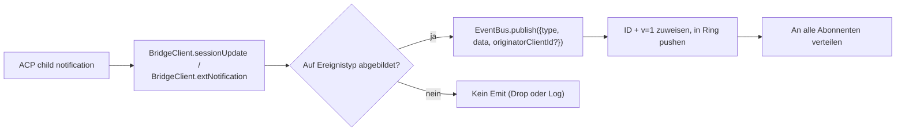
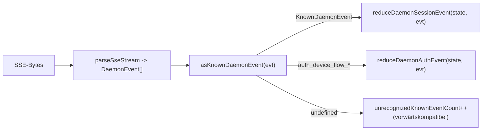

# Typisiertes Daemon-Event-Schema v1

## Übersicht

Jeder SSE-Frame, den der Daemon auf `GET /session/:id/events` aussendet, hat die Form `{ id, v, type, data, originatorClientId?, _meta? }`. `v: 1` ist die aktuelle `EVENT_SCHEMA_VERSION`. `type` stammt aus der geschlossenen, versionierten Menge `DAEMON_KNOWN_EVENT_TYPE_VALUES` in `packages/sdk-typescript/src/daemon/events.ts`; der aktuelle Satz umfasst 43 bekannte Event-Typen. Das `_meta`-Feld des Envelopes wird an der SSE-Schreibgrenze von `formatSseFrame()` in `server.ts` gestempelt; siehe [Metadaten auf Envelope-Ebene](#envelope-level-metadata).

Das SDK stellt `asKnownDaemonEvent(evt)` bereit. Es gibt für bekannte Event-Typen ein diskriminiertes `KnownDaemonEvent` zurück und `undefined` für andere Typen. SDK-Konsumenten können so Vorwärtskompatibilität handhaben, ohne ein gleichzeitiges SDK-Upgrade zu benötigen, wenn ein neuerer Daemon einen Event-Typ hinzufügt; der Session-Reduzierer zeichnet diese als `unrecognizedKnownEventCount` auf.

Das Drahtformat befindet sich in [`../qwen-serve-protocol.md`](../qwen-serve-protocol.md). Diese Seite ist der Payload-Vertrag für jedes Event.

## Verantwortlichkeiten

- Bietet die einzige Quelle der Wahrheit für das Event-Vokabular (`DAEMON_KNOWN_EVENT_TYPE_VALUES`).
- Stellt einen typisierten Envelope für jeden Event-Typ bereit (`DaemonEventEnvelope<TType, TData>`).
- Stellt reine Reduzierer (`reduceDaemonSessionEvent`, `reduceDaemonAuthEvent`) bereit, die einen Event-Stream in den SDK-Ansichtszustand projizieren.
- Sendet das Capability-Tag `typed_event_schema` als informatives Signal. Falls das Tag fehlt, fällt `asKnownDaemonEvent` immer noch auf `unknown` zurück.

## Event-Vokabular (43 bekannte Typen)

Gruppiert nach Domäne.

### Kern-Session

| Typ                        | Richtung       | Auslöser                                                                          | Wichtige Payload-Felder                                                                |
| -------------------------- | -------------- | --------------------------------------------------------------------------------- | -------------------------------------------------------------------------------------- |
| `session_update`           | S->C           | Jede `sessionUpdate`-Benachrichtigung des ACP: Agent-Text, Gedanke, Tool-Aufruf oder Plan | `sessionUpdate: string, content?: ...` (undurchsichtige ACP-Form)                        |
| `session_metadata_updated`  | S->C           | `PATCH /session/:id/metadata`                                                      | `sessionId, displayName?`                                                              |
| `session_died`             | S->C terminal  | `channel.exited`                                                                   | `sessionId, reason, exitCode? \| null, signalCode? \| null`                            |
| `session_closed`           | S->C terminal  | `DELETE /session/:id` oder programmatisches Schließen                              | `sessionId, reason: 'client_close' \| string, closedBy?`                               |
| `session_snapshot`         | S->C synthetisch| Snapshot-Frame nach SSE-Anhängen / Wiedergabe                                      | `sessionId, currentModelId: string \| null, currentApprovalMode: string \| null`       |

### Synthetische Frames auf Abonnentenebene

| Typ                       | Auslöser                                                                                                                                                                                                                           | Anmerkungen                                                                                                                                                                                                                                                                                               |
| ------------------------- | ---------------------------------------------------------------------------------------------------------------------------------------------------------------------------------------------------------------------------------- | --------------------------------------------------------------------------------------------------------------------------------------------------------------------------------------------------------------------------------------------------------------------------------------------------------- |
| `client_evicted`          | EventBus-Warteschlangenüberlauf pro Abonnent. **Keine `id`**                                                                                                                                                                        | `reason: string, droppedAfter?: number`; nur terminal für den aktuellen Abonnenten, während die Session am Leben bleibt.                                                                                                                                                                                  |
| `slow_client_warning`     | Warteschlange >= 75%; wird erzwungen gesendet und **hat keine `id`**                                                                                                                                                                | `queueSize, maxQueued, lastEventId`; wird erneut aktiviert, nachdem die Warteschlange unter 37,5 % fällt.                                                                                                                                                                                                 |
| `stream_error`            | `SubscriberLimitExceededError` oder ein anderer Routen-Stream-Fehler                                                                                                                                                                 | `error: string`; terminal für das Abonnement.                                                                                                                                                                                                                                                             |
| `state_resync_required`   | `subscribe({lastEventId})` erkennt, dass der Daemon-Ring `[lastEventId+1, earliestInRing-1]` nicht mehr hält, oder der Client-Cursor stammt aus einer früheren Bus-Epoche. Wird **vor** den verbleibenden Wiedergabe-Frames erzwungen gesendet und **hat keine `id`**. | `reason: 'ring_evicted' \| 'epoch_reset' \| string`, `lastDeliveredId: number`, `earliestAvailableId: number`. Dies ist ein Wiederherstellungssignal, nicht terminal: der SSE-Stream bleibt offen und Wiedergabe- sowie Live-Frames werden fortgesetzt. Der SDK-Reduzierer setzt `awaitingResync = true` und überspringt Deltas, bis der Aufrufer mit `loadSession` zurücksetzt. |
| `replay_complete`         | Sentinel ohne ID, ausgegeben nach Abschluss der `Last-Event-ID`-Wiedergabeschleife, sowohl bei sauberer Wiedergabe als auch bei Ring-verdrängten Pfaden, selbst wenn `data.replayedCount === 0`. **Keine `id`**                        | `replayedCount: number`; ermöglicht Verbrauchern, die Aufhol-UI deterministisch ohne Timeout zu entfernen.                                                                                                                                                                                                |

### Berechtigungen (F3 + Basis)

| Typ                             | Richtung | Auslöser                                                | Wichtige Payload-Felder                                                                                                                                |
| ------------------------------- | -------- | ------------------------------------------------------- | ------------------------------------------------------------------------------------------------------------------------------------------------------ |
| `permission_request`            | S->C     | Agent ruft `requestPermission` auf                      | `requestId, sessionId, toolCall, options[]`; der Envelope stempelt `originatorClientId` vom Prompt-Ursprung.                                           |
| `permission_resolved`           | S->C     | Vermittler hat entschieden                              | `requestId, outcome` (ACP `PermissionOutcome`)                                                                                                         |
| `permission_already_resolved`   | S->C     | Stimme trifft ein, nachdem die Anfrage bereits entschieden war | `requestId, sessionId, outcome`                                                                                                                        |
| `permission_partial_vote`       | S->C     | `consensus`-Richtlinie zeichnet eine nicht endgültige Stimme auf | `requestId, sessionId, votesReceived, votesNeeded (>= 1), quorum, optionTallies: Record<string, number>, originatorClientId?`                          |
| `permission_forbidden`          | S->C     | Richtlinie lehnt eine Stimme ab                         | `requestId, sessionId, clientId?, reason: 'designated_mismatch' \| 'remote_not_allowed', originatorClientId?`; anonyme Wähler lassen `clientId` weg. |

### Modelle

| Typ                     | Richtung | Payload                                     |
| ----------------------- | -------- | ------------------------------------------- |
| `model_switched`        | S->C     | `sessionId, modelId`                        |
| `model_switch_failed`   | S->C     | `sessionId, requestedModelId, error: string` |

### MCP-Schutzvorkehrungen (PR 14b + F2)

| Typ                             | Richtung | Payload                                                                                                                                                                                                                                                                                                                                                                                                                                          |
| ------------------------------- | -------- | ------------------------------------------------------------------------------------------------------------------------------------------------------------------------------------------------------------------------------------------------------------------------------------------------------------------------------------------------------------------------------------------------------------------------------------------------- |
| `mcp_budget_warning`            | S->C     | `liveCount, reservedCount, budget, thresholdRatio: 0.75, mode: 'warn' \| 'enforce', scope?: 'workspace' \| 'session'`                                                                                                                                                                                                                                                                                                                             |
| `mcp_child_refused_batch`       | S->C     | `refusedServers: [{ name, transport, reason: 'budget_exhausted' }], budget, liveCount, reservedCount, mode: 'enforce', scope?: 'workspace' \| 'session'`                                                                                                                                                                                                                                                                                          |
| `mcp_server_restarted`          | S->C     | `serverName, durationMs, entryIndex?` für F2-Multi-Eintrag-Pool-Neustarts                                                                                                                                                                                                                                                                                                                                                                         |
| `mcp_server_restart_refused`    | S->C     | `serverName, reason: 'budget_would_exceed' \| 'in_flight' \| 'disabled' \| 'restart_failed', entryIndex?, details?`. Der vierte Wert `restart_failed` trägt einen zugrunde liegenden harten Fehler für Pool-Modus-Multi-Eintrag-Neustart. `MCP_RESTART_REFUSED_REASONS` lehnt unbekannte Gründe ab; ein älterer SDK-Reduzierer verwirft additive neue Grundwerte stillschweigend, da `parseDaemonEvent` `undefined` zurückgibt. Versenden Sie einen neuen Grund zusammen mit einem SDK, das ihn kennt. |

### Mutationssteuerung (Wave 4 PR 16+17)

| Typ                       | Richtung | Payload                                                                                               |
| ------------------------- | -------- | ----------------------------------------------------------------------------------------------------- |
| `memory_changed`          | S->C     | `scope: 'workspace' \| 'global', filePath, mode: 'append' \| 'replace', bytesWritten`                 |
| `agent_changed`           | S->C     | `change: 'created' \| 'updated' \| 'deleted', name, level: 'project' \| 'user'`                       |
| `approval_mode_changed`   | S->C     | `sessionId, previous, next, persisted: boolean`                                                       |
| `tool_toggled`            | S->C     | `toolName, enabled`; betrifft den nächsten ACP-Child-Spawn und verändert keine bereits laufenden Sessions. |
| `settings_changed`        | S->C     | Schreiben der Workspace-Einstellungen abgeschlossen. Payload ist offen; Verbraucher sollten mit Read-After-Write aktualisieren. |
| `settings_reloaded`       | S->C     | Daemon-Workspace-Dienst liest Einstellungen erneut. Payload ist offen.                                 |
| `workspace_initialized`   | S->C     | `path, action: 'created' \| 'overwrote' \| 'noop', originatorClientId?`                               |

### Auth-Geräteablauf (PR 21)

Diese Ereignisse sind nach Workspace und nicht nach Session geschlüsselt. Der Session-Reduzierer behandelt sie als No-ops; `reduceDaemonAuthEvent` projiziert sie in den Workspace-Level-Zustand.

| Typ                             | Richtung | Payload                                               |
| ------------------------------- | -------- | ----------------------------------------------------- |
| `auth_device_flow_started`      | S->C     | `deviceFlowId, providerId, expiresAt`                 |
| `auth_device_flow_throttled`    | S->C     | `deviceFlowId, intervalMs`                            |
| `auth_device_flow_authorized`   | S->C     | `deviceFlowId, providerId, expiresAt?, accountAlias?` |
| `auth_device_flow_failed`       | S->C     | `deviceFlowId, errorKind, hint?`                      |
| `auth_device_flow_cancelled`    | S->C     | `deviceFlowId`                                        |

### MCP-Laufzeitmutation

| Typ                    | Richtung | Auslöser                                                           | Wichtige Payload-Felder                                                               |
| ---------------------- | -------- | ------------------------------------------------------------------ | ------------------------------------------------------------------------------------ |
| `mcp_server_added`     | S->C     | Server zur Laufzeit über `POST /workspace/mcp/servers` hinzugefügt | `name, transport, replaced, shadowedSettings, toolCount, originatorClientId`         |
| `mcp_server_removed`   | S->C     | Server zur Laufzeit entfernt                                       | `name, wasShadowingSettings, originatorClientId`                                    |

### Turn-Lebenszyklus / Assistenten-Pushes

| Typ                    | Richtung | Auslöser                                                                                                             | Wichtige Payload-Felder                                                                                                                                                                                |
| ---------------------- | -------- | -------------------------------------------------------------------------------------------------------------------- | ------------------------------------------------------------------------------------------------------------------------------------------------------------------------------------------------------- |
| `prompt_cancelled`     | S->C     | Prompt wurde über die explizite `cancelSession`-Route **oder** durch Trennung des Ursprungs-SSE abgebrochen           | Envelope stempelt `originatorClientId` für den abbrechenden Client. Dies bedeutet "Abbruch angefordert", nicht "Abbruch bestätigt". Peer-Abonnenten erfahren, dass der Prompt beendet wurde.           |
| `turn_complete`        | S->C     | Ein Turn wurde erfolgreich abgeschlossen                                                                              | `sessionId, stopReason, promptId?`. `promptId` verknüpft mit nicht blockierenden Prompt-Antworten (`202`). Das SDK ordnet SSE-Ereignisse über diese ID dem auslösenden Prompt zu.                         |
| `turn_error`           | S->C     | Ein Turn ist fehlgeschlagen                                                                                           | `sessionId, message, code?, promptId?`; gleicher `promptId`-Korrelationsmechanismus.                                                                                                                     |
| `session_rewound`      | S->C     | `POST /session/:id/rewind` erfolgreich                                                                                | `sessionId, promptId, targetTurnIndex, filesChanged[], filesFailed[], originatorClientId?`                                                                                                               |
| `session_branched`     | S->C     | `POST /session/:id/branch` hat einen Abzweig von einer bestehenden Session erstellt                                   | `sourceSessionId, newSessionId, displayName, originatorClientId?`                                                                                                                                       |
| `followup_suggestion`  | S->C     | ACP-Child hat nach `end_turn` Geistertext-Folgevorschläge generiert und über das per-Session-SSE weitergeleitet        | `sessionId, suggestion, promptId`; das Drahtformat überträgt nur Vorschläge, deren `getFilterReason()===null`. Clients rendern sie als Eingabeplatzhalter-Geistertext und machen sie beim nächsten `sendPrompt` ungültig. |
| `user_shell_command`   | S->C     | Benutzer hat über `POST /session/:id/shell` einen Shell-Befehl gestartet; an andere Abonnenten derselben Session verteilt | `sessionId, command, shellId, originatorClientId?`. Es gibt noch kein typisiertes `DaemonXxxData`-Interface; `asKnownDaemonEvent` gibt `undefined` zurück und der UI-Normalisierer parst es ad hoc.     |
| `user_shell_result`    | S->C     | Ergebnis des obigen Shell-Befehls                                                                                      | `sessionId, shellId, exitCode, output, aborted`. Gleiche Ad-hoc-Parsing-Anmerkung wie bei `user_shell_command`.                                                                                         |

## Architektur

| Aspekt                                  | Quelle                                          | Anmerkungen                                                                                                    |
| --------------------------------------- | ----------------------------------------------- | -------------------------------------------------------------------------------------------------------------- |
| `EVENT_SCHEMA_VERSION = 1`              | `packages/acp-bridge/src/eventBus.ts`           | Wird in jedem Frame gesendet.                                                                                  |
| `DAEMON_KNOWN_EVENT_TYPE_VALUES`        | `packages/sdk-typescript/src/daemon/events.ts`  | Geschlossene Liste mit 43 Typen.                                                                               |
| `DaemonEventEnvelope<TType, TData>`     | `events.ts`                                     | Generischer Envelope.                                                                                          |
| `DaemonKnownEventType`                  | `events.ts`                                     | `typeof DAEMON_KNOWN_EVENT_TYPE_VALUES[number]`.                                                               |
| Payload-Typen pro Event                 | `events.ts`                                     | Die meisten Event-Typen haben ein `DaemonXxxData`-Interface; `user_shell_*` wird derzeit ad hoc vom UI-Normalisierer geparst. |
| `asKnownDaemonEvent(evt)`               | `events.ts`                                     | Gibt `KnownDaemonEvent \| undefined` zurück.                                                                   |
| `reduceDaemonSessionEvent(state, evt)`  | `events.ts`                                     | Projiziert in `DaemonSessionViewState`.                                                                        |
| `reduceDaemonAuthEvent(state, evt)`     | `events.ts`                                     | Projiziert in `DaemonAuthState`.                                                                               |
| `isWorkspaceScopedBudgetEvent(evt)`     | `events.ts`                                     | Erkennt F2 `scope: 'workspace'`.                                                                               |
### `DaemonSessionViewState`

`reduceDaemonSessionEvent` füllt diesen View-Status. Der CLI TUI-Adapter, die `DaemonChannelBridge` und die VS Code-IDE konsumieren ihn. Schlüsselfelder:

- `alive: boolean` – wird nach einem terminalen Frame (`session_died`, `session_closed`, `client_evicted`, `stream_error`) auf `false` gesetzt.
- `currentModelId?: string` – aus `model_switched`.
- `displayName?: string` – aus `session_metadata_updated`.
- `pendingPermissions: Record<string, DaemonPermissionRequestData>` – offene Anfragen, indiziert nach `requestId`; gelöscht durch `permission_resolved` / `permission_already_resolved`.
- `lastSessionUpdate?: DaemonSessionUpdateData` – letztes `session_update`.
- `lastModelSwitchFailure?: DaemonModelSwitchFailedData` – aus `model_switch_failed`.
- `terminalEvent?` – rohes Terminalereignis.
- `streamError?: DaemonStreamErrorData` – letzte `stream_error`-Payload.
- `unrecognizedKnownEventCount`, `lastUnrecognizedKnownEvent?` – Ereignis wurde von `asKnownDaemonEvent` erkannt, aber der Reducer hat noch keinen eigenen Status dafür.
- `droppedPermissionRequestCount`, `lastDroppedPermissionRequestId?` – eine fehlerhafte Berechtigungsanfrage konnte nicht in die Pending-Map eingefügt werden.
- `unmatchedPermissionResolutionCount`, `lastUnmatchedPermissionResolutionId?` – eine Berechtigungsauflösung hatte keine passende ausstehende Anfrage.
- `slowClientWarningCount`, `lastSlowClientWarning?` – aus `slow_client_warning`.
- `mcpBudgetWarningCount`, `lastMcpBudgetWarning?` – aus `mcp_budget_warning`.
- `mcpChildRefusedBatchCount`, `lastMcpChildRefusedBatch?` – aus `mcp_child_refused_batch`.
- `lastWorkspaceMutation?`, `lastWorkspaceMutationType?` – aus `memory_changed` / `agent_changed`.
- `approvalMode?`, `approvalModeChangedCount`, `lastApprovalModeChange?` – aus `approval_mode_changed`.
- `toolToggleCount`, `lastToolToggle?` – aus `tool_toggled`.
- `workspaceInitCount`, `lastWorkspaceInit?` – aus `workspace_initialized`.
- `mcpRestartCount`, `lastMcpRestart?` – aus `mcp_server_restarted`.
- `mcpRestartRefusedCount`, `lastMcpRestartRefused?` – aus `mcp_server_restart_refused`.
- `settings_changed` / `settings_reloaded` – von `asKnownDaemonEvent` erkannt; der Session-Reducer führt keine eigenen View-Statusfelder, und UIs behandeln sie normalerweise als Refresh-Signale.
- `permissionVoteProgress: Record<string, DaemonPermissionPartialVoteData>` – Konsens-Abstimmungsfortschritt.
- `forbiddenVotes: DaemonPermissionForbiddenData[]`, `forbiddenVoteCount` – von der Policy abgelehnte Abstimmungsdatensätze, begrenzt auf 32.
- `awaitingResync: boolean` – gesetzt durch `state_resync_required`; gelöscht, wenn der Consumer den View-Status zurücksetzt.
- `resyncRequiredCount`, `lastResyncRequired?` – Resync-Beobachtbarkeit.
- `lastFollowupSuggestion?: DaemonFollowupSuggestionData` – letzter vom Daemon gepusster Folge-vorschlag.
- `lastTurnComplete?: DaemonTurnCompleteData` – letzter erfolgreicher Turn-Abschluss.
- `lastTurnError?: DaemonTurnErrorData` – letzter Turn-Fehler.
- `rewindCount`, `lastRewind?`, `lastBranch?` – letzte Rewind-/Branch-Ereignisse.

### `DaemonAuthState`

Ein Eintrag pro `providerId`, gesteuert durch `auth_device_flow_*`. Jeder Flow stellt `{ deviceFlowId, status, providerId, expiresAt?, lastThrottleIntervalMs?, lastError? }` bereit.

## Flow

### Produzentenseite



### Konsumentenseite (SDK)



## Envelope-Metadaten

Über die `data`-Payload jedes Ereignisses hinaus fügt der Daemon zwei Envelope-Felder hinzu.

### `_meta.serverTimestamp` – Daemon-Uhr

`formatSseFrame()` in `packages/cli/src/serve/server.ts` fügt dies am SSE-Schreibrand ein, **nicht** innerhalb von `EventBus.publish`. Der In-Memory-Typ `BridgeEvent` bleibt unverändert; interne Daemon-Consumer sehen kein `_meta`, Draht-SSE-Frames hingegen schon.

```jsonc
{
  "id": 47,
  "v": 1,
  "type": "session_update",
  "data": { ... },
  "_meta": { "serverTimestamp": 1716287345123 }
}
```

Die Zusammenführung erhält vorhandene `_meta`-Keys
(`{...existingMeta, serverTimestamp: Date.now()}`). **Derzeit schreibt kein Daemon-Produzent
Envelope-Level-`_meta`**. Die Zusammenführung auf oberster Ebene ist eine
Vorwärtskompatibilitäts-Notluke.

Warum das wichtig ist: Multi-Client-UIs, die relative Zeit anzeigen oder Transkriptblöcke sortieren, sollten Serverzeit anstelle der lokalen Uhren jedes Browsers/Tabs/Telefons verwenden. Der Server-Stempel sorgt für konsistente Ordnung über Clients hinweg.

SDK-Zugriff: `event._meta?.serverTimestamp` bevorzugen. Kompatibilitätspfade können auch `event.serverTimestamp` oder `event.data._meta.serverTimestamp` abfragen. ACP-Payloads `data._meta` nicht mit Daemon-Envelope `_meta` vermischen.

### `originatorClientId`

Ereignisse, die durch eine Anfrage mit einer registrierten `X-Qwen-Client-Id` ausgelöst wurden, können dieses Feld stempeln. Siehe [`08-session-lifecycle.md`](./08-session-lifecycle.md).

## Tool-Call-`_meta` (Provenienz / serverId)

Dies ist getrennt vom Envelope-`_meta`: ACP-`session/update`-Payloads können ihr eigenes `_meta` in `event.data._meta` tragen. `ToolCallEmitter` (`packages/cli/src/acp-integration/session/emitters/ToolCallEmitter.ts`) stempelt zwei Felder auf `emitStart`, `emitResult` und `emitError`:

| Feld         | Typ                                     | Auflösungsregel                                                                                                                                                                      |
| ------------ | --------------------------------------- | ------------------------------------------------------------------------------------------------------------------------------------------------------------------------------------ |
| `provenance` | `'builtin' \| 'mcp' \| 'subagent'`      | `ToolCallEmitter.resolveToolProvenance`: `subagentMeta` gewinnt mit `subagent`; Toolname, der auf `mcp__<server>__<tool>` passt, wird zu `mcp`; alles andere wird zu `builtin`.      |
| `serverId`   | `string` nur wenn `provenance === 'mcp'` | Heuristisch aus `mcp__<serverId>__<tool>` extrahiert.                                                                                                                               |

Der vorhandene Anzeigename `_meta.toolName` bleibt erhalten. Die UI verwendet diese Felder, um Builtin-/MCP-Server-/Subagent-Badges darzustellen, ohne den Toolnamen neu parsen zu müssen.

## SDK-Reducer-Verhalten

`reduceDaemonSessionEvent(state, evt)` in `packages/sdk-typescript/src/daemon/events.ts` projiziert den Stream in `DaemonSessionViewState`. Die Resync-bezogenen Felder sind:

- **`awaitingResync: boolean`** – gesetzt durch `state_resync_required`; der Aufrufer löscht es, typischerweise nachdem `POST /session/:id/load` den View-Status zurückgesetzt hat.
- **`resyncRequiredCount: number`** – Beobachtbarkeitszähler.
- **`lastResyncRequired?: DaemonStateResyncRequiredData`** – letzte Payload.

Solange `awaitingResync = true` ist, **überspringt der Reducer die Delta-Anwendung** und erlaubt nur die geschlossene Menge `RESYNC_PASSTHROUGH_TYPES`:

| Passthrough-Typ            | Warum wird es während des Resyncs trotzdem angewendet?                                                     |
| -------------------------- | --------------------------------------------------------------------------------------------------------- |
| `state_resync_required`    | Ein seltenes zweites Resync sollte `lastResyncRequired` / `resyncRequiredCount` aktualisieren.            |
| `session_died`             | Terminales Stream-Signal muss während des Resyncs sichtbar bleiben.                                       |
| `session_closed`           | Gleiches wie oben.                                                                                        |
| `client_evicted`           | Gleiches wie oben.                                                                                        |
| `stream_error`             | Gleiches wie oben.                                                                                        |
| `session_snapshot`         | Autorisierender Frame mit vollständigem Zustand; sicher während des Resyncs anzuwenden.                   |

`lastEventId` steigt während des Resyncs weiter monoton durch `advanceLastEventId(base)`. Nachdem der Aufrufer zurücksetzt und `awaitingResync` löscht, richten sich nachfolgende Deltas am korrekten Cursor aus.

`reduceDaemonAuthEvent` projiziert Device-Flow-Ereignisse in autorisierungszustands-Einträge auf Workspace-Ebene, die konzeptionell wie
`{deviceFlowId, status, providerId, expiresAt?, lastThrottleIntervalMs?, lastError?}`
aussehen. Im Code speichert der Reducer `status`, `errorKind`, `hint`,
`intervalMs`, `lastSeenEventId`, `authorizedExpiresAt` und `accountAlias` in
`DaemonDeviceFlowReducerState`; die Daemon-Ereignis-Payloads selbst bleiben die
oben aufgeführten Pro-Ereignis-Formen.

## Zustand und Vorwärtskompatibilität

- Fügen Sie einen bekannten Ereignistyp hinzu, indem Sie an `DAEMON_KNOWN_EVENT_TYPE_VALUES` anhängen. Alte SDKs geben `undefined` für nicht erkannte Ereignistypen über den Fallback-Pfad zurück und erhöhen `unrecognizedKnownEventCount`; neue SDKs verlassen sich auf die diskriminierte Union.
- Das Hinzufügen optionaler Felder zu einer vorhandenen Payload ist sicher, da Payloads offen sind (`{ [key: string]: unknown }`).
- Eine Änderung der **Form** einer vorhandenen Payload ist ein Bruch und muss `EVENT_SCHEMA_VERSION` erhöhen sowie ein kompatibles Capability-Tag wie `caps.features.typed_event_schema_v2` bewerben.
- `id` ist pro Sitzung monoton. Synthetische Frames auf Abonnentenebene (`client_evicted`, `slow_client_warning`, `stream_error`, `state_resync_required`, `replay_complete`, `session_snapshot`) haben absichtlich keine ID, sodass andere Abonnenten keine Lücken sehen.
- `originatorClientId` lebt auf dem Envelope und nicht in `data`. F3-Partial-Vote-/Forbidden-Payloads führen es auch über `mergeOriginator` in `data` zusammen, sodass View-Status-Consumer den Envelope nicht behalten müssen.

## Abhängigkeiten

- [`10-event-bus.md`](./10-event-bus.md) – Auslieferungskanal.
- [`11-capabilities-versioning.md`](./11-capabilities-versioning.md) – wie SDKs `typed_event_schema`, `mcp_guardrail_events` und `permission_mediation` vorab prüfen.
- [`04-permission-mediation.md`](./04-permission-mediation.md) – wie Berechtigungsereignisse erzeugt werden.
- [`13-sdk-daemon-client.md`](./13-sdk-daemon-client.md) – `asKnownDaemonEvent`, Reducer und View-Status-Form.

## Konfiguration

- Immer beworben: `typed_event_schema`, `mcp_guardrail_events` und `permission_mediation` (mit unterstützten Policy-Modi).
- Keine Umgebungsvariable oder Flag steuert direkt das Schema selbst. `QWEN_SERVE_NO_MCP_POOL=1` ändert den MCP-Ereignis-`scope` von `'workspace'` zu nicht vorhanden oder `'session'`.

## Hinweise und bekannte Grenzen

- Sechs synthetische Frametypen haben absichtlich keine `id`; SDK-Code darf nicht davon ausgehen, dass jedes Ereignis eine ID hat.
- `permission_partial_vote` erscheint nur unter `consensus`. `permission_forbidden` erscheint unter `designated`, `consensus` und `local-only`, aber nicht unter `first-responder`.
- `mcp_child_refused_batch` erscheint nur im Modus `'enforce'`; Modus `warn` verweigert nie.
- `auth_device_flow_*`-Ereignisse sind nicht sitzungsschlüsselgebunden. Verwenden Sie bei Konsum über `DaemonSessionClient` für diese `reduceDaemonAuthEvent` anstelle des Session-Reducers.

## Referenzen

- `packages/sdk-typescript/src/daemon/events.ts`
- `packages/acp-bridge/src/eventBus.ts` (`EVENT_SCHEMA_VERSION`)
- `packages/cli/src/serve/capabilities.ts` (`typed_event_schema`, `mcp_guardrail_events`, `permission_mediation`)
- Draht-Referenz: [`../qwen-serve-protocol.md`](../qwen-serve-protocol.md)