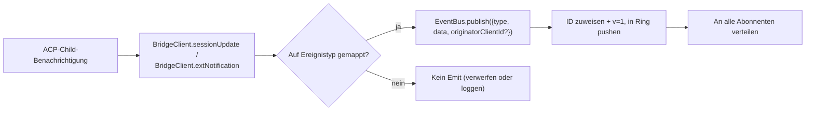
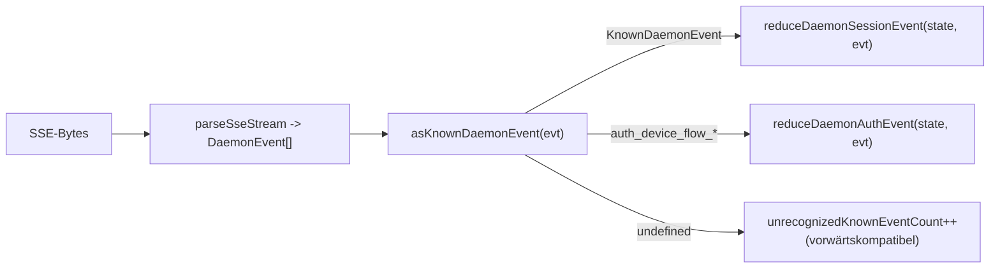

# Typed Daemon Event Schema v1

## Übersicht

Jeder SSE-Frame, der vom Daemon auf `GET /session/:id/events` ausgegeben wird, hat die Form `{ id, v, type, data, originatorClientId?, _meta? }`. `v: 1` ist die aktuelle `EVENT_SCHEMA_VERSION`. `type` stammt aus dem geschlossenen, versionsfixierten `DAEMON_KNOWN_EVENT_TYPE_VALUES`-Set in `packages/sdk-typescript/src/daemon/events.ts`; das aktuelle Set hat 43 bekannte Ereignistypen. Das Meta-Feld `_meta` im Umschlag wird an der SSE-Schreibgrenze von `formatSseFrame()` in `server.ts` eingestempelt; siehe [Envelope-level metadata](#envelope-level-metadata).

Das SDK stellt `asKnownDaemonEvent(evt)` zur Verfügung. Es gibt ein unterscheidbares `KnownDaemonEvent` für bekannte Ereignistypen zurück, für andere Typen `undefined`. SDK-Konsumenten können somit vorwärtskompatibel bleiben, ohne ein gleichzeitiges SDK-Upgrade zu benötigen, wenn ein neuerer Daemon einen Ereignistyp hinzufügt; der Session-Reducer zeichnet diese als `unrecognizedKnownEventCount` auf.

Das Wire-Format befindet sich in [`../qwen-serve-protocol.md`](../qwen-serve-protocol.md). Diese Seite enthält den Payload-Vertrag für jedes Ereignis.

## Verantwortlichkeiten

- Bietet die einzige Quelle der Wahrheit für das Ereignisvokabular (`DAEMON_KNOWN_EVENT_TYPE_VALUES`).
- Bietet einen typisierten Umschlag für jeden Ereignistyp (`DaemonEventEnvelope<TType, TData>`).
- Bietet reine Reducer (`reduceDaemonSessionEvent`, `reduceDaemonAuthEvent`), die einen Ereignisstrom in den SDK-Ansichtszustand projizieren.
- Sendet den Fähigkeits-Tag `typed_event_schema` als informatives Signal. Fehlt der Tag, fällt `asKnownDaemonEvent` trotzdem auf `unknown` zurück.

## Ereignisvokabular (43 bekannte Typen)

Nach Domäne gruppiert.

### Core-Session

| Typ                        | Richtung       | Auslöser                                                                                  | Wichtige Payload-Felder                                                             |
| -------------------------- | -------------- | ----------------------------------------------------------------------------------------- | ----------------------------------------------------------------------------------- |
| `session_update`           | S->C           | Jede ACP `sessionUpdate`-Benachrichtigung: Agent-Text, Gedanken, Tool-Aufruf oder Plan    | `sessionUpdate: string, content?: ...` (undurchsichtige ACP-Form)                   |
| `session_metadata_updated` | S->C           | `PATCH /session/:id/metadata`                                                             | `sessionId, displayName?`                                                           |
| `session_died`             | S->C terminal  | `channel.exited`                                                                          | `sessionId, reason, exitCode? \| null, signalCode? \| null`                         |
| `session_closed`           | S->C terminal  | `DELETE /session/:id` oder programmatisches Schließen                                    | `sessionId, reason: 'client_close' \| string, closedBy?`                            |
| `session_snapshot`         | S->C synthetisch | Snapshot-Frame nach SSE-Attach / Replay                                                    | `sessionId, currentModelId: string \| null, currentApprovalMode: string \| null`    |

### Subscriberebene synthetische Frames

| Typ                       | Auslöser                                                                                                                                                                                                                                            | Anmerkungen                                                                                                                                                                                                                                                                                                                                    |
| ------------------------- | ---------------------------------------------------------------------------------------------------------------------------------------------------------------------------------------------------------------------------------------------------- | ----------------------------------------------------------------------------------------------------------------------------------------------------------------------------------------------------------------------------------------------------------------------------------------------------------------------------------------------- |
| `client_evicted`          | Per-Subscriber-EventBus-Queue-Überlauf. **Kein `id`**                                                                                                                                                                                                | `reason: string, droppedAfter?: number`; nur terminal für den aktuellen Subscriber, während die Session alive bleibt.                                                                                                                                                                                                                          |
| `slow_client_warning`     | Queue >= 75%; force-pushed und **hat kein `id`**                                                                                                                                                                                                     | `queueSize, maxQueued, lastEventId`; wird erneut aktiviert, nachdem die Queue unter 37,5 % fällt.                                                                                                                                                                                                                                               |
| `stream_error`            | `SubscriberLimitExceededError` oder ein anderer Route-Stream-Fehler                                                                                                                                                                                  | `error: string`; terminal für das Subscription.                                                                                                                                                                                                                                                                                                |
| `state_resync_required`   | `subscribe({lastEventId})` erkennt, dass der Daemon-Ring nicht mehr `[lastEventId+1, earliestInRing-1]` hält, oder der Client-Cursor stammt aus einer vorherigen Bus-Epoche. Force-pushed **vor** den verbleibenden Replay-Frames und **hat kein `id`**. | `reason: 'ring_evicted' \| 'epoch_reset' \| string`, `lastDeliveredId: number`, `earliestAvailableId: number`. Dies ist ein Wiederherstellungssignal, nicht terminal: Der SSE-Stream bleibt geöffnet, und Replay + Live-Frames werden fortgesetzt. Der SDK-Reducer setzt `awaitingResync = true` und überspringt Deltas, bis der Aufrufer mit `loadSession` zurücksetzt. |
| `replay_complete`         | Id-loser Sentinel, der ausgegeben wird, nachdem die `Last-Event-ID`-Replay-Schleife beendet ist, sowohl für sauberes Replay als auch für Ring-evicted-Pfade, selbst wenn `data.replayedCount === 0`. **Kein `id`**                                         | `replayedCount: number`; ermöglicht es Konsumenten, die Aufhol-Ui deterministisch ohne Timeout zu entfernen.                                                                                                                                                                                                                                    |
### Berechtigungen (F3 + Basis)

| Typ                            | Richtung | Auslöser                                            | Wichtige Nutzlastfelder                                                                                                                           |
| ------------------------------ | -------- | --------------------------------------------------- | ------------------------------------------------------------------------------------------------------------------------------------------------- |
| `permission_request`           | S->C     | Agent ruft `requestPermission` auf                  | `requestId, sessionId, toolCall, options[]`; der Umschlag stempelt `originatorClientId` vom Prompt-Ursender.                                       |
| `permission_resolved`          | S->C     | Mediator hat entschieden                             | `requestId, outcome` (ACP `PermissionOutcome`)                                                                                                     |
| `permission_already_resolved`  | S->C     | Stimme trifft ein, nachdem die Anfrage bereits entschieden wurde | `requestId, sessionId, outcome`                                                                                                                    |
| `permission_partial_vote`      | S->C     | Konsensrichtlinie zeichnet eine nicht-endgültige Stimme auf | `requestId, sessionId, votesReceived, votesNeeded (>= 1), quorum, optionTallies: Record<string, number>, originatorClientId?`                       |
| `permission_forbidden`         | S->C     | Richtlinie lehnt eine Stimme ab                      | `requestId, sessionId, clientId?, reason: 'designated_mismatch' \| 'remote_not_allowed', originatorClientId?`; anonyme Stimmgeber lassen `clientId` weg. |

### Modelle

| Typ                  | Richtung | Nutzlast                                      |
| --------------------- | -------- | -------------------------------------------- |
| `model_switched`      | S->C     | `sessionId, modelId`                         |
| `model_switch_failed` | S->C     | `sessionId, requestedModelId, error: string` |

### MCP-Guardrails (PR 14b + F2)

| Typ                            | Richtung | Nutzlast                                                                                                                                                                                                                                                                                                                                                                                                                                           |
| ------------------------------ | -------- | -------------------------------------------------------------------------------------------------------------------------------------------------------------------------------------------------------------------------------------------------------------------------------------------------------------------------------------------------------------------------------------------------------------------------------------------------- |
| `mcp_budget_warning`           | S->C     | `liveCount, reservedCount, budget, thresholdRatio: 0.75, mode: 'warn' \| 'enforce', scope?: 'workspace' \| 'session'`                                                                                                                                                                                                                                                                                                                             |
| `mcp_child_refused_batch`      | S->C     | `refusedServers: [{ name, transport, reason: 'budget_exhausted' }], budget, liveCount, reservedCount, mode: 'enforce', scope?: 'workspace' \| 'session'`                                                                                                                                                                                                                                                                                          |
| `mcp_server_restarted`         | S->C     | `serverName, durationMs, entryIndex?` für F2 Multi-Entry-Pool-Neustarts                                                                                                                                                                                                                                                                                                             |
| `mcp_server_restart_refused`   | S->C     | `serverName, reason: 'budget_would_exceed' \| 'in_flight' \| 'disabled' \| 'restart_failed', entryIndex?, details?`. Der vierte Wert, `restart_failed`, überträgt einen zugrunde liegenden harten Fehler für den Pool-Modus-Neustart mehrerer Einträge. `MCP_RESTART_REFUSED_REASONS` lehnt unbekannte Gründe ab; ein älterer SDK-Reduzierer verwirft stillschweigend hinzugefügte neue Grundwerte, da `parseDaemonEvent` `undefined` zurückgibt. Liefern Sie einen neuen Grund mit einem SDK, das ihn kennt. |
### Mutationssteuerung (Wave 4 PR 16+17)

| Typ                    | Richtung | Payload                                                                                              |
| ---------------------- | -------- | ---------------------------------------------------------------------------------------------------- |
| `memory_changed`       | S->C     | `scope: 'workspace' \| 'global', filePath, mode: 'append' \| 'replace', bytesWritten`                |
| `agent_changed`        | S->C     | `change: 'created' \| 'updated' \| 'deleted', name, level: 'project' \| 'user'`                      |
| `approval_mode_changed`| S->C     | `sessionId, previous, next, persisted: boolean`                                                      |
| `tool_toggled`         | S->C     | `toolName, enabled`; beeinflusst das nächste erzeugte ACP-Kind und ändert keine bereits laufenden Sitzungen. |
| `settings_changed`     | S->C     | Schreibvorgang der Workspace-Einstellungen abgeschlossen. Payload ist offen; Verbraucher sollten mit Read-after-Write aktualisieren. |
| `settings_reloaded`    | S->C     | Der Daemon-Workspace-Dienst hat die Einstellungen erneut eingelesen. Payload ist offen.                |
| `workspace_initialized`| S->C     | `path, action: 'created' \| 'overwrote' \| 'noop', originatorClientId?`                              |

### Auth-Geräteflow (PR 21)

Diese Ereignisse sind Workspace-schlüsselig, nicht Sitzungsschlüsselig. Der Sitzungs-Reduzierer behandelt sie als No-Ops; `reduceDaemonAuthEvent` projiziert sie in den Zustand auf Workspace-Ebene.

| Typ                               | Richtung | Payload                                               |
| --------------------------------- | -------- | ----------------------------------------------------- |
| `auth_device_flow_started`        | S->C     | `deviceFlowId, providerId, expiresAt`                 |
| `auth_device_flow_throttled`      | S->C     | `deviceFlowId, intervalMs`                            |
| `auth_device_flow_authorized`     | S->C     | `deviceFlowId, providerId, expiresAt?, accountAlias?` |
| `auth_device_flow_failed`         | S->C     | `deviceFlowId, errorKind, hint?`                      |
| `auth_device_flow_cancelled`      | S->C     | `deviceFlowId`                                        |

### MCP-Laufzeitmutation

| Typ                   | Richtung | Auslöser                                                     | Wichtige Payload-Felder                                                           |
| --------------------- | -------- | ------------------------------------------------------------ | --------------------------------------------------------------------------------- |
| `mcp_server_added`    | S->C     | Server wurde zur Laufzeit über `POST /workspace/mcp/servers` hinzugefügt | `name, transport, replaced, shadowedSettings, toolCount, originatorClientId`      |
| `mcp_server_removed`  | S->C     | Server wurde zur Laufzeit entfernt                           | `name, wasShadowingSettings, originatorClientId`                                  |

### Turn-Lebenszyklus / Assistenz-Pushes

| Typ                    | Richtung | Auslöser                                                                                                             | Wichtige Payload-Felder                                                                                                                                                                               |
| ---------------------- | -------- | -------------------------------------------------------------------------------------------------------------------- | ----------------------------------------------------------------------------------------------------------------------------------------------------------------------------------------------------- |
| `prompt_cancelled`     | S->C     | Prompt wurde explizit über die `cancelSession`-Route **oder** durch Verbindungsabbruch des Urhebers (SSE) abgebrochen | Envelope stempelt `originatorClientId` für den abbrechenden Client. Das bedeutet „Abbruch angefordert", nicht „Abbruch bestätigt". Teilnehmer erfahren, dass der Prompt beendet wurde.                |
| `turn_complete`        | S->C     | Ein Turn wurde erfolgreich abgeschlossen                                                                             | `sessionId, stopReason, promptId?`. `promptId` verweist auf nicht-blockierende Prompt-Antworten (`202`). Das SDK gleicht SSE-Ereignisse über dieses Feld mit dem ursprünglichen Prompt ab.           |
| `turn_error`           | S->C     | Ein Turn ist fehlgeschlagen                                                                                          | `sessionId, message, code?, promptId?`; gleicher `promptId`-Zuordnungsmechanismus.                                                                                                                    |
| `session_rewound`      | S->C     | `POST /session/:id/rewind` erfolgreich                                                                               | `sessionId, promptId, targetTurnIndex, filesChanged[], filesFailed[], originatorClientId?`                                                                                                            |
| `session_branched`     | S->C     | `POST /session/:id/branch` hat einen Zweig aus einer bestehenden Sitzung erstellt                                   | `sourceSessionId, newSessionId, displayName, originatorClientId?`                                                                                                                                     |
| `followup_suggestion`  | S->C     | Ein ACP-Kind hat nach `end_turn` Ghost-Text-Folgevorschläge erzeugt, die über das Sitzungs-SSE weitergeleitet werden | `sessionId, suggestion, promptId`; die Leitung überträgt nur Vorschläge, deren `getFilterReason()===null`. Clients rendern sie als Ghost-Text im Eingabeplatzhalter und verwerfen sie beim nächsten `sendPrompt`. |
| `user_shell_command`   | S->C     | Benutzer hat einen Shell-Befehl über `POST /session/:id/shell` gestartet; an andere Teilnehmer derselben Sitzung verteilt | `sessionId, command, shellId, originatorClientId?`. Es gibt noch kein typisiertes `DaemonXxxData`-Interface; `asKnownDaemonEvent` gibt `undefined` zurück und der UI-Normalisierer parst es ad hoc.  |
| `user_shell_result`    | S->C     | Ergebnis des obigen Shell-Befehls                                                                                    | `sessionId, shellId, exitCode, output, aborted`. Gleicher Ad-hoc-Parsing-Hinweis wie bei `user_shell_command`.                                                                                         |
## Architektur

| Anliegen                               | Quelle                                         | Anmerkungen                                                                                                        |
| -------------------------------------- | ---------------------------------------------- | ------------------------------------------------------------------------------------------------------------------ |
| `EVENT_SCHEMA_VERSION = 1`             | `packages/acp-bridge/src/eventBus.ts`          | Wird bei jedem Frame gesendet.                                                                                     |
| `DAEMON_KNOWN_EVENT_TYPE_VALUES`       | `packages/sdk-typescript/src/daemon/events.ts` | Geschlossene Liste mit 43 Typen.                                                                                   |
| `DaemonEventEnvelope<TType, TData>`    | `events.ts`                                    | Generische Hülle.                                                                                                  |
| `DaemonKnownEventType`                 | `events.ts`                                    | `typeof DAEMON_KNOWN_EVENT_TYPE_VALUES[number]`.                                                                   |
| Payload-Typen pro Ereignis             | `events.ts`                                    | Die meisten Ereignistypen haben ein `DaemonXxxData`-Interface; `user_shell_*` wird derzeit vom UI-Normalisierer ad hoc geparst. |
| `asKnownDaemonEvent(evt)`              | `events.ts`                                    | Gibt `KnownDaemonEvent | undefined` zurück.                                                                        |
| `reduceDaemonSessionEvent(state, evt)` | `events.ts`                                    | Projiziert in `DaemonSessionViewState`.                                                                            |
| `reduceDaemonAuthEvent(state, evt)`    | `events.ts`                                    | Projiziert in `DaemonAuthState`.                                                                                   |
| `isWorkspaceScopedBudgetEvent(evt)`    | `events.ts`                                    | Erkennt F2 `scope: 'workspace'`.                                                                                   |

### `DaemonSessionViewState`

`reduceDaemonSessionEvent` füllt diesen Ansichtszustand. Der CLI-TUI-Adapter, `DaemonChannelBridge` und die VS Code-IDE verwenden ihn. Wichtige Felder:

- `alive: boolean` – wird `false` nach einem Terminal-Frame (`session_died`, `session_closed`, `client_evicted`, `stream_error`).
- `currentModelId?: string` – von `model_switched`.
- `displayName?: string` – von `session_metadata_updated`.
- `pendingPermissions: Record<string, DaemonPermissionRequestData>` – offene Anfragen, indiziert nach `requestId`; gelöscht durch `permission_resolved` / `permission_already_resolved`.
- `lastSessionUpdate?: DaemonSessionUpdateData` – letztes `session_update`.
- `lastModelSwitchFailure?: DaemonModelSwitchFailedData` – von `model_switch_failed`.
- `terminalEvent?` – rohes Terminal-Ereignis.
- `streamError?: DaemonStreamErrorData` – letztes `stream_error`-Payload.
- `unrecognizedKnownEventCount`, `lastUnrecognizedKnownEvent?` – Ereignis wurde von `asKnownDaemonEvent` erkannt, aber der Reduzierer hat noch keinen dedizierten Zustand dafür.
- `droppedPermissionRequestCount`, `lastDroppedPermissionRequestId?` – fehlerhafte Berechtigungsanfrage konnte nicht in die ausstehende Map eingetragen werden.
- `unmatchedPermissionResolutionCount`, `lastUnmatchedPermissionResolutionId?` – Berechtigungsauflösung hatte keine passende ausstehende Anfrage.
- `slowClientWarningCount`, `lastSlowClientWarning?` – von `slow_client_warning`.
- `mcpBudgetWarningCount`, `lastMcpBudgetWarning?` – von `mcp_budget_warning`.
- `mcpChildRefusedBatchCount`, `lastMcpChildRefusedBatch?` – von `mcp_child_refused_batch`.
- `lastWorkspaceMutation?`, `lastWorkspaceMutationType?` – von `memory_changed` / `agent_changed`.
- `approvalMode?`, `approvalModeChangedCount`, `lastApprovalModeChange?` – von `approval_mode_changed`.
- `toolToggleCount`, `lastToolToggle?` – von `tool_toggled`.
- `workspaceInitCount`, `lastWorkspaceInit?` – von `workspace_initialized`.
- `mcpRestartCount`, `lastMcpRestart?` – von `mcp_server_restarted`.
- `mcpRestartRefusedCount`, `lastMcpRestartRefused?` – von `mcp_server_restart_refused`.
- `settings_changed` / `settings_reloaded` – von `asKnownDaemonEvent` erkannt; der Session-Reduzierer unterhält keine dedizierten Ansichtszustandsfelder, und UIs behandeln sie normalerweise als Aktualisierungssignale.
- `permissionVoteProgress: Record<string, DaemonPermissionPartialVoteData>` – Fortschritt der Konsensabstimmung.
- `forbiddenVotes: DaemonPermissionForbiddenData[]`, `forbiddenVoteCount` – durch Richtlinien abgelehnte Abstimmungsdatensätze, begrenzt auf 32.
- `awaitingResync: boolean` – gesetzt durch `state_resync_required`; gelöscht, wenn der Verbraucher den Ansichtszustand zurücksetzt.
- `resyncRequiredCount`, `lastResyncRequired?` – Resync-Beobachtbarkeit.
- `lastFollowupSuggestion?: DaemonFollowupSuggestionData` – letzter vom Daemon übermittelter Folge-Vorschlag.
- `lastTurnComplete?: DaemonTurnCompleteData` – letzte erfolgreiche Abschlussrunde.
- `lastTurnError?: DaemonTurnErrorData` – letzter Rundenfehler.
- `rewindCount`, `lastRewind?`, `lastBranch?` – neueste Rewind/Branch-Ereignisse.
### `DaemonAuthState`

Ein Eintrag pro `providerId`, gesteuert durch `auth_device_flow_*`. Jeder Flow stellt `{ deviceFlowId, status, providerId, expiresAt?, lastThrottleIntervalMs?, lastError? }` bereit.

## Ablauf

### Produzentenseite



### Konsumentenseite (SDK)



## Metadaten auf Envelope-Ebene

Über die `data`-Nutzlast jedes Ereignisses hinaus fügt der Daemon zwei Felder auf Envelope-Ebene hinzu.

### `_meta.serverTimestamp` – Daemon-Uhr

`formatSseFrame()` in `packages/cli/src/serve/server.ts` fügt dies am SSE-Schreibrand ein, **nicht** innerhalb von `EventBus.publish`. Der In-Memory-Typ `BridgeEvent` bleibt unverändert; interne Daemon-Konsumenten sehen `_meta` nicht, wohl aber die SSE-Frames auf der Leitung.

```jsonc
{
  "id": 47,
  "v": 1,
  "type": "session_update",
  "data": { ... },
  "_meta": { "serverTimestamp": 1716287345123 }
}
```

Die Merge-Operation bewahrt vorhandene `_meta`-Schlüssel
(`{...existingMeta, serverTimestamp: Date.now()}`). **Kein aktueller Daemon-Produzent schreibt `_meta` auf Envelope-Ebene**. Der Merge auf oberster Ebene ist eine Vorwärtskompatibilitäts-Notluke.

Warum das wichtig ist: Multi-Client-UIs, die relative Zeiten anzeigen oder Transkriptblöcke sortieren, sollten die Serverzeit anstelle der lokalen Uhr jedes Browsers/Tabs/Telefons verwenden. Das Server-Stempeln sorgt für konsistente Reihenfolge über alle Clients hinweg.

SDK-Zugriff: Bevorzugt `event._meta?.serverTimestamp`. Kompatibilitätspfade können auch `event.serverTimestamp` oder `event.data._meta.serverTimestamp` abfragen. Mischen Sie nicht ACP-Nutzlast `data._meta` mit Daemon-Envelope `_meta`.

### `originatorClientId`

Ereignisse, die durch eine Anfrage mit einer registrierten `X-Qwen-Client-Id` ausgelöst wurden, können dieses Feld setzen. Siehe [`08-session-lifecycle.md`](./08-session-lifecycle.md).

## Tool-Aufruf `_meta` (Provenienz / serverId)

Dies ist getrennt vom Envelope-`_meta`: ACP `session/update`-Nutzlasten können ihr eigenes `_meta` in `event.data._meta` tragen. `ToolCallEmitter` (`packages/cli/src/acp-integration/session/emitters/ToolCallEmitter.ts`) setzt zwei Felder bei `emitStart`, `emitResult` und `emitError`:

| Feld         | Typ                                     | Auflösungsregel                                                                                                                                                           |
| ------------ | --------------------------------------- | ------------------------------------------------------------------------------------------------------------------------------------------------------------------------- |
| `provenance` | `'builtin' \| 'mcp' \| 'subagent'`       | `ToolCallEmitter.resolveToolProvenance`: `subagentMeta` gewinnt mit `subagent`; Tool-Name, der auf `mcp__<server>__<tool>` passt, wird auf `mcp` abgebildet; alles andere auf `builtin`. |
| `serverId`   | `string` nur wenn `provenance === 'mcp'` | Heuristisch aus `mcp__<serverId>__<tool>` extrahiert.                                                                                                                  |

Der vorhandene Anzeigename `_meta.toolName` bleibt erhalten. Die UI verwendet diese Felder, um Abzeichen für Builtin / MCP-Server / Subagent anzuzeigen, ohne den Tool-Namen neu parsen zu müssen.

## SDK-Reducer-Verhalten

`reduceDaemonSessionEvent(state, evt)` in `packages/sdk-typescript/src/daemon/events.ts` projiziert den Stream in `DaemonSessionViewState`. Die auf Resync bezogenen Felder sind:

- **`awaitingResync: boolean`** – wird durch `state_resync_required` gesetzt; der Aufrufer löscht es, typischerweise nachdem `POST /session/:id/load` den Ansichtszustand zurückgesetzt hat.
- **`resyncRequiredCount: number`** – Beobachtbarkeitszähler.
- **`lastResyncRequired?: DaemonStateResyncRequiredData`** – letzte Nutzlast.

Solange `awaitingResync = true` ist, **überspringt der Reducer die Deltakumulation** und erlaubt nur die geschlossene Menge `RESYNC_PASSTHROUGH_TYPES`:

| Passtyp                   | Warum wird er während des Resyncs trotzdem angewendet                            |
| ------------------------- | -------------------------------------------------------------------------------- |
| `state_resync_required`   | Ein seltener zweiter Resync sollte `lastResyncRequired` / `resyncRequiredCount` aktualisieren. |
| `session_died`            | Terminales Stream-Signal muss während des Resyncs sichtbar bleiben.              |
| `session_closed`          | Gleicher Grund wie oben.                                                         |
| `client_evicted`          | Gleicher Grund wie oben.                                                         |
| `stream_error`            | Gleicher Grund wie oben.                                                         |
| `session_snapshot`        | Zustandsautoritativer Frame; kann während des Resyncs sicher angewendet werden.  |
`lastEventId` steigt während der Neusynchronisierung monoton durch `advanceLastEventId(base)` weiter. Nachdem der Aufrufer `awaitingResync` zurückgesetzt und gelöscht hat, richten sich nachfolgende Deltas am korrekten Cursor aus.

`reduceDaemonAuthEvent` projiziert Device-Flow-Ereignisse in Arbeitsbereichs-Authentifizierungsstatus-Einträge mit der Struktur
`{deviceFlowId, status, providerId, expiresAt?, lastThrottleIntervalMs?, lastError?}`
konzeptionell. Im Code speichert der Reducer `status`, `errorKind`, `hint`,
`intervalMs`, `lastSeenEventId`, `authorizedExpiresAt` und `accountAlias` in
`DaemonDeviceFlowReducerState`; die Daemon-Ereignis-Payloads selbst behalten die
oben aufgeführten Pro-Ereignis-Formen.

## Zustand und Vorwärtskompatibilität

- Füge einen bekannten Ereignistyp hinzu, indem du ihn an `DAEMON_KNOWN_EVENT_TYPE_VALUES` anhängst. Alte SDKs geben für nicht erkannte Ereignistypen über den Fallback-Pfad `undefined` zurück und erhöhen `unrecognizedKnownEventCount`; neue SDKs verlassen sich auf die diskriminierte Union.
- Das Hinzufügen optionaler Felder zu einer vorhandenen Payload ist sicher, da Payloads offen sind (`{ [key: string]: unknown }`).
- Das Ändern der **Form** einer vorhandenen Payload ist ein Breaking Change und muss `EVENT_SCHEMA_VERSION` erhöhen sowie ein kompatibles Capability-Tag wie `caps.features.typed_event_schema_v2` bewerben.
- `id` ist pro Sitzung monoton. Synthetische Frames auf Subscriber-Ebene (`client_evicted`, `slow_client_warning`, `stream_error`, `state_resync_required`, `replay_complete`, `session_snapshot`) haben absichtlich keine id, damit andere Subscriber keine Lücken sehen.
- `originatorClientId` befindet sich im Envelope und nicht in `data`. F3 partial-vote- / forbidden-Payloads führen es ebenfalls über `mergeOriginator` in `data` zusammen, sodass View-State-Consumer den Envelope nicht behalten müssen.

## Abhängigkeiten

- [`10-event-bus.md`](./10-event-bus.md) - Auslieferungskanal.
- [`11-capabilities-versioning.md`](./11-capabilities-versioning.md) - wie SDKs `typed_event_schema`, `mcp_guardrail_events` und `permission_mediation` vorab prüfen.
- [`04-permission-mediation.md`](./04-permission-mediation.md) - wie Berechtigungsereignisse erzeugt werden.
- [`13-sdk-daemon-client.md`](./13-sdk-daemon-client.md) - `asKnownDaemonEvent`, Reducer und View-State-Form.

## Konfiguration

- Immer beworben: `typed_event_schema`, `mcp_guardrail_events` und `permission_mediation` (mit unterstützten Policy-Modi).
- Keine Umgebungsvariable oder Flag steuert das Schema selbst direkt. `QWEN_SERVE_NO_MCP_POOL=1` ändert den MCP-Ereignis-`scope` von `'workspace'` auf nicht vorhanden oder `'session'`.

## Hinweise und bekannte Einschränkungen

- Sechs synthetische Frame-Typen haben absichtlich keine `id`; SDK-Code darf nicht annehmen, dass jedes Ereignis eine id hat.
- `permission_partial_vote` erscheint nur unter `consensus`. `permission_forbidden` erscheint unter `designated`, `consensus` und `local-only`, aber nicht unter `first-responder`.
- `mcp_child_refused_batch` erscheint nur im `mode: 'enforce'`; der `warn`-Modus lehnt nie ab.
- `auth_device_flow_*`-Ereignisse sind nicht sitzungsschlüsselgebunden. Bei der Verarbeitung über `DaemonSessionClient` verwende für sie `reduceDaemonAuthEvent` anstelle des Session-Reducers.

## Verweise

- `packages/sdk-typescript/src/daemon/events.ts`
- `packages/acp-bridge/src/eventBus.ts` (`EVENT_SCHEMA_VERSION`)
- `packages/cli/src/serve/capabilities.ts` (`typed_event_schema`, `mcp_guardrail_events`, `permission_mediation`)
- Wire-Referenz: [`../qwen-serve-protocol.md`](../qwen-serve-protocol.md)
