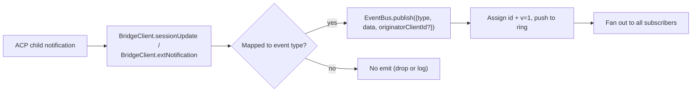

# Typed Daemon Event Schema v1

## Overview

Jeder SSE-Frame, der vom Daemon unter `GET /session/:id/events` ausgegeben wird, hat die Form `{ id, v, type, data, originatorClientId?, _meta? }`. `v: 1` ist die aktuelle `EVENT_SCHEMA_VERSION`. `type` stammt aus der abgeschlossenen, versionsgebundenen `DAEMON_KNOWN_EVENT_TYPE_VALUES`-Menge in `packages/sdk-typescript/src/daemon/events.ts`; die aktuelle Menge umfasst 47 bekannte Event-Typen. Das `_meta`-Feld des Envelopes wird an der SSE-Schreibgrenze von `formatSseFrame()` in `packages/cli/src/serve/routes/sse-events.ts` gestempelt; siehe [Metadaten auf Envelope-Ebene](#envelope-level-metadata).

Das SDK stellt `asKnownDaemonEvent(evt)` bereit. Es gibt ein discriminated `KnownDaemonEvent` für bekannte Event-Typen und `undefined` für andere Typen zurück. SDK-Consumer können dadurch Forward Compatibility handhaben, ohne ein gleichzeitiges SDK-Upgrade zu benötigen, wenn ein neuerer Daemon einen Event-Typ hinzufügt; der Session-Reducer erfasst diese als `unrecognizedKnownEventCount`.

Das Wire-Format befindet sich in [`../qwen-serve-protocol.md`](../qwen-serve-protocol.md). Diese Seite definiert den Payload-Vertrag für jedes Event.

## Responsibilities

- Bietet die Single Source of Truth für das Event-Vokabular (`DAEMON_KNOWN_EVENT_TYPE_VALUES`).
- Stellt ein typisiertes Envelope für jeden Event-Typ bereit (`DaemonEventEnvelope<TType, TData>`).
- Stellt pure Reducer (`reduceDaemonSessionEvent`, `reduceDaemonAuthEvent`) bereit, die einen Event-Stream in den SDK-View-State projizieren.
- Sendet den `typed_event_schema` Capability-Tag als Informationssignal. Wenn der Tag fehlt, fällt `asKnownDaemonEvent` dennoch auf `unknown` zurück.

## Event-Vokabular (47 bekannte Typen)

Gruppiert nach Domäne.

### Core-Session

| Typ                        | Richtung       | Trigger                                                                       | Wichtige Payload-Felder                                                            |
| -------------------------- | -------------- | ----------------------------------------------------------------------------- | ---------------------------------------------------------------------------------- |
| `session_update`           | S->C           | Jede ACP `sessionUpdate`-Benachrichtigung: Agent-Text, Thought, Tool-Call oder Plan | `sessionUpdate: string, content?: ...` (opaque ACP-Struktur)                       |
| `session_metadata_updated` | S->C           | `PATCH /session/:id/metadata`                                                 | `sessionId, displayName?`                                                          |
| `session_died`             | S->C terminal  | `channel.exited`                                                              | `sessionId, reason, exitCode? \| null, signalCode? \| null`                        |
| `session_closed`           | S->C terminal  | `DELETE /session/:id` oder programmatisches Schließen                         | `sessionId, reason: 'client_close' \| string, closedBy?`                           |
| `session_snapshot`         | S->C synthetic | Snapshot-Frame nach SSE-Attach / Replay                                       | `sessionId, currentModelId: string \| null, currentApprovalMode: string \| null`   |

### Synthetische Frames auf Subscriber-Ebene

| Typ                     | Trigger                                                                                                                                                                                                                              | Hinweise                                                                                                                                                                                                                                                                                                                   |
| ----------------------- | ------------------------------------------------------------------------------------------------------------------------------------------------------------------------------------------------------------------------------------ | -------------------------------------------------------------------------------------------------------------------------------------------------------------------------------------------------------------------------------------------------------------------------------------------------------------------------- |
| `client_evicted`        | EventBus-Queue-Überlauf pro Subscriber. **Keine `id`**                                                                                                                                                                               | `reason: string, droppedAfter?: number`; terminal nur für den aktuellen Subscriber, während die Session aktiv bleibt.                                                                                                                                                                                                      |
| `slow_client_warning`   | Queue >= 75%; force-pushed und **hat keine `id`**                                                                                                                                                                                    | `queueSize, maxQueued, lastEventId`; wird erneut aktiviert, wenn die Queue unter 37,5 % fällt.                                                                                                                                                                                                                             |
| `stream_error`          | `SubscriberLimitExceededError` oder ein anderer Route-Stream-Fehler                                                                                                                                                                  | `error: string`; terminal für die Subscription.                                                                                                                                                                                                                                                                            |
| `state_resync_required` | `subscribe({lastEventId})` erkennt, dass der Daemon-Ring nicht mehr `[lastEventId+1, earliestInRing-1]` enthält oder der Client-Cursor aus einer früheren Bus-Epoche stammt. Force-pushed **vor** den verbleibenden Replay-Frames und **hat keine `id`**. | `reason: 'ring_evicted' \| 'epoch_reset' \| string`, `lastDeliveredId: number`, `earliestAvailableId: number`. Dies ist ein Recovery-Signal, nicht terminal: Der SSE-Stream bleibt offen und Replay- sowie Live-Frames werden fortgesetzt. Der SDK-Reducer setzt `awaitingResync = true` und überspringt Deltas, bis der Caller mit `loadSession` zurücksetzt. |
| `replay_complete`       | ID-loses Sentinel, das nach Abschluss der `Last-Event-ID`-Replay-Schleife ausgegeben wird, sowohl für saubere Replays als auch für Ring-Evicted-Pfade, selbst wenn `data.replayedCount === 0`. **Keine `id`**                      | `replayedCount: number`; ermöglicht es Consumern, die Catch-up-UI deterministisch ohne Timeout zu entfernen.                                                                                                                                                                                                               |

### Permissions (F3 + base)

| Typ                           | Richtung | Trigger                                            | Wichtige Payload-Felder                                                                                                                          |
| ----------------------------- | -------- | -------------------------------------------------- | ------------------------------------------------------------------------------------------------------------------------------------------------ |
| `permission_request`          | S->C     | Agent ruft `requestPermission` auf                 | `requestId, sessionId, toolCall, options[]`; das Envelope stempelt `originatorClientId` vom Prompt-Originator.                                   |
| `permission_resolved`         | S->C     | Mediator hat entschieden                           | `requestId, outcome` (ACP `PermissionOutcome`)                                                                                                   |
| `permission_already_resolved` | S->C     | Vote trifft ein, nachdem die Anfrage bereits entschieden wurde | `requestId, sessionId, outcome`                                                                                                                  |
| `permission_partial_vote`     | S->C     | `consensus`-Policy zeichnet einen nicht-finalen Vote auf | `requestId, sessionId, votesReceived, votesNeeded (>= 1), quorum, optionTallies: Record<string, number>, originatorClientId?`                    |
| `permission_forbidden`        | S->C     | Policy lehnt einen Vote ab                         | `requestId, sessionId, clientId?, reason: 'designated_mismatch' \| 'remote_not_allowed', originatorClientId?`; anonyme Voter lassen `clientId` weg. |

### Models

| Typ                   | Richtung | Payload                                      |
| --------------------- | -------- | -------------------------------------------- |
| `model_switched`      | S->C     | `sessionId, modelId`                         |
| `model_switch_failed` | S->C     | `sessionId, requestedModelId, error: string` |

### MCP-Guardrails (PR 14b + F2)

| Typ                          | Richtung | Payload                                                                                                                                                                                                                                                                                                                                                                                                                                           |
| ---------------------------- | -------- | ------------------------------------------------------------------------------------------------------------------------------------------------------------------------------------------------------------------------------------------------------------------------------------------------------------------------------------------------------------------------------------------------------------------------------------------------- |
| `mcp_budget_warning`         | S->C     | `liveCount, reservedCount, budget, thresholdRatio: 0.75, mode: 'warn' \| 'enforce', scope?: 'workspace' \| 'session'`                                                                                                                                                                                                                                                                                                                             |
| `mcp_child_refused_batch`    | S->C     | `refusedServers: [{ name, transport, reason: 'budget_exhausted' }], budget, liveCount, reservedCount, mode: 'enforce', scope?: 'workspace' \| 'session'`                                                                                                                                                                                                                                                                                          |
| `mcp_server_restarted`       | S->C     | `serverName, durationMs, entryIndex?` für F2-Multi-Entry-Pool-Restarts                                                                                                                                                                                                                                                                                                                                                                            |
| `mcp_server_restart_refused` | S->C     | `serverName, reason: 'budget_would_exceed' \| 'in_flight' \| 'disabled' \| 'restart_failed', entryIndex?, details?`. Der vierte Wert, `restart_failed`, enthält einen zugrunde liegenden Hard-Failure für Multi-Entry-Restarts im Pool-Modus. `MCP_RESTART_REFUSED_REASONS` weist unbekannte Reasons zurück; ein älterer SDK-Reducer verwirft additive neue Reason-Werte stillschweigend, da `parseDaemonEvent` `undefined` zurückgibt. Liefere eine neue Reason mit einem SDK aus, das sie kennt. |

### Mutationskontrolle (Wave 4 PR 16+17)

| Typ                      | Richtung | Payload                                                                                                                          |
| ------------------------ | -------- | -------------------------------------------------------------------------------------------------------------------------------- |
| `memory_changed`         | S->C     | `scope: 'workspace' \| 'global', filePath, mode: 'append' \| 'replace', bytesWritten`                                            |
| `agent_changed`          | S->C     | `change: 'created' \| 'updated' \| 'deleted', name, level: 'project' \| 'user'`                                                  |
| `approval_mode_changed`  | S->C     | `sessionId, previous, next, persisted: boolean`                                                                                  |
| `tool_toggled`           | S->C     | `toolName, enabled`; betrifft den nächsten ACP-Child-Spawn und mutiert keine bereits laufenden Sessions.                         |
| `settings_changed`       | S->C     | Schreiben der Workspace-Einstellungen abgeschlossen. Payload ist offen; Consumer sollten mit Read-after-write aktualisieren.     |
| `settings_reloaded`      | S->C     | Daemon-Workspace-Service hat Einstellungen neu eingelesen. Payload ist offen.                                                    |
| `trust_change_requested` | S->C     | `workspaceCwd, desiredState: 'trusted' \| 'untrusted', reason?`                                                                  |
| `workspace_initialized`  | S->C     | `path, action: 'created' \| 'overwrote' \| 'noop', originatorClientId?`                                                          |
| `github_setup_completed` | S->C     | `releaseTag, readmeUrl, secretsUrl?, workflows: [{path, status, sizeBytes?, error?}], gitignore: {path, status, added?, error?}` |

### Auth-Device-Flow (PR 21)

Diese Events sind auf Workspace-Ebene gekeyed, nicht auf Session-Ebene. Der Session-Reducer behandelt sie als No-Ops; `reduceDaemonAuthEvent` projiziert sie in den State auf Workspace-Ebene.

| Typ                           | Richtung | Payload                                               |
| ----------------------------- | -------- | ----------------------------------------------------- |
| `auth_device_flow_started`    | S->C     | `deviceFlowId, providerId, expiresAt`                 |
| `auth_device_flow_throttled`  | S->C     | `deviceFlowId, intervalMs`                            |
| `auth_device_flow_authorized` | S->C     | `deviceFlowId, providerId, expiresAt?, accountAlias?` |
| `auth_device_flow_failed`     | S->C     | `deviceFlowId, errorKind, hint?`                      |
| `auth_device_flow_cancelled`  | S->C     | `deviceFlowId`                                        |

### MCP-Runtime-Mutation

| Typ                  | Richtung | Trigger                                                       | Wichtige Payload-Felder                                                        |
| -------------------- | -------- | ------------------------------------------------------------- | ------------------------------------------------------------------------------ |
| `mcp_server_added`   | S->C     | Server zur Laufzeit über `POST /workspace/mcp/servers` hinzugefügt | `name, transport, replaced, shadowedSettings, toolCount, originatorClientId`   |
| `mcp_server_removed` | S->C     | Server zur Laufzeit entfernt                                  | `name, wasShadowingSettings, originatorClientId`                               |

### Extensions-Lifecycle

| Typ                  | Richtung | Trigger                                                              | Wichtige Payload-Felder                                                                                                                        |
| -------------------- | -------- | -------------------------------------------------------------------- | ---------------------------------------------------------------------------------------------------------------------------------------------- |
| `extensions_changed` | S->C     | Hintergrund-Installation/Refresh von Extensions abgeschlossen oder Statusänderung | `refreshed, failed, status?: 'installed' \| 'enabled' \| 'disabled' \| 'updated' \| 'uninstalled' \| 'failed', source?, name?, version?, error?` |

### Mid-Turn-Message-Injection

| Typ                         | Richtung | Trigger                                                                                         | Wichtige Payload-Felder                                                                                                                  |
| --------------------------- | -------- | ----------------------------------------------------------------------------------------------- | ---------------------------------------------------------------------------------------------------------------------------------------- |
| `mid_turn_message_injected` | S->C     | Web-Shell oder Remote-Client hat Nachrichten über `POST /session/:id/inject` in einen laufenden Turn injiziert | `sessionId, messages: string[], originatorClientId?`; Consumer MÜSSEN `originatorClientId` mit ihrer eigenen ID vergleichen, bevor sie Deduplizierungen vornehmen. |

### Turn-Lifecycle / Assistant-Pushes

| Typ                   | Richtung | Trigger                                                                                                             | Wichtige Payload-Felder                                                                                                                                                                                |
| --------------------- | -------- | ------------------------------------------------------------------------------------------------------------------- | ------------------------------------------------------------------------------------------------------------------------------------------------------------------------------------------------------ |
| `prompt_cancelled`    | S->C     | Prompt wurde über die explizite `cancelSession`-Route **oder** durch SSE-Disconnect des Originators abgebrochen     | Das Envelope stempelt `originatorClientId` für den abbrechenden Client. Dies bedeutet "Abbruch angefordert", nicht "Abbruch bestätigt". Peer-Subscriber erfahren, dass der Prompt beendet wurde.       |
| `turn_complete`       | S->C     | Ein Turn wurde erfolgreich abgeschlossen                                                                            | `sessionId, stopReason, promptId?`. `promptId` verlinkt zu nicht-blockierenden Prompt-Antworten (`202`). Das SDK gleicht SSE-Events darüber mit dem ursprünglichen Prompt ab.                          |
| `turn_error`          | S->C     | Ein Turn ist fehlgeschlagen                                                                                         | `sessionId, message, code?, promptId?`; derselbe `promptId`-Korrelationsmechanismus.                                                                                                                   |
| `session_rewound`     | S->C     | `POST /session/:id/rewind` war erfolgreich                                                                          | `sessionId, promptId, targetTurnIndex, filesChanged[], filesFailed[], originatorClientId?`                                                                                                             |
| `session_branched`    | S->C     | `POST /session/:id/branch` hat einen Branch aus einer bestehenden Session erstellt                                  | `sourceSessionId, newSessionId, displayName, originatorClientId?`                                                                                                                                      |
| `followup_suggestion` | S->C     | ACP-Child hat Ghost-Text-Follow-up-Vorschläge nach `end_turn` generiert, weitergeleitet über Session-SSE            | `sessionId, suggestion, promptId`; das Wire-Format überträgt nur Vorschläge, deren `getFilterReason()===null` ist. Clients rendern sie als Ghost-Text für Input-Platzhalter und invalidieren sie beim nächsten `sendPrompt`. |
| `user_shell_command`  | S->C     | Benutzer hat einen Shell-Befehl über `POST /session/:id/shell` gestartet; an andere Subscriber in derselben Session verteilt | `sessionId, command, shellId, originatorClientId?`. Es gibt noch keine typisierte `DaemonXxxData`-Schnittstelle; `asKnownDaemonEvent` gibt `undefined` zurück und der UI-Normalizer parst es ad hoc.   |
| `user_shell_result`   | S->C     | Ergebnis des obigen Shell-Befehls                                                                                   | `sessionId, shellId, exitCode, output, aborted`. Gleicher Hinweis zum Ad-hoc-Parsing wie bei `user_shell_command`.                                                                                     |
## Architektur

| Aspekt                                 | Quelle                                         | Hinweise                                                                                                           |
| -------------------------------------- | ---------------------------------------------- | ------------------------------------------------------------------------------------------------------------------ |
| `EVENT_SCHEMA_VERSION = 1`             | `packages/acp-bridge/src/eventBus.ts`          | Wird in jedem Frame gesendet.                                                                                      |
| `DAEMON_KNOWN_EVENT_TYPE_VALUES`       | `packages/sdk-typescript/src/daemon/events.ts` | Geschlossene Liste mit 47 Typen.                                                                                   |
| `DaemonEventEnvelope<TType, TData>`    | `events.ts`                                    | Generisches Envelope.                                                                                              |
| `DaemonKnownEventType`                 | `events.ts`                                    | `typeof DAEMON_KNOWN_EVENT_TYPE_VALUES[number]`.                                                                   |
| Payload-Typen pro Event                | `events.ts`                                    | Die meisten Event-Typen haben ein `DaemonXxxData`-Interface; `user_shell_*` wird derzeit ad hoc vom UI-Normalizer geparst. |
| `asKnownDaemonEvent(evt)`              | `events.ts`                                    | Gibt `KnownDaemonEvent \| undefined` zurück.                                                                       |
| `reduceDaemonSessionEvent(state, evt)` | `events.ts`                                    | Projiziert in `DaemonSessionViewState`.                                                                            |
| `reduceDaemonAuthEvent(state, evt)`    | `events.ts`                                    | Projiziert in `DaemonAuthState`.                                                                                   |
| `isWorkspaceScopedBudgetEvent(evt)`    | `events.ts`                                    | Erkennt F2 `scope: 'workspace'`.                                                                                   |

### `DaemonSessionViewState`

`reduceDaemonSessionEvent` füllt diesen View-State. CLI-TUI-Adapter, `DaemonChannelBridge` und die VS Code IDE konsumieren ihn. Wichtige Felder:

- `alive: boolean` - wird nach einem Terminal-Frame (`session_died`, `session_closed`, `client_evicted`, `stream_error`) auf `false` gesetzt.
- `currentModelId?: string` - von `model_switched`.
- `displayName?: string` - von `session_metadata_updated`.
- `pendingPermissions: Record<string, DaemonPermissionRequestData>` - offene Requests, nach `requestId` indiziert; werden durch `permission_resolved` / `permission_already_resolved` gelöscht.
- `lastSessionUpdate?: DaemonSessionUpdateData` - neuestes `session_update`.
- `lastModelSwitchFailure?: DaemonModelSwitchFailedData` - von `model_switch_failed`.
- `terminalEvent?` - rohes Terminal-Event.
- `streamError?: DaemonStreamErrorData` - neueste `stream_error`-Payload.
- `unrecognizedKnownEventCount`, `lastUnrecognizedKnownEvent?` - Event wurde von `asKnownDaemonEvent` erkannt, aber der Reducer hat noch keinen dedizierten State dafür.
- `droppedPermissionRequestCount`, `lastDroppedPermissionRequestId?` - fehlerhafte Permission-Requests konnten nicht in die Pending-Map aufgenommen werden.
- `unmatchedPermissionResolutionCount`, `lastUnmatchedPermissionResolutionId?` - Permission-Resolution hatte keinen passenden Pending-Request.
- `slowClientWarningCount`, `lastSlowClientWarning?` - von `slow_client_warning`.
- `mcpBudgetWarningCount`, `lastMcpBudgetWarning?` - von `mcp_budget_warning`.
- `mcpChildRefusedBatchCount`, `lastMcpChildRefusedBatch?` - von `mcp_child_refused_batch`.
- `lastWorkspaceMutation?`, `lastWorkspaceMutationType?` - von `memory_changed` / `agent_changed`.
- `approvalMode?`, `approvalModeChangedCount`, `lastApprovalModeChange?` - von `approval_mode_changed`.
- `toolToggleCount`, `lastToolToggle?` - von `tool_toggled`.
- `workspaceInitCount`, `lastWorkspaceInit?` - von `workspace_initialized`.
- `mcpRestartCount`, `lastMcpRestart?` - von `mcp_server_restarted`.
- `mcpRestartRefusedCount`, `lastMcpRestartRefused?` - von `mcp_server_restart_refused`.
- `settings_changed` / `settings_reloaded` - von `asKnownDaemonEvent` erkannt; der Session-Reducer pflegt keine dedizierten View-State-Felder, und UIs behandeln sie normalerweise als Refresh-Signale.
- `permissionVoteProgress: Record<string, DaemonPermissionPartialVoteData>` - Consensus-Voting-Fortschritt.
- `forbiddenVotes: DaemonPermissionForbiddenData[]`, `forbiddenVoteCount` - durch Policy abgelehnte Vote-Datensätze, begrenzt auf 32.
- `awaitingResync: boolean` - gesetzt durch `state_resync_required`; wird gelöscht, wenn der Consumer den View-State zurücksetzt.
- `resyncRequiredCount`, `lastResyncRequired?` - Resync-Observability.
- `lastFollowupSuggestion?: DaemonFollowupSuggestionData` - neuester Follow-up-Vorschlag, der vom Daemon gepusht wurde.
- `lastTurnComplete?: DaemonTurnCompleteData` - neuester erfolgreicher Turn-Abschluss.
- `lastTurnError?: DaemonTurnErrorData` - neuester Turn-Fehler.
- `rewindCount`, `lastRewind?`, `lastBranch?` - neueste Rewind-/Branch-Events.

### `DaemonAuthState`

Ein Eintrag pro `providerId`, gesteuert durch `auth_device_flow_*`. Jeder Flow stellt `{ deviceFlowId, status, providerId, expiresAt?, lastThrottleIntervalMs?, lastError? }` bereit.

## Ablauf

### Produzentenseite



### Konsumentenseite (SDK)


## Metadaten auf Envelope-Ebene

Zusätzlich zur `data`-Payload jedes Events stempelt der Daemon zwei Felder auf Envelope-Ebene.

### `_meta.serverTimestamp` - Daemon-Uhr

`EventBus.publish()` in `packages/acp-bridge/src/eventBus.ts` stempelt `_meta.serverTimestamp`, wenn das Event den Bus betritt. Der `BridgeEvent`-Typ enthält `_meta?: Record<string, unknown>`, sodass interne Daemon-Konsumenten `_meta` bei jedem über den Bus veröffentlichten Event **sehen**. `formatSseFrame()` in `packages/cli/src/serve/routes/sse-events.ts` stellt einen Fallback-Timestamp nur für synthetische Frames (z. B. `stream_error`) bereit, die `EventBus.publish` umgehen.

```jsonc
{
  "id": 47,
  "v": 1,
  "type": "session_update",
  "data": { ... },
  "_meta": { "serverTimestamp": 1716287345123 }
}
```

Der Merge behält alle vorhandenen `_meta`-Keys aus dem Input-Event bei (`{...input._meta, serverTimestamp: Date.now()}`). Producer können zusätzliche `_meta`-Keys auf Envelope-Ebene anhängen; `EventBus.publish` führt diese mit dem Timestamp zusammen, anstatt sie zu überschreiben.

Warum das wichtig ist: Multi-Client-UIs, die relative Zeiten rendern oder Transcript-Blöcke sortieren, sollten die Serverzeit anstelle der lokalen Uhr des jeweiligen Browsers/Tabs/Smartphones verwenden. Das Server-Stempeln hält die Reihenfolge clientübergreifend konsistent.

SDK-Zugriff: `event._meta?.serverTimestamp` bevorzugen. Kompatibilitätspfade können auch `event.serverTimestamp` oder `event.data._meta.serverTimestamp` abfragen. ACP-Payload `data._meta` nicht mit Daemon-Envelope `_meta` vermischen.

### `originatorClientId`

Events, die durch einen Request ausgelöst werden, der eine registrierte `X-Qwen-Client-Id` enthielt, können dieses Feld stempeln. Siehe [`08-session-lifecycle.md`](./08-session-lifecycle.md).

## Tool-Call `_meta` (Provenance / serverId)

Dies ist getrennt von Envelope-`_meta`: ACP-`session/update`-Payloads können ihr eigenes `_meta` in `event.data._meta` tragen. `ToolCallEmitter` (`packages/cli/src/acp-integration/session/emitters/ToolCallEmitter.ts`) stempelt zwei Felder bei `emitStart`, `emitResult` und `emitError`:

| Feld         | Typ                                       | Auflösungsregel                                                                                                                                                          |
| ------------ | ----------------------------------------- | ------------------------------------------------------------------------------------------------------------------------------------------------------------------------ |
| `provenance` | `'builtin' \| 'mcp' \| 'subagent'`        | `ToolCallEmitter.resolveToolProvenance`: `subagentMeta` gewinnt mit `subagent`; Tool-Name, der auf `mcp__<server>__<tool>` passt, wird auf `mcp` gemappt; alles andere wird auf `builtin` gemappt. |
| `serverId`   | `string` nur wenn `provenance === 'mcp'`  | Heuristisch aus `mcp__<serverId>__<tool>` extrahiert.                                                                                                                    |

Der vorhandene `_meta.toolName`-Anzeigename bleibt erhalten. Die UI verwendet diese Felder, um Builtin-/MCP-Server-/Subagent-Badges zu rendern, ohne den Tool-Namen erneut parsen zu müssen.

## SDK-Reducer-Verhalten

`reduceDaemonSessionEvent(state, evt)` in `packages/sdk-typescript/src/daemon/events.ts` projiziert den Stream in `DaemonSessionViewState`. Die Resync-bezogenen Felder sind:

- **`awaitingResync: boolean`** - gesetzt durch `state_resync_required`; der Caller löscht es, typischerweise nachdem `POST /session/:id/load` den View-State zurückgesetzt hat.
- **`resyncRequiredCount: number`** - Observability-Counter.
- **`lastResyncRequired?: DaemonStateResyncRequiredData`** - neueste Payload.

Während `awaitingResync = true`, überspringt der Reducer die Delta-Anwendung und lässt nur das geschlossene `RESYNC_PASSTHROUGH_TYPES`-Set zu:

| Passthrough-Typ         | Warum er während des Resync weiterhin angewendet wird                            |
| ----------------------- | -------------------------------------------------------------------------------- |
| `state_resync_required` | Seltener zweiter Resync sollte `lastResyncRequired` / `resyncRequiredCount` aktualisieren. |
| `session_died`          | Terminal-Stream-Signal muss während des Resync sichtbar bleiben.                 |
| `session_closed`        | Wie oben.                                                                        |
| `client_evicted`        | Wie oben.                                                                        |
| `stream_error`          | Wie oben.                                                                        |
| `session_snapshot`      | Full-State-authoritatives Frame; sicher während des Resync anwendbar.            |

`lastEventId` läuft während des Resync weiterhin monoton durch `advanceLastEventId(base)` weiter. Nachdem der Caller zurückgesetzt und `awaitingResync` gelöscht hat, richten sich nachfolgende Deltas am korrekten Cursor aus.

`reduceDaemonAuthEvent` projiziert Device-Flow-Events konzeptionell in Workspace-Level-Auth-State-Einträge der Form `{deviceFlowId, status, providerId, expiresAt?, lastThrottleIntervalMs?, lastError?}`. Im Code speichert der Reducer `status`, `errorKind`, `hint`, `intervalMs`, `lastSeenEventId`, `authorizedExpiresAt` und `accountAlias` auf `DaemonDeviceFlowReducerState`; die Daemon-Event-Payloads selbst behalten die oben aufgeführten pro-Event-Formen.

## State und Vorwärtskompatibilität

- Füge einen bekannten Event-Typ hinzu, indem du an `DAEMON_KNOWN_EVENT_TYPE_VALUES` anhängst. Alte SDKs geben für nicht erkannte Event-Typen über den Fallback-Pfad `undefined` zurück und inkrementieren `unrecognizedKnownEventCount`; neue SDKs verlassen sich auf die Discriminated Union.
- Das Hinzufügen optionaler Felder zu einer bestehenden Payload ist sicher, da Payloads offen sind (`{ [key: string]: unknown }`).
- Das Ändern einer bestehenden Payload-Form ist ein Breaking Change und muss `EVENT_SCHEMA_VERSION` erhöhen sowie einen kompatiblen Capability-Tag wie `caps.features.typed_event_schema_v2` ankündigen.
- `id` ist pro Session monoton. Synthetische Frames auf Subscriber-Ebene (`client_evicted`, `slow_client_warning`, `stream_error`, `state_resync_required`, `replay_complete`, `session_snapshot`) haben absichtlich keine ID, damit andere Subscriber keine Lücken sehen.
- `originatorClientId` lebt auf dem Envelope und nicht in `data`. F3-Partial-Vote-/Forbidden-Payloads führen es außerdem über `mergeOriginator` in `data` zusammen, sodass View-State-Konsumenten den Envelope nicht behalten müssen.

## Abhängigkeiten

- [`10-event-bus.md`](./10-event-bus.md) - Delivery-Channel.
- [`11-capabilities-versioning.md`](./11-capabilities-versioning.md) - wie SDKs `typed_event_schema`, `mcp_guardrail_events` und `permission_mediation` preflighten.
- [`04-permission-mediation.md`](./04-permission-mediation.md) - wie Permission-Events produziert werden.
- [`13-sdk-daemon-client.md`](./13-sdk-daemon-client.md) - `asKnownDaemonEvent`, Reducer und View-State-Form.

## Konfiguration

- Immer angekündigt: `typed_event_schema`, `mcp_guardrail_events` und `permission_mediation` (mit unterstützten Policy-Modi).
- Keine Env-Var oder Flag steuert das Schema selbst direkt. `QWEN_SERVE_NO_MCP_POOL=1` ändert den MCP-Event-`scope` von `'workspace'` zu abwesend oder `'session'`.

## Einschränkungen und bekannte Limits

- Sechs synthetische Frame-Typen haben absichtlich keine `id`; SDK-Code darf nicht davon ausgehen, dass jedes Event eine ID hat.
- `permission_partial_vote` erscheint nur unter `consensus`. `permission_forbidden` erscheint unter `designated`, `consensus` und `local-only`, aber nicht unter `first-responder`.
- `mcp_child_refused_batch` erscheint nur im `mode: 'enforce'`; der `warn`-Modus lehnt nie ab.
- `auth_device_flow_*`-Events sind nicht session-keyed. Verwende beim Konsumieren über `DaemonSessionClient` dafür `reduceDaemonAuthEvent` anstelle des Session-Reducers.

## Referenzen

- `packages/sdk-typescript/src/daemon/events.ts`
- `packages/acp-bridge/src/eventBus.ts` (`EVENT_SCHEMA_VERSION`)
- `packages/cli/src/serve/capabilities.ts` (`typed_event_schema`, `mcp_guardrail_events`, `permission_mediation`)
- Wire-Referenz: [`../qwen-serve-protocol.md`](../qwen-serve-protocol.md)