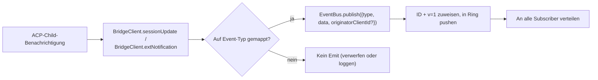
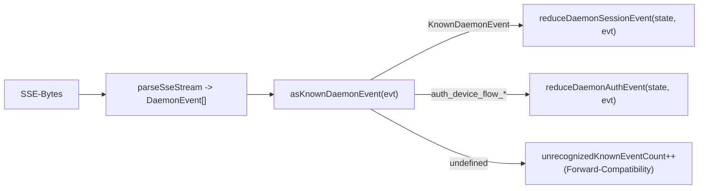

# Typed Daemon Event Schema v1

## Übersicht

Jeder vom Daemon auf `GET /session/:id/events` ausgegebene SSE-Frame hat die Form `{ id, v, type, data, originatorClientId?, _meta? }`. `v: 1` ist die aktuelle `EVENT_SCHEMA_VERSION`. `type` stammt aus dem abgeschlossenen, versionsgebundenen `DAEMON_KNOWN_EVENT_TYPE_VALUES`-Set in `packages/sdk-typescript/src/daemon/events.ts`. Das `_meta`-Feld des Envelopes wird an der SSE-Schreibgrenze von `formatSseFrame()` in `packages/cli/src/serve/routes/sse-events.ts` gestempelt; siehe [Metadaten auf Envelope-Ebene](#envelope-level-metadata).

Das SDK stellt `asKnownDaemonEvent(evt)` bereit. Es gibt ein diskriminiertes `KnownDaemonEvent` für bekannte Event-Typen und `undefined` für andere Typen zurück. SDK-Consumer können dadurch Forward Compatibility handhaben, ohne ein gleichzeitiges SDK-Upgrade zu benötigen, wenn ein neuerer Daemon einen Event-Typ hinzufügt; der Session-Reducer erfasst diese als `unrecognizedKnownEventCount`.

Das Wire-Format befindet sich in [`../qwen-serve-protocol.md`](../qwen-serve-protocol.md). Diese Seite definiert den Payload-Vertrag für jedes Event.

## Verantwortlichkeiten

- Bereitstellung der Single Source of Truth für das Event-Vokabular (`DAEMON_KNOWN_EVENT_TYPE_VALUES`).
- Bereitstellung eines typisierten Envelopes für jeden Event-Typ (`DaemonEventEnvelope<TType, TData>`).
- Bereitstellung reiner Reducer (`reduceDaemonSessionEvent`, `reduceDaemonAuthEvent`), die einen Event-Stream in den SDK-View-State projizieren.
- Broadcast des `typed_event_schema` Capability-Tags als Informationssignal. Wenn das Tag fehlt, fällt `asKnownDaemonEvent` dennoch auf `unknown` zurück.

## Event-Vokabular

Gruppiert nach Domäne.

### Core-Session

| Typ                        | Richtung       | Trigger                                                                       | Wichtige Payload-Felder                                                            |
| -------------------------- | -------------- | ----------------------------------------------------------------------------- | ---------------------------------------------------------------------------------- |
| `session_update`           | S->C           | Jede ACP-`sessionUpdate`-Benachrichtigung: Agent-Text, Thought, Tool-Call oder Plan | `sessionUpdate: string, content?: ...` (opaque ACP-Form)                           |
| `session_metadata_updated` | S->C           | `PATCH /session/:id/metadata`                                                 | `sessionId, displayName?`                                                          |
| `session_died`             | S->C terminal  | `channel.exited`                                                              | `sessionId, reason, exitCode? \| null, signalCode? \| null`                        |
| `session_closed`           | S->C terminal  | `DELETE /session/:id` oder programmatisches Schließen                         | `sessionId, reason: 'client_close' \| string, closedBy?`                           |
| `session_snapshot`         | S->C synthetic | Snapshot-Frame nach SSE-Attach / Replay                                       | `sessionId, currentModelId: string \| null, currentApprovalMode: string \| null, recordingDegraded: boolean` |
| `session_recording_degraded` | S->C           | Der Session-Transcript-Writer hat nach einem asynchronen Schreibfehler permanent gestoppt | `sessionId, reason: 'write_failed'`                                                                          |

### Synthetic Frames auf Subscriber-Ebene

| Typ                     | Trigger                                                                                                                                                                                                                              | Hinweise                                                                                                                                                                                                                                                                                                                   |
| ----------------------- | ------------------------------------------------------------------------------------------------------------------------------------------------------------------------------------------------------------------------------------ | -------------------------------------------------------------------------------------------------------------------------------------------------------------------------------------------------------------------------------------------------------------------------------------------------------------------------- |
| `client_evicted`        | EventBus-Queue-Überlauf pro Subscriber. **Keine `id`**                                                                                                                                                                               | `reason: 'queue_overflow' \| 'queue_bytes_overflow' \| string, droppedAfter?: number, queueSize?: number, maxQueued?: number, queuedBytes?: number, maxQueuedBytes?: number, eventBytes?: number`; terminal nur für den aktuellen Subscriber, während die Session aktiv bleibt.                                            |
| `slow_client_warning`   | Live-Frame-Backlog oder Live-Serialisierte-Bytes-Backlog >= 75%; force-pushed und **hat keine `id`**                                                                                                                                 | `queueSize, maxQueued, lastEventId, queuedBytes?, maxQueuedBytes?, threshold?: 'frames' \| 'bytes' \| 'frames_and_bytes'`; wird erneut aktiviert, nachdem sowohl Frame- als auch Byte-Messungen unter 37,5 % fallen.                                                                                                      |
| `stream_error`          | `SubscriberLimitExceededError` oder ein anderer Route-Stream-Fehler                                                                                                                                                                  | `error: string`; terminal für die Subscription.                                                                                                                                                                                                                                                                            |
| `state_resync_required` | `subscribe({lastEventId})` erkennt, dass der Daemon-Ring nicht mehr `[lastEventId+1, earliestInRing-1]` enthält oder der Client-Cursor aus einer vorherigen Bus-Epoche stammt. Force-pushed **vor** den verbleibenden Replay-Frames und **hat keine `id`**. | `reason: 'ring_evicted' \| 'epoch_reset' \| string`, `lastDeliveredId: number`, `earliestAvailableId: number`. Dies ist ein Recovery-Signal, nicht terminal: der SSE-Stream bleibt offen und Replay- sowie Live-Frames werden fortgesetzt. Der SDK-Reducer setzt `awaitingResync = true` und überspringt Deltas, bis der Caller mit `loadSession` zurücksetzt. |
| `history_truncated`     | `POST /session/:id/load` gibt einen begrenzten Replay-Snapshot zurück, nachdem ältere In-Memory-Replay-Einträge verworfen wurden. Vorangestellt vor `compactedReplay` und **hat keine `id`**.                                                                                                      | `reason: 'replay_window_exceeded'`, `truncatedEvents: number`, `retainedEvents: number`, `maxBytes: number`, `truncatedTurns?: number`, `fullTranscriptAvailable: boolean`. Dies ist ein Statusmarker, keine Resync-Aufforderung; Clients rendern ihn und setzen die Anwendung des behaltenen Replays fort.              |
| `replay_complete`       | ID-loses Sentinel, das ausgegeben wird, nachdem die `Last-Event-ID`-Replay-Schleife abgeschlossen ist, für sowohl sauberes Replay als auch Ring-Evicted-Pfade, selbst wenn `data.replayedCount === 0`. **Keine `id`**                | `replayedCount: number`; ermöglicht es Consumern, die Catch-up-UI deterministisch ohne Timeout zu entfernen.                                                                                                                                                                                                               |

`fullTranscriptAvailable` ist ein boolesches Capability-Flag, kein literaler `true`-Typ. Aktuelle Daemons emittieren `true`, wenn `/session/:id/transcript` verwendet werden kann, um das persistierte Transkript seitenweise abzurufen; ältere oder eingeschränkte Daemons können `false` emittieren, und Clients sollten das begrenzte Replay normal weiter rendern.

### Permissions (F3 + base)

| Typ                           | Richtung | Trigger                                            | Wichtige Payload-Felder                                                                                                                          |
| ----------------------------- | -------- | -------------------------------------------------- | ------------------------------------------------------------------------------------------------------------------------------------------------ |
| `permission_request`          | S->C     | Agent ruft `requestPermission` auf                 | `requestId, sessionId, toolCall, options[]`; das Envelope stempelt `originatorClientId` vom Prompt-Originator.                                   |
| `permission_resolved`         | S->C     | Mediator hat entschieden                           | `requestId, outcome` (ACP `PermissionOutcome`)                                                                                                   |
| `permission_already_resolved` | S->C     | Vote trifft ein, nachdem die Anfrage bereits entschieden wurde | `requestId, sessionId, outcome`                                                                                                                  |
| `permission_partial_vote`     | S->C     | `consensus`-Policy erfasst einen nicht-finalen Vote | `requestId, sessionId, votesReceived, votesNeeded (>= 1), quorum, optionTallies: Record<string, number>, originatorClientId?`                    |
| `permission_forbidden`        | S->C     | Policy lehnt einen Vote ab                         | `requestId, sessionId, clientId?, reason: 'designated_mismatch' \| 'remote_not_allowed', originatorClientId?`; anonyme Voter lassen `clientId` weg. |

### Models

| Typ                   | Richtung | Payload                                      |
| --------------------- | -------- | -------------------------------------------- |
| `model_switched`      | S->C     | `sessionId, modelId`                         |
| `model_switch_failed` | S->C     | `sessionId, requestedModelId, error: string` |

### MCP-Guardrails (PR 14b + F2)

| Typ                          | Richtung | Payload                                                                                                                                                                                                                                                                                                                                                                                                                                           |
| ---------------------------- | -------- | ------------------------------------------------------------------------------------------------------------------------------------------------------------------------------------------------------------------------------------------------------------------------------------------------------------------------------------------------------------------------------------------------------------------------------------------------- |
| `mcp_budget_warning`         | S->C     | `liveCount, reservedCount, budget, thresholdRatio: 0.75, mode: 'warn' \| 'enforce', scope?: 'workspace' \| 'session'`                                                                                                                                                                                                                                                                                                                             |
| `mcp_child_refused_batch`    | S->C     | `refusedServers: [{ name, transport, reason: 'budget_exhausted' }], budget, liveCount, reservedCount, mode: 'enforce', scope?: 'workspace' \| 'session'`                                                                                                                                                                                                                                                                                          |
| `mcp_server_restarted`       | S->C     | `serverName, durationMs, entryIndex?` für F2-Multi-Entry-Pool-Restarts                                                                                                                                                                                                                                                                                                                                                                            |
| `mcp_server_restart_refused` | S->C     | `serverName, reason: 'budget_would_exceed' \| 'in_flight' \| 'disabled' \| 'restart_failed', entryIndex?, details?`. Der vierte Wert, `restart_failed`, transportiert einen zugrunde liegenden Hard-Failure für Multi-Entry-Pool-Restarts im Pool-Modus. `MCP_RESTART_REFUSED_REASONS` weist unbekannte Reasons zurück; ein älterer SDK-Reducer verwirft additive neue Reason-Werte stillschweigend, da `parseDaemonEvent` `undefined` zurückgibt. Liefere einen neuen Reason mit einem SDK aus, das ihn kennt. |
### Mutationskontrolle (Wave 4 PR 16+17)

| Typ                      | Richtung | Payload                                                                                                                                        |
| ------------------------ | -------- | ---------------------------------------------------------------------------------------------------------------------------------------------- |
| `memory_changed`         | S->C     | File-Speicher: `scope: 'workspace' \| 'global', filePath, mode, bytesWritten`; Managed Memory: `scope: 'managed', source, taskId, touchedScopes` |
| `agent_changed`          | S->C     | `change: 'created' \| 'updated' \| 'deleted', name, level: 'project' \| 'user'`                                                                |
| `approval_mode_changed`  | S->C     | `sessionId, previous, next, persisted: boolean`                                                                                                |
| `tool_toggled`           | S->C     | `toolName, enabled`; betrifft den nächsten ACP-Child-Spawn und mutiert nicht bereits laufende Sessions.                                            |
| `settings_changed`       | S->C     | Workspace-Einstellungen erfolgreich geschrieben. Payload ist offen; Consumer sollten mit Read-after-write aktualisieren.                                           |
| `settings_reloaded`      | S->C     | Daemon-Workspace-Service hat Einstellungen neu eingelesen. Payload ist offen.                                                                                     |
| `trust_change_requested` | S->C     | `workspaceCwd, desiredState: 'trusted' \| 'untrusted', reason?`                                                                                |
| `workspace_initialized`  | S->C     | `path, action: 'created' \| 'overwrote' \| 'noop', originatorClientId?`                                                                        |
| `github_setup_completed` | S->C     | `releaseTag, readmeUrl, secretsUrl?, workflows: [{path, status, sizeBytes?, error?}], gitignore: {path, status, added?, error?}`               |

`memory_changed` umfasst auch sitzungslose Managed-Memory-Tasks. Für diese Payloads ist `scope` `"managed"`, `source` ist einer der Werte `"workspace_memory_remember"`, `"workspace_memory_forget"` oder `"workspace_memory_dream"`, `taskId` ist die ID des Tasks in der Warteschlange und `touchedScopes` listet die geänderten Managed-Memory-Scopes auf (`"user"` und/oder `"project"`). Es wird kein Event ausgelöst, wenn ein Remember/Forget/Dream-Task abgeschlossen wird, ohne den Managed Memory zu verändern.

### Auth-Device-Flow (PR 21)

Diese Events sind auf den Workspace bezogen (workspace-keyed), nicht auf die Session. Der Session-Reducer behandelt sie als No-Ops; `reduceDaemonAuthEvent` projiziert sie in den State auf Workspace-Ebene.

| Typ                           | Richtung | Payload                                               |
| ----------------------------- | -------- | ----------------------------------------------------- |
| `auth_device_flow_started`    | S->C     | `deviceFlowId, providerId, expiresAt`                 |
| `auth_device_flow_throttled`  | S->C     | `deviceFlowId, intervalMs`                            |
| `auth_device_flow_authorized` | S->C     | `deviceFlowId, providerId, expiresAt?, accountAlias?` |
| `auth_device_flow_failed`     | S->C     | `deviceFlowId, errorKind, hint?`                      |
| `auth_device_flow_cancelled`  | S->C     | `deviceFlowId`                                        |

### MCP Runtime Mutation

| Typ                  | Richtung | Trigger                                                       | Wichtige Payload-Felder                                                           |
| -------------------- | -------- | ------------------------------------------------------------- | ---------------------------------------------------------------------------- |
| `mcp_server_added`   | S->C     | Server zur Laufzeit über `POST /workspace/mcp/servers` hinzugefügt | `name, transport, replaced, shadowedSettings, toolCount, originatorClientId` |
| `mcp_server_removed` | S->C     | Server zur Laufzeit entfernt                                     | `name, wasShadowingSettings, originatorClientId`                             |

### Extensions-Lifecycle

| Typ                  | Richtung | Trigger                                                              | Wichtige Payload-Felder                                                                                                                               |
| -------------------- | -------- | -------------------------------------------------------------------- | ------------------------------------------------------------------------------------------------------------------------------------------------ |
| `extensions_changed` | S->C     | Hintergrund-Installation/Aktualisierung von Extensions abgeschlossen oder Statusänderung | `refreshed, failed, status?: 'installed' \| 'enabled' \| 'disabled' \| 'updated' \| 'uninstalled' \| 'failed', source?, name?, version?, error?` |

### Mid-Turn Message Injection

| Typ                         | Richtung | Trigger                                                                                         | Wichtige Payload-Felder                                                                                                                 |
| --------------------------- | -------- | ----------------------------------------------------------------------------------------------- | ---------------------------------------------------------------------------------------------------------------------------------- |
| `mid_turn_message_injected` | S->C     | Web-Shell oder Remote-Client hat Nachrichten über `POST /session/:id/inject` in einen laufenden Turn injiziert | `sessionId, messages: string[], originatorClientId?`; Consumer MÜSSEN `originatorClientId` mit ihrer eigenen ID vergleichen, bevor sie Deduplizierungen vornehmen. |

### Turn-Lifecycle / Assistant Pushes

| Typ                   | Richtung | Trigger                                                                                                             | Wichtige Payload-Felder                                                                                                                                                                               |
| --------------------- | -------- | ------------------------------------------------------------------------------------------------------------------- | ------------------------------------------------------------------------------------------------------------------------------------------------------------------------------------------------ |
| `prompt_cancelled`    | S->C     | Prompt wurde über die explizite `cancelSession`-Route **oder** durch SSE-Disconnect des Originators abgebrochen                        | Envelope versieht den abbrechenden Client mit dem `originatorClientId`-Stempel. Dies bedeutet "Abbruch angefordert", nicht "Abbruch bestätigt". Peer-Subscriber erfahren dadurch, dass der Prompt beendet wurde.              |
| `turn_complete`       | S->C     | Ein Turn wurde erfolgreich abgeschlossen                                                                                       | `sessionId, stopReason, promptId?, branchPoint?`. `promptId` verknüpft mit nicht-blockierenden Prompt-Antworten (`202`). Eligible completed turns include `branchPoint: { assistantRecordUuid, checkpointUuid }`. |
| `turn_error`          | S->C     | Ein Turn ist fehlgeschlagen                                                                                                       | `sessionId, message, code?, promptId?`; derselbe `promptId`-Korrelationsmechanismus.                                                                                                                   |
| `session_rewound`     | S->C     | `POST /session/:id/rewind` war erfolgreich                                                                                | `sessionId, promptId, targetTurnIndex, filesChanged[], filesFailed[], originatorClientId?`                                                                                                       |
| `session_branched`    | S->C     | Legacy-Kompatibilitäts-Event; der aktuelle Branch-Endpunkt gibt sein Ergebnis direkt zurück und veröffentlicht dieses Event nicht | `sourceSessionId, newSessionId, displayName, originatorClientId?`. Reader behalten Support für ältere Producer bei.                                                                                 |
| `followup_suggestion` | S->C     | ACP-Child hat Ghost-Text-Follow-up-Vorschläge nach `end_turn` generiert, weitergeleitet über session-spezifisches SSE               | `sessionId, suggestion, promptId`; der Wire überträgt nur Vorschläge, bei denen `getFilterReason()===null` ist. Clients rendern sie als Ghost-Text für Input-Platzhalter und invalidieren sie beim nächsten `sendPrompt`. |
| `user_shell_command`  | S->C     | Benutzer hat einen Shell-Befehl über `POST /session/:id/shell` gestartet; an andere Subscriber in derselben Session verteilt | `sessionId, command, shellId, originatorClientId?`. Es gibt noch keine typisierte `DaemonXxxData`-Schnittstelle; `asKnownDaemonEvent` gibt `undefined` zurück und der UI-Normalizer parst es ad hoc.            |
| `user_shell_result`   | S->C     | Ergebnis des obigen Shell-Befehls                                                                                   | `sessionId, shellId, exitCode, output, aborted`. Gleicher Hinweis zum ad-hoc-Parsing wie bei `user_shell_command`.                                                                                               |

## Architektur

| Aspekt                                 | Quelle                                         | Hinweise                                                                                                              |
| -------------------------------------- | ---------------------------------------------- | ------------------------------------------------------------------------------------------------------------------ |
| `EVENT_SCHEMA_VERSION = 1`             | `packages/acp-bridge/src/eventBus.ts`          | Wird in jedem Frame gesendet.                                                                                               |
| `DAEMON_KNOWN_EVENT_TYPE_VALUES`       | `packages/sdk-typescript/src/daemon/events.ts` | Abgeschlossene Liste mit 53 Typen.                                                                                         |
| `DaemonEventEnvelope<TType, TData>`    | `events.ts`                                    | Generische Envelope.                                                                                                  |
| `DaemonKnownEventType`                 | `events.ts`                                    | `typeof DAEMON_KNOWN_EVENT_TYPE_VALUES[number]`.                                                                   |
| Payload-Typen pro Event                | `events.ts`                                    | Die meisten Event-Typen haben eine `DaemonXxxData`-Schnittstelle; `user_shell_*` wird derzeit ad hoc vom UI-Normalizer geparst. |
| `asKnownDaemonEvent(evt)`              | `events.ts`                                    | Gibt `KnownDaemonEvent \| undefined` zurück.                                                                           |
| `reduceDaemonSessionEvent(state, evt)` | `events.ts`                                    | Projiziert in `DaemonSessionViewState`.                                                                            |
| `reduceDaemonAuthEvent(state, evt)`    | `events.ts`                                    | Projiziert in `DaemonAuthState`.                                                                                   |
| `isWorkspaceScopedBudgetEvent(evt)`    | `events.ts`                                    | Erkennt F2 `scope: 'workspace'`.                                                                                   |

### `DaemonSessionViewState`

`reduceDaemonSessionEvent` füllt diesen View-State. CLI-TUI-Adapter, `DaemonChannelBridge` und die VS Code IDE konsumieren ihn. Wichtige Felder:

- `alive: boolean` - wird nach einem Terminal-Frame (`session_died`, `session_closed`, `client_evicted`, `stream_error`) auf `false` gesetzt.
- `currentModelId?: string` - aus `model_switched`.
- `displayName?: string` - aus `session_metadata_updated`.
- `recordingDegraded: boolean` - sticky Session-Recording-State von `session_recording_degraded`; ein expliziter `session_snapshot.recordingDegraded`-Wert ist maßgebend.
- `pendingPermissions: Record<string, DaemonPermissionRequestData>` - offene Requests, gekeyed nach `requestId`; bereinigt durch `permission_resolved` / `permission_already_resolved`.
- `lastSessionUpdate?: DaemonSessionUpdateData` - neuestes `session_update`.
- `lastModelSwitchFailure?: DaemonModelSwitchFailedData` - aus `model_switch_failed`.
- `terminalEvent?` - rohes Terminal-Event.
- `streamError?: DaemonStreamErrorData` - neueste `stream_error`-Payload.
- `unrecognizedKnownEventCount`, `lastUnrecognizedKnownEvent?` - Event wurde von `asKnownDaemonEvent` erkannt, aber der Reducer hat noch keinen dedizierten State dafür.
- `droppedPermissionRequestCount`, `lastDroppedPermissionRequestId?` - fehlerhafter Permission-Request konnte nicht in die Pending-Map aufgenommen werden.
- `unmatchedPermissionResolutionCount`, `lastUnmatchedPermissionResolutionId?` - Permission-Resolution hatte keinen passenden Pending-Request.
- `slowClientWarningCount`, `lastSlowClientWarning?` - aus `slow_client_warning`.
- `mcpBudgetWarningCount`, `lastMcpBudgetWarning?` - aus `mcp_budget_warning`.
- `mcpChildRefusedBatchCount`, `lastMcpChildRefusedBatch?` - aus `mcp_child_refused_batch`.
- `lastWorkspaceMutation?`, `lastWorkspaceMutationType?` - aus `memory_changed` / `agent_changed`.
- `approvalMode?`, `approvalModeChangedCount`, `lastApprovalModeChange?` - aus `approval_mode_changed`.
- `toolToggleCount`, `lastToolToggle?` - aus `tool_toggled`.
- `workspaceInitCount`, `lastWorkspaceInit?` - aus `workspace_initialized`.
- `mcpRestartCount`, `lastMcpRestart?` - aus `mcp_server_restarted`.
- `mcpRestartRefusedCount`, `lastMcpRestartRefused?` - aus `mcp_server_restart_refused`.
- `settings_changed` / `settings_reloaded` - werden von `asKnownDaemonEvent` erkannt; der Session-Reducer pflegt keine dedizierten View-State-Felder dafür und UIs behandeln sie üblicherweise als Refresh-Signale.
- `permissionVoteProgress: Record<string, DaemonPermissionPartialVoteData>` - Fortschritt des Consensus-Votings.
- `forbiddenVotes: DaemonPermissionForbiddenData[]`, `forbiddenVoteCount` - von der Policy abgelehnte Vote-Datensätze, begrenzt auf 32.
- `awaitingResync: boolean` - gesetzt durch `state_resync_required`; bereinigt, wenn der Consumer den View-State zurücksetzt.
- `resyncRequiredCount`, `lastResyncRequired?` - Resync-Observability.
- `lastFollowupSuggestion?: DaemonFollowupSuggestionData` - neuester Follow-up-Vorschlag, gepusht vom Daemon.
- `lastTurnComplete?: DaemonTurnCompleteData` - neuester erfolgreicher Turn-Abschluss.
- `lastTurnError?: DaemonTurnErrorData` - neuester Turn-Fehler.
- `rewindCount`, `lastRewind?`, `lastBranch?` - neueste Rewind-/Branch-Events.
### `DaemonAuthState`

Ein Eintrag pro `providerId`, gesteuert durch `auth_device_flow_*`. Jeder Flow legt `{ deviceFlowId, status, providerId, expiresAt?, lastThrottleIntervalMs?, lastError? }` offen.

## Flow

### Producer-Seite


```mermaid
flowchart LR
    A["ACP-Child-Benachrichtigung"] --> B["BridgeClient.sessionUpdate /<br/>BridgeClient.extNotification"]
    B --> C{"Auf Event-Typ gemappt?"}
    C -->|ja| D["EventBus.publish({type, data, originatorClientId?})"]
    C -->|nein| E["Kein Emit (verwerfen oder loggen)"]
    D --> F["ID + v=1 zuweisen, in Ring pushen"]
    F --> G["An alle Subscriber verteilen"]
```

### Consumer-Seite (SDK)


```mermaid
flowchart LR
    A["SSE-Bytes"] --> B["parseSseStream -> DaemonEvent[]"]
    B --> C["asKnownDaemonEvent(evt)"]
    C -->|"KnownDaemonEvent"| D["reduceDaemonSessionEvent(state, evt)"]
    C -->|"auth_device_flow_*"| E["reduceDaemonAuthEvent(state, evt)"]
    C -->|"undefined"| F["unrecognizedKnownEventCount++<br/>(Forward-Compatibility)"]
```

## Metadaten auf Envelope-Ebene

Zusätzlich zum `data`-Payload jedes Events versieht der Daemon zwei Felder auf Envelope-Ebene mit einem Timestamp.

### `_meta.serverTimestamp` - Daemon-Uhr

`EventBus.publish()` in `packages/acp-bridge/src/eventBus.ts` versieht `_meta.serverTimestamp` mit einem Timestamp, wenn das Event den Bus betritt. Der `BridgeEvent`-Typ enthält `_meta?: Record<string, unknown>`, sodass interne Daemon-Consumer `_meta` bei jedem über den Bus veröffentlichten Event **sehen**. `formatSseFrame()` in `packages/cli/src/serve/routes/sse-events.ts` stellt nur für synthetische Frames (z. B. `stream_error`), die `EventBus.publish` umgehen, einen Fallback-Timestamp bereit.

```jsonc
{
  "id": 47,
  "v": 1,
  "type": "session_update",
  "data": { ... },
  "_meta": { "serverTimestamp": 1716287345123 }
}
```

Der Merge behält alle vorhandenen `_meta`-Keys aus dem Input-Event bei
(`{...input._meta, serverTimestamp: Date.now()}`). Producer können zusätzliche
`_meta`-Keys auf Envelope-Ebene anhängen; `EventBus.publish` führt diese mit dem
Timestamp zusammen, anstatt sie zu überschreiben.

Warum das wichtig ist: Multi-Client-UIs, die relative Zeiten rendern oder Transcript-Blöcke sortieren, sollten die Serverzeit anstelle der lokalen Uhr des jeweiligen Browsers/Tabs/Smartphones verwenden. Server-Timestamps halten die Reihenfolge clientübergreifend konsistent.

SDK-Zugriff: bevorzuge `event._meta?.serverTimestamp`. Kompatibilitätspfade können auch `event.serverTimestamp` oder `event.data._meta.serverTimestamp` abfragen. Vermische nicht das ACP-Payload `data._meta` mit dem Daemon-Envelope `_meta`.

### `originatorClientId`

Events, die durch einen Request mit einer registrierten `X-Qwen-Client-Id` ausgelöst werden, können dieses Feld mit einem Timestamp versehen. Siehe [`08-session-lifecycle.md`](./08-session-lifecycle.md).

## Tool-Call `_meta` (Provenance / serverId)

Dies ist getrennt vom Envelope-`_meta`: ACP-`session/update`-Payloads können ihr eigenes `_meta` in `event.data._meta` tragen. `ToolCallEmitter` (`packages/cli/src/acp-integration/session/emitters/tool-call-emitter.ts`) versieht bei `emitStart`, `emitResult` und `emitError` zwei Felder mit Werten:

| Feld | Typ | Auflösungsregel |
| ------------ | ----------------------------------------- | -------------------------------------------------------------------------------------------------------------------------------------------------------------------------- |
| `provenance` | `'builtin' \| 'mcp' \| 'subagent'` | `ToolCallEmitter.resolveToolProvenance`: `subagentMeta` gewinnt mit `subagent`; Tool-Name, der `mcp__<server>__<tool>` entspricht, wird auf `mcp` gemappt; alles andere wird auf `builtin` gemappt. |
| `serverId` | `string` nur wenn `provenance === 'mcp'` | Heuristisch extrahiert aus `mcp__<serverId>__<tool>`. |

Der vorhandene `_meta.toolName`-Anzeigename bleibt erhalten. Die UI verwendet diese Felder, um Builtin-/MCP-Server-/Subagent-Badges zu rendern, ohne den Tool-Namen erneut parsen zu müssen.

## SDK-Reducer-Verhalten

`reduceDaemonSessionEvent(state, evt)` in `packages/sdk-typescript/src/daemon/events.ts` projiziert den Stream in `DaemonSessionViewState`. Die Resync-bezogenen Felder sind:

- **`awaitingResync: boolean`** - wird durch `state_resync_required` gesetzt; der Caller setzt es zurück, typischerweise nachdem `POST /session/:id/load` den View-State zurückgesetzt hat.
- **`resyncRequiredCount: number`** - Observability-Counter.
- **`lastResyncRequired?: DaemonStateResyncRequiredData`** - neuestes Payload.

Während `awaitingResync = true` ist, **überspringt der Reducer die Delta-Anwendung** und lässt nur das abgeschlossene `RESYNC_PASSTHROUGH_TYPES`-Set zu:

| Passthrough-Typ | Warum er während des Resyncs weiterhin angewendet wird |
| ----------------------- | ------------------------------------------------------------------------------ |
| `state_resync_required` | Seltener zweiter Resync sollte `lastResyncRequired` / `resyncRequiredCount` aktualisieren. |
| `session_died` | Terminales Stream-Signal muss während des Resyncs sichtbar bleiben. |
| `session_closed` | Wie oben. |
| `client_evicted` | Wie oben. |
| `stream_error` | Wie oben. |
| `session_snapshot` | Full-State-Authoritative-Frame; sicher während des Resyncs anzuwenden. |
| `session_recording_degraded` | Sticky-Safety-Signal, unabhängig vom Transkript-Delta-State. |

`lastEventId` schreitet auch während des Resyncs monoton durch `advanceLastEventId(base)` fort. Nachdem der Caller zurückgesetzt und `awaitingResync` gelöscht hat, richten sich nachfolgende Deltas am korrekten Cursor aus.

`reduceDaemonAuthEvent` projiziert Device-Flow-Events konzeptionell in Workspace-level Auth-State-Einträge in der Form
`{deviceFlowId, status, providerId, expiresAt?, lastThrottleIntervalMs?, lastError?}`.
Im Code speichert der Reducer `status`, `errorKind`, `hint`,
`intervalMs`, `lastSeenEventId`, `authorizedExpiresAt` und `accountAlias` auf
`DaemonDeviceFlowReducerState`; die Daemon-Event-Payloads selbst behalten die
oben aufgeführten Formen pro Event bei.

## State und Forward-Compatibility

- Füge einen bekannten Event-Typ hinzu, indem du an `DAEMON_KNOWN_EVENT_TYPE_VALUES` anhängst. Alte SDKs geben für nicht erkannte Event-Typen über den Fallback-Pfad `undefined` zurück und inkrementieren `unrecognizedKnownEventCount`; neue SDKs verlassen sich auf die Discriminated Union.
- Das Hinzufügen optionaler Felder zu einem bestehenden Payload ist sicher, da Payloads offen sind (`{ [key: string]: unknown }`).
- Das Ändern der **Form** eines bestehenden Payloads ist ein Breaking Change und muss `EVENT_SCHEMA_VERSION` erhöhen sowie einen kompatiblen Capability-Tag wie `caps.features.typed_event_schema_v2` bekannt geben.
- `id` ist pro Session monoton. Synthetische Frames auf Subscriber-Ebene (`client_evicted`, `slow_client_warning`, `stream_error`, `state_resync_required`, `replay_complete`, `session_snapshot`) haben absichtlich keine ID, damit andere Subscriber keine Lücken sehen.
- `originatorClientId` befindet sich auf dem Envelope und nicht in `data`. F3-Partial-Vote-/Forbidden-Payloads führen es auch über `mergeOriginator` in `data` zusammen, damit View-State-Consumer den Envelope nicht vorhalten müssen.

## Abhängigkeiten

- [`10-event-bus.md`](./10-event-bus.md) - Delivery-Channel.
- [`11-capabilities-versioning.md`](./11-capabilities-versioning.md) - wie SDKs `typed_event_schema`, `mcp_guardrail_events` und `permission_mediation` im Preflight prüfen.
- [`04-permission-mediation.md`](./04-permission-mediation.md) - wie Permission-Events erzeugt werden.
- [`13-sdk-daemon-client.md`](./13-sdk-daemon-client.md) - `asKnownDaemonEvent`, Reducer und View-State-Form.

## Konfiguration

- Immer beworben: `typed_event_schema`, `mcp_guardrail_events` und `permission_mediation` (mit unterstützten Policy-Modi).
- Keine Env-Var oder Flag steuert direkt das Schema selbst. `QWEN_SERVE_NO_MCP_POOL=1` ändert den MCP-Event-`scope` von `'workspace'` zu absent oder `'session'`.

## Einschränkungen und bekannte Limits

- Sechs synthetische Frame-Typen haben absichtlich keine `id`; SDK-Code darf nicht davon ausgehen, dass jedes Event eine ID hat.
- `permission_partial_vote` erscheint nur unter `consensus`. `permission_forbidden` erscheint unter `designated`, `consensus` und `local-only`, aber nicht unter `first-responder`.
- `mcp_child_refused_batch` erscheint nur im `mode: 'enforce'`; der `warn`-Modus lehnt nie ab.
- `auth_device_flow_*`-Events sind nicht session-keyed. Verwende bei der Konsumierung über `DaemonSessionClient` dafür `reduceDaemonAuthEvent` anstatt des Session-Reducers.

## Referenzen

- `packages/sdk-typescript/src/daemon/events.ts`
- `packages/acp-bridge/src/eventBus.ts` (`EVENT_SCHEMA_VERSION`)
- `packages/cli/src/serve/capabilities.ts` (`typed_event_schema`, `mcp_guardrail_events`, `permission_mediation`)
- Wire-Referenz: [`../qwen-serve-protocol.md`](../qwen-serve-protocol.md)