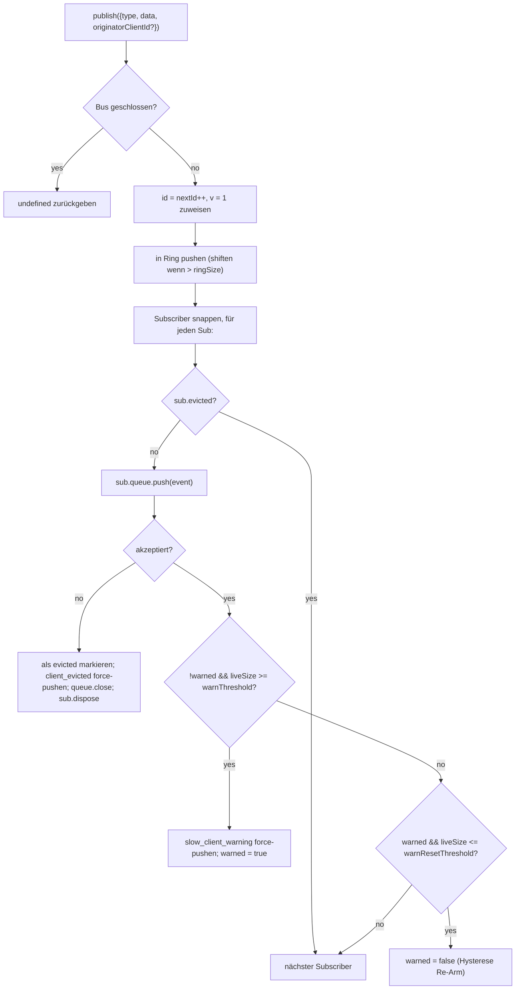

# SSE Event Bus & Backpressure

## Overview

`EventBus` (`packages/acp-bridge/src/eventBus.ts`) ist der sitzungsbezogene In-Memory-Pub/Sub, der die SSE-Route `GET /session/:id/events` des Daemons mit Daten versorgt. Er weist jedem Event eine monotone ID zu, puffert aktuelle Events in einem begrenzten Ring für das `Last-Event-ID`-Replay, verteilt veröffentlichte Events an alle Subscriber, wendet pro Subscriber einen Backpressure-Mechanismus an (Warnung bei 75 % Queue-Füllung, Eviction beim Erreichen des Limits) und emittiert zwei synthetische Terminal-Frames (`client_evicted`, `slow_client_warning`), die das SDK als First-Class-Events behandelt, der Bus sie jedoch **ohne `id`** markiert, damit sie keinen Slot in der sitzungsbezogenen Sequenz verbrauchen.

`EventBus` ist derzeit package-private für `acp-bridge` und wird von der Bridge-Factory über eine geschlossene Instanz pro Sitzung konsumiert. Ein zukünftiges Refactoring (in `eventBus.ts` Zeile 150–159 erwähnt) wird ihn zu einem Top-Level-Baustein machen, damit Channels, Dual-Output und zukünftige WebSocket-Transports über denselben Bus subscriben können, anstatt parallele Streams auszuführen.

## Responsibilities

- Zuweisung sitzungsbezogener monotoner Event-IDs beginnend bei 1.
- Puffern der letzten `ringSize` Events für das Replay bei Subscribe mit `lastEventId`.
- Verteilen veröffentlichter Events an ≤ `maxSubscribers` gleichzeitige Subscriber.
- Anwenden begrenzter Queues pro Subscriber; Overflow-Subscriber werden mit einem synthetischen `client_evicted`-Terminal-Frame verworfen.
- Emitieren von `slow_client_warning` einmal pro Overflow-Episode bei 75 % Queue-Füllung, mit 37,5 % Hysterese zur Vermeidung wiederholter Warnungen.
- Sofortiges Beenden von Subscriptions bei `AbortSignal.abort()`.
- Sauberes Schließen jedes Subscribers beim Schließen des Bus (z. B. Session-Teardown).
- `publish` wirft niemals eine Exception (der Contract lautet: "publish kann immer sicher aufgerufen werden").

## Architecture

| Constant                               | Value       | Purpose                                                                                            |
| -------------------------------------- | ----------- | -------------------------------------------------------------------------------------------------- |
| `EVENT_SCHEMA_VERSION`                 | `1`         | Wird auf jedes `BridgeEvent.v` gestempelt; wird bei brechenden Frame-Änderungen erhöht.                                |
| `DEFAULT_RING_SIZE`                    | `8000`      | Sitzungsbezogener Replay-Ring. Operator-Override via `--event-ring-size`.                                |
| `DEFAULT_MAX_QUEUED`                   | `256`       | Pro-Subscriber-Backlog-Limit.                                                                        |
| `DEFAULT_MAX_SUBSCRIBERS`              | `64`        | Sitzungsbezogenes Subscriber-Limit.                                                                        |
| `WARN_THRESHOLD_RATIO`                 | `0.75`      | `slow_client_warning`-Auslöseanteil von `maxQueued`.                                             |
| `WARN_RESET_RATIO`                     | `0.375`     | Hysterese-Re-Arm-Anteil.                                                                        |
| `MAX_EVENT_RING_SIZE` (in `bridge.ts`) | `1_000_000` | Weiche Obergrenze für `BridgeOptions.eventRingSize`, um Out-of-Memory-Fehler durch Tippfehler abzufangen. |

### `BridgeEvent`

```ts
interface BridgeEvent {
  id?: number; // monotonic per session; absent on synthetic terminal frames
  v: 1; // EVENT_SCHEMA_VERSION
  type: string; // one of the 47 known types or future-extensible
  data: unknown; // payload (typed per-type by the SDK; see 09-event-schema.md)
  _meta?: { serverTimestamp?: number; [key: string]: unknown }; // stamped by EventBus.publish
  originatorClientId?: string; // set when the event derives from a clientId-stamped request
}
```

### `SubscribeOptions`

```ts
interface SubscribeOptions {
  lastEventId?: number; // replay from after this id (Last-Event-ID resume)
  signal?: AbortSignal; // aborts the subscription promptly
  maxQueued?: number; // per-subscriber backlog cap; default 256
}
```

`subscribe()` gibt ein `AsyncIterable<BridgeEvent>` zurück. Die SSE-Route konsumiert es mit `for await`. Die Registrierung ist **synchron** – wenn `subscribe()` zurückkehrt, ist der Subscriber bereits angehängt, sodass ein `publish()`, das mit dem ersten `next()` des Consumers um die Wette läuft, dennoch zugestellt wird.

### `BoundedAsyncQueue`

Die pro-Subscriber-Queue. Zwei entscheidende Verhaltensweisen:

- **Das Live-Limit gilt nur für Live-Items.** Über `forcePush()` eingefügte Items tragen pro Entry ein `forced: true`-Tag und zählen nie zu `maxSize`. Dies ermöglicht dem `Last-Event-ID`-Replay-Pfad, Hunderte von historischen Frames per Force-Push in einen neuen Subscriber zu laden, ohne sofort das Live-Limit auszulösen und den gerade fortgesetzten Subscriber zu evicten.
- **`liveCount` wird als Feld gepflegt**, nicht aus der `forcedInBuf`-Position abgeleitet. Der frühere positionsbasierte Heuristik-Ansatz brach, als `slow_client_warning` begann, Force-Pushes mitten im Stream auszuführen (Warnungen gehen ans ENDE der Queue, nicht an den Anfang wie Replays). Pro-Entry-`forced`-Tags sind positionsunabhängig.

`push(value)` gibt `false` zurück (anstatt zu blockieren oder eine Exception zu werfen), wenn das Live-Backlog das Limit erreicht hat – der Bus nutzt dieses Signal, um den Subscriber zu evicten. `forcePush(value)` umgeht das Limit. `close({drain?: boolean})` leert standardmäßig ausstehende Items; der Abort-Pfad übergibt `drain: false`, um sie sofort zu verwerfen.

## Workflow

### Publish



`publish` wirft niemals. Das Schließen des Bus während des Publishens (der Shutdown-Pfad schließt sitzungsbezogene Busse vor dem Awaiting von `channel.kill()`) gibt `undefined` zurück, anstatt zu werfen, da der Agent in dem kleinen Zeitfenster zwischen Bus-Schließung und Channel-Kill weiterhin `sessionUpdate`-Benachrichtigungen emittieren könnte.

### Subscribe + replay (with ring-eviction detection)

```mermaid
sequenceDiagram
    autonumber
    participant SR as SSE-Route
    participant EB as EventBus
    participant Q as BoundedAsyncQueue

    SR->>EB: subscribe({lastEventId: 42, maxQueued: 256, signal})
    EB->>EB: ablehnen wenn subs.size >= maxSubscribers<br/>(wirft SubscriberLimitExceededError)
    EB->>Q: new BoundedAsyncQueue(256)
    EB->>EB: subs.add(sub)
    EB->>EB: epochReset = lastEventId >= nextId
    alt epochReset (alte Bus-Epoche)
        EB->>Q: forcePush state_resync_required<br/>{ reason: 'epoch_reset', lastDeliveredId: 42, earliestAvailableId: ring[0]?.id ?? nextId }
        Note over EB,Q: ID-loses Synthetik-Frame, Frame geht VOR das Replay.<br/>Replay scannt den gesamten aktuellen Ring.
    else gleiche Bus-Epoche
        EB->>EB: earliestInRing = ring[0]?.id
        opt earliestInRing > lastEventId + 1 (Lücke evicted)
            EB->>Q: forcePush state_resync_required<br/>{ reason: 'ring_evicted', lastDeliveredId: 42, earliestAvailableId: earliestInRing }
            Note over EB,Q: ID-loses Synthetik-Frame, Frame geht VOR das Replay.<br/>Stream bleibt offen; SDK-Reducer setzt awaitingResync.
        end
    end
    loop Ring-Scan
        EB->>EB: for e in ring where e.id > (epochReset ? 0 : 42)
        EB->>Q: forcePush(e)
    end
    EB->>EB: AbortSignal-Listener anhängen<br/>(onAbort → queue.close({drain:false}); dispose)
    EB-->>SR: AsyncIterable
    SR->>Q: next() in for-await-Loop
```

Wenn `subs.size >= maxSubscribers` zum Zeitpunkt des Subscribens, wird `SubscriberLimitExceededError` geworfen – die SSE-Route fängt dies ab und serialisiert ein synthetisches `stream_error`-Frame an den abgelehnten Client, damit dieser keinen stillen leeren Stream sieht. Die Rückgabe eines leeren Iterables würde Operateuren die Sichtbarkeit nehmen, dass "einige Clients Events erhalten, andere nicht" unter Last.

### Ring-eviction → `state_resync_required` (the recovery flow)

Wenn ein Consumer sich mit `Last-Event-ID: N` reconnectet und das früheste überlebende Event im Ring `id > N + 1` hat, wurden die Events in `[N+1, earliestInRing-1]` evicted, bevor der Consumer sich reconnectet hat. Das naive Replay würde still mit einem nicht zusammenhängenden Suffix erfolgreich sein, der SDK-Reducer würde weiterhin Deltas anwenden, als ob der Stream zusammenhängend wäre, und sein Zustand würde von der Wahrheit des Daemons abweichen – ohne ein Terminal-Signal.

Implementiert in `EventBus.subscribe()`:

1. Zuerst `opts.lastEventId >= this.nextId` prüfen. Wenn wahr, stammt der Client-Cursor aus einer älteren Bus-Epoche (Daemon-Restart / EventBus-Rekonstruktion), also emittiert der Bus `reason: 'epoch_reset'` und replayed den gesamten aktuellen Ring.
2. Andernfalls `earliestInRing = this.ring[0]?.id` berechnen.
3. Wenn `earliestInRing > opts.lastEventId + 1`, ein synthetisches Frame **vor** den Replay-Frames force-pushen:
   ```jsonc
   {
     "v": 1,
     "type": "state_resync_required",
     "data": {
       "reason": "ring_evicted",
       "lastDeliveredId": <opts.lastEventId>,
       "earliestAvailableId": <earliestInRing>
     }
   }
   ```
4. Danach die normale Replay-Schleife fortsetzen.

Kritische Contracts (und was das #4360-Review korrigiert hat):

- **Keine `id`** – dasselbe No-Slot-Muster wie bei `client_evicted`, sodass es keinen Slot in der sitzungsbezogenen monotonen Sequenz belegt, die andere Subscriber sehen.
- **Stream bleibt offen** – im Gegensatz zu `client_evicted` (wirklich terminal) ist `state_resync_required` auf Wiederherstellung ausgerichtet. Replay + Live-Frames fließen danach weiter.
- **Reducer überspringt Deltas automatisch** – die SDK-Seite setzt `awaitingResync = true` und wendet nur `state_resync_required`, die Terminal-Frames und Full-State-Snapshots an, bis der Consumer-Code `loadSession` aufruft und das Flag löscht. Siehe [`09-event-schema.md`](./09-event-schema.md) für `RESYNC_PASSTHROUGH_TYPES`.
- **Netzwerkfreundlich** – Frames bleiben auf der Wire, damit das SDK später bei Bedarf ein "was du verpasst hast"-Diff berechnen kann. Kein zusätzlicher Reconnect-Zyklus ist erforderlich.

### Eviction terminal flow

Wenn das Live-Backlog eines Subscribers `maxQueued` erreicht hat und der nächste `push()` `false` zurückgibt:

1. `sub.evicted = true` markieren.
2. `client_evicted`-Frame **ohne `id`** konstruieren – `{ v: 1, type: 'client_evicted', data: { reason: 'queue_overflow', droppedAfter: <last delivered id> } }`.
3. `queue.forcePush(evictionFrame)`, damit der Consumer-Iterator ein Terminal-Frame sieht.
4. `queue.close()`, damit die Iteration nach dem Terminal-Frame abgewickelt wird.
5. `sub.dispose()` aufrufen – entfernt aus `subs` und trennt den `AbortSignal`-Listener; ohne dieses Cleanup bleiben die Closures gestrandeter Consumer am Leben, bis der `AbortSignal` garbage collected wird.

### Abort flow

`AbortSignal.abort()` → `onAbort()`:

1. `queue.close({drain: false})` – gepufferte Items verwerfen, damit die SSE-Route nicht weiterhin Events an einen Socket serialisiert, auf dem niemand lauscht.
2. `dispose()` – idempotent durch ein `disposed`-Flag.

Bereits abgebrochene Signale zum Zeitpunkt des Subscribens rufen `onAbort()` synchron auf, bevor der Iterator zurückgegeben wird.

## State & Lifecycle

- `nextId` startet bei 1 und wird nur inkrementiert. Der `lastEventId`-Getter gibt `nextId - 1` zurück.
- `ring` ist begrenzt; Eviction-by-Shift ist O(n), sobald er voll ist. Bei `ringSize=8000` dauert das auf High-Volume-Sessions wenige Millisekunden – weit unter dem Pro-Frame-Latenzbudget. Ein Circular-Buffer-Refactoring wird aufgeschoben, bis Profiling es flaggt oder Operateure `--event-ring-size` um eine Größenordnung erhöhen.
- `close()` setzt `closed`, schließt die Queue jedes Subscribers und leert `subs`. Nachfolgende `publish()` / `subscribe()` sind No-Ops (`publish` gibt undefined zurück; `subscribe` gibt `emptyAsyncIterable` zurück).
- Jede Session besitzt einen `EventBus`. Das Schließen des Bus erfolgt vor `channel.kill()`, sodass laufende Publishes während des Shutdowns undefined zurückgeben, anstatt zu werfen.

## Dependencies

- Konsumiert von `packages/acp-bridge/src/bridge.ts` (`BridgeClient.sessionUpdate` / `BridgeClient.extNotification` → `events.publish(...)`).
- Konsumiert von `packages/cli/src/serve/routes/sse-events.ts` (SSE-Route-Handler → `events.subscribe(...)` und formatiert dann `BridgeEvent` zu SSE-Wire-Frames).
- CLI-Consumer importieren den Event Bus direkt von `@qwen-code/acp-bridge/eventBus`.
- SDK-Consumer: `packages/sdk-typescript/src/daemon/sse.ts` (`parseSseStream`), dann `asKnownDaemonEvent` (siehe [`09-event-schema.md`](./09-event-schema.md), [`13-sdk-daemon-client.md`](./13-sdk-daemon-client.md)).

## Configuration

- `--event-ring-size <n>` – sitzungsbezogene Ring-Tiefe; weich begrenzt auf `MAX_EVENT_RING_SIZE = 1_000_000`.
- Subscriber-`?maxQueued=N`-Query-Parameter auf `GET /session/:id/events`, Bereich `[16, 2048]`. SDK-Clients prüfen `caps.features.slow_client_warning` vor dem Opt-in.
- `BridgeOptions.eventRingSize` (überschreibt Daemon-Default für Embedded-Nutzung).
- Capability-Tags: `session_events`, `slow_client_warning`, `typed_event_schema`.

## Client Integration: `Last-Event-ID` Reconnect

### Wire Format

Jeder ID-tragende SSE-Frame, der von `GET /session/:id/events` emittiert wird, enthält eine `id:`-Zeile:

```
id: 42
event: session_update
data: {"id":42,"v":1,"type":"session_update","data":{...},"_meta":{"serverTimestamp":1719000000000}}

```

Synthetische/Terminal-Frames (`state_resync_required`, `replay_complete`, `client_evicted`, `slow_client_warning`, `stream_error`) werden **ohne** `id:`-Zeile emittiert – sie bringen die sitzungsbezogene monotone Sequenz nicht voran.

### Reconnect Protocol

Wenn ein Client nach einem Disconnect reconnectet, sendet er die letzte erfolgreich empfangene Event-ID als `Last-Event-ID`-HTTP-Header:

```
GET /session/:id/events HTTP/1.1
Last-Event-ID: 42
Accept: text/event-stream
```

Der `EventBus` des Daemons replayed alle Events aus dem Ring-Buffer, deren `id > Last-Event-ID` ist, und wechselt dann zur Live-Zustellung. Ein synthetisches `replay_complete`-Frame markiert die Grenze zwischen Replay und Live:

```jsonc
// no id: line — synthetic
{
  "v": 1,
  "type": "replay_complete",
  "data": { "replayedCount": 7, "lastReplayedEventId": 49 },
}
```

### Replay Behavior

| Scenario                                     | Behavior                                                                                                                                                        |
| -------------------------------------------- | --------------------------------------------------------------------------------------------------------------------------------------------------------------- |
| `Last-Event-ID` fehlt                       | Nur-Live-Stream; kein Replay. Abwärtskompatibel mit Pre-Resume-Clients.                                                                                       |
| `Last-Event-ID: 0`                           | Replay des gesamten Ring-Buffers von Anfang an (begrenzt durch `--event-ring-size`, Standard 8000).                                                                    |
| `Last-Event-ID: N` wobei `ring[0].id <= N+1` | Zusammenhängendes Replay der Events `id > N`, dann live.                                                                                                                |
| `Last-Event-ID: N` wobei `ring[0].id > N+1`  | Lücke erkannt – `state_resync_required` (`reason: 'ring_evicted'`) wird vor dem Replay des überlebenden Suffix emittiert. SDK muss `loadSession` aufrufen, um den vollständigen Zustand wiederherzustellen. |
| `Last-Event-ID: N` wobei `N >= nextId`       | Epoch-Reset (Daemon-Restart) – `state_resync_required` (`reason: 'epoch_reset'`) wird emittiert, dann vollständiges Ring-Replay.                                                |

### Validation Rules

Der Daemon parst `Last-Event-ID` strikt:

- Nur reine Dezimalziffern-Strings werden akzeptiert (z. B. `"42"`).
- Nicht-numerische, negative, Bruch- oder Overflow-Werte (über `Number.MAX_SAFE_INTEGER`) werden still abgelehnt – der Stream startet nur-live und der Daemon loggt einen Breadcrumb.
- Die `retry: 3000`-Direktive weist konforme `EventSource`-Implementierungen an, 3 Sekunden vor dem Reconnect zu warten.

### Backward Compatibility

Der `Last-Event-ID`-Mechanismus ist vollständig opt-in:

- Clients, die den Header nie senden, erhalten einen Nur-Live-Stream, der identisch mit dem Pre-Resume-Verhalten ist.
- Ältere SDK-Versionen, die keine Event-IDs tracken, funktionieren weiterhin.
- Das `replay_complete`-Frame ist synthetisch (keine `id:`), verwirrt also ID-unbewusste Consumer nicht.

### Browser `EventSource` Limitation

Die native Browser-`EventSource`-API trackt automatisch das letzte `id:`-Feld und sendet es beim Reconnect. Sie kann jedoch **keine** benutzerdefinierten Header setzen (z. B. `Authorization: Bearer`). Clients, die Authentifizierung benötigen, müssen rohes `fetch()` + manuelles SSE-Parsing verwenden (wie das TypeScript SDK es via `parseSseStream` tut) anstatt `EventSource`. Das `RestSseTransport` des SDK demonstriert dieses Muster – es setzt `Last-Event-ID` als expliziten HTTP-Header beim `fetch()`-Aufruf.

## Caveats & Known Limits

- **Synthetische Frames haben keine `id`.** SDK-Consumer, die das `Last-Event-ID`-Resume nutzen, zeichnen nur Frames mit IDs auf; `slow_client_warning`, `client_evicted`, `state_resync_required` und `replay_complete` bringen den Cursor nicht voran und verbrauchen keine sitzungsbezogenen Sequenznummern. Wenn zwei ID-tragende Live-Frames eine echte Lücke haben, behandle sie über den Ring-Eviction-/Epoch-Reset-Resync-Pfad, anstatt sie als privates synthetisches Frame zu behandeln.
- `client_evicted` ist **pro Subscriber**, nicht pro Session. Derselbe Client kann sich erneut reconnecten.
- Der `BoundedAsyncQueue`-Iterator ist **nicht sicher für gleichzeitige Treiber** – zwei gleichzeitige `.next()`-Aufrufe würden um dasselbe Event konkurrieren. Die Daemon-Nutzung ist sequenziell (`for await ... of` im SSE-Route-Handler), daher ist dies in der Produktion sicher.
- Der Bus ist derzeit package-private; Channels und die Web-UI müssen über die HTTP-SSE-Route des Daemons subscriben, nicht indem sie direkt in den Bus eingreifen. Stage 1.5 wird dies aufheben.

## References

- `packages/acp-bridge/src/eventBus.ts` (gesamte Datei)
- `packages/acp-bridge/src/bridge.ts` (Publish-Sites, insb. `BridgeClient.sessionUpdate` und die F3-Permission-Events)
- `packages/cli/src/serve/routes/sse-events.ts` (SSE-Route-Handler – formatiert `BridgeEvent` zu Wire-SSE)
- `packages/sdk-typescript/src/daemon/sse.ts` (SSE-Wire-Parser auf Client-Seite)
- Wire-Referenz: [`../qwen-serve-protocol.md`](../qwen-serve-protocol.md) (der `Last-Event-ID`-Reconnect-Contract).