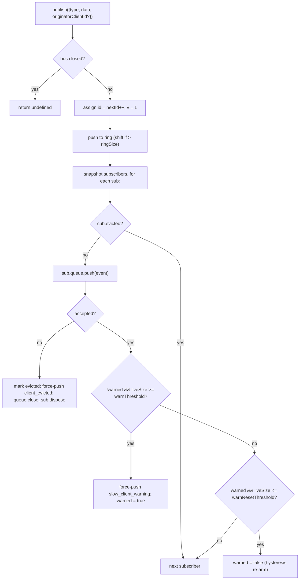

# SSE Event Bus & Backpressure

## Übersicht

`EventBus` (`packages/acp-bridge/src/eventBus.ts`) ist der pro-Sitzung arbeitende In-Memory-Pub/Sub, der die SSE-Route `GET /session/:id/events` des Daemons speist. Es weist jedem Ereignis eine monotone ID zu, puffert die letzten Ereignisse in einem begrenzten Ring für `Last-Event-ID`-Wiederholungen, verteilt veröffentlichte Ereignisse an alle Abonnenten, wendet pro-Abonnent Backpressure an (Warnung bei 75% Auslastung der Warteschlange, Räumung bei Erreichen des Limits) und gibt zwei synthetische Terminal-Frames (`client_evicted`, `slow_client_warning`) aus, die vom SDK als erstklassige Ereignisse behandelt werden, die der Bus jedoch **ohne `id`** markiert, sodass sie keinen Slot in der pro-Sitzung-Sequenz belegen.

`EventBus` ist derzeit paket-privat für `acp-bridge` und wird von der Bridge-Factory über eine geschlossene Instanz pro Sitzung genutzt. Ein zukünftiges Refactoring (in Zeile 150–159 von `eventBus.ts` angekündigt) wird es zu einem grundlegenden Baustein erheben, sodass Kanäle, Dual-Output und zukünftige WebSocket-Transporte denselben Bus abonnieren können, anstatt parallele Streams zu betreiben.

## Verantwortlichkeiten

- Zuweisung monotoner Ereignis-IDs pro Sitzung, beginnend bei 1.
- Puffern der letzten `ringSize` Ereignisse für die Wiederholung beim Abonnieren mit `lastEventId`.
- Verteilen veröffentlichter Ereignisse an ≤ `maxSubscribers` gleichzeitige Abonnenten.
- Anwenden begrenzter Warteschlangen pro Abonnent; Abonnenten mit Überlauf werden durch einen synthetischen `client_evicted`-Terminal-Frame entfernt.
- Ausgabe von `slow_client_warning` einmal pro Überlauf-Episode bei 75% Auslastung der Warteschlange, mit 37,5% Hysterese, um wiederholte Warnungen zu vermeiden.
- Schnelles Beenden von Abonnements bei `AbortSignal.abort()`.
- Sauberes Schließen aller Abonnenten beim Schließen des Busses (z. B. Sitzungsabbau).
- Kein Werfen von Ausnahmen durch `publish` (der Vertrag lautet: „Publish ist immer sicher aufzurufen“).

## Architektur

| Konstante                             | Wert        | Zweck                                                                                             |
| ------------------------------------- | ----------- | ------------------------------------------------------------------------------------------------- |
| `EVENT_SCHEMA_VERSION`                | `1`         | Wird auf jedes `BridgeEvent.v` gestempelt; bei Breaking-Änderungen an Frames erhöht.              |
| `DEFAULT_RING_SIZE`                   | `8000`      | Wiederholungsring pro Sitzung. Operator-Überschreibung über `--event-ring-size`.                  |
| `DEFAULT_MAX_QUEUED`                  | `256`       | Maximaler Rückstand pro Abonnent.                                                                 |
| `DEFAULT_MAX_SUBSCRIBERS`             | `64`        | Maximalanzahl an Abonnenten pro Sitzung.                                                          |
| `WARN_THRESHOLD_RATIO`                | `0.75`      | `slow_client_warning`-Auslöser als Bruchteil von `maxQueued`.                                     |
| `WARN_RESET_RATIO`                    | `0.375`     | Hysterese-Wiederaktivierungs-Bruchteil.                                                           |
| `MAX_EVENT_RING_SIZE` (in `bridge.ts`) | `1_000_000` | Weiche Obergrenze für `BridgeOptions.eventRingSize`, um Out-of-Memory-Fehler durch Tippfehler zu verhindern. |

### `BridgeEvent`

```ts
interface BridgeEvent {
  id?: number; // monoton pro Sitzung; fehlt bei synthetischen Terminal-Frames
  v: 1; // EVENT_SCHEMA_VERSION
  type: string; // einer der 43 bekannten Typen oder zukünftig erweiterbar
  data: unknown; // Nutzlast (typisiert pro Typ durch das SDK; siehe 09-event-schema.md)
  originatorClientId?: string; // gesetzt, wenn das Ereignis von einer mit clientId gestempelten Anfrage stammt
}
```

### `SubscribeOptions`

```ts
interface SubscribeOptions {
  lastEventId?: number; // Wiederholung ab nach dieser ID (Last-Event-ID-Fortsetzung)
  signal?: AbortSignal; // bricht das Abonnement umgehend ab
  maxQueued?: number; // maximaler Rückstand pro Abonnent; Standard 256
}
```

`subscribe()` gibt ein `AsyncIterable<BridgeEvent>` zurück. Die SSE-Route konsumiert es mit `for await`. Die Registrierung ist **synchron** – zum Zeitpunkt der Rückkehr von `subscribe()` ist der Abonnent bereits angeschlossen, sodass ein `publish()`, das mit dem ersten `next()` des Konsumenten konkurriert, dennoch zugestellt wird.

### `BoundedAsyncQueue`

Die warteschlange pro Abonnent. Zwei Schlüsselverhalten:

- **Das Live-Limit gilt nur für Live-Elemente.** Über `forcePush()` eingefügte Elemente tragen ein `forced: true`-Tag pro Eintrag und zählen nie zu `maxSize`. Dadurch kann der `Last-Event-ID`-Wiederholungspfad hunderte historische Frames in einen frischen Abonnenten mittels force-push einfügen, ohne sofort das Live-Limit zu erreichen und den gerade fortgesetzten Abonnenten zu entfernen.
- **`liveCount` wird als Feld geführt**, nicht aus der Position von `forcedInBuf` abgeleitet. Die frühere positionsbasierte Heuristik brach, als `slow_client_warning` begann, mittendrin force-pushes durchzuführen (Warnungen gehen ans ENDE der Warteschlange, nicht wie Wiederholungen an den Anfang). Die per-Eintrag `forced`-Tags sind positionsunabhängig.

`push(value)` gibt `false` zurück (anstatt zu blockieren oder zu werfen), wenn der Live-Rückstand das Limit erreicht hat – der Bus nutzt dieses Signal, um den Abonnenten zu entfernen. `forcePush(value)` umgeht das Limit. `close({drain?: boolean})` leert standardmäßig ausstehende Elemente; der Abbruch-Pfad übergibt `drain: false`, um sie sofort zu verwerfen.
## Workflow

### Veröffentlichen



`publish` wirft niemals einen Fehler. Wenn der Bus während des Veröffentlichens geschlossen wird (der Shutdown-Pfad schließt die Sitzungsbusse, bevor er auf `channel.kill()` wartet), wird `undefined` zurückgegeben – kein Fehlerwurf, da der Agent im kleinen Zeitfenster zwischen Bus-Schließen und Channel-Kill noch `sessionUpdate`-Benachrichtigungen ausgeben kann.

### Abonnieren + Wiedergabe (mit Ring-Verdrängungserkennung)

```mermaid
sequenceDiagram
    autonumber
    participant SR as SSE route
    participant EB as EventBus
    participant Q as BoundedAsyncQueue

    SR->>EB: subscribe({lastEventId: 42, maxQueued: 256, signal})
    EB->>EB: refuse if subs.size >= maxSubscribers<br/>(throws SubscriberLimitExceededError)
    EB->>Q: new BoundedAsyncQueue(256)
    EB->>EB: subs.add(sub)
    EB->>EB: epochReset = lastEventId >= nextId
    alt epochReset (old bus epoch)
        EB->>Q: forcePush state_resync_required<br/>{ reason: 'epoch_reset', lastDeliveredId: 42, earliestAvailableId: ring[0]?.id ?? nextId }
        Note over EB,Q: id-less synthetic, frame goes BEFORE replay.<br/>Replay scans the whole current ring.
    else same bus epoch
        EB->>EB: earliestInRing = ring[0]?.id
        opt earliestInRing > lastEventId + 1 (gap evicted)
            EB->>Q: forcePush state_resync_required<br/>{ reason: 'ring_evicted', lastDeliveredId: 42, earliestAvailableId: earliestInRing }
            Note over EB,Q: id-less synthetic, frame goes BEFORE replay.<br/>Stream stays open; SDK reducer flips awaitingResync.
        end
    end
    loop ring scan
        EB->>EB: for e in ring where e.id > (epochReset ? 0 : 42)
        EB->>Q: forcePush(e)
    end
    EB->>EB: attach AbortSignal listener<br/>(onAbort → queue.close({drain:false}); dispose)
    EB-->>SR: AsyncIterable
    SR->>Q: next() in for-await loop
```

Wenn zum Zeitpunkt des Abonnierens `subs.size >= maxSubscribers` ist, wird `SubscriberLimitExceededError` geworfen – die SSE-Route fängt diesen ab und serialisiert einen synthetischen `stream_error`-Frame für den abgelehnten Client, sodass dieser keinen stillen leeren Stream sieht. Die Rückgabe einer leeren iterierbaren Menge würde den Betreibern die Sichtbarkeit nehmen, dass „manche Clients Ereignisse erhalten, manche nicht“ unter Last.

### Ring-Verdrängung → `state_resync_required` (der Wiederherstellungsablauf)

Wenn ein Verbraucher mit `Last-Event-ID: N` erneut verbindet und das früheste überlebende Ereignis im Ring `id > N + 1` hat, wurden die Ereignisse in `[N+1, earliestInRing-1]` verdrängt, bevor der Verbraucher die Verbindung wiederherstellte. Die naive Wiedergabe würde stillschweigend mit einem nicht zusammenhängenden Suffix erfolgreich sein, der SDK-Reduzierer würde weiterhin Deltas anwenden, als wäre der Stream zusammenhängend, und sein Zustand würde von der Wahrheit des Daemons abweichen – ohne terminales Signal.

Implementiert in `EventBus.subscribe()`:

1. Zuerst wird geprüft: `opts.lastEventId >= this.nextId`. Falls zutreffend, stammt der Client-Cursor
   aus einer älteren Bus-Epoche (Daemon-Neustart / EventBus-Neuerstellung), daher gibt der
   Bus `reason: 'epoch_reset'` aus und spielt den gesamten aktuellen Ring erneut ab.
2. Andernfalls wird `earliestInRing = this.ring[0]?.id` berechnet.
3. Wenn `earliestInRing > opts.lastEventId + 1`, wird **vor** den Wiedergabe-Frames ein synthetischer Frame per forcePush eingefügt:
   ```jsonc
   {
     "v": 1,
     "type": "state_resync_required",
     "data": {
       "reason": "ring_evicted",
       "lastDeliveredId": <opts.lastEventId>,
       "earliestAvailableId": <earliestInRing>
     }
   }
   ```
4. Danach wird die normale Wiedergabeschleife fortgesetzt.

Kritische Verträge (und was die Überprüfung in #4360 korrigiert hat):

- **Keine `id`** – dasselbe „kein Slot“-Muster wie bei `client_evicted`, belegt also keinen Slot in der sitzungsspezifischen monotonen Sequenz, die andere Abonnenten beobachten.
- **Stream bleibt offen** – anders als `client_evicted` (echt terminal) ist `state_resync_required` wiederherstellungsorientiert. Wiedergabe- und Live-Frames fließen danach weiter.
- **Reduzierer überspringt Deltas automatisch** – die SDK-Seite setzt `awaitingResync = true` und wendet nur `state_resync_required`, die terminalen Frames und Vollzustands-Snapshots an, bis der Consumer-Code `loadSession` aufruft und das Flag löscht. Siehe [`09-event-schema.md`](./09-event-schema.md) für `RESYNC_PASSTHROUGH_TYPES`.
- **Netzwerkfreundlich** – Frames bleiben auf der Leitung, sodass das SDK später eine „was du verpasst hast“-Differenz berechnen kann, falls gewünscht. Kein zusätzlicher Wiederverbindungszyklus erforderlich.
### Eviction-Terminal-Fluss

Wenn der Live-Backlog eines Abonnenten `maxQueued` erreicht hat und der nächste Aufruf von `push()` `false` zurückgibt:

1. Setze `sub.evicted = true`.
2. Erstelle einen `client_evicted`-Frame **ohne `id`** — `{ v: 1, type: 'client_evicted', data: { reason: 'queue_overflow', droppedAfter: <letzte ausgelieferte id> } }`.
3. `queue.forcePush(evictionFrame)`, sodass der Consumer-Iterator einen terminalen Frame sieht.
4. `queue.close()`, sodass die Iteration nach dem terminalen Frame beendet wird.
5. Rufe `sub.dispose()` auf — entfernt aus `subs` und löst den `AbortSignal`-Listener; ohne diese Bereinigung bleiben die Closures von blockierten Consumern aktiv, bis der `AbortSignal`-Garbage-Collection erfolgt.

### Abort-Fluss

`AbortSignal.abort()` → `onAbort()`:

1. `queue.close({drain: false})` — verwirf gepufferte Einträge, damit die SSE-Route keine Events serialisiert, die keiner mehr hört.
2. `dispose()` — idempotent durch ein `disposed`-Flag.

Bereits abgebrochene Signale rufen zum Zeitpunkt des Abonnierens `onAbort()` synchron auf, bevor der Iterator zurückgegeben wird.

## Zustand & Lebenszyklus

- `nextId` beginnt bei 1 und wird nur erhöht. Der Getter `lastEventId` gibt `nextId - 1` zurück.
- `ring` ist begrenzt; Eviction durch Verschieben ist O(n), sobald der Ring voll ist. Bei `ringSize=8000` liegt der Aufwand bei hochfrequenten Sessions im niedrigen Millisekundenbereich – weit unter dem Budget der Frame-Latenz. Eine Umstellung auf einen Ringpuffer wird zurückgestellt, bis Profiling es anzeigt oder Operatoren `--event-ring-size` um eine Größenordnung erhöhen.
- `close()` setzt `closed`, schließt die Queue jedes Abonnenten und löscht `subs`. Nachfolgende Aufrufe von `publish()` / `subscribe()` sind No-Ops (`publish` gibt `undefined` zurück; `subscribe` gibt `emptyAsyncIterable` zurück).
- Jede Session besitzt einen eigenen `EventBus`. Das Schließen des Busses erfolgt vor `channel.kill()`, sodass während des Herunterfahrens in Flug befindliche Publikationen `undefined` zurückgeben, anstatt einen Fehler zu werfen.

## Abhängigkeiten

- Wird verwendet von `packages/acp-bridge/src/bridge.ts` (`BridgeClient.sessionUpdate` / `BridgeClient.extNotification` → `events.publish(...)`).
- Wird verwendet von `packages/cli/src/serve/server.ts` (SSE-Route-Handler → `events.subscribe(...)`, formatiert dann `BridgeEvent` zu SSE-Wire-Frames).
- Re-Export-Shim: `packages/cli/src/serve/event-bus.ts` → `@qwen-code/acp-bridge/eventBus`.
- SDK-Consumer: `packages/sdk-typescript/src/daemon/sse.ts` (`parseSseStream`), dann `asKnownDaemonEvent` (siehe [`09-event-schema.md`](./09-event-schema.md), [`13-sdk-daemon-client.md`](./13-sdk-daemon-client.md)).

## Konfiguration

- `--event-ring-size <n>` — Ringtiefe pro Session; soft gedeckelt bei `MAX_EVENT_RING_SIZE = 1_000_000`.
- Abonnenten-`?maxQueued=N`-Query-Parameter auf `GET /session/:id/events`, Bereich `[16, 2048]`. SDK-Clients prüfen `caps.features.slow_client_warning` vor dem Opt-in.
- `BridgeOptions.eventRingSize` (überschreibt den Daemon-Standard für eingebettete Nutzung).
- Capability-Tags: `session_events`, `slow_client_warning`, `typed_event_schema`.

## Hinweise & bekannte Einschränkungen

- **Synthtische Frames haben keine `id`.** SDK-Consumer, die `Last-Event-ID` zum Wiederaufnehmen verwenden, protokollieren nur Frames mit IDs; `slow_client_warning`, `client_evicted`, `state_resync_required` und `replay_complete` bewegen den Cursor nicht und verbrauchen keine Sequenznummern der Session. Wenn zwei ID-tragende Live-Frames eine tatsächliche Lücke aufweisen, wird dies über den Ring-Eviction-/Epoch-Reset-Resync-Pfad behandelt und nicht als privater synthetischer Frame.
- `client_evicted` ist **pro Abonnent**, nicht pro Session. Derselbe Client kann sich erneut verbinden.
- Der Iterator von `BoundedAsyncQueue` ist **nicht sicher für gleichzeitige Treiber** – zwei gleichzeitige `.next()`-Aufrufe würden um dasselbe Event konkurrieren. Die Daemon-Nutzung ist sequenziell (`for await ... of` im SSE-Route-Handler), daher ist dies in der Produktion sicher.
- Der Bus ist derzeit package-private; Kanäle und die Web-UI müssen sich über die HTTP-SSE-Route des Daemons abonnieren, nicht direkt auf den Bus zugreifen. Stufe 1.5 wird dies aufheben.

## Referenzen

- `packages/acp-bridge/src/eventBus.ts` (gesamte Datei)
- `packages/acp-bridge/src/bridge.ts` (Publish-Stellen, insb. `BridgeClient.sessionUpdate` und die F3-Berechtigungs-Events)
- `packages/cli/src/serve/server.ts` (SSE-Route-Handler – formatiert `BridgeEvent` zu SSE-Wire-Frames)
- `packages/sdk-typescript/src/daemon/sse.ts` (SSE-Wire-Parser auf Client-Seite)
- Wire-Referenz: [`../qwen-serve-protocol.md`](../qwen-serve-protocol.md) (Der `Last-Event-ID`-Wiederaufnahme-Vertrag).
