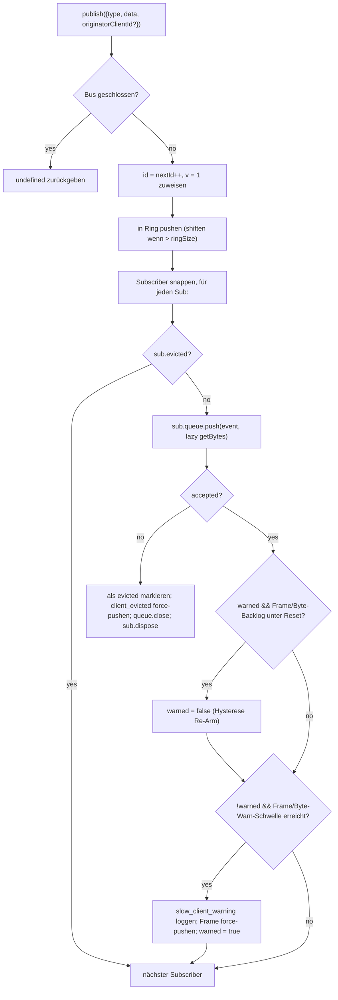

# SSE Event Bus & Backpressure

## Overview

`EventBus` (`packages/acp-bridge/src/eventBus.ts`) ist der sitzungsbezogene In-Memory-Pub/Sub, der die SSE-Route `GET /session/:id/events` des Daemons speist. Er weist jedem Event eine monotone ID zu, puffert aktuelle Events in einem begrenzten Ring für das `Last-Event-ID`-Replay, verteilt veröffentlichte Events an alle Subscriber, wendet pro Subscriber Backpressure an (Warnung bei 75 % Live-Queue-Füllung / serialisierter Byte-Füllung, Eviction beim Erreichen des Limits) und emittiert subscriber-lokale synthetische Frames (`client_evicted`, `slow_client_warning`), die das SDK als erstklassige Events behandelt, die der Bus jedoch **ohne `id`** markiert, damit sie keinen Slot in der sitzungsbezogenen Sequenz verbrauchen.

`EventBus` ist derzeit package-private in `acp-bridge` und wird von der Bridge-Factory über eine Closure-Instanz pro Sitzung konsumiert. Ein zukünftiges Refactoring (erwähnt in Zeile 150–159 von `eventBus.ts`) wird ihn zu einem Top-Level-Baustein machen, damit Channels, Dual-Output und zukünftige WebSocket-Transports über denselben Bus subscriben können, anstatt parallele Streams auszuführen.

## Responsibilities

- Zuweisung sitzungsbezogener monotoner Event-IDs beginnend bei 1.
- Puffern der letzten `ringSize` Events für das Replay bei Subscribe mit `lastEventId`.
- Verteilen veröffentlichter Events an ≤ `maxSubscribers` gleichzeitige Subscriber.
- Anwenden begrenzter Queues pro Subscriber; Eviction von Subscribern, die das Live-Frame-Limit oder das Live-Serialized-Byte-Limit überschreiten, mittels eines synthetischen `client_evicted`-Terminal-Frames.
- Emitieren von `slow_client_warning` einmal pro Overflow-Episode bei 75 % Live-Frame-Füllung oder Live-Serialized-Byte-Füllung, mit einer 37,5 % Hysterese zur Vermeidung wiederholter Warnungen.
- Sofortiges Beenden von Subscriptions bei `AbortSignal.abort()`.
- Sauberes Schließen jedes Subscribers beim Schließen des Bus (z. B. Session-Teardown).
- `publish` wirft niemals eine Exception (der Contract lautet: "publish kann immer sicher aufgerufen werden").

## Architecture

| Constant                               | Value       | Purpose                                                                                            |
| -------------------------------------- | ----------- | -------------------------------------------------------------------------------------------------- |
| `EVENT_SCHEMA_VERSION`                 | `1`         | Wird auf jedes `BridgeEvent.v` gestempelt; wird bei brechenden Frame-Änderungen erhöht.            |
| `DEFAULT_RING_SIZE`                    | `8000`      | Sitzungsbezogener Replay-Ring. Operator-Override via `--event-ring-size`.                          |
| `DEFAULT_MAX_QUEUED`                   | `256`       | Limit für das Live-Frame-Backlog pro Subscriber.                                                   |
| `DEFAULT_MAX_QUEUED_BYTES`             | `2 MiB`     | Limit für das Live-Serialized-Byte-Backlog pro Subscriber.                                         |
| `DEFAULT_MAX_SUBSCRIBERS`              | `64`        | Limit für Subscriber pro Sitzung.                                                                  |
| `WARN_THRESHOLD_RATIO`                 | `0.75`      | Auslöseanteil für `slow_client_warning` von `maxQueued` oder `maxQueuedBytes`.                     |
| `WARN_RESET_RATIO`                     | `0.375`     | Hysterese-Re-Arm-Anteil.                                                                         |
| `MAX_EVENT_RING_SIZE` (in `bridge.ts`) | `1_000_000` | Softes oberes Limit für `BridgeOptions.eventRingSize`, um Out-of-Memory-Fehler durch Tippfehler abzufangen. |

### `BridgeEvent`

```ts
interface BridgeEvent {
  id?: number; // monotonic per session; absent on synthetic terminal frames
  v: 1; // EVENT_SCHEMA_VERSION
  type: string; // one of the 53 known types or future-extensible
  data: unknown; // payload (typed per-type by the SDK; see 09-event-schema.md)
  _meta?: { serverTimestamp?: number; [key: string]: unknown }; // stamped by EventBus.publish
  originatorClientId?: string; // set when the event derives from a clientId-stamped request
}
```

### `SubscribeOptions`

```ts
interface SubscribeOptions {
  lastEventId?: number; // replay from after this id (Last-Event-ID resume)
  signal?: AbortSignal; // aborts the subscription promptly
  maxQueued?: number; // per-subscriber live frame backlog cap; default 256
}
```

`subscribe()` gibt ein `AsyncIterable<BridgeEvent>` zurück. Die SSE-Route konsumiert es mit `for await`. Die Registrierung ist **synchron** – wenn `subscribe()` zurückkehrt, ist der Subscriber bereits angehängt, sodass ein `publish()`, das mit dem ersten `next()` des Consumers um die Wette läuft, dennoch zugestellt wird.

Das Live-Byte-Limit ist eine Bus-Level-Konstruktoroption nur für Tests / eingebettete Caller. Sie wird nicht als HTTP-Query-Parameter, SDK-Option, CLI-Flag oder Capability exponiert, da Clients das Speicherbudget des Daemons nicht erhöhen dürfen.

### `BoundedAsyncQueue`

Die pro-Subscriber-Queue. Zwei entscheidende Verhaltensweisen:

- **Live-Limits gelten nur für Live-Items.** Über `forcePush()` eingefügte Items tragen pro Entry ein `forced: true`-Tag und zählen niemals zu `liveCount` oder `liveBytes`. Dies ermöglicht dem `Last-Event-ID`-Replay-Pfad, Hunderte von historischen Frames in einen frischen Subscriber zu force-pushen, ohne sofort die Live-Limits auszulösen und den gerade fortgesetzten Subscriber zu evicten.
- **`liveCount` und `liveBytes` werden als Felder gepflegt**, nicht aus der `forcedInBuf`-Position abgeleitet. Die frühere positionsbasierte Heuristik brach, als `slow_client_warning` begann, mitten im Stream zu force-pushen (Warnungen gehen ans ENDE der Queue, nicht an den Anfang wie Replays). Pro-Entry `forced`-Tags sind positionsunabhängig; Live-Einträge speichern auch ihre geschätzten serialisierten Bytes, sodass das Entleeren der Queue `liveBytes` dekrementiert.
- **Serialisierte Bytes werden lazy geschätzt.** `push()` berechnet `Buffer.byteLength(JSON.stringify(event), 'utf8')` nur, wenn das Event gepuffert wird. Wenn ein Subscriber bereits auf `next()` wartet, wird das Event direkt zugestellt und keine Byte-Schätzung berechnet. Wenn die Serialisierung fehlschlägt, emittiert der Daemon eine Best-Effort-Stderr-Diagnose, und dieses Event überspringt die Byte-Abrechnung, während der Never-Throws-Contract von `publish()` gewahrt bleibt; es zählt dennoch zum Live-Frame-Limit.

`push(value, getBytes)` gibt ein accepted/rejected-Ergebnis zurück, anstatt zu blockieren oder eine Exception zu werfen. Frame-Overflow rejected mit `queue_overflow`; Byte-Overflow rejected mit `queue_bytes_overflow`. Ein einzelnes übergroßes Event ist erlaubt, wenn die Live-Queue leer ist, aber ein zweites Live-Event dahinter evictet den Subscriber. `forcePush(value)` umgeht beide Limits. `close({drain?: boolean})` entleert standardmäßig ausstehende Items; der Abort-Pfad übergibt `drain: false`, um sie sofort zu verwerfen.

## Workflow

### Publish


```mermaid
flowchart TD
    P["publish({type, data, originatorClientId?})"] --> C{"Bus geschlossen?"}
    C -->|yes| RU["undefined zurückgeben"]
    C -->|no| AID["id = nextId++, v = 1 zuweisen"]
    AID --> PR["in Ring pushen (shiften wenn > ringSize)"]
    PR --> FAN["Subscriber snappen, für jeden Sub:"]
    FAN --> EVCK{"sub.evicted?"}
    EVCK -->|yes| NEXT[nächster Subscriber]
    EVCK -->|no| PUSH["sub.queue.push(event, lazy getBytes)"]
    PUSH --> OK{"accepted?"}
    OK -->|no| EVICT["als evicted markieren; client_evicted force-pushen; queue.close; sub.dispose"]
    OK -->|yes| RES{"warned && Frame/Byte-Backlog unter Reset?"}
    RES -->|yes| RA["warned = false (Hysterese Re-Arm)"]
    RES -->|no| WARN{"!warned && Frame/Byte-Warn-Schwelle erreicht?"}
    RA --> WARN
    WARN -->|yes| FW["slow_client_warning loggen; Frame force-pushen; warned = true"]
    WARN -->|no| NEXT
    FW --> NEXT
```

`publish` wirft niemals. Das Schließen des Bus mitten im Publish (der Shutdown-Pfad schließt sitzungsbezogene Busse vor dem Awaiting von `channel.kill()`) gibt `undefined` zurück, anstatt zu werfen, da der Agent in dem kleinen Zeitfenster zwischen Bus-Schließung und Channel-Kill noch `sessionUpdate`-Benachrichtigungen emittieren könnte.

### Subscribe + replay (with ring-eviction detection)

```mermaid
sequenceDiagram
    autonumber
    participant SR as SSE-Route
    participant EB as EventBus
    participant Q as BoundedAsyncQueue

    SR->>EB: subscribe({lastEventId: 42, maxQueued: 256, signal})
    EB->>EB: ablehnen wenn subs.size >= maxSubscribers<br/>(wirft SubscriberLimitExceededError)
    EB->>Q: new BoundedAsyncQueue(maxQueued, maxQueuedBytes)
    EB->>EB: subs.add(sub)
    EB->>EB: epochReset = lastEventId >= nextId
    alt epochReset (alte Bus-Epoche)
        EB->>Q: forcePush state_resync_required<br/>{ reason: 'epoch_reset', lastDeliveredId: 42, earliestAvailableId: ring[0]?.id ?? nextId }
        Note over EB,Q: ID-loses Synthetik-Frame, Frame geht VOR das Replay.<br/>Replay scannt den gesamten aktuellen Ring.
    else gleiche Bus-Epoche
        EB->>EB: earliestInRing = ring[0]?.id
        opt earliestInRing > lastEventId + 1 (Lücke evictet)
            EB->>Q: forcePush state_resync_required<br/>{ reason: 'ring_evicted', lastDeliveredId: 42, earliestAvailableId: earliestInRing }
            Note over EB,Q: ID-loses Synthetik-Frame, Frame geht VOR das Replay.<br/>Stream bleibt offen; SDK-Reducer setzt awaitingResync.
        end
    end
    loop Ring-Scan
        EB->>EB: for e in ring where e.id > (epochReset ? 0 : 42)
        EB->>Q: forcePush(e)
    end
    EB->>EB: AbortSignal-Listener anhängen<br/>(onAbort → queue.close({drain:false}); dispose)
    EB-->>SR: AsyncIterable
    SR->>Q: next() in for-await-Loop
```

Wenn `subs.size >= maxSubscribers` zum Zeitpunkt des Subscribes, wird `SubscriberLimitExceededError` geworfen – die SSE-Route fängt ihn ab und serialisiert ein synthetisches `stream_error`-Frame an den abgelehnten Client, damit dieser keinen stillen leeren Stream sieht. Stattdessen ein leeres Iterable zurückzugeben, würde Operateuren unter Last die Sichtbarkeit nehmen, dass "einige Clients Events erhalten, andere nicht".

### Ring-eviction → `state_resync_required` (the recovery flow)

Wenn ein Consumer sich mit `Last-Event-ID: N` erneut verbindet und das früheste überlebende Event im Rings `id > N + 1` hat, wurden die Events in `[N+1, earliestInRing-1]` evictet, bevor der Consumer sich erneut verbunden hat. Ein naives Replay würde stillschweigend mit einem nicht zusammenhängenden Suffix erfolgreich sein, der SDK-Reducer würde weiterhin Deltas anwenden, als ob der Stream zusammenhängend wäre, und sein Zustand würde von der Wahrheit des Daemons abweichen – ohne ein Terminal-Signal.

Implementiert in `EventBus.subscribe()`:

1. Zuerst `opts.lastEventId >= this.nextId` prüfen. Wenn wahr, stammt der Client-Cursor aus einer älteren Bus-Epoche (Daemon-Neustart / EventBus-Rekonstruktion), sodass der Bus `reason: 'epoch_reset'` emittiert und den gesamten aktuellen Ring replayt.
2. Andernfalls `earliestInRing = this.ring[0]?.id` berechnen.
3. Wenn `earliestInRing > opts.lastEventId + 1`, ein synthetisches Frame **vor** den Replay-Frames force-pushen:
   ```jsonc
   {
     "v": 1,
     "type": "state_resync_required",
     "data": {
       "reason": "ring_evicted",
       "lastDeliveredId": <opts.lastEventId>,
       "earliestAvailableId": <earliestInRing>
     }
   }
   ```
4. Danach die normale Replay-Loop fortsetzen.

Kritische Contracts (und was das #4360-Review korrigiert hat):

- **Keine `id`** – dasselbe No-Slot-Muster wie bei `client_evicted`, sodass es keinen Slot in der sitzungsbezogenen monotonen Sequenz belegt, die andere Subscriber beobachten.
- **Stream bleibt offen** – im Gegensatz zu `client_evicted` (echt terminal), ist `state_resync_required` auf Wiederherstellung ausgerichtet. Replay + Live-Frames fließen danach weiter.
- **Reducer überspringt Deltas automatisch** – die SDK-Seite setzt `awaitingResync = true` und wendet nur `state_resync_required`, die Terminal-Frames und Full-State-Snapshots an, bis der Consumer-Code `loadSession` aufruft und das Flag löscht. Siehe [`09-event-schema.md`](./09-event-schema.md) für `RESYNC_PASSTHROUGH_TYPES`.
- **Netzwerkfreundlich** – Frames bleiben auf der Leitung, sodass das SDK später bei Bedarf ein "Was du verpasst hast"-Diff berechnen kann. Kein zusätzlicher Reconnect-Zyklus ist erforderlich.

### Eviction terminal flow

Wenn das Live-Backlog eines Subscribers ein Limit erreicht und das nächste `push()` rejected:

1. `sub.evicted = true` markieren.
2. Eviction-Daten erstellen, `logSubscriberEvicted(evictionData)` an stderr emittieren, dann ein `client_evicted`-Frame **ohne `id`** konstruieren. Frame-Overflow verwendet `reason: 'queue_overflow'`; Byte-Overflow verwendet `reason: 'queue_bytes_overflow'`. Beide beinhalten `queueSize`, `maxQueued`, `queuedBytes` und `maxQueuedBytes`; Byte-Overflow beinhaltet zusätzlich `eventBytes`.
3. `queue.forcePush(evictionFrame)`, damit der Consumer-Iterator ein Terminal-Frame sieht.
4. `queue.close()`, damit die Iteration nach dem Terminal-Frame abgewickelt wird.
5. `sub.dispose()` aufrufen – entfernt aus `subs` und trennt den `AbortSignal`-Listener; ohne diese Bereinigung bleiben Closures von steckengebliebenen Consumern am Leben, bis der `AbortSignal` garbage collected wird.
### Abort-Ablauf

`AbortSignal.abort()` → `onAbort()`:

1. `queue.close({drain: false})` — gepufferte Elemente verwerfen, damit die SSE-Route nicht weiterhin Events an einen Socket serialisiert, auf den niemand hört.
2. `dispose()` — idempotent durch ein `disposed`-Flag.

Bereits abgebrochene Signale rufen beim Subscribe `onAbort()` synchron auf, bevor der Iterator zurückgegeben wird.

## State & Lifecycle

- `nextId` startet bei 1 und wird nur inkrementiert. Der `lastEventId`-Getter gibt `nextId - 1` zurück.
- `ring` ist begrenzt; Eviction-by-Shift ist O(n), sobald er voll ist. Bei `ringSize=8000` dauert dies auf Sessions mit hohem Aufkommen nur wenige Millisekunden – weit unter dem Latenzbudget pro Frame. Ein Circular-Buffer-Refactoring wird aufgeschoben, bis Profiling dies meldet oder Operatoren `--event-ring-size` um eine Größenordnung erhöhen.
- `close()` setzt `closed`, schließt die Queue jedes Subscribers und leert `subs`. Nachfolgende `publish()` / `subscribe()`-Aufrufe sind No-Ops (`publish` gibt undefined zurück; `subscribe` gibt `emptyAsyncIterable` zurück).
- Jede Session besitzt einen `EventBus`. Das Schließen des Bus erfolgt vor `channel.kill()`, sodass während des Shutdowns laufende Publish-Aufrufe undefined zurückgeben, anstatt eine Exception zu werfen.

## Dependencies

- Wird verwendet von `packages/acp-bridge/src/bridge.ts` (`BridgeClient.sessionUpdate` / `BridgeClient.extNotification` → `events.publish(...)`).
- Wird verwendet von `packages/cli/src/serve/routes/sse-events.ts` (SSE-Route-Handler → `events.subscribe(...)` und formatiert dann `BridgeEvent` zu SSE-Wire-Frames).
- CLI-Konsumenten importieren den Event Bus direkt aus `@qwen-code/acp-bridge/eventBus`.
- SDK-Konsument: `packages/sdk-typescript/src/daemon/sse.ts` (`parseSseStream`), dann `asKnownDaemonEvent` (siehe [`09-event-schema.md`](./09-event-schema.md), [`13-sdk-daemon-client.md`](./13-sdk-daemon-client.md)).

## Konfiguration

- `--event-ring-size <n>` — Ring-Tiefe pro Session; Soft-Cap bei `MAX_EVENT_RING_SIZE = 1_000_000`.
- Subscriber-Query-Parameter `?maxQueued=N` auf `GET /session/:id/events`, Bereich `[16, 2048]`. SDK-Clients führen einen Pre-flight-Check für `caps.features.slow_client_warning` durch, bevor sie sich dafür registrieren.
- Die Konstruktor-Option `EventBus(..., { maxQueuedBytes })` existiert nur für Tests / eingebettete Aufrufer. Der Standardwert ist 2 MiB und ungültige Werte werfen einen `TypeError`. Es gibt absichtlich keinen `?maxQueuedBytes`-Query-Parameter.
- `BridgeOptions.eventRingSize` (überschreibt den Daemon-Standardwert für eingebettete Nutzung).
- Capability-Tags: `session_events`, `slow_client_warning`, `typed_event_schema`.

## Client-Integration: `Last-Event-ID`-Reconnect

### Wire-Format

Jeder SSE-Frame mit einer ID, der von `GET /session/:id/events` ausgegeben wird, enthält eine `id:`-Zeile:

```
id: 42
event: session_update
data: {"id":42,"v":1,"type":"session_update","data":{...},"_meta":{"serverTimestamp":1719000000000}}

```

Synthetische/terminale Frames (`state_resync_required`, `replay_complete`, `client_evicted`, `slow_client_warning`, `stream_error`) werden **ohne** eine `id:`-Zeile ausgegeben – sie rücken die monotonen Sequenzen pro Session nicht vor.

### Reconnect-Protokoll

Wenn ein Client nach einem Disconnect erneut verbindet, sendet er die zuletzt erfolgreich empfangene Event-ID als `Last-Event-ID`-HTTP-Header:

```
GET /session/:id/events HTTP/1.1
Last-Event-ID: 42
Accept: text/event-stream
```

Der `EventBus` des Daemons spielt alle Events aus dem Ring-Buffer mit `id > Last-Event-ID` erneut ab (Replay) und wechselt dann zur Live-Auslieferung. Ein synthetischer `replay_complete`-Frame markiert die Grenze zwischen Replay und Live:

```jsonc
// keine id:-Zeile — synthetisch
{
  "v": 1,
  "type": "replay_complete",
  "data": { "replayedCount": 7, "lastReplayedEventId": 49 },
}
```

### Replay-Verhalten

| Scenario                                     | Behavior                                                                                                                                                        |
| -------------------------------------------- | --------------------------------------------------------------------------------------------------------------------------------------------------------------- |
| `Last-Event-ID` fehlt                       | Live-only-Stream; kein Replay. Abwärtskompatibel mit Pre-Resume-Clients.                                                                                       |
| `Last-Event-ID: 0`                           | Replay des gesamten Ring-Buffers von Anfang an (begrenzt durch `--event-ring-size`, Standard 8000).                                                                    |
| `Last-Event-ID: N` wobei `ring[0].id <= N+1` | Lückenloses Replay der Events `id > N`, dann live.                                                                                                                |
| `Last-Event-ID: N` wobei `ring[0].id > N+1`  | Lücke erkannt – `state_resync_required` (`reason: 'ring_evicted'`) wird vor dem Replay des verbleibenden Suffix ausgegeben. Das SDK muss `loadSession` aufrufen, um ein begrenztes Replay-Snapshot-Fenster wiederherzustellen; das zurückgegebene `compactedReplay` kann mit `history_truncated` beginnen, wenn ältere In-Memory-Replay-Einträge verworfen wurden. |
| `Last-Event-ID: N` wobei `N >= nextId`       | Epoch-Reset (Daemon-Neustart) – `state_resync_required` (`reason: 'epoch_reset'`) wird ausgegeben, dann vollständiges Ring-Replay.                                                |

### Validierungsregeln

Der Daemon parst `Last-Event-ID` strikt:

- Nur reine dezimale Ziffernstrings werden akzeptiert (z. B. `"42"`).
- Nicht-numerische, negative, Bruch- oder Overflow-Werte (jenseits von `Number.MAX_SAFE_INTEGER`) werden stillschweigend abgelehnt – der Stream startet als Live-only und der Daemon loggt einen Breadcrumb.
- Die `retry: 3000`-Direktive weist konforme `EventSource`-Implementierungen an, 3 Sekunden vor dem erneuten Verbinden zu warten.

### Abwärtskompatibilität

Der `Last-Event-ID`-Mechanismus ist vollständig opt-in:

- Clients, die den Header nie senden, erhalten einen Live-only-Stream, der identisch mit dem Pre-Resume-Verhalten ist.
- Ältere SDK-Versionen, die keine Event-IDs tracken, funktionieren weiterhin.
- Der `replay_complete`-Frame ist synthetisch (keine `id:`), sodass er ID-unwissende Konsumenten nicht verwirrt.

### Browser-`EventSource`-Einschränkung

Die native Browser-`EventSource`-API trackt automatisch das letzte `id:`-Feld und sendet es beim Reconnect. Sie kann jedoch **keine** benutzerdefinierten Header setzen (z. B. `Authorization: Bearer`). Clients, die Authentifizierung benötigen, müssen rohes `fetch()` + manuelles SSE-Parsing verwenden (wie das TypeScript SDK über `parseSseStream`), anstatt `EventSource` zu nutzen. Der `RestSseTransport` des SDK demonstriert dieses Muster – er setzt `Last-Event-ID` als expliziten HTTP-Header beim `fetch()`-Aufruf.

## Einschränkungen & bekannte Limits

- **Synthetische Frames haben keine `id`.** SDK-Konsumenten, die `Last-Event-ID`-Resume verwenden, zeichnen nur Frames mit IDs auf; `slow_client_warning`, `client_evicted`, `state_resync_required` und `replay_complete` rücken den Cursor nicht vor und verbrauchen keine Sequenznummern pro Session. Wenn zwei Live-Frames mit ID eine echte Lücke aufweisen, behandle dies über den Ring-Eviction-/Epoch-Reset-Resync-Pfad, anstatt es als privaten synthetischen Frame zu behandeln.
- `client_evicted` ist **pro Subscriber**, nicht pro Session. Derselbe Client kann sich erneut verbinden.
- Der `BoundedAsyncQueue`-Iterator ist **nicht sicher für gleichzeitige Treiber** – zwei gleichzeitige `.next()`-Aufrufe würden um dasselbe Event konkurrieren. Die Daemon-Nutzung ist sequenziell (`for await ... of` im SSE-Route-Handler), daher ist dies in der Produktion sicher.
- Der Bus ist derzeit package-private; Channels und die Web-UI müssen sich über die HTTP-SSE-Route des Daemons subscriben, anstatt direkt auf den Bus zuzugreifen. Stage 1.5 wird dies aufheben.

## Referenzen

- `packages/acp-bridge/src/eventBus.ts` (gesamte Datei)
- `packages/acp-bridge/src/bridge.ts` (Publish-Sites, insb. `BridgeClient.sessionUpdate` und die F3-Permission-Events)
- `packages/cli/src/serve/routes/sse-events.ts` (SSE-Route-Handler – formatiert `BridgeEvent` zu Wire-SSE)
- `packages/sdk-typescript/src/daemon/sse.ts` (SSE-Wire-Parser auf Client-Seite)
- Wire-Referenz: [`../qwen-serve-protocol.md`](../qwen-serve-protocol.md) (der `Last-Event-ID`-Reconnect-Contract).