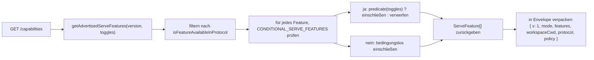
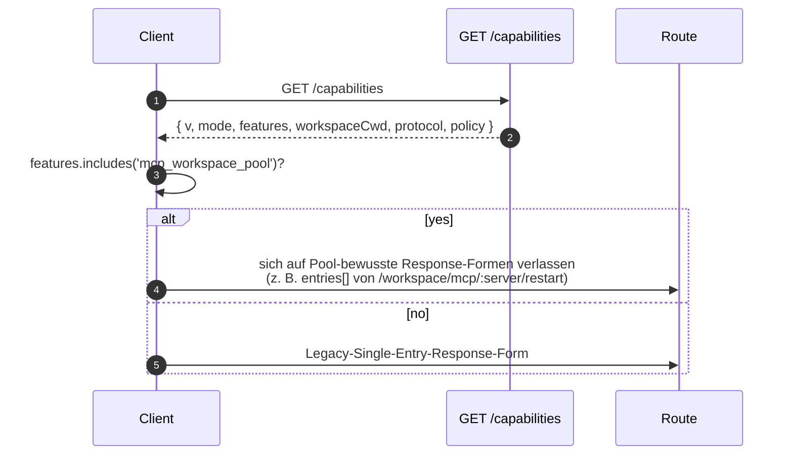

# Capabilities & Protocol-Versionierung

## Übersicht

`GET /capabilities` ist der Preflight-Endpunkt des Daemons. Jeder SDK-Client sollte ihn vor dem Aufruf einer anderen Route auslesen, um zu erfahren, welche Protokollversion der Daemon spricht, welche Feature-Tags aktiviert sind und an welchen Workspace der Daemon gebunden ist. Die Vereinbarung:

- **Es gibt nur eine Protokollversion: `v1`.** `SERVE_PROTOCOL_VERSION = 'v1'` und `SUPPORTED_SERVE_PROTOCOL_VERSIONS = ['v1']`. v1 ist intern additiv; brechende Frame-Form-Änderungen sind für v2 reserviert.
- **Jedes Tag hat eine `since`-Version.** Zukünftige v2-Daemons können sowohl v1- als auch v2-Tags ankündigen.
- **Einige Tags sind konditional.** Dreizehn Tags (`require_auth`, `mcp_workspace_pool`, `mcp_pool_restart`, `allow_origin`, `prompt_absolute_deadline`, `writer_idle_timeout`, `workspace_settings`, `workspace_voice`, `workspace_voice_transcription`, `session_shell_command`, `rate_limit`, `workspace_reload`, `voice_transcribe`) werden nur dann angekündigt, wenn der entsprechende Deployment-Toggle aktiviert ist. Das Vorhandensein eines Tags bedeutet, dass das Verhalten existiert.
- **Capability-Tag = Verhaltens-Contract.** Das Hinzufügen von neuem Verhalten unter einem bestehenden Tag kann Clients, die das alte Tag im Preflight geprüft haben, unerwartet brechen. Neues Verhalten benötigt ein neues Tag.

Das vollständige Registry befindet sich in `packages/cli/src/serve/capabilities.ts`.

## Verantwortlichkeiten

- Jedes Feature deklarieren, das der Daemon ankündigen kann.
- Angekündigte Features nach Protokollversion und Deployment-Toggles filtern.
- `getRegisteredServeFeatures()` (alle Keys, ungefiltert), `getAdvertisedServeFeatures(version, toggles)` (gefiltert) und `getServeProtocolVersions()` (Envelope `{ current, supported }`) bereitstellen.
- Die Invariante "Tag vorhanden bedeutet Verhalten vorhanden" wahren. `server.test.ts` enthält einen Test, der prüft, dass jedes konditionale Tag angekündigt wird, wenn sein Toggle aktiviert ist; das Hinzufügen eines konditionalen Tags ohne Prädikat schlägt in diesem Test fehl.

## Architektur

### Capability-Envelope

`/capabilities` gibt Folgendes zurück:

```ts
{
  v: 1,                    // CAPABILITIES_SCHEMA_VERSION
  mode: 'http-bridge',
  features: ServeFeature[],
  workspaceCwd: string,
  protocol?: { current: 'v1', supported: ['v1'] },
  policy?: { permission: PermissionPolicy },
}
```

`workspaceCwd` ist der kanonische Workspace, der beim Daemon-Start gebunden wird (siehe [`02-serve-runtime.md`](./02-serve-runtime.md)). `policy.permission` ist die aktive Mediator-Policy.

### `ServeCapabilityDescriptor`

```ts
interface ServeCapabilityDescriptor {
  since: ServeProtocolVersion; // current = 'v1'
  modes?: readonly string[]; // listet Operationsmodi auf, wenn ein Feature Modi hat
}
```

Vier v1-Tags verwenden `modes`:

- `mcp_guardrails: { since: 'v1', modes: ['warn', 'enforce'] }` - Clients sollten `'enforce'` im Preflight prüfen, bevor sie sich auf das Ablehnungsverhalten verlassen.
- `permission_mediation: { since: 'v1', modes: ['first-responder', 'designated', 'consensus', 'local-only'] }` - Dies ist die zur Build-Zeit unterstützte Menge; die aktive Policy befindet sich in `policy.permission`.
- `workspace_voice_transcription: { since: 'v1', modes: ['batch'] }` - der Transkriptionspfad, den der Daemon anbietet.
- `voice_transcribe: { since: 'v1', modes: ['streaming', 'batch'] }` - die beiden Transkriptionspfade, die für den `/voice/stream`-WebSocket verfügbar sind.

### Konditionale Tags

```ts
export const CONDITIONAL_SERVE_FEATURES: ReadonlyMap<
  ServeFeature,
  (toggles: AdvertiseFeatureToggles) => boolean
> = new Map([
  ['require_auth', (t) => t.requireAuth === true],
  ['mcp_workspace_pool', (t) => t.mcpPoolActive === true],
  ['mcp_pool_restart', (t) => t.mcpPoolActive === true],
  ['allow_origin', (t) => t.allowOriginActive === true],
  [
    'prompt_absolute_deadline',
    (t) => typeof t.promptDeadlineMs === 'number' && t.promptDeadlineMs > 0,
  ],
  [
    'writer_idle_timeout',
    (t) =>
      typeof t.writerIdleTimeoutMs === 'number' && t.writerIdleTimeoutMs > 0,
  ],
  ['workspace_settings', (t) => t.persistSettingAvailable === true],
  ['workspace_voice', (t) => t.persistSettingAvailable === true],
  [
    'workspace_voice_transcription',
    (t) => t.voiceTranscriptionAvailable === true,
  ],
  ['session_shell_command', (t) => t.sessionShellCommandEnabled === true],
  ['rate_limit', (t) => t.rateLimit === true],
  ['workspace_reload', (t) => t.reloadAvailable === true],
  ['voice_transcribe', (t) => t.voiceWsAvailable !== false],
]);
```

Die `Map` speichert Mitgliedschaft und Prädikat zusammen. Das Hinzufügen eines neuen konditionalen Tags erfordert zwei koordinierte Änderungen:

1. Das Tag und seine `since`-Version in `SERVE_CAPABILITY_REGISTRY` registrieren.
2. Sein Prädikat zu `CONDITIONAL_SERVE_FEATURES` hinzufügen.

Baseline-Tags sind nicht in der `Map` vorhanden und werden bedingungslos angekündigt. Dies wird absichtlich durch Abwesenheit dargestellt und nicht durch ein separates Set.

### 75 Tags (v1, nach Domänen gruppiert)

Grundlagen: `health`, `daemon_status`, `capabilities`.

Sessions: `session_create`, `session_scope_override`, `session_load`, `session_resume`, `unstable_session_resume`, `session_list`, `session_prompt`, `session_cancel`, `session_events`, `session_set_model`, `session_close`, `session_metadata`, `session_context`, `session_context_usage`, `session_supported_commands`, `session_tasks`, `session_stats`, `session_lsp`, `session_status`, `session_approval_mode_control`, `session_recap`, `session_btw`, **`session_shell_command`** (konditional), `session_language`, `session_rewind`, `session_hooks`, `session_branch`.

Streaming: `slow_client_warning`, `typed_event_schema`.

Identität und Heartbeat: `client_identity`, `client_heartbeat`.

Berechtigungen: `session_permission_vote`, `permission_vote`, **`permission_mediation`** (`modes: ['first-responder', 'designated', 'consensus', 'local-only']`).

Workspace Read-Only-Snapshots: `workspace_mcp`, `workspace_skills`, `workspace_providers`, `workspace_env`, `workspace_preflight`, `workspace_hooks`, `workspace_extensions`.

Workspace-Mutation (Wave 4+): `workspace_memory`, `workspace_agents`, `workspace_agent_generate`, `workspace_tool_toggle`, **`workspace_settings`** (konditional), `workspace_permissions`, `workspace_init`, `workspace_github_setup`, `workspace_trust`, `workspace_mcp_restart`, `workspace_mcp_manage`, `workspace_file_read`, `workspace_file_bytes`, `workspace_file_write`, **`workspace_reload`** (konditional).

MCP-Guardrails: **`mcp_guardrails`** (`modes: ['warn', 'enforce']`), `mcp_guardrail_events`, `mcp_server_runtime_mutation`, **`mcp_workspace_pool`** (konditional), **`mcp_pool_restart`** (konditional).

Prompt-Steuerung: **`prompt_absolute_deadline`** (konditional), **`writer_idle_timeout`** (konditional), `non_blocking_prompt`.

Auth: `auth_provider_install`, `auth_device_flow`, **`require_auth`** (konditional), **`allow_origin`** (konditional).

Voice: **`workspace_voice`** (konditional), **`workspace_voice_transcription`** (konditional, `modes: ['batch']`), **`voice_transcribe`** (konditional, `modes: ['streaming', 'batch']`).

Rate-Limiting: **`rate_limit`** (konditional).

Fettgedruckte Tags haben `modes` oder sind konditional.

## Ablauf

### Daemon-Seite: Envelope zusammenstellen



### Client-Seite: Feature-Preflight



## Status und Lebenszyklus

- `CAPABILITIES_SCHEMA_VERSION` ist die Version der Wire-Envelope-Form, derzeit `1`. Nur bei einem Envelope-Break hochzählen.
- `SERVE_PROTOCOL_VERSION = 'v1'` ist die Protokoll-Feature-Version. Das Hinzufügen von Features innerhalb von v1 ist additiv; alte Clients sehen neues Verhalten nicht, es sei denn, sie prüfen das neue Tag im Preflight. Das Entfernen eines Features ist ein v2-Break.
- `EVENT_SCHEMA_VERSION = 1` ist das `v`-Feld des SSE-Frames (siehe [`09-event-schema.md`](./09-event-schema.md)). Es ist eine unabhängige Versionsachse; das Hochzählen des Event-Schemas impliziert nicht das Hochzählen der Protokollversion und umgekehrt.
- `session_resume` ist die stabile Daemon-Capability für `POST /session/:id/resume`. `unstable_session_resume` wird weiterhin als veralteter Alias angekündigt, da die zugrunde liegende ACP-Methode immer noch `connection.unstable_resumeSession` heißt; neue Clients sollten `session_resume` per Feature-Detection erkennen.

## Abhängigkeiten

- Wird von `packages/cli/src/serve/server.ts` beim Erstellen von `/capabilities`-Responses gelesen.
- Toggle-Input kommt von `runQwenServe` / `createServeApp`: `{ requireAuth, mcpPoolActive, allowOriginActive, promptDeadlineMs, writerIdleTimeoutMs, persistSettingAvailable, sessionShellCommandEnabled, rateLimit, reloadAvailable }`.
- Die aktive `permission`-Policy im Envelope stammt aus `BridgeOptions.permissionPolicy`, welches seinerseits `policy.permissionStrategy` aus `settings.json` liest.

## Konfiguration

| Quelle                     | Parameter                                                       | Auswirkung auf Capabilities                                                                                                 |
| -------------------------- | --------------------------------------------------------------- | --------------------------------------------------------------------------------------------------------------------------- |
| CLI-Flag                   | `--require-auth`                                                | Kündigt `require_auth` an.                                                                                                  |
| Env                        | `QWEN_SERVE_NO_MCP_POOL=1`                                      | Stoppt die Ankündigung von `mcp_workspace_pool` und `mcp_pool_restart`; MCP-Events stempeln nicht mehr `scope: 'workspace'`.|
| CLI-Flag                   | `--mcp-client-budget=N`, `--mcp-budget-mode={off,warn,enforce}` | Ändert nicht den Tag-Satz (`mcp_guardrails` wird immer angekündigt), ändert aber die serverbezogene Reservierung und das Ablehnungsverhalten. |
| CLI-Flag / Env             | `--rate-limit` / `QWEN_SERVE_RATE_LIMIT=1`                      | Kündigt `rate_limit` an.                                                                                                    |
| Eingebettete Option        | `persistSettingAvailable`                                       | Kündigt `workspace_settings` und `workspace_voice` an.                                                                      |
| Eingebettete Option        | `voiceTranscriptionAvailable`                                   | Kündigt `workspace_voice_transcription` an.                                                                                 |
| CLI-Flag / eingebettete Option | `--enable-session-shell` / `sessionShellCommandEnabled`     | Kündigt `session_shell_command` an.                                                                                         |
| Eingebettete Option        | `reloadAvailable`                                               | Kündigt `workspace_reload` an.                                                                                              |
| Eingebettete Option        | `voiceWsAvailable`                                              | Kündigt `voice_transcribe` an.                                                                                              |
| `settings.json`            | `policy.permissionStrategy`                                     | Setzt `policy.permission` im Envelope.                                                                                      |

## Einschränkungen und bekannte Grenzen

- **`--require-auth` versteckt den Preflight.** Mit `--require-auth` erfordern alle Routen, einschließlich `/capabilities`, eine Bearer-Authentifizierung. Ein nicht authentifizierter Client kann `caps.features.require_auth` nicht im Preflight prüfen; der 401-Response-Body ist die Discovery-Oberfläche. Das `require_auth`-Tag ist eine authentifizierte Bestätigung für Audit-UIs in gehärteten Deployments.
- **Tag-Vorhandensein bedeutet Verhaltens-Existenz.** Wenn ein zukünftiger Contributor Verhalten unter einem bestehenden Tag hinzufügt, ohne `since` hochzuzählen, können Clients, die das alte Tag im Preflight geprüft haben, stillschweigend neues Verhalten erhalten. Die Konvention lautet: Neues Verhalten bekommt ein neues Tag.
- **`unstable_*`-Tags können ihre Form zwischen Versionen ohne Protokoll-Bump ändern.** Pinne eine SDK-Version, wenn du dich auf sie verlässt.
- Der Routen-Katalog befindet sich in [`../qwen-serve-protocol.md`](../qwen-serve-protocol.md); diese Seite dupliziert ihn absichtlich nicht.

## Referenzen

- `packages/cli/src/serve/capabilities.ts`
- `packages/cli/src/serve/types.ts` (`ServeOptions`, `CapabilitiesEnvelope`)
- `packages/cli/src/serve/server.ts` (Envelope-Zusammenstellung)
- `packages/acp-bridge/src/eventBus.ts` (`EVENT_SCHEMA_VERSION`)
- Wire-Referenz: [`../qwen-serve-protocol.md`](../qwen-serve-protocol.md)
- Auth- und Deployment-Guardrails: [`12-auth-security.md`](./12-auth-security.md)