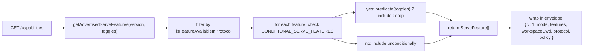
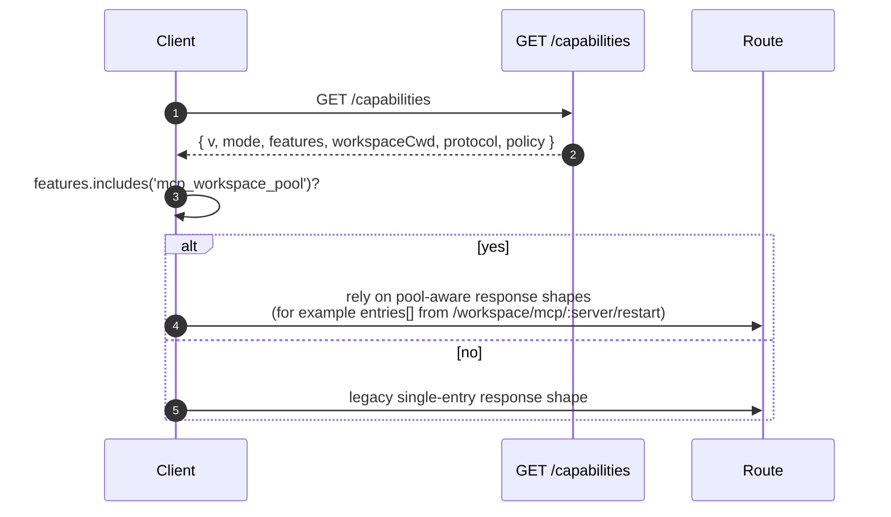

# Fähigkeiten & Protokollversionierung

## Übersicht

`GET /capabilities` ist der Preflight-Endpunkt des Daemons. Jeder SDK-Client sollte diesen Endpunkt lesen, bevor er eine andere Route aufruft, um zu erfahren, welche Protokollversion der Daemon spricht, welche Feature-Tags aktiviert sind und an welchen Workspace der Daemon gebunden ist. Der Vertrag:

- **Es gibt eine Protokollversion: `v1`.** `SERVE_PROTOCOL_VERSION = 'v1'` und `SUPPORTED_SERVE_PROTOCOL_VERSIONS = ['v1']`. v1 ist intern additiv; Breaking-Änderungen am Rahmenformat sind für v2 reserviert.
- **Jeder Tag hat eine `since`-Version.** Zukünftige v2-Daemons können sowohl v1- als auch v2-Tags anzeigen.
- **Manche Tags sind bedingt.** Zehn Tags (`require_auth`, `mcp_workspace_pool`, `mcp_pool_restart`, `allow_origin`, `prompt_absolute_deadline`, `writer_idle_timeout`, `workspace_settings`, `session_shell_command`, `rate_limit`, `workspace_reload`) werden nur angezeigt, wenn der entsprechende Deployment-Schalter aktiviert ist. Die Anwesenheit eines Tags bedeutet, dass das Verhalten existiert.
- **Fähigkeits-Tag = Verhaltensvertrag.** Das Hinzufügen neuen Verhaltens unter einem bestehenden Tag kann Clients, die den alten Tag preflightet haben, stillschweigend brechen. Neues Verhalten benötigt einen neuen Tag.

Das vollständige Register befindet sich in `packages/cli/src/serve/capabilities.ts`.

## Verantwortlichkeiten

- Jedes Feature deklarieren, das der Daemon bewerben kann.
- Beworbene Features nach Protokollversion und Deployment-Schaltern filtern.
- `getRegisteredServeFeatures()` (alle Schlüssel, ungefiltert), `getAdvertisedServeFeatures(version, toggles)` (gefiltert) und `getServeProtocolVersions()` (Envelope `{ current, supported }`) bereitstellen.
- Die Invariante "Tag vorhanden bedeutet Verhalten vorhanden" wahren. `server.test.ts` enthält einen Test, der prüft, dass jeder bedingte Tag angezeigt wird, wenn sein Schalter aktiviert ist; das Hinzufügen eines bedingten Tags ohne Prädikat lässt diesen Test fehlschlagen.

## Architektur

### Fähigkeiten-Envelope

`/capabilities` gibt zurück:

```ts
{
  v: 1,                    // CAPABILITIES_SCHEMA_VERSION
  mode: 'http-bridge',
  features: ServeFeature[],
  workspaceCwd: string,
  protocol?: { current: 'v1', supported: ['v1'] },
  policy?: { permission: PermissionPolicy },
}
```

`workspaceCwd` ist der kanonische Workspace, der beim Start des Daemons gebunden wurde (siehe [`02-serve-runtime.md`](./02-serve-runtime.md)). `policy.permission` ist die aktive Mediator-Richtlinie.

### `ServeCapabilityDescriptor`

```ts
interface ServeCapabilityDescriptor {
  since: ServeProtocolVersion; // current = 'v1'
  modes?: readonly string[]; // listet Betriebsmodi auf, wenn ein Feature Modi hat
}
```

Zwei v1-Tags verwenden `modes`:

- `mcp_guardrails: { since: 'v1', modes: ['warn', 'enforce'] }` - Clients sollten `'enforce'` preflihten, bevor sie sich auf das Ablehnungsverhalten verlassen.
- `permission_mediation: { since: 'v1', modes: ['first-responder', 'designated', 'consensus', 'local-only'] }` - Dies ist die bauzeitlich unterstützte Menge; die aktive Richtlinie befindet sich in `policy.permission`.

### Bedingte Tags

```ts
export const CONDITIONAL_SERVE_FEATURES: ReadonlyMap<
  ServeFeature,
  (toggles: AdvertiseFeatureToggles) => boolean
> = new Map([
  ['require_auth', (t) => t.requireAuth === true],
  ['mcp_workspace_pool', (t) => t.mcpPoolActive === true],
  ['mcp_pool_restart', (t) => t.mcpPoolActive === true],
  ['allow_origin', (t) => t.allowOriginActive === true],
  [
    'prompt_absolute_deadline',
    (t) => typeof t.promptDeadlineMs === 'number' && t.promptDeadlineMs > 0,
  ],
  [
    'writer_idle_timeout',
    (t) =>
      typeof t.writerIdleTimeoutMs === 'number' && t.writerIdleTimeoutMs > 0,
  ],
  ['workspace_settings', (t) => t.persistSettingAvailable === true],
  ['session_shell_command', (t) => t.sessionShellCommandEnabled === true],
  ['rate_limit', (t) => t.rateLimit === true],
  ['workspace_reload', (t) => t.reloadAvailable === true],
]);
```

Die `Map` speichert Mitgliedschaft und Prädikat gemeinsam. Das Hinzufügen eines neuen bedingten Tags erfordert zwei koordinierte Änderungen:

1. Tag und seine `since`-Version in `SERVE_CAPABILITY_REGISTRY` registrieren.
2. Sein Prädikat zu `CONDITIONAL_SERVE_FEATURES` hinzufügen.

Basis-Tags sind nicht in der `Map` enthalten und werden bedingungslos angezeigt. Dies wird bewusst durch Abwesenheit und nicht durch einen separaten Set dargestellt.

### 67 Tags (v1, nach Domäne gruppiert)

Grundlagen: `health`, `capabilities`.

Sitzungen: `session_create`, `session_scope_override`, `session_load`, `session_resume`, `unstable_session_resume`, `session_list`, `session_prompt`, `session_cancel`, `session_events`, `session_set_model`, `session_close`, `session_metadata`, `session_context`, `session_context_usage`, `session_supported_commands`, `session_tasks`, `session_stats`, `session_lsp`, `session_status`, `session_approval_mode_control`, `session_recap`, `session_btw`, **`session_shell_command`** (bedingt), `session_language`, `session_rewind`, `session_hooks`, `session_branch`.

Streaming: `slow_client_warning`, `typed_event_schema`.

Identität und Heartbeat: `client_identity`, `client_heartbeat`.

Berechtigungen: `session_permission_vote`, `permission_vote`, **`permission_mediation`** (`modes: ['first-responder', 'designated', 'consensus', 'local-only']`).

Workspace-Lese-Snapshots: `workspace_mcp`, `workspace_skills`, `workspace_providers`, `workspace_env`, `workspace_preflight`, `workspace_hooks`, `workspace_extensions`.

Workspace-Mutation (Wave 4+): `workspace_memory`, `workspace_agents`, `workspace_agent_generate`, `workspace_tool_toggle`, **`workspace_settings`** (bedingt), `workspace_init`, `workspace_mcp_restart`, `workspace_mcp_manage`, `workspace_file_read`, `workspace_file_bytes`, `workspace_file_write`, **`workspace_reload`** (bedingt).

MCP-Schutzmaßnahmen: **`mcp_guardrails`** (`modes: ['warn', 'enforce']`), `mcp_guardrail_events`, `mcp_server_runtime_mutation`, **`mcp_workspace_pool`** (bedingt), **`mcp_pool_restart`** (bedingt).

Prompt-Steuerung: **`prompt_absolute_deadline`** (bedingt), **`writer_idle_timeout`** (bedingt), `non_blocking_prompt`.

Authentifizierung: `auth_provider_install`, `auth_device_flow`, **`require_auth`** (bedingt), **`allow_origin`** (bedingt).

Ratenbegrenzung: **`rate_limit`** (bedingt).

Fettgedruckte Tags haben `modes` oder sind bedingt.

## Ablauf

### Daemon-Seite: Envelope zusammenstellen



### Client-Seite: Feature-Preflight



## Zustand und Lebenszyklus

- `CAPABILITIES_SCHEMA_VERSION` ist die Version des Wire-Envelope-Formats, derzeit `1`. Nur bei einem Bruch des Envelope-Formats erhöhen.
- `SERVE_PROTOCOL_VERSION = 'v1'` ist die Protokoll-Feature-Version. Das Hinzufügen von Features innerhalb von v1 ist additiv; alte Clients sehen neues Verhalten nicht, es sei denn, sie führen einen Preflight des neuen Tags durch. Das Entfernen eines Features ist ein v2-Bruch.
- `EVENT_SCHEMA_VERSION = 1` ist das `v`-Feld des SSE-Frames (siehe [`09-event-schema.md`](./09-event-schema.md)). Es ist eine unabhängige Versionsachse; eine Erhöhung des Ereignisschemas impliziert keine Erhöhung der Protokollversion und umgekehrt.
- `session_resume` ist die stabile Daemon-Funktion für `POST /session/:id/resume`. `unstable_session_resume` bleibt als veralteter Alias angezeigt, da die zugrunde liegende ACP-Methode immer noch `connection.unstable_resumeSession` heißt; neue Clients sollten `session_resume` per Feature-Erkennung ermitteln.

## Abhängigkeiten

- Wird gelesen von `packages/cli/src/serve/server.ts` beim Erstellen von `/capabilities`-Antworten.
- Die Schaltereingabe stammt von `runQwenServe` / `createServeApp`: `{ requireAuth, mcpPoolActive, allowOriginActive, promptDeadlineMs, writerIdleTimeoutMs, persistSettingAvailable, sessionShellCommandEnabled, rateLimit, reloadAvailable }`.
- Die aktive `permission`-Richtlinie im Envelope stammt von `BridgeOptions.permissionPolicy`, die selbst `settings.json` `policy.permissionStrategy` liest.

## Konfiguration

| Quelle                     | Parameter                                                       | Auswirkung auf Fähigkeiten                                                                                                   |
| -------------------------- | --------------------------------------------------------------- | ---------------------------------------------------------------------------------------------------------------------------- |
| CLI-Flag                   | `--require-auth`                                                | Zeigt `require_auth` an.                                                                                                    |
| Umgebungsvariable          | `QWEN_SERVE_NO_MCP_POOL=1`                                      | Hört auf, `mcp_workspace_pool` und `mcp_pool_restart` anzuzeigen; MCP-Ereignisse versehen keinen `scope: 'workspace'` mehr. |
| CLI-Flag                   | `--mcp-client-budget=N`, `--mcp-budget-mode={off,warn,enforce}` | Ändert nicht die Tag-Menge (`mcp_guardrails` wird immer angezeigt), ändert aber das Pro-Server-Reservierungs- und Ablehnungsverhalten. |
| CLI-Flag / Umgebungsvariable | `--rate-limit` / `QWEN_SERVE_RATE_LIMIT=1`                      | Zeigt `rate_limit` an.                                                                                                      |
| Eingebettete Option        | `persistSettingAvailable`                                       | Zeigt `workspace_settings` an.                                                                                              |
| CLI-Flag / eingebettete Option | `--enable-session-shell` / `sessionShellCommandEnabled`         | Zeigt `session_shell_command` an.                                                                                           |
| Eingebettete Option        | `reloadAvailable`                                               | Zeigt `workspace_reload` an.                                                                                                |
| `settings.json`            | `policy.permissionStrategy`                                     | Setzt den Envelope `policy.permission`.                                                                                     |

## Hinweise und bekannte Grenzen

- **`--require-auth` versteckt den Preflight.** Mit `--require-auth` erfordern alle Routen, einschließlich `/capabilities`, eine Bearer-Authentifizierung. Ein nicht authentifizierter Client kann `caps.features.require_auth` nicht preflihten; der 401-Antwortkörper ist die Erkennungsoberfläche. Der `require_auth`-Tag ist eine authentifizierte Bestätigung für gehärtete Deployment-Audit-UIs.
- **Tag-Anwesenheit bedeutet Verhalten vorhanden.** Wenn ein zukünftiger Mitwirkender Verhalten unter einem bestehenden Tag hinzufügt, ohne `since` zu erhöhen, können Clients, die den alten Tag preflightet haben, stillschweigend neues Verhalten erhalten. Die Konvention lautet: Neues Verhalten bekommt einen neuen Tag.
- **`unstable_*`-Tags können zwischen Versionen die Form ändern** ohne Protokollerhöhung. Eine SDK-Version festlegen, wenn man von ihnen abhängt.
- Der Routenkatalog befindet sich in [`../qwen-serve-protocol.md`](../qwen-serve-protocol.md); diese Seite dupliziert ihn absichtlich nicht.

## Referenzen

- `packages/cli/src/serve/capabilities.ts`
- `packages/cli/src/serve/types.ts` (`ServeOptions`, `CapabilitiesEnvelope`)
- `packages/cli/src/serve/server.ts` (Envelope-Zusammenstellung)
- `packages/acp-bridge/src/eventBus.ts` (`EVENT_SCHEMA_VERSION`)
- Wire-Referenz: [`../qwen-serve-protocol.md`](../qwen-serve-protocol.md)
- Auth- und Deployment-Schutzmaßnahmen: [`12-auth-security.md`](./12-auth-security.md)