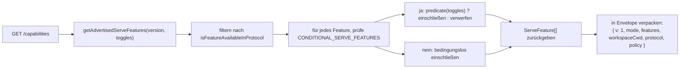
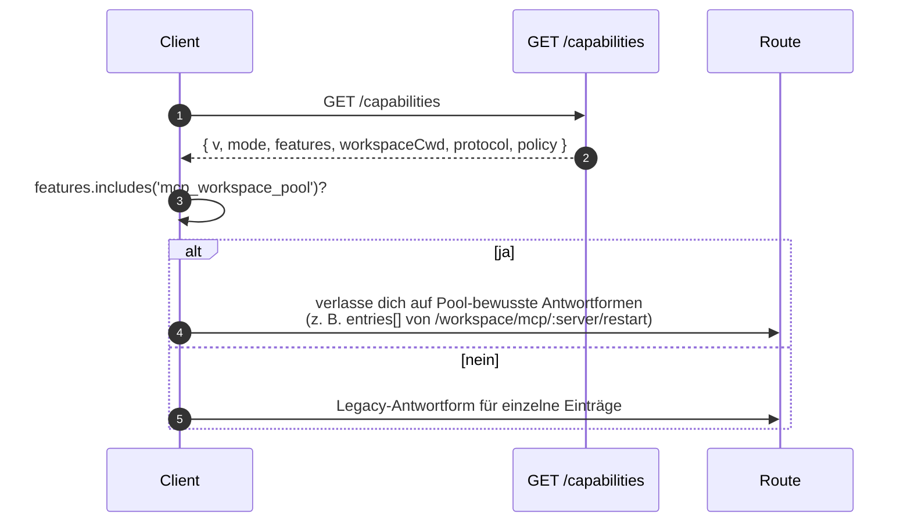

# Capabilities & Protocol-Versionierung

## Übersicht

`GET /capabilities` ist der Preflight-Endpunkt des Daemons. Jeder SDK-Client sollte ihn vor dem Aufruf einer anderen Route lesen, um zu erfahren, welche Protokollversion der Daemon spricht, welche Feature-Tags aktiviert sind und an welchen Workspace-Runtimes der Daemon akzeptiert. Die Vereinbarung:

- **Es gibt nur eine Protokollversion: `v1`.** `SERVE_PROTOCOL_VERSION = 'v1'` und `SUPPORTED_SERVE_PROTOCOL_VERSIONS = ['v1']`. v1 ist intern additiv; brechende Änderungen an der Frame-Form sind für v2 vorbehalten.
- **Jedes Tag hat eine `since`-Version.** Zukünftige v2-Daemons können sowohl v1- als auch v2-Tags bewerben.
- **Einige Tags sind konditional.** Tags in `CONDITIONAL_SERVE_FEATURES` werden nur beworben, wenn der entsprechende Deployment-Toggle aktiviert ist. Das Vorhandensein eines Tags bedeutet, dass das Verhalten existiert.
- **Capability-Tag = Verhaltensvertrag.** Das Hinzufügen von neuem Verhalten unter einem bestehenden Tag kann bei Clients, die das alte Tag im Preflight geprüft haben, zu stillschweigenden Brüchen führen. Neues Verhalten benötigt ein neues Tag.

Die vollständige Registry befindet sich in `packages/cli/src/serve/capabilities.ts`.

## Verantwortlichkeiten

- Jedes Feature deklarieren, das der Daemon bewerben könnte.
- Beworbene Features nach Protokollversion und Deployment-Toggles filtern.
- `getRegisteredServeFeatures()` (alle Keys, ungefiltert), `getAdvertisedServeFeatures(version, toggles)` (gefiltert) und `getServeProtocolVersions()` (Envelope `{ current, supported }`) bereitstellen.
- Die Invariante "Tag vorhanden bedeutet Verhalten vorhanden" wahren. `server.test.ts` enthält einen Test, der prüft, dass jedes konditionale Tag beworben wird, wenn sein Toggle aktiviert ist; das Hinzufügen eines konditionalen Tags ohne Prädikat schlägt in diesem Test fehl.

## Architektur

### Capability-Envelope

`/capabilities` gibt Folgendes zurück:

```ts
{
  v: 1,                    // CAPABILITIES_SCHEMA_VERSION
  mode: 'http-bridge',
  features: ServeFeature[],
  workspaceCwd: string,
  workspaces?: Array<{ id: string, cwd: string, primary: boolean, trusted: boolean }>,
  protocol?: { current: 'v1', supported: ['v1'] },
  policy?: { permission: PermissionPolicy },
}
```

`workspaceCwd` ist der kanonische primäre Workspace-Pfad (siehe [`02-serve-runtime.md`](./02-serve-runtime.md)). Aktuelle Daemons verwenden `workspaces[]` als registrierten Runtime-Katalog; `multi_workspace_sessions` zeigt an, dass mehr als eine Runtime aktiv ist. `policy.permission` ist die aktive Mediator-Richtlinie.

### `ServeCapabilityDescriptor`

```ts
interface ServeCapabilityDescriptor {
  since: ServeProtocolVersion; // current = 'v1'
  modes?: readonly string[]; // lists operation modes when a feature has modes
}
```

Vier v1-Tags verwenden `modes`:

- `mcp_guardrails: { since: 'v1', modes: ['warn', 'enforce'] }` - Clients sollten `'enforce'` preflighten, bevor sie sich auf das Ablehnungsverhalten verlassen.
- `permission_mediation: { since: 'v1', modes: ['first-responder', 'designated', 'consensus', 'local-only'] }` - dies ist die zur Build-Zeit unterstützte Menge; die aktive Richtlinie befindet sich in `policy.permission`.
- `workspace_voice_transcription: { since: 'v1', modes: ['batch'] }` - der Transkriptionspfad, den der Daemon anbietet.
- `voice_transcribe: { since: 'v1', modes: ['streaming', 'batch'] }` - die beiden Transkriptionspfade, die auf dem `/voice/stream`-WebSocket verfügbar sind.

### Konditionale Tags

```ts
export const CONDITIONAL_SERVE_FEATURES: ReadonlyMap<
  ServeFeature,
  (toggles: AdvertiseFeatureToggles) => boolean
> = new Map([
  ['require_auth', (t) => t.requireAuth === true],
  ['mcp_workspace_pool', (t) => t.mcpPoolActive === true],
  ['mcp_pool_restart', (t) => t.mcpPoolActive === true],
  ['allow_origin', (t) => t.allowOriginActive === true],
  [
    'prompt_absolute_deadline',
    (t) => typeof t.promptDeadlineMs === 'number' && t.promptDeadlineMs > 0,
  ],
  [
    'writer_idle_timeout',
    (t) =>
      typeof t.writerIdleTimeoutMs === 'number' && t.writerIdleTimeoutMs > 0,
  ],
  ['workspace_settings', (t) => t.persistSettingAvailable === true],
  ['workspace_voice', (t) => t.persistSettingAvailable === true],
  [
    'workspace_voice_transcription',
    (t) => t.voiceTranscriptionAvailable === true,
  ],
  ['session_shell_command', (t) => t.sessionShellCommandEnabled === true],
  [
    'multi_workspace_session_rewind',
    (t) => t.multiWorkspaceSessionsEnabled === true,
  ],
  [
    'multi_workspace_session_shell',
    (t) =>
      t.multiWorkspaceSessionsEnabled === true &&
      t.sessionShellCommandEnabled === true,
  ],
  ['rate_limit', (t) => t.rateLimit === true],
  ['workspace_reload', (t) => t.reloadAvailable === true],
  ['voice_transcribe', (t) => t.voiceWsAvailable !== false],
]);
```

Die `Map` speichert Mitgliedschaft und Prädikat zusammen. Das Hinzufügen eines neuen konditionalen Tags erfordert zwei koordinierte Änderungen:

1. Registriere das Tag und seine `since`-Version in `SERVE_CAPABILITY_REGISTRY`.
2. Füge sein Prädikat zu `CONDITIONAL_SERVE_FEATURES` hinzu.

Baseline-Tags sind nicht in der `Map` vorhanden und werden bedingungslos beworben. Dies wird absichtlich durch Abwesenheit dargestellt und nicht durch ein separates Set.

### v1-Tags nach Domänen gruppiert

Grundlagen: `health`, `daemon_status`, `capabilities`.

Sessions: `session_create`, `session_id_override`, `session_scope_override`, `session_load`, `session_resume`, `unstable_session_resume`, `session_list`, `session_info`, `session_prompt`, `session_mid_turn_message_mutation`, `session_cancel`, `session_events`, `session_set_model`, `session_close`, `session_metadata`, `session_archive`, `session_export`, `session_transcript`, `session_context`, `session_context_usage`, `session_supported_commands`, `session_tasks`, `session_monitor_tool_correlation`, `session_stats`, `session_lsp`, `session_status`, `session_approval_mode_control`, `session_recap`, `session_btw`, **`session_shell_command`** (konditional), `session_language`, `session_rewind`, `session_hooks`, `session_branch`.

Streaming: `slow_client_warning`, `typed_event_schema`.

Identität und Heartbeat: `client_identity`, `client_heartbeat`.

Berechtigungen: `session_permission_vote`, `permission_vote`, **`permission_mediation`** (`modes: ['first-responder', 'designated', 'consensus', 'local-only']`).

Workspace-Read-Only-Snapshots: `workspace_mcp`, `workspace_skills`, `workspace_providers`, `workspace_acp_status`, `workspace_env`, `workspace_preflight`, `workspace_hooks`, `workspace_extensions`.

Extension-Management: `extension_management_v2` fügt den globalen `/extensions/*` Katalog-/Mutations-/Operations-Vertrag und die Workspace-Aktivierungsprojektion hinzu. Es ist getrennt von der veröffentlichten `workspace_extensions`-Kompatibilitätsoberfläche und von `workspace_qualified_rest_core`.

Workspace-qualifizierte Session-Lesezugriffe: `workspace_persisted_transcript`, `workspace_session_export`, `workspace_archived_session_export`, `workspace_session_live_state`. Die aktiven und archivierten Export-Tags sind unabhängig voneinander und von `session_export` sowie `workspace_qualified_rest_core`, daher müssen Clients den exakten Speicherzustand, den sie exportieren möchten, vorab per Preflight prüfen. Das Paging für persistierte Transkripte erlaubt einen nicht vertrauenswürdigen sekundären Client im Rahmen seiner begrenzten Lese-Richtlinie; beide vollständigen Export-Pfade bleiben nur für vertrauenswürdige Clients zugänglich. `workspace_session_live_state` ist ebenfalls unabhängig von `workspace_qualified_rest_core` und nur für vertrauenswürdige Clients: Es liefert den speicherbasierten Live-Session-Snapshot und die Katalogversion der ausgewählten Runtime und erweitert nicht die Lese-Richtlinie für nicht vertrauenswürdige Secondaries auf den Live-Bridge-State.

Workspace-Mutation (Wave 4+): `workspace_memory`, `workspace_agents`, `workspace_agent_generate`, `workspace_acp_preheat`, `workspace_tool_toggle`, **`workspace_settings`** (konditional), `workspace_permissions`, `workspace_init`, `workspace_github_setup`, `workspace_trust`, `workspace_mcp_restart`, `workspace_mcp_manage`, `workspace_file_read`, `workspace_file_bytes`, `workspace_file_read_cursor`, `workspace_file_write`, `workspace_file_upload`, **`workspace_reload`** (konditional).

MCP-Guardrails: **`mcp_guardrails`** (`modes: ['warn', 'enforce']`), `mcp_guardrail_events`, `mcp_server_runtime_mutation`, **`mcp_workspace_pool`** (konditional), **`mcp_pool_restart`** (konditional).

Prompt-Steuerung: **`prompt_absolute_deadline`** (konditional), **`writer_idle_timeout`** (konditional), `non_blocking_prompt`.

Auth: `auth_provider_install`, `auth_device_flow`, **`require_auth`** (konditional), **`allow_origin`** (konditional).

Voice: **`workspace_voice`** (konditional), **`workspace_voice_transcription`** (konditional, `modes: ['batch']`), **`voice_transcribe`** (konditional, `modes: ['streaming', 'batch']`).

Rate-Limiting: **`rate_limit`** (konditional).

Multi-Workspace-Session-Routing: **`multi_workspace_sessions`** (konditional),
**`multi_workspace_session_rewind`** (konditional) und
**`multi_workspace_session_shell`** (konditional). Ein Client kann Rewind für
eine primäre Session mit `session_rewind` verwenden; eine sekundäre Live-Session
erfordert zusätzlich `multi_workspace_session_rewind`. Shell verwendet das
äquivalente `session_shell_command` plus `multi_workspace_session_shell`-Paarung
für eine sekundäre Session. ACP-native Clients verwenden weiterhin die von
initialize zurückgegebenen `_qwen.methods`; es wird keine ACP-Rewind-Vendor-Methode
beworben.

Fettgedruckte Tags haben `modes` oder sind konditional.

## Ablauf

### Daemon-Seite: Envelope zusammenstellen


```mermaid
flowchart LR
    A["GET /capabilities"] --> B["getAdvertisedServeFeatures(version, toggles)"]
    B --> C["filtern nach isFeatureAvailableInProtocol"]
    C --> D["für jedes Feature, prüfe CONDITIONAL_SERVE_FEATURES"]
    D --> E["ja: predicate(toggles) ? einschließen : verwerfen"]
    D --> F["nein: bedingungslos einschließen"]
    E --> G["ServeFeature[] zurückgeben"]
    F --> G
    G --> H["in Envelope verpacken:<br/>{ v: 1, mode, features, workspaceCwd, protocol, policy }"]
```

### Client-Seite: Feature-Preflight


```mermaid
sequenceDiagram
    autonumber
    participant C as Client
    participant D as GET /capabilities
    participant R as Route

    C->>D: GET /capabilities
    D-->>C: { v, mode, features, workspaceCwd, protocol, policy }
    C->>C: features.includes('mcp_workspace_pool')?
    alt ja
        C->>R: verlasse dich auf Pool-bewusste Antwortformen<br/>(z. B. entries[] von /workspace/mcp/:server/restart)
    else nein
        C->>R: Legacy-Antwortform für einzelne Einträge
    end
```

## Status und Lebenszyklus

- `CAPABILITIES_SCHEMA_VERSION` ist die Version der Wire-Envelope-Form, derzeit `1`. Erhöhe sie nur bei einem Envelope-Bruch.
- `SERVE_PROTOCOL_VERSION = 'v1'` ist die Protokoll-Feature-Version. Das Hinzufügen von Features innerhalb von v1 ist additiv; alte Clients sehen kein neues Verhalten, es sei denn, sie preflighten das neue Tag. Das Entfernen eines Features ist ein v2-Bruch.
- `EVENT_SCHEMA_VERSION = 1` ist das SSE-Frame-`v`-Feld (siehe [`09-event-schema.md`](./09-event-schema.md)). Es ist eine unabhängige Versionsachse; das Erhöhen des Event-Schemas impliziert nicht das Erhöhen der Protokollversion und umgekehrt.
- `session_resume` ist die stabile Daemon-Capability für `POST /session/:id/resume`. `unstable_session_resume` wird weiterhin als veralteter Alias beworben, da die zugrunde liegende ACP-Methode immer noch `connection.unstable_resumeSession` heißt; neue Clients sollten `session_resume` per Feature-Detection erkennen.

## Abhängigkeiten

- Wird von `packages/cli/src/serve/server.ts` beim Erstellen von `/capabilities`-Antworten gelesen.
- Die Toggle-Eingabe stammt von `runQwenServe` / `createServeApp`, einschließlich
  Authentifizierung, MCP, Origin, Prompt, Einstellungen, Shell, Rate-Limit, Reload und
  Live-Workspace-Runtime-Count-Status.
- Die aktive `permission`-Richtlinie im Envelope stammt von `BridgeOptions.permissionPolicy`, welches seinerseits `settings.json` `policy.permissionStrategy` liest.

## Konfiguration

| Quelle                     | Einstellung                                                     | Auswirkung auf Capabilities                                                                                                 |
| -------------------------- | --------------------------------------------------------------- | --------------------------------------------------------------------------------------------------------------------------- |
| CLI-Flag                   | `--require-auth`                                                | Bewirbt `require_auth`.                                                                                                     |
| Env                        | `QWEN_SERVE_NO_MCP_POOL=1`                                      | Stoppt das Bewerben von `mcp_workspace_pool` und `mcp_pool_restart`; MCP-Events stempeln nicht mehr `scope: 'workspace'`.   |
| CLI-Flag                   | `--mcp-client-budget=N`, `--mcp-budget-mode={off,warn,enforce}` | Ändert nicht das Tag-Set (`mcp_guardrails` wird immer beworben), ändert aber die serverbezogene Reservierung und das Ablehnungsverhalten. |
| CLI-Flag / Env             | `--rate-limit` / `QWEN_SERVE_RATE_LIMIT=1`                      | Bewirbt `rate_limit`.                                                                                                       |
| Eingebettete Option        | `persistSettingAvailable`                                       | Bewirbt `workspace_settings` und `workspace_voice`.                                                                         |
| Eingebettete Option        | `voiceTranscriptionAvailable`                                   | Bewirbt `workspace_voice_transcription`.                                                                                    |
| CLI-Flag / Eingebettete Option | `--enable-session-shell` / `sessionShellCommandEnabled`     | Bewirbt `session_shell_command`.                                                                                            |
| Runtime-Status              | Mehr als eine registrierte Workspace-Runtime                   | Bewirbt `multi_workspace_sessions` und `multi_workspace_session_rewind`; bewirbt auch `multi_workspace_session_shell`, wenn Session-Shell effektiv aktiviert ist. |
| Eingebettete Option        | `reloadAvailable`                                               | Bewirbt `workspace_reload`.                                                                                                 |
| Eingebettete Option        | `voiceWsAvailable`                                              | Bewirbt `voice_transcribe`.                                                                                                 |
| `settings.json`            | `policy.permissionStrategy`                                     | Setzt Envelope-`policy.permission`.                                                                                         |

## Einschränkungen und bekannte Grenzen

- **`--require-auth` versteckt den Preflight.** Mit `--require-auth` erfordern alle Routen, einschließlich `/capabilities`, eine Bearer-Authentifizierung. Ein nicht authentifizierter Client kann `caps.features.require_auth` nicht preflighten; der 401-Antwort-Body ist die Discovery-Oberfläche. Das `require_auth`-Tag ist eine authentifizierte Bestätigung für Audit-UIs in abgesicherten Deployments.
- **Das Vorhandensein eines Tags bedeutet, dass das Verhalten existiert.** Wenn ein zukünftiger Contributor Verhalten unter einem bestehenden Tag hinzufügt, ohne `since` zu erhöhen, können Clients, die das alte Tag gepreflightet haben, stillschweigend neues Verhalten erhalten. Die Konvention lautet: Neues Verhalten bekommt ein neues Tag.
- **`unstable_*`-Tags können ihre Form zwischen Versionen ändern**, ohne dass die Protokollversion erhöht wird. Pinne eine SDK-Version, wenn du dich darauf verlässt.
- Der Routen-Katalog befindet sich in [`../qwen-serve-protocol.md`](../qwen-serve-protocol.md); diese Seite dupliziert ihn absichtlich nicht.

## Referenzen

- `packages/cli/src/serve/capabilities.ts`
- `packages/cli/src/serve/types.ts` (`ServeOptions`, `CapabilitiesEnvelope`)
- `packages/cli/src/serve/server.ts` (Envelope-Zusammenstellung)
- `packages/acp-bridge/src/eventBus.ts` (`EVENT_SCHEMA_VERSION`)
- Wire-Referenz: [`../qwen-serve-protocol.md`](../qwen-serve-protocol.md)
- Auth- und Deployment-Guardrails: [`12-auth-security.md`](./12-auth-security.md)