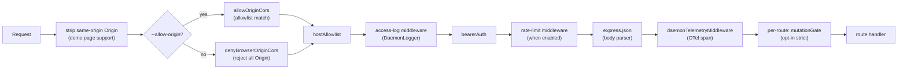
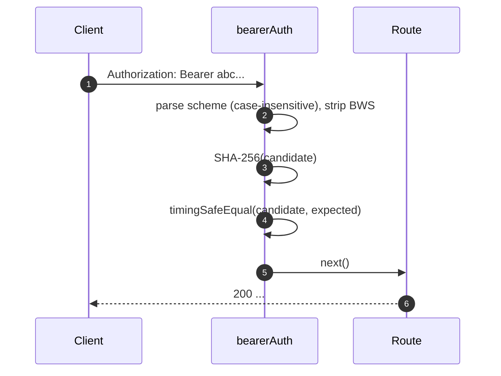
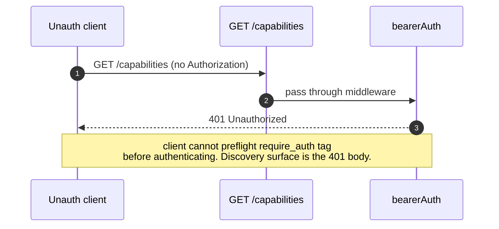
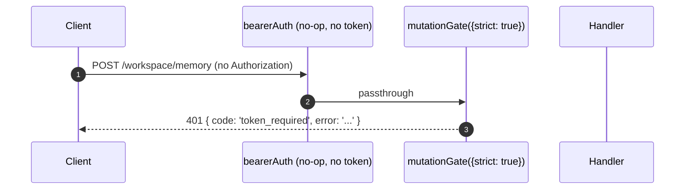

# Auth & Security Model

## Übersicht

`qwen serve` ist standardmäßig ein lokaler Daemon und eine exponierte Angriffsfläche bei falscher Konfiguration. Das Sicherheitsmodell ist **mehrschichtig**, sodass eine Fehlkonfiguration im abgesicherten Zustand endet:

1. **Bind** — Ein Binden an eine nicht-Loopback-Adresse ohne Bearer-Token **verweigert den Start**.
2. **Bearer-Authentifizierung** — Die `bearerAuth`-Middleware mit konstantem SHA-256-Vergleich schützt jede Route außer `/health` auf Loopback (`require_auth` erweitert dies auch auf Loopback und `/health`).
3. **Host-Header-Allowlist** — Auf Loopback werden nur `localhost`, `127.0.0.1`, `[::1]`, `host.docker.internal` (jeweils mit Port) akzeptiert; Schutz vor DNS-Rebinding.
4. **Origin-Steuerung** — Standardmäßig wird jede Anfrage mit einem `Origin`-Header mit 403 abgewiesen. Wenn `--allow-origin <pattern>` konfiguriert ist, schaltet der Daemon in den CORS-Allowlist-Modus (`allowOriginCors`) und erlaubt nur passende Origins.
5. **Per-Route-Mutations-Gate** — Wave-4-mutierende Routen können selbst auf Loopback eine `401`-Antwort erzwingen, wenn kein Token konfiguriert ist, unter Verwendung eines eigenen Fehlers `code: 'token_required'`.
6. **Device-Flow-Auth** — Separate OAuth-Oberfläche für Provider (`POST /workspace/auth/device-flow` + GET/DELETE auf `/:id`).

Dieses Dokument erläutert jede Schicht und die expliziten Invarianten, die der Boot-Pfad erzwingt.

## Verantwortlichkeiten

- Start in unsicheren Konfigurationen verweigern.
- Jede HTTP-Anfrage durch Bearer (falls konfiguriert) + Host- (auf Loopback) + Origin-Prüfung schleusen.
- Ein Per-Route-Mutations-Gate bereitstellen, das Wave-4-Routen nutzen können.
- Das Device-Flow-Registry hosten, das die OAuth-Flows der Provider betreibt und über SSE-Ereignisse sichtbar macht.

## Architektur

### Boot-Abbruch-Regeln

In `run-qwen-serve.ts`:

```ts
if (!isLoopbackBind(opts.hostname) && !token) {
  throw new Error('Refusing to bind <host>:<port> without a bearer token. ...');
}
if (opts.requireAuth && !token) {
  throw new Error(
    'Refusing to start with --require-auth set but no bearer token configured. ...',
  );
}
```

Die Allow-Origin-Wildcard hat ihre eigene Abbruchregel:

```ts
const parsed = parseAllowOriginPatterns(opts.allowOrigins);
if (parsed.allowAny && !token) {
  throw new Error(
    "Refusing to start with --allow-origin '*' but no bearer token configured. ...",
  );
}
```

Alle drei Abbruchmeldungen sind explizite Boot-Fehler (sichtbar in stderr / werden an den Einbettenden geworfen), niemals still. Das Bedrohungsmodell aus #3803 verbietet explizit den stillen Start eines Daemons, der über Loopback hinaus bindet.

### Middleware-Kette (HTTP-Anforderungsreihenfolge)



`mutationGate` ist eine Per-Route-Middleware-Factory (`createMutationGate` gibt `mutate()` zurück); Routen rufen `mutate()` oder `mutate({strict: true})` zum Zeitpunkt der Registrierung auf. Es ist kein globales `app.use()`-Middleware. Das Zugriffslog wird vor `bearerAuth` registriert, sodass auch 401-Ablehnungen geloggt werden. Das Ratenlimit läuft nach `bearerAuth` und vor `express.json()`, sodass nur authentifizierte Anfragen zählen und große Bodies vor dem Parsen abgewiesen werden, wenn das Limit überschritten ist.

### `bearerAuth`

- **Kein Token konfiguriert** → Middleware ist ein No-Op (Loopback-Entwicklerstandard).
- **Token konfiguriert** → SHA-256 des konfigurierten Tokens einmalig bei der Erstellung; bei jeder Anfrage den Kandidaten hashen und mit `timingSafeEqual` vergleichen. Kein String-Gleichheits-Shortcut; kein Zeit-Leck.
- **Schema-Parsing**: Groß-/Kleinschreibung-unabhängiges `Bearer` gemäß RFC 7235 §2.1; tolerant bei `SP\tHTAB` zwischen Schema und Credentials gemäß RFC 7230 §3.2.6 BWS; lehnt reines HTAB als Separator ab.
- **CodeQL-Härtung**: Handgeschriebenes `indexOf`-Parsing anstelle von Regex mit `\s+` / `.+`-Überschneidung (kein Polynomial-Regex-Risiko).

### `hostAllowlist`

Nur Loopback. Pflegt ein `Set<string>` mit dem Port als Schlüssel. Erlaubte Hosts:

- `localhost:<port>`, `127.0.0.1:<port>`, `[::1]:<port>`, `host.docker.internal:<port>`.
- Plus Formen ohne Port (`localhost`, `127.0.0.1`, `[::1]`, `host.docker.internal`) **nur** bei Bindung an Port 80 (gemäß RFC 7230 §5.4 Standard-Port-Weglassung).

Der Host-Vergleich erfolgt **groß-/kleinschreibungsunabhängig** — Express normalisiert Header-Namen, aber nicht -Werte, daher würden Docker-Proxies, die Hosts großschreiben (`Localhost:4170`, `HOST.docker.internal`), bei exaktem String-Vergleich eine 403 erhalten.

Nicht-Loopback-Bindungen umgehen diese Middleware (der Bediener hat die Angriffsfläche gewählt; das Bearer-Token schützt dann vor Host-Spoofing).

### `denyBrowserOriginCors`

Jede Anfrage mit einem `Origin`-Header ablehnen. CLI/SDK setzen nie Origin; nur Browser tun das. Gibt deterministisch `403 { error: 'Request denied by CORS policy' }` zurück, anstatt des 500-HTML, das der Fehler-Callback des `cors`-Pakets erzeugen würde.
Ausnahme: Die Same-Origin-XHRs der Demo-Seite werden von einer separaten Middleware (in `server.ts`) behandelt, die `Origin` entfernt, wenn sie mit der eigenen Adresse des Daemons übereinstimmt.

### `allowOriginCors` (`--allow-origin`-Modus)

Wenn `--allow-origin <pattern>` konfiguriert ist, wird `denyBrowserOriginCors` durch `allowOriginCors(parsedPatterns)` ersetzt:

- Übereinstimmende `Origin`-Werte erhalten `Access-Control-Allow-Origin`, `Access-Control-Allow-Headers` und `Access-Control-Allow-Methods`; `OPTIONS`-Preflight gibt `204` zurück.
- Nicht übereinstimmende `Origin`-Werte erhalten denselben deterministischen `403 { error: 'Request denied by CORS policy' }` wie im Deny-Modus.
- `--allow-origin '*'` erfordert `--token`; andernfalls verweigert der Daemon den Start.
- `parseAllowOriginPatterns()` validiert die Patternsyntax beim Start.
- Das Capability-Tag `allow_origin` wird nur beworben, wenn dieser Modus konfiguriert ist.

### `createMutationGate`

Pro-Route-Opt-in-Gate. Verhaltensmatrix:

| Daemon-Konfiguration      | Route-Optionen | Ergebnis                        |
| ------------------------- | -------------- | ------------------------------- |
| `requireAuth=true`        | beliebig       | Durchlass¹                      |
| `token` konfiguriert      | beliebig       | Durchlass²                      |
| kein Token (Loopback-Dev) | `strict: false` | Durchlass                       |
| kein Token (Loopback-Dev) | `strict: true`  | `401 { code: 'token_required' }` |

¹ `--require-auth` startet nur mit einem Token, daher hat die globale `bearerAuth` nicht authentifizierte Aufrufer bereits mit 401 abgewiesen.
² Jede Token-Konfiguration bewirkt, dass die globale `bearerAuth` überall ein Bearer-Token erzwingt; das Gate ist redundant, aber harmlos.

Die Form `code: 'token_required'` unterscheidet sich von `bearerAuth`s einfachem `Unauthorized`, sodass SDK-Clients einen Hinweis "configure --token / --require-auth" anzeigen können, anstatt einer generischen 401.

**Stringente Routen ab Welle 4**: `/workspace/memory`, `/workspace/agents/*`, `/workspace/agents/generate`, `/file/write`, `/file/edit`, `/workspace/tools/:name/enable`, `/workspace/mcp/:server/restart`, `/workspace/mcp/:server/{enable,disable,authenticate,clear-auth}`, `/workspace/mcp/servers` (POST/DELETE), `/workspace/auth/device-flow`, `/workspace/init`, `/session/:id/approval-mode`.

### `/health`-Ausnahme

Bei Loopback-Bindungen wird `/health` **vor** der Bearer-Middleware registriert, sodass Liveness-Probes innerhalb des Pods kein Token mitführen müssen. Nicht-Loopback-Bindungen schützen `/health` wie jede andere Route hinter Bearer. `--require-auth` hebt die Ausnahme auf: `/health` erfordert auch auf Loopback `Authorization: Bearer <token>`.

### v1-Client-Identität (`X-Qwen-Client-Id`) ist selbstberichtet

Der Daemon validiert nur das Format von `X-Qwen-Client-Id` (`[A-Za-z0-9._:-]{1,128}`) und verfolgt die zugeordneten Client-IDs pro Session. Derzeit wird kein Proof-of-Possession durchgeführt. Ein Client, der `originatorClientId` auf SSE beobachtet, kann dieselbe ID erneut registrieren und diesen Urheber bei späteren Anfragen impersonieren.

Auswirkungen:

- `designated` – Ein entfernter Aufrufer kann den Urheber impersonieren und über eine Anfrage abstimmen, die nur für den Prompt-Urheber bestimmt war.
- `consensus` – Wenn die gefälschte ID bereits im Snapshot `votersAtIssue` enthalten war, kann sie abstimmen.
- `local-only` ist nicht betroffen, da es auf `fromLoopback` prüft, das der Daemon aus der Remote-Adresse der Verbindung setzt.
- `first-responder` ist nicht betroffen, da es identitätsunabhängig ist.

Ein zukünftiger Pair-Token-Mechanismus wird ein pro-Session-Geheimnis von `POST /session` ausstellen; `designated`-/`consensus`-Stimmen müssen es dann vorweisen. Bis dahin sollten Bereitstellungen, die eine gehärtete designated-Richtlinie benötigen, Loopback binden oder hinter einem authentifizierten Reverse-Proxy laufen. Siehe [`04-permission-mediation.md`](./04-permission-mediation.md) für Details auf Richtlinienebene.

### Device-Flow-Authentifizierung

Separate OAuth-Oberfläche für die Provider-Authentifizierung. Der v1-Provider-Identifier ist `qwen-oauth`, aber das Qwen OAuth Free-Tier wurde am 15.04.2026 eingestellt; neue Einrichtungen sollten einen derzeit unterstützten Auth-Provider verwenden, wenn verfügbar.

- `POST /workspace/auth/device-flow` – Startet einen Flow; gibt `{deviceFlowId, providerId, expiresAt, verificationUrl, userCode}` zurück.
- `GET /workspace/auth/device-flow/:id` – Fragt Status ab.
- `DELETE /workspace/auth/device-flow/:id` – Bricht ab.
- `GET /workspace/auth/status` – Aktueller Account-/Provider-Snapshot.

SSE-Ereignisse `auth_device_flow_{started, throttled, authorized, failed, cancelled}` verteilen den Flow-Status an alle Abonnenten, sodass Multi-Client-UIs synchron bleiben. Siehe [`09-event-schema.md`](./09-event-schema.md).

Implementierung: `packages/cli/src/serve/auth/device-flow.ts` + `qwen-device-flow-provider.ts`.

**Log-Injection / Trojan-Source-Abwehr**: `sanitizeForStderr(value)` (`device-flow.ts`) ersetzt ASCII-Steuerzeichen und Unicode-Steuerzeichen mit `?`. Ein bösartiger IdP könnte sonst Logzeilen fälschen oder Payloads verstecken:

| Bereich                         | Warum entfernt werden                                                                                                                                                                                                                                               |
| ------------------------------- | ------------------------------------------------------------------------------------------------------------------------------------------------------------------------------------------------------------------------------------------------------------------- |
| `\x00–\x1f`, `\x7f`, `\x80–\x9f` | ASCII C0 / DEL / C1-Steuerzeichen, Terminal-Escapes und Logzeilen-Fälschung.                                                                                                                                                                                        |
| U+200B-U+200F                   | Nullbreitezeichen sowie LRM / RLM; unsichtbar, können aber die Terminaldarstellung ändern.                                                                                                                                                                          |
| U+2028-U+2029                   | ZEILEN-/ABSATZTRENNER; viele Unicode-fähige Terminals behandeln sie als Zeilenumbrüche.                                                                                                                                                                             |
| U+202A-U+202E                   | Bidirektionale EINBETTUNGS-/ÜBERSCHREIBUNGS-Steuerzeichen.                                                                                                                                                                                                          |
| U+2066-U+2069                   | Bidirektionale ISOLIERUNGS-Steuerzeichen (LRI / RLI / FSI / PDI), der Hauptvektor von [CVE-2021-42574 "Trojan Source"](https://trojansource.codes/). Ein IdP, der U+2066 (LRI) anstelle von U+202D (LRO) verwendet, kann EINBETTUNG/ÜBERSCHREIBUNG-Filter mit ähnlicher visueller Umordnung umgehen. |
| U+FEFF                           | BOM / Nullbreite ohne Umbruch.                                                                                                                                                                                                                                     |
Die Länge bleibt erhalten, indem jeder entfernte Codepunkt durch `?` ersetzt wird, anstatt ihn zu löschen, damit Betreiber immer noch sehen können, dass an diesem Index etwas vorhanden war. Beide Schichten verwenden den Sanitizer: `qwenDeviceFlowProvider` bereinigt IdP `oauthError`, und der Late-Poll-Beobachter der Registry bereinigt anbieterkontrollierte Werte, die in Audit-Hinweise interpoliert werden (`latePollResult.kind` / `lateErr.name`).

Das Capability-Tag `auth_device_flow` wird **unbedingt** angeboten; die Routen selbst geben `400 unsupported_provider` zurück, wenn der Daemon einen bestimmten Anbieter nicht bedienen kann. Die Liste der unterstützten Anbieter befindet sich unter `/workspace/auth/status` und nicht unter `/capabilities`, um die Deskriptorform einheitlich zu halten.

## Workflow

### Erfolgreiche Bearer-Authentifizierungsanfrage



### Fehlermodi der Bearer-Authentifizierung

Alle geben `401 { error: 'Unauthorized' }` zurück (einheitlich bei `missing header` / `wrong scheme` / `wrong token`, sodass ein Ausprobieren nicht unterscheidbar ist).

### `--require-auth`-Schatten



Nach der Authentifizierung bestätigt `caps.features.includes('require_auth')`, dass die Bereitstellung gehärtet ist.

### Wave-4-Mutations-Gate bei Loopback ohne Token



## Zustand & Lebenszyklus

- Das Bearer-Token wird beim Start gelesen und getrimmt (Zeilenumbrüche aus `cat token.txt` würden sonst den Vergleich stillschweigend brechen).
- Der Allowed-Host-Set wird pro Port zwischengespeichert und bei Portänderung neu aufgebaut (ephemeral `0` → echter Port nach `listen`).
- Das Mutations-Gate konstruiert `passthrough` und `strictDenier` einmal pro App-Build; der Pro-Route-Aufruf gibt den gecachten Closure zurück (keine Pro-Request-Allokation).
- Die Device-Flow-Registry wird in Phase 1 von `shutdown()` freigegeben, sodass ausstehende Flows als `cancelled` aufgelöst werden, bevor der HTTP-Abbau erfolgt.

## Dependencies

- `node:crypto` — `createHash`, `timingSafeEqual`.
- `packages/cli/src/serve/loopback-binds.ts` — `isLoopbackBind`.
- `packages/cli/src/serve/auth/device-flow.ts` — Zustandsautomat des Device-Flows.
- `@qwen-code/acp-bridge` — macht Device-Flow-Ereignisse auf dem Pro-Session-SSE-Bus verfügbar.

## Konfiguration

| Quelle            | Einstellung                                                                             | Effekt                                                                  |
| --------------- | --------------------------------------------------------------------------------------- | ----------------------------------------------------------------------- |
| Umgebungsvariable | `QWEN_SERVER_TOKEN`                                                                     | Bearer-Token (getrimmt).                                                 |
| Flag            | `--token`                                                                               | Bearer-Token (überschreibt Umgebungsvariable).                                           |
| Flag            | `--require-auth`                                                                        | Erweitert Bearer auf Loopback + `/health`. Startet nur mit einem Token.        |
| Flag            | `--hostname`                                                                            | Nicht-Loopback-Bindung erfordert `--token` (oder Umgebungsvariable).                          |
| Flag            | `--allow-origin <pattern>`                                                              | Wechsel in den CORS-Allowlist-Modus. `'*'` erfordert ein Token.                  |
| Capability-Tags | `require_auth` (conditional), `auth_device_flow` (always), `allow_origin` (conditional) | Siehe [`11-capabilities-versioning.md`](./11-capabilities-versioning.md). |

## Einschränkungen & bekannte Grenzen

- **`--require-auth` verdeckt das Feature-Preflight.** Nicht authentifizierte Clients können das `require_auth`-Tag nicht entdecken; ihre Erkennungsoberfläche ist der 401-Body selbst.
- **Reihenfolge von Mutations-Gate und Body-Parser**: `mutationGate({strict: true})` 401-Antworten werden **nach** dem Parsen des Bodys durch `express.json()` ausgelöst. Im schlimmsten Fall bei einem gesättigten Loopback-Listener: `--max-connections × express.json({limit: '10mb'})` ≈ 2,5 GB transient. Nur Loopback-Angriffsfläche, bewusst akzeptiert.
- **Same-Origin-Origin-Stripping** in `server.ts` geschieht _vor_ `denyBrowserOriginCors`. Wenn eine zukünftige Änderung das Stripping an eine andere Stelle verschiebt, bricht die Demoseite.
- **Der Token-Vergleich erfolgt über den SHA-256-Digest**, nicht über das rohe Token. Reduziert Timing-Leakage, indem der Vergleich von Tokens variabler Länge auf einen Vergleich von Digests fester Größe reduziert wird.
- Der Daemon unterstützt derzeit **kein** mTLS, keine Anfragesignierung und keinen Pair-Token-Nachweis des Besitzes. `--rate-limit` bietet HTTP-Rate-Limiting nach Client-ID/IP-Key; es ist keine Client-Identitätsauthentifizierung.
## Referenzen

- `packages/cli/src/serve/auth.ts` (gesamte Datei)
- `packages/cli/src/serve/run-qwen-serve.ts` (Ablehnungsregeln)
- `packages/cli/src/serve/loopback-binds.ts`
- `packages/cli/src/serve/auth/device-flow.ts`
- `packages/cli/src/serve/auth/qwen-device-flow-provider.ts`
- Benutzerseitiges Bedrohungsmodell: [`../../users/qwen-serve.md`](../../users/qwen-serve.md).
- Drahtreferenz: [`../qwen-serve-protocol.md`](../qwen-serve-protocol.md).
