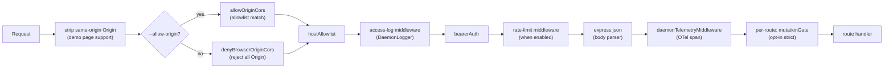
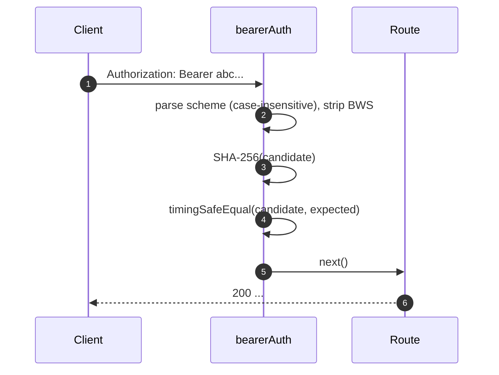
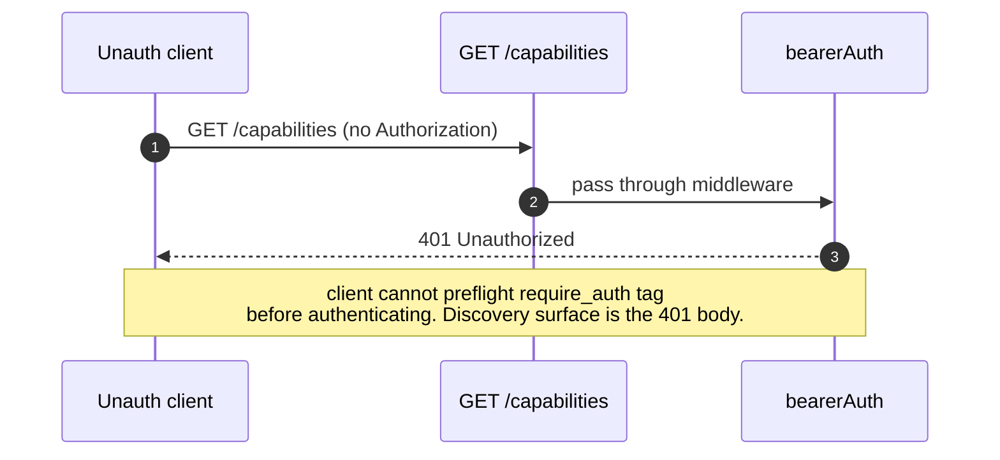
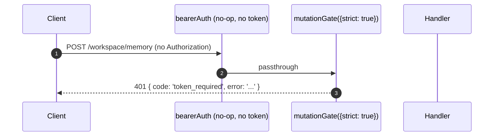

```markdown
# Authentifizierungs- & Sicherheitsmodell

## Überblick

`qwen serve` ist standardmäßig ein lokaler Daemon und bei falscher Konfiguration eine exponierte Oberfläche. Das Sicherheitsmodell ist **geschichtet** aufgebaut, so dass Fehlkonfigurationen im geschlossenen Zustand fehlschlagen:

1. **Bind** – Ein Nicht-Loopback-Bind ohne Bearer-Token **verweigert den Start**.
2. **Bearer-Auth** – `bearerAuth`-Middleware mit konstantem SHA-256-Vergleich schützt jede Route außer `/health` auf Loopback (`require_auth` erweitert dies auch auf Loopback und `/health`).
3. **Host-Allowlist** – Auf Loopback werden nur `localhost`, `127.0.0.1`, `[::1]`, `host.docker.internal` (plus Port) akzeptiert; Abwehr gegen DNS-Rebinding.
4. **Origin-Kontrolle** – Standardmäßig wird jede Anfrage mit `Origin`-Header mit 403 abgelehnt. Wenn `--allow-origin <pattern>` konfiguriert ist, schaltet der Daemon in den CORS-Allowlist-Modus (`allowOriginCors`) und erlaubt nur passende Origins.
5. **Per-Route-Mutations-Gate** – Mutierende Routes der Welle 4 können sich selbst bei Loopback für `401`-Antworten entscheiden, wenn kein Token konfiguriert ist, unter Verwendung eines eindeutigen Fehlers `code: 'token_required'`.
6. **Device-Flow-Auth** – Separate OAuth-Oberfläche für Provider (`POST /workspace/auth/device-flow` + GET/DELETE auf `/:id`).

Dieses Dokument erläutert jede Schicht und die expliziten Invarianten, die der Boot-Pfad durchsetzt.

## Verantwortlichkeiten

- Weigerung, in unsicheren Konfigurationen zu starten.
- Absicherung jeder HTTP-Anfrage durch Bearer (wenn konfiguriert) + Host (Loopback) + Origin-Prüfungen.
- Bereitstellung eines Per-Route-Mutations-Gates, in das sich Routes der Welle 4 einklinken.
- Hosting des Device-Flow-Registers, das Provider-OAuth-Flows antreibt, die über SSE-Events sichtbar sind.

## Architektur

### Bootzeit-Verweigerungsregeln

In `run-qwen-serve.ts`:

```ts
if (!isLoopbackBind(opts.hostname) && !token) {
  throw new Error('Refusing to bind <host>:<port> without a bearer token. ...');
}
if (opts.requireAuth && !token) {
  throw new Error(
    'Refusing to start with --require-auth set but no bearer token configured. ...',
  );
}
```

Die Allow-Origin-Wildcard hat ihre eigene Verweigerungsregel:

```ts
const parsed = parseAllowOriginPatterns(opts.allowOrigins);
if (parsed.allowAny && !token) {
  throw new Error(
    "Refusing to start with --allow-origin '*' but no bearer token configured. ...",
  );
}
```

Alle drei Verweigerungen sind explizite Bootfehler (sichtbar in stderr / werden an den Embedder geworfen), nie stillschweigend. Das Bedrohungsmodell aus #3803 verbietet ausdrücklich, einen Daemon stillschweigend offen über Loopback hinaus zu binden.

### Middleware-Kette (HTTP-Anfragereihenfolge)



`mutationGate` ist eine Per-Route-Middleware-Factory (`createMutationGate` gibt `mutate()` zurück); Routes rufen bei der Registrierung `mutate()` oder `mutate({strict: true})` auf. Es handelt sich nicht um ein globales `app.use()`. Das Access-Logging wird vor `bearerAuth` registriert, so dass auch 401-Ablehnungen protokolliert werden. Das Rate-Limit wird nach `bearerAuth` und vor `express.json()` ausgeführt, so dass nur authentifizierte Anfragen gezählt werden und große Bodies vor dem Parsen abgelehnt werden, wenn ein Limit überschritten wird.

### `bearerAuth`

- **Kein Token konfiguriert** → Middleware ist ein No-Op (Loopback-Entwicklerstandard).
- **Token konfiguriert** → SHA-256 des konfigurierten Tokens einmalig bei der Konstruktion; bei jeder Anfrage wird der Kandidat gehasht und mit `timingSafeEqual` verglichen. Kein String-Vergleich als Shortcut; kein Zeit-Leck.
- **Scheme-Parsing**: Groß-/Kleinschreibung egal `Bearer` gemäß RFC 7235 §2.1; tolerant bei `SP\tHTAB` zwischen Scheme und Credential gemäß RFC 7230 §3.2.6 BWS; lehnt reines HTAB als Trennzeichen ab.
- **CodeQL-Härtung**: Handgeschriebenes `indexOf`-Parsing statt Regex mit `\s+`/`.+`-Überlappung (kein polynomiales Regex-Risiko).

### `hostAllowlist`

Nur Loopback. Unterhält ein `Set<string>`, indiziert nach Port. Erlaubte Hosts:

- `localhost:<port>`, `127.0.0.1:<port>`, `[::1]:<port>`, `host.docker.internal:<port>`.
- Plus portlose Formen (`localhost`, `127.0.0.1`, `[::1]`, `host.docker.internal`) **nur** wenn der Daemon an Port 80 gebunden ist (gemäß RFC 7230 §5.4 Standard-Port-Auslassung).

Host-Vergleich ist **case-insensitive** — Express normalisiert Header-Namen, aber nicht Werte, daher würden Docker-Proxies, die Hosts großschreiben (`Localhost:4170`, `HOST.docker.internal`), bei einem exakten String-Vergleich 403 ergeben.

Nicht-Loopback-Bindings umgehen diese Middleware (der Betreiber wählt die Angriffsfläche; Bearer-Token schützt stattdessen vor Host-Spoofing).

### `denyBrowserOriginCors`

Lehnt jede Anfrage mit einem `Origin`-Header ab. CLI/SDK setzen nie Origin; nur Browser tun das. Gibt deterministisch `403 { error: 'Request denied by CORS policy' }` zurück, statt des 500 HTML, das der Fehler-Callback des `cors`-Pakets produzieren würde.

Ausnahme: Die Same-Origin-XHRs der Demoseite werden von einer separaten Middleware (in `server.ts`) behandelt, die `Origin` entfernt, wenn es mit der eigenen Adresse des Daemons übereinstimmt.

### `allowOriginCors` (`--allow-origin`-Modus)

Wenn `--allow-origin <pattern>` konfiguriert ist, wird `denyBrowserOriginCors` durch `allowOriginCors(parsedPatterns)` ersetzt:

- Passende `Origin`-Werte erhalten `Access-Control-Allow-Origin`, `Access-Control-Allow-Headers` und `Access-Control-Allow-Methods`; `OPTIONS`-Preflight gibt `204` zurück.
- Nicht passende `Origin`-Werte erhalten denselben deterministischen `403 { error: 'Request denied by CORS policy' }` wie im Verweigerungsmodus.
- `--allow-origin '*'` erfordert `--token`; sonst verweigert der Boot.
- `parseAllowOriginPatterns()` validiert die Pattern-Syntax beim Boot.
- Das Capability-Tag `allow_origin` wird nur beworben, wenn dieser Modus konfiguriert ist.

### `createMutationGate`

Per-Route-Opt-in-Gate. Verhaltensmatrix:

| Daemon-Konfiguration      | Routen-Optionen | Ergebnis                         |
| ------------------------- | --------------- | -------------------------------- |
| `requireAuth=true`        | beliebig        | Durchleitung¹                     |
| `token` konfiguriert      | beliebig        | Durchleitung²                     |
| kein Token (Loopback-Dev) | `strict: false` | Durchleitung                      |
| kein Token (Loopback-Dev) | `strict: true`  | `401 { code: 'token_required' }` |

¹ `--require-auth` startet nur mit einem Token, daher würde die globale `bearerAuth` nicht authentifizierte Aufrufer bereits mit 401 abweisen.
² Jede Token-Konfiguration zwingt die globale `bearerAuth` dazu, Bearer überall durchzusetzen; das Gate ist redundant, aber harmlos.

Das `code: 'token_required'`-Format unterscheidet sich von `bearerAuth`s einfachem `Unauthorized`, damit SDK-Clients einen Hinweis "konfiguriere --token / --require-auth" anzeigen können, statt einer generischen 401.

**Strenge Routes der Welle 4+**: `/workspace/memory`, `/workspace/agents/*`,
`/workspace/agents/generate`, `/file/write`, `/file/edit`,
`/workspace/tools/:name/enable`, `/workspace/mcp/:server/restart`,
`/workspace/mcp/:server/{enable,disable,authenticate,clear-auth}`,
`/workspace/mcp/servers` (POST/DELETE), `/workspace/auth/device-flow`,
`/workspace/init`, `/session/:id/approval-mode`.

### `/health`-Ausnahme

Bei Loopback-Bindings wird `/health` **vor** der Bearer-Middleware registriert, so dass Liveness-Probes im Pod kein Token mitführen müssen. Nicht-Loopback-Bindings schützen `/health` wie jede andere Route mit Bearer. `--require-auth` hebt die Ausnahme auf: `/health` erfordert auch auf Loopback `Authorization: Bearer <token>`.

### v1-Clientidentität (`X-Qwen-Client-Id`) ist selbstberichtet

Der Daemon validiert nur das Format von `X-Qwen-Client-Id`
(`[A-Za-z0-9._:-]{1,128}`) und verfolgt beigefügte Client-IDs pro Session. Er führt derzeit keinen Proof-of-Possession durch. Ein Client, der `originatorClientId` per SSE beobachtet, kann dieselbe ID erneut registrieren und diesen Originator bei späteren Anfragen impersonieren.

Auswirkungen:

- `designated` – Ein entfernter Aufrufer kann den Originator impersonieren und bei einer Anfrage abstimmen, die nur für den Prompt-Originator bestimmt war.
- `consensus` – Wenn die gefälschte ID bereits im `votersAtIssue`-Snapshot war, kann sie abstimmen.
- `local-only` ist nicht betroffen, da es auf `fromLoopback` prüft, das vom Daemon aus der entfernten Verbindungsadresse gesetzt wird.
- `first-responder` ist nicht betroffen, da es identitätsunabhängig ist.

Ein zukünftiger Pair-Token-Mechanismus wird ein pro Session eindeutiges Geheimnis aus `POST /session` ausstellen; `designated`/`consensus`-Stimmen müssen es dann vorweisen. Bis dahin sollten Bereitstellungen, die eine gehärtete Designated-Policy benötigen, entweder Loopback binden oder hinter einem authentifizierten Reverse-Proxy laufen. Siehe [`04-permission-mediation.md`](./04-permission-mediation.md) für details auf Policy-Ebene.

### Device-Flow-Auth

Separate OAuth-Oberfläche für Provider-Authentifizierung. Die v1-Provider-ID ist `qwen-oauth`, aber der Qwen OAuth Free-Tier wurde am 15.04.2026 eingestellt; neue Einrichtungen sollten einen derzeit unterstützten Auth-Provider verwenden, sofern verfügbar.

- `POST /workspace/auth/device-flow` – Startet einen Flow; gibt `{deviceFlowId, providerId, expiresAt, verificationUrl, userCode}` zurück.
- `GET /workspace/auth/device-flow/:id` – Fragt Status ab.
- `DELETE /workspace/auth/device-flow/:id` – Bricht ab.
- `GET /workspace/auth/status` – Momentaufnahme des aktuellen Kontos/Providers.

SSE-Events `auth_device_flow_{started, throttled, authorized, failed, cancelled}` verteilen den Flow-Status an alle Abonnenten, damit Multi-Client-UIs synchron bleiben. Siehe [`09-event-schema.md`](./09-event-schema.md).

Implementierung: `packages/cli/src/serve/auth/device-flow.ts` + `qwen-device-flow-provider.ts`.

**Log-Injection / Trojan-Source-Abwehr**: `sanitizeForStderr(value)`
(`device-flow.ts`) ersetzt ASCII-Steuerzeichen und Unicode-Steuerzeichen durch
`?`. Ein bösartiger IdP könnte sonst Log-Zeilen fälschen oder Payloads verstecken:

| Bereich                         | Warum entfernt                                                                                                                                                                                                                                                       |
| ------------------------------- | -------------------------------------------------------------------------------------------------------------------------------------------------------------------------------------------------------------------------------------------------------------------- |
| `\x00–\x1f`, `\x7f`, `\x80–\x9f` | ASCII C0 / DEL / C1-Steuerzeichen, Terminal-Escapes und Log-Zeilen-Fälschung.                                                                                                                                                                                        |
| U+200B-U+200F                   | Zero-Breite-Zeichen plus LRM / RLM; unsichtbar, können aber die Terminaldarstellung ändern.                                                                                                                                                                          |
| U+2028-U+2029                   | LINE / PARAGRAPH SEPARATOR; viele Unicode-fähige Terminals behandeln sie als Zeilenumbrüche.                                                                                                                                                                         |
| U+202A-U+202E                   | Bidirektionale EMBEDDING / OVERRIDE-Steuerzeichen.                                                                                                                                                                                                                    |
| U+2066-U+2069                   | Bidirektionale ISOLATE-Steuerzeichen (LRI / RLI / FSI / PDI), der Hauptvektor von [CVE-2021-42574 "Trojan Source"](https://trojansource.codes/). Ein IdP, der U+2066 (LRI) statt U+202D (LRO) verwendet, kann EMBEDDING/OVERRIDE-Filter mit ähnlicher visueller Umordnung umgehen. |
| U+FEFF                          | BOM / Zero-Breite no-break space.                                                                                                                                                                                                                                    |

Die Länge bleibt erhalten, indem jedes entfernte Codepoint durch `?` ersetzt wird, sodass Betreiber weiterhin sehen können, dass an dieser Stelle etwas vorhanden war. Beide Schichten verwenden die Bereinigung: `qwenDeviceFlowProvider` bereinigt IdP-`oauthError`, und der Late-Poll-Beobachter des Registers bereinigt vom Provider kontrollierte Werte, die in Audit-Hinweisen interpoliert werden (`latePollResult.kind` / `lateErr.name`).

Das Capability-Tag `auth_device_flow` wird **bedingungslos** beworben; die Routes selbst geben `400 unsupported_provider` zurück, wenn der Daemon einen bestimmten Provider nicht bedienen kann. Die Liste der unterstützten Provider befindet sich auf `/workspace/auth/status` statt auf `/capabilities`, um die Deskriptorform einheitlich zu halten.

## Arbeitsablauf

### Erfolgreiche Bearer-Auth-Anfrage



### Bearer-Auth-Fehlermodi

Alle geben `401 { error: 'Unauthorized' }` zurück (einheitlich bei `missing header` / `wrong scheme` / `wrong token`, damit Sondierung nicht unterscheiden kann).

### `--require-auth`-Schatten



Nach der Authentifizierung bestätigt `caps.features.includes('require_auth')`, dass die Bereitstellung gehärtet ist.

### Welle-4-Mutations-Gate auf tokenlosem Loopback



## Zustand & Lebenszyklus

- Der Bearer-Token wird beim Boot gelesen und getrimmt (Zeilenumbrüche aus `cat token.txt` würden den Vergleich sonst stillschweigend brechen).
- Der Allow-Host-Set wird pro Port gecacht; bei Portänderung neu aufgebaut (ephemeral `0` → echter Port nach `listen`).
- Das Mutations-Gate konstruiert `passthrough` und `strictDenier` einmalig pro App-Build; der Per-Route-Aufruf gibt den gecachten Closure zurück (keine Pro-Anfrage-Allokation).
- Das Device-Flow-Register wird in `shutdown()` Phase 1 entsorgt, so dass ausstehende Flows vor dem HTTP-Tear-Down als `cancelled` aufgelöst werden.

## Abhängigkeiten

- `node:crypto` — `createHash`, `timingSafeEqual`.
- `packages/cli/src/serve/loopback-binds.ts` — `isLoopbackBind`.
- `packages/cli/src/serve/auth/device-flow.ts` — Device-Flow-Zustandsmaschine.
- `@qwen-code/acp-bridge` — Gibt Device-Flow-Events auf dem Pro-Session-SSE-Bus aus.

## Konfiguration

| Quelle          | Parameter                                                                          | Effekt                                                                  |
| --------------- | ---------------------------------------------------------------------------------- | ----------------------------------------------------------------------- |
| Env             | `QWEN_SERVER_TOKEN`                                                                | Bearer-Token (getrimmt).                                                 |
| Flag            | `--token`                                                                          | Bearer-Token (überschreibt Env).                                         |
| Flag            | `--require-auth`                                                                   | Erweitert Bearer auf Loopback + `/health`. Startet nur mit Token.        |
| Flag            | `--hostname`                                                                       | Nicht-Loopback-Bind erfordert `--token` (oder Env).                          |
| Flag            | `--allow-origin <pattern>`                                                         | Wechsel in CORS-Allowlist-Modus. `'*'` erfordert Token.                  |
| Capability-Tags | `require_auth` (bedingt), `auth_device_flow` (immer), `allow_origin` (bedingt) | Siehe [`11-capabilities-versioning.md`](./11-capabilities-versioning.md). |

## Hinweise & bekannte Einschränkungen

- **`--require-auth` verdeckt Feature-Preflight.** Nicht authentifizierte Clients können das `require_auth`-Tag nicht entdecken; ihre Erkennungsoberfläche ist der 401-Body selbst.
- **Reihenfolge Mutations-Gate/Body-Parser**: `mutationGate({strict: true})`-401-Antworten feuern **nachdem** `express.json()` den Body geparst hat. Schlimmster Fall bei einem gesättigten Loopback-Listener: `--max-connections × express.json({limit: '10mb'})` ≈ 2,5 GB transient. Nur Loopback-Angriffsfläche, bewusst akzeptiert.
- **Same-Origin-Origin-Entfernung** in `server.ts` erfolgt _vor_ `denyBrowserOriginCors`. Wenn eine zukünftige Änderung die Entfernung an eine andere Stelle verschiebt, wird die Demoseite brechen.
- **Token-Vergleich erfolgt über den SHA-256-Digest**, nicht über das rohe Token. Reduziert Timing-Lecks, indem variable Längen auf feste Größen verglichen werden.
- Der Daemon führt heute **kein** mTLS, keine Anfragesignatur und keinen Pair-Token-Proof-of-Possession. `--rate-limit` bietet HTTP-Rate-Limiting nach Client-ID/IP; es ist keine Client-Identitätsauthentifizierung.

## Referenzen

- `packages/cli/src/serve/auth.ts` (gesamte Datei)
- `packages/cli/src/serve/run-qwen-serve.ts` (Verweigerungsregeln)
- `packages/cli/src/serve/loopback-binds.ts`
- `packages/cli/src/serve/auth/device-flow.ts`
- `packages/cli/src/serve/auth/qwen-device-flow-provider.ts`
- Benutzerseitiges Bedrohungsmodell: [`../../users/qwen-serve.md`](../../users/qwen-serve.md).
- Wire-Referenz: [`../qwen-serve-protocol.md`](../qwen-serve-protocol.md).
```