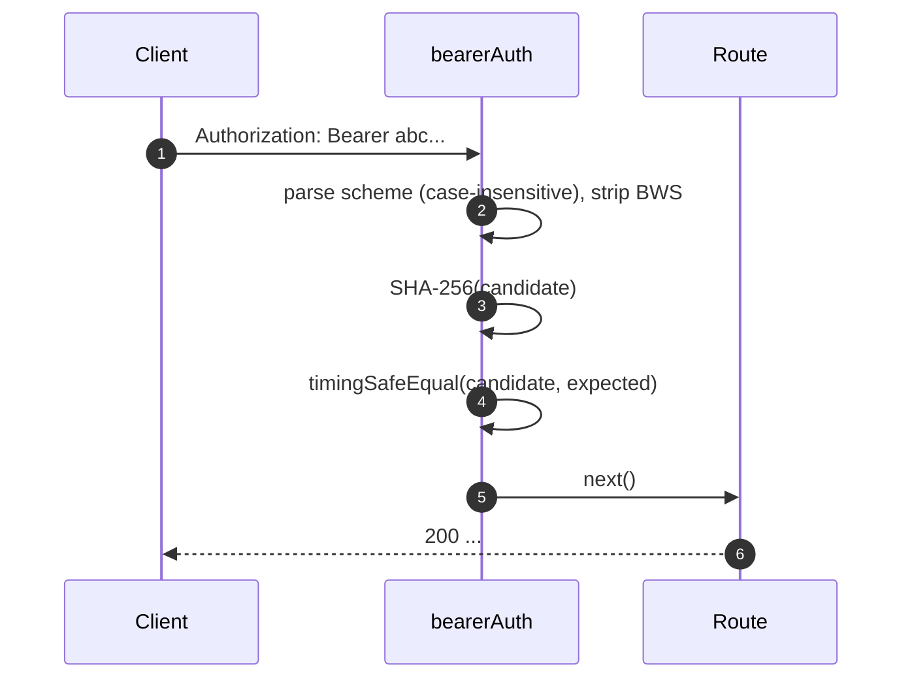
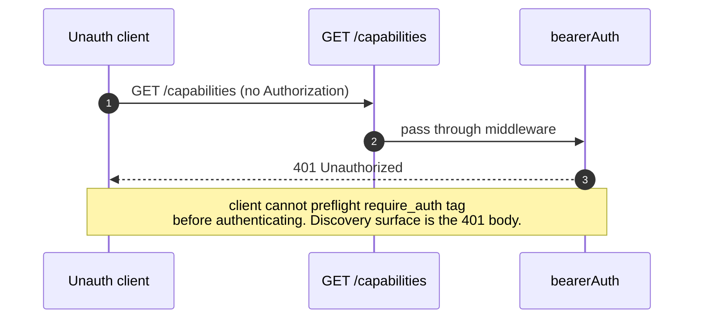
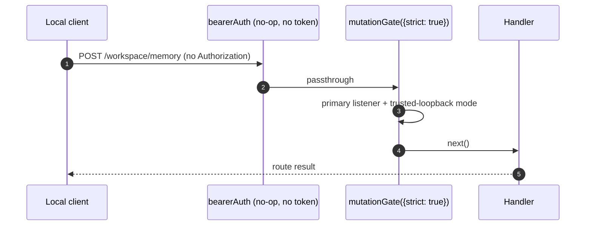

# Authentifizierungs- & Sicherheitsmodell

## Überblick

`qwen serve` ist standardmäßig ein lokaler Daemon und bei falscher Konfiguration eine exponierte Oberfläche. Das Sicherheitsmodell ist **geschichtet** aufgebaut, so dass Fehlkonfigurationen im geschlossenen Zustand fehlschlagen:

1. **Bind** – Ein Nicht-Loopback-Bind trägt immer einen Bearer: den des Operators oder einen ephemeren 128-Bit-Token, der einmalig beim Start generiert und ausgegeben wird. Der Boot verweigert nur, wenn eine bereitgestellte Token-Quelle explizit leer/Whitespace ist oder wenn ein angeforderter `localhost` außerhalb des Loopback aufgelöst wird ohne dass eine Token-Quelle aufgelöst wurde (was niemals generiert).
2. **Bearer-Auth** – `bearerAuth`-Middleware mit konstantem SHA-256-Vergleich schützt normale API-Routes außer `/health` bei einem gewöhnlichen Loopback-Bind (`require_auth` verschiebt auch diesen Endpunkt hinter den Bearer). Channel-Webhook-Eingänge sind eine separate Pre-Bearer-Route, authentifiziert durch `x-qwen-webhook-secret`. Web-Shell-Dokument- und Asset-Routes bleiben in jedem Modus Pre-Auth.
3. **Host-Header-Allowlist** – Auf Loopback werden nur `localhost`, `127.0.0.1`, `[::1]`, `host.docker.internal` oder die exakte gebundene Loopback-Adresse (plus Port) akzeptiert; die entsprechenden Port-losen Formen werden ebenfalls akzeptiert, wenn auf 80 oder 443 gelauscht wird. Die Allowlist wehrt DNS-Rebinding ab. Der Local-Control-LAN-Listener ist die Ausnahme, die immer ihre beworbene-Autorität-Hostprüfung erzwingt, unabhängig vom primären Bind.
4. **Origin-Kontrolle** – Die Runtime-App installiert immer `allowOriginCors` über eine mutable Allowlist (`MutableOriginAllowlist`): Die `--allow-origin <pattern>`-Einträge seeden sie, und Local Control fügt die LAN-Origin hinzu, während es aktiviert ist. Nicht übereinstimmende Origins erhalten den 403-Deny-Envelope. Die bedingungslose deny-Mauer (`denyBrowserOriginCors`) überlebt nur in der Bootstrap-App, die vor dem Start der Runtime antwortet.
5. **Per-Route-Mutations-Gate** – Strenge Routes erfordern Operator-Autorität. Ein tokenloser primärer Loopback-Listener wird vertraut; Bearer-authentifizierte und gepaarte Local-Control-Anfragen qualifizieren sich ebenfalls. Eine tokenlose primäre Anfrage, die dieses Gate ohne vertrauenswürdige Autorität erreicht, erhält den eindeutigen Fehler `code: 'token_required'`. Fehlende oder ungültige konfigurierte Credentials und ungepaarte Local-Control-Credentials werden früher von ihrer Listener-spezifischen Bearer-Middleware mit einfachem `401 Unauthorized` abgelehnt.
6. **Device-Flow-Auth** – Separate OAuth-Oberfläche für Provider (`POST /workspace/auth/device-flow` + GET/DELETE auf `/:id`).

Dieses Dokument erläutert jede Schicht und die expliziten Invarianten, die der Boot-Pfad durchsetzt.

## Verantwortlichkeiten

- Weigerung, in unsicheren Konfigurationen zu starten.
- Normale API-Anfragen durch Bearer absichern, wenn konfiguriert, vorbehaltlich der Loopback-`/health`-Ausnahme; Channel-Webhook-Eingänge hinter ihrem unabhängigen Shared-Secret-Gate halten und Loopback-Host- und Browser-Origin-Prüfungen vor authentifizierten und befreiten Routes halten.
- Ein Per-Route-Mutations-Gate bereitstellen, in das sich Wave-4-Routes einklinken.
- Hosting des Device-Flow-Registers, das Provider-OAuth-Flows antreibt, die über SSE-Events sichtbar sind.

## Architektur

### Bootzeit-Verweigerungsregeln

In `run-qwen-serve.ts`:

```ts
// A non-loopback bind with neither --token nor QWEN_SERVER_TOKEN first
// generates an ephemeral 128-bit base64url bearer (16 random bytes, 22
// URL-safe characters; printed once at startup, rotated per process). The
// first refusal below therefore fires only when a token source was supplied
// but is explicitly empty/whitespace, or when the requested hostname resolves
// off-loopback (localhost pinned to a non-loopback address never generates).
// Generation is loopback-suppressed, so the second refusal is a loopback-only
// fail-fast: on a non-loopback bind the generated token already satisfies
// --require-auth.
if (!isLoopbackBind(opts.hostname) && !token) {
  throw new Error('Refusing to bind <host>:<port> without a bearer token. ...');
}
if (opts.requireAuth && !token) {
  throw new Error(
    'Refusing to start with --require-auth set but no bearer token configured. ...',
  );
}
```

Tokenlose Allow-Origin-Konfiguration ist auf Loopback-HTTP(S)-Origins beschränkt;
nicht-HTTP(S)-Einträge behalten ihre bestehende Behandlung:

```ts
const parsed = parseAllowOriginPatterns(opts.allowOrigins);
if (parsed.allowAny && !token) {
  throw new Error(
    "Refusing to start with --allow-origin '*' but no bearer token configured. ...",
  );
}
if (findNonLoopbackHttpOrigin(parsed) && !token) {
  throw new Error(
    'Refusing to start with a non-loopback HTTP(S) --allow-origin but no bearer token configured. ...',
  );
}
```

Diese Verweigerungen sind explizite Bootfehler (sichtbar in stderr / werden an den Embedder geworfen), nie stillschweigend. Das Bedrohungsmodell aus #3803 verbietet ausdrücklich, einen Daemon stillschweigend offen über Loopback hinaus zu binden.

`runQwenServe()` löst `localhost` einmal auf, pinnt den Listener an diese Adresse und verifiziert die tatsächliche Listener-Adresse vor der Veröffentlichung der vertrauenswürdigen Loopback-Autorität; wenn das Ergebnis außerhalb von `127.0.0.0/8` oder `::1` liegt, schlägt der tokenlose Start fehl und schließt den Listener. `createServeApp()` besitzt kein Socket, daher bleibt sein Aufrufer dafür verantwortlich, dass ein deklarierter Loopback-Hostname nur an Loopback gebunden wird. Ein deklarierter Nicht-Loopback-Embed behält strenge Routes, Session-Shell und Local-Control-Pairing-Material im fail-closed-Zustand. Er lehnt auch `requireAuth: true` ohne ein nicht-leeres Token bei der Konstruktion ab, so dass nicht-strenge Routes nicht versehentlich unter einer ungültigen gehärteten Konfiguration offen bleiben.

### Middleware-Kette (HTTP-Anfragereihenfolge)


```mermaid
flowchart LR
    REQ[Request] --> LS["loopback self-origin strip<br/>(server/self-origin.ts)"]
    LS --> LOG["access-log middleware<br/>(DaemonLogger)"]
    LOG --> TID["inbound trace-id capture"]
    TID --> HA["hostAllowlist<br/>(loopback DNS-rebinding defense;<br/>primary gate passes through on<br/>non-loopback binds, Local Control<br/>keeps its own Host gate)"]
    HA --> SO["remote same-origin check<br/>(credential check + Origin strip)"]
    SO --> AO["allowOriginCors<br/>(mutable allowlist: --allow-origin<br/>patterns + Local Control LAN origin)"]
    AO --> H["pre-auth /health<br/>(loopback, unless --require-auth)"]
    H --> WH{"Channel webhook?"}
    WH -->|yes| WS["x-qwen-webhook-secret<br/>+ webhook rate/body limits"]
    WH -->|no| BA["bearerAuth"]
    BA --> RL["rate-limit middleware<br/>(when enabled)"]
    RL --> JSON["express.json<br/>(body parser)"]
    JSON --> TEL["daemonTelemetryMiddleware<br/>(OTel span)"]
    TEL --> MG["per-route: mutationGate<br/>(opt-in strict)"]
    MG --> HANDLER["route handler"]
```

`mutationGate` ist eine Per-Route-Middleware-Factory (`createMutationGate` gibt
`mutate()` zurück); Routes rufen `mutate()` oder `mutate({strict: true})` bei der Registrierung
auf. Es ist kein globales `app.use()`-Middleware. Access-Logging und Inbound-
Trace-ID-Erfassung werden vor der Origin-Mauer und der Same-Origin-
Credential-Prüfung registriert, so dass diese 403/401-Kurzschlüsse wie jede andere
Ablehnung protokolliert werden und die Log-Zeile weiterhin die Trace-ID des Aufrufers
enthält; beide gehen auch `bearerAuth` voraus, so dass 401-Ablehnungen weiterhin
protokolliert werden. Die Loopback-Host-Allowlist wird vor der Pre-Auth-Health-
Route registriert, so dass die DNS-Rebinding-Abwehr sie abdeckt. Pre-Auth-`/health` sitzt unterhalb
der Origin-Mauer (übereinstimmende Cross-Origin-Probes tragen CORS-Header); das Access-
Log befreit `GET /health` und `POST */heartbeat` nach Pfad vor dem Anhängen seines
Finish-Loggers, so dass exakte Pfad-`GET /health`- und `POST */heartbeat`-Probes
an jeder Mount-Position nicht protokolliert werden und Mauer-Ablehnungen auf diesen befreiten Pfaden
ebenfalls nicht protokolliert werden (`HEAD /health` und `GET /health/` werden wie jede
Anfrage protokolliert). Normales API-Rate-Limiting
läuft nach `bearerAuth` und vor `express.json()`, so dass nur authentifizierte
Anfragen gezählt werden und große Bodies vor dem Parsen abgelehnt werden, wenn ein Limit
überschritten wird. Channel-Webhook-Eingänge zweigen vor der Bearer-Authentifizierung ab und wenden ihre
eigene Shared-Secret-Prüfung, Mutation-Tier-Rate-Prüfung und einen 1-MiB-Parser an.

Die Same-Origin-Oberfläche besteht aus zwei Middlewares in `server/self-origin.ts`, getrennt
montiert: der nur-Loopback `Origin`-Strip wird vor dem Access-Log installiert (er
löscht nur eine übereinstimmende `Origin`, lehnt nie ab), und
`installRemoteSelfOriginMiddleware` läuft unmittelbar vor
`allowOriginCors` auf einem Nicht-Loopback-Primär-Listener mit konfiguriertem Token.
Die Remote-Variante gleicht eine kanonische `Origin` gegen das direkte Socket-Schema
plus die normalisierte `Host`-Autorität ab — Forwarded-Header werden nie konsultiert —
und bearer-authentifiziert die Übereinstimmung vor dem Löschen von `Origin`, so dass die eingebauten
WebShell-Same-Origin-HTTP-Mutationen kein `--allow-origin` benötigen. Sein Pre-Auth-
Prädikat (`web-shell-preauth.ts`) befreit die Shell-Endpunkte (`/`, `//`,
`/assets*`, `/mcp-app-sandbox`, exakte `/session/:id`-Dokument-Navigationen) von
der Credential-Prüfung, weil Browser-Module-Script-Fetches `Origin`
ohne `Authorization` mitführen. WebSocket-Upgrades und TLS-Front-Proxy-`https`-Origins
sind nicht abgedeckt: das Upgrade-Gate behält seine eigene CSWSH-Policy (Loopback-Origin,
`--allow-origin`-Eintrag oder die eigene Origin des Local-Control-Listeners), und eine
Proxy-`https`-Origin kann niemals dem Schema des einfachen Sockets entsprechen.

### `bearerAuth`

- **Kein Token konfiguriert** → Middleware ist ein No-Op (Loopback-Entwicklerstandard). Ausnahme: Der Local-Control-**LAN-Listener** ist listener-spezifisch und erfordert immer sein Pairing-Credential (`CredentialStore.isOpen` ist für `local-control` niemals true), daher ist er auch bei einem Daemon ohne Token niemals offen.
- **Token konfiguriert** → SHA-256 des konfigurierten Tokens einmalig bei der Konstruktion; bei jeder Anfrage wird der Kandidat gehasht und mit `timingSafeEqual` verglichen. Kein String-Vergleich als Shortcut; kein Zeit-Leck.
- **Scheme-Parsing**: Groß-/Kleinschreibung egal `Bearer` gemäß RFC 7235 §2.1; tolerant bei `SP\tHTAB` zwischen Scheme und Credential gemäß RFC 7230 §3.2.6 BWS; lehnt reines HTAB als Trennzeichen ab.
- **CodeQL-Härtung**: Handgeschriebenes `indexOf`-Parsing statt Regex mit `\s+`/`.+`-Überlappung (kein polynomiales Regex-Risiko).

### `hostAllowlist`

Nur Loopback. Unterhält ein `Set<string>`, indiziert nach Port. Erlaubte Hosts:

- `localhost:<port>`, `127.0.0.1:<port>`, `[::1]:<port>`, `host.docker.internal:<port>` und die exakte gebundene Loopback-Adresse mit demselben Port. Die letzte Form deckt den vollständigen unterstützten IPv4-Loopback-Bereich (`127.0.0.0/8`) ab, ohne unbezogene Hosts zuzulassen.
- Plus die entsprechenden Port-losen Formen **nur** wenn an Port 80 oder 443 gebunden (gemäß RFC 7230 §5.4 Standard-Port-Auslassung).

Host-Vergleich ist **case-insensitive** — Express normalisiert Header-Namen, aber nicht Werte, daher würden Docker-Proxies, die Hosts großschreiben (`Localhost:4170`, `HOST.docker.internal`), bei einem exakten String-Vergleich 403 ergeben.

Nicht-Loopback-Bindings umgehen das primäre Gate (der Betreiber wählt die Angriffsfläche; Bearer-Token schützt stattdessen vor Host-Spoofing). Der Local-Control-LAN-Listener ist die Ausnahme: Er erzwingt immer seine beworbene-Autorität-Hostprüfung, unabhängig vom primären Bind.

### `denyBrowserOriginCors` (nur Bootstrap-App)

Lehnt jede Anfrage mit einem `Origin`-Header ab. CLI/SDK setzen nie Origin; nur Browser tun das. Gibt deterministisch `403 { error: 'Request denied by CORS policy' }` zurück, statt des 500 HTML, das der Fehler-Callback des `cors`-Pakets produzieren würde. Die Runtime-App installiert diese Mauer nicht mehr – sie betreibt `allowOriginCors` über die mutable Allowlist (unten); das Deny-Verhalten überlebt dort als nicht-übereinstimmender-Origin-Branch. Die Mauer bleibt in der Bootstrap-App (run-qwen-serve.ts), die Anfragen vor dem Start der Runtime bedient.

Ausnahme: Die Same-Origin-XHRs der WebShell bei einem **Loopback**-Bind werden von einer separaten Middleware (in `server/self-origin.ts`) behandelt, die `Origin` entfernt, wenn es mit einer der kanonischen Loopback-Self-Origins (`127.0.0.1`, `localhost`, `[::1]`, `host.docker.internal`) oder der exakten gebundenen Loopback-Adresse übereinstimmt. Scheme-matched Port-lose Origins werden nur für ihren Standardport akzeptiert (`http` auf 80, `https` auf 443). Bei Nicht-Loopback-Binds deckt eine zweite Middleware (`installRemoteSelfOriginMiddleware`, in derselben Datei) die XHRs der Shell stattdessen ab: sie bearer-authentifiziert eine Anfrage, deren kanonische `Origin` dem direkten Socket-Schema plus der normalisierten `Host`-Autorität entspricht — Forwarded-Header werden nie vertraut — und entfernt diese `Origin` vor der Mauer, so dass diese Anfragen keinen `--allow-origin`-Eintrag benötigen. Cross-Origin- und `null`-Origins werden weiterhin abgelehnt, und die WebSocket-Upgrade-Routen sowie eine TLS-Front-Proxy-`https`-Origin erfordern weiterhin einen (siehe [Middleware-Kette](#middleware-chain-http-request-order)).

### `allowOriginCors` (Runtime-App, immer installiert)

Die Runtime-App installiert `allowOriginCors(originAllowlist)` bedingungslos;
die Allowlist ist eine `MutableOriginAllowlist`, die aus den `--allow-origin
<pattern>`-Einträgen geseedet wird (möglicherweise keine) und zur Laufzeit
erweitert wird, während Local Control aktiviert ist (die LAN-Origin wird mit
dem Listener hinzugefügt/entfernt):

- Passende `Origin`-Werte erhalten `Access-Control-Allow-Origin`,
  `Access-Control-Allow-Headers` und `Access-Control-Allow-Methods`; `OPTIONS`-Preflight gibt `204` zurück.
- Nicht passende `Origin`-Werte erhalten denselben deterministischen `403 { error: 'Request denied by CORS policy' }` wie im Deny-Modus.
- `--allow-origin '*'` erfordert einen Bearer-Token; bei Loopback-Binds verweigert der Boot, wenn keiner konfiguriert ist, während bei Nicht-Loopback-Binds der generierte ephemere Token die Bedingung erfüllt (die Verweigerung ist nur auf Loopback).
- Ohne Token sind HTTP(S)-`--allow-origin`-Werte auf Loopback-Hosts bei Loopback-Binds beschränkt; bei Nicht-Loopback-Binds erfüllt der generierte Token dieselbe Bedingung. Eine Nicht-Loopback-Browser-Origin authentifiziert sich mit dem Bearer auf jeder API-Route, da sie sonst die volle Operator-API ausüben könnte, einschließlich Code-Ausführung als Daemon-Benutzer; die Pre-Auth-Ausnahmen sind die WebShell-Dokument-/Asset-Routes und die MCP-App-Sandbox (`/`, `/assets*`, `/mcp-app-sandbox`, exakte `/session/:id`-Navigationen), sowie der Channel-Webhook-Eingang, der vor `bearerAuth` zweigt und sich mit seinem eigenen `x-qwen-webhook-secret` statt dem Bearer authentifiziert, und — nur bei Loopback-Binds — `/health` (anderweitig Bearer-geschützt).
- Explizite Browser-Erweiterungs-Origin behalten ihren tokenlosen lokalen Automatisierungspfad. Startup-Logs zeigen an, dass jedes tokenlose erlaubte Browser-Origin volle Operator-Autorität erhält.
- `parseAllowOriginPatterns()` validiert die Pattern-Syntax beim Boot.
- Das Capability-Tag `allow_origin` wird nur beworben, wenn dieser Modus konfiguriert ist.

### `createMutationGate`

Per-Route-Opt-in-Gate. Verhaltensmatrix:

| Daemon-/Anfrage-Autorität                                   | Routen-Optionen | Ergebnis                           |
| ----------------------------------------------------------- | --------------- | ---------------------------------- |
| Token konfiguriert                                          | beliebige       | Durchleitung¹                      |
| Vertrauenswürdiger primärer Loopback-Listener               | beliebige       | Durchleitung                       |
| Gepaarter Local-Control-Listener                            | `strict: true`  | Durchleitung                       |
| Tokenlose primäre Anfrage ohne vertrauenswürdige Loopback-Autorität | `strict: true`  | `401 { code: 'token_required' }` |
| Jedes tokenlose Deployment                                  | `strict: false` | Durchleitung                       |

¹ Jede Token-Konfiguration lässt die globale `bearerAuth` Bearer-Auth vor dem Gate auf normalen API-Routes durchsetzen, außer Loopback-`/health` solange `--require-auth` nicht gesetzt ist. Channel-Webhook-Eingänge authentifizieren sich mit ihrem eigenen Shared Secret vor dieser Middleware. Das Gate ist redundant, aber harmlos auf den Routes, die es schützt. `--require-auth` ist selbst keine Authentifizierung und nur mit einem Token gültig.

Der Vertrauenswürdiger-Loopback-Modus wird einmal aus `loopback bind && no configured token && !requireAuth` abgeleitet. Er autorisiert nur Anfragen, die über den primären Listener eintreffen. Er setzt nicht die interne Bearer-authentifizierte Markierung, daher bleiben Listener-Credentials und Deployment-Autorität unterschiedliche Fakten. Die Form `code: 'token_required'` bleibt für ältere Daemons und tokenlose nicht-vertrauenswürdige Embeds, deren Anfragen das strenge Gate erreichen, damit SDK-Clients einen Konfigurationshinweis statt einer generischen 401 anzeigen können. Fehler bei konfigurierten Tokens und Local-Control-Credentials behalten die frühere einfache `401 Unauthorized`-Antwort.

Local-Control-Status- und Enable-Antworten legen ihre Pairing-URL und QR nur für Aufrufer mit Operator-Autorität offen: vertrauenswürdige primäre Listener-Aufrufer, Bearer-authentifizierte primäre Aufrufer und bereits gepaarte LAN-Clients. Ungepaarte LAN-Aufrufer und nicht-vertrauenswürdige Embeds können sie nicht abrufen. Das Aktivieren erfordert weiterhin den primären Listener; LAN-Clients dürfen nach dem Pairing zugreifen oder unter den bestehenden Regeln Deaktivierung anfordern.

**Strenge Routes der Welle 4+**: `/workspace/memory`, `/workspace/agents/*`,
`/workspace/agents/generate`, `/file/write`, `/file/edit`,
`/workspace/tools/:name/enable`, `/workspace/mcp/:server/restart`,
`/workspace/mcp/:server/{enable,disable,authenticate,clear-auth}`,
`/workspace/mcp/servers` (POST/DELETE), `/workspace/auth/device-flow`,
`/workspace/init`, `/session/:id/approval-mode`, `/session/:id/rewind` und
`/session/:id/shell`.

Rewind bleibt auch bei konfiguriertem ACP-Transport REST-only im TypeScript-SDK. Das bewahrt das strenge Mutations-Gate und die Bearer/Client-Identitäts-Header; die ACP-Route-Tabelle hat absichtlich kein Rewind-Mapping. Das Owner-Routing prüft außerdem die Workspace-Trust erneut, bevor entweder Rewind oder Shell eine sekundäre Runtime-Bridge erreicht. Doppelte Live-Session-IDs schlagen fehl als `ambiguous_session_owner`, statt auf die primäre Runtime zurückzufallen.

### `/health`-Ausnahme

Bei Loopback-Bindings wird `/health` **vor** der Bearer-Middleware registriert, so dass Liveness-Probes im Pod kein Token mitführen müssen. Nicht-Loopback-Bindings schützen `/health` wie jede andere Route mit Bearer. `--require-auth` hebt die Ausnahme auf: `/health` erfordert auch auf Loopback `Authorization: Bearer <token>`. Channel-Webhook-Eingänge bleiben in jedem Modus außerhalb der Bearer-Authentifizierung und benötigen ihr eigenes `x-qwen-webhook-secret`.

### v1-Clientidentität (`X-Qwen-Client-Id`) ist selbstberichtet

Der Daemon validiert nur das Format von `X-Qwen-Client-Id`
(`[A-Za-z0-9._:-]{1,128}`) und verfolgt beigefügte Client-IDs pro Session. Er führt derzeit keinen Proof-of-Possession durch. Ein Client, der `originatorClientId` per SSE beobachtet, kann dieselbe ID erneut registrieren und diesen Originator bei späteren Anfragen impersonieren.

Auswirkungen:

- `designated` – Ein entfernter Aufrufer kann den Originator impersonieren und bei einer Anfrage abstimmen, die nur für den Prompt-Originator bestimmt war.
- `consensus` – Wenn die gefälschte ID bereits im `votersAtIssue`-Snapshot war, kann sie abstimmen.
- `local-only` ist nicht betroffen, da es auf `fromLoopback` prüft, das vom Daemon aus der entfernten Verbindungsadresse gesetzt wird.
- `first-responder` ist nicht betroffen, da es identitätsunabhängig ist.

Ein zukünftiger Pair-Token-Mechanismus wird ein pro Session eindeutiges Geheimnis aus `POST /session` ausstellen; `designated`/`consensus`-Stimmen müssen es dann vorweisen. Bis dahin sollten Bereitstellungen, die eine gehärtete Designated-Policy benötigen, entweder Loopback binden oder hinter einem authentifizierten Reverse-Proxy laufen. Siehe [`04-permission-mediation.md`](./04-permission-mediation.md) für Details auf Policy-Ebene.

### Device-Flow-Auth

Separate OAuth-Oberfläche für Provider-Authentifizierung. Die v1-Provider-ID ist `qwen-oauth`, aber der Qwen OAuth Free-Tier wurde am 15.04.2026 eingestellt; neue Einrichtungen sollten einen derzeit unterstützten Auth-Provider verwenden, sofern verfügbar.

- `POST /workspace/auth/device-flow` – Startet einen Flow; gibt `{deviceFlowId, providerId, expiresAt, verificationUrl, userCode}` zurück.
- `GET /workspace/auth/device-flow/:id` – Fragt Status ab.
- `DELETE /workspace/auth/device-flow/:id` – Bricht ab.
- `GET /workspace/auth/status` – Momentaufnahme des aktuellen Kontos/Providers.

SSE-Events `auth_device_flow_{started, throttled, authorized, failed, cancelled}` verteilen den Flow-Status an alle Abonnenten, damit Multi-Client-UIs synchron bleiben. Siehe [`09-event-schema.md`](./09-event-schema.md).

Implementierung: `packages/cli/src/serve/auth/device-flow.ts` + `qwen-device-flow-provider.ts`.

**Log-Injection / Trojan-Source-Abwehr**: `sanitizeForStderr(value)`
(`device-flow.ts`) ersetzt ASCII-Steuerzeichen und Unicode-Steuerzeichen durch
`?`. Ein bösartiger IdP könnte sonst Log-Zeilen fälschen oder Payloads verstecken:

| Bereich                         | Warum entfernt                                                                                                                                                                                                                                                       |
| ------------------------------- | -------------------------------------------------------------------------------------------------------------------------------------------------------------------------------------------------------------------------------------------------------------------- |
| `\x00–\x1f`, `\x7f`, `\x80–\x9f` | ASCII C0 / DEL / C1-Steuerzeichen, Terminal-Escapes und Log-Zeilen-Fälschung.                                                                                                                                                                                        |
| U+200B-U+200F                   | Zero-Breite-Zeichen plus LRM / RLM; unsichtbar, können aber die Terminaldarstellung ändern.                                                                                                                                                                          |
| U+2028-U+2029                   | LINE / PARAGRAPH SEPARATOR; viele Unicode-fähige Terminals behandeln sie als Zeilenumbrüche.                                                                                                                                                                         |
| U+202A-U+202E                   | Bidirektionale EMBEDDING / OVERRIDE-Steuerzeichen.                                                                                                                                                                                                                    |
| U+2066-U+2069                   | Bidirektionale ISOLATE-Steuerzeichen (LRI / RLI / FSI / PDI), der Hauptvektor von [CVE-2021-42574 "Trojan Source"](https://trojansource.codes/). Ein IdP, der U+2066 (LRI) statt U+202D (LRO) verwendet, kann EMBEDDING/OVERRIDE-Filter mit ähnlicher visueller Umordnung umgehen. |
| U+FEFF                          | BOM / Zero-Breite no-break space.                                                                                                                                                                                                                                    |

Die Länge bleibt erhalten, indem jedes entfernte Codepoint durch `?` ersetzt wird, sodass Betreiber weiterhin sehen können, dass an dieser Stelle etwas vorhanden war. Beide Schichten verwenden die Bereinigung: `qwenDeviceFlowProvider` bereinigt IdP-`oauthError`, und der Late-Poll-Beobachter des Registers bereinigt vom Provider kontrollierte Werte, die in Audit-Hinweisen interpoliert werden (`latePollResult.kind` / `lateErr.name`).

Das Capability-Tag `auth_device_flow` wird **bedingungslos** beworben; die Routes selbst geben `400 unsupported_provider` zurück, wenn der Daemon einen bestimmten Provider nicht bedienen kann. Die Liste der unterstützten Provider befindet sich auf `/workspace/auth/status` statt auf `/capabilities`, um die Deskriptorform einheitlich zu halten.

## Arbeitsablauf

### Erfolgreiche Bearer-Auth-Anfrage


```mermaid
sequenceDiagram
    autonumber
    participant C as Client
    participant BA as bearerAuth
    participant R as Route

    C->>BA: Authorization: Bearer abc...
    BA->>BA: parse scheme (case-insensitive), strip BWS
    BA->>BA: SHA-256(candidate)
    BA->>BA: timingSafeEqual(candidate, expected)
    BA->>R: next()
    R-->>C: 200 ...
```

### Bearer-Auth-Fehlermodi

Alle geben `401 { error: 'Unauthorized' }` zurück (einheitlich bei `missing header` / `wrong scheme` / `wrong token`, damit Sondierung nicht unterscheiden kann).

### `--require-auth`-Schatten


```mermaid
sequenceDiagram
    autonumber
    participant C as Unauth client
    participant CAPS as GET /capabilities
    participant BA as bearerAuth

    C->>CAPS: GET /capabilities (no Authorization)
    CAPS->>BA: pass through middleware
    BA-->>C: 401 Unauthorized
    Note over C,BA: client cannot preflight require_auth tag<br/>before authenticating. Discovery surface is the 401 body.
```

Nach der Authentifizierung bestätigt `caps.features.includes('require_auth')`, dass die Bereitstellung gehärtet ist.

### Strikte Mutation auf vertrauenswürdigem Loopback


```mermaid
sequenceDiagram
    autonumber
    participant C as Local client
    participant BA as bearerAuth (no-op, no token)
    participant MG as mutationGate({strict: true})
    participant R as Handler

    C->>BA: POST /workspace/memory (no Authorization)
    BA->>MG: passthrough
    MG->>MG: primary listener + trusted-loopback mode
    MG->>R: next()
    R-->>C: route result
```

## Zustand & Lebenszyklus

- Der Bearer-Token wird beim Boot gelesen und getrimmt (Zeilenumbrüche aus `cat token.txt` würden den Vergleich sonst stillschweigend brechen).
- Der CLI-exklusive `--open-with-auth`-Modus läuft vor dem Boot: Nach deterministischen Loopback/WebShell-Prüfungen wendet er dieselbe Option-über-Umgebung-Auswahl an und füllt `ServeOptions.token` mit 32 zufälligen Bytes, kodiert als Base64url, nur wenn kein nicht-leeres ausgewähltes Token existiert. Das generierte Credential hat Prozesslebensdauer, wird nicht in `process.env` geschrieben oder vom Daemon persistiert und erreicht den Browser über das bestehende URL-Fragment. Die WebShell behält ihre Browser-Kopie im `sessionStorage` pro Tab. Bare `--open` und direkte `runQwenServe()`-Aufrufer generieren es niemals.
- Das Allow-Host-Set wird pro Port gecacht; bei Portänderung neu aufgebaut (ephemeral `0` → echter Port nach `listen`).
- Das Mutations-Gate konstruiert `passthrough` und `strictDenier` einmalig pro App-Build; der Per-Route-Aufruf gibt den gecachten Closure zurück (keine Pro-Anfrage-Allokation).
- Das Device-Flow-Register wird in `shutdown()` Phase 1 entsorgt, so dass ausstehende Flows vor dem HTTP-Tear-Down als `cancelled` aufgelöst werden.

## Abhängigkeiten

- `node:crypto` — `createHash`, `timingSafeEqual`.
- `packages/cli/src/serve/loopback-binds.ts` — `isLoopbackBind`.
- `packages/cli/src/serve/auth/device-flow.ts` — Device-Flow-Zustandsmaschine.
- `@qwen-code/acp-bridge` — Gibt Device-Flow-Events auf dem Pro-Session-SSE-Bus aus.

## Konfiguration

| Quelle          | Parameter                                                                          | Effekt                                                                  |
| --------------- | ---------------------------------------------------------------------------------- | ----------------------------------------------------------------------- |
| Env             | `QWEN_SERVER_TOKEN`                                                                | Bearer-Token (getrimmt).                                                 |
| Flag            | `--token`                                                                          | Bearer-Token (überschreibt Env).                                         |
| CLI-Flags       | `--open-with-auth`                                                                 | Wiederverwendung oder Generierung eines Loopback-WebShell-Bearer-Tokens vor dem Daemon-Boot. |
| Flag            | `--require-auth`                                                                   | Erweitert Bearer auf Loopback + `/health`. Startet nur mit Token.        |
| Flag            | `--hostname`                                                                       | Nicht-Loopback-Bind trägt immer einen Bearer — `--token`, `QWEN_SERVER_TOKEN` oder einen generierten ephemeren Token; eine explizit leere Quelle verweigert.                          |
| Flag            | `--allow-origin <pattern>`                                                         | Wechsel in CORS-Allowlist-Modus. Wildcard- und Nicht-Loopback-HTTP(S)-Origins erfordern ein Token. |
| Capability-Tags | `require_auth` (bedingt), `auth_device_flow` (immer), `allow_origin` (bedingt) | Siehe [`11-capabilities-versioning.md`](./11-capabilities-versioning.md). |

## Hinweise & bekannte Einschränkungen

- **`--require-auth` verdeckt Feature-Preflight.** Nicht authentifizierte Clients können das `require_auth`-Tag nicht entdecken; ihre Erkennungsoberfläche ist der 401-Body selbst.
- **Reihenfolge Mutations-Gate/Body-Parser**: `mutationGate({strict: true})`-401-Antworten feuern **nachdem** `express.json()` den Body geparst hat. Schlimmster Fall bei einem gesättigten Listener: `--max-connections × express.json({limit: '10mb'})` ≈ 2,5 GB transient. Nicht-Loopback-Produktions-Entry-Points erfordern bereits Bearer-Auth vor dem normalen API-Parser; Channel-Webhook-Eingänge prüfen stattdessen ihr Shared Secret vor ihrem separaten 1-MiB-Parser. Direkte nicht-vertrauenswürdige Embeds besitzen ihre Listener-Exposition.
- **Same-Origin-Origin-Entfernung** in `server.ts` erfolgt _vor_ `allowOriginCors`. Wenn eine zukünftige Änderung die Entfernung an eine andere Stelle verschiebt, wird die WebShell brechen.
- **Token-Vergleich erfolgt über den SHA-256-Digest**, nicht über das rohe Token. Reduziert Timing-Lecks, indem variable Längen auf feste Größen verglichen werden.
- Der Daemon trägt heute **kein** mTLS, keine Request-Signatur und keinen Pair-Token-Proof-of-Possession. `--rate-limit` bietet HTTP-Rate-Limiting nach Client-ID/IP-Schlüssel; es ist keine Client-Identitätsauthentifizierung.

## Referenzen

- `packages/cli/src/serve/auth.ts` (gesamte Datei)
- `packages/cli/src/serve/run-qwen-serve.ts` (Verweigerungsregeln)
- `packages/cli/src/serve/loopback-binds.ts`
- `packages/cli/src/serve/auth/device-flow.ts`
- `packages/cli/src/serve/auth/qwen-device-flow-provider.ts`
- Benutzerseitiges Bedrohungsmodell: [`../../users/qwen-serve.md`](../../users/qwen-serve.md).
- Wire-Referenz: [`../qwen-serve-protocol.md`](../qwen-serve-protocol.md).