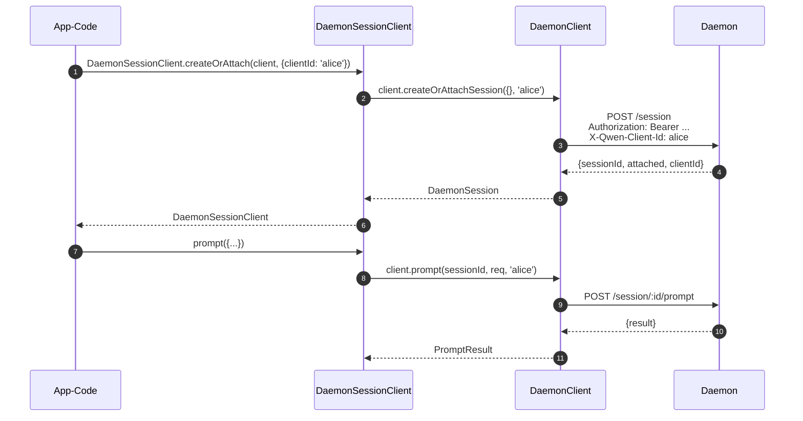
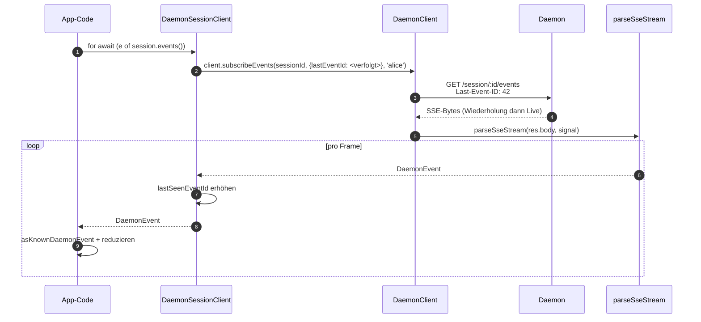
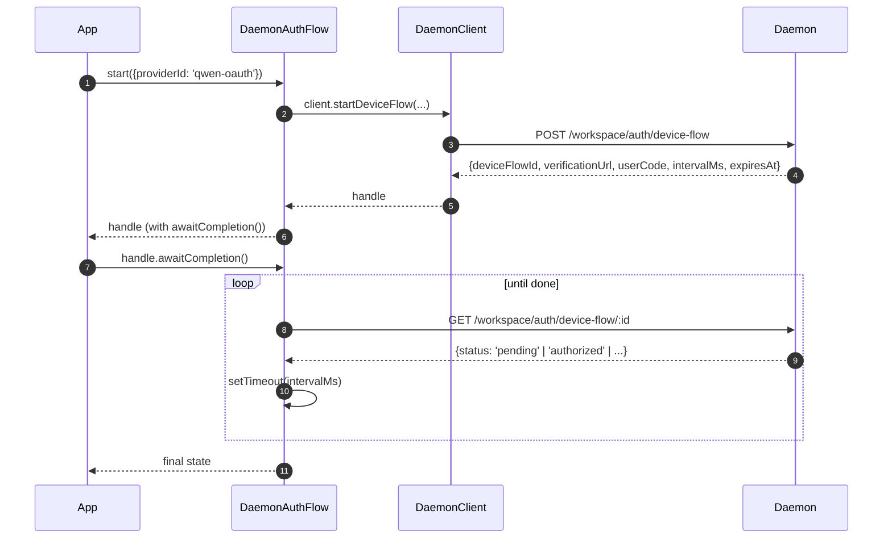

# TypeScript SDK Daemon Client

## Übersicht

`packages/sdk-typescript/src/daemon/` ist der **Daemon-Client des TypeScript SDKs**. Es ist die kanonische Methode, um von einem beliebigen TypeScript-/JavaScript-Host (dem eigenen TUI-Adapter des CLI, Channel-Bot-Backends, dem VS-Code-IDE-Begleiter, benutzerdefinierten Skripten und serverseitigen Web-Backends) eine Verbindung zu einem laufenden `qwen serve`-Daemon herzustellen. Alle anderen Adapter hängen davon ab.

Das Paketlayout ist absichtlich klein gehalten:

| Datei                    | Oberfläche                                                                                                                                                                                                               |
| ------------------------ | ------------------------------------------------------------------------------------------------------------------------------------------------------------------------------------------------------------------------ |
| `index.ts`               | Öffentlicher Barrel (`DaemonClient`, `DaemonSessionClient`, `DaemonAuthFlow`, `parseSseStream`, Ereignis-Reducer, Typen).                                                                                                |
| `DaemonClient.ts`        | Low-Level-HTTP/SSE-Fassade – eine Methode pro Route aus `qwen-serve-protocol.md`.                                                                                                                                        |
| `DaemonSessionClient.ts` | Sitzungsbezogener Wrapper mit SSE-Wiederholungsverfolgung.                                                                                                                                                               |
| `DaemonAuthFlow.ts`      | High-Level-OAuth-Geräteablauf-Helfer.                                                                                                                                                                                    |
| `sse.ts`                 | `parseSseStream` (NDJSON-/SSE-Framing-Parser).                                                                                                                                                                           |
| `events.ts`              | `asKnownDaemonEvent`, `reduceDaemonSessionEvent`, `reduceDaemonAuthEvent` (siehe [`09-event-schema.md`](./09-event-schema.md)).                                                                                          |
| `types.ts`               | `DaemonCapabilities`, `DaemonSession`, `DaemonEvent`, `PermissionResponse`, `PromptResult`, MCP-/Agent-/Speicher-/Authentifizierungstypen.                                                                               |

Das Walkthrough-Beispiel befindet sich in [`../examples/daemon-client-quickstart.md`](../examples/daemon-client-quickstart.md); dieses Dokument dient als Architektur- und Vertragsreferenz.

## Zuständigkeiten

- Bereitstellung einer TypeScript-Methode pro Daemon-HTTP-Route.
- Korrektes Setzen des Bearer-Tokens und von `X-Qwen-Client-Id` bei jeder Anfrage.
- Zusammenstellung von aufrufspezifischen Timeouts mit einem vom Aufrufer bereitgestellten `AbortSignal` (ohne langlaufende SSE zu beenden).
- Streamen und Parsen von SSE-Frames in typisierte `DaemonEvent`s.
- Verfolgung von `lastSeenEventId` pro Sitzung, sodass Wiederverbindungen korrekt wiederholt werden.
- Bereitstellung einer Geräteablauf-Authentifizierungsoberfläche, die in daemon-bestimmtem Intervall pollt.

## Architektur

### `DaemonClient` (`DaemonClient.ts`)

Konstruktor:

```ts
new DaemonClient({
  baseUrl: string,                  // Standardwert 'http://127.0.0.1:4170'
  token?: string,
  fetch?: typeof globalThis.fetch,  // injizierbar für Tests
  fetchTimeoutMs?: number,          // 0 = deaktiviert; Standardwert DEFAULT_FETCH_TIMEOUT_MS
});
```

Methodengruppen (jede Methode akzeptiert ein optionales `clientId`, um `X-Qwen-Client-Id` zu setzen):

| Gruppe                 | Methoden                                                                                                                                                                                                                             |
| ---------------------- | ------------------------------------------------------------------------------------------------------------------------------------------------------------------------------------------------------------------------------------ |
| Basisoperationen       | `health()`, `capabilities()`, `auth` (träger `DaemonAuthFlow`-Accessor)                                                                                                                                                              |
| Sitzungen              | `createOrAttachSession`, `loadSession`, `resumeSession`, `listSessions`, `closeSession`, `setSessionMetadata`, `getSessionContext`, `getSessionSupportedCommands`, `setSessionApprovalMode`, `setSessionModel`                      |
| Prompting              | `prompt`, `cancel`, `heartbeat`                                                                                                                                                                                                      |
| Ereignisse             | `subscribeEvents` (SSE-Generator), `subscribeEventsStream` (rohe Antwort)                                                                                                                                                            |
| Berechtigungen         | `respondToPermission`, `respondToSessionPermission`                                                                                                                                                                                  |
| Arbeitsbereichs-Snapshots | `getWorkspaceMcp`, `getWorkspaceSkills`, `getWorkspaceProviders`, `getWorkspaceEnv`, `getWorkspacePreflight`                                                                                                                       |
| Arbeitsbereichs-Mutationen | `writeWorkspaceMemory`, `readWorkspaceMemory`, `listWorkspaceAgents`, `getWorkspaceAgent`, `createWorkspaceAgent`, `updateWorkspaceAgent`, `deleteWorkspaceAgent`, `toggleWorkspaceTool`, `restartMcpServer`, `initializeWorkspace` |
| Dateien                | `readFile`, `readFileBytes`, `writeFile`, `editFile`, `listDirectory`, `globPaths`, `statPath`                                                                                                                                       |
| Authentifizierung      | `startDeviceFlow`, `pollDeviceFlow`, `cancelDeviceFlow`, `getAuthStatus`                                                                                                                                                             |
### `fetchWithTimeout`

Jede Anfrage durchläuft `fetchWithTimeout`. Kritische Details:

- **Der Body-Lesevorgang liegt innerhalb des Timer-Bereichs.** Frühere Implementierungen haben den Timer beim Eintreffen der Header gelöscht; wenn ein Proxy mitten im Body ins Stocken geriet, konnte `await res.json()` länger als `fetchTimeoutMs` hängen bleiben. Die aktuelle Form übergibt den Code zum Lesen des Bodys als Callback, sodass der Timer sowohl das Eintreffen der Header als auch den Konsum des Bodys abdeckt.
- **`perCallTimeoutMs`** erlaubt es einem einzelnen Aufruf, den clientweiten Standardwert zu überschreiben. Der sichtbarste Aufrufer ist `restartMcpServer`: Das SDK verwendet `MCP_RESTART_DEFAULT_TIMEOUT_MS = 330_000` (5 Min 30s). Der eigene `MCP_RESTART_TIMEOUT_MS` des Daemons beträgt genau 300s; wenn der Client diesen Wert übernimmt, könnte ein Neustart, der nahe 300s abschließt, den Wettlauf verlieren, während der Daemon seine strukturierte Antwort serialisiert und sendet, was einen falsch-positiven `TimeoutError` verursacht. Die zusätzlichen 30s decken Serialisierung, Netzwerkübertragung und Decodierung auf beiden Seiten ab. Aufrufer, die ein knapperes Budget benötigen, können `timeoutMs` übergeben; die Übergabe von `0` deaktiviert das Timeout.
- **`AbortSignal.any`** kombiniert das vom Aufrufer bereitgestellte Signal mit dem Signal des Pro-Aufruf-Timers, sodass sowohl die Abbrechung durch den Aufrufer als auch das Pro-Aufruf-Timeout sauber abbrechen.
- **`AbortController` + kündbares `setTimeout`** anstelle von `AbortSignal.timeout()`, damit schnell auflösende Anfragen keine ausstehenden Timer in der Ereignisschleife hinterlassen. Der Timer wird in `finally` gelöscht.
- **Streaming-Endpunkte (`subscribeEvents`) umgehen das Timeout** – langlebige SSE dürfen nicht davon beendet werden.

### `DaemonSessionClient` (`DaemonSessionClient.ts`)

Bindet eine Sitzung und verfolgt automatisch `lastSeenEventId`, sodass SSE-Wiederholung und Wiederverbindung ohne zusätzlichen Aufruferzustand funktionieren.

```ts
class DaemonSessionClient {
  readonly client: DaemonClient;
  readonly session: DaemonSession;
  readonly state: DaemonSessionState;
  private lastSeenEventId: number | undefined;

  static createOrAttach(client, req?): Promise<DaemonSessionClient>;
  static load(client, sessionId, req?): Promise<DaemonSessionClient>;
  static resume(client, sessionId, req?): Promise<DaemonSessionClient>;

  events(opts?: DaemonSessionSubscribeOptions): AsyncIterable<DaemonEvent>;
  prompt(req: PromptRequest): Promise<PromptResult>;
  cancel(): Promise<void>;
  respondToPermission(...): Promise<PermissionResponse>;
  setModel(modelServiceId): Promise<SetModelResult>;
  heartbeat(): Promise<HeartbeatResult>;
  setMetadata(metadata): Promise<SessionMetadataResult>;
  close(): Promise<void>;
}
```

`events()` leitet `client.subscribeEvents` mit `resume: true` als Standard weiter – es übergibt die verfolgte `lastSeenEventId`, sodass Wiederverbindungen ab dem Punkt wiedergeben, an dem das vorherige Abonnement aufgehört hat. Jedes ausgegebene Ereignis erhöht `lastSeenEventId`.

### `DaemonAuthFlow` (`DaemonAuthFlow.ts`)

```ts
class DaemonAuthFlow {
  start(opts: { providerId, ... }): Promise<DaemonAuthFlowHandle>;
}
interface DaemonAuthFlowHandle {
  deviceFlowId: string;
  providerId: string;
  expiresAt: string;
  verificationUrl: string;
  userCode: string;
  awaitCompletion(opts?): Promise<DaemonAuthDeviceFlowState>;
  cancel(): Promise<void>;
}
```

`awaitCompletion()` fragt `GET /workspace/auth/device-flow/:id` im vom Daemon bereitgestellten `intervalMs` ab, bis der Flow `authorized`, `failed` oder `cancelled` wird. Es wird träge über `client.auth` konstruiert, sodass Clients, die nie Authentifizierung verwenden, keine Allokationskosten tragen.

### `parseSseStream` (`sse.ts`)

Wandelt einen `Response.body` (`ReadableStream<Uint8Array>`) in `AsyncIterable<DaemonEvent>` um. Behandelt:

- LF- und CRLF-Rahmung.
- Pufferüberlaufgrenze (16 MiB) – defensive Grenze gegen einen Daemon, der einen einzelnen absurd großen Frame sendet.
- AbortSignal-Verdrahtung – Abbruch schließt den Stream und den Iterator.
- Nur-Kommentar-Frames und unbekannte Ereignistypen (werden als `DaemonEvent` durchgereicht; SDK-Konsumenten schränken später via `asKnownDaemonEvent` ein).

### Typen (`types.ts`)

Bemerkenswerte Exporte: `DaemonCapabilities`, `DaemonSession` (`{ sessionId, workspaceCwd, attached, clientId?, createdAt? }`), `DaemonEvent`, `DaemonSessionState`, `DaemonSessionContextStatus`, `DaemonSessionSupportedCommandsStatus`, `PermissionResponse`, `PromptResult`, `HeartbeatResult`, `SetModelResult`, `SessionMetadataResult`, plus MCP-/Agent-/Memory-/Auth-Ergebnistypen.

## Arbeitsablauf

### Erstellen-oder-Anhängen + erste Aufforderung



### Abonnieren mit Wiederholung


### Device-flow-Authentifizierung



`qwen-oauth` ist der alte v1-Provider-Bezeichner. Der kostenlose Qwen-OAuth-Tarif wurde am 15.04.2026 eingestellt. Neue Clients sollten daher, wenn verfügbar, einen aktuell unterstützten Authentifizierungsanbieter bevorzugen.

## Zustand & Lebenszyklus

- `DaemonClient` ist verbindungslos; bei der Instanzerstellung passiert nichts. Jede Methode öffnet einen neuen `fetch`-Aufruf.
- `DaemonSessionClient` merkt sich `lastSeenEventId` über mehrere `events()`-Aufrufe hinweg; bei erneuter Verbindung wird ab dem zuletzt gesehenen Ereignis wiedergegeben.
- `DaemonAuthFlow` ist träge – `client.auth` erzeugt es erst beim ersten Zugriff.
- Der SSE-Iterator schließt, wenn (a) der Daemon den Stream beendet, (b) `AbortSignal.abort()` ausgelöst wird, (c) der Konsument die `for await`-Schleife verlässt oder (d) die Pufferüberlaufgrenze (16 MiB) erreicht ist.

## Abhängigkeiten

- `globalThis.fetch` (Node 18+ integriert, Browser, undici usw.). Kann pro `DaemonClient` für Tests injiziert werden.
- Native `AbortController` / `AbortSignal.any` / `setTimeout`.
- Keine transitiven Abhängigkeiten von `@qwen-code/qwen-code-core` oder `@qwen-code/acp-bridge` – das SDK-Paket ist vollständig entkoppelt, sodass externe Konsumenten keine Interna des Daemons importieren.

## `ui/*`-Unterpaket ([#4328](https://github.com/QwenLM/qwen-code/pull/4328) + [#4353](https://github.com/QwenLM/qwen-code/pull/4353))

Das SDK exportiert außerdem `packages/sdk-typescript/src/daemon/ui/`, einen host-neutralen Satz an Primitiven, die Daemon-Ereignisse in Transkript-Blöcke umwandeln:

- `normalizeDaemonEvent(evt)` bildet die 43 bekannten Daemon-Wire-Events auf 37 UI-freundliche `DaemonUiEventType`-Werte ab; nicht modellierte oder fehlerhafte Ereignisse werden zu `debug` normalisiert.
- `createDaemonTranscriptState()` zusammen mit `reduceDaemonTranscriptEvents(state, events)` projiziert UI-Ereignisse in `DaemonTranscriptBlock[]`.
- `createDaemonTranscriptStore()` kapselt `subscribe`/`dispatch`.
- `render.ts` / `terminal.ts` bieten HTML- und Terminal-Basisrenderer, während `toolPreview.ts` Tool-Call-Zusammenfassungen erzeugt.
- Selektoren umfassen `selectTranscriptBlocksOrderedByEventId`, `selectPendingPermissionBlocks`, `selectCurrentTool`, `selectApprovalMode`, `selectToolProgress`, `selectSubagentChildBlocks`, `formatMissedRange` und `formatBlockTimestamp`.
- Öffentliche Konstanten enthalten `DAEMON_PLAN_TOOL_CALL_ID`.
- `conformance.ts` enthält die plattformübergreifende Konsistenz-Testsuite.

Der erste Produktionseinsatz ist in `packages/webui/src/daemon/` über Reacts `DaemonSessionProvider`. Siehe [`14-cli-tui-adapter.md`](./14-cli-tui-adapter.md) für die detaillierte Architektur, das Glossar, die Selektortabelle und die Beziehung zum alten `DaemonTuiAdapter`.

Das Unterpaket wird aus dem Subpfad `@qwen-code/sdk/daemon` exportiert. Vorhandener Code mit `import { DaemonClient }` ist davon nicht betroffen.

## Konfiguration

| Stellschraube       | Wo                                     | Effekt                                                                                  |
| ------------------- | -------------------------------------- | --------------------------------------------------------------------------------------- |
| `baseUrl`           | `DaemonClient`-Konstruktor             | Daemon-URL; abschließende Schrägstriche werden entfernt.                                |
| `token`             | `DaemonClient`-Konstruktor             | Wird als `Authorization: Bearer` gesetzt.                                               |
| `fetch`             | `DaemonClient`-Konstruktor             | Test-Injektionspunkt.                                                                   |
| `fetchTimeoutMs`    | `DaemonClient`-Konstruktor             | Timeout pro Aufruf; `0` = deaktiviert.                                                  |
| `clientId`          | optionales Argument pro Methode        | `X-Qwen-Client-Id`-Header (siehe [`08-session-lifecycle.md`](./08-session-lifecycle.md)). |
| `lastEventId`       | `DaemonSessionClient`-Konstruktor      | Cursor für Wiedergabestart.                                                             |
| `maxQueued`         | Option pro Abonnement                  | `?maxQueued=N` für die SSE-Route; zuerst `caps.features.slow_client_warning` prüfen.    |
| `perCallTimeoutMs`  | pro Methode (z. B. `restartMcpServer`) | Überschreibt das client-weite Timeout.                                                  |

## Einschränkungen & bekannte Grenzen

- **`fetchTimeoutMs` gilt pro Aufruf, nicht auf Verbindungsebene.** Lange Body-Reads teilen sich denselben Timer. Ein Daemon, der Antworten streamt, muss das Timeout pro Aufruf überschreiben oder auf `0` setzen.
- **SSE umgeht das Fetch-Timeout** – langlebige SSE-Verbindungen werden nicht durch `fetchTimeoutMs` beendet. Verwenden Sie `AbortSignal` für eine vom Aufrufer gesteuerte Abbrechung.
- **`parseSseStream`-Puffergrenze beträgt 16 MiB** als defensive Obergrenze. Ein einzelner Frame, der größer ist, bricht den Iterator ab (der Daemon sendet legitimerweise nie solche Frames).
- **`asKnownDaemonEvent` gibt `undefined` für unbekannte Ereignistypen zurück.** SDK-Konsumenten müssen diesen Zweig behandeln, anstatt von einer vollständigen Vereinigung auszugehen; das ist der Abwärtskompatibilitätsvertrag. Unerkannte Ereignisse erhöhen `DaemonSessionViewState.unrecognizedKnownEventCount`.
- **`client_evicted`, `slow_client_warning`, `stream_error` befinden sich nicht im Wiedergabe-Ring.** Eine erneute Verbindung nach einer Verdrängung setzt am Ring des Daemons an; der Verdrängungsframe wird nicht erneut angezeigt.
- **`DaemonClient` wiederholt nicht automatisch.** Netzwerkfehler führen zu Ablehnungen; die Strategie für erneute Verbindung/Wiedergabe liegt in der Verantwortung des Aufrufers (`DaemonSessionClient.events()` erleichtert die Wiedergabe, aber die erneute Verbindung erfolgt weiterhin pro Aufruf).
## Referenzen

- `packages/sdk-typescript/src/daemon/DaemonClient.ts`
- `packages/sdk-typescript/src/daemon/DaemonSessionClient.ts`
- `packages/sdk-typescript/src/daemon/DaemonAuthFlow.ts`
- `packages/sdk-typescript/src/daemon/sse.ts`
- `packages/sdk-typescript/src/daemon/events.ts`
- `packages/sdk-typescript/src/daemon/types.ts`
- End-to-End-Durchlauf: [`../examples/daemon-client-quickstart.md`](../examples/daemon-client-quickstart.md).
