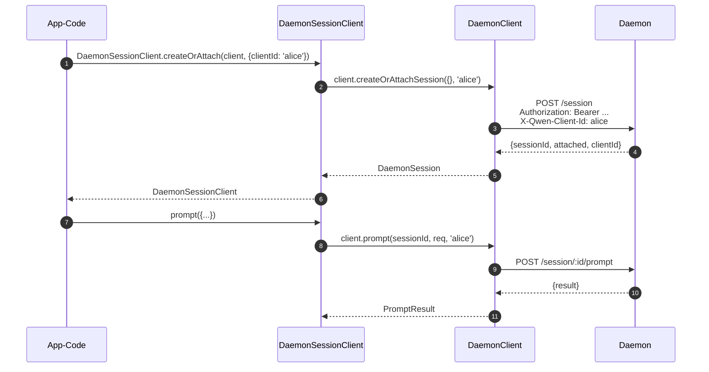
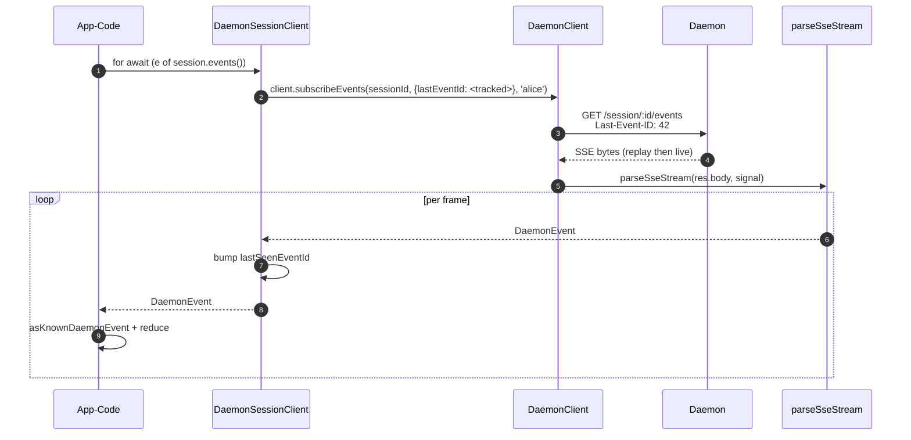
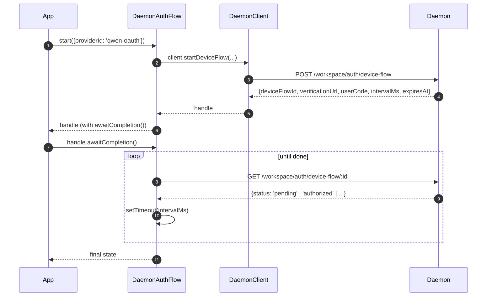

# TypeScript SDK Daemon Client

## Übersicht

`packages/sdk-typescript/src/daemon/` ist der **Daemon Client des TypeScript SDK**. Er ist der kanonische Weg, um sich von einem beliebigen TypeScript-/JavaScript-Host (dem eigenen TUI-Adapter der CLI, Channel-Bot-Backends, dem VS Code IDE Companion, benutzerdefinierten Skripten und serverseitigen Web-Backends) mit einem laufenden `qwen serve` Daemon zu verbinden. Alle anderen Adapter hängen von ihm ab.

Das Paket-Layout ist absichtlich klein gehalten:

| Datei                    | Oberfläche                                                                                                                       |
| ------------------------ | -------------------------------------------------------------------------------------------------------------------------------- |
| `index.ts`               | Öffentlicher Barrel (`DaemonClient`, `DaemonSessionClient`, `DaemonAuthFlow`, `parseSseStream`, Event-Reducer, Typen).           |
| `DaemonClient.ts`        | Low-Level-HTTP/SSE-Fassade – eine Methode pro Route in `qwen-serve-protocol.md`.                                                 |
| `DaemonSessionClient.ts` | Sitzungsbezogener Wrapper mit SSE-Replay-Tracking.                                                                               |
| `DaemonAuthFlow.ts`      | High-Level-OAuth-Device-Flow-Helfer.                                                                                             |
| `sse.ts`                 | `parseSseStream` (NDJSON-/SSE-Framing-Parser).                                                                                   |
| `events.ts`              | `asKnownDaemonEvent`, `reduceDaemonSessionEvent`, `reduceDaemonAuthEvent` (siehe [`09-event-schema.md`](./09-event-schema.md)).  |
| `types.ts`               | `DaemonCapabilities`, `DaemonSession`, `DaemonEvent`, `PermissionResponse`, `PromptResult`, MCP-/Agent-/Memory-/Auth-Typen.     |

Das Walkthrough-Beispiel befindet sich unter [`../examples/daemon-client-quickstart.md`](../examples/daemon-client-quickstart.md); dieses Dokument ist die Architektur- und Vertragsreferenz.

## Verantwortlichkeiten

- Bereitstellung einer TypeScript-Methode pro Daemon-HTTP-Route.
- Korrektes Anhängen des Bearer-Tokens + `X-Qwen-Client-Id` an jede Anfrage.
- Kombination von Per-Call-Timeouts mit vom Aufrufer bereitgestellten `AbortSignal` (ohne langlebige SSE zu beenden).
- Streamen und Parsen von SSE-Frames in typisierte `DaemonEvent`s.
- Verfolgung der `lastSeenEventId` pro Sitzung, damit Reconnects korrekt replayen.
- Bereitstellung einer Device-Flow-Auth-Schnittstelle, die in vom Daemon vorgegebenen Intervallen pollt.

## Architektur

### `DaemonClient` (`DaemonClient.ts`)

Konstruktor:

```ts
new DaemonClient({
  baseUrl: string,                  // default 'http://127.0.0.1:4170'
  token?: string,
  fetch?: typeof globalThis.fetch,  // injectable for tests
  fetchTimeoutMs?: number,          // 0 = disabled; default DEFAULT_FETCH_TIMEOUT_MS
});
```

Methodengruppen (jede Methode akzeptiert eine optionale `clientId` zum Setzen von `X-Qwen-Client-Id`):

| Gruppe              | Methoden                                                                                                                                                                                                                          |
| ------------------- | --------------------------------------------------------------------------------------------------------------------------------------------------------------------------------------------------------------------------------- |
| Basisfunktionen     | `health()`, `capabilities()`, `auth` (lazy `DaemonAuthFlow` accessor)                                                                                                                                                             |
| Sessions            | `createOrAttachSession`, `loadSession`, `resumeSession`, `listSessions`, `closeSession`, `setSessionMetadata`, `getSessionContext`, `getSessionSupportedCommands`, `setSessionApprovalMode`, `setSessionModel`                    |
| Prompting           | `prompt`, `cancel`, `heartbeat`                                                                                                                                                                                                   |
| Events              | `subscribeEvents` (SSE generator), `subscribeEventsStream` (raw response)                                                                                                                                                         |
| Berechtigungen      | `respondToPermission`, `respondToSessionPermission`                                                                                                                                                                               |
| Workspace-Snapshots | `getWorkspaceMcp`, `getWorkspaceSkills`, `getWorkspaceProviders`, `getWorkspaceEnv`, `getWorkspacePreflight`                                                                                                                      |
| Workspace-Mutationen| `writeWorkspaceMemory`, `readWorkspaceMemory`, `listWorkspaceAgents`, `getWorkspaceAgent`, `createWorkspaceAgent`, `updateWorkspaceAgent`, `deleteWorkspaceAgent`, `toggleWorkspaceTool`, `restartMcpServer`, `initializeWorkspace`|
| Dateien             | `readFile`, `readFileBytes`, `writeFile`, `editFile`, `listDirectory`, `globPaths`, `statPath`                                                                                                                                    |
| Auth                | `startDeviceFlow`, `pollDeviceFlow`, `cancelDeviceFlow`, `getAuthStatus`                                                                                                                                                          |

### `fetchWithTimeout`

Jede Anfrage durchläuft `fetchWithTimeout`. Wichtige Details:

- **Body-Read liegt innerhalb des Timer-Scopes.** Frühere Implementierungen haben den Timer gestoppt, wenn die Header eintrafen; wenn ein Proxy mitten im Body stockte, konnte `await res.json()` über `fetchTimeoutMs` hinaus hängen. Die aktuelle Form übergibt den Body-lesenden Code als Callback, sodass der Timer sowohl den Header-Empfang ALS AUCH den Body-Verbrauch abdeckt.
- **`perCallTimeoutMs`** ermöglicht es einem einzelnen Aufruf, den clientweiten Standard zu überschreiben. Der sichtbarste Aufrufer ist `restartMcpServer`: Das SDK verwendet `MCP_RESTART_DEFAULT_TIMEOUT_MS = 330_000` (5 Min. 30 Sek.). Das eigene `MCP_RESTART_TIMEOUT_MS` des Daemons beträgt exakt 300s; wenn der Client diesen Wert übernehmen würde, könnte ein Restart, der nahe bei 300s abgeschlossen wird, das Rennen verlieren, während der Daemon seine strukturierte Antwort serialisiert und sendet, was zu einem False-Positive `TimeoutError` führt. Die zusätzlichen 30s decken Serialisierung, Netzwerktransfer und Decodierung auf beiden Seiten ab. Aufrufer, die ein strengeres Budget benötigen, können `timeoutMs` übergeben; `0` deaktiviert den Timeout.
- **`AbortSignal.any`** kombiniert das vom Aufrufer bereitgestellte Signal mit dem Per-Call-Timer-Signal, sodass sowohl der Aufrufer-Abbruch als auch der Per-Call-Timeout sauber abbrechen.
- **`AbortController` + abbrechbares `setTimeout`** anstelle von `AbortSignal.timeout()`, damit schnell abschließende Anfragen keine ausstehenden Timer auf der Event-Loop leaken. Der Timer wird in `finally` gelöscht.
- **Streaming-Endpunkte (`subscribeEvents`) umgehen den Timeout** – langlebige SSE dürfen dadurch nicht beendet werden.

### `DaemonSessionClient` (`DaemonSessionClient.ts`)

Bindet eine Sitzung und verfolgt automatisch die `lastSeenEventId`, sodass SSE-Replay und Reconnect ohne zusätzlichen Aufrufer-State funktionieren.

```ts
class DaemonSessionClient {
  readonly client: DaemonClient;
  readonly session: DaemonSession;
  readonly state: DaemonSessionState;
  private lastSeenEventId: number | undefined;

  static createOrAttach(client, req?): Promise<DaemonSessionClient>;
  static load(client, sessionId, req?): Promise<DaemonSessionClient>;
  static resume(client, sessionId, req?): Promise<DaemonSessionClient>;

  events(opts?: DaemonSessionSubscribeOptions): AsyncIterable<DaemonEvent>;
  prompt(req: PromptRequest): Promise<PromptResult>;
  cancel(): Promise<void>;
  respondToPermission(...): Promise<PermissionResponse>;
  setModel(modelServiceId): Promise<SetModelResult>;
  heartbeat(): Promise<HeartbeatResult>;
  setMetadata(metadata): Promise<SessionMetadataResult>;
  close(): Promise<void>;
}
```

`events()` proxyt `client.subscribeEvents` standardmäßig mit `resume: true` – es übergibt die verfolgte `lastSeenEventId`, damit Reconnects dort replayen, wo das vorherige Abonnement aufgehört hat. Jedes yieldete Event erhöht die `lastSeenEventId`.

### `DaemonAuthFlow` (`DaemonAuthFlow.ts`)

```ts
class DaemonAuthFlow {
  start(opts: { providerId, ... }): Promise<DaemonAuthFlowHandle>;
}
interface DaemonAuthFlowHandle {
  deviceFlowId: string;
  providerId: string;
  expiresAt: string;
  verificationUrl: string;
  userCode: string;
  awaitCompletion(opts?): Promise<DaemonAuthDeviceFlowState>;
  cancel(): Promise<void>;
}
```

`awaitCompletion()` pollt `GET /workspace/auth/device-flow/:id` im vom Daemon vorgegebenen `intervalMs`, bis der Flow `authorized`, `failed` oder `cancelled` wird. Er wird lazy über `client.auth` konstruiert, sodass Clients, die Auth nie anfassen, keine Allokationskosten verursachen.

### `parseSseStream` (`sse.ts`)

Wandelt einen `Response.body` (`ReadableStream<Uint8Array>`) in ein `AsyncIterable<DaemonEvent>` um. Behandelt:

- LF- und CRLF-Framing.
- Buffer-Overflow-Cap (16 MiB) – defensive Grenze gegen einen Daemon, der einen einzelnen absurd großen Frame ausgibt.
- AbortSignal-Verkabelung – Abbruch schließt den Stream und den Iterator.
- Frames nur mit Kommentaren und unbekannte Event-Typen (werden als `DaemonEvent` durchgereicht; SDK-Consumer grenzen sie nachgelagert über `asKnownDaemonEvent` ein).

### Types (`types.ts`)

Bemerkenswerte Exporte: `DaemonCapabilities`, `DaemonSession` (`{ sessionId, workspaceCwd, attached, clientId?, createdAt? }`), `DaemonEvent`, `DaemonSessionState`, `DaemonSessionContextStatus`, `DaemonSessionSupportedCommandsStatus`, `PermissionResponse`, `PromptResult`, `HeartbeatResult`, `SetModelResult`, `SessionMetadataResult` sowie MCP-/Agent-/Memory-/Auth-Result-Typen.

## Workflow

### Create-or-attach + erster Prompt



### Subscribe mit Replay



### Device-Flow-Auth



`qwen-oauth` ist der Legacy-v1-Provider-Identifier. Der kostenlose Qwen OAuth Tier wurde am 15.04.2026 eingestellt, daher sollten neue Clients nach Möglichkeit einen derzeit unterstützten Auth-Provider bevorzugen.

## State & Lifecycle

- `DaemonClient` ist verbindungslos; bei der Konstruktion passiert nichts. Jede Methode öffnet ein frisches `fetch`.
- `DaemonSessionClient` behält die `lastSeenEventId` über `events()`-Aufrufe hinweg; Reconnects replayen ab der zuletzt gesehenen ID.
- `DaemonAuthFlow` ist lazy – `client.auth` konstruiert ihn beim ersten Zugriff.
- Der SSE-Iterator schließt, wenn (a) der Daemon den Stream beendet, (b) `AbortSignal.abort()` feuert, (c) der Consumer aus dem `for await` ausbricht oder (d) das Buffer-Overflow-Limit (16 MiB) erreicht wird.

## Abhängigkeiten

- `globalThis.fetch` (in Node 18+ eingebaut, Browser, undici usw.). Pro `DaemonClient` für Tests injizierbar.
- Native `AbortController` / `AbortSignal.any` / `setTimeout`.
- Keine transitiven Abhängigkeiten von `@qwen-code/qwen-code-core` oder `@qwen-code/acp-bridge` – das SDK-Paket ist vollständig entkoppelt, damit externe Consumer nicht die Interna des Daemons hereinziehen.

## `ui/*`-Subpaket ([#4328](https://github.com/QwenLM/qwen-code/pull/4328) + [#4353](https://github.com/QwenLM/qwen-code/pull/4353))

Das SDK exportiert auch `packages/sdk-typescript/src/daemon/ui/`, eine host-neutrale Menge an Primitiven, die Daemon-Events in Transcript-Blöcke umwandeln:

- `normalizeDaemonEvent(evt)` mappt die 47 bekannten Daemon-Wire-Events auf 42 UI-freundliche `DaemonUiEventType`-Werte; nicht modellierte oder fehlerhafte Events werden auf `debug` normalisiert.
- `createDaemonTranscriptState()` plus `reduceDaemonTranscriptEvents(state, events)` projizieren UI-Events in `DaemonTranscriptBlock[]`.
- `createDaemonTranscriptStore()` kapselt Subscribe / Dispatch.
- `render.ts` / `terminal.ts` stellen HTML- und Terminal-Baseline-Renderer bereit, während `toolPreview.ts` Tool-Call-Zusammenfassungen erzeugt.
- Selektoren umfassen `selectTranscriptBlocksOrderedByEventId`, `selectPendingPermissionBlocks`, `selectCurrentTool`, `selectApprovalMode`, `selectToolProgress`, `selectSubagentChildBlocks`, `formatMissedRange` und `formatBlockTimestamp`.
- Öffentliche Konstanten umfassen `DAEMON_PLAN_TOOL_CALL_ID`.
- `conformance.ts` enthält die Cross-Host-Konsistenz-Testsuite.

Der erste Produktions-Consumer ist `packages/webui/src/daemon/` über Reacts `DaemonSessionProvider`. Siehe [`14-cli-tui-adapter.md`](./14-cli-tui-adapter.md) für die detaillierte Architektur, das Glossar, die Selektor-Tabelle und die Beziehung zum Legacy `DaemonTuiAdapter`.

Das Subpaket wird über den `@qwen-code/sdk/daemon`-Subpfad exportiert. Bestehender Code, der `import { DaemonClient }` verwendet, ist nicht betroffen.

## Last-Event-ID-Reconnect mit dem SDK

### Automatisches Tracking über `DaemonSessionClient`

`DaemonSessionClient` verfolgt die `lastSeenEventId` intern. Jedes yieldete Event mit einer numerischen `id` erhöht den Cursor. Nachfolgende `events()`-Aufrufe übergeben automatisch die verfolgte ID als `Last-Event-ID`, sodass Reconnect-with-Replay ohne zusätzlichen Aufrufer-State funktioniert:

```ts
import { DaemonClient, DaemonSessionClient } from '@qwen-code/sdk/daemon';

const client = new DaemonClient({ baseUrl: 'http://127.0.0.1:4170', token });
const session = await DaemonSessionClient.createOrAttach(client);

// Erstes Abonnement – startet live (oder ab Ring-Start für neue Sessions).
for await (const event of session.events()) {
  console.log(event.type, event.id);
  // session.lastEventId wird bei jedem Frame mit ID erhöht.
  if (shouldStop(event)) break;
}

// Reconnect – sendet automatisch Last-Event-ID: <zuletzt gesehene ID>.
// Der Daemon replayt verpasste Events aus dem Ring und geht dann live.
for await (const event of session.events()) {
  // Replay-Frames kommen zuerst, dann ein synthetisches `replay_complete`,
  // dann Live-Events.
  handleEvent(event);
}
```

### Manueller Reconnect mit `DaemonClient`

Für Low-Level-Kontrolle verwende `DaemonClient.subscribeEvents` direkt und verwalte den Cursor selbst:

```ts
const client = new DaemonClient({ baseUrl: 'http://127.0.0.1:4170', token });

let cursor: number | undefined; // undefined = nur live beim ersten Connect

async function* subscribe(sessionId: string, signal: AbortSignal) {
  for await (const event of client.subscribeEvents(sessionId, {
    lastEventId: cursor,
    signal,
  })) {
    // Nur Frames mit ID erhöhen den Cursor.
    if (event.id !== undefined) {
      cursor = event.id;
    }
    // Ring-Eviction-Lücke behandeln.
    if (event.type === 'state_resync_required') {
      // State ist veraltet – lade vollständigen Session-State neu.
      await client.loadSession(sessionId);
      continue;
    }
    yield event;
  }
}
```

### Reconnect mit Retry-Loop

Das SDK führt bei Netzwerkfehlern **kein** automatisches Retry durch. Implementiere einen Retry-Loop um `events()`:

```ts
async function resilientSubscribe(session: DaemonSessionClient) {
  const MAX_RETRIES = 10;
  const BASE_DELAY_MS = 1000;

  for (let attempt = 0; attempt < MAX_RETRIES; attempt++) {
    try {
      // `resume: true` (Standard) übergibt die verfolgte lastSeenEventId.
      for await (const event of session.events()) {
        attempt = 0; // bei erfolgreichem Event zurücksetzen
        handleEvent(event);
      }
      break; // sauberes Stream-Ende
    } catch (err) {
      const delay = BASE_DELAY_MS * 2 ** Math.min(attempt, 5);
      await new Promise((r) => setTimeout(r, delay));
    }
  }
}
```

Beim Reconnect replayt der Daemon Events mit `id > lastSeenEventId` aus seinem begrenzten Ring (Standard 8000 Events). Wenn die Lücke den Ring überschreitet, signalisiert ein `state_resync_required`-Frame dem Client, `loadSession` für einen vollständigen State-Rebuild aufzurufen.

### Seeding von `lastEventId` bei der Konstruktion

Aufrufer, die den Cursor über Prozess-Neustarts hinweg persistieren, können ihn seeden:

```ts
const session = new DaemonSessionClient({
  client,
  session: { sessionId, workspaceCwd, attached: true },
  lastEventId: persistedCursor, // von persistierter Position fortsetzen
});
```

Der Wert muss eine endliche, nicht-negative Ganzzahl sein (validiert bei der Konstruktion). Ungültige Werte werfen einen Fehler.

## Konfiguration

| Einstellung        | Wo                                   | Auswirkung                                                                            |
| ------------------ | ------------------------------------ | ------------------------------------------------------------------------------------- |
| `baseUrl`          | `DaemonClient`-Konstruktor           | Daemon-URL; nachgestellte Schrägstriche werden entfernt.                              |
| `token`            | `DaemonClient`-Konstruktor           | Wird als `Authorization: Bearer` angehängt.                                           |
| `fetch`            | `DaemonClient`-Konstruktor           | Injektionspunkt für Tests.                                                            |
| `fetchTimeoutMs`   | `DaemonClient`-Konstruktor           | Per-Call-Timeout; `0` = deaktiviert.                                                  |
| `clientId`         | optionaler Parameter pro Methode     | `X-Qwen-Client-Id`-Header (siehe [`08-session-lifecycle.md`](./08-session-lifecycle.md)). |
| `lastEventId`      | `DaemonSessionClient`-Konstruktor    | Replay-Cursor seeden.                                                                 |
| `maxQueued`        | Option pro Subscribe                 | `?maxQueued=N` für die SSE-Route; vorher `caps.features.slow_client_warning` prüfen.  |
| `perCallTimeoutMs` | pro Methode (z. B. `restartMcpServer`) | Client-weiten Timeout überschreiben.                                                |

## Einschränkungen & bekannte Limits

- **`fetchTimeoutMs` gilt pro Aufruf, nicht auf Connection-Ebene.** Lange Body-Reads teilen sich den Timer. Ein Daemon, der Antworten streamt, muss den Per-Call-Timeout überschreiben oder den Timeout auf `0` setzen.
- **SSE umgeht den Fetch-Timeout** – langlebige SSE-Verbindungen werden durch `fetchTimeoutMs` nicht beendet. Verwende `AbortSignal` für die vom Aufrufer gesteuerte Abbruch.
- **Das Buffer-Limit von `parseSseStream` beträgt 16 MiB** als defensive Grenze. Ein einzelner Frame, der größer ist, bricht den Iterator ab (der Daemon gibt legitimerweise niemals solche Frames aus).
- **`asKnownDaemonEvent` gibt `undefined` für nicht erkannte Event-Typen zurück.** SDK-Consumer müssen diesen Branch behandeln, anstatt anzunehmen, dass die Union exhaustiv ist; das ist der Forward-Compatibility-Vertrag. Nicht erkannte Events erhöhen `DaemonSessionViewState.unrecognizedKnownEventCount`.
- **`client_evicted`, `slow_client_warning`, `stream_error` befinden sich nicht im Replay-Ring.** Ein Reconnect nach einer Eviction setzt beim Ring des Daemons an; du wirst den Eviction-Frame nicht erneut sehen.
- **`DaemonClient` führt kein automatisches Retry durch.** Netzwerkfehler treten als Rejections auf; die Reconnect-/Replay-Strategie liegt in der Verantwortung des Aufrufers (`DaemonSessionClient.events()` macht Replay einfach, aber der Reconnect erfolgt weiterhin pro Aufruf).
## Referenzen

- `packages/sdk-typescript/src/daemon/DaemonClient.ts`
- `packages/sdk-typescript/src/daemon/DaemonSessionClient.ts`
- `packages/sdk-typescript/src/daemon/DaemonAuthFlow.ts`
- `packages/sdk-typescript/src/daemon/sse.ts`
- `packages/sdk-typescript/src/daemon/events.ts`
- `packages/sdk-typescript/src/daemon/types.ts`
- End-to-End-Durchlauf: [`../examples/daemon-client-quickstart.md`](../examples/daemon-client-quickstart.md).