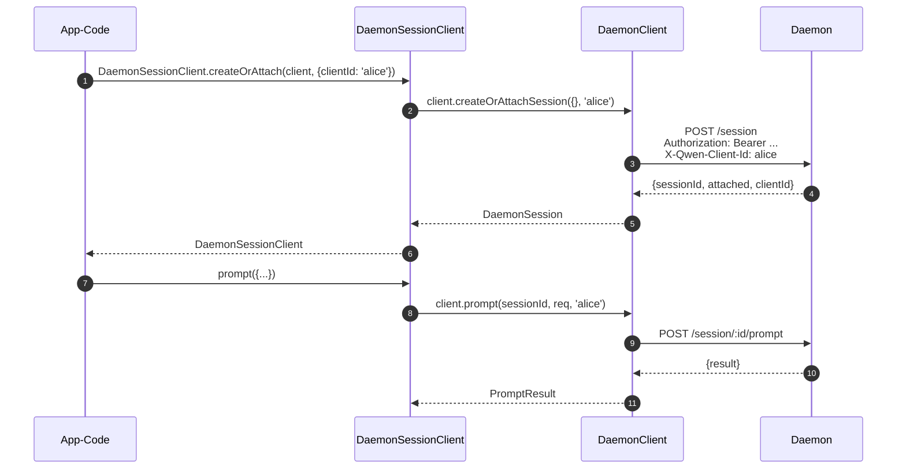
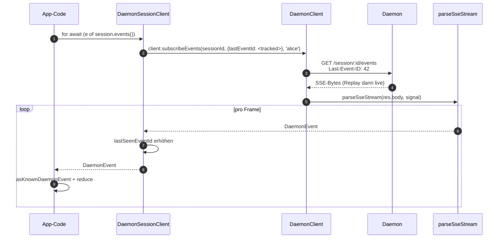
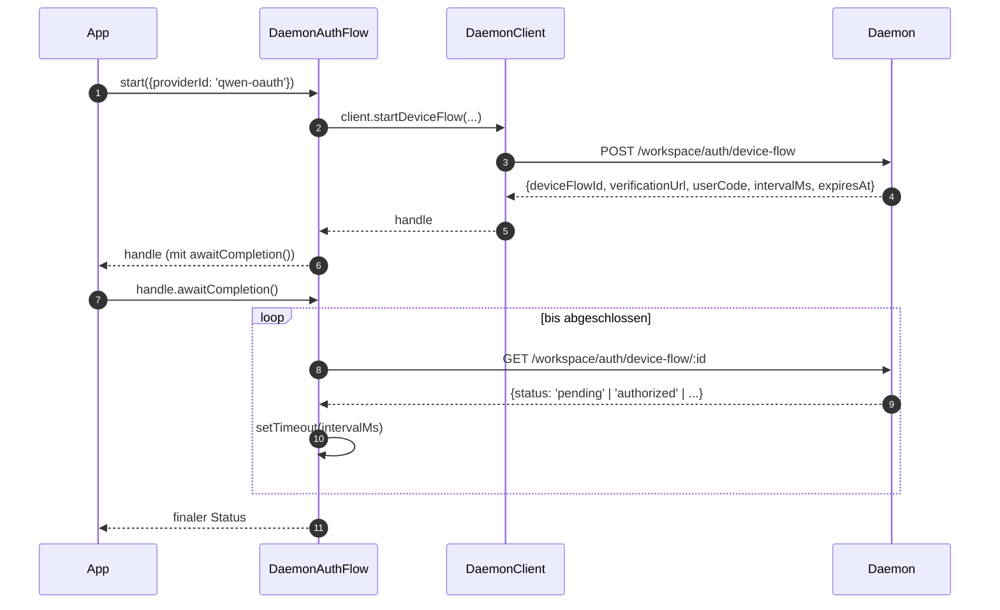

# TypeScript SDK Daemon Client

## Overview

`packages/sdk-typescript/src/daemon/` ist der **Daemon-Client des TypeScript SDK**. Er ist der kanonische Weg, um sich von einem beliebigen TypeScript-/JavaScript-Host (dem eigenen TUI-Adapter der CLI, Channel-Bot-Backends, dem VS Code IDE Companion, benutzerdefinierten Skripten und serverseitigen Web-Backends) mit einem laufenden `qwen serve`-Daemon zu verbinden. Alle anderen Adapter hängen von ihm ab.

Das Package-Layout ist bewusst klein gehalten:

| File                     | Surface                                                                                                                        |
| ------------------------ | ------------------------------------------------------------------------------------------------------------------------------ |
| `index.ts`               | Öffentlicher Barrel (`DaemonClient`, `DaemonSessionClient`, `DaemonAuthFlow`, `parseSseStream`, Event-Reducer, Types).         |
| `DaemonClient.ts`        | Low-Level-HTTP/SSE-Facade – eine Methode pro `qwen-serve-protocol.md`-Route.                                                   |
| `DaemonSessionClient.ts` | Session-bezogener Wrapper mit SSE-Replay-Tracking.                                                                             |
| `DaemonAuthFlow.ts`      | High-Level-OAuth-Device-Flow-Helper.                                                                                           |
| `sse.ts`                 | `parseSseStream` (NDJSON-/SSE-Framing-Parser).                                                                                 |
| `events.ts`              | `asKnownDaemonEvent`, `reduceDaemonSessionEvent`, `reduceDaemonAuthEvent` (siehe [`09-event-schema.md`](./09-event-schema.md)).|
| `types.ts`               | `DaemonCapabilities`, `DaemonSession`, `DaemonEvent`, `PermissionResponse`, `PromptResult`, MCP-/Agent-/Memory-/Auth-Types.   |

Das Walkthrough-Beispiel befindet sich unter [`../examples/daemon-client-quickstart.md`](../examples/daemon-client-quickstart.md); dieses Dokument ist die Architektur- und Contract-Referenz.

## Responsibilities

- Eine TypeScript-Methode pro Daemon-HTTP-Route bereitstellen.
- Das Bearer-Token und die `X-Qwen-Client-Id` bei jeder Anfrage korrekt mitschicken.
- Per-Call-Timeouts mit vom Aufrufer bereitgestellten `AbortSignal` kombinieren (ohne langlebige SSE zu beenden).
- SSE-Frames streamen und in typisierte `DaemonEvent`s parsen.
- `lastSeenEventId` pro Session tracken, damit Reconnects korrekt replayen.
- Eine Device-Flow-Auth-Surface bereitstellen, die in vom Daemon vorgegebenen Intervallen pollt.

## Architecture

### `DaemonClient` (`DaemonClient.ts`)

Konstruktor:

```ts
new DaemonClient({
  baseUrl: string,                  // default 'http://127.0.0.1:4170'
  token?: string,
  fetch?: typeof globalThis.fetch,  // injectable for tests
  fetchTimeoutMs?: number,          // 0 = disabled; default DEFAULT_FETCH_TIMEOUT_MS
});
```

Methodengruppen (jede Methode akzeptiert eine optionale `clientId`, um `X-Qwen-Client-Id` zu setzen):

| Group               | Methods                                                                                                                                                                                                                                                                                                                                                                                                          |
| ------------------- | ---------------------------------------------------------------------------------------------------------------------------------------------------------------------------------------------------------------------------------------------------------------------------------------------------------------------------------------------------------------------------------------------------------------- |
| Plumbing            | `health()`, `capabilities()`, `auth` (Lazy `DaemonAuthFlow` Accessor)                                                                                                                                                                                                                                                                                                                                            |
| Sessions            | `createOrAttachSession`, `loadSession`, `resumeSession`, `listSessions`, `closeSession`, `setSessionMetadata`, `getSessionContext`, `getSessionSupportedCommands`, `setSessionApprovalMode`, `setSessionModel`                                                                                                                                                                                                   |
| Prompting           | `prompt`, `cancel`, `heartbeat`                                                                                                                                                                                                                                                                                                                                                                                  |
| Events              | `subscribeEvents` (SSE-Generator), `subscribeEventsStream` (Raw-Response)                                                                                                                                                                                                                                                                                                                                        |
| Permissions         | `respondToPermission`, `respondToSessionPermission`                                                                                                                                                                                                                                                                                                                                                              |
| Workspace snapshots | `getWorkspaceMcp`, `getWorkspaceSkills`, `getWorkspaceProviders`, `getWorkspaceEnv`, `getWorkspacePreflight`                                                                                                                                                                                                                                                                                                     |
| Workspace mutations | `addWorkspace`, `updateWorkspace`, `writeWorkspaceMemory`, `readWorkspaceMemory`, `rememberWorkspaceMemory`, `getWorkspaceMemoryRememberTask`, `forgetWorkspaceMemory`, `getWorkspaceMemoryForgetTask`, `dreamWorkspaceMemory`, `getWorkspaceMemoryDreamTask`, `listWorkspaceAgents`, `getWorkspaceAgent`, `createWorkspaceAgent`, `updateWorkspaceAgent`, `deleteWorkspaceAgent`, `setWorkspaceToolEnabled`, `setWorkspaceSkillEnabled`, `restartMcpServer`, `initWorkspace` |
| Files               | `readFile`, `readFileBytes`, `writeFile`, `editFile`, `listDirectory`, `globPaths`, `statPath`                                                                                                                                                                                                                                                                                                                   |
| Auth                | `startDeviceFlow`, `pollDeviceFlow`, `cancelDeviceFlow`, `getAuthStatus`                                                                                                                                                                                                                                                                                                                                         |

### `fetchWithTimeout`

Jede Anfrage durchläuft `fetchWithTimeout`. Wichtige Details:

- **Das Lesen des Body erfolgt innerhalb des Timer-Scopes.** Frühere Implementierungen haben den Timer gelöscht, wenn die Header eintrafen; wenn ein Proxy mitten im Body stockte, konnte `await res.json()` über `fetchTimeoutMs` hinaus hängen. Die aktuelle Form übergibt den Body-Lese-Code als Callback, sodass der Timer sowohl das Eintreffen der Header ALS AUCH das Lesen des Body abdeckt.
- **`perCallTimeoutMs`** ermöglicht es einem einzelnen Aufruf, den clientweiten Standardwert zu überschreiben. Der sichtbarste Aufrufer ist `restartMcpServer`: Das SDK verwendet `MCP_RESTART_DEFAULT_TIMEOUT_MS = 330_000` (5 Min. 30 Sek.). Das eigene `MCP_RESTART_TIMEOUT_MS` des Daemons beträgt exakt 300 s; wenn der Client diesen Wert übernehmen würde, könnte ein Restart, der nahe 300 s abgeschlossen wird, das Rennen verlieren, während der Daemon seine strukturierte Antwort serialisiert und sendet, was zu einem falsch-positiven `TimeoutError` führt. Die zusätzlichen 30 s decken Serialisierung, Netzwerktransfer und Decodierung auf beiden Seiten ab. Aufrufer, die ein strengeres Budget benötigen, können `timeoutMs` übergeben; die Übergabe von `0` deaktiviert den Timeout.
- **`AbortSignal.any`** kombiniert das vom Aufrufer bereitgestellte Signal mit dem Per-Call-Timer-Signal, sodass sowohl der Abbruch durch den Aufrufer als auch der Per-Call-Timeout sauber abgebrochen werden.
- **`AbortController` + abbrechbares `setTimeout`** anstelle von `AbortSignal.timeout()`, damit sich schnell auflösende Anfragen keine ausstehenden Timer auf der Event-Loop leaken. Der Timer wird in `finally` gelöscht.
- **Streaming-Endpunkte (`subscribeEvents`) umgehen den Timeout** – langlebige SSE dürfen dadurch nicht beendet werden.

### `DaemonSessionClient` (`DaemonSessionClient.ts`)

Bindet eine Session und trackt automatisch `lastSeenEventId`, sodass SSE-Replay und Reconnect ohne zusätzlichen Aufrufer-State funktionieren.

```ts
class DaemonSessionClient {
  readonly client: DaemonClient;
  readonly session: DaemonSession;
  readonly state: DaemonSessionState;
  private lastSeenEventId: number | undefined;

  static createOrAttach(client, req?): Promise<DaemonSessionClient>;
  static load(client, sessionId, req?): Promise<DaemonSessionClient>;
  static resume(client, sessionId, req?): Promise<DaemonSessionClient>;

  events(opts?: DaemonSessionSubscribeOptions): AsyncIterable<DaemonEvent>;
  prompt(req: PromptRequest): Promise<PromptResult>;
  cancel(): Promise<void>;
  respondToPermission(...): Promise<PermissionResponse>;
  setModel(modelServiceId): Promise<SetModelResult>;
  heartbeat(): Promise<HeartbeatResult>;
  setMetadata(metadata): Promise<SessionMetadataResult>;
  close(): Promise<void>;
}
```

`events()` fungiert standardmäßig als Proxy für `client.subscribeEvents` mit `resume: true` – es übergibt die getrackte `lastSeenEventId`, damit Reconnects dort replayen, wo das vorherige Abonnement aufgehört hat. Jedes gelieferte Event erhöht `lastSeenEventId`.

### `DaemonAuthFlow` (`DaemonAuthFlow.ts`)

```ts
class DaemonAuthFlow {
  start(opts: { providerId, ... }): Promise<DaemonAuthFlowHandle>;
}
interface DaemonAuthFlowHandle {
  deviceFlowId: string;
  providerId: string;
  expiresAt: string;
  verificationUrl: string;
  userCode: string;
  awaitCompletion(opts?): Promise<DaemonAuthDeviceFlowState>;
  cancel(): Promise<void>;
}
```

`awaitCompletion()` pollt `GET /workspace/auth/device-flow/:id` im vom Daemon vorgegebenen `intervalMs`, bis der Flow den Status `authorized`, `failed` oder `cancelled` annimmt. Er wird lazy über `client.auth` konstruiert, sodass Clients, die Auth nie anfassen, keine Allokationskosten verursachen.

### `parseSseStream` (`sse.ts`)

Wandelt einen `Response.body` (`ReadableStream<Uint8Array>`) in ein `AsyncIterable<DaemonEvent>` um. Verarbeitet:

- LF- und CRLF-Framing.
- Buffer-Overflow-Cap (16 MiB) – defensive Grenze gegen einen Daemon, der einen einzigen absurd großen Frame ausgibt.
- AbortSignal-Wiring – Abbruch schließt den Stream und den Iterator.
- Frames nur mit Kommentaren und unbekannte Event-Typen (werden als `DaemonEvent` durchgereicht; SDK-Consumer grenzen sie downstream über `asKnownDaemonEvent` ein).

### Types (`types.ts`)

Erwähnenswerte Exports: `DaemonCapabilities`, `DaemonSession` (`{ sessionId, workspaceCwd, attached, clientId?, createdAt? }`), `DaemonEvent`, `DaemonSessionState`, `DaemonSessionContextStatus`, `DaemonSessionSupportedCommandsStatus`, `PermissionResponse`, `PromptResult`, `HeartbeatResult`, `SetModelResult`, `SessionMetadataResult` sowie MCP-/Agent-/Memory-/Auth-Result-Types. Zu den Managed-Workspace-Memory-Task-Types gehören `DaemonWorkspaceMemoryRememberTask`, `DaemonWorkspaceMemoryForgetTask` und `DaemonWorkspaceMemoryDreamTask`.

Workspace-Managed-Memory-Task-Helper:

```ts
await client.rememberWorkspaceMemory('Use strict TypeScript.', {
  contextMode: 'workspace',
});
await client.getWorkspaceMemoryRememberTask('remember-...');

await client.forgetWorkspaceMemory('old preference');
await client.getWorkspaceMemoryForgetTask('forget-...');

await client.dreamWorkspaceMemory();
await client.getWorkspaceMemoryDreamTask('dream-...');
```

Workspace-Skill-Toggles sind auf beiden Client-Formen verfügbar:

```ts
await client.setWorkspaceSkillEnabled('review', false, {
  clientId: 'dashboard-1',
});
await client
  .workspaceByCwd('/work/secondary')
  .setWorkspaceSkillEnabled('review', true, { clientId: 'dashboard-1' });
```

Pre-flight `capabilities.features.includes('workspace_skill_toggle')`. Der typisierte `DaemonSkillToggleResult` berichtet den kanonischen `skillName`, ob der Disk-State `changed` wurde, den Aktivierungszustand (`applied`, `deferred` oder `partial`) und die aktualisierten/fehlgeschlagenen Session-Zahlen. `DaemonWorkspaceSkillStatus.userInvocable` ist ein optionales False-only-Feld; Fehlen bedeutet, dass der Skill vom Benutzer aufrufbar ist.

Für Batch-Änderungen pre-flight `workspace_skill_batch_toggle` prüfen und dann beide Client-Formen mit demselben Contract aufrufen:

```ts
await client.setWorkspaceSkillsEnabled(['review', 'deploy'], false, {
  clientId: 'dashboard-1',
});
await client
  .workspaceByCwd('/work/secondary')
  .setWorkspaceSkillsEnabled(['review', 'deploy'], true);
```

`DaemonSkillBatchToggleResult` enthält sortierte erfolgreiche `results`, zielbezogene `errors` und batchweite Aktivierungs-/Session-Refresh-Zahlen. Der Daemon persistiert gültige Ziele zusammen und refreshed aktive Sessions einmalig; ein erwarteter Fehler bei einem Ziel blockiert andere gültige Ziele nicht. Die Methode throwt nur bei einer Non-200-Antwort; ein 200 bedeutet nicht, dass jedes Ziel angewendet wurde, daher immer `errors` prüfen, bevor der Batch als erfolgreich behandelt wird.

Workspace-Anzeigenamen sind optionale Präsentationsmetadaten. Pre-flight `capabilities.features.includes('workspace_display_name')`; Workspace-IDs und kanonische Pfade bleiben die einzigen Selektoren, und doppelte Anzeigenamen sind zulässig.

```ts
const workspace = await client.addWorkspace('/srv/repos/payments', {
  persist: true,
  displayName: 'Payments Production',
});

await client.updateWorkspace(workspace.id, {
  displayName: 'Payments',
});
await client.updateWorkspace(workspace.id, { displayName: null });
```

`addWorkspace` akzeptiert `displayName?: string` und gibt ihn zurück, wenn gesetzt. `updateWorkspace` akzeptiert einen ID- oder CWD-Selektor und `{ displayName: string | null }`; `null` löscht den Namen. Namen sind nach dem Trimmen auf 256 Zeichen begrenzt und lehnen interne C0/DEL-Steuerzeichen ab. Ein prozesslokaler Workspace behält seinen Namen nur für den aktuellen Daemon-Prozess; übereinstimmende persistente Registrierungen werden über den bestehenden Store aktualisiert. `DaemonWorkspaceCapability.displayName` bleibt optional, sodass das SDK weiterhin mit älteren Daemons interoperabel ist.

## Workflow

### Create-or-attach + erster Prompt


```mermaid
sequenceDiagram
    autonumber
    participant App as App-Code
    participant SC as DaemonSessionClient
    participant DC as DaemonClient
    participant D as Daemon

    App->>SC: DaemonSessionClient.createOrAttach(client, {clientId: 'alice'})
    SC->>DC: client.createOrAttachSession({}, 'alice')
    DC->>D: POST /session<br/>Authorization: Bearer ...<br/>X-Qwen-Client-Id: alice
    D-->>DC: {sessionId, attached, clientId}
    DC-->>SC: DaemonSession
    SC-->>App: DaemonSessionClient

    App->>SC: prompt({...})
    SC->>DC: client.prompt(sessionId, req, 'alice')
    DC->>D: POST /session/:id/prompt
    D-->>DC: {result}
    DC-->>SC: PromptResult
```

### Subscribe mit Replay


```mermaid
sequenceDiagram
    autonumber
    participant App as App-Code
    participant SC as DaemonSessionClient
    participant DC as DaemonClient
    participant D as Daemon
    participant P as parseSseStream

    App->>SC: for await (e of session.events())
    SC->>DC: client.subscribeEvents(sessionId, {lastEventId: <tracked>}, 'alice')
    DC->>D: GET /session/:id/events<br/>Last-Event-ID: 42
    D-->>DC: SSE-Bytes (Replay dann live)
    DC->>P: parseSseStream(res.body, signal)
    loop pro Frame
        P-->>SC: DaemonEvent
        SC->>SC: lastSeenEventId erhöhen
        SC-->>App: DaemonEvent
        App->>App: asKnownDaemonEvent + reduce
    end
```

### Device-Flow-Authentifizierung


```mermaid
sequenceDiagram
    autonumber
    participant App as App
    participant AF as DaemonAuthFlow
    participant DC as DaemonClient
    participant D as Daemon

    App->>AF: start({providerId: 'qwen-oauth'})
    AF->>DC: client.startDeviceFlow(...)
    DC->>D: POST /workspace/auth/device-flow
    D-->>DC: {deviceFlowId, verificationUrl, userCode, intervalMs, expiresAt}
    DC-->>AF: handle
    AF-->>App: handle (mit awaitCompletion())
    App->>AF: handle.awaitCompletion()
    loop bis abgeschlossen
        AF->>D: GET /workspace/auth/device-flow/:id
        D-->>AF: {status: 'pending' | 'authorized' | ...}
        AF->>AF: setTimeout(intervalMs)
    end
    AF-->>App: finaler Status
```

`qwen-oauth` ist der Legacy-v1-Provider-Identifier. Der kostenlose Qwen OAuth Free Tier wurde am 15.04.2026 eingestellt, daher sollten neue Clients nach Möglichkeit einen derzeit unterstützten Auth-Provider verwenden.

## State & Lifecycle

- `DaemonClient` ist verbindungslos; bei der Konstruktion passiert nichts. Jede Methode öffnet ein neues `fetch`.
- `DaemonSessionClient` behält `lastSeenEventId` über `events()`-Aufrufe hinweg bei; Reconnects führen ein Replay ab der zuletzt gesehenen ID aus.
- `DaemonAuthFlow` ist lazy – `client.auth` konstruiert es beim ersten Zugriff.
- Der SSE-Iterator wird geschlossen, wenn (a) der Daemon den Stream beendet, (b) `AbortSignal.abort()` ausgelöst wird, (c) der Consumer aus dem `for await` ausbricht oder (d) das Buffer-Overflow-Limit (16 MiB) erreicht wird.

## Abhängigkeiten

- `globalThis.fetch` (in Node 18+ integriert, Browser, undici, etc.). Kann pro `DaemonClient` für Tests injiziert werden.
- Native `AbortController` / `AbortSignal.any` / `setTimeout`.
- Keine transitiven Abhängigkeiten zu `@qwen-code/qwen-code-core` oder `@qwen-code/acp-bridge` – das SDK-Paket ist vollständig entkoppelt, sodass externe Consumer nicht die Interna des Daemons hereinziehen.

## `ui/*`-Subpaket ([#4328](https://github.com/QwenLM/qwen-code/pull/4328) + [#4353](https://github.com/QwenLM/qwen-code/pull/4353))

Das SDK exportiert auch `packages/sdk-typescript/src/daemon/ui/`, ein host-neutrales Set an Primitiven, das Daemon-Events in Transcript-Blöcke umwandelt:

- `normalizeDaemonEvent(evt)` mappt die 53 bekannten Daemon-Wire-Events auf 43 UI-freundliche `DaemonUiEventType`-Werte; nicht modellierte oder fehlerhafte Events werden auf `debug` normalisiert.
- `createDaemonTranscriptState()` plus `reduceDaemonTranscriptEvents(state, events)` projiziert UI-Events in `DaemonTranscriptBlock[]`.
- `createDaemonTranscriptStore()` kapselt Subscribe / Dispatch.
- `render.ts` / `terminal.ts` stellen HTML- und Terminal-Baseline-Renderer bereit, während `toolPreview.ts` Tool-Call-Zusammenfassungen erzeugt.
- Zu den Selektoren gehören `selectTranscriptBlocksOrderedByEventId`, `selectPendingPermissionBlocks`, `selectCurrentTool`, `selectApprovalMode`, `selectToolProgress`, `selectSubagentChildBlocks`, `formatMissedRange` und `formatBlockTimestamp`.
- Zu den öffentlichen Konstanten gehört `DAEMON_PLAN_TOOL_CALL_ID`.
- `conformance.ts` enthält die Cross-Host-Konsistenz-Testsuite.

Der erste Produktions-Consumer ist `packages/webui/src/daemon/` über Reacts `DaemonSessionProvider`. Siehe [`14-cli-tui-adapter.md`](./14-cli-tui-adapter.md) für die detaillierte Architektur, das Glossar, die Selektoren-Tabelle und die Beziehung zum Legacy `DaemonTuiAdapter`.

Das Subpaket wird über den Subpath `@qwen-code/sdk/daemon` exportiert. Bestehender Code, der `import { DaemonClient }` verwendet, ist davon nicht betroffen.

## `Last-Event-ID`-Reconnect mit dem SDK

### Automatisches Tracking über `DaemonSessionClient`

`DaemonSessionClient` trackt `lastSeenEventId` intern. Jedes yieldete Event mit einer numerischen `id` erhöht den Cursor. Nachfolgende `events()`-Aufrufe übergeben automatisch die getrackte ID als `Last-Event-ID`, sodass Reconnect-with-Replay ohne zusätzlichen Caller-State funktioniert:

```ts
import { DaemonClient, DaemonSessionClient } from '@qwen-code/sdk/daemon';

const client = new DaemonClient({ baseUrl: 'http://127.0.0.1:4170', token });
const session = await DaemonSessionClient.createOrAttach(client);

// Erstes Subscription — startet live (oder ab Ring-Start für neue Sessions).
for await (const event of session.events()) {
  console.log(event.type, event.id);
  // session.lastEventId wird bei jedem Frame mit ID erhöht.
  if (shouldStop(event)) break;
}

// Reconnect — sendet automatisch Last-Event-ID: <zuletzt gesehene ID>.
// Der Daemon spielt verpasste Events aus dem Ring als Replay ab und geht dann auf live.
for await (const event of session.events()) {
  // Replay-Frames kommen zuerst, dann ein synthetisches `replay_complete`,
  // dann Live-Events.
  handleEvent(event);
}
```

### Manueller Reconnect mit `DaemonClient`

Für Low-Level-Kontrolle verwende `DaemonClient.subscribeEvents` direkt und verwalte den Cursor selbst:

```ts
const client = new DaemonClient({ baseUrl: 'http://127.0.0.1:4170', token });

let cursor: number | undefined; // undefined = nur live beim ersten Connect

async function* subscribe(sessionId: string, signal: AbortSignal) {
  for await (const event of client.subscribeEvents(sessionId, {
    lastEventId: cursor,
    signal,
  })) {
    // Nur Frames mit ID erhöhen den Cursor.
    if (event.id !== undefined) {
      cursor = event.id;
    }
    // Ring-Eviction-Gap behandeln.
    if (event.type === 'state_resync_required') {
      // State ist veraltet — das begrenzte Replay-Snapshot-Fenster des Daemons neu laden.
      await client.loadSession(sessionId);
      continue;
    }
    if (event.type === 'history_truncated') {
      // Nur informativ. Eine Statusnotiz rendern, dann die behaltenen
      // Replay-Events weiter anwenden; keinen erneuten Reload auslösen.
    }
    yield event;
  }
}
```

### Reconnect mit Retry-Loop

Das SDK führt bei Netzwerkfehlern **kein** automatisches Retry durch. Implementiere einen Retry-Loop um `events()`:

```ts
async function resilientSubscribe(session: DaemonSessionClient) {
  const MAX_RETRIES = 10;
  const BASE_DELAY_MS = 1000;

  for (let attempt = 0; attempt < MAX_RETRIES; attempt++) {
    try {
      // `resume: true` (Standard) übergibt die getrackte lastSeenEventId.
      for await (const event of session.events()) {
        attempt = 0; // Reset bei erfolgreichem Event
        handleEvent(event);
      }
      break; // Sauberes Stream-Ende
    } catch (err) {
      const delay = BASE_DELAY_MS * 2 ** Math.min(attempt, 5);
      await new Promise((r) => setTimeout(r, delay));
    }
  }
}
```

Beim Reconnect spielt der Daemon Events mit `id > lastSeenEventId` aus seinem begrenzten Ring (Standard 8000 Events) als Replay ab. Wenn die Lücke den Ring überschreitet, signalisiert ein `state_resync_required`-Frame dem Client, `loadSession` aufzurufen und aus dem aktuellen begrenzten Replay-Snapshot-Fenster neu aufzubauen. Dieser Snapshot kann mit `history_truncated` beginnen; behandle ihn als für Operatoren sichtbare Statusmarkierung, nicht als erneute Resync-Anfrage.

`history_truncated.fullTranscriptAvailable` ist ein boolescher Capability-Flag. Wenn er `true` ist, können Caller das vollständige aktive persistierte Replay mit `DaemonClient.getSessionTranscriptPage(sessionId, { cursor, limit })` seitenweise abrufen; wenn er `false` ist, sollten Clients das begrenzte Replay normal weiter rendern.

Wenn `workspace_persisted_transcript` angekündigt wird, liest `client.workspaceById(workspaceId).getSessionTranscriptPage(sessionId, { cursor, limit })` den ausgewählten registrierten Workspace ohne Anheften an ACP. Die workspace-qualifizierte Methode verwendet immer natives REST, selbst wenn der Client einen austauschbaren Transport hat; ihr Cursor erlischt beim Daemon-Neustart.

Wenn `workspace_session_export` angekündigt wird, exportiert `client.workspaceById(workspaceId).exportSession(sessionId, { format })` oder `client.workspaceByCwd(workspaceCwd).exportSession(...)` das aktive persistierte Transkript des ausgewählten vertrauenswürdigen Workspace. Es gibt den bestehenden `DaemonSessionExportResult` zurück, bewahrt das optionale Client-Identity- und clientweite Fetch-Timeout-Verhalten und verwendet immer natives REST, selbst wenn der Client einen austauschbaren Transport hat. Leite die Serverunterstützung dieser Methode nicht von `session_export` oder `workspace_qualified_rest_core` ab; ältere Daemons behalten nur den primären Export.

Wenn `workspace_archived_session_export` angekündigt wird, verwende `client.workspaceById(workspaceId).exportArchivedSession(sessionId, { format })` oder die entsprechende `workspaceByCwd`-Methode, um nur das archivierte persistierte Transkript des ausgewählten Workspace zu exportieren. Die Methode verwendet denselben Result-Type und dasselbe native REST-Verhalten wie der aktive Export, fällt aber niemals auf eine aktive Session zurück; die Unterstützung kann aus keiner aktiven Export-Capability abgeleitet werden.

### Seeding von `lastEventId` bei der Konstruktion

Caller, die den Cursor über Prozess-Neustarts hinweg persistieren, können ihn seeden:

```ts
const session = new DaemonSessionClient({
  client,
  session: { sessionId, workspaceCwd, attached: true },
  lastEventId: persistedCursor, // Resume von persistierter Position
});
```

Der Wert muss eine endliche, nicht-negative Ganzzahl sein (wird bei der Konstruktion validiert). Ungültige Werte werfen einen Fehler.

## Konfiguration

| Einstellung | Wo | Effekt |
| ------------------ | ------------------------------------ | --------------------------------------------------------------------------------------- |
| `baseUrl`          | `DaemonClient`-Konstruktor           | Daemon-URL; nachgestellte Slashes werden entfernt.                                      |
| `token`            | `DaemonClient`-Konstruktor           | Wird als `Authorization: Bearer` gestempelt.                                            |
| `fetch`            | `DaemonClient`-Konstruktor           | Test-Injection-Point.                                                                   |
| `fetchTimeoutMs`   | `DaemonClient`-Konstruktor           | Timeout pro Aufruf; `0` = deaktiviert.                                                  |
| `clientId`         | optionaler Parameter pro Methode     | `X-Qwen-Client-Id`-Header (siehe [`08-session-lifecycle.md`](./08-session-lifecycle.md)). |
| `lastEventId`      | `DaemonSessionClient`-Konstruktor    | Replay-Cursor seeden.                                                                   |
| `maxQueued`        | Option pro Subscribe                 | `?maxQueued=N` für die SSE-Route; vorher `caps.features.slow_client_warning` prüfen.    |
| `perCallTimeoutMs` | pro Methode (z. B. `restartMcpServer`) | Überschreibt das client-weite Timeout.                                                |

## Einschränkungen & bekannte Limits

- **`fetchTimeoutMs` gilt pro Aufruf, nicht auf Connection-Ebene.** Lange Body-Reads teilen sich den Timer. Ein Daemon, der Antworten streamt, muss den Timeout pro Aufruf überschreiben oder auf `0` setzen.
- **SSE umgeht den Fetch-Timeout** – langlebige SSE-Verbindungen werden durch `fetchTimeoutMs` nicht getrennt. Verwende `AbortSignal` für caller-gesteuertes Abbrechen.
- **Das Buffer-Limit von `parseSseStream` liegt bei 16 MiB** als defensive Grenze. Ein einzelner Frame, der größer ist, bricht den Iterator ab (der Daemon emittiert niemals legitim solche Frames).
- **`asKnownDaemonEvent` gibt `undefined` für nicht erkannte Event-Typen zurück.** SDK-Consumer müssen diesen Branch behandeln, anstatt anzunehmen, dass die Union exhaustiv ist; das ist der Forward-Compatibility-Vertrag. Nicht erkannte Events erhöhen `DaemonSessionViewState.unrecognizedKnownEventCount`.
- **`client_evicted`, `slow_client_warning`, `stream_error` befinden sich nicht im Replay-Ring.** Ein Reconnect nach einer Eviction setzt beim Ring des Daemons an; du wirst den Eviction-Frame nicht noch einmal sehen.
- **`DaemonClient` führt kein automatisches Retry durch.** Netzwerkfehler treten als Rejections auf; die Reconnect-/Replay-Strategie liegt in der Verantwortung des Callers (`DaemonSessionClient.events()` macht Replay einfach, aber Reconnect erfolgt weiterhin pro Aufruf).

## Referenzen

- `packages/sdk-typescript/src/daemon/DaemonClient.ts`
- `packages/sdk-typescript/src/daemon/DaemonSessionClient.ts`
- `packages/sdk-typescript/src/daemon/DaemonAuthFlow.ts`
- `packages/sdk-typescript/src/daemon/sse.ts`
- `packages/sdk-typescript/src/daemon/events.ts`
- `packages/sdk-typescript/src/daemon/types.ts`
- End-to-End-Walkthrough: [`../examples/daemon-client-quickstart.md`](../examples/daemon-client-quickstart.md).