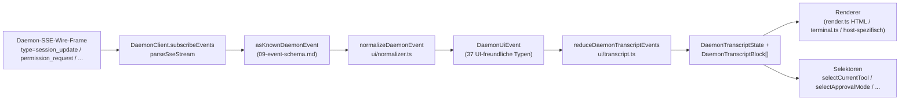

# Gemeinsame UI-Transcript-Schicht

> **Aktueller Status**: `packages/cli/src/ui/daemon/daemon-tui-adapter.ts` ist auf `main` noch als Legacy-experimenteller CLI-seitiger Adapter vorhanden. Dieses Dokument beschreibt die neuere SDK-seitige gemeinsame UI-Transcript-Schicht: wiederverwendbare Daemon-Event-Normalisierung und Transcript-Primitiven, die von jedem UI-Host konsumiert werden können, einschließlich Web, TUI, IDE und IM-Kanälen. CLI-TUI-, Kanal- und VS-Code-IDE-Migrationen sind nachgelagerte Aufgaben.

## Übersicht

`packages/sdk-typescript/src/daemon/ui/` fügt dem SDK ein `ui/*`-Subpackage hinzu. Es wandelt den Daemon-SSE-Event-Stream durch wiederverwendbare Primitiven in UI-renderbare Transcript-Blöcke um:

- **Normalisierung** (`normalizer.ts`): mappt die 47 bekannten Event-Typen des Daemon-Wire-Schemas (siehe [`09-event-schema.md`](./09-event-schema.md)) auf 37 UI-freundliche `DaemonUiEventType`-Semantik-Events wie `assistant.text.delta`, `tool.update` und `session.metadata.changed`.
- **State Machine** (`transcript.ts`, `store.ts`): Pure Reducer und abonnierbarer Store, der UI-Events auf ein geordnetes `DaemonTranscriptBlock[]` projiziert.
- **Renderer** (`render.ts`, `terminal.ts`, `toolPreview.ts`): Transcript-Blöcke zu HTML, Terminal-Text und Tool-Preview-Strings. Hosts können diese verwenden oder ersetzen.
- **Konformität** (`conformance.ts`): Host-übergreifende Konsistenztests, die verwendet werden, wenn Kanal-, TUI- und IDE-Oberflächen auf diese Primitiven migrieren.

Der erste Produktions-Consumer ist **`packages/webui/src/daemon/`** ([#4328](https://github.com/QwenLM/qwen-code/pull/4328)). Sein React-`DaemonSessionProvider` und Transcript-Adapter ermöglichen es der Web-UI, sich direkt mit dem Daemon-HTTP+SSE zu verbinden, anstatt nur den Host-`postMessage`-Traffic zu rendern. CLI-TUI, Kanal-Basis und VS-Code-IDE können dieselbe Schicht später wiederverwenden; [`../daemon-ui/MIGRATION.md`](../daemon-ui/MIGRATION.md) dokumentiert den inkrementellen Migrationsleitfaden für v2.

## Verantwortlichkeiten

- Normalisierung der 47 Daemon-Wire-Events in ein stabiles UI-Vokabular (`DaemonUiEventType`), damit Renderer nicht `rawEvent.data` inspizieren müssen.
- Beibehaltung der daemon-monotonen SSE-`eventId` als **primärer Ordnungsschlüssel**, damit verschiedene Clients Transcripts in derselben Reihenfolge rendern.
- Verwendung eines Pure Reducers zur Erzeugung von Transcript-Blöcken, mit Selektoren für ausstehende Permissions, aktuelles Tool, Approval-Mode, Tool-Fortschritt und Subagent-Children.
- Bereitstellung von Basis-HTML- und Terminal-Renderern bei gleichzeitiger Ermöglichung host-spezifischen Renderings.
- Bereitstellung öffentlicher Konstanten wie `DAEMON_PLAN_TOOL_CALL_ID` für Plan-Panels.
- Wahrung der additiven Wire-Kompatibilität: Unbekannte Event-Typen werden auf `debug` normalisiert, anstatt verworfen zu werden.

## Architektur

### Paketstruktur

| Datei                                            | Exporte                                                                                                                                                           | Zweck                     |
| ------------------------------------------------ | ----------------------------------------------------------------------------------------------------------------------------------------------------------------- | --------------------------- |
| `packages/sdk-typescript/src/daemon/ui/index.ts` | Subpackage-Barrel                                                                                                                                                 | Öffentlicher Einstiegspunkt          |
| `ui/types.ts`                                    | `DaemonUiEventType`, typspezifische `DaemonUiEvent*`-Interfaces, `DaemonTranscriptBlock`, `DaemonTranscriptState`, `DaemonUiToolProvenance`, `DAEMON_PLAN_TOOL_CALL_ID` | Typen                       |
| `ui/normalizer.ts`                               | `normalizeDaemonEvent(evt) -> DaemonUiEvent`, `getSessionUpdatePayload(evt)`                                                                                      | Wire-zu-UI-Mapping          |
| `ui/transcript.ts`                               | `createDaemonTranscriptState()`, `appendLocalUserTranscriptMessage()`, `reduceDaemonTranscriptEvents()`, `rebuildDaemonTranscriptBlockIndex()`, Selektoren         | State Machine und Selektoren |
| `ui/store.ts`                                    | `createDaemonTranscriptStore(initial?)`                                                                                                                           | Abonnierbarer Reducer-Store  |
| `ui/toolPreview.ts`                              | `createDaemonToolPreview(toolEvent)`                                                                                                                              | Tool-Call-Zusammenfassungstext      |
| `ui/render.ts`                                   | `DaemonHtmlRenderOptions`, `DaemonRenderOptions`, Render-Funktionen                                                                                                | HTML- und generisches Rendering  |
| `ui/terminal.ts`                                 | Terminal-spezifisches Rendering                                                                                                                                       | TUI-Vorbereitung             |
| `ui/conformance.ts`                              | Host-übergreifende Conformance-Suite                                                                                                                                      | Migrations-Paritätstests      |
| `ui/utils.ts`                                    | Helpers wie `DaemonUiContentPart`                                                                                                                             | Interne gemeinsame Utilities   |

### `DaemonUiEventType`-Vokabular

`ui/types.ts` definiert 37 UI-Event-Typen, gruppiert nach Domäne.

**Chat-Stream (Stage 1)**

- `user.text.delta`, `user.image.delta`, `user.shell.command`, `assistant.text.delta`, `assistant.done`, `thought.text.delta`
- `tool.update`, `shell.output`, `user.shell.output`
- `permission.request`, `permission.resolved`
- `model.changed`, `status`, `error`, `debug`

**Session-Metadaten**

- `session.metadata.changed`, `session.approval_mode.changed`
- `session.available_commands`, `session.state_resync_required`, `session.replay_complete`

**Prompt-Lifecycle (clientübergreifend)**

- `prompt.cancelled`, `followup.suggestion`

**Workspace (Wave 3-4)**

- `workspace.memory.changed`, `workspace.agent.changed`
- `workspace.tool.toggled`, `workspace.settings.changed`, `workspace.initialized`
- `workspace.mcp.budget_warning`, `workspace.mcp.child_refused`
- `workspace.mcp.server_restarted`, `workspace.mcp.server_restart_refused`

**Auth-Flow (Wave 4 OAuth)**

- `auth.device_flow.started`, `auth.device_flow.throttled`, `auth.device_flow.authorized`
- `auth.device_flow.failed`, `auth.device_flow.cancelled`

`normalizeDaemonEvent` mappt die 47 bekannten Daemon-Wire-Events auf dieses Vokabular. Unbekannte, nicht modellierte oder fehlerhafte Event-Typen werden auf `debug` normalisiert und behalten `rawEvent` für Host-Diagnosen bei.

### Reducer und Selektoren

```ts
// Initialen Zustand erstellen.
const state = createDaemonTranscriptState();

// Eine SSE-Event-Sequenz anwenden.
const next = reduceDaemonTranscriptEvents(state, daemonUiEvents);

// Selektoren.
selectTranscriptBlocks(state); // alle Blöcke
selectTranscriptBlocksOrderedByEventId(state); // nach eventId sortiert; bevorzugter Schlüssel
selectPendingPermissionBlocks(state);
selectCurrentTool(state);
selectApprovalMode(state);
selectToolProgress(state, toolCallId);
selectSubagentChildBlocks(state, parentBlockId);
isSubagentChildBlock(block);
formatBlockTimestamp(block);
formatMissedRange(state); // "you missed X"-Text nach state_resync_required
```

### Store

`createDaemonTranscriptStore()` bietet Subscribe und Dispatch:

```ts
const store = createDaemonTranscriptStore();
store.subscribe(() => render(store.getState()));
store.dispatch(uiEvents); // führt intern den Reducer aus
```

Der `DaemonSessionProvider` der Web-UI baut seinen React-Kontext auf diesem Store auf.

## Ablauf

### Einzelnes SSE-Event End-to-End



Hosts können bei `(E)` stoppen und ihren eigenen Reducer implementieren oder `(G)` und die bereitgestellten Selektoren konsumieren. Die Web-UI nutzt den vollständigen Pfad `(B) -> (H)`. Eine migrierte TUI kann `(G)` konsumieren und mit Ink-spezifischen Komponenten rendern.

### `state_resync_required`

`session.state_resync_required` wird auf einen Transcript-"missed range"-Marker abgebildet. UI-Code kann `formatMissedRange(state)` aufrufen, um Text wie "missed events X-Y" zu rendern. Der Reducer **wendet weiterhin spätere Events an**, markiert betroffene Blöcke jedoch mit `resyncRecovery: true`, damit Renderer visuellen Kontext hinzufügen können. Siehe [`10-event-bus.md`](./10-event-bus.md) für Ring-Eviction- und `state_resync_required`-Semantik.

## Consumer

### `packages/webui/src/daemon/`

Dies wurde in [#4328](https://github.com/QwenLM/qwen-code/pull/4328) eingeführt.

| Datei                       | Exporte                                                                                                                                                                                                                                                                                                                        |
| --------------------------- | ------------------------------------------------------------------------------------------------------------------------------------------------------------------------------------------------------------------------------------------------------------------------------------------------------------------------------ |
| `DaemonSessionProvider.tsx` | React `<DaemonSessionProvider />`; `useDaemonSession()`, `useDaemonTranscriptStore()`, `useDaemonTranscriptState()`, `useDaemonTranscriptBlocks()`, `useDaemonPendingPermissions()`, `useDaemonActions()`, `useDaemonConnection()` Hooks; `DaemonConnectionStatus`, `DaemonConnectionState`, `DaemonSessionContextValue` Typen |
| `transcriptAdapter.ts`      | Passt SDK-`DaemonTranscriptBlock` an die `UnifiedMessage` der Web-UI an, einschließlich Markdown-Streaming-Chunk-Merge und Tool-Call-Zusammenfassungen                                                                                                                                                                                        |
| `index.ts`                  | Subpackage-Barrel                                                                                                                                                                                                                                                                                                              |

Die Web-UI kann sich jetzt direkt mit dem Daemon-HTTP+SSE verbinden und ein Transcript rendern. Der alte `ACPAdapter`-Host-`postMessage`-Pfad bleibt verfügbar.

### Spätere Migrationen

[`../daemon-ui/MIGRATION.md`](../daemon-ui/MIGRATION.md) bietet einen inkrementellen v2-Leitfaden für Web-Chat- und Web-Terminal-Adapter. Es wird explizit darauf hingewiesen, dass **CLI-TUI, Kanal-Basis und VS-Code-IDE durch diesen PR nicht migriert werden**; jede wird in nachgelagerten PRs umziehen und die Conformance-Suite verwenden, um die Rendering-Parität zu wahren.

## Beziehung zum Legacy `daemon-tui-adapter.ts`

| Aspekt          | Legacy-CLI-`DaemonTuiAdapter`                                   | Neue gemeinsame Transcript-Schicht                                    |
| ----------------- | --------------------------------------------------------------- | -------------------------------------------------------------- |
| Paket           | `packages/cli/src/ui/daemon/`                                   | `packages/sdk-typescript/src/daemon/ui/`                       |
| Öffentliche Oberfläche    | `DaemonTuiAdapter`, `DaemonTuiUpdate`, `DaemonTuiSessionClient` | `DaemonUiEventType`, `reduceDaemonTranscriptEvents`, Selektoren |
| Geltungsbereich             | Nur CLI-Ink-TUI                                                | Web-, TUI-, IDE- oder IM-UI                                        |
| Zustandsform       | TUI-lokale Update-Union                                          | Pure Transcript-Blockliste plus Zustandsfelder                   |
| Sortierung          | `createdAt`                                                     | `eventId` (daemon-monoton, konsistent über Clients hinweg)        |
| Unbekannter Wire-Typ | Verworfen in `reduceDaemonEventToTuiUpdates`                      | Auf `debug` normalisiert und beibehalten                            |
| Tests             | Single-Package-Unit-Tests                                       | Globale Conformance-Suite für Host-übergreifende Parität                 |

## Abhängigkeiten

- Upstream-Wire-Typen: `packages/sdk-typescript/src/daemon/events.ts` (siehe [`09-event-schema.md`](./09-event-schema.md)).
- Tatsächlicher Downstream-Consumer: `packages/webui/src/daemon/`.
- Spätere Migrationsziele: `packages/cli/src/ui/`, `packages/channels/base/` und `packages/vscode-ide-companion/src/services/daemonIdeConnection.ts`.
- Parallele Referenzen: [`../daemon-ui/README.md`](../daemon-ui/README.md), [`../daemon-ui/MIGRATION.md`](../daemon-ui/MIGRATION.md) und [`../daemon-client-adapters/web-ui.md`](../daemon-client-adapters/web-ui.md).

## Konfiguration

- Keine Laufzeitkonfiguration. Reducer und Selektoren sind Pure Functions.
- Hosts wählen ihren Renderer: HTML (`render.ts`), Terminal (`terminal.ts`) oder benutzerdefiniertes Rendering.
- Zur Fehlerbehebung unterstützt `render.ts` `includeRawEvent: true`, um den rohen Wire-Frame in die gerenderte Ausgabe einzuschließen.

## Einschränkungen und bekannte Grenzen

- **`daemon-tui-adapter.ts` existiert noch**. Es ist der Legacy-experimentelle Adapter des CLI-Pakets. Neuer Code sollte das SDK-`ui/*` bevorzugen: `normalizeDaemonEvent`, `reduceDaemonTranscriptEvents` und `DaemonTranscriptBlock`.
- **CLI-TUI, Kanal-Basis und VS-Code-IDE sind noch nicht migriert**. Sie pflegen weiterhin ihre eigene Rendering-Logik. Das Verzeichnis `docs/developers/daemon-client-adapters/` enthält noch `ide.md`, `channel-web.md` und den historischen `tui.md`-Entwurf; das neuere `web-ui.md` behandelt das Design des Web-UI-Adapters.
- **`eventId` ist der primäre Ordnungsschlüssel**. `createdAt` bleibt als deprecated Alias (`clientReceivedAt`) erhalten. Neuer Code sollte `selectTranscriptBlocksOrderedByEventId(state)` verwenden. `MIGRATION.md` zeigt den Code-Diff für den Wechsel von der `createdAt`- zur `eventId`-Sortierung.
- **Unbekannte Wire-Typen werden auf `debug` normalisiert**. Sie werden nicht mehr verworfen wie im alten Adapter. Renderer zeigen `debug` standardmäßig nicht an; Hosts müssen sich für die Anzeige entscheiden.
- **Bundle-Größe**: Das `ui/*`-Subpackage wird als ESM-Subpfad über `@qwen-code/sdk/daemon` exportiert und zieht keine React- oder DOM-Abhängigkeiten nach sich. Die React-Integration wird nur geladen, wenn ein Web-UI-Consumer den `DaemonSessionProvider` verwendet.

## Referenzen

- `packages/sdk-typescript/src/daemon/ui/types.ts` (`DaemonUiEventType`-Vokabular)
- `packages/sdk-typescript/src/daemon/ui/transcript.ts` (Reducer und Selektoren)
- `packages/sdk-typescript/src/daemon/ui/normalizer.ts` (Wire-zu-UI-Mapping)
- `packages/sdk-typescript/src/daemon/ui/store.ts`, `render.ts`, `terminal.ts`, `toolPreview.ts`, `conformance.ts`
- `packages/sdk-typescript/src/daemon/index.ts` (`ui/*` Re-Export-Block)
- `packages/webui/src/daemon/DaemonSessionProvider.tsx`, `transcriptAdapter.ts`
- Upstream-Dokumentation: [`../daemon-ui/README.md`](../daemon-ui/README.md), [`../daemon-ui/MIGRATION.md`](../daemon-ui/MIGRATION.md), [`../daemon-client-adapters/web-ui.md`](../daemon-client-adapters/web-ui.md)
- Kontext-PRs: [#4328](https://github.com/QwenLM/qwen-code/pull/4328) (v1 Transcript-Schicht und Web-UI-Provider), [#4353](https://github.com/QwenLM/qwen-code/pull/4353) (v2 Unified-Completeness-Follow-up)