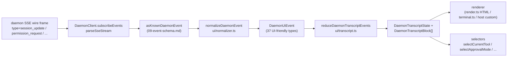

# Gemeinsame UI-Transkriptebene

> **Aktueller Stand**: `packages/cli/src/ui/daemon/daemon-tui-adapter.ts` befindet sich noch auf `main` als ein veralteter experimenteller CLI-seitiger Adapter. Dieses Dokument beschreibt die neuere SDK-seitige gemeinsame UI-Transkriptebene: wiederverwendbare Daemon-Ereignisnormalisierung und Transkript-Primitive, die jeder UI-Host konsumieren kann, einschließlich Web, TUI, IDE und IM-Kanälen. Die Migration von CLI-TUI, Kanal und VS-Code-IDE sind Folgeaufgaben.

## Überblick

`packages/sdk-typescript/src/daemon/ui/` fügt dem SDK ein `ui/*`-Unterpaket hinzu. Es verwandelt den Daemon-SSE-Ereignisstrom über wiederverwendbare Primitive in UI-renderbare Transkriptblöcke:

- **Normalisierung** (`normalizer.ts`): bildet die 43 bekannten Ereignistypen des Daemon-Drahtschemas (siehe [`09-event-schema.md`](./09-event-schema.md)) auf 37 UI-freundliche semantische Ereignisse von `DaemonUiEventType` ab, wie `assistant.text.delta`, `tool.update` und `session.metadata.changed`.
- **Zustandsmaschine** (`transcript.ts`, `store.ts`): reiner Reducer plus abonnierbarer Store, die UI-Ereignisse in ein geordnetes Array von `DaemonTranscriptBlock[]` projizieren.
- **Renderer** (`render.ts`, `terminal.ts`, `toolPreview.ts`): Transkriptblöcke zu HTML, Terminaltext und Tool-Vorschauzeichenfolgen. Hosts können sie verwenden oder ersetzen.
- **Konformität** (`conformance.ts`): plattformübergreifende Konsistenztests, die verwendet werden, wenn Kanal-, TUI- und IDE-Oberflächen auf diese Primitive migrieren.

Der erste Produktionsnutzer ist **`packages/webui/src/daemon/`** ([#4328](https://github.com/QwenLM/qwen-code/pull/4328)). Sein React-`DaemonSessionProvider` und Transkriptadapter ermöglichen es der Web-UI, sich direkt mit Daemon-HTTP+SSE zu verbinden, anstatt nur den `postMessage`-Verkehr des Hosts zu rendern. CLI-TUI, Kanalbasis und VS-Code-IDE können dieselbe Ebene später wiederverwenden; [`../daemon-ui/MIGRATION.md`](../daemon-ui/MIGRATION.md) dokumentiert den inkrementellen Migrationsleitfaden der Version 2.

## Verantwortlichkeiten

- Normalisieren Sie die 43 Daemon-Drahtereignisse in ein stabiles UI-Vokabular (`DaemonUiEventType`), sodass Renderer nicht `rawEvent.data` inspizieren müssen.
- Behalten Sie die daemon-monotone SSE-`eventId` als **primären Ordnungsschlüssel**, sodass verschiedene Clients Transkripte in derselben Reihenfolge rendern.
- Verwenden Sie einen reinen Reducer zur Erzeugung von Transkriptblöcken, mit Selektoren für ausstehende Berechtigungen, aktuelles Tool, Genehmigungsmodus, Tool-Fortschritt und Subagent-Kinder.
- Stellen Sie grundlegende HTML- und Terminal-Renderer bereit, während Sie hostspezifisches Rendering ermöglichen.
- Machen Sie öffentliche Konstanten wie `DAEMON_PLAN_TOOL_CALL_ID` für Plan-Panels verfügbar.
- Bewahren Sie additive Drahtkompatibilität: unbekannte Ereignistypen werden zu `debug` normalisiert, anstatt verworfen zu werden.

## Architektur

### Paketstruktur

| Datei                                               | Exporte                                                                                                                                                           | Zweck                        |
| --------------------------------------------------- | ----------------------------------------------------------------------------------------------------------------------------------------------------------------- | ---------------------------- |
| `packages/sdk-typescript/src/daemon/ui/index.ts`    | Unterpaket-Barrel                                                                                                                                                 | Öffentlicher Einstiegspunkt   |
| `ui/types.ts`                                       | `DaemonUiEventType`, typspezifische `DaemonUiEvent*`-Schnittstellen, `DaemonTranscriptBlock`, `DaemonTranscriptState`, `DaemonUiToolProvenance`, `DAEMON_PLAN_TOOL_CALL_ID` | Typen                        |
| `ui/normalizer.ts`                                  | `normalizeDaemonEvent(evt) -> DaemonUiEvent`, `getSessionUpdatePayload(evt)`                                                                                      | Draht-zu-UI-Abbildung        |
| `ui/transcript.ts`                                  | `createDaemonTranscriptState()`, `appendLocalUserTranscriptMessage()`, `reduceDaemonTranscriptEvents()`, `rebuildDaemonTranscriptBlockIndex()`, Selektoren         | Zustandsmaschine und Selektoren |
| `ui/store.ts`                                       | `createDaemonTranscriptStore(initial?)`                                                                                                                           | Abonnierbarer Reducer-Store  |
| `ui/toolPreview.ts`                                 | `createDaemonToolPreview(toolEvent)`                                                                                                                              | Zusammenfassungstext für Toolaufrufe |
| `ui/render.ts`                                      | `DaemonHtmlRenderOptions`, `DaemonRenderOptions`, Render-Funktionen                                                                                                | HTML und generisches Rendering |
| `ui/terminal.ts`                                    | Terminalspezifisches Rendering                                                                                                                                   | TUI-Vorbereitung             |
| `ui/conformance.ts`                                 | Plattformübergreifende Konformitätssuite                                                                                                                          | Migrations-Paritätstests     |
| `ui/utils.ts`                                       | Hilfsfunktionen wie `DaemonUiContentPart`                                                                                                                         | Interne gemeinsam genutzte Dienstprogramme |
### `DaemonUiEventType`-Vokabular

`ui/types.ts` definiert 37 UI-Ereignistypen, gruppiert nach Domäne.

**Chat-Stream (Stufe 1)**

- `user.text.delta`, `user.image.delta`, `user.shell.command`, `assistant.text.delta`, `assistant.done`, `thought.text.delta`
- `tool.update`, `shell.output`, `user.shell.output`
- `permission.request`, `permission.resolved`
- `model.changed`, `status`, `error`, `debug`

**Sitzungsmetadaten**

- `session.metadata.changed`, `session.approval_mode.changed`
- `session.available_commands`, `session.state_resync_required`, `session.replay_complete`

**Prompt-Lebenszyklus (clientübergreifend)**

- `prompt.cancelled`, `followup.suggestion`

**Arbeitsbereich (Wave 3-4)**

- `workspace.memory.changed`, `workspace.agent.changed`
- `workspace.tool.toggled`, `workspace.settings.changed`, `workspace.initialized`
- `workspace.mcp.budget_warning`, `workspace.mcp.child_refused`
- `workspace.mcp.server_restarted`, `workspace.mcp.server_restart_refused`

**Authentifizierungsablauf (Wave 4 OAuth)**

- `auth.device_flow.started`, `auth.device_flow.throttled`, `auth.device_flow.authorized`
- `auth.device_flow.failed`, `auth.device_flow.cancelled`

`normalizeDaemonEvent` bildet die 43 bekannten Daemon-Wire-Ereignisse auf dieses Vokabular ab. Unbekannte, nicht modellierte oder fehlerhafte Ereignistypen werden zu `debug` normalisiert und bewahren `rawEvent` für die Host-Diagnose.

### Reducer und Selectors

```ts
// Create initial state.
const state = createDaemonTranscriptState();

// Apply an SSE event sequence.
const next = reduceDaemonTranscriptEvents(state, daemonUiEvents);

// Selectors.
selectTranscriptBlocks(state); // all blocks
selectTranscriptBlocksOrderedByEventId(state); // ordered by eventId; preferred key
selectPendingPermissionBlocks(state);
selectCurrentTool(state);
selectApprovalMode(state);
selectToolProgress(state, toolCallId);
selectSubagentChildBlocks(state, parentBlockId);
isSubagentChildBlock(block);
formatBlockTimestamp(block);
formatMissedRange(state); // "you missed X" text after state_resync_required
```

### Store

`createDaemonTranscriptStore()` bietet subscribe und dispatch:

```ts
const store = createDaemonTranscriptStore();
store.subscribe(() => render(store.getState()));
store.dispatch(uiEvents); // internally runs the reducer
```

Die React-Komponente `DaemonSessionProvider` der Web-UI baut ihren Kontext auf diesem Store auf.

## Ablauf

### Einzelnes SSE-Ereignis vollständig durchlaufen



Hosts können bei (E) abbrechen und einen eigenen Reducer implementieren oder (G) mit den bereitgestellten Selectors konsumieren. Die Web-UI verwendet den vollständigen Pfad (B) -> (H). Eine migrierte TUI kann (G) konsumieren und mit Ink-spezifischen Komponenten rendern.

### `state_resync_required`

`session.state_resync_required` wird zu einem Transkript-Marker „Verpasster Bereich". UI-Code kann `formatMissedRange(state)` aufrufen, um Text wie „verpasste Ereignisse X-Y" zu rendern. Der Reducer wendet weiterhin spätere Ereignisse an, markiert jedoch betroffene Blöcke mit `resyncRecovery: true`, damit Renderer visuellen Kontext hinzufügen können. Siehe [`10-event-bus.md`](./10-event-bus.md) für Ring-Eviction und die Semantik von `state_resync_required`.

## Verbraucher

### `packages/webui/src/daemon/`

Dies wurde in [#4328](https://github.com/QwenLM/qwen-code/pull/4328) integriert.

| Datei                        | Exporte                                                                                                                                                                                                                                                                                                                        |
| --------------------------- | ------------------------------------------------------------------------------------------------------------------------------------------------------------------------------------------------------------------------------------------------------------------------------------------------------------------------------ |
| `DaemonSessionProvider.tsx` | React `<DaemonSessionProvider />`; Hooks: `useDaemonSession()`, `useDaemonTranscriptStore()`, `useDaemonTranscriptState()`, `useDaemonTranscriptBlocks()`, `useDaemonPendingPermissions()`, `useDaemonActions()`, `useDaemonConnection()`; Typen: `DaemonConnectionStatus`, `DaemonConnectionState`, `DaemonSessionContextValue` |
| `transcriptAdapter.ts`      | Passt SDK `DaemonTranscriptBlock` an die `UnifiedMessage` der Web-UI an, inklusive Markdown-Streaming-Chunk-Zusammenführung und Tool-Call-Zusammenfassungen                                                                                                                                                                                        |
| `index.ts`                  | Subpackage-Barrel                                                                                                                                                                                                                                                                                                              |
Das Web-UI kann nun direkt eine Verbindung zum Daemon über HTTP+SSE herstellen und ein Transkript rendern. Der alte `ACPAdapter` host `postMessage`-Pfad bleibt weiterhin verfügbar.

### Spätere Migrationen

[`../daemon-ui/MIGRATION.md`](../daemon-ui/MIGRATION.md) bietet eine inkrementelle Anleitung für v2 für Web-Chat- und Web-Terminal-Adapter. Es weist ausdrücklich darauf hin, dass **CLI TUI, Channel Base und VS Code IDE nicht durch diesen PR migriert werden**; jeder wird in nachfolgenden PRs umgestellt und nutzt die Conformance-Suite, um die Rendering-Parität zu wahren.

## Beziehung zum Legacy `daemon-tui-adapter.ts`

| Dimension              | Legacy CLI `DaemonTuiAdapter`                                   | Neue gemeinsame Transkriptschicht                              |
| ---------------------- | --------------------------------------------------------------- | -------------------------------------------------------------- |
| Paket                  | `packages/cli/src/ui/daemon/`                                   | `packages/sdk-typescript/src/daemon/ui/`                       |
| Öffentliche Oberfläche | `DaemonTuiAdapter`, `DaemonTuiUpdate`, `DaemonTuiSessionClient` | `DaemonUiEventType`, `reduceDaemonTranscriptEvents`, Selektoren |
| Umfang                 | Nur CLI Ink TUI                                                 | Web, TUI, IDE oder IM-UI                                       |
| Zustandsform           | TUI-lokale Update-Union                                         | Reine Transkript-Blockliste plus Zustandsfelder                |
| Sortierung             | `createdAt`                                                     | `eventId` (daemon-monoton, konsistent über Clients hinweg)     |
| Unbekannter Wire-Typ   | Wird in `reduceDaemonEventToTuiUpdates` verworfen              | Wird auf `debug` normalisiert und beibehalten                  |
| Tests                  | Paketinterne Unit-Tests                                         | Globale Conformance-Suite für hostübergreifende Parität        |

## Abhängigkeiten

- Upstream-Wire-Typen: `packages/sdk-typescript/src/daemon/events.ts` (siehe [`09-event-schema.md`](./09-event-schema.md)).
- Tatsächlicher Downstream-Consumer: `packages/webui/src/daemon/`.
- Spätere Migrationsziele: `packages/cli/src/ui/`, `packages/channels/base/` und `packages/vscode-ide-companion/src/services/daemonIdeConnection.ts`.
- Parallele Referenzen: [`../daemon-ui/README.md`](../daemon-ui/README.md), [`../daemon-ui/MIGRATION.md`](../daemon-ui/MIGRATION.md) und [`../daemon-client-adapters/web-ui.md`](../daemon-client-adapters/web-ui.md).

## Konfiguration

- Keine Laufzeitkonfiguration. Reducer und Selektoren sind reine Funktionen.
- Hosts wählen ihren Renderer: HTML (`render.ts`), Terminal (`terminal.ts`) oder benutzerdefiniertes Rendering.
- Für Debugging unterstützt `render.ts` `includeRawEvent: true`, um den rohen Wire-Frame in die gerenderte Ausgabe aufzunehmen.

## Einschränkungen und bekannte Grenzen

- **`daemon-tui-adapter.ts` existiert weiterhin**. Es ist der Legacy-Experimental-Adapter des CLI-Pakets. Neuer Code sollte SDK `ui/*` bevorzugen: `normalizeDaemonEvent`, `reduceDaemonTranscriptEvents` und `DaemonTranscriptBlock`.
- **CLI TUI, Channel Base und VS Code IDE sind noch nicht migriert**. Sie behalten weiterhin ihre eigene Rendering-Logik. Das Verzeichnis `docs/developers/daemon-client-adapters/` enthält weiterhin `ide.md`, `channel-web.md` und den historischen Entwurf `tui.md`; die neuere `web-ui.md` beschreibt das Design des Web-UI-Adapters.
- **`eventId` ist der primäre Sortierschlüssel**. `createdAt` bleibt als veralteter Alias bestehen (`clientReceivedAt`). Neuer Code sollte `selectTranscriptBlocksOrderedByEventId(state)` verwenden. `MIGRATION.md` zeigt den Code-Diff für den Wechsel von `createdAt`-Sortierung zu `eventId`-Sortierung.
- **Unbekannte Wire-Typen werden auf `debug` normalisiert**. Sie werden nicht mehr wie im alten Adapter verworfen. Renderer zeigen `debug` standardmäßig nicht an; Hosts müssen sich explizit dafür entscheiden.
- **Bundle-Größe**: Das `ui/*`-Unterpaket wird als ESM-Subpfad über `@qwen-code/sdk/daemon` exportiert und enthält keine React-/DOM-Abhängigkeiten. Die React-Integration wird nur geladen, wenn ein Web-UI-Consumer `DaemonSessionProvider` verwendet.

## Referenzen

- `packages/sdk-typescript/src/daemon/ui/types.ts` (`DaemonUiEventType`-Vokabular)
- `packages/sdk-typescript/src/daemon/ui/transcript.ts` (Reducer und Selektoren)
- `packages/sdk-typescript/src/daemon/ui/normalizer.ts` (Wire-to-UI-Mapping)
- `packages/sdk-typescript/src/daemon/ui/store.ts`, `render.ts`, `terminal.ts`, `toolPreview.ts`, `conformance.ts`
- `packages/sdk-typescript/src/daemon/index.ts` (`ui/*`-Reexport-Block)
- `packages/webui/src/daemon/DaemonSessionProvider.tsx`, `transcriptAdapter.ts`
- Upstream-Dokumentation: [`../daemon-ui/README.md`](../daemon-ui/README.md), [`../daemon-ui/MIGRATION.md`](../daemon-ui/MIGRATION.md), [`../daemon-client-adapters/web-ui.md`](../daemon-client-adapters/web-ui.md)
- Kontext-PRs: [#4328](https://github.com/QwenLM/qwen-code/pull/4328) (v1-Transkriptschicht und Web-UI-Provider), [#4353](https://github.com/QwenLM/qwen-code/pull/4353) (v2 einheitliches Vollständigkeits-Follow-up)
